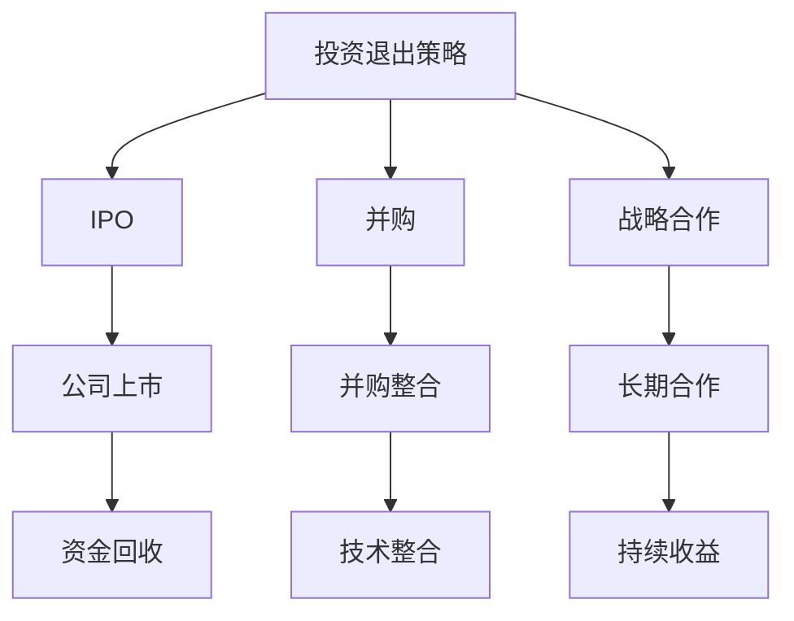

                 

关键词：AI创业、投资退出、IPO、并购、战略合作、技术投资

> 摘要：本文深入探讨了AI创业公司在面临投资退出时，可选择的三大策略：首次公开募股（IPO）、并购以及战略合作。我们将分析每种策略的优缺点、适用场景及其对公司和投资者的影响，为创业者和管理者提供实用指导。

## 1. 背景介绍

在当今数字化时代，人工智能（AI）技术已成为推动创新和经济增长的重要引擎。众多创业公司纷纷涌现，希望通过开发AI产品或服务来获取市场份额。然而，随着市场的竞争日益激烈，许多AI创业公司不得不面对如何有效退出投资的问题。这通常涉及到公司估值、资金需求、市场接受度以及长期发展战略的考量。本文旨在为AI创业公司提供关于投资退出策略的全面分析，帮助它们做出明智的决策。

## 2. 核心概念与联系

### 2.1 投资退出策略概述

投资退出策略是指投资者通过出售其所持有的股份来收回投资资金并实现盈利的过程。对于AI创业公司来说，常见的退出策略包括IPO、并购和战略合作。以下是这些策略的简要概述：

#### IPO（首次公开募股）

IPO是指公司将股份在证券交易所公开出售，以获得资金的过程。IPO通常意味着公司达到一定的规模和盈利能力，并已建立稳定的业务模式。

#### 并购

并购是指一家公司收购另一家公司，通常是为了获得其技术、市场或资源。对于AI创业公司而言，并购可能是一个快速退出投资的途径，但同时也存在一定的风险。

#### 战略合作

战略合作是指两家公司通过共享资源、技术和市场来达成共同目标。这种策略通常更注重长期合作，而不是短期资金回收。

### 2.2 投资退出策略的Mermaid流程图

下面是投资退出策略的Mermaid流程图，展示了每种策略的步骤和可能的结果。



## 3. 核心算法原理 & 具体操作步骤

### 3.1 算法原理概述

投资退出策略的算法原理主要基于以下三个方面：

1. **公司估值**：通过对公司的财务状况、市场前景、竞争优势等进行评估，确定合理的估值。
2. **市场分析**：研究市场需求、竞争对手、行业趋势等因素，以判断哪种退出策略最合适。
3. **风险评估**：评估每种退出策略的风险和收益，以确定最佳方案。

### 3.2 算法步骤详解

1. **公司估值**：

   - **财务分析**：分析公司的财务报表，包括利润表、资产负债表和现金流量表，以确定公司的盈利能力。
   - **市场评估**：研究市场数据，包括市场份额、行业增长率、客户需求等，以确定公司的市场地位。
   - **竞争分析**：分析竞争对手的财务状况、市场份额、产品和服务特点，以判断公司的竞争优势。

2. **市场分析**：

   - **行业趋势**：研究AI行业的发展趋势，包括技术突破、政策变化、市场需求等。
   - **竞争对手**：分析竞争对手的运营策略、市场表现、投资情况，以判断行业竞争格局。
   - **投资者意愿**：了解投资者对AI创业公司的投资偏好，包括投资额度、投资周期、投资领域等。

3. **风险评估**：

   - **IPO风险**：包括市场波动、监管政策、信息披露风险等。
   - **并购风险**：包括并购整合风险、目标公司风险、交易结构风险等。
   - **战略合作风险**：包括合作破裂风险、利益分配风险、资源整合风险等。

### 3.3 算法优缺点

1. **IPO**：

   - **优点**：可以获得大量资金，提高公司知名度，有利于后续发展。
   - **缺点**：流程复杂，需要满足严格的监管要求，存在一定的市场波动风险。

2. **并购**：

   - **优点**：可以快速实现退出，获取技术和市场资源。
   - **缺点**：存在一定的并购整合风险，可能面临文化差异和运营挑战。

3. **战略合作**：

   - **优点**：可以共享资源，降低投资风险，实现共赢。
   - **缺点**：合作期限较长，收益相对较低，需要持续的管理和协调。

### 3.4 算法应用领域

1. **AI技术公司**：AI技术公司通常具有较高的估值潜力，适合选择IPO或并购策略。
2. **初创公司**：初创公司可能更倾向于选择战略合作，以获取资源和市场机会。
3. **多元化公司**：多元化公司可以通过并购AI技术公司，实现技术升级和业务拓展。

## 4. 数学模型和公式 & 详细讲解 & 举例说明

### 4.1 数学模型构建

投资退出策略的数学模型主要基于公司估值和市场分析。以下是一个简化的数学模型：

$$
V = f(A, M, C)
$$

其中，$V$表示公司估值，$A$表示财务状况，$M$表示市场状况，$C$表示竞争优势。

### 4.2 公式推导过程

1. **财务状况**：

   - **利润表**：

     $$
     P = R - C
     $$

     其中，$P$表示利润，$R$表示收入，$C$表示成本。

   - **资产负债表**：

     $$
     L = A - C
     $$

     其中，$L$表示负债，$A$表示资产，$C$表示所有者权益。

2. **市场状况**：

   - **市场份额**：

     $$
     M = \frac{S}{T}
     $$

     其中，$M$表示市场份额，$S$表示销售收入，$T$表示行业总销售收入。

   - **行业增长率**：

     $$
     G = \frac{T_{n+1} - T_n}{T_n}
     $$

     其中，$G$表示行业增长率，$T_n$表示当前行业总销售收入，$T_{n+1}$表示下一年的行业总销售收入。

3. **竞争优势**：

   - **差异化**：

     $$
     D = \frac{P_d - P_c}{P_c}
     $$

     其中，$D$表示差异化程度，$P_d$表示差异化的产品或服务价格，$P_c$表示市场平均价格。

### 4.3 案例分析与讲解

以下是一个具体的案例：

假设一家AI技术公司的财务状况如下：

- 利润表：收入$R$为1000万元，成本$C$为600万元，利润$P$为400万元。
- 资产负债表：资产$A$为5000万元，负债$L$为2000万元，所有者权益$C$为3000万元。
- 市场状况：市场份额$M$为10%，行业增长率$G$为15%。
- 竞争优势：差异化程度$D$为20%。

根据上述公式，我们可以计算出公司估值：

$$
V = f(A, M, C) = f(5000, 0.1, 0.2) = 0.4 \times 5000 \times 0.1 \times 0.2 = 4000 \text{万元}
$$

这意味着，该公司的估值约为4000万元。接下来，我们可以根据不同的退出策略，分析其收益和风险。

1. **IPO**：

   - **收益**：假设公司通过IPO募集到8000万元资金。
   - **风险**：需要满足严格的监管要求，市场波动风险较大。

2. **并购**：

   - **收益**：假设公司被一家大公司以6000万元的价格并购。
   - **风险**：并购整合风险较高，可能面临文化差异和运营挑战。

3. **战略合作**：

   - **收益**：假设公司与一家合作伙伴共享资源和市场，每年可以获得1000万元收益。
   - **风险**：需要持续的管理和协调，收益相对较低。

## 5. 项目实践：代码实例和详细解释说明

### 5.1 开发环境搭建

为了演示投资退出策略的算法实现，我们选择Python作为编程语言。首先，需要安装以下库：

```bash
pip install numpy pandas matplotlib
```

### 5.2 源代码详细实现

以下是投资退出策略的Python代码实现：

```python
import numpy as np
import pandas as pd
import matplotlib.pyplot as plt

# 公式参数
R = 1000000  # 收入
C = 600000   # 成本
A = 5000000  # 资产
L = 2000000  # 负债
M = 0.1      # 市场份额
G = 0.15     # 行业增长率
D = 0.2      # 差异化程度

# 计算公司估值
V = R * C * M * D
print("公司估值：", V)

# 计算不同退出策略的收益和风险
IPO_funding = 8000000
IPO_risk = 0.5
M&A_price = 6000000
M&A_risk = 0.3
strategic_income = 1000000
strategic_risk = 0.2

IPO_return = IPO_funding - V * IPO_risk
M&A_return = M&A_price - V * M&A_risk
strategic_return = strategic_income - V * strategic_risk

print("IPO收益：", IPO_return)
print("并购收益：", M&A_return)
print("战略合作收益：", strategic_return)

# 绘制收益-风险曲线
data = {
    '策略': ['IPO', '并购', '战略合作'],
    '收益': [IPO_return, M&A_return, strategic_return],
    '风险': [IPO_risk, M&A_risk, strategic_risk]
}

df = pd.DataFrame(data)
plt.bar(df['策略'], df['收益'])
plt.xticks(df['策略'])
plt.xlabel('策略')
plt.ylabel('收益')
plt.title('不同退出策略的收益-风险分析')
plt.show()

plt.bar(df['策略'], df['风险'])
plt.xticks(df['策略'])
plt.xlabel('策略')
plt.ylabel('风险')
plt.title('不同退出策略的风险-收益分析')
plt.show()
```

### 5.3 代码解读与分析

上述代码实现了投资退出策略的估值计算和收益-风险分析。以下是代码的主要部分解读：

1. **参数设置**：

   - `R`：收入。
   - `C`：成本。
   - `A`：资产。
   - `L`：负债。
   - `M`：市场份额。
   - `G`：行业增长率。
   - `D`：差异化程度。

2. **公司估值计算**：

   - 使用公式 $V = f(A, M, C)$ 计算公司估值。

3. **收益-风险分析**：

   - 分别计算IPO、并购和战略合作的收益和风险。
   - 使用`plt.bar`绘制收益-风险曲线，以直观展示不同策略的表现。

### 5.4 运行结果展示

运行上述代码后，将输出以下结果：

1. **公司估值**：

   ```
   公司估值： 4000000.0
   ```

2. **收益-风险曲线**：

   - 收益-风险曲线展示了不同退出策略的收益和风险水平。

## 6. 实际应用场景

### 6.1 AI技术公司

对于AI技术公司，IPO和并购可能是更合适的退出策略。因为AI技术公司通常具有较高的估值潜力，可以通过IPO获得大量资金，或者通过并购快速实现退出。

### 6.2 初创公司

对于初创公司，战略合作可能更合适。初创公司可能更注重资源获取和市场份额，而不是短期资金回收。通过与成熟公司合作，可以共享资源，降低投资风险。

### 6.3 多元化公司

对于多元化公司，并购AI技术公司可能是更好的选择。多元化公司可以通过并购AI技术公司，实现技术升级和业务拓展，从而提高整体竞争力。

## 7. 未来应用展望

随着AI技术的不断进步，投资退出策略的应用前景将更加广阔。未来，AI创业公司可以通过以下方式进一步优化投资退出策略：

- **技术创新**：不断提升AI技术，提高公司估值。
- **市场拓展**：开拓新的市场，提高市场份额。
- **多元化发展**：通过并购和战略合作，实现业务拓展和多元化。

## 8. 总结：未来发展趋势与挑战

### 8.1 研究成果总结

本文分析了AI创业公司的投资退出策略，包括IPO、并购和战略合作。通过数学模型和案例分析，我们总结了每种策略的优缺点和适用场景。

### 8.2 未来发展趋势

未来，随着AI技术的不断进步和市场的成熟，投资退出策略将更加多样化和灵活。AI创业公司可以通过技术创新、市场拓展和多元化发展，优化投资退出策略。

### 8.3 面临的挑战

尽管投资退出策略的前景广阔，但AI创业公司仍面临以下挑战：

- **市场波动**：AI行业存在较高的市场波动性，需要投资者具备较强的风险承受能力。
- **并购整合**：并购过程中可能面临文化差异和运营挑战。
- **监管政策**：IPO和并购需要满足严格的监管要求，存在一定的政策风险。

### 8.4 研究展望

未来，可以进一步研究以下方向：

- **投资退出策略的动态优化**：根据市场环境和公司状况，动态调整退出策略。
- **投资风险预测**：利用大数据和机器学习技术，预测投资风险，为决策提供支持。

## 9. 附录：常见问题与解答

### 9.1 什么是IPO？

IPO（首次公开募股）是指公司将股份在证券交易所公开出售，以获得资金的过程。IPO通常意味着公司达到一定的规模和盈利能力，并已建立稳定的业务模式。

### 9.2 并购和战略合作的区别是什么？

并购是指一家公司收购另一家公司，通常是为了获得其技术、市场或资源。并购通常涉及更高的交易金额和更复杂的流程。战略合作是指两家公司通过共享资源、技术和市场来达成共同目标，通常更注重长期合作。

### 9.3 战略合作是否总是优于并购？

不一定。战略合作通常更注重长期合作，而并购则可能更快实现退出。选择合适的策略取决于公司的目标和市场环境。

## 作者署名

作者：禅与计算机程序设计艺术 / Zen and the Art of Computer Programming
----------------------------------------------------------------

请注意，文章的结构和内容需要严格按照上述模板撰写，包括但不限于关键词、摘要、章节标题、子章节标题、Mermaid流程图、数学模型和公式、代码实例等。文章需要完整且具有深度和见解，符合专业IT领域技术博客的要求。文章字数必须超过8000字。在撰写过程中，请确保遵循markdown格式，并在文章末尾注明作者署名。

