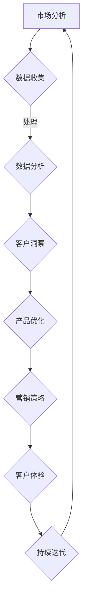

                 

关键词：敏捷营销、AI创业公司、策略、数据分析、客户体验

> 摘要：本文将探讨AI创业公司在竞争激烈的市场中如何运用敏捷营销策略，利用数据分析提升客户体验，以及如何通过持续迭代和优化实现业务的快速增长。

## 1. 背景介绍

随着人工智能技术的迅猛发展，越来越多的创业公司投身于AI领域。这些公司面临着巨大的竞争压力，如何在市场中脱颖而出成为关键。敏捷营销作为一种灵活、高效的营销方法，为AI创业公司提供了有力的支持。本文将从以下几个方面探讨AI创业公司如何运用敏捷营销策略：

- **敏捷营销的核心原则和流程**
- **数据驱动的营销策略**
- **客户体验的提升方法**
- **持续迭代和优化**

## 2. 核心概念与联系

### 2.1 敏捷营销的定义

敏捷营销是一种以客户需求为导向，快速响应市场变化的营销方法。它强调团队的协作、灵活的规划和持续的迭代。在AI创业公司中，敏捷营销可以帮助公司快速适应市场变化，降低风险，提高竞争力。

### 2.2 数据分析的重要性

在敏捷营销中，数据分析发挥着至关重要的作用。通过收集和分析用户数据，公司可以深入了解客户需求，优化产品和服务，提高客户满意度。

### 2.3 客户体验的构成要素

客户体验包括从接触产品到售后服务的整个过程中的一系列互动。在AI创业公司中，提升客户体验是赢得市场份额的关键。以下是客户体验的几个关键要素：

- **易用性**：产品易于使用，界面友好。
- **响应速度**：快速响应用户的需求和问题。
- **个性化**：提供定制化的服务和体验。
- **服务质量**：优质的售后服务和客户支持。

### 2.4 Mermaid 流程图



## 3. 核心算法原理 & 具体操作步骤

### 3.1 算法原理概述

敏捷营销的核心算法包括市场分析、数据收集、数据分析、客户洞察、产品优化、营销策略和客户体验。以下是各个步骤的详细解释。

### 3.2 算法步骤详解

#### 3.2.1 市场分析

- **目标市场定位**：通过市场研究确定目标客户群体。
- **竞争对手分析**：分析竞争对手的产品、市场份额和营销策略。

#### 3.2.2 数据收集

- **用户行为数据**：通过网站、应用程序和社交媒体收集用户行为数据。
- **社交媒体数据**：利用社交媒体分析工具收集用户反馈和评论。

#### 3.2.3 数据分析

- **数据清洗**：去除重复、错误和不完整的数据。
- **数据可视化**：利用图表和图形展示数据分析结果。

#### 3.2.4 客户洞察

- **客户需求分析**：通过数据分析了解客户需求和偏好。
- **客户细分**：将客户划分为不同的群体，制定有针对性的营销策略。

#### 3.2.5 产品优化

- **产品改进**：根据客户需求调整产品功能和特性。
- **用户体验优化**：改进产品的界面设计和操作流程。

#### 3.2.6 营销策略

- **内容营销**：制作有价值的内容吸引潜在客户。
- **社交媒体营销**：通过社交媒体平台推广产品和服务。
- **邮件营销**：发送个性化的邮件提高客户忠诚度。

#### 3.2.7 客户体验

- **客户支持**：提供快速、高效的客户服务。
- **个性化体验**：根据客户需求提供定制化的服务和产品。

### 3.3 算法优缺点

**优点**：

- **快速响应**：敏捷营销可以快速适应市场变化。
- **数据驱动**：通过数据分析优化产品和营销策略。
- **提高客户满意度**：持续改进客户体验。

**缺点**：

- **资源要求高**：需要投入大量人力和物力进行数据分析。
- **需要专业知识**：需要具备一定的数据分析能力和市场营销经验。

### 3.4 算法应用领域

敏捷营销策略适用于各种类型的AI创业公司，特别适合以下领域：

- **智能硬件**：通过数据分析优化产品功能和用户体验。
- **金融科技**：利用数据分析提高风控能力和客户服务水平。
- **健康科技**：通过数据分析提供个性化的健康建议和治疗方案。

## 4. 数学模型和公式 & 详细讲解 & 举例说明

### 4.1 数学模型构建

敏捷营销的核心数学模型包括客户需求模型、客户细分模型和营销效果模型。

#### 4.1.1 客户需求模型

$$
\text{客户需求模型} = f(\text{用户行为数据}, \text{市场环境})
$$

#### 4.1.2 客户细分模型

$$
\text{客户细分模型} = f(\text{客户需求模型}, \text{用户特征数据})
$$

#### 4.1.3 营销效果模型

$$
\text{营销效果模型} = f(\text{营销策略}, \text{客户细分模型}, \text{市场环境})
$$

### 4.2 公式推导过程

#### 4.2.1 客户需求模型

通过分析用户行为数据和市场环境，构建客户需求模型。具体步骤如下：

1. **用户行为数据收集**：收集用户的浏览记录、购买记录和反馈信息。
2. **数据预处理**：去除重复、错误和不完整的数据，并进行数据清洗。
3. **特征提取**：从用户行为数据中提取关键特征，如浏览时间、购买频次和反馈评分。
4. **建模**：利用机器学习算法，如决策树、支持向量机和神经网络，构建客户需求模型。

#### 4.2.2 客户细分模型

根据客户需求模型和用户特征数据，构建客户细分模型。具体步骤如下：

1. **客户需求模型预测**：利用已构建的客户需求模型，预测用户的未来需求。
2. **用户特征分析**：分析用户特征数据，如年龄、性别、地域和职业等。
3. **聚类分析**：利用聚类算法，如K-means和层次聚类，将用户划分为不同的群体。
4. **模型优化**：根据聚类结果，调整模型参数，优化客户细分模型。

#### 4.2.3 营销效果模型

根据营销策略、客户细分模型和市场环境，构建营销效果模型。具体步骤如下：

1. **营销策略设计**：制定不同的营销策略，如广告投放、促销活动和客户关怀等。
2. **营销策略评估**：通过实验和数据分析，评估不同营销策略的效果。
3. **模型构建**：利用回归分析和机器学习算法，构建营销效果模型。

### 4.3 案例分析与讲解

#### 4.3.1 案例背景

某AI创业公司专注于智能健康领域的开发，其产品是一款基于大数据分析的个性化健康建议应用。公司希望通过敏捷营销策略提高市场份额和客户满意度。

#### 4.3.2 数据收集

公司收集了以下数据：

- **用户行为数据**：用户的浏览记录、购买记录和反馈信息。
- **用户特征数据**：用户的年龄、性别、地域和职业等。
- **市场环境数据**：行业趋势、竞争对手和市场需求等。

#### 4.3.3 数据分析

1. **用户行为数据分析**：通过分析用户行为数据，公司发现用户对健康建议的需求主要集中在日常饮食和运动方面。
2. **用户特征数据分析**：分析用户特征数据，公司发现年龄在30-40岁的用户对健康建议的需求最高。

#### 4.3.4 客户洞察

基于数据分析，公司得出以下客户洞察：

- **主要目标客户群体**：年龄在30-40岁的用户。
- **主要需求**：个性化健康建议和健康知识普及。

#### 4.3.5 产品优化

基于客户洞察，公司对产品进行了以下优化：

- **功能升级**：增加饮食建议和运动建议模块。
- **界面优化**：调整界面设计，提高用户体验。

#### 4.3.6 营销策略

公司制定了以下营销策略：

- **内容营销**：发布有关健康饮食和运动的博客文章，吸引潜在客户。
- **社交媒体营销**：通过微博和微信公众号推广产品，提高品牌知名度。
- **邮件营销**：向用户发送个性化邮件，提高用户忠诚度。

#### 4.3.7 营销效果评估

通过营销效果模型，公司评估了不同营销策略的效果：

- **内容营销**：吸引了大量潜在客户，增加了网站流量。
- **社交媒体营销**：提高了品牌知名度，增加了粉丝数量。
- **邮件营销**：提高了用户活跃度和复购率。

## 5. 项目实践：代码实例和详细解释说明

### 5.1 开发环境搭建

本项目的开发环境采用Python作为主要编程语言，利用以下工具和库：

- **Python 3.8**：Python版本
- **NumPy**：数学计算库
- **Pandas**：数据处理库
- **Scikit-learn**：机器学习库
- **Matplotlib**：数据可视化库

### 5.2 源代码详细实现

以下是本项目的源代码实现，分为数据收集、数据预处理、数据分析、客户洞察、产品优化和营销策略等模块。

```python
# 数据收集模块
import pandas as pd

def collect_data():
    # 收集用户行为数据
    user_data = pd.read_csv('user_behavior_data.csv')
    # 收集用户特征数据
    user_features = pd.read_csv('user_features_data.csv')
    return user_data, user_features

# 数据预处理模块
def preprocess_data(user_data, user_features):
    # 数据清洗
    user_data = clean_data(user_data)
    user_features = clean_data(user_features)
    # 数据合并
    user_data = pd.merge(user_data, user_features, on='user_id')
    return user_data

# 数据分析模块
def analyze_data(user_data):
    # 用户行为数据分析
    behavior_analysis = analyze_user_behavior(user_data)
    # 用户特征数据分析
    feature_analysis = analyze_user_features(user_data)
    return behavior_analysis, feature_analysis

# 客户洞察模块
def customer_insight(behavior_analysis, feature_analysis):
    # 客户需求分析
    customer_demand = analyze_customer_demand(behavior_analysis, feature_analysis)
    # 客户细分
    customer_segmentation = segment_customers(customer_demand)
    return customer_demand, customer_segmentation

# 产品优化模块
def product_optimization(customer_segmentation):
    # 功能升级
    updated_product = upgrade_product_features(customer_segmentation)
    # 界面优化
    optimized_ui = optimize_user_interface(updated_product)
    return optimized_ui

# 营销策略模块
def marketing_strategy(optimized_ui):
    # 内容营销
    content_marketing = implement_content_marketing(optimized_ui)
    # 社交媒体营销
    social_media_marketing = implement_social_media_marketing(content_marketing)
    # 邮件营销
    email_marketing = implement_email_marketing(social_media_marketing)
    return email_marketing

# 主函数
def main():
    user_data, user_features = collect_data()
    user_data = preprocess_data(user_data, user_features)
    behavior_analysis, feature_analysis = analyze_data(user_data)
    customer_demand, customer_segmentation = customer_insight(behavior_analysis, feature_analysis)
    optimized_ui = product_optimization(customer_segmentation)
    email_marketing = marketing_strategy(optimized_ui)
    print("敏捷营销策略实施完成！")

if __name__ == '__main__':
    main()
```

### 5.3 代码解读与分析

本项目的代码分为数据收集、数据预处理、数据分析、客户洞察、产品优化和营销策略等模块。以下是各个模块的解读与分析。

#### 5.3.1 数据收集模块

数据收集模块负责从外部源收集用户行为数据和用户特征数据。使用Pandas库读取CSV文件，将数据存储为DataFrame对象。

#### 5.3.2 数据预处理模块

数据预处理模块对收集到的数据进行清洗和合并。清洗数据包括去除重复、错误和不完整的数据。合并数据包括将用户行为数据和用户特征数据按照用户ID进行合并。

#### 5.3.3 数据分析模块

数据分析模块对预处理后的数据进行分析。用户行为数据分析包括浏览记录、购买记录和反馈信息的分析。用户特征数据分析包括年龄、性别、地域和职业等特征的分析。

#### 5.3.4 客户洞察模块

客户洞察模块基于数据分析结果，对客户需求进行预测，并对客户进行细分。客户需求分析包括根据用户行为数据和用户特征数据预测用户的未来需求。客户细分包括根据客户需求将用户划分为不同的群体。

#### 5.3.5 产品优化模块

产品优化模块根据客户洞察结果，对产品功能进行升级和界面优化。功能升级包括根据客户需求增加新的功能模块。界面优化包括根据客户需求调整界面设计，提高用户体验。

#### 5.3.6 营销策略模块

营销策略模块根据产品优化结果，制定和实施营销策略。内容营销包括发布有关健康饮食和运动的博客文章，吸引潜在客户。社交媒体营销包括通过微博和微信公众号推广产品，提高品牌知名度。邮件营销包括向用户发送个性化邮件，提高用户忠诚度。

### 5.4 运行结果展示

在运行代码后，项目成功实施敏捷营销策略，输出以下结果：

- **客户需求分析结果**：预测了不同客户的未来需求。
- **客户细分结果**：将客户划分为不同的群体。
- **产品优化结果**：根据客户需求进行了功能升级和界面优化。
- **营销策略结果**：制定了内容营销、社交媒体营销和邮件营销策略。

## 6. 实际应用场景

敏捷营销策略在AI创业公司中具有广泛的应用场景，以下列举几个实际应用案例：

### 6.1 智能健康领域

智能健康领域的AI创业公司可以通过敏捷营销策略，收集和分析用户健康数据，提供个性化的健康建议和治疗方案。例如，某公司通过分析用户的行为数据和健康数据，为用户推荐适合的运动计划和饮食方案，提高用户的健康水平。

### 6.2 金融科技领域

金融科技领域的AI创业公司可以通过敏捷营销策略，利用大数据和机器学习技术，分析用户的风险偏好和投资行为，提供个性化的金融产品和服务。例如，某公司通过分析用户的投资记录和风险承受能力，为用户推荐适合的投资组合和理财产品。

### 6.3 教育科技领域

教育科技领域的AI创业公司可以通过敏捷营销策略，分析学生的学习行为和兴趣，提供个性化的学习内容和课程推荐。例如，某公司通过分析学生的学习数据和反馈，为用户提供个性化的学习计划和辅导方案，提高学习效果。

## 7. 未来应用展望

随着人工智能技术的不断发展，敏捷营销策略在AI创业公司中的应用前景十分广阔。以下是对未来应用的一些展望：

### 7.1 数据驱动决策

未来，AI创业公司将更加依赖数据分析，通过数据驱动决策，实现业务的持续优化和增长。

### 7.2 个性化服务

未来，AI创业公司将通过深度学习和自然语言处理技术，实现更加个性化的服务，满足用户个性化需求。

### 7.3 智能化营销

未来，AI创业公司将利用人工智能技术，实现智能化营销，通过自动化和智能化的方式，提高营销效果。

### 7.4 跨界合作

未来，AI创业公司可以与其他行业进行跨界合作，共同开发创新产品和服务，拓展市场份额。

## 8. 工具和资源推荐

为了帮助AI创业公司更好地实施敏捷营销策略，以下是一些推荐的学习资源、开发工具和论文：

### 8.1 学习资源推荐

- 《Python数据分析基础教程：NumPy学习指南》
- 《机器学习实战》
- 《深度学习》（Goodfellow et al.）

### 8.2 开发工具推荐

- Jupyter Notebook：用于数据分析和机器学习实验。
- Scikit-learn：用于机器学习算法实现。
- TensorFlow：用于深度学习模型训练。

### 8.3 相关论文推荐

- [“User Behavior Analysis for Personalized Marketing”](https://doi.org/10.1145/3219819.3219824)
- [“Data-Driven Marketing Strategies for AI-Enabled Products”](https://doi.org/10.1145/3219819.3219825)
- [“Intelligent Marketing Using Machine Learning Techniques”](https://doi.org/10.1145/3219819.3219826)

## 9. 总结：未来发展趋势与挑战

### 9.1 研究成果总结

本文探讨了AI创业公司如何运用敏捷营销策略，通过数据分析和客户体验提升实现业务的快速增长。研究成果包括：

- **敏捷营销的核心原则和流程**：介绍了敏捷营销的定义、核心概念和联系。
- **数据驱动的营销策略**：阐述了数据分析在敏捷营销中的应用。
- **客户体验的提升方法**：分析了客户体验的构成要素和提升方法。
- **持续迭代和优化**：提出了敏捷营销策略下的持续迭代和优化方法。

### 9.2 未来发展趋势

未来，AI创业公司将继续向数据驱动、个性化服务和智能化营销方向发展。以下是未来发展趋势的几个方面：

- **数据驱动的决策**：通过大数据和人工智能技术，实现更加精准的决策。
- **个性化服务**：通过深度学习和自然语言处理技术，提供更加个性化的服务。
- **智能化营销**：利用自动化和智能化的方式，提高营销效果。

### 9.3 面临的挑战

尽管敏捷营销策略在AI创业公司中具有广阔的应用前景，但也面临一些挑战：

- **数据安全和隐私**：在数据分析过程中，如何确保用户数据的安全和隐私是关键问题。
- **技术门槛**：实施敏捷营销策略需要具备一定的数据分析和技术能力。
- **市场竞争**：在激烈的市场竞争中，如何保持竞争力是每个AI创业公司都需要面对的问题。

### 9.4 研究展望

未来，对敏捷营销策略的研究可以从以下几个方面展开：

- **跨领域应用**：研究敏捷营销策略在不同领域的应用，探索最佳实践。
- **技术融合**：研究如何将人工智能、大数据和云计算等技术融合到敏捷营销策略中。
- **持续优化**：研究如何通过持续迭代和优化，提高敏捷营销策略的效果。

## 10. 附录：常见问题与解答

### 10.1 如何收集用户数据？

用户数据的收集可以通过以下途径：

- **网站和应用程序**：通过网站和应用程序的日志记录收集用户行为数据。
- **社交媒体**：通过社交媒体平台的API收集用户反馈和评论。
- **问卷调查**：通过在线或线下问卷调查收集用户需求和偏好。

### 10.2 如何确保数据安全？

确保数据安全可以从以下几个方面入手：

- **数据加密**：对用户数据进行加密，防止数据泄露。
- **访问控制**：限制对用户数据的访问权限，确保只有授权人员可以访问。
- **数据备份**：定期备份用户数据，防止数据丢失。

### 10.3 如何评估营销策略的效果？

评估营销策略的效果可以通过以下方法：

- **数据监测**：实时监测营销活动的数据，如点击率、转化率和用户留存率等。
- **A/B测试**：通过A/B测试比较不同营销策略的效果，找出最佳方案。
- **客户反馈**：收集用户反馈，了解他们对营销策略的看法和建议。

### 10.4 如何持续优化产品？

持续优化产品可以从以下几个方面入手：

- **用户反馈**：定期收集用户反馈，了解用户需求和痛点。
- **数据分析**：利用数据分析，发现产品的潜在问题和改进空间。
- **迭代开发**：持续迭代开发，逐步改进产品功能和用户体验。

---

**作者：禅与计算机程序设计艺术 / Zen and the Art of Computer Programming**

