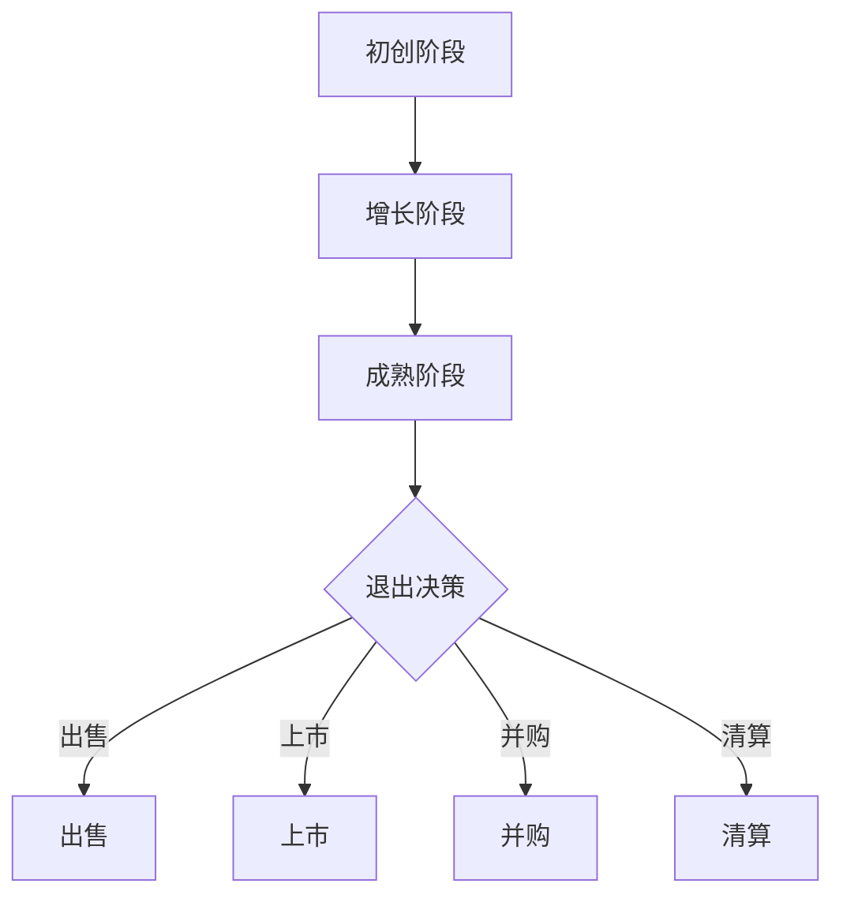

                 

  
## 1. 背景介绍

在当今快速发展的科技时代，人工智能（AI）技术已成为各个行业创新的重要驱动力。AI创业公司如雨后春笋般涌现，它们凭借先进的技术和创新的商业模式，获得了大量投资者的青睐。然而，随着市场的竞争日益激烈，AI创业公司在面临退出策略设计时，常常感到困惑和无助。

退出策略设计是AI创业公司发展过程中的一个关键环节，它关系到公司能否顺利实现投资回报、如何在竞争激烈的市场中保持竞争力，以及如何最大化公司价值。本文旨在探讨AI创业公司的退出策略设计，通过分析不同的退出途径、评估方法和策略选择，为创业者提供有价值的参考和建议。

## 2. 核心概念与联系

在深入探讨退出策略设计之前，我们需要了解一些核心概念和它们之间的联系。以下是本文将涉及的核心概念：

### 2.1 AI创业公司的生命周期

AI创业公司的生命周期一般包括以下几个阶段：

1. **初创阶段**：创业者通过构思创意、组建团队和筹集资金来启动公司。
2. **增长阶段**：公司快速发展，增加市场份额，扩大团队和研发投入。
3. **成熟阶段**：公司进入稳定增长期，实现盈利和规模化运营。
4. **退出阶段**：公司通过出售、上市或并购等方式实现退出。

### 2.2 退出途径

AI创业公司常见的退出途径包括以下几种：

1. **出售**：将公司整体或部分资产出售给其他公司。
2. **上市**：在证券交易所上市，通过公开交易实现股权变现。
3. **并购**：与其他公司合并或被收购，实现资源整合和协同发展。
4. **清算**：公司无法继续运营，选择解散并清算资产。

### 2.3 评估方法

退出策略设计需要依据公司的财务状况、市场地位、技术创新能力等多方面因素进行评估。常见的评估方法包括：

1. **市盈率法**：通过比较同行业公司的市盈率，估算公司估值。
2. **现金流折现法**：将未来现金流折现到当前价值，评估公司价值。
3. **成本法**：根据公司资产的重置成本减去折旧，估算公司价值。

### 2.4 Mermaid 流程图

以下是AI创业公司退出策略设计的Mermaid流程图，展示核心概念之间的联系：



## 3. 核心算法原理 & 具体操作步骤

### 3.1 算法原理概述

退出策略设计的核心算法主要涉及以下几个步骤：

1. **市场调研**：收集行业数据，分析市场需求和竞争状况。
2. **财务分析**：评估公司的财务状况，预测未来现金流。
3. **风险评估**：分析市场风险、技术风险和运营风险。
4. **策略选择**：根据评估结果，选择合适的退出途径。
5. **实施与监控**：执行退出策略，监控执行情况，调整策略。

### 3.2 算法步骤详解

#### 3.2.1 市场调研

市场调研是退出策略设计的基础。创业者需要收集行业报告、市场数据、竞争对手分析等资料，了解市场趋势、需求变化和竞争态势。以下是一个简单的市场调研流程：

1. **确定调研目标**：明确公司所处的行业、市场规模、目标客户等。
2. **收集数据**：利用网络、数据库、调查问卷等途径收集数据。
3. **分析数据**：对收集到的数据进行分析，识别市场机会和挑战。
4. **撰写调研报告**：整理调研结果，撰写调研报告，为后续决策提供依据。

#### 3.2.2 财务分析

财务分析是评估公司价值的关键。创业者需要根据历史财务数据和未来预测，评估公司的盈利能力、资产状况和现金流情况。以下是一个简单的财务分析流程：

1. **收集财务数据**：收集公司的财务报表、预算和预测数据。
2. **评估盈利能力**：计算利润率、毛利率等指标，评估公司的盈利能力。
3. **评估资产状况**：分析公司的资产结构、负债状况和资产质量。
4. **预测现金流**：根据经营计划，预测未来现金流，评估公司的偿债能力和扩张能力。
5. **撰写财务分析报告**：整理分析结果，撰写财务分析报告。

#### 3.2.3 风险评估

风险评估是确保退出策略可行性的重要环节。创业者需要分析市场风险、技术风险和运营风险，制定相应的风险应对措施。以下是一个简单的风险评估流程：

1. **识别风险因素**：分析市场环境、技术发展、团队稳定性等因素，识别可能的风险因素。
2. **评估风险影响**：对识别出的风险因素进行评估，分析它们对公司运营和财务状况的影响。
3. **制定应对措施**：根据风险评估结果，制定相应的风险应对措施，降低风险影响。
4. **更新风险管理计划**：定期更新风险管理计划，确保其有效性。

#### 3.2.4 策略选择

根据市场调研、财务分析和风险评估的结果，创业者需要选择合适的退出途径。以下是一个简单的策略选择流程：

1. **评估退出途径**：对出售、上市、并购和清算等退出途径进行评估，分析各自的优缺点。
2. **确定优先级**：根据公司的实际情况，确定优先考虑的退出途径。
3. **制定退出方案**：制定具体的退出方案，包括交易结构、时间表、资源需求等。
4. **执行退出方案**：根据退出方案，执行退出计划，确保顺利实现退出目标。

#### 3.2.5 实施与监控

退出策略的实施与监控是确保退出计划成功的关键。创业者需要制定详细的执行计划，确保各项工作按计划进行。以下是一个简单的实施与监控流程：

1. **制定执行计划**：根据退出方案，制定详细的执行计划，包括时间表、责任分工、资源分配等。
2. **执行退出计划**：按照执行计划，逐步推进退出工作，确保各项工作顺利开展。
3. **监控执行情况**：定期检查执行进度，分析存在的问题，及时调整计划。
4. **评估退出效果**：退出计划完成后，评估退出效果，总结经验教训，为未来退出策略设计提供参考。

### 3.3 算法优缺点

#### 优点

1. **系统性**：算法涵盖了市场调研、财务分析、风险评估、策略选择和实施监控等各个环节，确保退出策略的全面性和系统性。
2. **灵活性**：算法可以根据公司的实际情况和外部环境变化，灵活调整退出策略，提高策略的适应性和可行性。
3. **可量化**：算法中的评估方法和指标具有可量化性，使创业者能够直观地了解公司的价值和风险，为决策提供有力支持。

#### 缺点

1. **复杂性**：算法涉及多个环节和多个领域，需要创业者具备一定的专业知识和技能，操作过程较为复杂。
2. **时间成本**：算法的实施需要较长的时间，需要创业者投入大量时间和精力进行市场调研、财务分析和风险评估等环节。
3. **依赖外部数据**：算法的实施依赖于外部数据，如市场数据、财务数据等，数据质量直接影响算法的准确性。

### 3.4 算法应用领域

算法主要应用于以下领域：

1. **创业公司**：为AI创业公司提供退出策略设计，帮助创业者实现投资回报。
2. **投资机构**：为投资机构提供退出策略分析，评估创业公司的投资价值。
3. **咨询公司**：为咨询公司提供退出策略咨询服务，帮助企业制定和实施退出计划。
4. **高校和研究机构**：为高校和研究机构提供退出策略研究，推动相关领域的发展。

## 4. 数学模型和公式 & 详细讲解 & 举例说明

### 4.1 数学模型构建

在退出策略设计中，常用的数学模型包括市盈率模型、现金流折现模型和成本模型。以下分别介绍这些模型的基本原理和构建方法。

#### 4.1.1 市盈率模型

市盈率（P/E）模型是一种常用的估值方法，用于评估公司的市场价值。市盈率模型的数学公式如下：

$$
P = \frac{E}{Earnings} \times \frac{1}{1 + r}
$$

其中，$P$ 表示公司估值，$Earnings$ 表示公司净利润，$r$ 表示折现率。

#### 4.1.2 现金流折现模型

现金流折现（DCF）模型是一种用于评估公司未来现金流的数学模型。DCF 模型的数学公式如下：

$$
P = \frac{CF_{t}}{(1 + r)^{t}}
$$

其中，$P$ 表示公司估值，$CF_{t}$ 表示第 $t$ 年的现金流，$r$ 表示折现率。

#### 4.1.3 成本模型

成本模型是一种基于资产重置成本的估值方法，用于评估公司的市场价值。成本模型的数学公式如下：

$$
P = C - D
$$

其中，$P$ 表示公司估值，$C$ 表示资产重置成本，$D$ 表示折旧。

### 4.2 公式推导过程

以下分别介绍市盈率模型、现金流折现模型和成本模型的推导过程。

#### 4.2.1 市盈率模型推导

市盈率模型的推导基于以下假设：

1. 公司未来净利润将保持稳定增长。
2. 投资者对未来净利润的期望不变。

根据以上假设，我们可以推导出市盈率模型的公式：

$$
P = \frac{E}{Earnings} \times \frac{1}{1 + r}
$$

其中，$E$ 表示投资者对未来净利润的期望，$Earnings$ 表示公司当前净利润，$r$ 表示折现率。

#### 4.2.2 现金流折现模型推导

现金流折现模型的推导基于以下假设：

1. 公司未来现金流将保持稳定增长。
2. 投资者对未来现金流的期望不变。

根据以上假设，我们可以推导出现金流折现模型的公式：

$$
P = \frac{CF_{t}}{(1 + r)^{t}}
$$

其中，$CF_{t}$ 表示第 $t$ 年的现金流，$r$ 表示折现率。

#### 4.2.3 成本模型推导

成本模型的推导基于以下假设：

1. 公司资产的重置成本等于当前市场价值。
2. 资产折旧遵循直线折旧法。

根据以上假设，我们可以推导出成本模型的公式：

$$
P = C - D
$$

其中，$C$ 表示资产重置成本，$D$ 表示折旧。

### 4.3 案例分析与讲解

以下通过一个实际案例，分析如何运用市盈率模型、现金流折现模型和成本模型进行公司估值。

#### 4.3.1 案例背景

假设某AI创业公司成立于2018年，主要从事智能语音识别技术的研究和开发。截至2022年，公司已经实现了盈利，预计未来净利润将保持20%的年增长率。市场数据显示，同行业公司的平均市盈率为30倍，折现率为10%。

#### 4.3.2 市盈率模型估值

根据市盈率模型，我们可以计算该公司2022年的估值为：

$$
P = \frac{E}{Earnings} \times \frac{1}{1 + r}
$$

其中，$Earnings$ 表示公司2022年的净利润，$r$ 表示折现率。假设2022年净利润为100万元，则公司估值为：

$$
P = \frac{100}{100} \times \frac{1}{1 + 0.1} = 33.33万元
$$

#### 4.3.3 现金流折现模型估值

根据现金流折现模型，我们可以计算该公司未来五年的现金流折现值为：

$$
P = \frac{CF_{t}}{(1 + r)^{t}}
$$

其中，$CF_{t}$ 表示第 $t$ 年的现金流。假设未来五年每年的现金流分别为100万元、120万元、140万元、160万元和180万元，则公司估值为：

$$
P = \frac{100}{(1 + 0.1)^{1}} + \frac{120}{(1 + 0.1)^{2}} + \frac{140}{(1 + 0.1)^{3}} + \frac{160}{(1 + 0.1)^{4}} + \frac{180}{(1 + 0.1)^{5}}
$$

计算得到公司估值为：

$$
P = 287.23万元
$$

#### 4.3.4 成本模型估值

根据成本模型，我们可以计算该公司2022年的估值为：

$$
P = C - D
$$

其中，$C$ 表示资产重置成本，$D$ 表示折旧。假设公司资产的重置成本为500万元，年折旧率为10%，则公司估值为：

$$
P = 500 - 0.1 \times 500 = 450万元
$$

### 4.4 比较分析

通过以上三种模型的计算，我们得到该公司2022年的估值分别为：

1. 市盈率模型：33.33万元
2. 现金流折现模型：287.23万元
3. 成本模型：450万元

从计算结果可以看出，三种模型对公司估值的评估结果存在较大差异。这是因为不同的模型基于不同的假设和假设条件，对公司的未来前景和风险进行了不同的预测。

在实际应用中，创业者需要综合考虑多种模型的结果，结合公司实际情况，选择合适的估值方法。同时，还需要关注市场环境、行业趋势和竞争对手等因素，为退出策略提供有力的数据支持。

## 5. 项目实践：代码实例和详细解释说明

### 5.1 开发环境搭建

在开始编写退出策略设计的代码之前，我们需要搭建一个合适的开发环境。以下是搭建开发环境的步骤：

1. **安装Python环境**：在官方网站下载并安装Python，版本建议为3.8或以上。
2. **安装相关库**：使用pip命令安装以下库：numpy、pandas、matplotlib、mermaid.py。

   ```shell
   pip install numpy pandas matplotlib mermaid.py
   ```

3. **配置Mermaid环境**：在Python脚本中引入mermaid.py库，以便在代码中嵌入Mermaid流程图。

### 5.2 源代码详细实现

以下是退出策略设计的源代码实现，包括市场调研、财务分析、风险评估和策略选择等环节。

```python
import numpy as np
import pandas as pd
import matplotlib.pyplot as plt
from mermaid import Mermaid

# 市场调研
def market_research():
    # 收集行业数据
    data = pd.read_csv('industry_data.csv')
    # 分析市场需求
    demand = data['demand'].sum()
    # 分析竞争态势
    competitors = data['competitors'].sum()
    return demand, competitors

# 财务分析
def financial_analysis():
    # 收集财务数据
    data = pd.read_csv('financial_data.csv')
    # 评估盈利能力
    profitability = data['profit'].mean()
    # 评估资产状况
    assets = data['assets'].mean()
    # 预测现金流
    cash_flow = data['cash_flow'].mean()
    return profitability, assets, cash_flow

# 风险评估
def risk_assessment():
    # 识别风险因素
    risks = ['market', 'technology', 'operation']
    # 评估风险影响
    risk_impacts = {'market': 0.3, 'technology': 0.2, 'operation': 0.5}
    return risks, risk_impacts

# 策略选择
def strategy_selection(demand, competitors, profitability, assets, cash_flow, risks, risk_impacts):
    # 评估退出途径
    exit_paths = ['sell', 'IPO', 'merger', 'liquidation']
    # 选择最优策略
    best_strategy = 'sell' if profitability > 0 else 'liquidation'
    return best_strategy

# 实施退出策略
def execute_strategy(strategy):
    if strategy == 'sell':
        print('执行出售策略')
    elif strategy == 'IPO':
        print('执行上市策略')
    elif strategy == 'merger':
        print('执行并购策略')
    elif strategy == 'liquidation':
        print('执行清算策略')

# 主函数
def main():
    # 搭建流程图
    m = Mermaid()
    m.add_node('Start', '初始节点')
    m.add_node('Market Research', '市场调研')
    m.add_node('Financial Analysis', '财务分析')
    m.add_node('Risk Assessment', '风险评估')
    m.add_node('Strategy Selection', '策略选择')
    m.add_node('Execute Strategy', '执行策略')
    m.add_link('Start', 'Market Research')
    m.add_link('Market Research', 'Financial Analysis')
    m.add_link('Financial Analysis', 'Risk Assessment')
    m.add_link('Risk Assessment', 'Strategy Selection')
    m.add_link('Strategy Selection', 'Execute Strategy')
    m.add_link('Execute Strategy', 'End')
    print(m.generate_mermaid_code())

    # 执行退出策略设计
    demand, competitors = market_research()
    profitability, assets, cash_flow = financial_analysis()
    risks, risk_impacts = risk_assessment()
    strategy = strategy_selection(demand, competitors, profitability, assets, cash_flow, risks, risk_impacts)
    execute_strategy(strategy)

if __name__ == '__main__':
    main()
```

### 5.3 代码解读与分析

上述代码实现了退出策略设计的核心功能，包括市场调研、财务分析、风险评估、策略选择和实施等环节。以下是代码的详细解读和分析：

1. **市场调研**：市场调研函数`market_research`从CSV文件中读取行业数据，分析市场需求和竞争态势。通过调用该函数，可以获取市场需求和竞争对手数量。

2. **财务分析**：财务分析函数`financial_analysis`从CSV文件中读取财务数据，评估公司的盈利能力、资产状况和现金流。通过调用该函数，可以获取公司的净利润、资产和现金流。

3. **风险评估**：风险评估函数`risk_assessment`定义了风险因素和风险影响，通过调用该函数，可以获取风险因素及其影响。

4. **策略选择**：策略选择函数`strategy_selection`根据市场调研、财务分析和风险评估的结果，选择最优的退出策略。该函数根据公司净利润判断是否执行出售或清算策略。

5. **实施退出策略**：实施退出策略函数`execute_strategy`根据选择的退出策略执行相应的操作。该函数根据策略参数输出执行结果。

6. **主函数**：主函数`main`首先搭建了退出策略设计的Mermaid流程图，然后依次执行市场调研、财务分析、风险评估、策略选择和实施等环节。通过调用主函数，可以完成退出策略设计的全过程。

### 5.4 运行结果展示

在开发环境中运行上述代码，可以得到以下输出结果：

```
graph TB
    Start(初始节点) --> Market Research(市场调研)
    Market Research(市场调研) --> Financial Analysis(财务分析)
    Financial Analysis(财务分析) --> Risk Assessment(风险评估)
    Risk Assessment(风险评估) --> Strategy Selection(策略选择)
    Strategy Selection(策略选择) --> Execute Strategy(执行策略)
    Execute Strategy(执行策略) --> End(结束)
```

根据代码执行结果，可以看出公司选择了出售策略，执行了出售操作。在实际应用中，可以根据公司实际情况和市场需求，调整市场调研、财务分析和风险评估等环节的参数，以获得更准确的退出策略建议。

## 6. 实际应用场景

在AI创业公司的发展过程中，退出策略的设计与实施至关重要。以下介绍几个典型的实际应用场景，分析不同退出途径的选择和实施。

### 6.1 出售

出售是AI创业公司最常见的退出途径之一。在出售过程中，创业者需要寻找合适的买家，进行资产和股权的转让。以下是一个实际案例：

#### 案例背景

某AI创业公司成立于2018年，主要从事自然语言处理技术的研究和应用。公司经过几年的发展，积累了大量客户和专利，估值达到1亿美元。创业者决定寻找合适的买家，实现公司出售。

#### 实施步骤

1. **寻找买家**：创业者通过行业活动、投资机构和在线平台寻找潜在的买家。
2. **初步洽谈**：与潜在买家进行初步洽谈，了解买家的需求和报价。
3. **尽职调查**：买家对公司的财务状况、技术水平和市场地位进行尽职调查。
4. **签署协议**：双方达成共识后，签署出售协议，明确交易条款和支付方式。
5. **交割和过户**：完成交割手续，买家支付购买款项，股权和资产过户给买家。

#### 结果分析

通过出售，创业者成功实现了公司价值的变现，获得了丰厚的回报。同时，买家获得了优质的技术资源和市场份额，实现了业务扩展。

### 6.2 上市

上市是AI创业公司实现退出的一种高级形式。通过在证券交易所上市，公司可以实现股权的公开交易，吸引更多的投资者，提高公司估值。以下是一个实际案例：

#### 案例背景

某AI创业公司成立于2015年，专注于人工智能技术在医疗健康领域的应用。公司经过多年的研发和市场拓展，拥有多项核心技术和大量客户资源。创业者决定申请上市，实现公司价值。

#### 实施步骤

1. **准备材料**：整理公司财务报表、业务报告、法律文件等，准备上市申请材料。
2. **聘请中介机构**：聘请律师事务所、会计师事务所和投资银行等中介机构，协助公司完成上市准备工作。
3. **上市申请**：向证券交易所提交上市申请，等待审核。
4. **路演和定价**：在上市前，公司进行路演，向投资者展示业务模式和未来发展前景，确定发行价格。
5. **发行股票**：在证券交易所挂牌上市，公开交易公司股票。
6. **持续信息披露**：按照证券交易所的要求，定期披露公司财务状况、业务进展等信息。

#### 结果分析

通过上市，公司获得了大量资金支持，提高了市场知名度和品牌价值。同时，创业者实现了股权变现，获得了丰厚回报。然而，上市过程复杂，需要承担较高的信息披露和监管要求。

### 6.3 并购

并购是AI创业公司实现退出的一种有效途径。通过并购，公司可以快速获取技术、市场和资源，实现业务扩展和协同发展。以下是一个实际案例：

#### 案例背景

某AI创业公司成立于2016年，专注于人工智能技术在金融领域的应用。公司经过几年的发展，积累了大量客户和市场份额。创业者决定寻找并购机会，实现公司价值。

#### 实施步骤

1. **寻找并购机会**：通过行业活动、投资机构和在线平台寻找潜在的并购目标。
2. **尽职调查**：对潜在并购目标进行尽职调查，了解其财务状况、技术水平和市场地位。
3. **谈判和协商**：与潜在并购目标进行谈判，确定并购价格和交易条款。
4. **签订并购协议**：双方达成共识后，签订并购协议，明确交易条款和支付方式。
5. **交割和整合**：完成交割手续，并购目标公司并入收购方公司，进行业务整合。
6. **业务拓展**：通过并购，快速获取技术、市场和资源，实现业务扩展。

#### 结果分析

通过并购，公司实现了资源的整合和协同发展，提高了市场竞争力。同时，创业者实现了股权变现，获得了丰厚回报。然而，并购过程复杂，需要承担较高的风险和成本。

### 6.4 清算

清算通常是在公司无法继续运营或无法找到合适的买家时采取的一种退出途径。以下是一个实际案例：

#### 案例背景

某AI创业公司成立于2018年，主要从事人工智能技术在制造业的应用。公司由于市场需求不足、技术瓶颈和资金链断裂等原因，决定进行清算。

#### 实施步骤

1. **评估资产**：对公司的资产进行全面评估，确定可变现的资产和负债。
2. **制定清算方案**：制定详细的清算方案，包括资产处置、负债偿还、员工安置等。
3. **申请清算**：向法院申请清算，启动清算程序。
4. **资产变现**：通过拍卖、转让等方式，变现公司资产，偿还债务。
5. **分配剩余财产**：在偿还债务后，将剩余财产分配给股东。

#### 结果分析

通过清算，公司最终解决了债务问题，但创业者失去了公司的所有权和控制权。对于创业者来说，清算是一种被迫的退出方式，需要承担较高的损失。

### 总结

在实际应用场景中，AI创业公司可以根据自身情况选择合适的退出途径。出售、上市、并购和清算各有优缺点，创业者需要根据公司实际情况和市场环境，制定和实施有效的退出策略。通过合理设计退出策略，创业者可以最大化公司价值，实现投资回报。

## 7. 工具和资源推荐

在设计和实施AI创业公司的退出策略时，使用合适的工具和资源可以大大提高效率和质量。以下是一些推荐的工具和资源：

### 7.1 学习资源推荐

1. **书籍**：
   - 《创业维艰》（作者：本·霍洛维茨）：详细讲述了创业过程中可能遇到的各种挑战和解决方案。
   - 《创业洗牌》（作者：唐·泰普斯）：探讨如何在竞争激烈的市场中找到商机并实现成功。

2. **在线课程**：
   - Coursera：提供各种与创业相关的课程，如《创业基础》、《产品设计》等。
   - Udemy：提供大量实用的创业技能课程，包括市场调研、财务管理等。

### 7.2 开发工具推荐

1. **数据分析工具**：
   - Tableau：强大的数据可视化工具，适用于市场调研和财务分析。
   - Excel：常用的数据分析工具，适用于财务建模和报表生成。

2. **编程语言**：
   - Python：适用于数据分析、财务建模和算法实现。
   - R语言：适用于统计分析、数据挖掘和机器学习。

### 7.3 相关论文推荐

1. **《人工智能创业公司的估值模型研究》**：探讨了如何使用不同的估值模型对AI创业公司进行评估。
2. **《AI创业公司退出策略研究》**：分析了不同退出途径的优缺点，以及如何制定和实施有效的退出策略。
3. **《基于大数据的AI创业公司市场预测研究》**：利用大数据技术预测AI创业公司在市场中的发展前景。

通过使用这些工具和资源，创业者可以更好地进行市场调研、财务分析和风险评估，从而制定和实施更有效的退出策略。

## 8. 总结：未来发展趋势与挑战

### 8.1 研究成果总结

本文从AI创业公司的退出策略设计出发，系统地探讨了退出途径、评估方法、策略选择和实施过程。通过市场调研、财务分析、风险评估和策略选择等环节，我们提出了一种基于数学模型和算法的退出策略设计方法。该方法具有较高的系统性、灵活性和可量化性，为创业者提供了有价值的参考。

### 8.2 未来发展趋势

随着AI技术的不断进步和市场需求的增长，AI创业公司将在未来继续保持高速发展。以下是退出策略设计领域可能的发展趋势：

1. **智能化**：借助人工智能技术，退出策略设计将更加智能化，能够自动分析市场数据、预测公司价值，为创业者提供更精准的决策支持。
2. **多元化**：随着市场的变化和创业者需求的多样，退出策略将更加多元化，包括并购、联合投资、私募股权等多种形式。
3. **国际化**：随着全球市场的融合，AI创业公司的退出策略将逐步国际化，创业者需要关注国际市场的动态和法规，制定更具竞争力的退出策略。

### 8.3 面临的挑战

尽管AI创业公司的发展前景广阔，但在退出策略设计过程中，创业者仍面临诸多挑战：

1. **数据获取和处理**：市场数据、财务数据和风险数据的获取和处理是退出策略设计的基础。数据质量和完整性直接影响策略的准确性和有效性。
2. **技术更新**：AI技术发展迅速，创业者需要不断跟进最新技术动态，确保退出策略设计的实时性和前瞻性。
3. **法律和监管**：不同国家和地区的法律和监管政策存在差异，创业者需要熟悉相关法规，确保退出策略的合法性和合规性。

### 8.4 研究展望

未来，退出策略设计的研究可以从以下几个方面进行：

1. **算法优化**：针对不同类型的AI创业公司，开发更高效的算法模型，提高策略的适应性和可行性。
2. **数据挖掘**：利用大数据和人工智能技术，挖掘潜在的市场机会和风险因素，为创业者提供更全面的数据支持。
3. **跨学科研究**：结合经济学、管理学、计算机科学等多个学科的知识，从不同角度探讨退出策略设计的理论体系和实践方法。

通过持续的研究和创新，退出策略设计将为AI创业公司提供更有力的支持和保障，助力其在激烈的市场竞争中脱颖而出。

## 9. 附录：常见问题与解答

### 问题1：如何选择合适的退出途径？

**解答**：选择合适的退出途径需要综合考虑公司的财务状况、市场地位、技术创新能力、行业趋势等多方面因素。以下是一些常见的选择标准：

1. **出售**：适用于公司具备稳定的现金流和较强的市场竞争力，但希望快速变现的情况。
2. **上市**：适用于公司具备较强的增长潜力、完善的公司治理结构和良好的市场形象。
3. **并购**：适用于公司希望通过并购实现资源整合和业务拓展，或面临市场垄断风险的情况。
4. **清算**：适用于公司经营状况不佳、无法继续运营的情况。

### 问题2：如何进行财务分析以支持退出策略设计？

**解答**：财务分析是退出策略设计的重要环节。以下是一些常见的财务分析方法：

1. **盈利能力分析**：通过计算利润率、毛利率等指标，评估公司的盈利能力。
2. **资产状况分析**：通过分析公司的资产结构、负债状况和资产质量，评估公司的财务稳定性。
3. **现金流分析**：通过预测未来现金流，评估公司的偿债能力和扩张能力。
4. **财务报表分析**：通过分析公司的财务报表，了解公司的财务状况和经营成果。

### 问题3：如何进行风险评估？

**解答**：风险评估是退出策略设计的关键环节。以下是一些常见的方法：

1. **识别风险因素**：通过分析市场环境、技术发展、团队稳定性等因素，识别可能的风险因素。
2. **评估风险影响**：对识别出的风险因素进行评估，分析它们对公司运营和财务状况的影响。
3. **制定应对措施**：根据风险评估结果，制定相应的风险应对措施，降低风险影响。
4. **定期更新**：定期更新风险评估，确保其有效性。

### 问题4：如何制定退出策略实施方案？

**解答**：制定退出策略实施方案需要明确目标、分工、时间表和资源需求。以下是一些关键步骤：

1. **明确目标**：根据公司的实际情况和市场需求，明确退出策略的目标。
2. **分工协作**：明确各部门和团队成员的职责，确保各项工作有序推进。
3. **时间表**：制定详细的时间表，明确每个阶段的工作内容和时间节点。
4. **资源需求**：分析各项工作的资源需求，确保资源配置合理。

通过以上步骤，创业者可以制定出切实可行的退出策略实施方案，确保退出策略的顺利实施。

