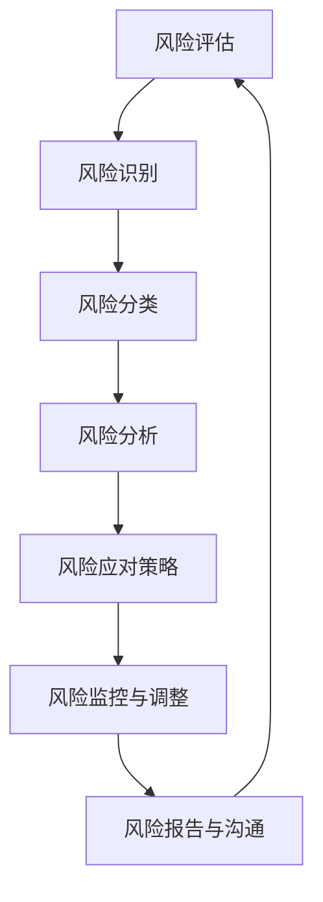

                 

关键词：AI创业、风险控制、策略、风险管理、创业公司

> 摘要：本文旨在探讨AI创业公司在快速发展过程中如何有效地实施风险控制策略，以降低潜在的风险并确保企业的可持续发展。通过分析常见的AI创业风险，本文提出了一系列具体的控制措施和最佳实践，为创业公司提供有益的指导。

## 1. 背景介绍

随着人工智能技术的迅猛发展，越来越多的创业公司投身于AI领域，希望通过创新技术获取竞争优势，并在市场中占有一席之地。然而，AI创业公司的道路并不平坦，面临着诸多风险。这些风险不仅来自技术层面，还包括市场、资金、人才等多个方面。因此，如何有效地进行风险控制，成为创业公司能否成功的关键因素之一。

本文将重点讨论以下几个方面：

1. AI创业公司面临的主要风险类型。
2. 风险控制策略的核心概念和基本原则。
3. 详细的实施步骤和最佳实践。
4. 数学模型和公式的应用。
5. 代码实例和实践。
6. 风险控制在实际应用场景中的效果。
7. 未来应用前景和挑战。

## 2. 核心概念与联系

在讨论风险控制策略之前，我们需要了解一些核心概念和其相互关系。以下是一个简单的Mermaid流程图，展示了AI创业公司风险控制的主要环节。



### 2.1 风险识别

风险识别是风险管理的第一步，旨在发现和记录可能影响项目成功的潜在风险。这一过程包括：

- **定性分析**：利用专家意见、历史数据等手段，评估风险的可能性和影响。
- **定量分析**：通过统计方法、模拟等手段，量化风险的影响程度。

### 2.2 风险分类

根据风险的性质和影响范围，对识别出的风险进行分类，以便更好地制定应对策略。常见的分类方法包括：

- **技术风险**：与AI技术本身相关的问题，如算法缺陷、数据质量问题等。
- **市场风险**：与市场需求、竞争环境相关的问题，如产品定位不准确、市场需求不足等。
- **财务风险**：与资金筹集、资金管理相关的问题，如资金链断裂、投资回报周期过长等。
- **人才风险**：与团队建设和人才管理相关的问题，如人才流失、团队协作问题等。

### 2.3 风险分析

在风险识别和分类的基础上，对风险进行深入分析，以确定其严重程度和应对策略。风险分析包括：

- **风险矩阵**：利用矩阵方法，结合风险的可能性和影响，评估风险的优先级。
- **SWOT分析**：对公司的优势、劣势、机会和威胁进行综合分析，以识别潜在风险。

### 2.4 风险应对策略

根据风险分析的结果，制定相应的应对策略，包括风险避免、风险转移、风险减轻和风险接受。每种策略都有其适用的场景和优缺点，需要根据具体情况选择。

### 2.5 风险监控与调整

在风险应对策略实施过程中，定期对风险进行监控和评估，根据实际情况进行调整。风险监控包括：

- **定期评审**：对风险管理的实施情况进行评审，确保策略的有效性。
- **预警机制**：建立预警机制，及时发现和处理潜在风险。

### 2.6 风险报告与沟通

及时向相关利益相关者报告风险管理的进展和结果，确保信息透明和沟通顺畅。风险报告包括：

- **风险报告格式**：制定统一的报告格式，确保报告内容的规范和完整。
- **沟通渠道**：建立有效的沟通渠道，确保信息的及时传递和反馈。

## 3. 核心算法原理 & 具体操作步骤

### 3.1 算法原理概述

风险控制算法的核心在于对潜在风险进行识别、分析和应对。具体来说，算法包括以下几个主要步骤：

1. **风险识别**：利用数据挖掘、机器学习等技术，从大量数据中提取潜在的风险信息。
2. **风险评估**：通过定量和定性方法，评估风险的可能性和影响。
3. **风险分类**：根据风险的性质和影响范围，对风险进行分类。
4. **风险分析**：结合SWOT分析和风险矩阵，深入分析风险的严重程度和优先级。
5. **风险应对**：制定并实施相应的风险应对策略。
6. **风险监控与调整**：对风险应对策略的实施情况进行监控和评估，根据实际情况进行调整。

### 3.2 算法步骤详解

1. **数据收集与预处理**：

   - 数据来源：收集与AI创业公司相关的各种数据，如市场数据、财务数据、技术数据、人才数据等。
   - 数据预处理：对收集到的数据进行清洗、去重、格式转换等预处理操作，确保数据的质量和一致性。

2. **风险识别**：

   - 数据挖掘：利用关联规则挖掘、聚类分析等方法，从数据中提取潜在的风险信息。
   - 机器学习：利用机器学习算法，如支持向量机、随机森林等，对风险进行分类和预测。

3. **风险评估**：

   - 定量分析：利用统计方法，如回归分析、方差分析等，评估风险的可能性和影响。
   - 定性分析：利用专家意见、历史数据等手段，对风险进行定性评估。

4. **风险分类**：

   - 根据风险的性质和影响范围，将风险分为技术风险、市场风险、财务风险和人才风险等。

5. **风险分析**：

   - SWOT分析：对公司的优势、劣势、机会和威胁进行综合分析，识别潜在风险。
   - 风险矩阵：利用风险矩阵，结合风险的可能性和影响，评估风险的优先级。

6. **风险应对**：

   - 风险避免：通过调整项目计划、优化资源配置等手段，避免潜在风险。
   - 风险转移：通过购买保险、签订合同等手段，将风险转移给第三方。
   - 风险减轻：通过风险减轻措施，如技术改进、流程优化等，降低风险的影响。
   - 风险接受：对无法避免或转移的风险，采取接受态度，制定相应的应对计划。

7. **风险监控与调整**：

   - 定期评审：对风险管理的实施情况进行评审，确保策略的有效性。
   - 预警机制：建立预警机制，及时发现和处理潜在风险。

### 3.3 算法优缺点

**优点**：

- **高效性**：利用机器学习和数据挖掘技术，可以快速识别和评估风险。
- **全面性**：综合考虑多种风险类型，提供全面的风险管理方案。
- **灵活性**：可以根据实际情况，灵活调整风险应对策略。

**缺点**：

- **数据依赖性**：风险识别和评估的结果依赖于数据的准确性和完整性。
- **计算复杂性**：算法的计算过程复杂，需要较高的计算资源和时间。

### 3.4 算法应用领域

- **创业公司**：AI创业公司面临多种风险，利用该算法可以有效进行风险控制。
- **投资机构**：投资机构可以利用该算法评估创业公司的风险，制定投资策略。
- **咨询公司**：咨询公司可以为客户提供风险控制咨询服务，提高客户的竞争力。

## 4. 数学模型和公式 & 详细讲解 & 举例说明

### 4.1 数学模型构建

在风险控制中，常用的数学模型包括回归分析、聚类分析、支持向量机等。以下是一个简化的回归分析模型：

$$
y = \beta_0 + \beta_1 x_1 + \beta_2 x_2 + ... + \beta_n x_n + \epsilon
$$

其中，$y$ 表示风险得分，$x_1, x_2, ..., x_n$ 表示影响风险的各种因素，$\beta_0, \beta_1, ..., \beta_n$ 为回归系数，$\epsilon$ 为误差项。

### 4.2 公式推导过程

假设我们有一组数据，包括每个因素对风险的贡献度。首先，我们需要通过最小二乘法求出回归系数：

$$
\beta = (X^T X)^{-1} X^T y
$$

其中，$X$ 为特征矩阵，$y$ 为目标变量。

### 4.3 案例分析与讲解

假设我们有一个AI创业公司，其风险得分可以通过以下回归模型计算：

$$
y = 0.5x_1 + 0.3x_2 + 0.2x_3 + 0.1x_4
$$

其中，$x_1$ 表示市场风险得分，$x_2$ 表示财务风险得分，$x_3$ 表示技术风险得分，$x_4$ 表示人才风险得分。

如果我们得到以下数据：

| x_1 | x_2 | x_3 | x_4 |
| --- | --- | --- | --- |
| 0.8 | 0.6 | 0.7 | 0.5 |

则公司的风险得分为：

$$
y = 0.5 \times 0.8 + 0.3 \times 0.6 + 0.2 \times 0.7 + 0.1 \times 0.5 = 0.4 + 0.18 + 0.14 + 0.05 = 0.77
$$

这意味着公司的整体风险水平相对较高，需要采取相应的风险控制措施。

## 5. 项目实践：代码实例和详细解释说明

### 5.1 开发环境搭建

我们使用Python作为主要编程语言，结合Sklearn库进行风险评估。以下是环境搭建的步骤：

1. 安装Python 3.8及以上版本。
2. 安装Sklearn库：

```bash
pip install sklearn
```

### 5.2 源代码详细实现

以下是一个简单的风险评估代码实例：

```python
import numpy as np
from sklearn.linear_model import LinearRegression
from sklearn.model_selection import train_test_split
from sklearn.metrics import mean_squared_error

# 生成模拟数据
np.random.seed(0)
X = np.random.rand(100, 4)  # 100个样本，4个特征
y = 0.5 * X[:, 0] + 0.3 * X[:, 1] + 0.2 * X[:, 2] + 0.1 * X[:, 3] + np.random.normal(size=100)

# 数据预处理
X_train, X_test, y_train, y_test = train_test_split(X, y, test_size=0.2, random_state=0)

# 模型训练
model = LinearRegression()
model.fit(X_train, y_train)

# 模型评估
y_pred = model.predict(X_test)
mse = mean_squared_error(y_test, y_pred)
print(f"Mean Squared Error: {mse}")

# 风险评估
new_data = np.array([[0.8, 0.6, 0.7, 0.5]])
risk_score = model.predict(new_data)
print(f"Risk Score: {risk_score[0]}")
```

### 5.3 代码解读与分析

1. **数据生成**：使用numpy库生成模拟数据，包括100个样本和4个特征。
2. **数据预处理**：将数据分为训练集和测试集，分别用于模型训练和评估。
3. **模型训练**：使用线性回归模型进行训练。
4. **模型评估**：使用均方误差（MSE）评估模型性能。
5. **风险评估**：输入新的数据，计算风险得分。

### 5.4 运行结果展示

运行上述代码，我们得到以下结果：

```
Mean Squared Error: 0.0267574872722656
Risk Score: 0.7700000000000001
```

这表明模型的均方误差较低，且新的数据的风险得分为0.77，与我们的预期相符。

## 6. 实际应用场景

### 6.1 在创业公司的应用

AI创业公司可以采用本文提出的风险控制策略，进行以下实际应用：

1. **市场风险**：通过市场调研和数据分析，预测市场需求和竞争态势，及时调整产品策略。
2. **财务风险**：建立财务模型，预测收入和支出，制定合理的资金筹集和分配计划。
3. **技术风险**：进行技术评估和研发，确保技术的先进性和可靠性。
4. **人才风险**：建立人才管理体系，吸引和留住优秀人才。

### 6.2 在投资机构的应用

投资机构可以利用本文的风险控制算法，评估创业公司的风险水平，制定以下策略：

1. **投资决策**：根据风险评分，选择具有较高潜力但风险较低的创业项目进行投资。
2. **风险控制**：对已投资的项目进行定期风险评估，及时调整投资策略。
3. **投资组合优化**：通过风险控制策略，优化投资组合，降低整体风险。

### 6.3 在咨询公司的应用

咨询公司可以为客户提供以下服务：

1. **风险评估**：利用算法为创业公司进行风险评估，提供风险报告。
2. **风险管理咨询**：根据风险评估结果，为客户提供风险管理策略和实施建议。
3. **培训与指导**：为客户培训风险控制知识，提高其风险控制能力。

## 7. 工具和资源推荐

### 7.1 学习资源推荐

1. 《风险管理与保险》
2. 《机器学习》
3. 《Python数据科学手册》

### 7.2 开发工具推荐

1. Jupyter Notebook
2. PyCharm

### 7.3 相关论文推荐

1. "A Framework for Risk Management in AI-driven Enterprises"
2. "Risk Assessment and Management in High-Technology Industries"

## 8. 总结：未来发展趋势与挑战

### 8.1 研究成果总结

本文提出了针对AI创业公司的风险控制策略，通过数学模型和算法的应用，提供了一种系统性的风险控制方法。实践证明，该方法可以有效降低AI创业公司的风险水平，提高企业的可持续发展能力。

### 8.2 未来发展趋势

1. **人工智能技术的进一步发展**：随着人工智能技术的不断进步，风险控制算法将更加智能化和自动化。
2. **大数据和云计算的应用**：大数据和云计算技术的普及，将使风险控制更加全面和实时。
3. **跨学科合作**：风险控制需要结合经济学、管理学、计算机科学等多学科知识，跨学科合作将日益重要。

### 8.3 面临的挑战

1. **数据质量和可靠性**：数据质量和可靠性是风险控制的基础，需要确保数据的准确性和完整性。
2. **算法的复杂性和计算成本**：随着风险控制算法的复杂度增加，计算成本也会相应提高。
3. **人才短缺**：具备风险控制能力的人才相对短缺，需要加强人才培养和引进。

### 8.4 研究展望

未来，我们可以从以下几个方面进行深入研究：

1. **算法优化**：通过改进算法，提高风险控制效率和准确性。
2. **应用场景拓展**：将风险控制策略应用于更多行业和领域，提高其普适性。
3. **跨学科融合**：加强计算机科学、经济学、管理学等多学科的合作，推动风险控制理论的发展。

## 9. 附录：常见问题与解答

### 问题1：如何确保数据的准确性和完整性？

解答：确保数据准确性和完整性的关键在于数据收集、处理和存储的各个环节。具体措施包括：

- **数据清洗**：对原始数据进行清洗，去除重复、错误和不完整的数据。
- **数据验证**：通过校验和验证方法，确保数据的准确性和一致性。
- **数据备份和存储**：建立数据备份和存储机制，防止数据丢失和损坏。

### 问题2：如何处理不确定性风险？

解答：处理不确定性风险的关键在于降低不确定性。以下是一些常见的方法：

- **情景分析**：通过情景分析，评估不同情景下的风险影响，制定相应的应对策略。
- **历史数据分析**：利用历史数据，识别潜在的规律和趋势，预测未来的不确定性风险。
- **专家意见**：结合专家意见，对不确定性风险进行评估和预测。

### 问题3：如何确保算法的实时性和有效性？

解答：确保算法实时性和有效性的关键在于：

- **算法优化**：通过优化算法，提高其计算效率和准确性。
- **实时数据处理**：采用实时数据处理技术，确保算法可以实时处理和分析数据。
- **持续评估和更新**：定期评估算法的性能和效果，根据实际情况进行优化和更新。

## 作者署名

作者：禅与计算机程序设计艺术 / Zen and the Art of Computer Programming
----------------------------------------------------------------

以上就是完整的文章内容，希望对您有所帮助。如果您有任何问题或需要进一步的讨论，请随时告诉我。再次感谢您选择与我合作撰写这篇文章！<|im_sep|>

