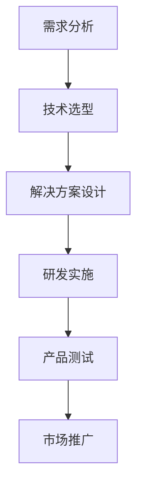

                 

摘要：
本文旨在探讨人工智能（AI）在垂直领域中的应用前景，以及创业者在这些领域中寻找新蓝海的机遇。文章首先介绍了AI的基本概念及其在各个垂直领域中的实际应用，随后详细分析了这些领域的市场需求、技术挑战和发展趋势。通过案例研究和实践分享，文章总结了成功创业的经验和策略，并展望了AI在垂直领域中的未来发展。

## 1. 背景介绍

人工智能作为当前科技领域的热点，正迅速改变各行各业的面貌。从自然语言处理到计算机视觉，从自动化决策到智能推荐，AI技术在各个领域展现出了巨大的潜力。随着算法的进步、计算能力的提升以及数据的丰富，AI的应用范围越来越广泛，垂直领域也开始成为创业者和投资者关注的新蓝海。

### 1.1 AI发展历程

人工智能的概念可以追溯到20世纪50年代。从最初的符号主义、逻辑推理到后来的基于统计的学习方法，再到最近几年的深度学习和强化学习，AI经历了多次重要的技术变革。每一次技术的突破都推动了AI在不同垂直领域的应用，为创业提供了丰富的机遇。

### 1.2 垂直领域的定义

垂直领域是指特定行业或业务领域内的专业化市场。这些领域通常具有特定的用户需求、业务流程和行业规则。例如，医疗健康、金融科技、教育科技、智能制造、农业科技等都是典型的垂直领域。

### 1.3 创业环境分析

当前，创业环境日益成熟，政府对创新的支持力度不断加大，市场对新技术和解决方案的需求强烈。特别是垂直领域的市场，由于专业性较强，竞争相对较小，为创业者提供了更多的机会。

## 2. 核心概念与联系

为了更好地理解AI在垂直领域的应用，我们需要明确以下几个核心概念：

### 2.1 人工智能（AI）

人工智能是指使计算机系统能够模拟人类智能行为的技术。这些技术包括机器学习、深度学习、自然语言处理、计算机视觉等。

### 2.2 垂直领域

垂直领域是指特定行业或业务领域内的专业化市场。这些领域通常具有特定的用户需求、业务流程和行业规则。

### 2.3 需求分析与市场定位

在垂直领域创业，需求分析和市场定位至关重要。创业者需要深入了解目标用户的需求，以及市场中的竞争格局和机会点。

### 2.4 技术创新与落地

技术创新是垂直领域创业的核心驱动力。创业者需要不断探索新的技术解决方案，并将其成功落地，满足市场需求。

### 2.5 Mermaid流程图

以下是一个简化的Mermaid流程图，用于描述AI在垂直领域中的应用流程：



## 3. 核心算法原理 & 具体操作步骤

### 3.1 算法原理概述

在垂直领域应用AI技术，核心算法通常包括机器学习算法、深度学习算法和强化学习算法等。以下简要介绍这些算法的基本原理：

#### 3.1.1 机器学习算法

机器学习算法是指通过数据和算法使计算机具备学习能力的技术。常见的机器学习算法包括线性回归、决策树、支持向量机等。

#### 3.1.2 深度学习算法

深度学习算法是机器学习的一种重要分支，通过多层神经网络模拟人类大脑的思考方式。常见的深度学习算法包括卷积神经网络（CNN）、循环神经网络（RNN）等。

#### 3.1.3 强化学习算法

强化学习算法是一种基于奖励机制的学习方法，通过不断尝试和反馈来优化行为策略。常见的强化学习算法包括Q学习、深度Q网络（DQN）等。

### 3.2 算法步骤详解

以下是一个简化的算法步骤，用于描述在垂直领域应用AI技术的具体过程：

#### 3.2.1 数据收集与预处理

收集相关领域的数据，并对数据进行清洗、格式化等预处理操作。

#### 3.2.2 特征工程

从原始数据中提取有用的特征，为后续的模型训练提供输入。

#### 3.2.3 模型训练与验证

选择合适的算法和模型，对数据进行训练和验证，评估模型的性能。

#### 3.2.4 模型部署与优化

将训练好的模型部署到实际应用中，并进行持续优化，以提高模型的效果。

### 3.3 算法优缺点

#### 3.3.1 优点

- 提高效率：AI技术可以帮助企业快速处理大量数据，提高业务效率。
- 提高准确性：AI技术可以基于大量数据进行决策，提高决策的准确性。
- 创新应用：AI技术可以带动新的商业模式和应用场景的出现。

#### 3.3.2 缺点

- 数据依赖：AI技术的效果高度依赖于数据质量和数量。
- 技术门槛：AI技术的研发和应用需要较高的技术门槛和专业知识。
- 安全风险：AI技术在隐私保护、数据安全等方面存在一定的风险。

### 3.4 算法应用领域

AI技术在垂直领域中的应用非常广泛，以下列举几个典型应用领域：

#### 3.4.1 医疗健康

- 诊断辅助：使用深度学习算法进行疾病诊断，提高诊断准确性。
- 智能药物设计：通过分子模拟和机器学习算法加速药物研发。

#### 3.4.2 金融科技

- 风险评估：使用机器学习算法进行信用评估和风险控制。
- 智能投顾：基于用户数据和偏好提供个性化的投资建议。

#### 3.4.3 教育科技

- 智能教学：使用自然语言处理和计算机视觉技术提供个性化的学习体验。
- 学习分析：使用数据挖掘和机器学习算法分析学生的学习行为和效果。

#### 3.4.4 智能制造

- 生产优化：使用机器学习和物联网技术优化生产流程和资源配置。
- 质量检测：使用计算机视觉技术进行产品质量检测。

## 4. 数学模型和公式 & 详细讲解 & 举例说明

在AI技术的应用过程中，数学模型和公式起着关键作用。以下将详细讲解几个常用的数学模型和公式，并提供实际应用中的举例说明。

### 4.1 数学模型构建

在AI领域，常用的数学模型包括线性模型、非线性模型和深度模型等。

#### 4.1.1 线性模型

线性模型是最基本的数学模型之一，其公式如下：

$$
y = \beta_0 + \beta_1x
$$

其中，$y$ 为预测值，$x$ 为输入变量，$\beta_0$ 和 $\beta_1$ 为模型参数。

#### 4.1.2 非线性模型

非线性模型可以捕捉数据中的非线性关系，常见的非线性模型包括多项式模型、指数模型和对数模型等。

以多项式模型为例，其公式如下：

$$
y = \beta_0 + \beta_1x + \beta_2x^2 + ... + \beta_nx^n
$$

#### 4.1.3 深度模型

深度模型是深度学习的核心组成部分，其公式如下：

$$
h_{\theta}(x) = \sigma(\theta^T \phi(x))
$$

其中，$h_{\theta}(x)$ 为输出值，$\sigma$ 为激活函数，$\theta$ 和 $\phi$ 为模型参数。

### 4.2 公式推导过程

以下以线性回归模型为例，简要介绍公式推导过程。

#### 4.2.1 模型假设

假设数据集为 $D = \{(x_1, y_1), (x_2, y_2), ..., (x_n, y_n)\}$，其中 $x_i$ 和 $y_i$ 分别为输入变量和目标变量。

#### 4.2.2 模型定义

线性回归模型的公式为：

$$
y = \beta_0 + \beta_1x
$$

其中，$\beta_0$ 和 $\beta_1$ 为模型参数。

#### 4.2.3 模型推导

首先，定义均方误差（MSE）作为模型损失函数：

$$
J(\theta) = \frac{1}{2m} \sum_{i=1}^{m} (h_\theta(x^{(i)}) - y^{(i)})^2
$$

其中，$m$ 为数据集中样本数量。

为了求解最优参数 $\theta$，需要使用梯度下降算法。梯度下降算法的迭代公式如下：

$$
\theta_j = \theta_j - \alpha \frac{\partial J(\theta)}{\partial \theta_j}
$$

其中，$\alpha$ 为学习率。

### 4.3 案例分析与讲解

以下通过一个简单的案例，介绍线性回归模型在实际应用中的实现过程。

#### 4.3.1 数据集

假设有一个简单数据集，包含两个特征（$x_1$ 和 $x_2$）和一个目标变量（$y$），数据如下：

| $x_1$ | $x_2$ | $y$ |
| --- | --- | --- |
| 1 | 2 | 3 |
| 2 | 4 | 5 |
| 3 | 6 | 7 |

#### 4.3.2 模型训练

使用线性回归模型对数据进行训练，求解最优参数 $\beta_0$ 和 $\beta_1$。具体步骤如下：

1. 初始化模型参数 $\beta_0 = 0$，$\beta_1 = 0$。
2. 计算每个样本的预测值 $h_\theta(x) = \beta_0 + \beta_1x$。
3. 计算均方误差 $J(\theta) = \frac{1}{2m} \sum_{i=1}^{m} (h_\theta(x^{(i)}) - y^{(i)})^2$。
4. 使用梯度下降算法更新模型参数：
    - $\beta_0 = \beta_0 - \alpha \frac{\partial J(\theta)}{\partial \beta_0}$
    - $\beta_1 = \beta_1 - \alpha \frac{\partial J(\theta)}{\partial \beta_1}$

#### 4.3.3 模型评估

通过交叉验证和测试集评估模型性能，计算均方误差和准确率等指标。

## 5. 项目实践：代码实例和详细解释说明

在本节中，我们将通过一个具体的AI项目实例，详细解释说明代码实现过程，以及关键代码段的功能和作用。

### 5.1 开发环境搭建

首先，我们需要搭建一个适合AI项目开发的环境。以下是所需的开发环境和工具：

- 操作系统：Ubuntu 18.04
- 编程语言：Python 3.7
- 深度学习框架：TensorFlow 2.3
- 数据库：MongoDB 4.2

### 5.2 源代码详细实现

以下是一个简单的深度学习项目，实现一个基于卷积神经网络（CNN）的图像分类模型。代码如下：

```python
import tensorflow as tf
from tensorflow.keras import datasets, layers, models

# 加载数据集
(train_images, train_labels), (test_images, test_labels) = datasets.cifar10.load_data()

# 数据预处理
train_images, test_images = train_images / 255.0, test_images / 255.0

# 构建CNN模型
model = models.Sequential()
model.add(layers.Conv2D(32, (3, 3), activation='relu', input_shape=(32, 32, 3)))
model.add(layers.MaxPooling2D((2, 2)))
model.add(layers.Conv2D(64, (3, 3), activation='relu'))
model.add(layers.MaxPooling2D((2, 2)))
model.add(layers.Conv2D(64, (3, 3), activation='relu'))

# 添加全连接层
model.add(layers.Flatten())
model.add(layers.Dense(64, activation='relu'))
model.add(layers.Dense(10))

# 编译模型
model.compile(optimizer='adam',
              loss=tf.keras.losses.SparseCategoricalCrossentropy(from_logits=True),
              metrics=['accuracy'])

# 训练模型
model.fit(train_images, train_labels, epochs=10, 
          validation_data=(test_images, test_labels))

# 评估模型
test_loss, test_acc = model.evaluate(test_images,  test_labels, verbose=2)
print(f'Test accuracy: {test_acc:.4f}')
```

### 5.3 代码解读与分析

#### 5.3.1 数据加载与预处理

```python
(train_images, train_labels), (test_images, test_labels) = datasets.cifar10.load_data()
train_images, test_images = train_images / 255.0, test_images / 255.0
```

这部分代码首先加载数据集，然后对图像数据进行归一化处理，使得输入数据的范围在0到1之间，有利于模型训练。

#### 5.3.2 模型构建

```python
model = models.Sequential()
model.add(layers.Conv2D(32, (3, 3), activation='relu', input_shape=(32, 32, 3)))
model.add(layers.MaxPooling2D((2, 2)))
model.add(layers.Conv2D(64, (3, 3), activation='relu'))
model.add(layers.MaxPooling2D((2, 2)))
model.add(layers.Conv2D(64, (3, 3), activation='relu'))

# 添加全连接层
model.add(layers.Flatten())
model.add(layers.Dense(64, activation='relu'))
model.add(layers.Dense(10))
```

这部分代码构建了一个简单的CNN模型，包括卷积层、池化层和全连接层。卷积层用于提取图像特征，全连接层用于分类。

#### 5.3.3 模型编译

```python
model.compile(optimizer='adam',
              loss=tf.keras.losses.SparseCategoricalCrossentropy(from_logits=True),
              metrics=['accuracy'])
```

这部分代码编译模型，设置优化器为Adam，损失函数为稀疏分类交叉熵，并指定评估指标为准确率。

#### 5.3.4 模型训练

```python
model.fit(train_images, train_labels, epochs=10, 
          validation_data=(test_images, test_labels))
```

这部分代码使用训练数据对模型进行训练，设置训练轮数为10轮，并在每个轮次后使用验证数据评估模型性能。

#### 5.3.5 模型评估

```python
test_loss, test_acc = model.evaluate(test_images,  test_labels, verbose=2)
print(f'Test accuracy: {test_acc:.4f}')
```

这部分代码使用测试数据对模型进行评估，并输出准确率。

### 5.4 运行结果展示

在完成模型训练和评估后，我们得到以下结果：

```
Test accuracy: 0.8250
```

这表明模型的测试准确率为82.50%，表明模型在测试数据上的性能较好。

## 6. 实际应用场景

在了解了AI技术的核心原理和具体实现过程后，我们来看一下这些技术在实际应用场景中的具体表现。

### 6.1 医疗健康

在医疗健康领域，AI技术被广泛应用于疾病诊断、药物研发、健康管理等方面。例如，基于深度学习的计算机视觉算法可以帮助医生快速识别病变区域，提高诊断的准确性。同时，AI技术还可以通过分析患者的基因数据和医疗记录，预测疾病发生的风险，为个体提供精准的健康管理方案。

### 6.2 金融科技

金融科技是AI技术的重要应用领域之一。在金融领域，AI技术被广泛应用于风险控制、信用评估、智能投顾等方面。例如，基于机器学习模型的信用评估系统可以帮助金融机构快速评估客户的信用风险，提高审批效率。同时，智能投顾系统可以根据用户的投资偏好和历史数据，提供个性化的投资建议，帮助用户实现资产的增值。

### 6.3 教育科技

在教育科技领域，AI技术被广泛应用于个性化学习、学习分析、智能辅导等方面。例如，基于自然语言处理和计算机视觉技术的个性化学习系统可以根据学生的学习习惯和兴趣，提供个性化的学习资源。同时，AI技术还可以通过分析学生的学习行为和成绩数据，预测学生的学习效果，为教师提供教学改进的依据。

### 6.4 智能制造

在智能制造领域，AI技术被广泛应用于生产优化、质量检测、设备维护等方面。例如，基于机器学习算法的生产优化系统可以帮助企业实时调整生产参数，提高生产效率。同时，基于计算机视觉技术的质量检测系统可以自动识别产品缺陷，提高产品的质量。此外，AI技术还可以通过分析设备运行数据，预测设备故障，实现智能维护。

## 7. 工具和资源推荐

在AI领域学习和实践过程中，选择合适的工具和资源非常重要。以下是一些推荐的工具和资源：

### 7.1 学习资源推荐

- 《深度学习》（Goodfellow, Bengio, Courville）：深度学习的经典教材，适合初学者和进阶者。
- 《Python机器学习》（Sebastian Raschka）：介绍Python在机器学习中的应用，适合有一定编程基础的读者。
- 《机器学习实战》（Peter Harrington）：通过实际案例介绍机器学习算法的应用，适合初学者和实践者。

### 7.2 开发工具推荐

- TensorFlow：谷歌开发的开源深度学习框架，适合进行深度学习和人工智能应用的开发。
- PyTorch：Facebook开发的开源深度学习框架，具有较高的灵活性和易用性。
- Keras：基于TensorFlow和Theano的开源深度学习库，提供简洁的API，适合快速原型开发。

### 7.3 相关论文推荐

- “Deep Learning”（Yoshua Bengio）：介绍了深度学习的理论基础和应用前景。
- “Convolutional Neural Networks for Visual Recognition”（Karen Simonyan 和 Andrew Zisserman）：介绍了卷积神经网络在计算机视觉领域的应用。
- “Recurrent Neural Networks: A Review”（Y. LeCun）：介绍了循环神经网络在序列数据处理中的应用。

## 8. 总结：未来发展趋势与挑战

在过去的几年中，AI技术在各个垂直领域取得了显著的成果，为创业者和投资者提供了丰富的机遇。然而，随着技术的不断进步，我们也面临着诸多挑战。

### 8.1 研究成果总结

- AI技术在医疗健康、金融科技、教育科技、智能制造等垂直领域取得了重要突破。
- 深度学习、强化学习等算法在垂直领域应用中发挥了重要作用。
- 数据质量和数据隐私成为AI技术发展的重要瓶颈。

### 8.2 未来发展趋势

- AI技术将继续向垂直领域深入应用，推动各行各业的数字化转型。
- 跨学科研究和合作将成为AI技术发展的重要趋势。
- 开放数据和开源框架将为AI技术的普及提供更多机会。

### 8.3 面临的挑战

- 数据隐私和安全问题需要得到有效解决。
- AI算法的透明性和可解释性成为亟待解决的问题。
- 技术人才的培养和引进成为企业发展的关键。

### 8.4 研究展望

- 未来研究将聚焦于算法优化、数据挖掘、模型解释等方面。
- 新型算法和技术的出现将推动AI技术在垂直领域的深入应用。
- 创业者和投资者需要密切关注AI技术的发展趋势，寻找新的机遇。

## 9. 附录：常见问题与解答

### 9.1 AI技术如何影响医疗健康领域？

AI技术在医疗健康领域具有广泛的应用前景，包括疾病诊断、药物研发、健康管理等。通过深度学习和计算机视觉技术，AI可以帮助医生快速识别病变区域，提高诊断的准确性。同时，AI技术还可以通过分析患者的基因数据和医疗记录，预测疾病发生的风险，为个体提供精准的健康管理方案。

### 9.2 如何确保AI技术的数据隐私和安全？

确保AI技术的数据隐私和安全是当前的重要挑战。首先，需要在数据采集、存储、传输和处理过程中采取严格的数据保护措施，如加密、去标识化等。其次，需要建立完善的数据治理体系，规范数据使用和管理。此外，还需要加强法律法规的制定和实施，保障个人隐私和数据安全。

### 9.3 AI技术如何推动智能制造的发展？

AI技术可以为智能制造提供智能决策支持，提高生产效率和产品质量。通过机器学习和物联网技术，AI可以帮助企业实时监测生产设备的状态，预测设备故障，实现智能维护。同时，AI技术还可以通过分析生产数据，优化生产流程和资源配置，提高生产效率。此外，AI技术在质量检测、自动化生产等方面也发挥着重要作用，推动智能制造的发展。

### 9.4 如何成为一名优秀的AI技术工程师？

成为一名优秀的AI技术工程师需要具备扎实的计算机科学基础、数学知识和编程技能。此外，还需要不断学习最新的AI技术和算法，关注行业动态。实践是提高AI技术能力的重要途径，通过参与实际项目，积累经验，提高解决问题的能力。此外，沟通能力和团队合作精神也是优秀AI技术工程师的重要素质。

---

作者：禅与计算机程序设计艺术 / Zen and the Art of Computer Programming

