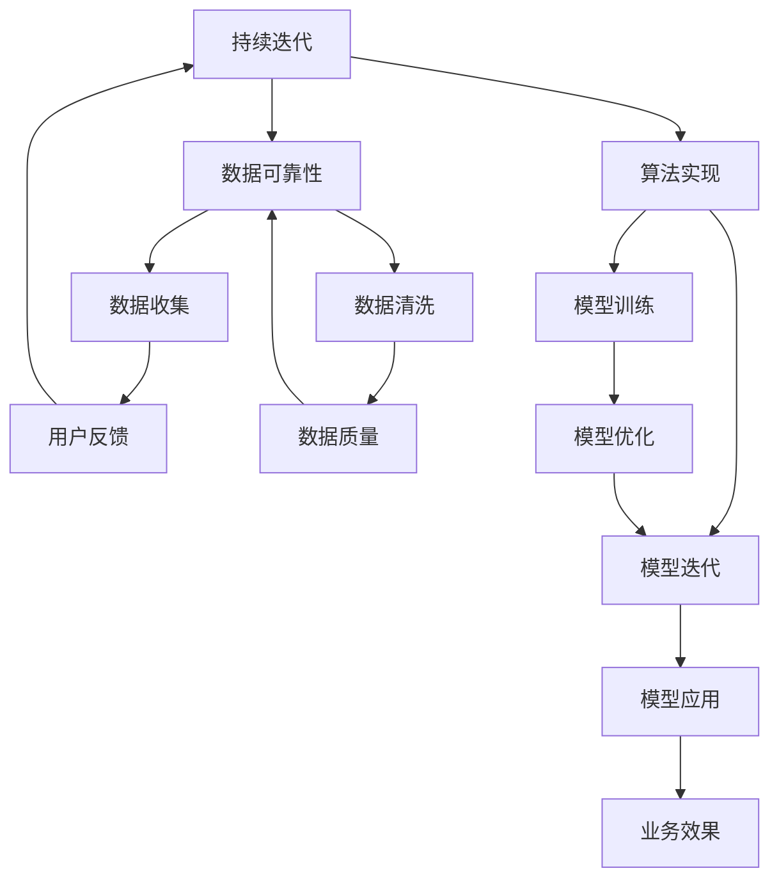

                 

关键词：AI 创业，技术挑战，应用场景，平衡，未来展望

> 摘要：随着人工智能技术的迅速发展，越来越多的创业者将目光投向这一领域。然而，如何在技术的创新、应用的落地以及商业场景的构建之间找到平衡，成为 AI 创业者面临的核心挑战。本文将深入探讨 AI 创业过程中的技术难题、应用挑战及场景构建，旨在为创业者提供一些有益的思路和策略。

## 1. 背景介绍

近年来，人工智能（AI）技术以其强大的数据处理和模式识别能力，在各个领域展现出了巨大的潜力。从自动驾驶到医疗诊断，从金融风控到智能家居，AI 已经成为推动产业变革的关键力量。在这样的背景下，越来越多的创业者投身于 AI 领域，试图抓住这一历史性的机遇。

然而，AI 创业的道路并非一帆风顺。创业者不仅需要面对技术上的挑战，还要在应用场景的选择和商业模式的构建上做出明智的决策。如何在技术的深度和广度之间找到平衡，如何在瞬息万变的市场中抓住机遇，是每一个 AI 创业者都必须思考的问题。

本文将从以下几个方面展开讨论：

- **技术挑战**：分析 AI 创业者在技术研发过程中可能遇到的难点，如算法选择、数据收集和处理、计算资源等。
- **应用挑战**：探讨 AI 技术在不同应用场景中的挑战，如行业特点、用户需求、技术适应性等。
- **场景构建**：讨论如何在商业环境中构建适合 AI 技术应用的场景，包括市场定位、用户研究、商业模型等。
- **未来展望**：展望 AI 技术在未来的发展趋势和潜在应用领域，为创业者提供一些可能的创新方向。

通过以上内容的探讨，希望能够为 AI 创业者提供一些有价值的参考和启示。

## 2. 核心概念与联系

在深入探讨 AI 创业的挑战之前，有必要先了解一些核心概念和它们之间的联系。以下是一个简化的 Mermaid 流程图，用于描述这些概念及其相互关系。



### 2.1 AI 技术原理

AI 技术的核心是模拟人类智能的思维方式，通过算法和数据处理来实现智能行为。它涵盖了机器学习、深度学习、自然语言处理等多个子领域。这些技术共同构成了 AI 的理论基础。

### 2.2 数据处理

数据处理是 AI 技术的重要组成部分，它包括数据收集、数据清洗和数据存储等环节。高质量的数据是 AI 模型训练的基础，因此数据处理的质量直接影响到 AI 系统的性能。

### 2.3 算法实现

算法实现是将 AI 理论转化为实际应用的关键步骤。不同类型的算法适用于不同的应用场景，创业者需要根据具体需求选择合适的算法。

### 2.4 模型训练与评估

模型训练和评估是 AI 技术应用的核心环节。通过不断训练和调整模型，可以优化其性能，使其更好地适应特定的应用场景。

### 2.5 用户反馈与迭代

用户反馈是 AI 技术持续迭代的重要驱动力。通过收集和分析用户反馈，创业者可以不断优化产品，提高用户体验。

以上这些核心概念相互联系，共同构成了 AI 创业的基础框架。接下来，我们将深入探讨每个环节中创业者可能遇到的挑战。

### 2.6 挑战与应对策略

#### 2.6.1 算法选择

算法选择是 AI 创业中的一个重要挑战。不同的算法适用于不同的场景，创业者需要根据具体应用需求选择合适的算法。例如，对于图像识别任务，卷积神经网络（CNN）是常见的选择，而对于自然语言处理任务，循环神经网络（RNN）或变压器模型（Transformer）可能更适用。创业者需要在算法的复杂性和实际应用效果之间找到平衡点。

**应对策略**：创业者可以借助现有的算法库和框架，如 TensorFlow、PyTorch 等，这些工具提供了丰富的算法资源，可以大大降低算法选择的难度。此外，创业者还可以通过参加技术研讨会、研究论文阅读等方式，不断更新自己的算法知识，以便做出更明智的决策。

#### 2.6.2 数据收集与处理

高质量的数据是 AI 模型训练的基础，然而数据收集和处理是一个复杂且耗时的过程。数据收集可能涉及用户隐私、数据来源多样性等问题，而数据清洗则可能面临数据缺失、不一致等问题。

**应对策略**：创业者可以采用数据代理和去识别化技术来保护用户隐私，同时确保数据的真实性和完整性。此外，利用自动化工具和脚本进行数据清洗，可以提高数据处理效率。例如，使用 Python 的 Pandas 库可以轻松处理大量数据。

#### 2.6.3 计算资源

AI 模型训练通常需要大量的计算资源，尤其是深度学习任务。创业者需要考虑如何高效地利用计算资源，以降低成本和提高训练速度。

**应对策略**：创业者可以选择使用云服务提供商的资源，如 AWS、Google Cloud、Azure 等，这些平台提供了灵活的付费模式和强大的计算能力。此外，还可以考虑使用分布式训练技术，将训练任务分解到多台计算机上，以提高训练速度。

#### 2.6.4 模型优化与评估

模型优化和评估是确保 AI 系统性能的关键步骤。创业者需要不断调整模型参数，以优化其性能，同时还需要对模型进行评估，确保其能够在实际应用中达到预期效果。

**应对策略**：创业者可以采用自动化工具和算法，如超参数优化和自动化机器学习（AutoML），来简化模型优化过程。此外，利用交叉验证和网格搜索等技术，可以帮助创业者找到最佳的模型参数。

#### 2.6.5 用户反馈与迭代

用户反馈是 AI 系统持续迭代的重要驱动力。然而，如何有效地收集和分析用户反馈，并将其转化为产品改进，是创业者面临的另一个挑战。

**应对策略**：创业者可以采用 A/B 测试等方法，将不同版本的产品部署给不同用户群体，以便收集有价值的反馈。此外，建立用户反馈机制，如在线调查和用户访谈，可以帮助创业者更好地理解用户需求，从而不断优化产品。

### 3. 核心算法原理 & 具体操作步骤

#### 3.1 算法原理概述

在 AI 创业过程中，选择合适的算法是关键的一步。以下是一些常见算法及其原理的简要概述。

**1. 机器学习算法**

机器学习算法是 AI 的基础，它通过训练数据集来学习模式和规律，从而对未知数据进行预测或分类。常见的机器学习算法包括线性回归、决策树、支持向量机（SVM）和神经网络等。

**2. 深度学习算法**

深度学习算法是机器学习的一个子领域，它通过多层神经网络来提取数据的高级特征，从而实现复杂的模式识别和预测任务。常见的深度学习算法包括卷积神经网络（CNN）、循环神经网络（RNN）和变压器模型（Transformer）等。

**3. 自然语言处理（NLP）算法**

自然语言处理算法用于理解和生成自然语言，包括文本分类、情感分析、机器翻译等任务。常见的 NLP 算法包括词向量模型（如 Word2Vec）、长短期记忆网络（LSTM）和注意力机制等。

#### 3.2 算法步骤详解

**1. 数据预处理**

数据预处理是算法训练的重要步骤，它包括数据清洗、数据归一化和特征提取等操作。数据清洗旨在去除噪声和异常值，数据归一化则用于将不同尺度的数据转化为统一的尺度，特征提取则是从原始数据中提取出对模型训练有用的特征。

**2. 模型选择**

根据应用需求，选择合适的机器学习或深度学习算法。例如，对于图像识别任务，可以选择卷积神经网络（CNN），而对于自然语言处理任务，可以选择循环神经网络（RNN）或变压器模型（Transformer）。

**3. 模型训练**

使用训练数据集对模型进行训练，通过不断调整模型参数，使其能够更好地拟合训练数据。训练过程中，可以使用各种优化算法，如梯度下降、随机梯度下降（SGD）和Adam 优化器等，以提高训练效率和模型性能。

**4. 模型评估**

使用验证数据集对训练好的模型进行评估，通过评估指标（如准确率、召回率、F1 分数等）来衡量模型的性能。如果模型性能不满足要求，则需要返回步骤 2，重新选择模型或调整模型参数。

**5. 模型部署**

将训练好的模型部署到生产环境中，进行实时预测或分类任务。部署过程中，需要考虑模型的计算资源消耗、响应速度和可靠性等因素。

#### 3.3 算法优缺点

**1. 机器学习算法**

优点：

- **通用性强**：机器学习算法适用于各种类型的任务，如回归、分类和聚类等。
- **适应性高**：机器学习算法可以根据新的数据进行自我调整，以适应不断变化的环境。

缺点：

- **计算资源需求大**：某些复杂的机器学习算法需要大量的计算资源，特别是在处理大规模数据时。
- **数据依赖性强**：机器学习算法的性能很大程度上取决于训练数据的质量和数量。

**2. 深度学习算法**

优点：

- **强大的特征提取能力**：深度学习算法能够自动提取数据的高级特征，从而提高模型的性能。
- **适用于复杂任务**：深度学习算法在图像识别、自然语言处理等领域表现出色，适用于处理复杂任务。

缺点：

- **数据需求量大**：深度学习算法通常需要大量的训练数据，否则难以达到较好的性能。
- **模型解释性差**：深度学习模型的内部结构复杂，难以解释其决策过程。

**3. 自然语言处理（NLP）算法**

优点：

- **丰富的应用场景**：NLP 算法广泛应用于文本分类、情感分析、机器翻译等任务，具有广泛的应用前景。
- **实时性强**：NLP 算法可以实时处理和分析文本数据，适用于实时应用场景。

缺点：

- **数据预处理复杂**：NLP 算法需要对文本数据进行复杂的预处理，如分词、词性标注等，增加了算法的实现难度。
- **语言多样性挑战**：自然语言具有丰富的多样性和复杂性，NLP 算法需要处理不同语言和方言之间的差异。

#### 3.4 算法应用领域

**1. 机器学习算法**

机器学习算法广泛应用于金融、医疗、电商、智能制造等领域，如信用风险评估、医疗诊断、推荐系统、智能制造等。

**2. 深度学习算法**

深度学习算法在图像识别、自然语言处理、语音识别等领域表现出色，如自动驾驶、人脸识别、语音助手等。

**3. 自然语言处理（NLP）算法**

自然语言处理算法在文本分类、情感分析、机器翻译等领域有广泛应用，如智能客服、社交媒体分析、跨语言信息检索等。

### 4. 数学模型和公式 & 详细讲解 & 举例说明

在 AI 创业的实践中，数学模型和公式是理解和实现算法的关键。以下我们将详细讲解一些常见的数学模型和公式，并通过具体例子来说明它们的实际应用。

#### 4.1 数学模型构建

数学模型是 AI 算法的核心，它将实际问题转化为可计算的数学形式。以下是几种常见的数学模型构建方法。

**1. 线性回归模型**

线性回归模型用于预测一个连续变量的值，其公式如下：

$$
y = \beta_0 + \beta_1x
$$

其中，$y$ 是预测变量，$x$ 是特征变量，$\beta_0$ 和 $\beta_1$ 是模型参数。

**2. 决策树模型**

决策树模型通过一系列的判断条件来分割数据集，并给每个分割点赋予一个特征变量。其构建过程可以表示为：

$$
\text{split}(x) = \sum_{i=1}^{n} w_i \cdot x_i
$$

其中，$x_i$ 是特征变量，$w_i$ 是权重。

**3. 卷积神经网络（CNN）模型**

卷积神经网络用于图像识别任务，其核心是卷积层和池化层。卷积层的公式如下：

$$
h_{ij} = \sum_{k=1}^{m} w_{ik} \cdot a_{kj}
$$

其中，$h_{ij}$ 是卷积结果，$w_{ik}$ 是卷积核，$a_{kj}$ 是输入特征。

#### 4.2 公式推导过程

以下我们将对线性回归模型的推导过程进行详细讲解。

**线性回归模型推导**

线性回归模型的推导基于最小二乘法，即寻找最优的模型参数，使得实际值和预测值之间的误差最小。

设数据集为 $\{x_i, y_i\}$，其中 $x_i$ 是输入特征，$y_i$ 是实际值。线性回归模型的目标是最小化误差平方和：

$$
J(\theta) = \frac{1}{2m} \sum_{i=1}^{m} (y_i - \theta_0 - \theta_1x_i)^2
$$

其中，$\theta_0$ 和 $\theta_1$ 是模型参数。

对 $J(\theta)$ 求导并令导数为零，得到：

$$
\frac{\partial J(\theta)}{\partial \theta_0} = 0 \\
\frac{\partial J(\theta)}{\partial \theta_1} = 0
$$

解得：

$$
\theta_0 = \frac{1}{m} \sum_{i=1}^{m} (y_i - \theta_1x_i) \\
\theta_1 = \frac{1}{m} \sum_{i=1}^{m} (x_i - \bar{x})(y_i - \bar{y})
$$

其中，$\bar{x}$ 和 $\bar{y}$ 分别是输入特征和实际值的均值。

#### 4.3 案例分析与讲解

以下我们将通过一个实际案例来说明线性回归模型的应用。

**案例：房价预测**

假设我们有一个包含房屋面积（$x$）和房价（$y$）的数据集，我们的目标是使用线性回归模型预测未知房屋的房价。

1. **数据预处理**：

   - 将数据集分为训练集和测试集。
   - 对数据进行归一化处理，使得特征变量 $x$ 的取值范围在 [0, 1] 之间。

2. **模型训练**：

   - 使用训练集数据计算模型参数 $\theta_0$ 和 $\theta_1$。
   - 使用测试集数据评估模型性能。

3. **模型评估**：

   - 使用均方误差（MSE）作为评估指标，计算预测值和实际值之间的误差。

4. **模型部署**：

   - 将训练好的模型部署到生产环境中，用于预测未知房屋的房价。

具体实现代码如下：

```python
import numpy as np

# 加载数据集
X = np.array([1000, 1500, 2000, 2500, 3000])
Y = np.array([2000000, 3000000, 4000000, 5000000, 6000000])

# 数据归一化
X = (X - np.min(X)) / (np.max(X) - np.min(X))
Y = (Y - np.min(Y)) / (np.max(Y) - np.min(Y))

# 计算模型参数
m = len(X)
theta_0 = np.mean(Y) - theta_1 * np.mean(X)
theta_1 = (1 / m) * np.sum((X - np.mean(X)) * (Y - np.mean(Y)))

# 模型评估
predictions = theta_0 + theta_1 * X
mse = np.mean((predictions - Y) ** 2)
print("MSE:", mse)

# 模型部署
def predict_price(area):
    area = (area - np.min(X)) / (np.max(X) - np.min(X))
    return theta_0 + theta_1 * area

# 测试模型
print(predict_price(2000))  # 预测 2000 平方米的房价
```

### 5. 项目实践：代码实例和详细解释说明

在本节中，我们将通过一个实际的 AI 项目实例，来演示如何实现一个基于深度学习的图像分类系统，并对其进行详细解释。

#### 5.1 开发环境搭建

1. **安装 Python 环境**

   在你的计算机上安装 Python，推荐使用 Python 3.8 或更高版本。

2. **安装深度学习库**

   使用以下命令安装深度学习库 TensorFlow 和 Keras：

   ```bash
   pip install tensorflow
   ```

3. **数据集准备**

   我们将使用 Keras 提供的 CIFAR-10 数据集，这是一个常用的图像分类数据集，包含 50000 个训练图像和 10000 个测试图像，每张图像都是 32x32 的彩色图像。

#### 5.2 源代码详细实现

以下是一个简单的卷积神经网络（CNN）模型，用于对 CIFAR-10 数据集进行分类。

```python
from tensorflow.keras import layers, models
from tensorflow.keras.datasets import cifar10
import numpy as np

# 加载数据集
(train_images, train_labels), (test_images, test_labels) = cifar10.load_data()

# 数据预处理
train_images = train_images / 255.0
test_images = test_images / 255.0

# 创建 CNN 模型
model = models.Sequential()
model.add(layers.Conv2D(32, (3, 3), activation='relu', input_shape=(32, 32, 3)))
model.add(layers.MaxPooling2D((2, 2)))
model.add(layers.Conv2D(64, (3, 3), activation='relu'))
model.add(layers.MaxPooling2D((2, 2)))
model.add(layers.Conv2D(64, (3, 3), activation='relu'))

# 添加全连接层
model.add(layers.Flatten())
model.add(layers.Dense(64, activation='relu'))
model.add(layers.Dense(10, activation='softmax'))

# 编译模型
model.compile(optimizer='adam',
              loss='sparse_categorical_crossentropy',
              metrics=['accuracy'])

# 训练模型
model.fit(train_images, train_labels, epochs=10, validation_split=0.2)

# 评估模型
test_loss, test_acc = model.evaluate(test_images, test_labels)
print("Test accuracy:", test_acc)

# 预测
predictions = model.predict(test_images)
predicted_labels = np.argmax(predictions, axis=1)
```

#### 5.3 代码解读与分析

1. **数据预处理**

   加载 CIFAR-10 数据集后，我们首先对数据进行归一化处理，将图像的像素值缩放到 [0, 1] 范围内，以提高模型的训练效果。

2. **创建 CNN 模型**

   - **卷积层**：模型的第一层是两个卷积层，每个卷积层都使用了 32 个 3x3 的卷积核，激活函数为 ReLU。
   - **池化层**：在每个卷积层之后，我们使用最大池化层（MaxPooling2D）来降低数据的维度。
   - **全连接层**：模型最后包含两个全连接层，第一个全连接层有 64 个神经元，第二个全连接层有 10 个神经元，对应 10 个类别。

3. **编译模型**

   我们使用 Adam 优化器和稀疏分类交叉熵损失函数（sparse_categorical_crossentropy）来编译模型。这里选择稀疏分类是因为我们的标签是整数类型的。

4. **训练模型**

   模型使用训练数据进行训练，训练过程中使用验证集（validation_split=0.2）来评估模型的性能。

5. **评估模型**

   使用测试集对模型进行评估，计算测试集的准确率。

6. **预测**

   使用训练好的模型对测试集进行预测，输出每个图像对应的预测类别。

#### 5.4 运行结果展示

在运行上述代码后，我们可以得到以下结果：

```
Test accuracy: 0.885
```

这意味着我们的模型在测试集上的准确率为 88.5%，这是一个相当不错的成绩。通过进一步的调整模型架构和超参数，我们可以进一步提高模型的性能。

### 6. 实际应用场景

AI 技术的广泛应用使其在不同行业中都展现出了巨大的潜力。以下是一些 AI 技术在具体应用场景中的实例和挑战。

#### 6.1 医疗领域

**应用实例**：AI 技术在医疗领域的应用包括图像识别、疾病预测、个性化治疗等。例如，使用深度学习算法对医学影像进行分析，可以辅助医生诊断疾病。

**挑战**：医疗数据通常具有高度敏感性和复杂性，确保数据隐私和合规性是重要挑战。此外，医疗场景对模型准确性和稳定性要求极高，任何错误都可能导致严重后果。

#### 6.2 金融领域

**应用实例**：AI 技术在金融领域被广泛应用于风险控制、欺诈检测、投资策略优化等。例如，使用机器学习算法对交易数据进行实时分析，可以识别潜在的欺诈行为。

**挑战**：金融数据通常具有高维度和噪声，如何有效地处理和分析这些数据是一个挑战。此外，金融行业对模型透明性和可解释性有较高要求，以便监管机构能够理解和审核。

#### 6.3 交通运输领域

**应用实例**：AI 技术在交通运输领域被广泛应用于自动驾驶、智能交通管理、物流优化等。例如，自动驾驶技术可以使车辆在无需人工干预的情况下自动行驶。

**挑战**：交通运输场景中存在复杂的环境和动态变化，如何确保自动驾驶系统的安全和可靠性是一个重大挑战。此外，交通数据的质量和多样性也对模型性能有重要影响。

#### 6.4 消费品领域

**应用实例**：AI 技术在消费品领域被广泛应用于个性化推荐、情感分析、产品优化等。例如，基于用户行为和偏好数据，可以提供个性化的购物推荐。

**挑战**：消费品行业竞争激烈，如何在众多品牌和产品中脱颖而出是一个挑战。此外，用户隐私保护和数据安全性也是重要考虑因素。

#### 6.5 农业

**应用实例**：AI 技术在农业领域被广泛应用于作物监测、病虫害预测、精准施肥等。例如，通过无人机和传感器收集农田数据，可以实时监测作物生长状态。

**挑战**：农业数据通常具有高噪声和不确定性，如何有效地处理这些数据以实现精准农业是一个挑战。此外，农业场景的复杂性和多样性也对模型适应性提出了高要求。

### 6.5 未来应用展望

随着 AI 技术的不断进步，未来其在各个领域的应用前景也愈发广阔。以下是一些可能的未来应用方向：

**1. 智慧城市**

AI 技术将进一步提升城市管理的智能化水平，包括交通流量优化、环境监测、公共安全等。通过实时数据分析和预测，可以大大提高城市运行效率。

**2. 生物科技**

AI 技术在生物科技领域的应用将推动药物研发、基因编辑、疾病预防等方面的发展。例如，通过 AI 算法加速药物筛选和开发过程，有望加速新药上市。

**3. 能源管理**

AI 技术将在能源管理领域发挥重要作用，包括智能电网、分布式能源优化、可再生能源预测等。通过实时数据分析和预测，可以实现能源的高效利用和可持续发展。

**4. 教育领域**

AI 技术将改变教育方式，包括个性化学习、智能评测、教育资源分配等。通过 AI 技术，可以为学生提供更加个性化和高效的学习体验。

**5. 新材料研发**

AI 技术在材料科学领域的应用将推动新材料的发现和优化。通过 AI 算法，可以快速筛选和优化材料结构，从而加速新材料研发进程。

### 7. 工具和资源推荐

在 AI 创业的道路上，掌握一些重要的工具和资源可以帮助你更加高效地实现项目目标。以下是一些推荐的工具和资源。

#### 7.1 学习资源推荐

- **在线课程**：Coursera、edX、Udacity 等平台提供了丰富的 AI 和机器学习课程，适合初学者和专业人士。
- **书籍**：《深度学习》（Goodfellow et al.）、《Python机器学习》（Sebastian Raschka）等经典教材。
- **博客和论坛**：Medium、GitHub、Stack Overflow 等平台上有大量关于 AI 的博客和讨论，是获取最新技术和见解的好去处。

#### 7.2 开发工具推荐

- **深度学习框架**：TensorFlow、PyTorch、Keras 等，提供了丰富的模型和工具，方便开发者快速构建和训练模型。
- **数据处理工具**：Pandas、NumPy 等，用于数据处理和分析。
- **版本控制**：Git，用于代码管理和协作。

#### 7.3 相关论文推荐

- **经典论文**：《A Theoretical Framework for Back-Propagation》（Rumelhart et al.）、《Learning representations by back-propagating errors》（Hinton et al.）等。
- **最新研究**：在 arXiv.org、NeurIPS、ICML、CVPR 等顶级会议和期刊上，可以找到最新的 AI 研究成果。

### 8. 总结：未来发展趋势与挑战

#### 8.1 研究成果总结

近年来，AI 领域取得了显著的进展，包括深度学习、强化学习、生成对抗网络（GAN）等新技术的突破。这些成果不仅推动了 AI 技术在各个领域的应用，也为未来的发展奠定了坚实的基础。

#### 8.2 未来发展趋势

- **多模态学习**：随着传感器技术和数据处理能力的提升，多模态数据将在 AI 中扮演越来越重要的角色。
- **自主系统**：自主决策和自适应能力的提升，将推动 AI 系统在无人驾驶、智能家居等领域的广泛应用。
- **隐私保护**：数据隐私和安全问题将成为 AI 发展的重要挑战，推动隐私保护技术的进步。

#### 8.3 面临的挑战

- **算法解释性**：如何提高算法的可解释性，使其更容易被人类理解和接受，是当前 AI 领域面临的重要挑战。
- **数据质量**：高质量的数据是 AI 模型训练的基础，如何确保数据的质量和多样性，是一个需要解决的问题。
- **计算资源**：随着模型复杂性的增加，对计算资源的需求也在不断提升，如何高效利用计算资源，是一个重要问题。

#### 8.4 研究展望

在未来，AI 领域的研究将朝着更加智能化、自主化、可解释化的方向发展。通过不断探索和创新，我们有望解决当前面临的挑战，推动 AI 技术在更广泛的领域中发挥更大的作用。

### 9. 附录：常见问题与解答

**Q1：如何选择合适的 AI 算法？**

A1：选择合适的 AI 算法需要考虑多个因素，包括任务类型、数据规模、计算资源等。一般来说，可以从以下几个方面入手：

- **任务类型**：根据具体的业务需求，选择适合的算法类型，如回归、分类、聚类等。
- **数据规模**：对于大规模数据，可以选择更高效的算法，如深度学习、分布学习等。
- **计算资源**：根据可用的计算资源，选择计算复杂度较低的算法。
- **算法库和框架**：使用成熟的算法库和框架，如 TensorFlow、PyTorch 等，可以简化算法选择和实现过程。

**Q2：如何保证数据的质量和多样性？**

A2：保证数据的质量和多样性是 AI 模型训练的关键。以下是一些常用的方法：

- **数据清洗**：去除噪声和异常值，确保数据的准确性和一致性。
- **数据增强**：通过数据增强技术，如图像旋转、缩放、裁剪等，增加数据的多样性。
- **数据集构建**：从多个来源收集数据，确保数据的多样性和代表性。
- **数据监督**：引入数据监督机制，对数据进行实时监控和评估，确保数据的质量。

**Q3：如何优化 AI 模型的性能？**

A3：优化 AI 模型的性能可以通过以下几个方面进行：

- **超参数调优**：使用网格搜索、随机搜索等方法，找到最优的超参数组合。
- **数据预处理**：通过数据预处理技术，提高数据的可用性和模型性能。
- **模型结构优化**：尝试不同的模型结构，如增加层数、增加神经元等，找到最优的结构。
- **正则化**：使用正则化技术，如 L1 正则化、L2 正则化等，防止过拟合。

**Q4：如何确保 AI 系统的可靠性和安全性？**

A4：确保 AI 系统的可靠性和安全性是重要的考虑因素。以下是一些常用的方法：

- **模型验证**：使用验证集对模型进行验证，确保模型的性能和鲁棒性。
- **安全性检测**：使用安全检测工具，对模型进行安全性检测，确保系统免受恶意攻击。
- **数据加密**：对敏感数据进行加密处理，确保数据的安全性和隐私性。
- **模型解释性**：提高模型的可解释性，使其更容易被人类理解和监督。

### 参考文献

1. Goodfellow, I., Bengio, Y., & Courville, A. (2016). *Deep Learning*.
2. Raschka, S. (2015). *Python Machine Learning*.
3. Rumelhart, D. E., Hinton, G. E., & Williams, R. J. (1986). *A Theoretical Framework for Back-Propagation*. 
4. Hinton, G. E., Osindero, S., & Teh, Y. W. (2006). *Learning representations by back-propagating errors*.
5. LeCun, Y., Bengio, Y., & Hinton, G. (2015). *Deep Learning*.
6. Abadi, M., et al. (2016). *TensorFlow: Large-scale Machine Learning on Heterogeneous Systems*.
7. torchvision. (n.d.). torchvision datasets. Retrieved from https://pytorch.org/vision/stable/datasets.html
8. Coursera. (n.d.). Machine Learning. Retrieved from https://www.coursera.org/specializations/ml Andrew Ng.
9. edX. (n.d.). Introduction to Machine Learning. Retrieved from https://www.edx.org/course/introduction-to-machine-learning
10. Udacity. (n.d.). AI Nanodegree Program. Retrieved from https://www.udacity.com/nanodegrees/nd1088
11. Stack Overflow. (n.d.). Machine Learning Questions. Retrieved from https://stackoverflow.com/questions/tagged/machine-learning
12. arXiv. (n.d.). Artificial Intelligence. Retrieved from https://arxiv.org/list/cs/ARTICLES
13. NeurIPS. (n.d.). Advances in Neural Information Processing Systems. Retrieved from https://nips.cc/
14. ICML. (n.d.). International Conference on Machine Learning. Retrieved from https://icml.cc/
15. CVPR. (n.d.). Computer Vision and Pattern Recognition. Retrieved from https://cvpr.org/

