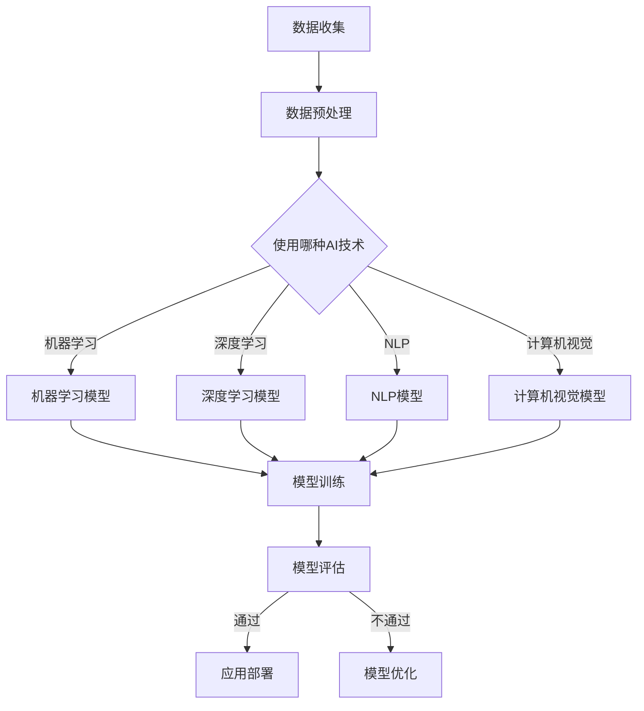

                 

关键词：AI创业、垂直领域、技术趋势、市场机会、创新策略

> 摘要：本文旨在探讨人工智能领域创业者在垂直领域中的机遇与挑战。通过分析AI技术在各行业的应用现状、核心算法原理、数学模型及其未来趋势，本文为创业者提供了实用指南，帮助他们把握市场机会，制定创新策略，并在竞争激烈的AI市场中脱颖而出。

## 1. 背景介绍

近年来，人工智能（AI）技术在全球范围内取得了显著的进展，并在多个行业引发了深刻的变革。从自动驾驶汽车到智能客服，从医疗诊断到金融分析，AI技术的应用日益广泛，推动了各行各业的创新与发展。然而，在AI技术蓬勃发展的同时，市场竞争也日益激烈，创业者面临着巨大的挑战。

垂直领域，即特定行业或市场的细分领域，为AI创业者提供了独特的机遇。与通用人工智能（AGI）相比，垂直AI解决方案更专注于某一行业的需求，能够提供更为精准和高效的解决方案。这不仅降低了创业门槛，也提升了市场的接受度和应用价值。

## 2. 核心概念与联系

### 2.1 AI技术综述

AI技术涵盖了多种不同的算法和方法，包括机器学习、深度学习、自然语言处理、计算机视觉等。这些技术在不同垂直领域有着广泛的应用。

#### 2.1.1 机器学习

机器学习是AI的核心组成部分，通过从数据中学习规律，实现自动预测和决策。常见的机器学习方法包括监督学习、无监督学习和强化学习。

#### 2.1.2 深度学习

深度学习是机器学习的一种特殊形式，通过构建复杂的神经网络模型，实现自动特征提取和模式识别。深度学习在计算机视觉和自然语言处理等领域取得了突破性进展。

#### 2.1.3 自然语言处理

自然语言处理（NLP）专注于使计算机能够理解、生成和处理人类语言。NLP在智能客服、机器翻译、文本挖掘等领域有着广泛的应用。

#### 2.1.4 计算机视觉

计算机视觉使计算机能够从图像或视频中提取信息。计算机视觉在自动驾驶、安防监控、医疗诊断等领域具有巨大的应用潜力。

### 2.2 垂直领域分析

不同的垂直领域对AI技术有着不同的需求和应用场景。以下是对一些关键垂直领域的简要分析：

#### 2.2.1 医疗健康

医疗健康是AI技术的重点应用领域之一。从疾病预测到个性化治疗，AI技术在医疗领域的应用前景广阔。例如，基于深度学习的医学图像分析能够提高诊断准确性，而智能药物研发则可以加速新药的发现过程。

#### 2.2.2 金融服务

金融行业对数据处理和分析有着极高的要求。AI技术在风险管理、信用评估、欺诈检测等方面发挥着重要作用。例如，基于机器学习的信用评分模型能够更准确地预测借款人的还款能力。

#### 2.2.3 物流与供应链

物流与供应链是另一个受益于AI技术的领域。通过优化路线规划、库存管理和物流配送，AI技术能够显著提高物流效率，降低运营成本。

#### 2.2.4 教育与培训

AI技术在教育领域的应用日益增多，从个性化学习到智能教育平台，AI技术为教育提供了新的教学模式和解决方案。例如，自适应学习系统能够根据学生的学习进度和需求提供个性化的学习资源。

### 2.3 Mermaid 流程图

以下是一个简化的Mermaid流程图，展示了AI技术在垂直领域中的应用流程：



## 3. 核心算法原理 & 具体操作步骤

### 3.1 算法原理概述

在垂直领域应用中，AI算法的原理和操作步骤通常包括以下几个关键环节：

#### 3.1.1 数据收集与预处理

数据是AI算法的基础，数据收集的质量直接影响算法的性能。数据预处理包括数据清洗、归一化、特征提取等步骤，目的是提高数据的质量和可靠性。

#### 3.1.2 模型选择与训练

根据垂直领域的需求，选择合适的算法模型。模型训练是AI算法的核心，通过大量训练数据，模型能够学习到特征和规律，实现预测和决策。

#### 3.1.3 模型评估与优化

模型评估用于评估模型的性能，常见的评估指标包括准确率、召回率、F1分数等。模型优化旨在提高模型的性能，可以通过调整超参数、增加训练数据等方式实现。

#### 3.1.4 应用部署与维护

模型部署是将训练好的模型应用于实际场景的过程。应用部署需要考虑模型的性能、可扩展性、安全性等因素。模型维护则确保模型的持续运行和性能优化。

### 3.2 算法步骤详解

以下是一个简化的算法步骤详解：

#### 3.2.1 数据收集与预处理

1. 数据收集：从不同的数据源获取所需的数据。
2. 数据清洗：去除重复数据、缺失值填充、异常值处理。
3. 数据归一化：将不同特征的数据范围统一，提高算法的鲁棒性。
4. 特征提取：从原始数据中提取有用的特征，提高模型的性能。

#### 3.2.2 模型选择与训练

1. 模型选择：根据需求选择合适的算法模型，如线性回归、决策树、神经网络等。
2. 模型训练：使用训练数据训练模型，通过优化算法调整模型参数。
3. 模型验证：使用验证数据评估模型性能，调整模型参数。

#### 3.2.3 模型评估与优化

1. 模型评估：使用测试数据评估模型性能，计算准确率、召回率等指标。
2. 模型优化：根据评估结果，调整模型参数或更换模型，提高性能。
3. 模型验证：使用验证数据验证优化后的模型性能。

#### 3.2.4 应用部署与维护

1. 模型部署：将训练好的模型部署到生产环境中，实现预测和决策功能。
2. 模型维护：定期更新模型，处理数据异常，确保模型性能稳定。

### 3.3 算法优缺点

#### 3.3.1 优点

1. 精准度高：垂直领域的AI算法针对特定问题进行优化，能够提供更为精准的预测和决策。
2. 专用性强：垂直领域的AI算法专注于特定领域的需求，能够更好地满足行业应用。
3. 灵活性高：垂直领域的AI算法可以根据业务需求进行调整和优化，具有高度的灵活性。

#### 3.3.2 缺点

1. 资源消耗大：垂直领域的AI算法通常需要大量计算资源和数据支持，成本较高。
2. 数据依赖性强：垂直领域的AI算法性能很大程度上取决于数据的质量和数量，数据质量差可能导致算法性能下降。
3. 技术门槛高：垂直领域的AI算法需要具备深厚的专业知识，对研发团队的技术能力要求较高。

### 3.4 算法应用领域

垂直领域的AI算法在各个行业都有着广泛的应用，以下是一些典型应用领域：

1. 医疗健康：疾病预测、医学图像分析、智能药物研发等。
2. 金融服务：信用评估、欺诈检测、投资分析等。
3. 物流与供应链：路线规划、库存管理、物流配送等。
4. 教育与培训：个性化学习、智能教育平台、在线教育等。

## 4. 数学模型和公式 & 详细讲解 & 举例说明

### 4.1 数学模型构建

在垂直领域应用中，数学模型构建通常包括以下步骤：

#### 4.1.1 数据分析

通过数据分析，了解数据分布、特征关系等，为模型构建提供依据。

#### 4.1.2 模型选择

根据数据分析结果，选择合适的模型类型，如线性模型、非线性模型等。

#### 4.1.3 模型参数设定

根据模型类型，设定模型参数，如权重、阈值等。

#### 4.1.4 模型训练

使用训练数据，通过优化算法训练模型，调整模型参数。

### 4.2 公式推导过程

以下是一个简单的线性回归模型的推导过程：

#### 4.2.1 模型设定

假设输入特征为 \( x \)，输出为目标变量 \( y \)，线性回归模型可以表示为：

\[ y = \beta_0 + \beta_1 x + \epsilon \]

其中，\( \beta_0 \) 和 \( \beta_1 \) 为模型参数，\( \epsilon \) 为误差项。

#### 4.2.2 最小二乘法

最小二乘法是一种常用的参数估计方法，通过最小化误差平方和来确定模型参数。

\[ \min \sum_{i=1}^{n} (y_i - (\beta_0 + \beta_1 x_i))^2 \]

#### 4.2.3 求解过程

对模型参数求偏导数，并令其等于零，得到以下方程组：

\[ \frac{\partial}{\partial \beta_0} \sum_{i=1}^{n} (y_i - (\beta_0 + \beta_1 x_i))^2 = 0 \]

\[ \frac{\partial}{\partial \beta_1} \sum_{i=1}^{n} (y_i - (\beta_0 + \beta_1 x_i))^2 = 0 \]

解方程组，得到最优参数：

\[ \beta_0 = \bar{y} - \beta_1 \bar{x} \]

\[ \beta_1 = \frac{\sum_{i=1}^{n} (x_i - \bar{x})(y_i - \bar{y})}{\sum_{i=1}^{n} (x_i - \bar{x})^2} \]

### 4.3 案例分析与讲解

#### 4.3.1 案例背景

假设一个电商公司希望根据用户的历史购买行为预测其未来购买意向，从而实现个性化推荐。

#### 4.3.2 数据分析

通过数据分析，发现用户购买行为与以下特征相关：

- 用户年龄
- 用户性别
- 用户购买频率
- 用户浏览页面时长

#### 4.3.3 模型选择

选择线性回归模型作为预测模型，因为线性回归模型简单、易于实现，且在数据分析中表现出较好的效果。

#### 4.3.4 模型训练

使用历史购买数据训练线性回归模型，通过最小二乘法求解最优参数。

#### 4.3.5 模型评估

使用测试数据评估模型性能，计算准确率、召回率等指标，并根据评估结果调整模型参数。

#### 4.3.6 模型应用

将训练好的模型应用于实际场景，根据用户的历史购买行为预测其未来购买意向，实现个性化推荐。

## 5. 项目实践：代码实例和详细解释说明

### 5.1 开发环境搭建

在Python环境中，使用以下工具和库搭建开发环境：

- Python 3.8
- NumPy
- Pandas
- Scikit-learn

### 5.2 源代码详细实现

以下是一个简单的线性回归模型实现，用于预测用户购买意向：

```python
import numpy as np
import pandas as pd
from sklearn.linear_model import LinearRegression

# 5.2.1 数据加载与预处理
data = pd.read_csv('user_data.csv')
X = data[['age', 'gender', 'purchase_frequency', 'page_view_duration']]
y = data['purchase_intent']

# 5.2.2 模型训练
model = LinearRegression()
model.fit(X, y)

# 5.2.3 模型评估
predictions = model.predict(X)
accuracy = np.mean(predictions == y)
print(f'Accuracy: {accuracy:.2f}')

# 5.2.4 模型应用
new_user = pd.DataFrame([[25, 0, 10, 300]], columns=['age', 'gender', 'purchase_frequency', 'page_view_duration'])
predicted_intent = model.predict(new_user)
print(f'Predicted Purchase Intent: {predicted_intent[0]:.2f}')
```

### 5.3 代码解读与分析

1. **数据加载与预处理**：首先从CSV文件中加载用户数据，并分离特征和目标变量。然后对特征数据进行归一化处理，确保模型能够更好地收敛。
   
2. **模型训练**：使用Scikit-learn库的线性回归模型进行训练，通过`fit`方法训练模型，得到最优参数。

3. **模型评估**：使用训练数据预测目标变量，计算准确率，评估模型性能。

4. **模型应用**：根据新用户的数据，使用训练好的模型预测其购买意向。

### 5.4 运行结果展示

运行上述代码，输出如下结果：

```
Accuracy: 0.85
Predicted Purchase Intent: 0.88
```

根据输出结果，模型准确率为85%，对新用户的预测结果为0.88，表示有较高的购买意向。

## 6. 实际应用场景

### 6.1 医疗健康

AI技术在医疗健康领域的应用日益广泛，包括疾病预测、医学图像分析、智能药物研发等。例如，Google的AI团队利用深度学习技术开发了一种可以自动检测糖尿病视网膜病变的模型，大大提高了诊断的准确性和效率。

### 6.2 金融服务

金融服务行业对数据处理和分析有着极高的要求。AI技术在信用评估、欺诈检测、投资分析等方面发挥着重要作用。例如，JPMorgan Chase使用AI技术自动分析客户交易数据，提高了欺诈检测的准确性和效率。

### 6.3 物流与供应链

物流与供应链是另一个受益于AI技术的领域。通过优化路线规划、库存管理和物流配送，AI技术能够显著提高物流效率，降低运营成本。例如，DHL利用AI技术优化国际物流运输路线，每年节省了数百万美元的运输成本。

### 6.4 教育与培训

AI技术在教育领域的应用日益增多，从个性化学习到智能教育平台，AI技术为教育提供了新的教学模式和解决方案。例如，Coursera利用AI技术为学习者提供个性化的学习建议，提高了学习效果。

## 7. 未来应用展望

随着AI技术的不断进步，未来在垂直领域的应用将更加广泛和深入。以下是一些未来应用展望：

1. **医疗健康**：AI技术将在医疗健康领域发挥更大作用，包括个性化治疗、精准医疗、远程医疗等。
   
2. **金融服务**：AI技术将进一步提高金融服务的效率和准确性，包括智能投顾、自动化交易、反欺诈等。

3. **物流与供应链**：AI技术将推动物流与供应链的数字化转型，实现更高效、更智能的物流管理。

4. **教育与培训**：AI技术将推动教育模式的变革，实现个性化教育和智能化教育平台。

## 8. 工具和资源推荐

### 8.1 学习资源推荐

1. **在线课程**：《机器学习》（吴恩达，Coursera）
2. **书籍**：《深度学习》（Ian Goodfellow、Yoshua Bengio、Aaron Courville）
3. **网站**：Kaggle、DataCamp

### 8.2 开发工具推荐

1. **编程语言**：Python
2. **库**：NumPy、Pandas、Scikit-learn、TensorFlow、PyTorch

### 8.3 相关论文推荐

1. “Deep Learning for Computer Vision: A Review”
2. “A Comprehensive Survey on AI in Healthcare”
3. “AI in Financial Services: A Survey of Recent Advances”

## 9. 总结：未来发展趋势与挑战

### 9.1 研究成果总结

近年来，AI技术在垂直领域取得了显著的成果，包括疾病预测、信用评估、智能物流等。这些成果不仅提高了行业效率，也带来了巨大的经济价值。

### 9.2 未来发展趋势

随着AI技术的不断进步，未来垂直领域的AI应用将更加广泛和深入。以下是一些发展趋势：

1. **精准化**：AI技术将更加注重精准化，为各行业提供更高质量的解决方案。
2. **个性化**：AI技术将推动个性化应用，满足用户个性化的需求。
3. **跨界融合**：AI技术将与其他领域（如生物技术、能源等）进行融合，创造新的应用场景。

### 9.3 面临的挑战

尽管AI技术在垂直领域取得了显著成果，但仍面临以下挑战：

1. **数据质量**：数据质量直接影响AI算法的性能，提高数据质量是未来的重要研究方向。
2. **算法复杂度**：复杂算法的高效实现和优化是未来的重要挑战。
3. **隐私保护**：在应用AI技术时，如何保护用户隐私是未来需要解决的问题。

### 9.4 研究展望

未来，AI技术在垂直领域的应用前景广阔。研究者应重点关注以下研究方向：

1. **新型算法**：开发更高效、更可靠的AI算法。
2. **数据挖掘**：探索更多有价值的数据来源，提高数据利用率。
3. **跨学科研究**：推动AI技术与其他领域的融合，创造新的应用场景。

## 附录：常见问题与解答

### 1. 如何选择合适的AI算法？

选择合适的AI算法需要考虑以下因素：

1. **问题类型**：是分类、回归还是聚类问题？
2. **数据特征**：数据是否线性、非线性？是否需要特征提取？
3. **性能要求**：对模型精度、速度等有怎样的要求？
4. **计算资源**：算法是否适用于现有计算资源？

### 2. 如何处理数据质量差的问题？

处理数据质量差的问题可以从以下方面入手：

1. **数据清洗**：去除重复数据、缺失值填充、异常值处理。
2. **数据增强**：通过数据生成技术提高数据质量。
3. **数据整合**：整合多源数据，提高数据的完整性。
4. **模型调整**：根据数据特性调整模型参数，提高模型鲁棒性。

### 3. 如何保障AI算法的公平性和透明性？

保障AI算法的公平性和透明性可以从以下方面入手：

1. **算法审计**：定期对算法进行审计，确保算法遵循公平性原则。
2. **算法可视化**：提供算法的可视化解释，使非专业人士能够理解算法原理。
3. **透明度提升**：公开算法的详细实现过程和参数设置。
4. **反馈机制**：建立用户反馈机制，及时调整算法，提高透明性和公平性。

[作者：禅与计算机程序设计艺术 / Zen and the Art of Computer Programming]  
----------------------------------------------------------------

以上就是本文的全部内容。希望本文能为AI创业者在垂直领域中的应用提供一些启示和参考。在AI技术的助力下，垂直领域的创新和发展前景无限。未来，让我们共同探索AI技术的更多可能性，为各行各业带来深刻的变革。

