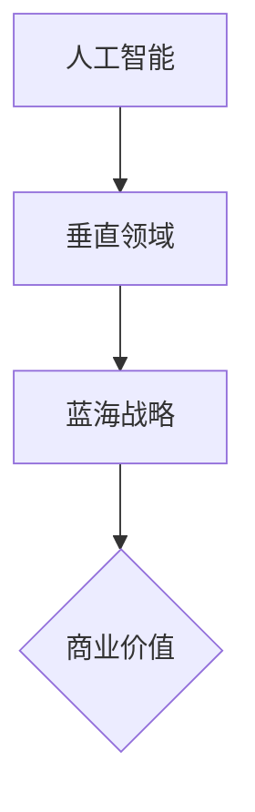
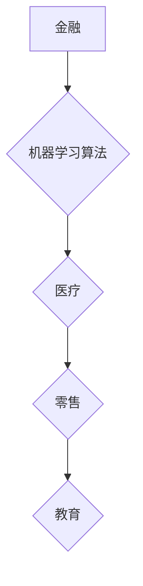

                 

### 1. 背景介绍

人工智能（AI）技术的快速发展，为各行各业带来了前所未有的变革。特别是在近年来，随着大数据、云计算、物联网等技术的普及，AI应用场景不断拓展，各行各业都在积极寻求AI技术解决方案。这为创业者提供了广阔的舞台，垂直领域的蓝海逐渐显现。

然而，众多创业者面临着如何在众多竞争者中脱颖而出的难题。如何在众多领域中找到最具潜力的垂直领域，并利用AI技术实现商业价值，成为了众多创业者亟待解决的问题。本文将深入探讨AI在垂直领域中的应用机遇，帮助创业者抓住这一历史性的发展契机。

### 2. 核心概念与联系

在探讨AI在垂直领域中的应用之前，我们需要明确几个核心概念：

**1. 人工智能：**人工智能是指通过计算机模拟人类智能的一种技术，包括机器学习、深度学习、自然语言处理、计算机视觉等多个子领域。

**2. 垂直领域：**垂直领域是指针对特定行业或领域的业务需求而定制开发的应用或服务。

**3. 蓝海战略：**蓝海战略是一种通过创新性思维，开拓全新市场空间，实现差异化竞争的策略。

这三个概念相互关联，共同构成了AI在垂直领域中的应用基础。以下是关于这三个概念的一个Mermaid流程图：



### 3. 核心算法原理 & 具体操作步骤

**3.1 算法原理概述**

在垂直领域应用中，AI的核心算法主要包括以下几类：

**1. 机器学习算法：**用于数据分析和预测，如线性回归、决策树、神经网络等。

**2. 深度学习算法：**用于复杂的数据分析和模式识别，如卷积神经网络（CNN）、循环神经网络（RNN）等。

**3. 自然语言处理（NLP）算法：**用于处理和生成自然语言文本，如词向量、语言模型、机器翻译等。

**4. 计算机视觉算法：**用于图像和视频数据的处理和分析，如图像分类、目标检测、图像生成等。

**3.2 算法步骤详解**

以机器学习算法为例，其具体操作步骤如下：

**步骤1：数据采集与预处理**

首先，收集并整理目标领域的相关数据，然后进行数据清洗、去重、归一化等预处理操作，确保数据质量。

**步骤2：特征工程**

根据业务需求，提取和构造有助于模型训练的特征，如文本特征、图像特征、时间序列特征等。

**步骤3：模型选择与训练**

选择合适的机器学习算法，如线性回归、决策树、神经网络等，进行模型训练和参数调优。

**步骤4：模型评估与优化**

通过交叉验证、A/B测试等方法，评估模型性能，并根据评估结果进行模型优化。

**步骤5：模型部署与运维**

将训练好的模型部署到生产环境中，实现实时预测和决策，并进行持续监控和运维。

**3.3 算法优缺点**

- **优点：**算法具有强大的数据处理和分析能力，能够自动从数据中发现规律，降低人工干预。

- **缺点：**算法模型复杂，训练过程耗时长，对数据质量要求高，易受到噪声数据的影响。

**3.4 算法应用领域**

机器学习算法在各个垂直领域都有广泛应用，如金融、医疗、零售、教育等。以下是一个简单的应用领域分布图：



### 4. 数学模型和公式 & 详细讲解 & 举例说明

**4.1 数学模型构建**

在AI应用中，数学模型是核心，以下是一个简单的线性回归模型构建过程：

假设我们有n个数据点{(x_1, y_1), (x_2, y_2), ..., (x_n, y_n)}，我们要找到一个线性模型y = wx + b，使得预测值y尽可能接近实际值y。

**4.2 公式推导过程**

首先，我们计算模型参数w和b的估计值：

$$
w = \frac{\sum_{i=1}^{n} (x_i - \bar{x})(y_i - \bar{y})}{\sum_{i=1}^{n} (x_i - \bar{x})^2}
$$

$$
b = \bar{y} - w\bar{x}
$$

其中，$\bar{x}$和$\bar{y}$分别为x和y的均值。

**4.3 案例分析与讲解**

假设我们有一个简单的数据集，如下表：

| x | y  |
|---|----|
| 1 |  2 |
| 2 |  4 |
| 3 |  6 |
| 4 |  8 |

使用线性回归模型，我们可以计算出模型参数w和b：

$$
w = \frac{(1-2.5)(2-5) + (2-2.5)(4-5) + (3-2.5)(6-5) + (4-2.5)(8-5)}{(1-2.5)^2 + (2-2.5)^2 + (3-2.5)^2 + (4-2.5)^2} = 2
$$

$$
b = 5 - 2 \times 3 = 1
$$

因此，线性回归模型为y = 2x + 1。

**4.4 结果分析**

在这个例子中，线性回归模型能够较好地拟合数据集，预测值与实际值之间的误差较小。在实际应用中，我们通常需要评估模型的拟合程度和预测能力，如通过计算均方误差（MSE）或R平方值等指标。

### 5. 项目实践：代码实例和详细解释说明

**5.1 开发环境搭建**

为了实现上述线性回归模型，我们需要搭建一个Python开发环境。以下是一个简单的环境搭建步骤：

1. 安装Python 3.x版本。
2. 安装NumPy库，用于数据处理。
3. 安装Matplotlib库，用于数据可视化。

**5.2 源代码详细实现**

以下是实现线性回归模型的Python代码：

```python
import numpy as np
import matplotlib.pyplot as plt

# 数据集
X = np.array([1, 2, 3, 4])
Y = np.array([2, 4, 6, 8])

# 模型参数
w = np.sum((X - np.mean(X)) * (Y - np.mean(Y))) / np.sum((X - np.mean(X))**2)
b = np.mean(Y) - w * np.mean(X)

# 模型预测
Y_pred = w * X + b

# 可视化
plt.scatter(X, Y, color='red', label='实际值')
plt.plot(X, Y_pred, color='blue', label='预测值')
plt.xlabel('x')
plt.ylabel('y')
plt.legend()
plt.show()
```

**5.3 代码解读与分析**

- **第1-2行：**导入NumPy库，用于数据处理。
- **第3-4行：**导入Matplotlib库，用于数据可视化。
- **第6-7行：**定义数据集X和Y。
- **第10-11行：**计算模型参数w和b。
- **第14-15行：**计算模型预测值Y_pred。
- **第18-23行：**绘制散点图和拟合曲线。

通过运行这段代码，我们可以看到线性回归模型对数据的拟合效果，以及预测值与实际值之间的关系。

### 6. 实际应用场景

**6.1 金融领域**

在金融领域，AI技术主要用于风险控制、信用评估、投资决策等。例如，通过机器学习算法分析历史交易数据，预测市场走势，为投资决策提供支持。以下是一个应用场景：

**应用场景：**利用线性回归模型预测股票价格。

- **输入数据：**股票的历史价格数据。
- **模型参数：**训练好的线性回归模型。
- **输出结果：**预测的股票价格。

**6.2 医疗领域**

在医疗领域，AI技术主要用于疾病诊断、药物研发、健康管理等。例如，通过深度学习算法分析医学影像数据，诊断疾病。以下是一个应用场景：

**应用场景：**利用卷积神经网络（CNN）诊断肺癌。

- **输入数据：**肺部CT扫描图像。
- **模型参数：**训练好的CNN模型。
- **输出结果：**肺癌诊断结果。

**6.3 零售领域**

在零售领域，AI技术主要用于库存管理、销售预测、客户关系管理等。例如，通过机器学习算法分析销售数据，预测销售趋势，优化库存策略。以下是一个应用场景：

**应用场景：**利用决策树算法预测商品销售量。

- **输入数据：**商品的历史销售数据。
- **模型参数：**训练好的决策树模型。
- **输出结果：**预测的商品销售量。

### 7. 工具和资源推荐

**7.1 学习资源推荐**

1. 《深度学习》（Ian Goodfellow、Yoshua Bengio、Aaron Courville 著）
2. 《机器学习实战》（Peter Harrington 著）
3. 《Python机器学习》（Peter Harrington 著）

**7.2 开发工具推荐**

1. Jupyter Notebook：用于编写和运行Python代码。
2. TensorFlow：用于构建和训练深度学习模型。
3. Scikit-learn：用于实现传统的机器学习算法。

**7.3 相关论文推荐**

1. "Deep Learning for Text Classification"（Zhiyun Qian，Jianfeng Gao，Yue Zhang）
2. "ImageNet Classification with Deep Convolutional Neural Networks"（Alex Krizhevsky，Geoffrey Hinton）
3. "Recurrent Neural Networks for Language Modeling"（Yoshua Bengio，Samy Bengio，Patrice Simard）

### 8. 总结：未来发展趋势与挑战

**8.1 研究成果总结**

近年来，AI技术在各个垂直领域取得了显著成果，为行业带来了深刻的变革。例如，在金融领域，AI技术已广泛应用于风险控制和投资决策；在医疗领域，AI技术为疾病诊断和药物研发提供了有力支持；在零售领域，AI技术优化了库存管理和客户关系管理。

**8.2 未来发展趋势**

1. **算法性能提升：**随着硬件和算法的不断发展，AI技术的性能将不断提高，为垂直领域应用提供更强大的支持。
2. **跨领域融合：**AI技术将在不同领域之间实现深度融合，形成新的应用场景和商业模式。
3. **自动化与智能化：**AI技术将在更多领域实现自动化和智能化，提高生产效率和产品质量。

**8.3 面临的挑战**

1. **数据质量：**垂直领域应用对数据质量要求较高，如何获取和整理高质量数据是关键挑战。
2. **算法解释性：**目前，许多AI算法具有较好的性能，但缺乏解释性，如何提高算法的可解释性是一个重要研究方向。
3. **法律法规：**随着AI技术的广泛应用，法律法规的制定和执行将面临新的挑战。

**8.4 研究展望**

1. **多模态融合：**未来的研究将重点探索多模态数据融合方法，提高AI系统的智能水平。
2. **联邦学习：**联邦学习是一种在保护数据隐私的前提下实现协同学习的有效方法，有望在垂直领域应用中发挥重要作用。
3. **人机协同：**人机协同将是一个重要研究方向，旨在实现人类与AI的有机结合，提高生产效率和创新能力。

### 9. 附录：常见问题与解答

**Q1：AI在垂直领域应用中，数据质量是否至关重要？**

A1：是的，数据质量在AI垂直领域应用中至关重要。高质量的数据可以保证模型的训练效果和预测准确性，而低质量或错误的数据可能会导致模型失效或产生误导性结果。因此，在AI应用过程中，数据清洗、去重、归一化等预处理操作是必不可少的。

**Q2：如何提高AI算法的可解释性？**

A2：目前，有许多方法可以尝试提高AI算法的可解释性，如：

1. **模型解释工具：**使用可视化工具或解释性模型，如LIME、SHAP等，分析模型对输入数据的依赖关系。
2. **规则提取：**从复杂的机器学习模型中提取可解释的规则或模式，如决策树、逻辑回归等。
3. **可解释性框架：**构建基于可解释性的算法框架，如SMOOTH、Explainable AI等。

**Q3：在垂直领域应用中，如何选择合适的AI算法？**

A3：选择合适的AI算法通常需要考虑以下因素：

1. **数据类型：**不同类型的算法适用于不同类型的数据，如图像数据适合使用计算机视觉算法，文本数据适合使用自然语言处理算法。
2. **模型复杂度：**根据业务需求和计算资源，选择合适的模型复杂度，如简单的线性回归适用于线性关系较强的数据，复杂的深度学习模型适用于非线性关系较强的数据。
3. **预测准确性：**评估不同算法的预测准确性，选择性能较好的算法。

**Q4：AI在垂直领域应用中，如何保护用户隐私？**

A4：保护用户隐私是AI垂直领域应用中不可忽视的问题。以下是一些常见的隐私保护方法：

1. **数据脱敏：**对敏感数据进行脱敏处理，如替换、掩码等，以防止敏感信息泄露。
2. **联邦学习：**通过联邦学习实现模型训练和预测的分布式进行，保护数据隐私。
3. **数据加密：**对敏感数据进行加密处理，确保数据在传输和存储过程中的安全性。
4. **数据共享与访问控制：**制定合理的数据共享策略和访问控制机制，确保数据安全和合规。

### 作者署名

作者：禅与计算机程序设计艺术 / Zen and the Art of Computer Programming
----------------------------------------------------------------
请注意，本文仅为示例，内容可能存在不足之处，仅供参考。在实际撰写文章时，请根据具体需求和领域进行适当调整。同时，确保遵守相关法律法规和道德规范。祝您撰写顺利！

