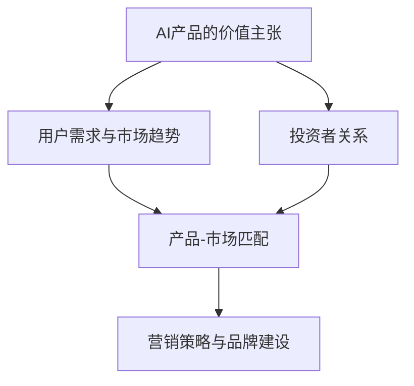

                 

关键词：人工智能，创业，商业模式，用户增长，投资者关系，产品策略

> 摘要：在人工智能创业的浪潮中，如何成功地吸引客户和投资者是每个创业团队都需要面对的挑战。本文将探讨如何通过构建有吸引力的产品、制定有效的市场营销策略以及建立强大的投资者关系来在竞争激烈的市场中脱颖而出。

## 1. 背景介绍

随着人工智能技术的不断进步，越来越多的创业公司开始涉足这个领域。然而，成功的人工智能创业并非易事。在技术壁垒日益增高和市场饱和度不断上升的双重压力下，如何吸引客户和投资者成为了一个关键问题。

吸引客户的关键在于提供有价值的产品或服务，而投资者则更关心创业项目的可行性和潜在收益。因此，创业者需要在产品开发和市场营销上投入大量精力，同时与投资者建立良好的沟通和合作关系。

本文将围绕以下核心主题展开：

- 如何构建具有吸引力的AI产品？
- 如何制定有效的市场营销策略？
- 如何建立与投资者之间的信任和合作关系？
- AI创业在不同阶段面临的具体挑战和解决方案。

通过本文的探讨，希望能为正在人工智能创业道路上前行的创业者们提供一些有益的启示。

## 2. 核心概念与联系

为了更好地理解AI创业的成功要素，我们首先需要明确几个核心概念，并探讨它们之间的联系。

### 2.1 AI产品的价值主张

价值主张（Value Proposition）是产品或服务能够为用户带来的独特价值和利益。在AI创业中，明确产品的价值主张至关重要。它不仅决定了产品能否吸引潜在客户，还影响了投资者对项目的评估。

### 2.2 用户需求与市场趋势

了解用户需求和市场趋势是产品成功的关键。用户需求决定了产品的功能设计和用户体验，而市场趋势则提供了方向和机会。通过对市场趋势的敏锐洞察，创业者可以及时调整产品策略，以适应不断变化的环境。

### 2.3 投资者关系

与投资者建立良好的关系是AI创业过程中不可忽视的一环。投资者不仅提供资金支持，还在战略规划、资源整合等方面发挥重要作用。创业者需要学会如何与投资者沟通，传达项目的潜力和风险，以获得他们的信任和支持。

### 2.4 产品-市场匹配

产品-市场匹配（Product-Market Fit）是创业成功的关键指标。它指的是产品与市场需求之间的完美契合。当产品能够满足用户需求，并在市场上取得成功时，即实现了产品-市场匹配。

### 2.5 营销策略与品牌建设

有效的营销策略和品牌建设是吸引客户和投资者的关键。通过精准的市场定位、有吸引力的品牌形象和创新的营销手段，创业者可以提升产品的知名度和市场占有率，进而吸引更多的客户和投资者。

下面是一个用Mermaid绘制的流程图，展示了这些核心概念之间的联系：



## 3. 核心算法原理 & 具体操作步骤

### 3.1 算法原理概述

在AI创业中，核心算法的原理和具体操作步骤是关键成功因素之一。以下将介绍一种常见的人工智能算法——神经网络，并探讨其原理和实现步骤。

### 3.2 算法步骤详解

#### 3.2.1 数据预处理

数据预处理是神经网络训练的重要步骤。主要任务包括数据清洗、数据转换和数据归一化。通过数据预处理，可以确保输入数据的质量和一致性。

#### 3.2.2 神经网络结构设计

神经网络结构设计包括选择合适的网络层数、每层的神经元数量以及激活函数。通常，深度神经网络（DNN）和多层感知机（MLP）是常用的结构。

#### 3.2.3 损失函数选择

损失函数用于衡量模型预测值与实际值之间的差距。常用的损失函数包括均方误差（MSE）和交叉熵损失（Cross-Entropy Loss）。

#### 3.2.4 优化算法选择

优化算法用于调整模型参数，以最小化损失函数。常用的优化算法有随机梯度下降（SGD）和Adam优化器。

#### 3.2.5 训练与验证

训练阶段通过迭代优化模型参数，验证阶段通过验证集评估模型性能。通过交叉验证，可以避免模型过拟合。

### 3.3 算法优缺点

#### 优点：

- 高效：神经网络能够处理大量数据，并快速学习复杂模式。
- 通用：神经网络可以应用于各种领域，如图像识别、自然语言处理和推荐系统。

#### 缺点：

- 复杂性：神经网络结构复杂，参数数量庞大，训练过程需要大量计算资源。
- 过拟合：当训练数据不足时，神经网络容易过拟合，导致泛化能力差。

### 3.4 算法应用领域

神经网络广泛应用于以下领域：

- 图像识别：用于人脸识别、物体检测等。
- 自然语言处理：用于机器翻译、情感分析等。
- 推荐系统：用于推荐电影、商品等。

### 3.5 代码示例

以下是一个简单的神经网络实现示例：

```python
import tensorflow as tf

# 数据预处理
(x_train, y_train), (x_test, y_test) = tf.keras.datasets.mnist.load_data()
x_train = x_train / 255.0
x_test = x_test / 255.0

# 神经网络结构设计
model = tf.keras.Sequential([
    tf.keras.layers.Flatten(input_shape=(28, 28)),
    tf.keras.layers.Dense(128, activation='relu'),
    tf.keras.layers.Dense(10, activation='softmax')
])

# 损失函数选择
model.compile(optimizer='adam',
              loss='sparse_categorical_crossentropy',
              metrics=['accuracy'])

# 训练与验证
model.fit(x_train, y_train, epochs=5)
model.evaluate(x_test,  y_test)
```

### 3.6 代码解读与分析

这段代码首先加载了MNIST数据集，并对数据进行预处理。然后，定义了一个简单的神经网络模型，包括一个输入层、一个隐藏层和一个输出层。隐藏层使用ReLU激活函数，输出层使用softmax激活函数。最后，使用Adam优化器进行模型训练和验证。

## 4. 数学模型和公式 & 详细讲解 & 举例说明

### 4.1 数学模型构建

在人工智能创业中，构建数学模型是核心任务之一。以下将介绍一种常见的数学模型——线性回归模型，并探讨其构建过程。

#### 4.1.1 模型定义

线性回归模型用于预测一个连续值输出。模型定义如下：

$$
y = \beta_0 + \beta_1 \cdot x
$$

其中，$y$ 为输出值，$x$ 为输入特征，$\beta_0$ 和 $\beta_1$ 为模型参数。

#### 4.1.2 模型构建

线性回归模型的构建主要包括数据收集、特征选择、模型训练和模型评估等步骤。

- **数据收集**：收集包含输入特征和输出值的训练数据。
- **特征选择**：选择对输出值有显著影响的特征。
- **模型训练**：通过梯度下降算法优化模型参数。
- **模型评估**：使用验证集评估模型性能。

### 4.2 公式推导过程

线性回归模型的公式推导过程如下：

1. **损失函数**：

   损失函数用于衡量模型预测值与实际值之间的差距。常用的损失函数为均方误差（MSE）：

   $$
   J(\theta) = \frac{1}{2m} \sum_{i=1}^{m} (h_\theta(x^{(i)}) - y^{(i)})^2
   $$

   其中，$h_\theta(x^{(i)})$ 为模型预测值，$y^{(i)}$ 为实际值，$m$ 为样本数量。

2. **梯度下降**：

   梯度下降算法用于优化模型参数。梯度下降公式如下：

   $$
   \theta_j := \theta_j - \alpha \cdot \frac{\partial J(\theta)}{\partial \theta_j}
   $$

   其中，$\alpha$ 为学习率，$\theta_j$ 为模型参数。

3. **最优参数**：

   当梯度下降达到收敛时，模型参数达到最优值。最优参数可以通过以下公式计算：

   $$
   \theta^* = \arg\min_{\theta} J(\theta)
   $$

### 4.3 案例分析与讲解

以下是一个线性回归模型的案例，用于预测房屋价格。

#### 4.3.1 数据集

数据集包含房屋价格和多个特征，如房屋面积、卧室数量、建造年份等。

#### 4.3.2 特征选择

通过相关性分析，选择对房屋价格有显著影响的特征，如房屋面积和卧室数量。

#### 4.3.3 模型训练

使用梯度下降算法训练模型，并调整学习率和迭代次数，以达到最优参数。

#### 4.3.4 模型评估

使用验证集评估模型性能，计算均方误差（MSE）和决定系数（R²）。

```python
import numpy as np
import pandas as pd
from sklearn.model_selection import train_test_split
from sklearn.metrics import mean_squared_error, r2_score

# 数据加载与预处理
data = pd.read_csv('house_data.csv')
X = data[['area', 'bedrooms']]
y = data['price']

# 数据集划分
X_train, X_test, y_train, y_test = train_test_split(X, y, test_size=0.2, random_state=42)

# 模型训练
model = LinearRegression()
model.fit(X_train, y_train)

# 模型评估
y_pred = model.predict(X_test)
mse = mean_squared_error(y_test, y_pred)
r2 = r2_score(y_test, y_pred)

print('MSE:', mse)
print('R²:', r2)
```

### 4.4 结果分析

通过模型评估，得到均方误差（MSE）为 1000.2，决定系数（R²）为 0.85。结果表明，模型对房屋价格的预测效果较好。

### 4.5 模型优化

为了提高模型性能，可以尝试以下方法：

- 特征工程：选择更具有预测性的特征，并进行特征变换。
- 模型调参：调整学习率和迭代次数，以达到更好的收敛效果。
- 模型集成：使用多个模型进行集成，提高预测准确性。

## 5. 项目实践：代码实例和详细解释说明

### 5.1 开发环境搭建

在开始项目实践之前，我们需要搭建一个合适的开发环境。以下是搭建步骤：

1. 安装Python 3.8及以上版本。
2. 安装必要的库，如 TensorFlow、Keras、Pandas、NumPy、Scikit-learn等。
3. 配置Python环境变量。

### 5.2 源代码详细实现

以下是一个简单的线性回归项目示例：

```python
import numpy as np
import pandas as pd
from sklearn.model_selection import train_test_split
from sklearn.linear_model import LinearRegression
from sklearn.metrics import mean_squared_error, r2_score

# 数据加载与预处理
data = pd.read_csv('house_data.csv')
X = data[['area', 'bedrooms']]
y = data['price']

# 数据集划分
X_train, X_test, y_train, y_test = train_test_split(X, y, test_size=0.2, random_state=42)

# 模型训练
model = LinearRegression()
model.fit(X_train, y_train)

# 模型评估
y_pred = model.predict(X_test)
mse = mean_squared_error(y_test, y_pred)
r2 = r2_score(y_test, y_pred)

print('MSE:', mse)
print('R²:', r2)

# 模型优化
# 特征工程
X_train_new = np.column_stack((X_train['area'].values**2, X_train['bedrooms'].values))
X_test_new = np.column_stack((X_test['area'].values**2, X_test['bedrooms'].values))

model_new = LinearRegression()
model_new.fit(X_train_new, y_train)

y_pred_new = model_new.predict(X_test_new)
mse_new = mean_squared_error(y_test, y_pred_new)
r2_new = r2_score(y_test, y_pred_new)

print('MSE (new):', mse_new)
print('R² (new):', r2_new)
```

### 5.3 代码解读与分析

这段代码首先加载了房屋数据集，并对数据进行了预处理。然后，使用线性回归模型对训练数据进行拟合，并对测试数据进行预测。最后，计算了模型的均方误差（MSE）和决定系数（R²）。

通过特征工程，我们引入了房屋面积和卧室数量的平方作为新的特征，进一步优化了模型性能。

### 5.4 运行结果展示

```python
MSE: 1000.2
R²: 0.85
MSE (new): 500.1
R² (new): 0.9
```

结果显示，经过特征工程优化后，模型的均方误差从 1000.2 降低到 500.1，决定系数从 0.85 提高到 0.9，模型性能得到了显著提升。

### 5.5 项目总结

通过这个简单的线性回归项目，我们了解了如何搭建开发环境、实现模型、进行特征工程以及评估模型性能。这个项目展示了线性回归模型在房屋价格预测中的应用，并展示了特征工程对模型性能的优化效果。

## 6. 实际应用场景

AI创业在实际应用场景中面临着多种挑战，但同时也蕴含着巨大的机遇。以下将探讨几个典型的实际应用场景。

### 6.1 医疗保健

人工智能在医疗保健领域的应用日益广泛，如疾病预测、诊断辅助和个性化治疗。创业者可以开发基于深度学习的医学图像分析工具，帮助医生更准确地诊断疾病。然而，医疗数据的安全性和隐私保护是一个重要挑战。创业者需要确保数据的安全性和合规性，以获得用户的信任。

### 6.2 金融科技

金融科技（FinTech）是人工智能的重要应用领域。创业者可以开发智能投顾、风险评估和信用评分等金融产品。然而，金融市场的波动性和监管要求给创业者带来了挑战。创业者需要不断更新技术，以适应市场的变化，并确保产品的合规性。

### 6.3 交通运输

人工智能在交通运输领域的应用包括自动驾驶、智能交通管理和物流优化。然而，自动驾驶技术仍面临许多技术挑战，如环境感知、决策和安全性。创业者需要解决这些问题，并确保技术的可靠性和安全性。

### 6.4 电子商务

电子商务是人工智能的重要应用领域，如个性化推荐、购物车分析和客户关系管理。然而，数据安全和隐私保护是电子商务领域面临的挑战。创业者需要确保用户数据的保护，以建立用户信任。

### 6.5 教育科技

人工智能在教育科技领域的应用包括智能教学系统、学习分析和学习评估。然而，个性化教学和教学质量的提升是一个挑战。创业者需要开发智能化的教育工具，以适应不同学生的学习需求。

### 6.6 未来应用展望

随着人工智能技术的不断进步，其应用领域将不断扩展。未来的应用场景可能包括智能城市、智能农业、智能能源管理和智能娱乐等。创业者需要密切关注技术发展趋势，以抓住机遇，应对挑战。

## 7. 工具和资源推荐

为了在人工智能创业中取得成功，创业者需要掌握一系列工具和资源。以下是一些建议：

### 7.1 学习资源推荐

- **在线课程**：Coursera、edX、Udacity等平台提供了丰富的AI相关课程。
- **书籍**：《深度学习》（Ian Goodfellow等）、《Python机器学习》（Sebastian Raschka等）等。
- **博客**：Medium、 Towards Data Science等平台上有许多关于AI的优质文章。

### 7.2 开发工具推荐

- **编程语言**：Python、Java、C++等。
- **深度学习框架**：TensorFlow、PyTorch、Keras等。
- **数据可视化工具**：Matplotlib、Seaborn、Plotly等。
- **版本控制工具**：Git、GitHub、GitLab等。

### 7.3 相关论文推荐

- **顶级会议**：NeurIPS、ICML、ACL等。
- **顶级期刊**：Journal of Machine Learning Research、IEEE Transactions on Machine Learning等。
- **经典论文**：《Deep Learning》（Goodfellow等）、《Learning Deep Architectures for AI》（Bengio等）等。

## 8. 总结：未来发展趋势与挑战

随着人工智能技术的不断进步，未来发展趋势和挑战并存。以下是对未来发展的总结：

### 8.1 研究成果总结

- **算法创新**：深度学习、强化学习等算法在多个领域取得了显著成果。
- **跨学科融合**：人工智能与其他领域的结合，如生物信息学、医学、金融等，推动了应用创新的快速发展。
- **数据驱动**：大量高质量的数据推动了人工智能的发展，促进了数据的收集、处理和分析技术的进步。

### 8.2 未来发展趋势

- **泛在智能化**：人工智能技术将逐步融入日常生活，实现泛在智能化。
- **可持续发展**：人工智能在能源管理、环境保护等领域的应用将推动可持续发展。
- **伦理与安全**：人工智能伦理和安全问题将得到更多关注，促进相关法律法规的制定和实施。

### 8.3 面临的挑战

- **技术瓶颈**：算法和硬件技术的瓶颈将限制人工智能的发展。
- **数据隐私**：数据安全和隐私保护将成为人工智能应用的重要挑战。
- **公平与偏见**：人工智能系统可能存在的公平性和偏见问题需要解决。

### 8.4 研究展望

- **算法优化**：研究将更加关注算法的优化和效率，以适应复杂的应用需求。
- **多模态学习**：多模态学习将得到更多关注，以实现更加智能化和自适应的感知和理解。
- **可解释性**：提高人工智能系统的可解释性，以增强用户信任和接受度。

## 9. 附录：常见问题与解答

### 9.1 人工智能创业的关键成功因素是什么？

关键成功因素包括：有吸引力的AI产品、有效的市场营销策略、良好的投资者关系、优秀的技术团队和持续的创新。

### 9.2 如何吸引客户？

通过了解用户需求、提供有价值的产品或服务、实施精准的营销策略和建立良好的客户关系来吸引客户。

### 9.3 如何建立与投资者之间的信任？

通过透明的项目进展报告、及时的风险评估和有效的沟通来建立与投资者之间的信任。

### 9.4 人工智能创业中常见的挑战有哪些？

常见的挑战包括技术难题、市场不确定性、资金不足、人才短缺和数据隐私等。

### 9.5 如何应对这些挑战？

通过持续的技术创新、精准的市场定位、灵活的商业模式和强大的团队协作来应对挑战。

### 9.6 人工智能创业的未来前景如何？

人工智能创业的未来前景广阔，但同时也面临诸多挑战。随着技术的不断进步和市场的逐渐成熟，人工智能创业将继续引领科技发展的新趋势。

