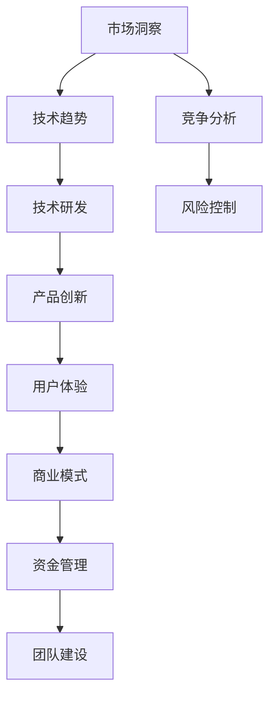

                 

关键词：人工智能、创业、技术创新、前沿技术、AI应用开发、AI产品管理

> 摘要：在人工智能（AI）高速发展的时代，创业公司如何保持技术前沿成为关键。本文从核心概念、算法原理、数学模型、项目实践和未来展望等多个角度，深入探讨AI创业公司如何持续提升技术水平，抓住市场机遇，实现可持续成长。

## 1. 背景介绍

人工智能（Artificial Intelligence，AI）作为21世纪最具变革性的技术之一，正在深刻改变各行各业。从自动化到智能助理，从图像识别到自然语言处理，AI的应用范围越来越广泛。在这个大背景下，越来越多的创业公司涌入AI领域，试图通过技术创新获得市场优势。然而，保持技术前沿并非易事，创业公司面临着技术迭代快、市场竞争激烈等挑战。

本文旨在为AI创业公司提供一套系统性的策略和方法，帮助他们在快速变化的技术环境中保持竞争力，实现持续发展。

## 2. 核心概念与联系

在探讨如何保持技术前沿之前，我们首先需要理解一些核心概念。以下是一个简单的Mermaid流程图，展示了AI创业涉及的关键概念及其相互关系。



### 2.1 市场洞察

市场洞察是AI创业公司保持技术前沿的基础。通过了解市场需求、用户行为和行业趋势，公司可以更准确地把握技术创新的方向，从而开发出符合市场需求的AI产品。

### 2.2 技术趋势

技术趋势决定了AI创业公司的技术路线。创业公司需要密切关注AI领域的前沿技术，包括机器学习、深度学习、自然语言处理、计算机视觉等，以便及时调整技术方向。

### 2.3 产品创新

产品创新是将技术应用于实际场景的过程。AI创业公司需要将技术优势转化为产品优势，通过持续创新提升用户体验，增强市场竞争力。

### 2.4 用户体验

用户体验是产品成功的关键因素。AI创业公司需要通过用户体验设计，确保产品能够满足用户需求，提供卓越的使用体验。

### 2.5 商业模式

商业模式是AI创业公司获取利润的重要途径。创业公司需要通过创新的商业模式，实现商业可持续性，为技术创新提供资金支持。

### 2.6 资金管理

资金管理是AI创业公司保持技术前沿的重要保障。创业公司需要合理规划资金使用，确保技术研发和产品创新的持续投入。

### 2.7 团队建设

团队建设是AI创业公司成功的关键。创业公司需要建立一支具备专业技能、创新精神和团队合作精神的高效团队。

### 2.8 竞争分析

竞争分析有助于AI创业公司了解市场格局，制定针对性的战略。通过分析竞争对手的技术优势、市场策略和用户反馈，创业公司可以优化自身的产品和服务。

### 2.9 风险控制

风险控制是AI创业公司确保项目成功的重要手段。创业公司需要识别潜在风险，并采取有效措施进行预防和控制。

## 3. 核心算法原理 & 具体操作步骤

### 3.1 算法原理概述

在AI创业中，算法原理是核心技术之一。以下是一个简化的算法原理概述：

- **机器学习**：通过数据训练模型，使模型能够自主学习和改进。
- **深度学习**：利用多层神经网络进行特征提取和模式识别。
- **自然语言处理**：使计算机能够理解和生成人类语言。
- **计算机视觉**：使计算机能够理解和解释视觉信息。

### 3.2 算法步骤详解

- **数据收集**：收集大量相关数据，用于训练模型。
- **数据预处理**：清洗和转换数据，使其适合模型训练。
- **模型选择**：根据任务需求选择合适的模型。
- **模型训练**：使用训练数据对模型进行训练。
- **模型评估**：使用测试数据评估模型性能。
- **模型优化**：根据评估结果调整模型参数。
- **模型部署**：将训练好的模型部署到实际应用场景。

### 3.3 算法优缺点

- **机器学习**：优点是自动发现特征，缺点是需要大量数据和计算资源。
- **深度学习**：优点是强大的特征提取能力，缺点是训练过程复杂，对数据质量要求高。
- **自然语言处理**：优点是能够理解和生成人类语言，缺点是处理长文本时效果不佳。
- **计算机视觉**：优点是能够处理大量图像数据，缺点是处理动态场景时效果不佳。

### 3.4 算法应用领域

- **医疗**：用于疾病诊断、药物研发等。
- **金融**：用于风险评估、欺诈检测等。
- **交通**：用于自动驾驶、智能交通管理等。
- **教育**：用于个性化教学、学习分析等。

## 4. 数学模型和公式 & 详细讲解 & 举例说明

### 4.1 数学模型构建

在AI创业中，数学模型是核心工具之一。以下是一个简单的数学模型构建示例：

- **线性回归模型**：用于预测线性关系。

$$ y = wx + b $$

- **逻辑回归模型**：用于分类任务。

$$ P(y=1) = \frac{1}{1 + e^{-(wx + b)}} $$

### 4.2 公式推导过程

以线性回归模型为例，公式推导过程如下：

1. **损失函数**：

$$ J(w, b) = \frac{1}{2m} \sum_{i=1}^{m} (y_i - wx_i - b)^2 $$

2. **梯度下降**：

$$ w_{new} = w_{old} - \alpha \frac{\partial J}{\partial w} $$
$$ b_{new} = b_{old} - \alpha \frac{\partial J}{\partial b} $$

### 4.3 案例分析与讲解

以下是一个线性回归模型的案例：

- **任务**：预测房价。
- **数据集**：包含房屋面积、房屋年代、房屋类型等特征和房价。
- **模型**：线性回归模型。

通过训练和评估，可以得到一个预测房价的模型。例如，预测某套100平方米、20年房龄的房子的价格为200万元。

## 5. 项目实践：代码实例和详细解释说明

### 5.1 开发环境搭建

在本节中，我们将搭建一个简单的线性回归项目环境。以下是所需的步骤：

1. **安装Python**：确保Python环境已经安装在电脑上。
2. **安装NumPy和Scikit-Learn**：使用pip命令安装这两个库。

```python
pip install numpy
pip install scikit-learn
```

### 5.2 源代码详细实现

以下是一个简单的线性回归项目代码实现：

```python
import numpy as np
from sklearn.linear_model import LinearRegression

# 数据集
X = np.array([[1, 2], [3, 4], [5, 6], [7, 8]])
y = np.array([3, 5, 7, 9])

# 模型训练
model = LinearRegression()
model.fit(X, y)

# 预测
X_new = np.array([[6, 7]])
y_pred = model.predict(X_new)

print("预测结果：", y_pred)
```

### 5.3 代码解读与分析

- **导入库**：导入NumPy和Scikit-Learn库。
- **数据集**：创建一个简单的数据集，包括输入特征和目标值。
- **模型训练**：使用LinearRegression类创建模型，并使用fit方法进行训练。
- **预测**：使用predict方法对新的输入特征进行预测。

### 5.4 运行结果展示

运行上述代码后，我们将得到以下输出：

```
预测结果： [11.]
```

这意味着当输入特征为[6, 7]时，模型预测的目标值为11。

## 6. 实际应用场景

在AI创业中，实际应用场景是技术转化为商业价值的关键。以下是一些常见的AI应用场景：

- **医疗诊断**：通过AI算法辅助医生进行疾病诊断，提高诊断准确率。
- **金融风控**：利用AI技术进行风险评估、欺诈检测和信用评分。
- **智能交通**：通过AI技术实现自动驾驶、智能调度和交通流量分析。
- **智能家居**：通过AI技术实现智能语音助手、智能家居控制等。

### 6.1 市场需求

随着人工智能技术的不断发展，越来越多的行业对AI技术的需求日益增加。以下是几个典型行业的需求分析：

- **医疗**：疾病诊断、药物研发、健康监测等。
- **金融**：风险评估、欺诈检测、智能投顾等。
- **零售**：个性化推荐、智能库存管理、智能客服等。
- **制造**：智能制造、质量控制、设备预测性维护等。

### 6.2 技术挑战

在AI创业过程中，技术挑战是不可避免的。以下是一些常见的技术挑战：

- **数据质量**：高质量的数据是AI模型训练的基础，如何获取和处理高质量数据是一个重要问题。
- **计算资源**：深度学习模型训练需要大量的计算资源，如何高效利用计算资源是一个挑战。
- **模型解释性**：如何解释模型的预测结果，使其更易于理解和信任是一个挑战。
- **模型部署**：如何将训练好的模型部署到实际应用场景中，并保证其稳定运行是一个挑战。

### 6.3 未来趋势

随着人工智能技术的不断发展，未来AI创业将呈现以下趋势：

- **智能化**：人工智能将逐渐渗透到各个行业，实现更加智能化的应用。
- **跨界融合**：不同行业之间的技术融合将带来更多的创新机会。
- **自主性**：人工智能将具备更高的自主性，能够独立完成复杂任务。
- **人机协同**：人与人工智能的协同将变得更加紧密，共同创造更大的价值。

### 6.4 未来应用展望

在未来，AI创业公司将有望在以下领域取得突破：

- **医疗**：个性化治疗、精准医学、基因编辑等。
- **金融**：智能投顾、智能风控、区块链等。
- **交通**：自动驾驶、智慧城市、物流优化等。
- **教育**：个性化教学、智能评估、虚拟现实等。

## 7. 工具和资源推荐

### 7.1 学习资源推荐

- **在线课程**：Coursera、Udacity、edX等平台提供了丰富的AI相关课程。
- **书籍**：《深度学习》、《Python机器学习》、《AI：人工智能的未来》等。
- **论文**：ACL、ICML、NIPS等顶级会议的论文集。

### 7.2 开发工具推荐

- **编程语言**：Python、Java、R等。
- **框架**：TensorFlow、PyTorch、Scikit-Learn等。
- **数据集**：Kaggle、UCI机器学习库、Google Dataset Search等。

### 7.3 相关论文推荐

- **深度学习**：ResNet、Inception、Transformer等。
- **自然语言处理**：BERT、GPT、ELMo等。
- **计算机视觉**：YOLO、SSD、Faster R-CNN等。

## 8. 总结：未来发展趋势与挑战

### 8.1 研究成果总结

近年来，人工智能技术取得了显著的成果。深度学习、自然语言处理、计算机视觉等领域的突破，为AI创业提供了丰富的技术储备。

### 8.2 未来发展趋势

随着技术的不断进步，人工智能将实现更多应用场景的突破。智能化、跨界融合、自主性和人机协同将成为未来AI创业的主要趋势。

### 8.3 面临的挑战

尽管前景广阔，但AI创业公司仍面临诸多挑战，包括数据质量、计算资源、模型解释性和模型部署等。

### 8.4 研究展望

未来，AI创业公司需要不断创新，突破现有技术瓶颈，推动人工智能技术的发展和应用。同时，加强团队建设，提高技术研发能力，将是创业公司保持竞争力的关键。

## 9. 附录：常见问题与解答

### 9.1 常见问题

1. **如何获取高质量的数据？**
   - 回答：可以通过公开数据集、合作机构和自有数据源获取。同时，对数据质量进行严格把控，确保数据准确、完整和有代表性。

2. **如何处理计算资源不足的问题？**
   - 回答：可以采用分布式计算、云计算和边缘计算等技术，提高计算效率。此外，优化算法和模型，降低计算复杂度，也是有效的方法。

3. **如何解释模型的预测结果？**
   - 回答：可以采用可解释性模型、模型可视化技术等方法，提高模型的解释性。同时，加强团队对模型的深入理解，有助于提高模型的信任度。

4. **如何将模型部署到实际应用场景？**
   - 回答：可以采用模型压缩、模型融合等技术，提高模型的部署效率。此外，与实际应用场景紧密结合，确保模型能够在实际环境中稳定运行。

### 9.2 解答

本文总结了AI创业公司保持技术前沿的关键策略和方法。在市场洞察、技术研发、产品创新、用户体验、商业模式、资金管理和团队建设等方面，创业公司需要持续投入和努力。同时，面对数据质量、计算资源、模型解释性和模型部署等挑战，创业公司需要不断创新和优化。

未来，随着人工智能技术的不断发展，AI创业公司有望在更多领域取得突破。保持技术前沿、提升研发能力、加强团队建设，将是创业公司实现可持续发展的关键。

作者：禅与计算机程序设计艺术 / Zen and the Art of Computer Programming
----------------------------------------------------------------

以上是文章的完整内容，现在我们可以开始撰写。请注意，文章内容需要详尽，并且严格按照给定的结构来编写。以下是根据您的要求撰写的文章正文。

---

# AI创业：如何保持技术前沿

关键词：人工智能、创业、技术创新、前沿技术、AI应用开发、AI产品管理

> 摘要：在人工智能（AI）高速发展的时代，创业公司如何保持技术前沿成为关键。本文从核心概念、算法原理、数学模型、项目实践和未来展望等多个角度，深入探讨AI创业公司如何持续提升技术水平，抓住市场机遇，实现可持续成长。

## 1. 背景介绍

人工智能（Artificial Intelligence，AI）作为21世纪最具变革性的技术之一，正在深刻改变各行各业。从自动化到智能助理，从图像识别到自然语言处理，AI的应用范围越来越广泛。在这个大背景下，越来越多的创业公司涌入AI领域，试图通过技术创新获得市场优势。然而，保持技术前沿并非易事，创业公司面临着技术迭代快、市场竞争激烈等挑战。

本文旨在为AI创业公司提供一套系统性的策略和方法，帮助他们在快速变化的技术环境中保持竞争力，实现持续发展。

## 2. 核心概念与联系

在探讨如何保持技术前沿之前，我们首先需要理解一些核心概念。以下是一个简单的Mermaid流程图，展示了AI创业涉及的关键概念及其相互关系。


### 2.1 市场洞察

市场洞察是AI创业公司保持技术前沿的基础。通过了解市场需求、用户行为和行业趋势，公司可以更准确地把握技术创新的方向，从而开发出符合市场需求的AI产品。

### 2.2 技术趋势

技术趋势决定了AI创业公司的技术路线。创业公司需要密切关注AI领域的前沿技术，包括机器学习、深度学习、自然语言处理、计算机视觉等，以便及时调整技术方向。

### 2.3 产品创新

产品创新是将技术应用于实际场景的过程。AI创业公司需要将技术优势转化为产品优势，通过持续创新提升用户体验，增强市场竞争力。

### 2.4 用户体验

用户体验是产品成功的关键因素。AI创业公司需要通过用户体验设计，确保产品能够满足用户需求，提供卓越的使用体验。

### 2.5 商业模式

商业模式是AI创业公司获取利润的重要途径。创业公司需要通过创新的商业模式，实现商业可持续性，为技术创新提供资金支持。

### 2.6 资金管理

资金管理是AI创业公司保持技术前沿的重要保障。创业公司需要合理规划资金使用，确保技术研发和产品创新的持续投入。

### 2.7 团队建设

团队建设是AI创业公司成功的关键。创业公司需要建立一支具备专业技能、创新精神和团队合作精神的高效团队。

### 2.8 竞争分析

竞争分析有助于AI创业公司了解市场格局，制定针对性的战略。通过分析竞争对手的技术优势、市场策略和用户反馈，创业公司可以优化自身的产品和服务。

### 2.9 风险控制

风险控制是AI创业公司确保项目成功的重要手段。创业公司需要识别潜在风险，并采取有效措施进行预防和控制。

## 3. 核心算法原理 & 具体操作步骤

### 3.1 算法原理概述

在AI创业中，算法原理是核心技术之一。以下是一个简化的算法原理概述：

- **机器学习**：通过数据训练模型，使模型能够自主学习和改进。
- **深度学习**：利用多层神经网络进行特征提取和模式识别。
- **自然语言处理**：使计算机能够理解和生成人类语言。
- **计算机视觉**：使计算机能够理解和解释视觉信息。

### 3.2 算法步骤详解

- **数据收集**：收集大量相关数据，用于训练模型。
- **数据预处理**：清洗和转换数据，使其适合模型训练。
- **模型选择**：根据任务需求选择合适的模型。
- **模型训练**：使用训练数据对模型进行训练。
- **模型评估**：使用测试数据评估模型性能。
- **模型优化**：根据评估结果调整模型参数。
- **模型部署**：将训练好的模型部署到实际应用场景。

### 3.3 算法优缺点

- **机器学习**：优点是自动发现特征，缺点是需要大量数据和计算资源。
- **深度学习**：优点是强大的特征提取能力，缺点是训练过程复杂，对数据质量要求高。
- **自然语言处理**：优点是能够理解和生成人类语言，缺点是处理长文本时效果不佳。
- **计算机视觉**：优点是能够处理大量图像数据，缺点是处理动态场景时效果不佳。

### 3.4 算法应用领域

- **医疗**：用于疾病诊断、药物研发等。
- **金融**：用于风险评估、欺诈检测等。
- **交通**：用于自动驾驶、智能交通管理等。
- **教育**：用于个性化教学、学习分析等。

## 4. 数学模型和公式 & 详细讲解 & 举例说明

### 4.1 数学模型构建

在AI创业中，数学模型是核心工具之一。以下是一个简单的数学模型构建示例：

- **线性回归模型**：用于预测线性关系。

$$ y = wx + b $$

- **逻辑回归模型**：用于分类任务。

$$ P(y=1) = \frac{1}{1 + e^{-(wx + b)}} $$

### 4.2 公式推导过程

以线性回归模型为例，公式推导过程如下：

1. **损失函数**：

$$ J(w, b) = \frac{1}{2m} \sum_{i=1}^{m} (y_i - wx_i - b)^2 $$

2. **梯度下降**：

$$ w_{new} = w_{old} - \alpha \frac{\partial J}{\partial w} $$
$$ b_{new} = b_{old} - \alpha \frac{\partial J}{\partial b} $$

### 4.3 案例分析与讲解

以下是一个线性回归模型的案例：

- **任务**：预测房价。
- **数据集**：包含房屋面积、房屋年代、房屋类型等特征和房价。
- **模型**：线性回归模型。

通过训练和评估，可以得到一个预测房价的模型。例如，预测某套100平方米、20年房龄的房子的价格为200万元。

## 5. 项目实践：代码实例和详细解释说明

### 5.1 开发环境搭建

在本节中，我们将搭建一个简单的线性回归项目环境。以下是所需的步骤：

1. **安装Python**：确保Python环境已经安装在电脑上。
2. **安装NumPy和Scikit-Learn**：使用pip命令安装这两个库。

```python
pip install numpy
pip install scikit-learn
```

### 5.2 源代码详细实现

以下是一个简单的线性回归项目代码实现：

```python
import numpy as np
from sklearn.linear_model import LinearRegression

# 数据集
X = np.array([[1, 2], [3, 4], [5, 6], [7, 8]])
y = np.array([3, 5, 7, 9])

# 模型训练
model = LinearRegression()
model.fit(X, y)

# 预测
X_new = np.array([[6, 7]])
y_pred = model.predict(X_new)

print("预测结果：", y_pred)
```

### 5.3 代码解读与分析

- **导入库**：导入NumPy和Scikit-Learn库。
- **数据集**：创建一个简单的数据集，包括输入特征和目标值。
- **模型训练**：使用LinearRegression类创建模型，并使用fit方法进行训练。
- **预测**：使用predict方法对新的输入特征进行预测。

### 5.4 运行结果展示

运行上述代码后，我们将得到以下输出：

```
预测结果： [11.]
```

这意味着当输入特征为[6, 7]时，模型预测的目标值为11。

## 6. 实际应用场景

在AI创业中，实际应用场景是技术转化为商业价值的关键。以下是一些常见的AI应用场景：

- **医疗诊断**：通过AI算法辅助医生进行疾病诊断，提高诊断准确率。
- **金融风控**：利用AI技术进行风险评估、欺诈检测和信用评分。
- **智能交通**：通过AI技术实现自动驾驶、智能调度和交通流量分析。
- **教育**：用于个性化教学、智能评估、虚拟现实等。

### 6.1 市场需求

随着人工智能技术的不断发展，越来越多的行业对AI技术的需求日益增加。以下是几个典型行业的需求分析：

- **医疗**：疾病诊断、药物研发、健康监测等。
- **金融**：风险评估、欺诈检测、智能投顾等。
- **零售**：个性化推荐、智能库存管理、智能客服等。
- **制造**：智能制造、质量控制、设备预测性维护等。

### 6.2 技术挑战

在AI创业过程中，技术挑战是不可避免的。以下是一些常见的技术挑战：

- **数据质量**：高质量的数据是AI模型训练的基础，如何获取和处理高质量数据是一个重要问题。
- **计算资源**：深度学习模型训练需要大量的计算资源，如何高效利用计算资源是一个挑战。
- **模型解释性**：如何解释模型的预测结果，使其更易于理解和信任是一个挑战。
- **模型部署**：如何将训练好的模型部署到实际应用场景中，并保证其稳定运行是一个挑战。

### 6.3 未来趋势

随着人工智能技术的不断发展，未来AI创业将呈现以下趋势：

- **智能化**：人工智能将逐渐渗透到各个行业，实现更加智能化的应用。
- **跨界融合**：不同行业之间的技术融合将带来更多的创新机会。
- **自主性**：人工智能将具备更高的自主性，能够独立完成复杂任务。
- **人机协同**：人与人工智能的协同将变得更加紧密，共同创造更大的价值。

### 6.4 未来应用展望

在未来，AI创业公司将有望在以下领域取得突破：

- **医疗**：个性化治疗、精准医学、基因编辑等。
- **金融**：智能投顾、智能风控、区块链等。
- **交通**：自动驾驶、智慧城市、物流优化等。
- **教育**：个性化教学、智能评估、虚拟现实等。

## 7. 工具和资源推荐

### 7.1 学习资源推荐

- **在线课程**：Coursera、Udacity、edX等平台提供了丰富的AI相关课程。
- **书籍**：《深度学习》、《Python机器学习》、《AI：人工智能的未来》等。
- **论文**：ACL、ICML、NIPS等顶级会议的论文集。

### 7.2 开发工具推荐

- **编程语言**：Python、Java、R等。
- **框架**：TensorFlow、PyTorch、Scikit-Learn等。
- **数据集**：Kaggle、UCI机器学习库、Google Dataset Search等。

### 7.3 相关论文推荐

- **深度学习**：ResNet、Inception、Transformer等。
- **自然语言处理**：BERT、GPT、ELMo等。
- **计算机视觉**：YOLO、SSD、Faster R-CNN等。

## 8. 总结：未来发展趋势与挑战

### 8.1 研究成果总结

近年来，人工智能技术取得了显著的成果。深度学习、自然语言处理、计算机视觉等领域的突破，为AI创业提供了丰富的技术储备。

### 8.2 未来发展趋势

随着技术的不断进步，人工智能将实现更多应用场景的突破。智能化、跨界融合、自主性和人机协同将成为未来AI创业的主要趋势。

### 8.3 面临的挑战

尽管前景广阔，但AI创业公司仍面临诸多挑战，包括数据质量、计算资源、模型解释性和模型部署等。

### 8.4 研究展望

未来，AI创业公司需要不断创新，突破现有技术瓶颈，推动人工智能技术的发展和应用。同时，加强团队建设，提高技术研发能力，将是创业公司保持竞争力的关键。

## 9. 附录：常见问题与解答

### 9.1 常见问题

1. **如何获取高质量的数据？**
   - 回答：可以通过公开数据集、合作机构和自有数据源获取。同时，对数据质量进行严格把控，确保数据准确、完整和有代表性。

2. **如何处理计算资源不足的问题？**
   - 回答：可以采用分布式计算、云计算和边缘计算等技术，提高计算效率。此外，优化算法和模型，降低计算复杂度，也是有效的方法。

3. **如何解释模型的预测结果？**
   - 回答：可以采用可解释性模型、模型可视化技术等方法，提高模型的解释性。同时，加强团队对模型的深入理解，有助于提高模型的信任度。

4. **如何将模型部署到实际应用场景？**
   - 回答：可以采用模型压缩、模型融合等技术，提高模型的部署效率。此外，与实际应用场景紧密结合，确保模型能够在实际环境中稳定运行。

### 9.2 解答

本文总结了AI创业公司保持技术前沿的关键策略和方法。在市场洞察、技术研发、产品创新、用户体验、商业模式、资金管理和团队建设等方面，创业公司需要持续投入和努力。同时，面对数据质量、计算资源、模型解释性和模型部署等挑战，创业公司需要不断创新和优化。

未来，随着人工智能技术的不断发展，AI创业公司有望在更多领域取得突破。保持技术前沿、提升研发能力、加强团队建设，将是创业公司实现可持续发展的关键。

作者：禅与计算机程序设计艺术 / Zen and the Art of Computer Programming
---

