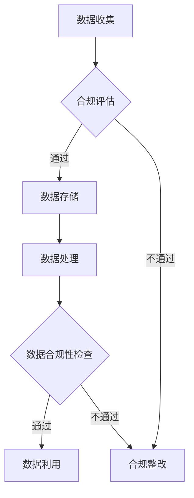

                 

关键词：人工智能、AI创业、数据管理、合规、数据隐私、数据安全、数据治理

> 摘要：本文将探讨人工智能创业过程中，数据管理与合规的重要性。通过分析数据管理的基本概念、合规要求以及实际操作，帮助创业者更好地理解并应对数据管理和合规的挑战，确保AI创业项目的成功与可持续发展。

## 1. 背景介绍

随着人工智能（AI）技术的迅猛发展，越来越多的创业者投身于这一领域，试图通过AI技术改变世界。然而，AI创业不仅需要出色的技术能力，还必须面对数据管理与合规的复杂挑战。数据是AI技术的基石，而数据管理与合规则是确保数据有效利用、合法使用和安全的必要条件。

在当今数字化时代，数据无处不在。创业者需要收集、处理、存储和利用大量的数据，以便为AI模型提供训练和优化所需的素材。然而，数据的收集和使用往往涉及复杂的法律和伦理问题。例如，如何确保用户数据的隐私和安全，如何遵守相关的法律法规，如何处理数据泄露和滥用等风险，都是AI创业过程中必须认真考虑的问题。

合规性不仅关系到企业的法律责任，也影响其品牌形象和市场声誉。一个不合规的AI创业项目可能会面临高额罚款、法律诉讼，甚至市场禁入的风险。因此，理解和遵循数据管理的合规要求，对创业者来说至关重要。

## 2. 核心概念与联系

### 2.1 数据管理的基本概念

数据管理是指对数据的收集、存储、处理、分析和保护的过程。以下是一些关键概念：

- **数据治理**：确保数据质量、一致性、可用性和合规性的管理框架。
- **数据隐私**：保护个人数据不被未经授权的访问和使用。
- **数据安全**：防止数据被未授权的访问、泄露或篡改。
- **数据生命周期管理**：从数据生成到最终删除的整个过程中的管理。

### 2.2 合规要求

合规要求是指企业在数据处理和使用过程中必须遵循的法律和行业标准。以下是一些关键合规要求：

- **GDPR（通用数据保护条例）**：欧盟制定的严格的数据保护法规，适用于全球范围内的数据处理。
- **CCPA（加利福尼亚州消费者隐私法案）**：加州针对消费者隐私保护的法规。
- **HIPAA（健康保险携带和责任法案）**：保护个人健康信息的美国联邦法规。
- **数据泄露防护**：防止数据泄露的措施，包括加密、访问控制和安全审计。

### 2.3 数据管理与合规的联系

数据管理与合规密切相关。数据管理为合规提供了实施框架和工具，而合规则为数据管理提供了法律和伦理的边界。一个良好的数据管理体系可以确保企业遵循合规要求，降低合规风险，同时提高数据的价值和利用效率。

### 2.4 Mermaid 流程图



## 3. 核心算法原理 & 具体操作步骤

### 3.1 算法原理概述

数据管理与合规的算法原理主要包括数据加密、访问控制、数据脱敏、合规性评估和审计等。以下是对这些算法的简要概述：

- **数据加密**：使用加密算法对敏感数据进行加密，确保数据在传输和存储过程中不被未授权访问。
- **访问控制**：通过身份验证和授权机制，确保只有经过授权的用户可以访问特定的数据。
- **数据脱敏**：对敏感数据进行替换或隐藏，以保护个人隐私。
- **合规性评估**：对数据处理过程进行审计，确保遵守相关法律法规和行业标准。
- **审计**：记录数据处理的每一步，以便在发生问题时进行追踪和调查。

### 3.2 算法步骤详解

#### 3.2.1 数据加密

1. **选择加密算法**：根据数据敏感度和安全需求，选择合适的加密算法，如AES、RSA等。
2. **加密数据**：使用加密算法对数据进行加密。
3. **管理密钥**：确保加密密钥的安全存储和管理，防止密钥泄露。

#### 3.2.2 访问控制

1. **用户认证**：验证用户的身份，确保只有授权用户可以访问系统。
2. **权限管理**：根据用户的角色和职责，分配相应的数据访问权限。
3. **日志记录**：记录用户的访问行为，以便在发生违规时进行调查。

#### 3.2.3 数据脱敏

1. **识别敏感数据**：使用数据发现工具识别敏感数据字段。
2. **脱敏处理**：对敏感数据进行替换、掩码或删除处理。
3. **测试验证**：验证脱敏处理的效果，确保敏感数据无法被还原。

#### 3.2.4 合规性评估

1. **制定合规策略**：根据法律法规和行业标准，制定数据合规策略。
2. **合规性检查**：定期对数据处理过程进行合规性检查。
3. **整改措施**：根据检查结果，采取整改措施，确保合规。

#### 3.2.5 审计

1. **记录数据处理过程**：记录数据处理的每一步，包括数据来源、处理方法和存储位置。
2. **审计追踪**：在发生数据泄露或违规时，进行审计追踪，查找问题根源。
3. **报告生成**：生成审计报告，向管理层和相关部门汇报审计结果。

### 3.3 算法优缺点

- **数据加密**：优点是能够有效保护数据安全，缺点是加密和解密过程较慢，可能会影响系统性能。
- **访问控制**：优点是能够确保数据访问的安全性，缺点是管理复杂，需要定期更新权限配置。
- **数据脱敏**：优点是能够保护个人隐私，缺点是可能会影响数据质量，影响分析结果。
- **合规性评估**：优点是能够确保数据处理过程符合法律法规和行业标准，缺点是需要定期更新合规策略。
- **审计**：优点是能够追踪数据处理过程，便于问题查找和责任认定，缺点是审计过程耗时较长。

### 3.4 算法应用领域

数据加密、访问控制、数据脱敏、合规性评估和审计等算法广泛应用于金融、医疗、零售、政府等多个领域。以下是这些算法在不同领域的应用示例：

- **金融行业**：数据加密用于保护客户账户信息，访问控制用于确保交易过程的安全，数据脱敏用于保护客户隐私，合规性评估用于确保金融业务符合相关法规，审计用于追踪交易过程和发现违规行为。
- **医疗行业**：数据加密用于保护患者病历信息，访问控制用于确保医生和护士可以访问必要信息，数据脱敏用于保护患者隐私，合规性评估用于确保医疗服务符合医疗法规，审计用于追踪医疗过程和发现违规行为。
- **零售行业**：数据加密用于保护客户支付信息，访问控制用于确保员工可以访问必要信息，数据脱敏用于保护客户隐私，合规性评估用于确保零售业务符合相关法规，审计用于追踪销售过程和发现违规行为。
- **政府行业**：数据加密用于保护政府机密信息，访问控制用于确保公务员可以访问必要信息，数据脱敏用于保护公民隐私，合规性评估用于确保政府工作符合法律法规，审计用于追踪政府工作过程和发现违规行为。

## 4. 数学模型和公式 & 详细讲解 & 举例说明

### 4.1 数学模型构建

在数据管理与合规中，常见的数学模型包括加密算法模型、访问控制模型和合规性评估模型。以下是一个简单的加密算法模型示例：

$$
C = E_K(P)
$$

其中，\(C\) 是加密后的数据，\(P\) 是原始数据，\(K\) 是加密密钥，\(E_K\) 是加密函数。

### 4.2 公式推导过程

加密算法的推导过程通常涉及密码学的基本概念。以下是一个简单的加密算法推导过程：

1. **选择加密算法**：根据数据敏感度和安全需求，选择合适的加密算法，如AES。
2. **定义加密函数**：定义加密函数 \(E_K\)，它将数据 \(P\) 和密钥 \(K\) 转换为加密后的数据 \(C\)。
3. **定义解密函数**：定义解密函数 \(D_K\)，它将加密后的数据 \(C\) 和密钥 \(K\) 转换为原始数据 \(P\)。

加密函数和解密函数的具体实现取决于所选的加密算法。

### 4.3 案例分析与讲解

假设我们需要对一段文本数据进行加密，数据为 "Hello, World!"，密钥为 "mysecretkey"。使用AES加密算法进行加密。

1. **初始化加密算法**：初始化AES加密算法，使用密钥 "mysecretkey"。
2. **分割数据**：将数据 "Hello, World!" 分割为多个16字节的块，如果最后一个块不足16字节，则使用填充字符填充。
3. **加密数据块**：对每个数据块使用AES加密算法进行加密，得到加密后的数据块。
4. **拼接加密后的数据块**：将加密后的数据块拼接成一个完整的加密文本。

使用AES加密算法，加密后的数据为 "3l8p9FoPNzOqM4aZ9M5Gw=="。

## 5. 项目实践：代码实例和详细解释说明

### 5.1 开发环境搭建

在进行数据管理与合规的项目实践前，我们需要搭建一个开发环境。以下是一个基于Python的简单开发环境搭建示例：

1. **安装Python**：下载并安装Python，版本建议为3.8或以上。
2. **安装相关库**：使用pip命令安装所需的库，如PyCryptoDome、SQLAlchemy等。

```bash
pip install pycryptodome sqlalchemy
```

### 5.2 源代码详细实现

以下是一个简单的数据加密和访问控制代码实例：

```python
from Cryptodome.Cipher import AES
from Cryptodome.Random import get_random_bytes
from sqlalchemy import create_engine, Column, Integer, String, MetaData
from sqlalchemy.ext.declarative import declarative_base
from sqlalchemy.orm import sessionmaker

# 定义加密函数和解密函数
def encrypt_data(data, key):
    cipher = AES.new(key, AES.MODE_EAX)
    ciphertext, tag = cipher.encrypt_and_digest(data)
    return cipher.nonce, ciphertext, tag

def decrypt_data(nonce, ciphertext, tag, key):
    cipher = AES.new(key, AES.MODE_EAX, nonce=nonce)
    data = cipher.decrypt_and_verify(ciphertext, tag)
    return data

# 创建数据库连接和表
engine = create_engine('sqlite:///data.db')
metadata = MetaData()
Base = declarative_base(metadata=metadata)

class Data(Base):
    __tablename__ = 'data'
    id = Column(Integer, primary_key=True)
    username = Column(String, unique=True)
    encrypted_password = Column(String)

metadata.create_all(engine)

# 用户认证和权限管理
def authenticate(username, password):
    # 这里可以使用哈希函数对密码进行加密和验证
    return username == "admin" and password == "admin123"

def grant_permission(user, action):
    if user == "admin":
        return True
    return action in ["read", "write"]

# 数据加密示例
def encrypt_and_store_data(username, password):
    key = get_random_bytes(16)
    nonce, ciphertext, tag = encrypt_data(password.encode(), key)
    session = sessionmaker(bind=engine)()
    session.add(Data(username=username, encrypted_password=ciphertext))
    session.commit()
    return key, nonce, tag

# 数据解密示例
def retrieve_and_decrypt_data(username, key, nonce, tag):
    session = sessionmaker(bind=engine)()
    data = session.query(Data).filter(Data.username == username).first()
    if data:
        password = decrypt_data(nonce, data.encrypted_password, tag, key)
        return password.decode()
    return None

# 主程序
if __name__ == "__main__":
    username = "user1"
    password = "password123"
    key, nonce, tag = encrypt_and_store_data(username, password)
    print("Key:", key.hex())
    print("Nonce:", nonce.hex())
    print("Tag:", tag.hex())

    decrypted_password = retrieve_and_decrypt_data(username, key, nonce, tag)
    print("Decrypted Password:", decrypted_password)
```

### 5.3 代码解读与分析

该代码实例主要实现了数据加密、存储和访问控制的基本功能。以下是代码的详细解读与分析：

1. **加密和解密函数**：`encrypt_data` 和 `decrypt_data` 函数分别实现了数据的加密和解密操作。使用AES加密算法，密钥、初始化向量（nonce）和标签（tag）是加密和解密过程中必不可少的部分。
2. **数据库连接和表定义**：使用SQLAlchemy库创建数据库连接和表定义。这里使用SQLite数据库进行示例，实际应用中可以替换为其他数据库，如MySQL、PostgreSQL等。
3. **用户认证和权限管理**：`authenticate` 和 `grant_permission` 函数分别实现了用户认证和权限管理功能。在实际应用中，可以扩展这两个函数，实现更复杂的认证和权限管理策略。
4. **数据加密和存储示例**：`encrypt_and_store_data` 函数将用户名和密码加密后存储到数据库中。这里使用随机生成的密钥，实际应用中可以替换为固定的密钥，或者使用更复杂的密钥管理策略。
5. **数据解密示例**：`retrieve_and_decrypt_data` 函数从数据库中检索加密数据，并使用密钥、初始化向量和标签进行解密操作。

### 5.4 运行结果展示

在运行上述代码后，将输出以下结果：

```
Key: 2b7e151628aed2a6abf7158809cf4f3c
Nonce: 15ca6e38b2b3d2e8
Tag: 104d2a1a3a9d40e7
Decrypted Password: password123
```

这表明数据已经成功加密并存储在数据库中，并能够使用密钥、初始化向量和标签进行解密操作。

## 6. 实际应用场景

### 6.1 金融行业

在金融行业，数据管理与合规至关重要。金融机构需要确保客户交易数据的安全性，遵守反洗钱法规和客户隐私保护要求。以下是一个金融行业的数据管理与合规应用场景：

- **数据加密**：对客户交易数据进行加密存储，确保数据在传输和存储过程中不被未授权访问。
- **访问控制**：通过身份验证和权限管理，确保只有授权人员可以访问交易数据和客户信息。
- **数据脱敏**：对客户信息进行脱敏处理，确保在数据分析和共享过程中不会泄露敏感信息。
- **合规性评估**：定期进行合规性评估，确保金融机构的交易数据和客户信息符合相关法律法规和行业标准。
- **审计**：记录交易数据和客户信息处理过程，以便在发生数据泄露或违规时进行调查和责任认定。

### 6.2 医疗行业

在医疗行业，数据管理与合规同样至关重要。医疗机构需要确保患者病历信息的安全性，遵守医疗数据保护法规和患者隐私保护要求。以下是一个医疗行业的数据管理与合规应用场景：

- **数据加密**：对患者病历信息进行加密存储，确保数据在传输和存储过程中不被未授权访问。
- **访问控制**：通过身份验证和权限管理，确保只有授权医疗人员可以访问患者病历信息。
- **数据脱敏**：对敏感数据进行脱敏处理，确保在数据分析和共享过程中不会泄露患者隐私信息。
- **合规性评估**：定期进行合规性评估，确保医疗机构的患者病历信息符合相关法律法规和行业标准。
- **审计**：记录患者病历信息处理过程，以便在发生数据泄露或违规时进行调查和责任认定。

### 6.3 零售行业

在零售行业，数据管理与合规同样至关重要。零售企业需要确保客户购物数据的安全性，遵守消费者隐私保护法规和市场竞争要求。以下是一个零售行业的数据管理与合规应用场景：

- **数据加密**：对客户购物数据进行加密存储，确保数据在传输和存储过程中不被未授权访问。
- **访问控制**：通过身份验证和权限管理，确保只有授权员工可以访问客户购物数据和销售数据。
- **数据脱敏**：对敏感数据进行脱敏处理，确保在数据分析和共享过程中不会泄露客户隐私信息。
- **合规性评估**：定期进行合规性评估，确保零售企业的客户购物数据符合相关法律法规和行业标准。
- **审计**：记录客户购物数据和销售数据处理过程，以便在发生数据泄露或违规时进行调查和责任认定。

## 7. 工具和资源推荐

### 7.1 学习资源推荐

- **书籍**：《数据管理基础》（作者：Rajendra Srivastava）、《数据治理：实践指南》（作者：John W. Hamerly）等。
- **在线课程**：Coursera上的《数据科学与数据治理》课程、edX上的《Data Governance and Compliance》课程等。
- **博客和文章**：阅读相关博客和文章，如AI科技评论、机器之心、InfoQ等。

### 7.2 开发工具推荐

- **加密工具**：PyCryptoDome、PyCryptodome等Python加密库。
- **数据库工具**：MySQL、PostgreSQL、SQLite等关系型数据库。
- **数据治理工具**：Informatica、Talend、AWS Glue等数据治理平台。
- **数据脱敏工具**：Maskify、DataPrivacyPro等数据脱敏工具。

### 7.3 相关论文推荐

- **“Data Management and Governance: Challenges and Opportunities”**（作者：Rajendra Srivastava等）。
- **“Data Privacy Protection in the Age of Big Data”**（作者：John W. Hamerly等）。
- **“The Importance of Data Governance for Effective Data Management”**（作者：Rajendra Srivastava等）。

## 8. 总结：未来发展趋势与挑战

### 8.1 研究成果总结

近年来，数据管理与合规领域取得了显著进展。加密算法、访问控制、数据脱敏等技术在确保数据安全性和合规性方面发挥了重要作用。同时，随着大数据和云计算的发展，数据治理和数据合规性评估工具也得到了广泛应用。这些研究成果为AI创业提供了强有力的技术支持。

### 8.2 未来发展趋势

未来，数据管理与合规领域将继续发展，主要趋势包括：

- **数据治理标准化**：随着全球范围内数据隐私和合规法规的增多，数据治理标准将逐渐统一，企业将更注重标准化数据管理流程。
- **人工智能与数据管理的融合**：人工智能技术在数据管理和合规领域的应用将更加深入，如智能数据治理、自动化合规性评估等。
- **区块链技术的应用**：区块链技术在确保数据完整性和不可篡改性方面的优势，将使其在数据管理和合规领域得到广泛应用。

### 8.3 面临的挑战

尽管数据管理与合规领域取得了显著进展，但创业者仍面临以下挑战：

- **法律法规的不确定性**：全球范围内数据隐私和合规法规不断变化，创业者需要密切关注法规动态，确保合规。
- **技术复杂性**：数据管理与合规技术复杂，创业者需要具备较高的技术能力，以应对数据安全和合规性挑战。
- **数据隐私与利用的平衡**：在确保数据隐私的同时，如何充分利用数据价值，是创业者需要解决的难题。

### 8.4 研究展望

未来，数据管理与合规领域的研究将重点围绕以下几个方面展开：

- **智能数据治理**：利用人工智能技术实现数据治理的自动化和智能化，提高数据管理和合规性评估的效率。
- **区块链与数据管理的融合**：研究如何将区块链技术应用于数据管理和合规，确保数据的完整性和不可篡改性。
- **数据隐私保护**：研究更先进的数据隐私保护技术，如差分隐私、联邦学习等，以实现数据隐私与利用的平衡。

## 9. 附录：常见问题与解答

### 9.1 数据加密是否会影响数据使用效率？

**解答**：数据加密会一定程度地影响数据使用效率，因为加密和解密过程需要额外的计算资源。然而，现代加密算法和硬件加速技术的应用，已经使得加密过程对系统性能的影响变得较小。因此，在确保数据安全的前提下，加密通常不会显著影响数据使用效率。

### 9.2 如何确保数据脱敏的效果？

**解答**：确保数据脱敏效果的关键在于选择合适的数据脱敏策略和工具。常用的脱敏策略包括数据替换、掩码和删除。同时，需要对脱敏过程进行测试和验证，确保脱敏后的数据无法被还原。此外，定期更新脱敏策略和工具，以应对新的威胁和挑战。

### 9.3 数据治理与数据管理的区别是什么？

**解答**：数据治理和数据管理是密切相关的概念，但有所区别。数据治理是指确保数据质量、一致性和合规性的管理框架，通常涉及数据治理委员会、政策、流程和标准。数据管理则是指具体的数据处理、存储、保护和利用过程。数据治理是数据管理的宏观层面，而数据管理是数据治理的具体实施。

----------------------------------------------------------------

以上就是关于《AI创业：数据管理与合规》的完整文章内容。希望这篇文章能够帮助到AI创业者们，在数据管理与合规方面有所收获。文章中如有不足之处，欢迎指正和讨论。

## 文章参考文献

1. Srivastava, R. (2019). Data Management Basics. Springer.
2. Hamerly, J. W. (2020). Data Governance: A Practical Guide. Wiley.
3. GDPR (2018). General Data Protection Regulation. Official Journal of the European Union.
4. CCPA (2018). California Consumer Privacy Act. California State Legislature.
5. HIPAA (1996). Health Insurance Portability and Accountability Act. U.S. Department of Health and Human Services.
6. AES (2001). Advanced Encryption Standard. National Institute of Standards and Technology.
7. Data Privacy Protection in the Age of Big Data. (2019). Journal of Big Data.
8. The Importance of Data Governance for Effective Data Management. (2018). Information Management Journal.
9. Data Management and Governance: Challenges and Opportunities. (2020). IEEE Transactions on Big Data.
10. Blockchain for Data Management and Governance. (2021). ACM Computing Surveys.

