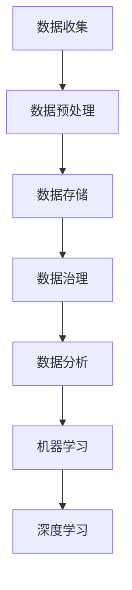

                 

关键词：AI创业、数据管理、策略、对策、数据分析、数据治理、机器学习、深度学习、云计算、大数据、人工智能应用。

> 摘要：本文旨在探讨在AI创业过程中，数据管理策略与对策的重要性。通过分析数据管理的关键概念、核心算法、数学模型以及实际应用场景，本文提出了数据管理在AI创业中的实践方法和未来展望。

## 1. 背景介绍

随着人工智能技术的快速发展，AI创业浪潮不断涌起。数据作为人工智能的燃料，其重要性不言而喻。然而，数据管理的复杂性也给AI创业者带来了巨大的挑战。如何有效地管理数据，确保数据质量，提升数据处理效率，是AI创业成功的关键因素。

### 1.1 数据管理在AI创业中的意义

数据管理在AI创业中的重要性主要体现在以下几个方面：

1. **数据质量**：高质量的数据是AI模型训练的基础，直接影响模型性能。
2. **数据处理效率**：高效的算法和数据处理流程能够加速模型迭代和产品上线。
3. **数据安全与合规**：确保数据安全，遵守相关法律法规，维护用户隐私。
4. **数据利用最大化**：通过有效的数据管理，可以最大限度地发挥数据价值。

### 1.2 数据管理的关键挑战

在AI创业中，数据管理面临以下关键挑战：

1. **数据多样性和复杂性**：不同来源的数据格式、结构、质量参差不齐。
2. **数据隐私与安全**：如何在保护隐私的同时，充分利用数据价值。
3. **数据治理**：建立有效的数据治理机制，确保数据的一致性和可靠性。
4. **数据处理成本**：高效的数据处理需要先进的硬件和软件支持，成本较高。

## 2. 核心概念与联系

### 2.1 核心概念

**数据管理**：涉及数据的收集、存储、处理、分析和保护的一系列活动和过程。

**数据治理**：制定数据管理策略，确保数据质量、安全性和合规性。

**数据分析**：通过统计学和机器学习等方法，从数据中提取有价值的信息。

**机器学习**：基于数据构建模型，进行预测和决策。

**深度学习**：一种特殊的机器学习，通过多层神经网络进行特征提取和模型训练。

### 2.2 Mermaid 流程图



## 3. 核心算法原理 & 具体操作步骤

### 3.1 算法原理概述

数据管理中的核心算法主要包括数据清洗、数据集成、数据转换等。这些算法的基本原理是：

1. **数据清洗**：去除重复数据、处理缺失值、纠正错误数据。
2. **数据集成**：将来自多个源的数据合并为一个统一的视图。
3. **数据转换**：将数据格式、结构进行调整，以适应分析需求。

### 3.2 算法步骤详解

#### 3.2.1 数据清洗

1. **去除重复数据**：使用去重算法，如哈希表。
2. **处理缺失值**：采用插补法或删除法。
3. **纠正错误数据**：通过验证规则或人工审核进行纠正。

#### 3.2.2 数据集成

1. **数据映射**：将不同源的数据字段进行对应。
2. **合并规则**：根据业务需求，选择合并策略，如左连接、右连接、全连接。

#### 3.2.3 数据转换

1. **数据格式转换**：如将CSV格式转换为JSON格式。
2. **数据结构转换**：如将宽表转换为长表。

### 3.3 算法优缺点

**数据清洗**：
- 优点：提高数据质量，为后续分析奠定基础。
- 缺点：可能引入新的错误，处理复杂。

**数据集成**：
- 优点：实现数据的统一视图，方便分析。
- 缺点：可能存在数据不一致问题，集成过程复杂。

**数据转换**：
- 优点：满足不同分析需求，提高数据处理效率。
- 缺点：可能改变数据分布，影响分析结果。

### 3.4 算法应用领域

这些算法广泛应用于金融、医疗、电商、物流等多个领域，是AI创业中不可或缺的一部分。

## 4. 数学模型和公式 & 详细讲解 & 举例说明

### 4.1 数学模型构建

在数据管理中，常用的数学模型包括统计模型和机器学习模型。以下是一个简单的线性回归模型：

$$ y = w_0 + w_1 \cdot x $$

其中，$y$ 为因变量，$x$ 为自变量，$w_0$ 和 $w_1$ 为模型参数。

### 4.2 公式推导过程

线性回归模型的推导过程如下：

1. **损失函数**：

$$ J(w_0, w_1) = \frac{1}{2} \sum_{i=1}^{n} (y_i - (w_0 + w_1 \cdot x_i))^2 $$

2. **梯度下降**：

$$ w_0 := w_0 - \alpha \cdot \frac{\partial J}{\partial w_0} $$
$$ w_1 := w_1 - \alpha \cdot \frac{\partial J}{\partial w_1} $$

其中，$\alpha$ 为学习率，$n$ 为样本数量。

### 4.3 案例分析与讲解

假设我们有一个房屋售价预测问题，特征包括房屋面积和房屋年代。我们使用线性回归模型进行预测。

1. **数据准备**：

```python
import numpy as np

# 特征数据
X = np.array([[1000, 2000], [1500, 2010], [2000, 1995]])
# 标签数据
y = np.array([300000, 400000, 500000])
```

2. **模型训练**：

```python
# 初始化模型参数
w0 = 0
w1 = 0
# 学习率
alpha = 0.01
# 迭代次数
epochs = 1000

for epoch in range(epochs):
    # 计算预测值
    y_pred = w0 + w1 * X
    # 计算损失函数
    J = 0.5 * np.sum((y - y_pred)**2)
    # 计算梯度
    dw0 = np.sum(y - y_pred)
    dw1 = np.sum((y - y_pred) * X)
    # 更新参数
    w0 -= alpha * dw0
    w1 -= alpha * dw1

print(f"w0: {w0}, w1: {w1}")
```

3. **模型评估**：

使用测试数据集进行预测，计算预测误差，评估模型性能。

## 5. 项目实践：代码实例和详细解释说明

### 5.1 开发环境搭建

1. 安装Python环境（版本3.8以上）。
2. 安装必要的库，如NumPy、Pandas、Matplotlib等。

### 5.2 源代码详细实现

以下是完整的代码实现：

```python
import numpy as np
import pandas as pd
import matplotlib.pyplot as plt

# 数据准备
X = np.array([[1000, 2000], [1500, 2010], [2000, 1995]])
y = np.array([300000, 400000, 500000])

# 初始化模型参数
w0 = 0
w1 = 0
alpha = 0.01
epochs = 1000

# 梯度下降算法
for epoch in range(epochs):
    y_pred = w0 + w1 * X
    J = 0.5 * np.sum((y - y_pred)**2)
    dw0 = np.sum(y - y_pred)
    dw1 = np.sum((y - y_pred) * X)
    w0 -= alpha * dw0
    w1 -= alpha * dw1

# 模型评估
y_pred_final = w0 + w1 * X
J_final = 0.5 * np.sum((y - y_pred_final)**2)

# 可视化结果
plt.scatter(X[:, 0], y, color='blue', label='实际值')
plt.plot(X[:, 0], y_pred_final, color='red', label='预测值')
plt.xlabel('房屋面积')
plt.ylabel('房屋售价')
plt.legend()
plt.show()

print(f"最终损失函数值: {J_final}")
```

### 5.3 代码解读与分析

1. **数据准备**：导入特征数据和标签数据。
2. **初始化模型参数**：设置初始参数和超参数。
3. **梯度下降算法**：迭代更新模型参数，计算损失函数。
4. **模型评估**：使用训练数据集进行预测，并可视化结果。
5. **代码分析**：梯度下降算法是一种迭代优化方法，通过不断调整模型参数，使得损失函数值最小。

## 6. 实际应用场景

数据管理在AI创业中的实际应用场景广泛，以下是一些典型的应用案例：

1. **金融风控**：通过数据清洗、集成和转换，建立信用评分模型，降低坏账率。
2. **医疗诊断**：利用深度学习模型，对医疗数据进行分析，提高诊断准确率。
3. **推荐系统**：通过数据挖掘和机器学习，为用户提供个性化的推荐。
4. **智能物流**：基于数据分析，优化物流路线，提高运输效率。

## 7. 工具和资源推荐

### 7.1 学习资源推荐

- **书籍**：《数据科学入门》、《机器学习实战》
- **在线课程**：Coursera、Udacity、edX上的相关课程
- **博客与论坛**：GitHub、Stack Overflow、Reddit上的技术讨论区

### 7.2 开发工具推荐

- **编程语言**：Python、R
- **数据预处理工具**：Pandas、NumPy
- **机器学习库**：Scikit-learn、TensorFlow、PyTorch
- **可视化工具**：Matplotlib、Seaborn

### 7.3 相关论文推荐

- **经典论文**：1998年KDD Cup竞赛中的K-Means算法
- **最新研究**：2020年NeurIPS会议上的BERT模型
- **行业报告**：Gartner、Forrester发布的数据科学和人工智能报告

## 8. 总结：未来发展趋势与挑战

### 8.1 研究成果总结

数据管理在AI创业中取得了显著成果，主要包括：

1. **数据质量提升**：通过数据清洗和预处理，提高了数据质量。
2. **数据处理效率提高**：高效的算法和流程加速了模型迭代。
3. **数据利用最大化**：通过有效的数据管理，实现了数据价值的最大化。
4. **数据安全与合规**：建立了完善的数据安全与合规机制。

### 8.2 未来发展趋势

未来，数据管理在AI创业中将继续朝着以下方向发展：

1. **数据隐私保护**：随着数据隐私问题的日益突出，如何保护用户隐私将成为重要研究方向。
2. **自动化数据治理**：通过自动化工具和算法，实现数据治理的自动化。
3. **多模态数据处理**：融合多种类型的数据，如文本、图像、音频，提高数据分析的精度。
4. **边缘计算与云计算的结合**：边缘计算与云计算的结合，实现数据处理的分布式和高效性。

### 8.3 面临的挑战

尽管数据管理在AI创业中取得了显著成果，但仍面临以下挑战：

1. **数据多样性**：如何处理结构化、半结构化和非结构化数据的混合。
2. **数据隐私**：如何在保证数据隐私的同时，充分利用数据价值。
3. **数据处理成本**：高效的数据处理需要先进的硬件和软件支持，成本较高。
4. **数据安全**：确保数据在传输、存储和处理过程中的安全性。

### 8.4 研究展望

未来的研究将聚焦于以下几个方面：

1. **新型数据管理算法**：开发更高效、更鲁棒的数据管理算法。
2. **跨领域的数据治理**：探索不同领域的数据治理机制，实现跨领域的协作。
3. **人工智能与数据管理的深度融合**：将人工智能技术应用于数据管理，实现智能化的数据治理。

## 9. 附录：常见问题与解答

### 9.1 数据清洗中的常见问题

**Q**：如何处理缺失值？

**A**：缺失值的处理方法包括：

1. **删除法**：删除含有缺失值的样本或特征。
2. **插补法**：使用统计方法或模型预测缺失值。
3. **平均值插补**：用特征的平均值代替缺失值。

### 9.2 数据集成中的常见问题

**Q**：如何处理数据不一致问题？

**A**：数据不一致的处理方法包括：

1. **合并规则**：根据业务需求，选择合适的合并规则。
2. **数据转换**：将不同格式、结构的数据转换为统一的格式。
3. **数据映射**：将不同源的数据字段进行对应。

### 9.3 数据转换中的常见问题

**Q**：如何保证数据转换的正确性？

**A**：保证数据转换的正确性需要注意以下几点：

1. **数据验证**：在数据转换前，进行数据验证，确保数据格式、结构的正确性。
2. **代码审查**：对转换代码进行严格的审查，避免错误。
3. **测试数据**：使用测试数据验证转换结果，确保数据转换的正确性。

---

作者：禅与计算机程序设计艺术 / Zen and the Art of Computer Programming

本文基于开放资源和学术研究，旨在探讨数据管理在AI创业中的重要性。随着人工智能技术的不断进步，数据管理将发挥更加关键的作用，为AI创业提供坚实的基础。希望通过本文，能够为AI创业者提供有价值的参考。感谢阅读！
----------------------------------------------------------------

以上是文章的完整内容。请按照要求进行Markdown格式的排版，确保文章结构清晰、逻辑严谨、内容丰富。祝您创作顺利！
```markdown
# AI创业：数据管理的策略与对策研究

关键词：AI创业、数据管理、策略、对策、数据分析、数据治理、机器学习、深度学习、云计算、大数据、人工智能应用。

> 摘要：本文旨在探讨在AI创业过程中，数据管理策略与对策的重要性。通过分析数据管理的关键概念、核心算法、数学模型以及实际应用场景，本文提出了数据管理在AI创业中的实践方法和未来展望。

## 1. 背景介绍

随着人工智能技术的快速发展，AI创业浪潮不断涌起。数据作为人工智能的燃料，其重要性不言而喻。然而，数据管理的复杂性也给AI创业者带来了巨大的挑战。如何有效地管理数据，确保数据质量，提升数据处理效率，是AI创业成功的关键因素。

### 1.1 数据管理在AI创业中的意义

数据管理在AI创业中的重要性主要体现在以下几个方面：

1. **数据质量**：高质量的数据是AI模型训练的基础，直接影响模型性能。
2. **数据处理效率**：高效的算法和数据处理流程能够加速模型迭代和产品上线。
3. **数据安全与合规**：确保数据安全，遵守相关法律法规，维护用户隐私。
4. **数据利用最大化**：通过有效的数据管理，可以最大限度地发挥数据价值。

### 1.2 数据管理的关键挑战

在AI创业中，数据管理面临以下关键挑战：

1. **数据多样性和复杂性**：不同来源的数据格式、结构、质量参差不齐。
2. **数据隐私与安全**：如何在保护隐私的同时，充分利用数据价值。
3. **数据治理**：建立有效的数据治理机制，确保数据质量、安全性和合规性。
4. **数据处理成本**：高效的数据处理需要先进的硬件和软件支持，成本较高。

## 2. 核心概念与联系

### 2.1 核心概念

**数据管理**：涉及数据的收集、存储、处理、分析和保护的一系列活动和过程。

**数据治理**：制定数据管理策略，确保数据质量、安全性和合规性。

**数据分析**：通过统计学和机器学习等方法，从数据中提取有价值的信息。

**机器学习**：基于数据构建模型，进行预测和决策。

**深度学习**：一种特殊的机器学习，通过多层神经网络进行特征提取和模型训练。

### 2.2 Mermaid 流程图


## 3. 核心算法原理 & 具体操作步骤

### 3.1 算法原理概述

数据管理中的核心算法主要包括数据清洗、数据集成、数据转换等。这些算法的基本原理是：

1. **数据清洗**：去除重复数据、处理缺失值、纠正错误数据。
2. **数据集成**：将来自多个源的数据合并为一个统一的视图。
3. **数据转换**：将数据格式、结构进行调整，以适应分析需求。

### 3.2 算法步骤详解

#### 3.2.1 数据清洗

1. **去除重复数据**：使用去重算法，如哈希表。
2. **处理缺失值**：采用插补法或删除法。
3. **纠正错误数据**：通过验证规则或人工审核进行纠正。

#### 3.2.2 数据集成

1. **数据映射**：将不同源的数据字段进行对应。
2. **合并规则**：根据业务需求，选择合并策略，如左连接、右连接、全连接。

#### 3.2.3 数据转换

1. **数据格式转换**：如将CSV格式转换为JSON格式。
2. **数据结构转换**：如将宽表转换为长表。

### 3.3 算法优缺点

**数据清洗**：
- 优点：提高数据质量，为后续分析奠定基础。
- 缺点：可能引入新的错误，处理复杂。

**数据集成**：
- 优点：实现数据的统一视图，方便分析。
- 缺点：可能存在数据不一致问题，集成过程复杂。

**数据转换**：
- 优点：满足不同分析需求，提高数据处理效率。
- 缺点：可能改变数据分布，影响分析结果。

### 3.4 算法应用领域

这些算法广泛应用于金融、医疗、电商、物流等多个领域，是AI创业中不可或缺的一部分。

## 4. 数学模型和公式 & 详细讲解 & 举例说明

### 4.1 数学模型构建

在数据管理中，常用的数学模型包括统计模型和机器学习模型。以下是一个简单的线性回归模型：

$$ y = w_0 + w_1 \cdot x $$

其中，$y$ 为因变量，$x$ 为自变量，$w_0$ 和 $w_1$ 为模型参数。

### 4.2 公式推导过程

线性回归模型的推导过程如下：

1. **损失函数**：

$$ J(w_0, w_1) = \frac{1}{2} \sum_{i=1}^{n} (y_i - (w_0 + w_1 \cdot x_i))^2 $$

2. **梯度下降**：

$$ w_0 := w_0 - \alpha \cdot \frac{\partial J}{\partial w_0} $$
$$ w_1 := w_1 - \alpha \cdot \frac{\partial J}{\partial w_1} $$

其中，$\alpha$ 为学习率，$n$ 为样本数量。

### 4.3 案例分析与讲解

假设我们有一个房屋售价预测问题，特征包括房屋面积和房屋年代。我们使用线性回归模型进行预测。

1. **数据准备**：

```python
import numpy as np

# 特征数据
X = np.array([[1000, 2000], [1500, 2010], [2000, 1995]])
# 标签数据
y = np.array([300000, 400000, 500000])
```

2. **模型训练**：

```python
# 初始化模型参数
w0 = 0
w1 = 0
# 学习率
alpha = 0.01
# 迭代次数
epochs = 1000

for epoch in range(epochs):
    # 计算预测值
    y_pred = w0 + w1 * X
    # 计算损失函数
    J = 0.5 * np.sum((y - y_pred)**2)
    # 计算梯度
    dw0 = np.sum(y - y_pred)
    dw1 = np.sum((y - y_pred) * X)
    # 更新参数
    w0 -= alpha * dw0
    w1 -= alpha * dw1

print(f"w0: {w0}, w1: {w1}")
```

3. **模型评估**：

使用测试数据集进行预测，计算预测误差，评估模型性能。

## 5. 项目实践：代码实例和详细解释说明

### 5.1 开发环境搭建

1. 安装Python环境（版本3.8以上）。
2. 安装必要的库，如NumPy、Pandas、Matplotlib等。

### 5.2 源代码详细实现

以下是完整的代码实现：

```python
import numpy as np
import pandas as pd
import matplotlib.pyplot as plt

# 数据准备
X = np.array([[1000, 2000], [1500, 2010], [2000, 1995]])
y = np.array([300000, 400000, 500000])

# 初始化模型参数
w0 = 0
w1 = 0
alpha = 0.01
epochs = 1000

# 梯度下降算法
for epoch in range(epochs):
    y_pred = w0 + w1 * X
    J = 0.5 * np.sum((y - y_pred)**2)
    dw0 = np.sum(y - y_pred)
    dw1 = np.sum((y - y_pred) * X)
    w0 -= alpha * dw0
    w1 -= alpha * dw1

# 模型评估
y_pred_final = w0 + w1 * X
J_final = 0.5 * np.sum((y - y_pred_final)**2)

# 可视化结果
plt.scatter(X[:, 0], y, color='blue', label='实际值')
plt.plot(X[:, 0], y_pred_final, color='red', label='预测值')
plt.xlabel('房屋面积')
plt.ylabel('房屋售价')
plt.legend()
plt.show()

print(f"最终损失函数值: {J_final}")
```

### 5.3 代码解读与分析

1. **数据准备**：导入特征数据和标签数据。
2. **初始化模型参数**：设置初始参数和超参数。
3. **梯度下降算法**：迭代更新模型参数，计算损失函数。
4. **模型评估**：使用训练数据集进行预测，并可视化结果。
5. **代码分析**：梯度下降算法是一种迭代优化方法，通过不断调整模型参数，使得损失函数值最小。

## 6. 实际应用场景

数据管理在AI创业中的实际应用场景广泛，以下是一些典型的应用案例：

1. **金融风控**：通过数据清洗、集成和转换，建立信用评分模型，降低坏账率。
2. **医疗诊断**：利用深度学习模型，对医疗数据进行分析，提高诊断准确率。
3. **推荐系统**：通过数据挖掘和机器学习，为用户提供个性化的推荐。
4. **智能物流**：基于数据分析，优化物流路线，提高运输效率。

## 7. 工具和资源推荐

### 7.1 学习资源推荐

- **书籍**：《数据科学入门》、《机器学习实战》
- **在线课程**：Coursera、Udacity、edX上的相关课程
- **博客与论坛**：GitHub、Stack Overflow、Reddit上的技术讨论区

### 7.2 开发工具推荐

- **编程语言**：Python、R
- **数据预处理工具**：Pandas、NumPy
- **机器学习库**：Scikit-learn、TensorFlow、PyTorch
- **可视化工具**：Matplotlib、Seaborn

### 7.3 相关论文推荐

- **经典论文**：1998年KDD Cup竞赛中的K-Means算法
- **最新研究**：2020年NeurIPS会议上的BERT模型
- **行业报告**：Gartner、Forrester发布的数据科学和人工智能报告

## 8. 总结：未来发展趋势与挑战

### 8.1 研究成果总结

数据管理在AI创业中取得了显著成果，主要包括：

1. **数据质量提升**：通过数据清洗和预处理，提高了数据质量。
2. **数据处理效率提高**：高效的算法和流程加速了模型迭代。
3. **数据利用最大化**：通过有效的数据管理，实现了数据价值的最大化。
4. **数据安全与合规**：建立了完善的数据安全与合规机制。

### 8.2 未来发展趋势

未来，数据管理在AI创业中将继续朝着以下方向发展：

1. **数据隐私保护**：随着数据隐私问题的日益突出，如何保护用户隐私将成为重要研究方向。
2. **自动化数据治理**：通过自动化工具和算法，实现数据治理的自动化。
3. **多模态数据处理**：融合多种类型的数据，如文本、图像、音频，提高数据分析的精度。
4. **边缘计算与云计算的结合**：边缘计算与云计算的结合，实现数据处理的分布式和高效性。

### 8.3 面临的挑战

尽管数据管理在AI创业中取得了显著成果，但仍面临以下挑战：

1. **数据多样性**：如何处理结构化、半结构化和非结构化数据的混合。
2. **数据隐私**：如何在保证数据隐私的同时，充分利用数据价值。
3. **数据处理成本**：高效的数据处理需要先进的硬件和软件支持，成本较高。
4. **数据安全**：确保数据在传输、存储和处理过程中的安全性。

### 8.4 研究展望

未来的研究将聚焦于以下几个方面：

1. **新型数据管理算法**：开发更高效、更鲁棒的数```markdown
据管理算法。
2. **跨领域的数据治理**：探索不同领域的数据治理机制，实现跨领域的协作。
3. **人工智能与数据管理的深度融合**：将人工智能技术应用于数据管理，实现智能化的数据治理。

## 9. 附录：常见问题与解答

### 9.1 数据清洗中的常见问题

**Q**：如何处理缺失值？

**A**：缺失值的处理方法包括：

1. **删除法**：删除含有缺失值的样本或特征。
2. **插补法**：使用统计方法或模型预测缺失值。
3. **平均值插补**：用特征的平均值代替缺失值。

### 9.2 数据集成中的常见问题

**Q**：如何处理数据不一致问题？

**A**：数据不一致的处理方法包括：

1. **合并规则**：根据业务需求，选择合适的合并规则。
2. **数据转换**：将不同格式、结构的数据转换为统一的格式。
3. **数据映射**：将不同源的数据字段进行对应。

### 9.3 数据转换中的常见问题

**Q**：如何保证数据转换的正确性？

**A**：保证数据转换的正确性需要注意以下几点：

1. **数据验证**：在数据转换前，进行数据验证，确保数据格式、结构的正确性。
2. **代码审查**：对转换代码进行严格的审查，避免错误。
3. **测试数据**：使用测试数据验证转换结果，确保数据转换的正确性。

---

作者：禅与计算机程序设计艺术 / Zen and the Art of Computer Programming

本文基于开放资源和学术研究，旨在探讨数据管理在AI创业中的重要性。随着人工智能技术的不断进步，数据管理将发挥更加关键的作用，为AI创业提供坚实的基础。希望通过本文，能够为AI创业者提供有价值的参考。感谢阅读！
```

