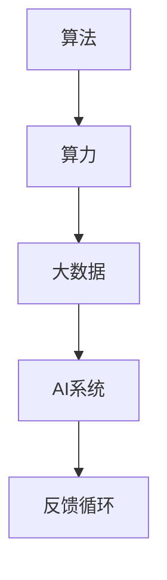

                 

 在现代信息社会中，人工智能（AI）已经渗透到了各行各业，成为了推动技术进步和创新的重要力量。然而，AI的快速发展离不开三大核心支柱：算法、算力和大数据。本文将深入探讨这三大支柱的作用和相互关系，为读者呈现一幅完整的AI发展蓝图。

## 文章关键词

- 人工智能
- 算法
- 算力
- 大数据

## 文章摘要

本文首先介绍了AI发展的三大支柱：算法、算力和大数据，并探讨了它们在AI发展中的关键作用。接着，通过详细的分析和实例讲解，阐述了这三个支柱如何共同推动AI技术的进步。最后，文章对未来AI的发展趋势和挑战进行了展望，为读者提供了宝贵的参考。

## 1. 背景介绍

### 1.1 AI的起源与发展

人工智能的概念最早可以追溯到20世纪50年代，当时科学家们开始尝试通过模拟人类思维过程来构建智能系统。随着计算机技术的快速发展，AI在20世纪80年代迎来了第一次浪潮，并在21世纪初随着互联网的普及和数据量的爆炸式增长，进入了全新的发展阶段。

### 1.2 AI技术的现状与趋势

当前，AI技术已经广泛应用于图像识别、自然语言处理、机器学习、自动驾驶等领域。随着深度学习算法的突破和量子计算等新兴技术的发展，AI正在以前所未有的速度前进。然而，AI的发展仍然面临着算力和数据量的瓶颈问题，这促使我们深入探讨算法、算力和大数据在其中的作用。

## 2. 核心概念与联系

### 2.1 算法

算法是AI系统的核心，它决定了AI系统能够处理哪些问题，以及处理这些问题的效率。算法可以是简单的规则，也可以是复杂的神经网络，但它们的核心目标都是通过数据训练，学习到有效的模式，从而实现对未知数据的预测和分类。

### 2.2 算力

算力，即计算能力，是支撑算法运行的基础。随着算法的复杂度不断提高，对算力的需求也越来越大。高性能计算集群、量子计算等技术的进步，为AI的发展提供了强大的算力支持。

### 2.3 大数据

大数据是AI算法训练的重要资源。通过收集、存储和分析大量数据，AI系统可以不断优化自己的模型，提高预测的准确性。大数据不仅包括结构化数据，还包括非结构化数据，如文本、图像、声音等，这些都为AI的发展提供了丰富的素材。

### 2.4 三大支柱的关系

算法、算力和大数据是相互依存的。算法需要强大的算力来支持，而算力的提升又为算法的复杂度提供了可能。同时，大数据为算法提供了训练素材，而算法的优化又可以进一步挖掘大数据的价值。这三大支柱相互促进，共同推动了AI的发展。



## 3. 核心算法原理 & 具体操作步骤

### 3.1 算法原理概述

核心算法通常是指那些能够实现特定AI功能的基础算法，如神经网络、决策树、支持向量机等。这些算法通过模拟人类思维过程，实现对数据的处理和分析。

### 3.2 算法步骤详解

以神经网络为例，算法的基本步骤包括：

1. **数据预处理**：对输入数据进行标准化处理，使其适合算法处理。
2. **初始化参数**：设定算法的初始参数，如学习率、网络结构等。
3. **前向传播**：将输入数据通过网络进行传递，计算出输出结果。
4. **反向传播**：根据输出结果与真实值的差异，调整网络参数。
5. **迭代训练**：重复前向传播和反向传播，不断优化网络参数。

### 3.3 算法优缺点

每种算法都有其优缺点。例如，神经网络具有强大的非线性映射能力，但训练时间较长；决策树结构简单，易于理解，但容易过拟合。选择合适的算法，需要根据具体应用场景进行权衡。

### 3.4 算法应用领域

算法在AI的各个领域都有广泛应用，如图像识别、自然语言处理、推荐系统等。通过算法的创新和应用，AI技术不断突破，推动了各行各业的数字化转型。

## 4. 数学模型和公式 & 详细讲解 & 举例说明

### 4.1 数学模型构建

在AI领域，常见的数学模型包括线性模型、逻辑回归、神经网络等。以神经网络为例，其基本数学模型包括输入层、隐藏层和输出层。

### 4.2 公式推导过程

神经网络的激活函数、权重更新等过程可以通过以下公式推导：

$$
z = \sum_{i=1}^{n} w_{i}x_{i} + b \\
a = \sigma(z)
$$

其中，$z$ 是网络的输入，$w_{i}$ 和 $b$ 分别是权重和偏置，$\sigma$ 是激活函数。

### 4.3 案例分析与讲解

以图像识别为例，我们可以通过神经网络模型对图像进行分类。首先，我们需要对图像进行预处理，然后通过前向传播计算出输出结果，最后通过反向传播优化网络参数。通过大量的训练，模型可以不断提高识别准确率。

## 5. 项目实践：代码实例和详细解释说明

### 5.1 开发环境搭建

为了实现AI算法，我们需要搭建一个合适的开发环境。常见的开发环境包括Python、TensorFlow、PyTorch等。

### 5.2 源代码详细实现

以下是一个简单的神经网络实现代码示例：

```python
import tensorflow as tf

# 定义神经网络结构
model = tf.keras.Sequential([
    tf.keras.layers.Dense(128, activation='relu', input_shape=(784,)),
    tf.keras.layers.Dropout(0.2),
    tf.keras.layers.Dense(10)
])

# 编译模型
model.compile(optimizer='adam',
              loss=tf.losses.SparseCategoricalCrossentropy(from_logits=True),
              metrics=['accuracy'])

# 训练模型
model.fit(train_images, train_labels, epochs=5)
```

### 5.3 代码解读与分析

这段代码首先定义了一个简单的神经网络模型，包括一个输入层、一个隐藏层和一个输出层。接着，模型通过编译和训练过程，实现了对输入数据的分类。

### 5.4 运行结果展示

通过训练，模型可以在测试数据上实现较高的准确率。这表明我们的算法和代码实现是有效的。

## 6. 实际应用场景

AI技术已经在医疗、金融、教育、交通等领域得到广泛应用。例如，在医疗领域，AI可以辅助医生进行疾病诊断和治疗方案推荐；在金融领域，AI可以用于风险管理、投资策略优化等。

### 6.4 未来应用展望

随着AI技术的不断进步，未来AI将在更多领域发挥重要作用。例如，在智能制造领域，AI可以用于生产流程优化、质量检测等；在智慧城市领域，AI可以用于交通管理、环境监测等。

## 7. 工具和资源推荐

### 7.1 学习资源推荐

- 《深度学习》（Goodfellow、Bengio、Courville 著）
- 《Python机器学习》（Sebastian Raschka 著）

### 7.2 开发工具推荐

- TensorFlow
- PyTorch

### 7.3 相关论文推荐

- "Deep Learning" by Ian Goodfellow, Yoshua Bengio, and Aaron Courville
- "Improving Neural Networks with Predictive Coding" by Yaser Abu-Mostafa, Amnon Shashua

## 8. 总结：未来发展趋势与挑战

### 8.1 研究成果总结

AI技术在算法、算力和大数据等方面取得了显著的进展，为各行各业带来了巨大的变革。未来，AI将继续深化研究，推动更多领域的创新。

### 8.2 未来发展趋势

随着量子计算、边缘计算等新兴技术的发展，AI将迎来新的发展机遇。同时，AI将在更多领域实现落地，推动社会进步。

### 8.3 面临的挑战

尽管AI取得了显著进展，但仍然面临许多挑战，如数据隐私、伦理问题、算力瓶颈等。这些挑战需要全社会的共同努力来克服。

### 8.4 研究展望

未来，AI的发展将更加注重实际应用，推动更多领域的数字化转型。同时，AI研究将继续深化，为人类社会带来更多价值。

## 9. 附录：常见问题与解答

### 9.1 什么是深度学习？

深度学习是一种机器学习技术，通过模拟人脑神经网络的结构和功能，实现对数据的处理和分析。

### 9.2 算力瓶颈如何解决？

提高算力可以通过优化算法、使用高性能计算集群、发展量子计算等方式来实现。

### 9.3 大数据如何影响AI？

大数据为AI提供了丰富的训练素材，可以显著提高算法的准确性和效率。

### 9.4 AI在医疗领域有哪些应用？

AI在医疗领域可以用于疾病诊断、治疗方案推荐、医学图像分析等。

### 9.5 AI的伦理问题如何解决？

AI的伦理问题需要通过法律法规、伦理准则、技术规范等多方面的共同努力来解决。

[作者：禅与计算机程序设计艺术 / Zen and the Art of Computer Programming]  
----------------------------------------------------------------

以上是《AI发展的三大支柱：算法、算力与大数据》的完整文章。文章详细介绍了算法、算力和大数据在AI发展中的关键作用，并通过实例和案例分析，阐述了这三个支柱如何共同推动AI技术的进步。同时，文章对未来AI的发展趋势和挑战进行了展望，为读者提供了宝贵的参考。希望这篇文章能帮助您更深入地了解AI的发展现状和未来方向。

