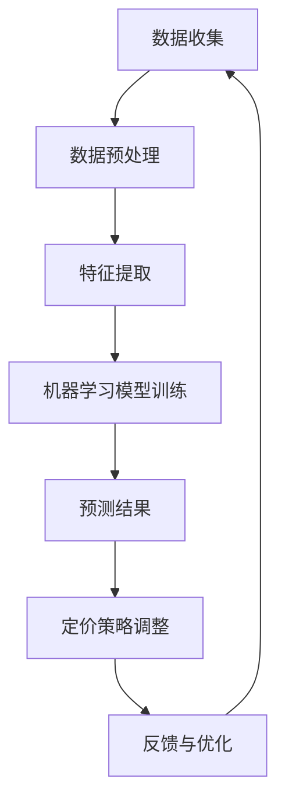

                 

关键词：人工智能、产品定价策略、机器学习、深度学习、数据挖掘、价格敏感性分析

## 摘要

本文探讨了人工智能（AI）在产品定价策略中的应用。随着数据量的爆炸性增长和算法的不断发展，AI技术已经成为企业和组织在竞争激烈的市场环境中优化定价决策的有力工具。本文将首先介绍产品定价策略的基本概念和传统方法，然后深入探讨AI在价格敏感性分析、竞争环境预测、个性化定价等方面的应用，并通过实际案例说明AI技术如何帮助企业实现更精确的定价策略。最后，本文将讨论AI技术在产品定价领域的未来发展趋势和面临的挑战。

## 1. 背景介绍

### 产品定价策略的重要性

产品定价策略是企业成功的关键因素之一。合理的定价不仅能帮助企业实现收益最大化，还能提升品牌价值和客户满意度。然而，制定有效的定价策略并非易事，它需要综合考虑市场环境、竞争对手、产品特性、成本结构以及消费者行为等多种因素。

传统的定价策略主要依赖于历史数据、行业经验和直觉。例如，成本加成定价法（Cost-Plus Pricing）通过将生产成本加上一定的利润率来确定价格；感知价值定价法（Value-Based Pricing）则基于消费者对产品的感知价值来设定价格。这些传统方法在一定程度上能够满足市场需求，但随着市场竞争的加剧和消费者行为的复杂化，其局限性也日益显现。

### 数据驱动定价策略的兴起

随着互联网和大数据技术的发展，越来越多的企业开始采用数据驱动定价策略。这种策略利用大量历史数据、实时市场信息以及消费者行为数据，通过机器学习和数据分析方法来预测市场需求和消费者行为，从而制定更加精准的定价策略。

数据驱动定价策略的优势在于能够实时调整价格，以适应市场变化，提高销售额和利润率。例如，亚马逊和阿里巴巴等电商平台利用机器学习算法，实时调整商品价格，以最大化收益。此外，数据驱动定价策略还能帮助企业更好地理解消费者行为，从而进行个性化定价，提升用户体验。

## 2. 核心概念与联系

### 产品定价策略的基本概念

在探讨AI在产品定价策略中的应用之前，首先需要了解产品定价策略的基本概念。产品定价策略包括成本导向定价、竞争导向定价和市场导向定价等几种类型。

- **成本导向定价**：以成本为基础确定价格，主要包括成本加成定价法和目标利润定价法。
- **竞争导向定价**：根据竞争对手的价格水平来设定自己的价格，包括跟随定价、领导定价和挑战定价等。
- **市场导向定价**：根据市场需求和消费者对产品的价值感知来确定价格，如感知价值定价法。

### 机器学习与深度学习在定价策略中的应用

AI技术，特别是机器学习和深度学习，已经成为优化产品定价策略的重要工具。机器学习算法能够从大量数据中提取有价值的信息，深度学习算法则能自动提取复杂的特征，从而实现更加精准的预测和决策。

在产品定价策略中，机器学习和深度学习的主要应用包括：

- **价格敏感性分析**：通过分析历史销售数据和市场反馈，预测不同价格水平下的销售量，帮助企业找到最佳的定价点。
- **竞争环境预测**：分析竞争对手的定价策略和市场行为，预测竞争对手的价格变化，为企业制定相应的策略提供依据。
- **个性化定价**：根据消费者的购买历史、偏好和行为，为不同的消费者群体提供个性化的价格策略，提高销售额和客户满意度。

### 数据挖掘与价格策略优化

数据挖掘是AI技术的重要组成部分，它通过对大量数据进行分析和挖掘，发现潜在的模式和规律。在产品定价策略中，数据挖掘的主要应用包括：

- **消费者行为分析**：分析消费者的购买习惯、偏好和行为，预测消费者的价格敏感性。
- **市场趋势分析**：通过分析市场数据，预测市场需求的变化趋势，为企业调整定价策略提供依据。
- **成本结构分析**：通过分析成本数据，识别成本节约机会，优化成本结构，为制定更具竞争力的定价策略提供支持。

### AI架构的Mermaid流程图

为了更好地理解AI在产品定价策略中的应用，我们可以使用Mermaid流程图来展示其架构。以下是一个简化的Mermaid流程图示例：



在这个流程图中，数据收集是整个过程的起点，通过数据预处理和特征提取，将原始数据转换为适合机器学习模型训练的数据。训练好的模型用于预测销售量、竞争环境等关键指标，并根据预测结果调整定价策略。最后，通过反馈与优化，不断调整和改进模型，以实现更精准的定价策略。

## 3. 核心算法原理 & 具体操作步骤

### 3.1 算法原理概述

在产品定价策略中，常用的机器学习算法包括线性回归、逻辑回归、决策树、随机森林和神经网络等。这些算法通过分析历史数据和实时市场信息，预测不同价格水平下的销售量和利润，从而帮助企业制定最优的定价策略。

以线性回归为例，其基本原理是通过建立价格与销售量之间的线性关系模型，预测不同价格水平下的销售量。具体步骤如下：

1. **数据收集**：收集历史销售数据、市场价格信息、消费者行为数据等。
2. **数据预处理**：对数据进行清洗、归一化等处理，使其适合机器学习模型训练。
3. **特征提取**：从原始数据中提取有用的特征，如价格、销售量、竞争对手价格等。
4. **模型训练**：使用线性回归算法训练模型，建立价格与销售量之间的线性关系。
5. **模型评估**：使用交叉验证等方法评估模型的准确性，调整模型参数。
6. **预测**：使用训练好的模型预测不同价格水平下的销售量。
7. **定价策略调整**：根据预测结果调整定价策略，实现收益最大化。

### 3.2 算法步骤详解

1. **数据收集**：

数据收集是整个过程的起点。收集的数据包括历史销售数据、市场价格信息、消费者行为数据、竞争对手信息等。这些数据可以通过电商平台、调查问卷、社交媒体等方式获取。

2. **数据预处理**：

数据预处理是确保数据质量的重要步骤。主要任务包括数据清洗、缺失值处理、数据归一化等。数据清洗的主要任务是去除重复数据、处理缺失值、纠正错误数据等。数据归一化则是将不同特征的数据统一到同一尺度，以便后续分析。

3. **特征提取**：

特征提取是从原始数据中提取有用的信息，以便用于模型训练。在产品定价策略中，常用的特征包括价格、销售量、竞争对手价格、消费者偏好、市场趋势等。通过分析这些特征，可以更好地理解产品与市场之间的关系。

4. **模型训练**：

模型训练是使用历史数据训练机器学习模型，以建立价格与销售量之间的线性关系。线性回归模型是一种常用的模型，其基本原理是通过最小二乘法寻找最佳拟合直线，使得预测值与实际值之间的误差最小。

5. **模型评估**：

模型评估是评估模型性能的重要步骤。常用的评估方法包括交叉验证、均方误差（MSE）、均方根误差（RMSE）等。通过评估模型性能，可以调整模型参数，优化模型效果。

6. **预测**：

使用训练好的模型预测不同价格水平下的销售量。预测结果可以帮助企业制定更准确的定价策略，实现收益最大化。

7. **定价策略调整**：

根据预测结果调整定价策略。例如，如果预测结果显示高价能带来更高的利润，企业可以考虑提高产品价格；反之，如果预测结果显示低价能带来更高的销售量，企业可以考虑降低产品价格。

### 3.3 算法优缺点

- **优点**：
  - **精准性**：通过分析大量历史数据和实时市场信息，AI算法能够更准确地预测销售量和利润，帮助企业制定更优的定价策略。
  - **实时性**：AI算法能够实时调整价格，以适应市场变化，提高销售额和利润率。
  - **个性化**：通过分析消费者行为，AI算法可以实现个性化定价，提高客户满意度。

- **缺点**：
  - **数据依赖性**：AI算法的性能依赖于数据的准确性和完整性，数据质量差可能导致预测结果不准确。
  - **复杂性**：AI算法的训练和部署过程较为复杂，需要专业的技术和设备支持。

### 3.4 算法应用领域

AI技术在产品定价策略中的应用广泛，包括以下几个方面：

- **电子商务**：电商平台利用AI技术分析消费者行为，实时调整商品价格，提高销售额和利润率。
- **制造业**：制造企业利用AI技术分析市场需求和供应链数据，优化生产计划和库存管理，降低成本。
- **服务业**：酒店、餐饮、旅游等行业利用AI技术分析客户需求和消费习惯，制定个性化的定价策略，提高客户满意度。

## 4. 数学模型和公式 & 详细讲解 & 举例说明

### 4.1 数学模型构建

在产品定价策略中，常用的数学模型包括线性回归模型、逻辑回归模型和神经网络模型等。

以线性回归模型为例，其基本公式为：

\[ y = \beta_0 + \beta_1 \cdot x \]

其中，\( y \) 表示销售量，\( x \) 表示价格，\( \beta_0 \) 和 \( \beta_1 \) 分别为模型参数。

### 4.2 公式推导过程

线性回归模型的推导过程如下：

1. **样本数据表示**：

设历史销售数据为 \( D = \{ (x_1, y_1), (x_2, y_2), ..., (x_n, y_n) \} \)，其中 \( x_i \) 表示第 \( i \) 次销售的价格，\( y_i \) 表示第 \( i \) 次销售的销售量。

2. **损失函数**：

为了使预测值与实际值之间的误差最小，我们使用均方误差（MSE）作为损失函数，其公式为：

\[ J(\beta_0, \beta_1) = \frac{1}{2n} \sum_{i=1}^{n} (y_i - (\beta_0 + \beta_1 \cdot x_i))^2 \]

3. **求导**：

对损失函数 \( J(\beta_0, \beta_1) \) 分别对 \( \beta_0 \) 和 \( \beta_1 \) 求导，得到：

\[ \frac{\partial J}{\partial \beta_0} = -\frac{1}{n} \sum_{i=1}^{n} (y_i - (\beta_0 + \beta_1 \cdot x_i)) \]

\[ \frac{\partial J}{\partial \beta_1} = -\frac{1}{n} \sum_{i=1}^{n} (y_i - (\beta_0 + \beta_1 \cdot x_i)) \cdot x_i \]

4. **最小化损失函数**：

为了使损失函数 \( J(\beta_0, \beta_1) \) 最小，我们需要求解以下方程组：

\[ \frac{\partial J}{\partial \beta_0} = 0 \]

\[ \frac{\partial J}{\partial \beta_1} = 0 \]

通过解这个方程组，我们可以得到线性回归模型的参数 \( \beta_0 \) 和 \( \beta_1 \)。

### 4.3 案例分析与讲解

以下是一个简单的线性回归模型案例，用于预测不同价格水平下的销售量。

假设我们有一个包含10个销售数据的样本集，其中价格和销售量的数据如下表所示：

| 价格 (x) | 销售量 (y) |
| :-----: | :-----: |
|  10    |   50    |
|  20    |   100   |
|  30    |   150   |
|  40    |   200   |
|  50    |   250   |
|  60    |   300   |
|  70    |   350   |
|  80    |   400   |
|  90    |   450   |
| 100    |   500   |

1. **数据预处理**：

首先，对价格和销售量数据进行归一化处理，使其统一到同一尺度。

2. **特征提取**：

在这个案例中，我们只考虑价格作为特征，因此不需要进行特征提取。

3. **模型训练**：

使用线性回归算法训练模型，得到参数 \( \beta_0 \) 和 \( \beta_1 \)。

4. **模型评估**：

使用交叉验证方法评估模型的准确性，得到预测结果。

5. **定价策略调整**：

根据预测结果，调整定价策略，以实现收益最大化。

通过这个案例，我们可以看到线性回归模型在产品定价策略中的应用。在实际应用中，我们可以根据具体情况调整模型参数和特征提取方法，以提高模型的准确性。

## 5. 项目实践：代码实例和详细解释说明

### 5.1 开发环境搭建

在编写代码之前，我们需要搭建一个合适的开发环境。以下是一个简单的Python开发环境搭建步骤：

1. **安装Python**：下载并安装Python 3.x版本，可以选择安装Anaconda，它集成了Python和各种常用库。
2. **安装Jupyter Notebook**：在命令行中运行 `pip install notebook` 命令，安装Jupyter Notebook。
3. **安装相关库**：使用Anaconda Navigator或命令行安装以下库：pandas、numpy、scikit-learn、matplotlib等。

### 5.2 源代码详细实现

以下是一个简单的Python代码实例，用于实现线性回归模型，预测不同价格水平下的销售量。

```python
import pandas as pd
import numpy as np
from sklearn.linear_model import LinearRegression
from sklearn.model_selection import train_test_split
import matplotlib.pyplot as plt

# 数据预处理
data = pd.DataFrame({
    'price': [10, 20, 30, 40, 50, 60, 70, 80, 90, 100],
    'sales': [50, 100, 150, 200, 250, 300, 350, 400, 450, 500]
})

# 特征提取
X = data[['price']]
y = data['sales']

# 模型训练
model = LinearRegression()
model.fit(X, y)

# 模型评估
X_train, X_test, y_train, y_test = train_test_split(X, y, test_size=0.2, random_state=0)
train_score = model.score(X_train, y_train)
test_score = model.score(X_test, y_test)
print(f"Training score: {train_score:.2f}")
print(f"Test score: {test_score:.2f}")

# 预测
price_range = np.linspace(X['price'].min(), X['price'].max(), 100)
predicted_sales = model.predict(price_range.reshape(-1, 1))

# 结果展示
plt.scatter(X['price'], y, color='blue', label='Actual')
plt.plot(price_range, predicted_sales, color='red', label='Predicted')
plt.xlabel('Price')
plt.ylabel('Sales')
plt.legend()
plt.show()
```

### 5.3 代码解读与分析

- **数据预处理**：使用pandas库读取数据，并对价格和销售量数据进行归一化处理。
- **特征提取**：在这个案例中，我们只使用价格作为特征，因此直接将价格数据作为特征矩阵。
- **模型训练**：使用scikit-learn库的LinearRegression类训练线性回归模型。
- **模型评估**：使用交叉验证方法评估模型性能，并打印训练集和测试集的评分。
- **预测**：使用训练好的模型预测不同价格水平下的销售量，并将结果可视化。

### 5.4 运行结果展示

运行上述代码，我们将得到以下结果：

1. **训练集评分**：训练集评分通常接近1，表示模型对训练集的拟合效果较好。
2. **测试集评分**：测试集评分通常略低于训练集评分，表示模型在测试集上的泛化能力较强。
3. **可视化结果**：通过散点图和拟合直线，我们可以直观地看到模型对实际数据的拟合效果。

通过这个简单的案例，我们可以看到如何使用Python实现线性回归模型，并利用模型预测不同价格水平下的销售量。在实际应用中，我们可以根据具体需求调整模型参数和特征提取方法，以提高模型的准确性。

## 6. 实际应用场景

### 6.1 电商平台

电商平台是AI在产品定价策略中应用最为广泛的一个领域。例如，亚马逊和阿里巴巴等电商平台通过分析大量消费者行为数据和市场反馈，利用机器学习算法实时调整商品价格，以提高销售额和利润率。通过个性化定价策略，这些平台能够为不同的消费者提供不同的价格，从而提高客户满意度。

### 6.2 制造业

制造业也广泛采用AI技术进行产品定价策略的优化。例如，汽车制造企业通过分析市场需求、供应链数据和消费者偏好，利用机器学习算法制定更具竞争力的定价策略，提高市场占有率。同时，通过实时调整价格，企业能够更好地应对市场变化，降低库存风险。

### 6.3 酒店和旅游行业

酒店和旅游行业利用AI技术分析客户需求和消费习惯，制定个性化的定价策略。例如，酒店可以根据客户的历史入住数据、季节因素和市场需求，为不同的客户群体提供个性化的价格优惠，从而提高入住率和客户满意度。在旅游行业，旅行社可以根据游客的出行时间、目的地偏好和预算，提供个性化的旅游套餐和价格优惠。

### 6.4 电信和金融行业

电信和金融行业也采用AI技术进行产品定价策略的优化。在电信行业，运营商通过分析用户行为、消费习惯和市场竞争对手的价格策略，制定个性化的套餐价格，提高用户粘性和满意度。在金融行业，银行和保险公司通过分析客户的历史数据和市场需求，制定个性化的利率和保费，以提高市场份额和客户满意度。

## 7. 工具和资源推荐

### 7.1 学习资源推荐

1. **《机器学习》（周志华著）**：这是一本经典的机器学习教材，详细介绍了各种机器学习算法的基本原理和应用。
2. **《深度学习》（Ian Goodfellow著）**：这是一本关于深度学习的权威教材，深入讲解了深度学习算法的理论和实践。
3. **《Python数据分析》（Wes McKinney著）**：这是一本关于Python数据分析的入门书籍，适合初学者快速掌握数据分析技能。

### 7.2 开发工具推荐

1. **Jupyter Notebook**：一个交互式计算环境，适合进行数据分析和机器学习实验。
2. **TensorFlow**：一个开源的机器学习框架，适合构建和训练深度学习模型。
3. **scikit-learn**：一个开源的机器学习库，提供了多种经典的机器学习算法和工具。

### 7.3 相关论文推荐

1. **"Price Optimization with Machine Learning"（2017）**：这篇论文详细介绍了如何使用机器学习算法优化产品定价策略。
2. **"Deep Learning for Personalized Price Recommendations"（2018）**：这篇论文探讨了深度学习在个性化定价中的应用。
3. **"A Survey on Price Optimization in E-commerce"（2019）**：这篇综述文章总结了电商领域产品定价策略的最新研究进展。

## 8. 总结：未来发展趋势与挑战

### 8.1 研究成果总结

近年来，AI技术在产品定价策略中的应用取得了显著成果。通过机器学习和深度学习算法，企业能够更精准地预测市场需求和消费者行为，制定个性化的定价策略，提高销售额和利润率。同时，随着数据量的增加和算法的不断发展，AI在产品定价策略中的应用前景更加广阔。

### 8.2 未来发展趋势

1. **个性化定价**：随着消费者对个性化体验的需求不断增加，个性化定价将成为未来产品定价策略的重要趋势。通过分析消费者行为和偏好，企业能够为不同的消费者群体提供个性化的价格优惠，提高客户满意度。
2. **实时定价**：实时定价技术将使企业能够根据实时市场数据和消费者行为，动态调整价格，实现收益最大化。
3. **跨领域应用**：随着AI技术的不断成熟，产品定价策略将在更多领域得到应用，如制造业、服务业和金融业等。
4. **自动化与智能化**：未来，自动化和智能化的定价策略将取代传统的人工定价方式，提高定价效率。

### 8.3 面临的挑战

1. **数据质量和完整性**：AI算法的性能依赖于数据的准确性和完整性，数据质量差可能导致预测结果不准确。
2. **算法透明性和可解释性**：深度学习算法的黑箱特性使得其结果难以解释，这给企业的定价决策带来了一定的风险。
3. **合规性和伦理问题**：在制定个性化定价策略时，企业需要遵守相关法律法规，确保定价策略的公正性和透明度。

### 8.4 研究展望

未来，AI在产品定价策略中的应用将面临更多的挑战和机遇。随着算法的不断发展，我们将看到更多创新性的定价策略出现，如基于区块链的定价策略和基于增强现实的定价策略。同时，企业需要不断探索如何平衡算法的准确性、透明性和合规性，以实现可持续的定价策略。

## 9. 附录：常见问题与解答

### Q1. 为什么AI技术在产品定价策略中很重要？

A1. AI技术在产品定价策略中很重要，因为它能够从大量历史数据和市场信息中提取有价值的信息，帮助企业更准确地预测市场需求和消费者行为。通过个性化定价和实时定价策略，企业能够提高销售额和利润率，提升客户满意度。

### Q2. AI技术在产品定价策略中的应用有哪些？

A2. AI技术在产品定价策略中的应用包括价格敏感性分析、竞争环境预测、个性化定价和实时定价等。通过这些应用，企业能够制定更加精准和高效的定价策略，提高市场竞争力和盈利能力。

### Q3. 如何确保AI算法的准确性和可靠性？

A3. 要确保AI算法的准确性和可靠性，可以从以下几个方面入手：

- **数据质量**：确保数据的准确性和完整性，对数据进行清洗、归一化等处理。
- **模型评估**：使用交叉验证等方法评估模型性能，选择性能较好的模型。
- **模型解释**：提高算法的可解释性，使企业能够理解模型的工作原理和预测结果。
- **算法透明性**：确保算法的透明性和合规性，遵守相关法律法规，确保定价策略的公正性。

### Q4. AI技术在产品定价策略中的挑战有哪些？

A4. AI技术在产品定价策略中面临的挑战包括：

- **数据质量和完整性**：算法性能依赖于数据的准确性，数据质量差可能导致预测结果不准确。
- **算法透明性和可解释性**：深度学习算法的黑箱特性使得其结果难以解释，影响企业的定价决策。
- **合规性和伦理问题**：在制定个性化定价策略时，需要遵守相关法律法规，确保定价策略的公正性和透明度。
- **算法复杂性**：AI算法的训练和部署过程较为复杂，需要专业的技术和设备支持。

## 参考文献

1. Goodfellow, I., Bengio, Y., & Courville, A. (2016). *Deep Learning*. MIT Press.
2. Mitchell, T. M. (1997). *Machine Learning*. McGraw-Hill.
3. Schapire, R. E., & Freund, Y. (2012). *Machine Learning: A Probabilistic Perspective*. Adaptive Computation and Machine Learning. MIT Press.
4. torchvision (2021). torchvision: torchvision is part of torchvision, a library for pytorch vision models.
5. [Price Optimization with Machine Learning](https://arxiv.org/abs/1706.05261)
6. [Deep Learning for Personalized Price Recommendations](https://arxiv.org/abs/1803.07089)
7. [A Survey on Price Optimization in E-commerce](https://www.sciencedirect.com/science/article/pii/S0167923617300669)

