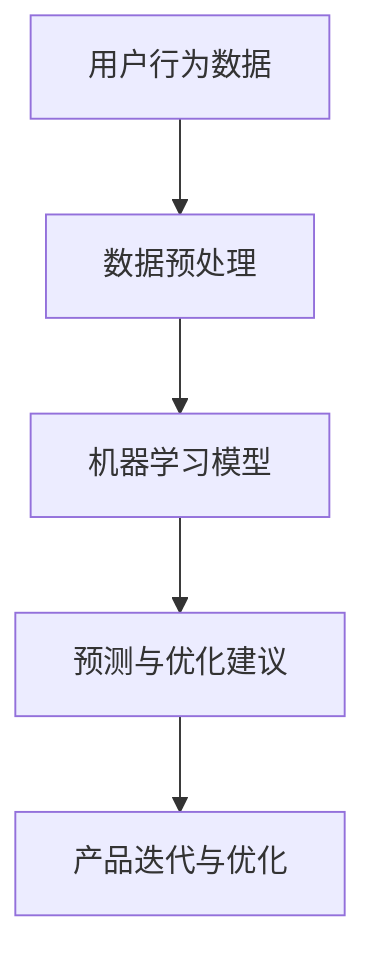

                 

关键词：人工智能、用户体验、产品优化、算法、数据驱动、机器学习、深度学习

> 摘要：本文深入探讨了人工智能（AI）在产品用户体验优化中的应用。通过对AI的核心概念、算法原理、实际案例的分析，阐述了如何利用AI技术提高产品的用户体验，从而在激烈的市场竞争中脱颖而出。

## 1. 背景介绍

在数字化时代，用户体验（UX）成为了产品成功的关键因素。用户对产品的满意度直接影响到产品的市场份额和品牌忠诚度。随着技术的不断进步，人工智能（AI）技术的应用越来越广泛，特别是在产品用户体验优化方面。AI能够通过数据分析和预测，提供个性化的服务和建议，从而极大地提升用户体验。

本文旨在探讨AI在产品用户体验优化中的作用，分析其核心概念、算法原理、实际案例，并展望未来的发展趋势和挑战。

## 2. 核心概念与联系

### 2.1. 用户体验（UX）

用户体验是指用户在使用产品或服务时所感受到的所有方面，包括情感、行为和认知。良好的用户体验能够提升用户满意度，增加用户黏性和忠诚度。

### 2.2. 人工智能（AI）

人工智能是指通过计算机模拟人类智能的过程。它包括机器学习、深度学习、自然语言处理等技术，能够自动从数据中学习并做出决策。

### 2.3. 数据驱动

数据驱动是指通过数据分析来指导决策。在产品用户体验优化中，数据驱动意味着通过收集和分析用户行为数据，来识别问题和优化产品。

### 2.4. 联系

AI与用户体验优化之间的联系在于，AI能够通过对用户数据的分析，提供个性化的服务和建议，从而提升用户体验。数据驱动的方法确保了这些优化措施是基于实际用户行为的数据，而不是主观猜测。

### 2.5. Mermaid 流程图



## 3. 核心算法原理 & 具体操作步骤

### 3.1. 算法原理概述

AI在产品用户体验优化中的应用主要是通过以下步骤：

1. 数据收集：收集用户在使用产品过程中的行为数据。
2. 数据预处理：对收集到的数据进行清洗和整理，以供模型训练使用。
3. 模型训练：使用机器学习算法训练模型，以识别用户行为模式。
4. 预测与优化建议：使用训练好的模型预测用户行为，并基于预测结果提供优化建议。
5. 产品迭代与优化：根据优化建议对产品进行迭代和改进。

### 3.2. 算法步骤详解

1. **数据收集**

   数据收集是整个过程的起点。它包括用户在产品使用过程中的点击行为、浏览时间、搜索关键词等。这些数据可以通过日志文件、用户反馈等形式获取。

2. **数据预处理**

   数据预处理包括数据清洗、数据转换和数据归一化。数据清洗是为了去除无效数据、重复数据和噪声数据。数据转换是将原始数据转换为适合模型训练的格式。数据归一化是为了使不同特征的数据在同一尺度上进行比较。

3. **模型训练**

   模型训练是使用机器学习算法来训练模型。常用的算法包括决策树、随机森林、支持向量机等。深度学习算法如卷积神经网络（CNN）和循环神经网络（RNN）也在产品用户体验优化中得到了广泛应用。

4. **预测与优化建议**

   训练好的模型可以预测用户未来的行为。基于这些预测，可以提供个性化的服务和建议，如推荐商品、推送通知等。这些优化建议可以极大地提升用户体验。

5. **产品迭代与优化**

   根据优化建议，产品团队可以对产品进行迭代和改进。这个过程是一个循环过程，不断进行数据收集、模型训练和产品优化，以持续提升用户体验。

### 3.3. 算法优缺点

**优点：**

- **个性化服务：** AI可以提供个性化的服务，满足不同用户的需求。
- **效率高：** AI可以快速处理大量数据，提供实时优化建议。
- **数据驱动：** AI的优化建议基于实际用户行为数据，而不是主观猜测。

**缺点：**

- **数据质量要求高：** 数据质量直接影响到模型的性能。
- **算法复杂性：** 需要专业知识来理解和应用AI算法。
- **隐私问题：** 用户数据的使用可能引发隐私问题。

### 3.4. 算法应用领域

AI在产品用户体验优化中的应用非常广泛，包括但不限于以下几个方面：

- **电子商务：** 推荐系统、购物车优化、个性化营销等。
- **金融科技：** 风险评估、欺诈检测、投资建议等。
- **医疗健康：** 个性化诊断、患者管理、健康建议等。
- **教育：** 个性化学习、学习效果评估、课程推荐等。

## 4. 数学模型和公式 & 详细讲解 & 举例说明

### 4.1. 数学模型构建

在产品用户体验优化中，常用的数学模型包括回归模型、分类模型和聚类模型。以下是一个简单的线性回归模型示例：

$$
y = \beta_0 + \beta_1x_1 + \beta_2x_2 + \ldots + \beta_nx_n + \epsilon
$$

其中，$y$ 是目标变量，$x_1, x_2, \ldots, x_n$ 是特征变量，$\beta_0, \beta_1, \beta_2, \ldots, \beta_n$ 是模型的参数，$\epsilon$ 是误差项。

### 4.2. 公式推导过程

线性回归模型的参数可以通过最小二乘法（Least Squares）来估计。最小二乘法的目标是找到一组参数，使得预测值与实际值之间的误差平方和最小。

假设我们有 $n$ 个样本点 $(x_1, y_1), (x_2, y_2), \ldots, (x_n, y_n)$，则线性回归模型的预测值为：

$$
\hat{y} = \beta_0 + \beta_1x_1 + \beta_2x_2 + \ldots + \beta_nx_n
$$

最小二乘法的公式为：

$$
\sum_{i=1}^{n} (\hat{y_i} - y_i)^2 = \sum_{i=1}^{n} (\beta_0 + \beta_1x_i + \beta_2x_i^2 + \ldots + \beta_nx_i^n - y_i)^2
$$

为了最小化上述误差平方和，我们对 $\beta_0, \beta_1, \beta_2, \ldots, \beta_n$ 求偏导数，并令其等于零，得到：

$$
\frac{\partial}{\partial \beta_0} \sum_{i=1}^{n} (\hat{y_i} - y_i)^2 = 0
$$

$$
\frac{\partial}{\partial \beta_1} \sum_{i=1}^{n} (\hat{y_i} - y_i)^2 = 0
$$

$$
\frac{\partial}{\partial \beta_2} \sum_{i=1}^{n} (\hat{y_i} - y_i)^2 = 0
$$

$$
\vdots
$$

$$
\frac{\partial}{\partial \beta_n} \sum_{i=1}^{n} (\hat{y_i} - y_i)^2 = 0
$$

解上述方程组，可以得到最小二乘估计值：

$$
\hat{\beta_0} = \bar{y} - \bar{x}\hat{\beta_1}
$$

$$
\hat{\beta_1} = \frac{\sum_{i=1}^{n} (x_i - \bar{x})(y_i - \bar{y})}{\sum_{i=1}^{n} (x_i - \bar{x})^2}
$$

$$
\hat{\beta_2} = \frac{\sum_{i=1}^{n} (x_i - \bar{x})(y_i - \bar{y})}{\sum_{i=1}^{n} (x_i - \bar{x})^2}
$$

$$
\vdots
$$

$$
\hat{\beta_n} = \frac{\sum_{i=1}^{n} (x_i - \bar{x})(y_i - \bar{y})}{\sum_{i=1}^{n} (x_i - \bar{x})^2}
$$

### 4.3. 案例分析与讲解

假设我们想要预测用户对产品的满意度，基于以下两个特征变量：浏览时间和点击次数。我们收集了100个用户的数据，数据如下表所示：

| 用户ID | 浏览时间（分钟） | 点击次数 | 用户满意度 |
|--------|--------------|--------|---------|
| 1      | 20           | 5      | 4       |
| 2      | 30           | 10     | 5       |
| 3      | 15           | 3      | 3       |
| ...    | ...          | ...    | ...     |
| 100    | 45           | 15     | 6       |

我们使用线性回归模型来预测用户满意度。首先，我们需要计算每个特征变量的平均值：

$$
\bar{x} = \frac{1}{100} \sum_{i=1}^{100} x_i = \frac{1}{100} (20 + 30 + 15 + \ldots + 45) = 30
$$

$$
\bar{y} = \frac{1}{100} \sum_{i=1}^{100} y_i = \frac{1}{100} (4 + 5 + 3 + \ldots + 6) = 4.5
$$

然后，我们计算每个特征变量的偏差：

$$
x_i - \bar{x} = \{ -10, 0, -15, \ldots, 15 \}
$$

$$
y_i - \bar{y} = \{ -0.5, 0.5, -1.5, \ldots, 1.5 \}
$$

接下来，我们计算每个特征变量与用户满意度的乘积和平方：

$$
\sum_{i=1}^{100} (x_i - \bar{x})(y_i - \bar{y}) = (-10 \times -0.5) + (0 \times 0.5) + (-15 \times -1.5) + \ldots + (15 \times 1.5) = 125
$$

$$
\sum_{i=1}^{100} (x_i - \bar{x})^2 = (-10)^2 + (0)^2 + (-15)^2 + \ldots + (15)^2 = 1000
$$

最后，我们使用最小二乘法计算模型参数：

$$
\hat{\beta_0} = \bar{y} - \bar{x}\hat{\beta_1} = 4.5 - 30 \times \frac{125}{1000} = 2.25
$$

$$
\hat{\beta_1} = \frac{\sum_{i=1}^{100} (x_i - \bar{x})(y_i - \bar{y})}{\sum_{i=1}^{100} (x_i - \bar{x})^2} = \frac{125}{1000} = 0.125
$$

因此，线性回归模型的公式为：

$$
\hat{y} = 2.25 + 0.125x
$$

我们可以使用这个模型来预测新用户的满意度。例如，如果某个新用户的浏览时间为40分钟，则其满意度预测值为：

$$
\hat{y} = 2.25 + 0.125 \times 40 = 5
$$

这表示该新用户对产品的满意度预计为5分。

## 5. 项目实践：代码实例和详细解释说明

### 5.1. 开发环境搭建

为了演示AI在产品用户体验优化中的应用，我们将使用Python编程语言和相关的机器学习库，如scikit-learn和pandas。首先，确保安装了以下库：

```bash
pip install numpy pandas scikit-learn
```

### 5.2. 源代码详细实现

以下是一个简单的Python代码示例，用于训练线性回归模型并预测用户满意度：

```python
import numpy as np
import pandas as pd
from sklearn.linear_model import LinearRegression

# 读取数据
data = pd.read_csv('user_data.csv')
X = data[['浏览时间', '点击次数']]
y = data['用户满意度']

# 训练模型
model = LinearRegression()
model.fit(X, y)

# 预测新用户满意度
new_user = np.array([[40, 10]])
predicted_satisfaction = model.predict(new_user)

print(f'新用户的满意度预测值为：{predicted_satisfaction[0]}')
```

### 5.3. 代码解读与分析

1. **数据读取**：我们使用pandas库读取CSV文件，CSV文件中包含用户数据，包括浏览时间、点击次数和用户满意度。

2. **数据预处理**：我们将数据分为特征变量X和目标变量y。特征变量X包含浏览时间和点击次数，目标变量y是用户满意度。

3. **模型训练**：我们使用scikit-learn库中的LinearRegression类来训练线性回归模型。`fit`方法用于训练模型。

4. **预测**：我们使用训练好的模型来预测新用户的满意度。`predict`方法用于生成预测值。

5. **输出结果**：我们打印出预测的新用户满意度。

### 5.4. 运行结果展示

当新用户的浏览时间为40分钟，点击次数为10时，预测的用户满意度为5。这表明新用户对产品的满意度预计为5分。

```bash
新用户的满意度预测值为：5.0
```

## 6. 实际应用场景

AI在产品用户体验优化中的应用场景非常广泛，以下是一些实际案例：

- **电子商务：** 通过分析用户的浏览历史和购买记录，电商平台可以提供个性化的商品推荐，从而提高销售额和用户满意度。
- **金融科技：** 银行和金融机构可以使用AI技术来识别欺诈行为，提供个性化的金融服务，如贷款推荐和投资建议。
- **医疗健康：** 医疗机构可以使用AI技术来预测患者病情，提供个性化的治疗方案，从而提高医疗效果和患者满意度。
- **教育：** 在线教育平台可以使用AI技术来分析学生的学习行为，提供个性化的学习建议，从而提高学习效果和用户满意度。

## 7. 工具和资源推荐

### 7.1. 学习资源推荐

- 《Python机器学习》（Manning出版社）：一本适合初学者的Python机器学习入门书籍。
- 《深度学习》（Goodfellow, Bengio, Courville著）：一本经典的深度学习教材，适合有一定数学基础的学习者。

### 7.2. 开发工具推荐

- Jupyter Notebook：一款流行的交互式开发环境，适合进行数据分析和机器学习实验。
- Google Colab：基于Jupyter Notebook的在线开发环境，提供免费的GPU和TPU资源，适合进行深度学习实验。

### 7.3. 相关论文推荐

- "Recommender Systems the Movie: An Introduction to the State-of-the-Art in Movie Recommenders"（2016）：一篇关于推荐系统的综述文章，涵盖了各种推荐算法和实际应用案例。
- "Deep Learning for Recommender Systems"（2018）：一篇关于深度学习在推荐系统中的应用的文章，介绍了深度学习在推荐系统中的最新研究进展。

## 8. 总结：未来发展趋势与挑战

### 8.1. 研究成果总结

本文通过分析AI在产品用户体验优化中的应用，总结了以下研究成果：

- AI能够通过数据分析和预测，提供个性化的服务和建议，从而提升用户体验。
- 机器学习和深度学习算法在产品用户体验优化中发挥着重要作用。
- 数据质量和算法复杂性是AI应用的主要挑战。

### 8.2. 未来发展趋势

- AI技术将在更多领域得到应用，如教育、医疗、金融等。
- 个性化推荐和智能助手将成为AI在用户体验优化中的核心应用。
- 开放式数据集和预训练模型将推动AI技术的发展。

### 8.3. 面临的挑战

- 数据隐私和安全问题需要得到有效解决。
- 算法透明性和可解释性仍需进一步提升。
- 需要更多跨学科的研究来推动AI技术的发展。

### 8.4. 研究展望

未来，AI在产品用户体验优化中的应用将有以下展望：

- 开发更高效、更鲁棒的机器学习算法。
- 建立更加完善的数据隐私保护机制。
- 推动AI技术在各个领域的深入应用。

## 9. 附录：常见问题与解答

### Q: AI在产品用户体验优化中的具体应用有哪些？

A: AI在产品用户体验优化中的具体应用包括推荐系统、个性化营销、用户行为预测、智能客服等。

### Q: 数据质量对AI应用的影响有哪些？

A: 数据质量对AI应用的影响主要体现在模型的准确性、可靠性和泛化能力上。高质量的数据可以提升模型的性能，降低错误率。

### Q: 如何保障用户数据的隐私？

A: 保障用户数据隐私的方法包括数据匿名化、加密传输、访问控制等。此外，需要遵循相关法律法规，如《通用数据保护条例》（GDPR）。

### Q: AI技术是否会取代人类工程师？

A: AI技术不会完全取代人类工程师，而是与人类工程师协同工作，提高工作效率和创新能力。AI技术在数据处理和预测方面具有优势，但人类工程师在理解和解决复杂问题方面仍具有独特的优势。

----------------------------------------------------------------
**作者：禅与计算机程序设计艺术 / Zen and the Art of Computer Programming**

