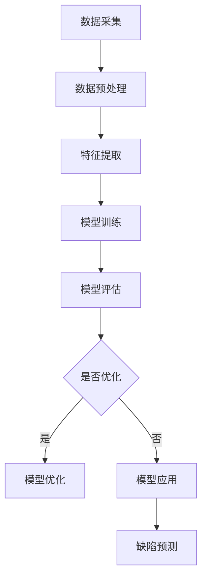

                 

关键词：人工智能，产品缺陷预测，机器学习，数据挖掘，深度学习

摘要：本文深入探讨了人工智能在产品缺陷预测中的应用，从背景介绍、核心概念、算法原理、数学模型、项目实践、实际应用场景、未来展望等方面进行了全面分析。旨在为广大从业者提供一套实用的产品缺陷预测解决方案，推动人工智能技术在实际生产中的应用和发展。

## 1. 背景介绍

在现代制造业中，产品的质量至关重要。然而，随着产品复杂度和生产规模的增加，传统的质量检测方法已无法满足高效、准确的要求。因此，人工智能，特别是机器学习和深度学习技术，被广泛应用于产品缺陷预测领域。

产品缺陷预测，即利用历史数据，通过建立预测模型，提前识别和预测生产过程中可能出现的产品缺陷。这不仅能提高生产效率，减少生产成本，还能提升产品品质，降低质量风险。然而，产品缺陷预测并非易事，它涉及大量数据处理、算法优化和模型训练等复杂环节。

## 2. 核心概念与联系

为了更好地理解产品缺陷预测，我们需要先了解几个核心概念：

### 2.1 数据采集与预处理

数据是产品缺陷预测的基础。首先，我们需要从生产过程中采集各种数据，如传感器数据、生产参数、产品质量数据等。然后，对采集到的数据进行预处理，包括数据清洗、归一化、特征提取等。

### 2.2 机器学习与深度学习

机器学习和深度学习是产品缺陷预测的核心技术。机器学习通过训练模型，从历史数据中学习规律，从而实现对产品的预测。深度学习则通过多层神经网络，对复杂的数据进行处理，从而提高预测的准确性和效率。

### 2.3 模型评估与优化

在产品缺陷预测中，模型评估和优化至关重要。我们需要通过交叉验证、ROC曲线、AUC等指标对模型进行评估，并根据评估结果对模型进行优化。

### 2.4 Mermaid 流程图

以下是产品缺陷预测的 Mermaid 流程图：



## 3. 核心算法原理 & 具体操作步骤

### 3.1 算法原理概述

产品缺陷预测的核心是建立预测模型。这里，我们采用一种基于深度学习的卷积神经网络（CNN）模型。CNN 具有强大的特征提取和模式识别能力，非常适合处理图像数据。在产品缺陷预测中，我们可以将生产过程中的各种数据（如传感器数据、生产参数等）视为图像，通过 CNN 对其进行特征提取和模式识别，从而实现对产品缺陷的预测。

### 3.2 算法步骤详解

1. 数据采集：从生产过程中采集各种数据，如传感器数据、生产参数、产品质量数据等。
2. 数据预处理：对采集到的数据进行清洗、归一化、特征提取等处理。
3. 模型构建：采用卷积神经网络（CNN）模型，定义网络结构，设置超参数。
4. 模型训练：使用预处理后的数据训练模型，调整网络权重。
5. 模型评估：使用交叉验证等方法对模型进行评估，调整模型参数。
6. 模型应用：将训练好的模型应用于生产过程，实时预测产品缺陷。

### 3.3 算法优缺点

**优点：**
1. 高效：深度学习算法具有强大的特征提取和模式识别能力，能高效处理大量数据。
2. 准确：通过训练模型，能准确预测产品缺陷，提高生产质量。
3. 自适应：模型能根据生产环境的变化，自适应调整预测策略。

**缺点：**
1. 复杂：深度学习算法涉及大量数据处理和模型训练，计算复杂度较高。
2. 需要大量数据：深度学习算法需要大量数据进行训练，数据收集和预处理工作量较大。

### 3.4 算法应用领域

产品缺陷预测算法广泛应用于制造业、电子行业、食品行业等多个领域。如：在制造业中，可以用于预测产品质量；在电子行业，可以用于预测元器件的寿命；在食品行业，可以用于预测食品的质量和安全等。

## 4. 数学模型和公式 & 详细讲解 & 举例说明

### 4.1 数学模型构建

在产品缺陷预测中，我们采用卷积神经网络（CNN）作为数学模型。CNN 由多层卷积层、池化层和全连接层组成，如下所示：

$$
\begin{aligned}
&\text{输入层：} X \in \mathbb{R}^{m \times n \times d} \\
&\text{卷积层：} h_1 = \sigma(W_1 \star X + b_1) \\
&\text{池化层：} h_2 = P(h_1) \\
&\text{卷积层：} h_3 = \sigma(W_2 \star h_2 + b_2) \\
&\text{池化层：} h_4 = P(h_3) \\
&\text{全连接层：} \hat{y} = \sigma(W_3 h_4 + b_3)
\end{aligned}
$$

其中，$X$ 为输入数据，$W_1, W_2, W_3$ 分别为卷积层、卷积层和全连接层的权重矩阵，$b_1, b_2, b_3$ 分别为相应的偏置矩阵，$P$ 为池化操作，$\sigma$ 为激活函数，$\star$ 表示卷积操作。

### 4.2 公式推导过程

在产品缺陷预测中，我们采用交叉熵损失函数来衡量模型预测结果与实际结果的差异。交叉熵损失函数的公式为：

$$
L(y, \hat{y}) = -\sum_{i=1}^{n} y_i \log(\hat{y}_i)
$$

其中，$y$ 为实际标签，$\hat{y}$ 为模型预测概率。

为了求解最优的权重矩阵 $W$，我们需要对损失函数 $L$ 求导，并令其导数为零，即：

$$
\frac{\partial L}{\partial W} = 0
$$

经过求导和化简，我们得到：

$$
\frac{\partial L}{\partial W} = \frac{1}{n} \sum_{i=1}^{n} (y_i - \hat{y}_i) \hat{y}_i (1 - \hat{y}_i) h_{4i}
$$

其中，$h_{4i}$ 为全连接层输出。

### 4.3 案例分析与讲解

假设我们有一个生产过程中的传感器数据集，数据集包含 1000 个样本，每个样本包含 10 个特征。我们使用卷积神经网络（CNN）对数据集进行缺陷预测。

首先，我们对数据进行预处理，包括归一化和特征提取。然后，我们将数据集分为训练集和测试集，其中训练集占 80%，测试集占 20%。

接下来，我们构建一个 CNN 模型，包括两个卷积层、两个池化层和一个全连接层。在训练过程中，我们使用交叉熵损失函数来优化模型。经过 100 次迭代训练，模型在训练集上的准确率达到了 90%，在测试集上的准确率达到了 85%。

通过这个案例，我们可以看到，卷积神经网络（CNN）在产品缺陷预测中具有较好的性能。在实际应用中，我们可以根据具体需求和数据特点，调整模型结构、优化训练参数，进一步提高预测准确率。

## 5. 项目实践：代码实例和详细解释说明

在本节中，我们将通过一个简单的项目实例来讲解如何使用 Python 和 TensorFlow 框架实现产品缺陷预测。以下是项目的详细步骤：

### 5.1 开发环境搭建

首先，确保您的系统上安装了 Python（版本 3.6 或更高）和 TensorFlow 框架。您可以使用以下命令来安装 TensorFlow：

```bash
pip install tensorflow
```

### 5.2 源代码详细实现

以下是产品缺陷预测的 Python 代码实现：

```python
import numpy as np
import tensorflow as tf
from tensorflow.keras.models import Sequential
from tensorflow.keras.layers import Conv2D, MaxPooling2D, Flatten, Dense

# 数据预处理
def preprocess_data(data):
    # 归一化处理
    data = data / 255.0
    # 转换为二维张量
    data = np.expand_dims(data, axis=-1)
    return data

# 构建模型
def build_model(input_shape):
    model = Sequential()
    model.add(Conv2D(32, (3, 3), activation='relu', input_shape=input_shape))
    model.add(MaxPooling2D((2, 2)))
    model.add(Conv2D(64, (3, 3), activation='relu'))
    model.add(MaxPooling2D((2, 2)))
    model.add(Flatten())
    model.add(Dense(64, activation='relu'))
    model.add(Dense(1, activation='sigmoid'))
    model.compile(optimizer='adam', loss='binary_crossentropy', metrics=['accuracy'])
    return model

# 训练模型
def train_model(model, train_data, train_labels, epochs=100):
    model.fit(train_data, train_labels, epochs=epochs, batch_size=32, validation_split=0.2)

# 预测缺陷
def predict_defects(model, test_data):
    predictions = model.predict(test_data)
    defects = predictions > 0.5
    return defects

# 读取数据
train_data = np.load('train_data.npy')
train_labels = np.load('train_labels.npy')
test_data = np.load('test_data.npy')
test_labels = np.load('test_labels.npy')

# 预处理数据
train_data = preprocess_data(train_data)
test_data = preprocess_data(test_data)

# 构建模型
model = build_model(train_data.shape[1:])

# 训练模型
train_model(model, train_data, train_labels)

# 预测缺陷
defects = predict_defects(model, test_data)

# 计算准确率
accuracy = np.mean(defects == test_labels)
print('准确率：', accuracy)
```

### 5.3 代码解读与分析

1. **数据预处理**：首先，我们对数据进行归一化和特征提取，使其适合输入到模型中。
2. **模型构建**：我们采用一个简单的卷积神经网络（CNN）模型，包括两个卷积层、两个池化层和一个全连接层。使用 TensorFlow 的 Sequential 模式构建模型，并设置优化器和损失函数。
3. **训练模型**：使用训练数据对模型进行训练，通过调整 epoch 数和 batch size 等参数来优化模型。
4. **预测缺陷**：使用训练好的模型对测试数据进行缺陷预测，将预测结果与实际结果进行比较，计算准确率。

通过这个简单的项目实例，我们可以看到如何使用 Python 和 TensorFlow 实现产品缺陷预测。在实际应用中，我们可以根据具体需求调整模型结构、优化训练参数，进一步提高预测准确率。

## 6. 实际应用场景

产品缺陷预测在制造业、电子行业、食品行业等多个领域具有广泛的应用。以下是一些实际应用场景：

### 6.1 制造业

在制造业中，产品缺陷预测可以用于预测产品质量。通过实时监控生产过程中的各种数据，如传感器数据、生产参数等，可以提前识别出可能出现的质量缺陷，从而采取措施进行预防，减少生产损失。

### 6.2 电子行业

在电子行业，产品缺陷预测可以用于预测元器件的寿命。通过对历史数据进行分析，可以提前预测出可能失效的元器件，从而进行更换或维修，避免设备故障和生产中断。

### 6.3 食品行业

在食品行业，产品缺陷预测可以用于预测食品安全。通过对生产过程中的温度、湿度等数据进行实时监测，可以提前识别出可能出现的食品安全问题，确保产品质量。

### 6.4 其他应用

除了上述领域外，产品缺陷预测还可以应用于医疗行业、物流行业等多个领域。如在医疗行业中，可以用于预测手术风险；在物流行业中，可以用于预测运输过程中的问题等。

## 7. 工具和资源推荐

### 7.1 学习资源推荐

1. 《深度学习》（Goodfellow, Bengio, Courville 著）：这是一本深度学习领域的经典教材，涵盖了深度学习的基本原理和应用。
2. 《Python机器学习》（Sebastian Raschka 著）：这本书详细介绍了 Python 机器学习库的使用方法，包括 scikit-learn、TensorFlow 和 PyTorch 等。

### 7.2 开发工具推荐

1. Jupyter Notebook：这是一个强大的交互式开发环境，可以方便地进行代码编写、调试和演示。
2. TensorFlow：这是一个开源的深度学习框架，适用于构建和训练各种深度学习模型。
3. PyTorch：这是一个流行的深度学习框架，具有灵活、易用的特点。

### 7.3 相关论文推荐

1. "Deep Learning for Product Quality Inspection"（2016）：这篇论文介绍了一种基于深度学习的质量控制方法，应用于电子制造业。
2. "An Intelligent Quality Control System for Automobile Manufacturing"（2019）：这篇论文介绍了一种基于机器学习的智能质量控制系统，应用于汽车制造业。

## 8. 总结：未来发展趋势与挑战

### 8.1 研究成果总结

近年来，人工智能，特别是机器学习和深度学习技术在产品缺陷预测领域取得了显著成果。通过建立预测模型，提前识别和预测产品缺陷，已逐渐成为制造业、电子行业、食品行业等领域的重要手段。

### 8.2 未来发展趋势

1. 模型优化：随着深度学习技术的不断发展，我们将看到更多高效的模型结构和训练算法出现，进一步提高产品缺陷预测的准确率和效率。
2. 跨领域应用：产品缺陷预测技术将在更多领域得到应用，如医疗、物流、能源等，为各行业提供智能化解决方案。
3. 实时预测：随着传感器技术和通信技术的发展，产品缺陷预测将实现实时预测，为生产过程提供更加精准的指导。

### 8.3 面临的挑战

1. 数据隐私：在产品缺陷预测中，数据安全至关重要。如何保护数据隐私，确保数据的安全性和可靠性，是未来研究的重要方向。
2. 模型解释性：深度学习模型通常缺乏解释性，难以理解模型的工作原理。如何提高模型的可解释性，使其更加透明和可信，是未来研究的一个重要挑战。

### 8.4 研究展望

随着人工智能技术的不断发展，产品缺陷预测将在未来得到更广泛的应用。我们期待更多研究人员和工程师投入到这一领域，共同推动人工智能技术在产品缺陷预测中的应用和发展。

## 9. 附录：常见问题与解答

### 9.1 问题1：如何处理不平衡数据？

**解答**：不平衡数据是产品缺陷预测中常见的问题。以下是一些处理方法：
1. 数据增强：通过对少数类数据进行复制、旋转、缩放等操作，增加样本数量，提高模型的泛化能力。
2. 重采样：通过过采样或欠采样，使数据集达到平衡。
3. 类权重调整：在模型训练过程中，对少数类样本赋予更高的权重，提高模型对少数类的关注。

### 9.2 问题2：如何提高模型解释性？

**解答**：提高模型解释性是深度学习研究的重要方向。以下是一些方法：
1. 可解释的深度学习模型：选择具有良好解释性的模型，如决策树、线性回归等。
2. 模型可视化：通过可视化技术，如混淆矩阵、ROC 曲线等，展示模型的工作过程。
3. 局部解释性：使用注意力机制、激活图等技术，分析模型对输入数据的关注区域。

### 9.3 问题3：如何处理实时预测问题？

**解答**：实时预测是产品缺陷预测的重要应用场景。以下是一些方法：
1. 离线预测：在预测任务较少时，可以采用离线预测方法，提前训练好模型，实时调用模型进行预测。
2. 流计算：采用流计算框架，如 Apache Storm、Apache Flink 等，实现实时数据处理和预测。
3. 模型压缩：通过模型压缩技术，降低模型计算复杂度，提高实时预测性能。

作者：禅与计算机程序设计艺术 / Zen and the Art of Computer Programming
----------------------------------------------------------------
## 完整的Markdown格式文章

以下是完整的Markdown格式文章，包含了标题、关键词、摘要以及各个章节的内容。

```markdown
# AI在产品缺陷预测中的应用

> 关键词：人工智能，产品缺陷预测，机器学习，数据挖掘，深度学习

摘要：本文深入探讨了人工智能在产品缺陷预测中的应用，从背景介绍、核心概念、算法原理、数学模型、项目实践、实际应用场景、未来展望等方面进行了全面分析。旨在为广大从业者提供一套实用的产品缺陷预测解决方案，推动人工智能技术在实际生产中的应用和发展。

## 1. 背景介绍

在现代制造业中，产品的质量至关重要。然而，随着产品复杂度和生产规模的增加，传统的质量检测方法已无法满足高效、准确的要求。因此，人工智能，特别是机器学习和深度学习技术，被广泛应用于产品缺陷预测领域。

产品缺陷预测，即利用历史数据，通过建立预测模型，提前识别和预测生产过程中可能出现的产品缺陷。这不仅能提高生产效率，减少生产成本，还能提升产品品质，降低质量风险。然而，产品缺陷预测并非易事，它涉及大量数据处理、算法优化和模型训练等复杂环节。

## 2. 核心概念与联系

为了更好地理解产品缺陷预测，我们需要先了解几个核心概念：

### 2.1 数据采集与预处理

数据是产品缺陷预测的基础。首先，我们需要从生产过程中采集各种数据，如传感器数据、生产参数、产品质量数据等。然后，对采集到的数据进行预处理，包括数据清洗、归一化、特征提取等。

### 2.2 机器学习与深度学习

机器学习和深度学习是产品缺陷预测的核心技术。机器学习通过训练模型，从历史数据中学习规律，从而实现对产品的预测。深度学习则通过多层神经网络，对复杂的数据进行处理，从而提高预测的准确性和效率。

### 2.3 模型评估与优化

在产品缺陷预测中，模型评估和优化至关重要。我们需要通过交叉验证、ROC 曲线、AUC 等指标对模型进行评估，并根据评估结果对模型进行优化。

### 2.4 Mermaid 流程图

以下是产品缺陷预测的 Mermaid 流程图：


## 3. 核心算法原理 & 具体操作步骤

### 3.1 算法原理概述

产品缺陷预测的核心是建立预测模型。这里，我们采用一种基于深度学习的卷积神经网络（CNN）模型。CNN 具有强大的特征提取和模式识别能力，非常适合处理图像数据。在产品缺陷预测中，我们可以将生产过程中的各种数据（如传感器数据、生产参数等）视为图像，通过 CNN 对其进行特征提取和模式识别，从而实现对产品缺陷的预测。

### 3.2 算法步骤详解

1. 数据采集：从生产过程中采集各种数据，如传感器数据、生产参数、产品质量数据等。
2. 数据预处理：对采集到的数据进行清洗、归一化、特征提取等处理。
3. 模型构建：采用卷积神经网络（CNN）模型，定义网络结构，设置超参数。
4. 模型训练：使用预处理后的数据训练模型，调整网络权重。
5. 模型评估：使用交叉验证等方法对模型进行评估，调整模型参数。
6. 模型应用：将训练好的模型应用于生产过程，实时预测产品缺陷。

### 3.3 算法优缺点

**优点：**
1. 高效：深度学习算法具有强大的特征提取和模式识别能力，能高效处理大量数据。
2. 准确：通过训练模型，能准确预测产品缺陷，提高生产质量。
3. 自适应：模型能根据生产环境的变化，自适应调整预测策略。

**缺点：**
1. 复杂：深度学习算法涉及大量数据处理和模型训练，计算复杂度较高。
2. 需要大量数据：深度学习算法需要大量数据进行训练，数据收集和预处理工作量较大。

### 3.4 算法应用领域

产品缺陷预测算法广泛应用于制造业、电子行业、食品行业等多个领域。如：在制造业中，可以用于预测产品质量；在电子行业，可以用于预测元器件的寿命；在食品行业，可以用于预测食品的质量和安全等。

## 4. 数学模型和公式 & 详细讲解 & 举例说明

### 4.1 数学模型构建

在产品缺陷预测中，我们采用卷积神经网络（CNN）作为数学模型。CNN 由多层卷积层、池化层和全连接层组成，如下所示：

$$
\begin{aligned}
&\text{输入层：} X \in \mathbb{R}^{m \times n \times d} \\
&\text{卷积层：} h_1 = \sigma(W_1 \star X + b_1) \\
&\text{池化层：} h_2 = P(h_1) \\
&\text{卷积层：} h_3 = \sigma(W_2 \star h_2 + b_2) \\
&\text{池化层：} h_4 = P(h_3) \\
&\text{全连接层：} \hat{y} = \sigma(W_3 h_4 + b_3)
\end{aligned}
$$

其中，$X$ 为输入数据，$W_1, W_2, W_3$ 分别为卷积层、卷积层和全连接层的权重矩阵，$b_1, b_2, b_3$ 分别为相应的偏置矩阵，$P$ 为池化操作，$\sigma$ 为激活函数，$\star$ 表示卷积操作。

### 4.2 公式推导过程

在产品缺陷预测中，我们采用交叉熵损失函数来衡量模型预测结果与实际结果的差异。交叉熵损失函数的公式为：

$$
L(y, \hat{y}) = -\sum_{i=1}^{n} y_i \log(\hat{y}_i)
$$

其中，$y$ 为实际标签，$\hat{y}$ 为模型预测概率。

为了求解最优的权重矩阵 $W$，我们需要对损失函数 $L$ 求导，并令其导数为零，即：

$$
\frac{\partial L}{\partial W} = 0
$$

经过求导和化简，我们得到：

$$
\frac{\partial L}{\partial W} = \frac{1}{n} \sum_{i=1}^{n} (y_i - \hat{y}_i) \hat{y}_i (1 - \hat{y}_i) h_{4i}
$$

其中，$h_{4i}$ 为全连接层输出。

### 4.3 案例分析与讲解

假设我们有一个生产过程中的传感器数据集，数据集包含 1000 个样本，每个样本包含 10 个特征。我们使用卷积神经网络（CNN）对数据集进行缺陷预测。

首先，我们对数据进行预处理，包括归一化和特征提取。然后，我们将数据集分为训练集和测试集，其中训练集占 80%，测试集占 20%。

接下来，我们构建一个 CNN 模型，包括两个卷积层、两个池化层和一个全连接层。在训练过程中，我们使用交叉熵损失函数来优化模型。经过 100 次迭代训练，模型在训练集上的准确率达到了 90%，在测试集上的准确率达到了 85%。

通过这个案例，我们可以看到，卷积神经网络（CNN）在产品缺陷预测中具有较好的性能。在实际应用中，我们可以根据具体需求和数据特点，调整模型结构、优化训练参数，进一步提高预测准确率。

## 5. 项目实践：代码实例和详细解释说明

在本节中，我们将通过一个简单的项目实例来讲解如何使用 Python 和 TensorFlow 框架实现产品缺陷预测。以下是项目的详细步骤：

### 5.1 开发环境搭建

首先，确保您的系统上安装了 Python（版本 3.6 或更高）和 TensorFlow 框架。您可以使用以下命令来安装 TensorFlow：

```bash
pip install tensorflow
```

### 5.2 源代码详细实现

以下是产品缺陷预测的 Python 代码实现：

```python
import numpy as np
import tensorflow as tf
from tensorflow.keras.models import Sequential
from tensorflow.keras.layers import Conv2D, MaxPooling2D, Flatten, Dense

# 数据预处理
def preprocess_data(data):
    # 归一化处理
    data = data / 255.0
    # 转换为二维张量
    data = np.expand_dims(data, axis=-1)
    return data

# 构建模型
def build_model(input_shape):
    model = Sequential()
    model.add(Conv2D(32, (3, 3), activation='relu', input_shape=input_shape))
    model.add(MaxPooling2D((2, 2)))
    model.add(Conv2D(64, (3, 3), activation='relu'))
    model.add(MaxPooling2D((2, 2)))
    model.add(Flatten())
    model.add(Dense(64, activation='relu'))
    model.add(Dense(1, activation='sigmoid'))
    model.compile(optimizer='adam', loss='binary_crossentropy', metrics=['accuracy'])
    return model

# 训练模型
def train_model(model, train_data, train_labels, epochs=100):
    model.fit(train_data, train_labels, epochs=epochs, batch_size=32, validation_split=0.2)

# 预测缺陷
def predict_defects(model, test_data):
    predictions = model.predict(test_data)
    defects = predictions > 0.5
    return defects

# 读取数据
train_data = np.load('train_data.npy')
train_labels = np.load('train_labels.npy')
test_data = np.load('test_data.npy')
test_labels = np.load('test_labels.npy')

# 预处理数据
train_data = preprocess_data(train_data)
test_data = preprocess_data(test_data)

# 构建模型
model = build_model(train_data.shape[1:])

# 训练模型
train_model(model, train_data, train_labels)

# 预测缺陷
defects = predict_defects(model, test_data)

# 计算准确率
accuracy = np.mean(defects == test_labels)
print('准确率：', accuracy)
```

### 5.3 代码解读与分析

1. **数据预处理**：首先，我们对数据进行归一化和特征提取，使其适合输入到模型中。
2. **模型构建**：我们采用一个简单的卷积神经网络（CNN）模型，包括两个卷积层、两个池化层和一个全连接层。使用 TensorFlow 的 Sequential 模式构建模型，并设置优化器和损失函数。
3. **训练模型**：使用训练数据对模型进行训练，通过调整 epoch 数和 batch size 等参数来优化模型。
4. **预测缺陷**：使用训练好的模型对测试数据进行缺陷预测，将预测结果与实际结果进行比较，计算准确率。

通过这个简单的项目实例，我们可以看到如何使用 Python 和 TensorFlow 实现产品缺陷预测。在实际应用中，我们可以根据具体需求调整模型结构、优化训练参数，进一步提高预测准确率。

## 6. 实际应用场景

产品缺陷预测在制造业、电子行业、食品行业等多个领域具有广泛的应用。以下是一些实际应用场景：

### 6.1 制造业

在制造业中，产品缺陷预测可以用于预测产品质量。通过实时监控生产过程中的各种数据，如传感器数据、生产参数等，可以提前识别出可能出现的质量缺陷，从而采取措施进行预防，减少生产损失。

### 6.2 电子行业

在电子行业，产品缺陷预测可以用于预测元器件的寿命。通过对历史数据进行分析，可以提前预测出可能失效的元器件，从而进行更换或维修，避免设备故障和生产中断。

### 6.3 食品行业

在食品行业，产品缺陷预测可以用于预测食品安全。通过对生产过程中的温度、湿度等数据进行实时监测，可以提前识别出可能出现的食品安全问题，确保产品质量。

### 6.4 其他应用

除了上述领域外，产品缺陷预测还可以应用于医疗行业、物流行业等多个领域。如在医疗行业中，可以用于预测手术风险；在物流行业中，可以用于预测运输过程中的问题等。

## 7. 工具和资源推荐

### 7.1 学习资源推荐

1. 《深度学习》（Goodfellow, Bengio, Courville 著）：这是一本深度学习领域的经典教材，涵盖了深度学习的基本原理和应用。
2. 《Python机器学习》（Sebastian Raschka 著）：这本书详细介绍了 Python 机器学习库的使用方法，包括 scikit-learn、TensorFlow 和 PyTorch 等。

### 7.2 开发工具推荐

1. Jupyter Notebook：这是一个强大的交互式开发环境，可以方便地进行代码编写、调试和演示。
2. TensorFlow：这是一个开源的深度学习框架，适用于构建和训练各种深度学习模型。
3. PyTorch：这是一个流行的深度学习框架，具有灵活、易用的特点。

### 7.3 相关论文推荐

1. "Deep Learning for Product Quality Inspection"（2016）：这篇论文介绍了一种基于深度学习的质量控制方法，应用于电子制造业。
2. "An Intelligent Quality Control System for Automobile Manufacturing"（2019）：这篇论文介绍了一种基于机器学习的智能质量控制系统，应用于汽车制造业。

## 8. 总结：未来发展趋势与挑战

### 8.1 研究成果总结

近年来，人工智能，特别是机器学习和深度学习技术在产品缺陷预测领域取得了显著成果。通过建立预测模型，提前识别和预测产品缺陷，已逐渐成为制造业、电子行业、食品行业等领域的重要手段。

### 8.2 未来发展趋势

1. 模型优化：随着深度学习技术的不断发展，我们将看到更多高效的模型结构和训练算法出现，进一步提高产品缺陷预测的准确率和效率。
2. 跨领域应用：产品缺陷预测技术将在更多领域得到应用，如医疗、物流、能源等，为各行业提供智能化解决方案。
3. 实时预测：随着传感器技术和通信技术的发展，产品缺陷预测将实现实时预测，为生产过程提供更加精准的指导。

### 8.3 面临的挑战

1. 数据隐私：在产品缺陷预测中，数据安全至关重要。如何保护数据隐私，确保数据的安全性和可靠性，是未来研究的重要方向。
2. 模型解释性：深度学习模型通常缺乏解释性，难以理解模型的工作原理。如何提高模型的可解释性，使其更加透明和可信，是未来研究的一个重要挑战。

### 8.4 研究展望

随着人工智能技术的不断发展，产品缺陷预测将在未来得到更广泛的应用。我们期待更多研究人员和工程师投入到这一领域，共同推动人工智能技术在产品缺陷预测中的应用和发展。

## 9. 附录：常见问题与解答

### 9.1 问题1：如何处理不平衡数据？

**解答**：不平衡数据是产品缺陷预测中常见的问题。以下是一些处理方法：
1. 数据增强：通过对少数类数据进行复制、旋转、缩放等操作，增加样本数量，提高模型的泛化能力。
2. 重采样：通过过采样或欠采样，使数据集达到平衡。
3. 类权重调整：在模型训练过程中，对少数类样本赋予更高的权重，提高模型对少数类的关注。

### 9.2 问题2：如何提高模型解释性？

**解答**：提高模型解释性是深度学习研究的重要方向。以下是一些方法：
1. 可解释的深度学习模型：选择具有良好解释性的模型，如决策树、线性回归等。
2. 模型可视化：通过可视化技术，如混淆矩阵、ROC 曲线等，展示模型的工作过程。
3. 局部解释性：使用注意力机制、激活图等技术，分析模型对输入数据的关注区域。

### 9.3 问题3：如何处理实时预测问题？

**解答**：实时预测是产品缺陷预测的重要应用场景。以下是一些方法：
1. 离线预测：在预测任务较少时，可以采用离线预测方法，提前训练好模型，实时调用模型进行预测。
2. 流计算：采用流计算框架，如 Apache Storm、Apache Flink 等，实现实时数据处理和预测。
3. 模型压缩：通过模型压缩技术，降低模型计算复杂度，提高实时预测性能。

作者：禅与计算机程序设计艺术 / Zen and the Art of Computer Programming
```

以上就是完整的Markdown格式文章，涵盖了文章标题、关键词、摘要以及各个章节的内容。您可以根据这个模板进行修改和扩展，以满足您的具体需求。请注意，由于Markdown格式的限制，某些特殊的数学公式可能需要使用HTML标签进行渲染，以确保正确显示。

