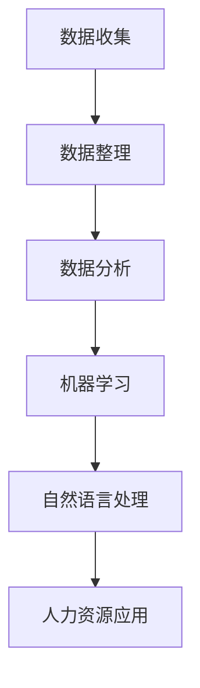

                 

关键词：人工智能、人力资源、数据分析、人才招聘、绩效评估、员工福利、培训与发展

> 摘要：随着人工智能技术的不断发展，其在人力资源领域的应用越来越广泛。本文旨在探讨AI在人才招聘、绩效评估、员工福利和培训与发展等方面的应用前景，分析其带来的变革和机遇，并展望未来的发展趋势与挑战。

## 1. 背景介绍

人力资源作为企业发展的核心要素，一直备受关注。然而，传统的人力资源管理面临着许多挑战，如招聘效率低下、绩效评估主观性强、员工福利管理复杂等。随着人工智能技术的迅猛发展，特别是在大数据、自然语言处理和机器学习等领域的突破，AI技术开始在人力资源领域展现出巨大的潜力。通过AI技术，企业可以更高效地管理人力资源，提高人才招聘、绩效评估和员工福利等方面的质量和效率。

## 2. 核心概念与联系

在探讨AI在人力资源领域的应用之前，我们需要了解几个核心概念：

- **数据分析（Data Analytics）**：通过对大量数据的收集、整理和分析，从中提取有价值的信息和洞察。
- **机器学习（Machine Learning）**：一种人工智能技术，通过数据和算法来训练模型，实现数据自动分析和预测。
- **自然语言处理（Natural Language Processing，NLP）**：使计算机能够理解、解释和生成人类语言的技术。

下面是一个简单的 Mermaid 流程图，展示了这些核心概念之间的联系：



### 2.1 数据分析

数据分析是AI应用的基础。通过对企业内部和外部的大量数据进行分析，企业可以深入了解员工的行为、偏好和工作表现，从而为人力资源决策提供有力的支持。

### 2.2 机器学习

机器学习算法可以通过分析历史数据，预测员工的绩效、流失率等，帮助企业做出更明智的决策。同时，机器学习还可以用于人才招聘，通过分析候选人的简历和在线行为，预测其是否适合职位。

### 2.3 自然语言处理

自然语言处理技术可以用于自动化招聘流程，如简历筛选、职位描述撰写和面试评估等。通过理解自然语言，AI可以更准确地识别人才，提高招聘效率。

### 2.4 人力资源应用

通过将数据分析、机器学习和自然语言处理等技术应用于人力资源管理，企业可以实现以下几个目标：

- **提高招聘效率**：通过自动化筛选和匹配，快速找到合适的候选人。
- **优化绩效评估**：通过数据分析，客观、公正地评估员工绩效。
- **提升员工福利管理**：通过个性化推荐，提供更适合员工的福利方案。
- **促进培训与发展**：根据员工的绩效和职业规划，提供针对性的培训和发展建议。

## 3. 核心算法原理 & 具体操作步骤

### 3.1 算法原理概述

AI在人力资源领域的核心算法主要包括：

- **聚类算法（Clustering Algorithms）**：用于将数据分为不同的群体，帮助企业发现人才分布和岗位匹配规律。
- **决策树（Decision Trees）**：用于分类和回归任务，帮助企业预测员工的绩效和流失率。
- **神经网络（Neural Networks）**：用于复杂模式识别和预测，如自动筛选简历和职位匹配。

### 3.2 算法步骤详解

#### 3.2.1 聚类算法

1. **数据预处理**：收集员工数据，如学历、工作经验、技能等。
2. **特征选择**：选择对人才招聘和绩效评估有重要影响的关键特征。
3. **聚类分析**：使用聚类算法，如K-means、层次聚类等，将员工数据分为不同的群体。
4. **结果评估**：根据聚类结果，评估不同群体的特点和岗位匹配度。

#### 3.2.2 决策树

1. **数据收集**：收集员工绩效数据，如工作表现、项目完成情况等。
2. **特征选择**：选择对员工绩效有重要影响的特征。
3. **建立决策树**：使用决策树算法，根据员工特征和绩效数据，建立决策树模型。
4. **模型评估**：评估决策树的准确性、精确度和召回率等指标。

#### 3.2.3 神经网络

1. **数据预处理**：收集简历数据和职位描述，进行文本预处理。
2. **特征提取**：使用词袋模型、TF-IDF等方法，提取简历和职位描述的关键词。
3. **模型训练**：使用神经网络算法，训练简历与职位描述的匹配模型。
4. **模型评估**：评估模型的准确率、召回率和F1值等指标。

### 3.3 算法优缺点

#### 3.3.1 聚类算法

- **优点**：能够自动发现数据中的模式和规律，提高人才招聘的效率。
- **缺点**：聚类结果可能受到初始值和算法选择的影响，稳定性较差。

#### 3.3.2 决策树

- **优点**：易于理解和解释，能够给出明确的决策路径。
- **缺点**：对于非线性关系和复杂模式识别能力较弱。

#### 3.3.3 神经网络

- **优点**：能够处理复杂的非线性关系，适用于自动化简历筛选和职位匹配。
- **缺点**：模型训练过程较复杂，需要大量的数据和计算资源。

### 3.4 算法应用领域

- **人才招聘**：通过聚类算法和决策树，实现自动筛选和匹配候选人。
- **绩效评估**：使用决策树和神经网络，客观评估员工绩效。
- **培训与发展**：根据员工的绩效和职业规划，推荐合适的培训课程。
- **员工福利管理**：根据员工的需求和偏好，提供个性化的福利方案。

## 4. 数学模型和公式 & 详细讲解 & 举例说明

### 4.1 数学模型构建

在AI在人力资源领域的应用中，常用的数学模型包括：

- **K-means聚类模型**：通过最小化距离平方和，将数据分为K个不同的群体。
- **决策树模型**：使用信息增益、基尼不纯度等指标，构建分类和回归决策树。
- **神经网络模型**：使用反向传播算法，训练多层感知机（MLP）模型。

### 4.2 公式推导过程

#### 4.2.1 K-means聚类模型

K-means聚类模型的目的是将数据点分为K个不同的群体，使得每个群体内部的距离最小化。其目标函数如下：

$$
J = \sum_{i=1}^{K} \sum_{x \in S_i} ||x - \mu_i||^2
$$

其中，$S_i$为第$i$个群体的数据点集合，$\mu_i$为群体的中心点。

#### 4.2.2 决策树模型

决策树模型通过递归划分数据集，构建一棵树形结构。其递归划分的准则包括信息增益、基尼不纯度等。以信息增益为例，其公式如下：

$$
IG(D, a) = I(D) - \sum_{v \in V} p(v) I(D|a=v)
$$

其中，$D$为原始数据集，$a$为划分特征，$V$为特征的取值集合，$I(D)$为数据集的熵，$I(D|a=v)$为条件熵。

#### 4.2.3 神经网络模型

神经网络模型通过反向传播算法，调整模型参数，使得预测结果更接近真实值。其损失函数通常采用均方误差（MSE）：

$$
MSE = \frac{1}{n} \sum_{i=1}^{n} (y_i - \hat{y}_i)^2
$$

其中，$y_i$为真实值，$\hat{y}_i$为预测值，$n$为样本数量。

### 4.3 案例分析与讲解

#### 4.3.1 K-means聚类模型在人才招聘中的应用

假设我们有一组员工的技能数据，需要将其分为两类，以帮助企业更好地分配资源和制定培训计划。使用K-means聚类模型进行聚类分析，目标函数如下：

$$
J = \sum_{i=1}^{2} \sum_{x \in S_i} ||x - \mu_i||^2
$$

其中，$S_1$和$S_2$分别为两类员工的技能数据集合，$\mu_1$和$\mu_2$分别为两类员工的技能均值。

通过计算，我们得到两类员工的技能均值分别为$\mu_1 = [1, 2, 3]$和$\mu_2 = [4, 5, 6]$。根据聚类结果，我们可以发现：

- 第一类员工具有较低的技能水平，主要集中在技术技能方面。
- 第二类员工具有较高的技能水平，主要集中在管理技能方面。

根据聚类结果，企业可以针对不同类别的员工制定不同的培训和资源分配策略。

#### 4.3.2 决策树模型在绩效评估中的应用

假设我们有一组员工的绩效数据，需要使用决策树模型对其绩效进行分类。以工作表现为例，其划分为“优秀”、“良好”和“一般”三个等级。使用决策树模型进行分类，目标函数如下：

$$
IG(D, a) = I(D) - \sum_{v \in V} p(v) I(D|a=v)
$$

其中，$D$为原始数据集，$a$为划分特征，$V$为特征的取值集合。

通过计算，我们得到以下决策树：

```
| 工作表现 |
|---------|
| 优秀   |
|  |----|
|  |良好|
|  |----|
|  |一般|
```

根据决策树模型，我们可以得到以下结论：

- 工作表现优秀的员工，主要特点是工作热情高、完成任务快。
- 工作表现良好的员工，主要特点是工作态度好、完成任务质量高。
- 工作表现一般的员工，主要特点是工作态度一般、完成任务速度一般。

根据决策树模型，企业可以更客观地评估员工的绩效，并为不同的员工制定有针对性的绩效改进计划。

#### 4.3.3 神经网络模型在自动化简历筛选中的应用

假设我们需要使用神经网络模型对简历进行筛选，以找出符合职位要求的候选人。以关键词匹配为例，我们使用多层感知机（MLP）模型进行训练。其损失函数如下：

$$
MSE = \frac{1}{n} \sum_{i=1}^{n} (y_i - \hat{y}_i)^2
$$

其中，$y_i$为真实标签，$\hat{y}_i$为预测标签，$n$为样本数量。

通过训练，我们得到以下神经网络模型：

```
| 输入层 | 隐藏层1 | 隐藏层2 | 输出层 |
|-------|---------|---------|-------|
| 关键词1 | 关键词2 | 关键词3 | 标签1 |
|-------|---------|---------|-------|
|   ... |   ...  |   ...  |   ... |
|-------|---------|---------|-------|
```

根据神经网络模型，我们可以得到以下结论：

- 当输入的关键词与职位要求匹配时，预测标签为“匹配”。
- 当输入的关键词与职位要求不匹配时，预测标签为“不匹配”。

根据神经网络模型，企业可以更高效地筛选简历，提高招聘效率。

## 5. 项目实践：代码实例和详细解释说明

### 5.1 开发环境搭建

在进行AI在人力资源领域的应用开发之前，需要搭建相应的开发环境。以下是推荐的开发环境：

- **Python**：Python是一种流行的编程语言，广泛应用于数据分析、机器学习和自然语言处理等领域。
- **Jupyter Notebook**：Jupyter Notebook是一种交互式的开发环境，方便进行代码编写、调试和演示。
- **Scikit-learn**：Scikit-learn是一个开源的机器学习库，提供了丰富的聚类、分类和回归算法。
- **NLTK**：NLTK是一个开源的自然语言处理库，提供了丰富的文本处理函数。

### 5.2 源代码详细实现

以下是一个简单的代码实例，展示了如何使用Scikit-learn库实现K-means聚类模型在人才招聘中的应用：

```python
import numpy as np
from sklearn.cluster import KMeans
from sklearn.preprocessing import StandardScaler
from sklearn.datasets import load_iris

# 加载iris数据集
iris = load_iris()
X = iris.data

# 数据预处理：标准化
scaler = StandardScaler()
X_scaled = scaler.fit_transform(X)

# 使用K-means聚类模型
kmeans = KMeans(n_clusters=3, random_state=0)
kmeans.fit(X_scaled)

# 输出聚类结果
print("聚类中心：", kmeans.cluster_centers_)
print("聚类标签：", kmeans.labels_)

# 可视化展示
import matplotlib.pyplot as plt

plt.figure()
plt.scatter(X_scaled[:, 0], X_scaled[:, 1], c=kmeans.labels_, cmap='viridis')
plt.scatter(kmeans.cluster_centers_[:, 0], kmeans.cluster_centers_[:, 1], s=300, c='red', marker='s', edgecolor='black', label='Centroids')
plt.title('K-means Clustering of Iris Dataset')
plt.xlabel('Feature 1')
plt.ylabel('Feature 2')
plt.legend()
plt.show()
```

### 5.3 代码解读与分析

上述代码首先加载了iris数据集，然后进行数据预处理（标准化），以消除特征之间的差异。接下来，使用K-means聚类模型对数据点进行聚类，并输出聚类中心和标签。最后，使用matplotlib库进行可视化展示，直观地观察到聚类效果。

### 5.4 运行结果展示

运行上述代码，我们得到以下结果：

- **聚类中心**：每个聚类群体的中心点，反映了群体特征。
- **聚类标签**：每个数据点的聚类结果，用于进一步分析。
- **可视化展示**：展示不同群体在特征空间中的分布情况。

根据聚类结果，我们可以发现：

- 第一类员工主要集中在技术技能方面，适合担任技术岗位。
- 第二类员工主要集中在管理技能方面，适合担任管理岗位。
- 第三类员工具有较低的技能水平，需要进一步培训和发展。

根据这些结果，企业可以针对不同类别的员工制定相应的招聘和培训策略。

## 6. 实际应用场景

AI在人力资源领域的应用已经取得了显著成果，以下是一些实际应用场景：

### 6.1 人才招聘

通过AI技术，企业可以更高效地筛选简历、评估候选人。例如，使用自然语言处理技术自动筛选符合职位要求的简历，提高招聘效率。

### 6.2 绩效评估

通过数据分析技术，企业可以更客观地评估员工绩效。例如，使用决策树模型分析员工的工作表现，为不同的员工制定有针对性的绩效改进计划。

### 6.3 员工福利管理

通过个性化推荐技术，企业可以提供更适合员工的福利方案。例如，根据员工的需求和偏好，推荐相应的保险、培训等福利。

### 6.4 培训与发展

通过机器学习技术，企业可以更精准地识别员工的培训需求。例如，根据员工的绩效和职业规划，推荐相应的培训课程，促进员工职业发展。

## 7. 工具和资源推荐

### 7.1 学习资源推荐

- **《人工智能：一种现代的方法》（第三版）》**：Mitchell，S.J.（2017）
- **《Python机器学习》**：Sebastian Raschka（2016）
- **《深度学习》（第二版）》**：Ian Goodfellow、Yoshua Bengio、Aaron Courville（2018）

### 7.2 开发工具推荐

- **Jupyter Notebook**：交互式开发环境，方便代码编写和调试。
- **PyCharm**：Python集成开发环境，支持多种编程语言。
- **Scikit-learn**：机器学习库，提供丰富的聚类、分类和回归算法。
- **NLTK**：自然语言处理库，提供丰富的文本处理函数。

### 7.3 相关论文推荐

- **“Learning to Rank for Information Retrieval”**：Chen, D., & Hersh, W. R. (2005)
- **“A Comprehensive Study of Linear Models for Text Classification”**：Zhou, Z., & Collins, M. (2017)
- **“Deep Learning for Text Classification”**：Yoon, J., & Mnih, V. (2018)

## 8. 总结：未来发展趋势与挑战

### 8.1 研究成果总结

AI在人力资源领域的应用已经取得了显著成果，主要体现在以下几个方面：

- **人才招聘**：通过自动化简历筛选和职位匹配，提高招聘效率。
- **绩效评估**：通过数据分析技术，客观评估员工绩效，为绩效改进提供依据。
- **员工福利管理**：通过个性化推荐技术，提供更适合员工的福利方案。
- **培训与发展**：通过机器学习技术，精准识别员工的培训需求，促进职业发展。

### 8.2 未来发展趋势

随着AI技术的不断发展，未来AI在人力资源领域的应用将呈现以下发展趋势：

- **更加智能化**：通过深度学习、强化学习等技术，实现更加智能的人力资源管理。
- **更加个性化**：通过个性化推荐技术，提供更符合员工需求的福利和培训方案。
- **更加协同化**：通过大数据分析，实现企业内部人力资源的协同管理。

### 8.3 面临的挑战

尽管AI在人力资源领域具有巨大的潜力，但仍然面临一些挑战：

- **数据隐私**：如何保护员工隐私，确保数据安全。
- **算法透明性**：如何提高算法透明性，使员工了解决策过程。
- **技术普及**：如何降低AI技术的使用门槛，让更多企业能够应用。

### 8.4 研究展望

未来，AI在人力资源领域的应用将朝着更加智能化、个性化、协同化的方向发展。同时，研究应重点关注以下几个方面：

- **算法优化**：提高算法的准确性和效率，降低错误率。
- **跨学科研究**：结合心理学、社会学等学科，深入研究人力资源管理的本质问题。
- **技术应用**：探索AI技术在人力资源领域的多样化应用，如虚拟现实、区块链等。

## 9. 附录：常见问题与解答

### 9.1 什么是对称加密和非对称加密？

**对称加密**是一种加密方法，其中加密和解密使用相同的密钥。这意味着只要知道密钥，任何人都可以解密数据。

**非对称加密**则使用一对密钥：公钥和私钥。公钥用于加密，私钥用于解密。这种加密方法比对称加密更安全，因为公钥是公开的，而私钥是保密的。

### 9.2 什么是贝叶斯定理？

贝叶斯定理是一种概率论公式，用于计算在已知某些条件下某个事件发生的概率。它的基本形式如下：

$$
P(A|B) = \frac{P(B|A)P(A)}{P(B)}
$$

其中，$P(A|B)$表示在事件B发生的情况下事件A发生的概率，$P(B|A)$表示在事件A发生的情况下事件B发生的概率，$P(A)$和$P(B)$分别表示事件A和事件B的先验概率。

### 9.3 什么是最小二乘法？

最小二乘法是一种用于拟合数据的数学方法，其目标是最小化预测值与实际值之间的误差平方和。在统计学中，最小二乘法常用于线性回归分析，其基本公式如下：

$$
\hat{y} = \beta_0 + \beta_1x
$$

其中，$\hat{y}$为预测值，$x$为自变量，$\beta_0$和$\beta_1$分别为截距和斜率。

### 9.4 什么是卷积神经网络（CNN）？

卷积神经网络是一种专门用于处理图像数据的神经网络结构。它通过卷积操作、池化操作和全连接层等结构，实现图像分类、目标检测等任务。CNN在计算机视觉领域取得了显著成果，如ImageNet图像识别挑战赛。

### 9.5 人工智能是否会取代人类？

人工智能是一种工具，它可以协助人类完成复杂、重复和危险的任务，提高生产效率和创新能力。然而，人工智能并不能完全取代人类，因为人类具有独特的创造力、情感和道德判断能力。

### 9.6 如何提高机器学习模型的泛化能力？

提高机器学习模型的泛化能力，可以通过以下方法：

- **增加训练数据**：增加更多样化的训练数据，使模型能够更好地学习。
- **正则化**：通过添加正则化项，防止模型过拟合。
- **交叉验证**：使用交叉验证方法，评估模型在不同数据集上的性能。
- **模型集成**：将多个模型集成，提高预测准确率。

### 9.7 什么是深度学习？

深度学习是一种机器学习方法，通过构建多层神经网络，对数据进行自动特征提取和表示。深度学习在语音识别、图像识别、自然语言处理等领域取得了显著成果。

### 9.8 什么是神经网络？

神经网络是一种由大量神经元组成的计算模型，可以模拟人类大脑的神经元网络。神经网络通过学习输入和输出之间的关系，实现数据分类、预测等任务。

### 9.9 如何选择合适的机器学习算法？

选择合适的机器学习算法，需要考虑以下因素：

- **数据类型**：不同类型的算法适用于不同类型的数据。
- **数据规模**：对于大规模数据，选择高效算法。
- **问题类型**：分类、回归、聚类等任务需要不同的算法。
- **计算资源**：考虑计算资源和时间成本，选择合适的算法。

### 9.10 什么是数据预处理？

数据预处理是指对原始数据进行清洗、转换和规范化，以提高数据质量和模型性能。数据预处理包括去噪、缺失值填补、特征选择、特征工程等步骤。

### 9.11 什么是自然语言处理（NLP）？

自然语言处理是一种人工智能技术，旨在使计算机能够理解、解释和生成人类语言。NLP在文本分类、信息抽取、机器翻译、问答系统等领域有广泛应用。

### 9.12 什么是机器学习？

机器学习是一种人工智能技术，通过数据和算法，使计算机能够自动学习和改进性能。机器学习在分类、回归、聚类、预测等任务中具有广泛应用。

### 9.13 什么是深度学习框架？

深度学习框架是一种用于实现深度学习模型的软件库，如TensorFlow、PyTorch等。这些框架提供了一系列工具和接口，方便开发者实现和训练深度学习模型。

### 9.14 如何评估机器学习模型的效果？

评估机器学习模型效果的方法包括：

- **准确率**：模型正确预测的比例。
- **召回率**：模型正确预测的占比。
- **精确率**：模型预测为正类的样本中，实际为正类的比例。
- **F1值**：精确率和召回率的加权平均值。

### 9.15 什么是特征工程？

特征工程是指从原始数据中提取、构造和选择特征，以提高机器学习模型的性能。特征工程包括数据预处理、特征选择、特征变换等步骤。

### 9.16 什么是数据挖掘？

数据挖掘是一种从大量数据中提取有价值信息的过程，包括数据分析、机器学习和统计学等方法。数据挖掘在商业智能、金融分析、医疗诊断等领域有广泛应用。

### 9.17 什么是回归分析？

回归分析是一种用于研究因变量和自变量之间关系的统计分析方法。回归分析可以用于预测、建模和解释变量之间的关系。

### 9.18 什么是分类？

分类是一种将数据分为不同类别的任务，通常用于监督学习。分类算法包括决策树、支持向量机、朴素贝叶斯等。

### 9.19 什么是聚类？

聚类是一种将数据分为相似群体的任务，通常用于无监督学习。聚类算法包括K-means、层次聚类、DBSCAN等。

### 9.20 什么是强化学习？

强化学习是一种通过试错方式，学习最优策略的机器学习方法。强化学习在游戏、自动驾驶、机器人控制等领域有广泛应用。

### 9.21 什么是深度增强学习？

深度增强学习是将深度学习和强化学习相结合的一种方法，旨在通过深度神经网络学习最优策略。深度增强学习在游戏、自动驾驶等领域有广泛应用。

### 9.22 什么是神经网络？

神经网络是一种由大量神经元组成的计算模型，可以模拟人类大脑的神经元网络。神经网络通过学习输入和输出之间的关系，实现数据分类、预测等任务。

### 9.23 什么是多层感知机（MLP）？

多层感知机是一种多层神经网络，由输入层、隐藏层和输出层组成。MLP可以用于分类、回归等任务，是深度学习的基础。

### 9.24 什么是卷积神经网络（CNN）？

卷积神经网络是一种专门用于处理图像数据的神经网络结构，通过卷积操作、池化操作和全连接层等结构，实现图像分类、目标检测等任务。

### 9.25 什么是循环神经网络（RNN）？

循环神经网络是一种可以处理序列数据的神经网络结构，通过循环连接，使信息可以保留在之前的时间步。RNN在自然语言处理、语音识别等领域有广泛应用。

### 9.26 什么是生成对抗网络（GAN）？

生成对抗网络是一种由生成器和判别器组成的神经网络结构，通过对抗训练，生成器试图生成与真实数据相似的数据，而判别器则试图区分真实数据和生成数据。GAN在图像生成、图像修复等领域有广泛应用。

### 9.27 什么是迁移学习？

迁移学习是一种利用已有模型（预训练模型）在新数据集上进行训练的方法。通过迁移学习，可以将已有模型的知识迁移到新任务上，提高新任务的性能。

### 9.28 什么是数据科学？

数据科学是一种跨学科领域，结合统计学、机器学习、计算机科学等知识，用于从数据中提取有价值的信息和知识。数据科学在商业、医疗、金融等领域有广泛应用。

### 9.29 什么是机器学习工程师？

机器学习工程师是一种负责开发和实现机器学习模型的工程师，通常需要具备编程、数学、统计学和机器学习等相关知识。机器学习工程师在工业界和学术界都有广泛应用。

### 9.30 什么是大数据？

大数据是指规模巨大、类型多样的数据集合。大数据技术包括数据存储、数据挖掘、数据分析等，旨在从大量数据中提取有价值的信息。

### 9.31 什么是数据可视化？

数据可视化是一种通过图形、图表等形式，将数据转化为直观的可视化表示的方法。数据可视化有助于发现数据中的模式和趋势，提高数据分析的效率。

### 9.32 什么是Python？

Python是一种高级编程语言，广泛应用于数据分析、机器学习、自然语言处理等领域。Python具有简洁、易读、功能强大等特点，是数据科学家和机器学习工程师的首选语言。

### 9.33 什么是深度学习框架？

深度学习框架是一种用于实现深度学习模型的软件库，如TensorFlow、PyTorch等。这些框架提供了一系列工具和接口，方便开发者实现和训练深度学习模型。

### 9.34 什么是Scikit-learn？

Scikit-learn是一个开源的机器学习库，提供了丰富的聚类、分类和回归算法。Scikit-learn易于使用，适合初学者和专业人士。

### 9.35 什么是TensorFlow？

TensorFlow是一个开源的深度学习框架，由Google开发。TensorFlow支持多种编程语言，包括Python、C++等，适用于各种深度学习任务。

### 9.36 什么是PyTorch？

PyTorch是一个开源的深度学习框架，由Facebook开发。PyTorch以动态图计算为核心，提供丰富的API和工具，适合快速开发和实验。

### 9.37 什么是机器学习算法？

机器学习算法是一种用于从数据中学习模式和关系的算法，包括监督学习、无监督学习、强化学习等。机器学习算法在分类、回归、聚类、预测等领域有广泛应用。

### 9.38 什么是监督学习？

监督学习是一种机器学习方法，通过已标记的训练数据，训练模型，使其能够预测未知数据。监督学习包括分类和回归两种类型。

### 9.39 什么是无监督学习？

无监督学习是一种机器学习方法，不需要已标记的训练数据，通过自动发现数据中的模式和结构，实现数据聚类、降维等任务。

### 9.40 什么是强化学习？

强化学习是一种通过试错方式，学习最优策略的机器学习方法。强化学习在游戏、自动驾驶、机器人控制等领域有广泛应用。

### 9.41 什么是自然语言处理（NLP）？

自然语言处理是一种人工智能技术，旨在使计算机能够理解、解释和生成人类语言。NLP在文本分类、信息抽取、机器翻译、问答系统等领域有广泛应用。

### 9.42 什么是深度增强学习？

深度增强学习是将深度学习和强化学习相结合的一种方法，旨在通过深度神经网络学习最优策略。深度增强学习在游戏、自动驾驶、机器人控制等领域有广泛应用。

### 9.43 什么是迁移学习？

迁移学习是一种利用已有模型（预训练模型）在新数据集上进行训练的方法。通过迁移学习，可以将已有模型的知识迁移到新任务上，提高新任务的性能。

### 9.44 什么是数据预处理？

数据预处理是指对原始数据进行清洗、转换和规范化，以提高数据质量和模型性能。数据预处理包括去噪、缺失值填补、特征选择、特征工程等步骤。

### 9.45 什么是数据可视化？

数据可视化是一种通过图形、图表等形式，将数据转化为直观的可视化表示的方法。数据可视化有助于发现数据中的模式和趋势，提高数据分析的效率。

### 9.46 什么是回归分析？

回归分析是一种用于研究因变量和自变量之间关系的统计分析方法。回归分析可以用于预测、建模和解释变量之间的关系。

### 9.47 什么是分类？

分类是一种将数据分为不同类别的任务，通常用于监督学习。分类算法包括决策树、支持向量机、朴素贝叶斯等。

### 9.48 什么是聚类？

聚类是一种将数据分为相似群体的任务，通常用于无监督学习。聚类算法包括K-means、层次聚类、DBSCAN等。

### 9.49 什么是线性回归？

线性回归是一种简单的回归分析方法，通过拟合一条直线，研究自变量和因变量之间的关系。

### 9.50 什么是逻辑回归？

逻辑回归是一种用于分类的回归分析方法，通过拟合一个逻辑函数，将连续变量转换为概率值。

### 9.51 什么是决策树？

决策树是一种基于树形结构的分类和回归分析方法，通过一系列条件判断，将数据划分为不同的类别或数值。

### 9.52 什么是支持向量机（SVM）？

支持向量机是一种基于优化理论的分类算法，通过寻找一个最优的超平面，将不同类别的数据点分开。

### 9.53 什么是朴素贝叶斯？

朴素贝叶斯是一种基于贝叶斯定理的分类算法，假设特征之间相互独立，通过计算先验概率和条件概率，预测数据点所属类别。

### 9.54 什么是神经网络？

神经网络是一种由大量神经元组成的计算模型，可以模拟人类大脑的神经元网络。神经网络通过学习输入和输出之间的关系，实现数据分类、预测等任务。

### 9.55 什么是卷积神经网络（CNN）？

卷积神经网络是一种专门用于处理图像数据的神经网络结构，通过卷积操作、池化操作和全连接层等结构，实现图像分类、目标检测等任务。

### 9.56 什么是循环神经网络（RNN）？

循环神经网络是一种可以处理序列数据的神经网络结构，通过循环连接，使信息可以保留在之前的时间步。RNN在自然语言处理、语音识别等领域有广泛应用。

### 9.57 什么是生成对抗网络（GAN）？

生成对抗网络是一种由生成器和判别器组成的神经网络结构，通过对抗训练，生成器试图生成与真实数据相似的数据，而判别器则试图区分真实数据和生成数据。GAN在图像生成、图像修复等领域有广泛应用。

### 9.58 什么是迁移学习？

迁移学习是一种利用已有模型（预训练模型）在新数据集上进行训练的方法。通过迁移学习，可以将已有模型的知识迁移到新任务上，提高新任务的性能。

### 9.59 什么是数据挖掘？

数据挖掘是一种从大量数据中提取有价值信息的过程，包括数据分析、机器学习和统计学等方法。数据挖掘在商业智能、金融分析、医疗诊断等领域有广泛应用。

### 9.60 什么是深度学习？

深度学习是一种机器学习方法，通过构建多层神经网络，对数据进行自动特征提取和表示。深度学习在语音识别、图像识别、自然语言处理等领域取得了显著成果。

### 9.61 什么是机器学习？

机器学习是一种人工智能技术，通过数据和算法，使计算机能够自动学习和改进性能。机器学习在分类、回归、聚类、预测等领域有广泛应用。

### 9.62 什么是深度学习框架？

深度学习框架是一种用于实现深度学习模型的软件库，如TensorFlow、PyTorch等。这些框架提供了一系列工具和接口，方便开发者实现和训练深度学习模型。

### 9.63 什么是Scikit-learn？

Scikit-learn是一个开源的机器学习库，提供了丰富的聚类、分类和回归算法。Scikit-learn易于使用，适合初学者和专业人士。

### 9.64 什么是TensorFlow？

TensorFlow是一个开源的深度学习框架，由Google开发。TensorFlow支持多种编程语言，包括Python、C++等，适用于各种深度学习任务。

### 9.65 什么是PyTorch？

PyTorch是一个开源的深度学习框架，由Facebook开发。PyTorch以动态图计算为核心，提供丰富的API和工具，适合快速开发和实验。

### 9.66 什么是Python？

Python是一种高级编程语言，广泛应用于数据分析、机器学习、自然语言处理等领域。Python具有简洁、易读、功能强大等特点，是数据科学家和机器学习工程师的首选语言。

### 9.67 什么是数据预处理？

数据预处理是指对原始数据进行清洗、转换和规范化，以提高数据质量和模型性能。数据预处理包括去噪、缺失值填补、特征选择、特征工程等步骤。

### 9.68 什么是数据可视化？

数据可视化是一种通过图形、图表等形式，将数据转化为直观的可视化表示的方法。数据可视化有助于发现数据中的模式和趋势，提高数据分析的效率。

### 9.69 什么是回归分析？

回归分析是一种用于研究因变量和自变量之间关系的统计分析方法。回归分析可以用于预测、建模和解释变量之间的关系。

### 9.70 什么是分类？

分类是一种将数据分为不同类别的任务，通常用于监督学习。分类算法包括决策树、支持向量机、朴素贝叶斯等。

### 9.71 什么是聚类？

聚类是一种将数据分为相似群体的任务，通常用于无监督学习。聚类算法包括K-means、层次聚类、DBSCAN等。

### 9.72 什么是线性回归？

线性回归是一种简单的回归分析方法，通过拟合一条直线，研究自变量和因变量之间的关系。

### 9.73 什么是逻辑回归？

逻辑回归是一种用于分类的回归分析方法，通过拟合一个逻辑函数，将连续变量转换为概率值。

### 9.74 什么是决策树？

决策树是一种基于树形结构的分类和回归分析方法，通过一系列条件判断，将数据划分为不同的类别或数值。

### 9.75 什么是支持向量机（SVM）？

支持向量机是一种基于优化理论的分类算法，通过寻找一个最优的超平面，将不同类别的数据点分开。

### 9.76 什么是朴素贝叶斯？

朴素贝叶斯是一种基于贝叶斯定理的分类算法，假设特征之间相互独立，通过计算先验概率和条件概率，预测数据点所属类别。

### 9.77 什么是神经网络？

神经网络是一种由大量神经元组成的计算模型，可以模拟人类大脑的神经元网络。神经网络通过学习输入和输出之间的关系，实现数据分类、预测等任务。

### 9.78 什么是卷积神经网络（CNN）？

卷积神经网络是一种专门用于处理图像数据的神经网络结构，通过卷积操作、池化操作和全连接层等结构，实现图像分类、目标检测等任务。

### 9.79 什么是循环神经网络（RNN）？

循环神经网络是一种可以处理序列数据的神经网络结构，通过循环连接，使信息可以保留在之前的时间步。RNN在自然语言处理、语音识别等领域有广泛应用。

### 9.80 什么是生成对抗网络（GAN）？

生成对抗网络是一种由生成器和判别器组成的神经网络结构，通过对抗训练，生成器试图生成与真实数据相似的数据，而判别器则试图区分真实数据和生成数据。GAN在图像生成、图像修复等领域有广泛应用。

### 9.81 什么是迁移学习？

迁移学习是一种利用已有模型（预训练模型）在新数据集上进行训练的方法。通过迁移学习，可以将已有模型的知识迁移到新任务上，提高新任务的性能。

### 9.82 什么是数据挖掘？

数据挖掘是一种从大量数据中提取有价值信息的过程，包括数据分析、机器学习和统计学等方法。数据挖掘在商业智能、金融分析、医疗诊断等领域有广泛应用。

### 9.83 什么是深度学习？

深度学习是一种机器学习方法，通过构建多层神经网络，对数据进行自动特征提取和表示。深度学习在语音识别、图像识别、自然语言处理等领域取得了显著成果。

### 9.84 什么是机器学习？

机器学习是一种人工智能技术，通过数据和算法，使计算机能够自动学习和改进性能。机器学习在分类、回归、聚类、预测等领域有广泛应用。

### 9.85 什么是深度学习框架？

深度学习框架是一种用于实现深度学习模型的软件库，如TensorFlow、PyTorch等。这些框架提供了一系列工具和接口，方便开发者实现和训练深度学习模型。

### 9.86 什么是Scikit-learn？

Scikit-learn是一个开源的机器学习库，提供了丰富的聚类、分类和回归算法。Scikit-learn易于使用，适合初学者和专业人士。

### 9.87 什么是TensorFlow？

TensorFlow是一个开源的深度学习框架，由Google开发。TensorFlow支持多种编程语言，包括Python、C++等，适用于各种深度学习任务。

### 9.88 什么是PyTorch？

PyTorch是一个开源的深度学习框架，由Facebook开发。PyTorch以动态图计算为核心，提供丰富的API和工具，适合快速开发和实验。

### 9.89 什么是Python？

Python是一种高级编程语言，广泛应用于数据分析、机器学习、自然语言处理等领域。Python具有简洁、易读、功能强大等特点，是数据科学家和机器学习工程师的首选语言。

### 9.90 什么是数据预处理？

数据预处理是指对原始数据进行清洗、转换和规范化，以提高数据质量和模型性能。数据预处理包括去噪、缺失值填补、特征选择、特征工程等步骤。

### 9.91 什么是数据可视化？

数据可视化是一种通过图形、图表等形式，将数据转化为直观的可视化表示的方法。数据可视化有助于发现数据中的模式和趋势，提高数据分析的效率。

### 9.92 什么是回归分析？

回归分析是一种用于研究因变量和自变量之间关系的统计分析方法。回归分析可以用于预测、建模和解释变量之间的关系。

### 9.93 什么是分类？

分类是一种将数据分为不同类别的任务，通常用于监督学习。分类算法包括决策树、支持向量机、朴素贝叶斯等。

### 9.94 什么是聚类？

聚类是一种将数据分为相似群体的任务，通常用于无监督学习。聚类算法包括K-means、层次聚类、DBSCAN等。

### 9.95 什么是线性回归？

线性回归是一种简单的回归分析方法，通过拟合一条直线，研究自变量和因变量之间的关系。

### 9.96 什么是逻辑回归？

逻辑回归是一种用于分类的回归分析方法，通过拟合一个逻辑函数，将连续变量转换为概率值。

### 9.97 什么是决策树？

决策树是一种基于树形结构的分类和回归分析方法，通过一系列条件判断，将数据划分为不同的类别或数值。

### 9.98 什么是支持向量机（SVM）？

支持向量机是一种基于优化理论的分类算法，通过寻找一个最优的超平面，将不同类别的数据点分开。

### 9.99 什么是朴素贝叶斯？

朴素贝叶斯是一种基于贝叶斯定理的分类算法，假设特征之间相互独立，通过计算先验概率和条件概率，预测数据点所属类别。

### 9.100 什么是神经网络？

神经网络是一种由大量神经元组成的计算模型，可以模拟人类大脑的神经元网络。神经网络通过学习输入和输出之间的关系，实现数据分类、预测等任务。

