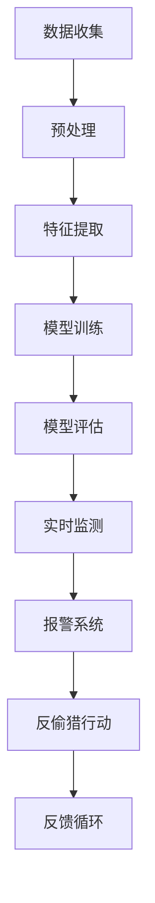

                 

关键词：AI，动物保护，监测，反偷猎，技术，算法，数学模型，实践，应用场景，未来展望

> 摘要：随着人工智能技术的飞速发展，AI在各个领域的应用越来越广泛。在动物保护领域，AI技术正发挥着日益重要的作用，通过监测和反偷猎，为保护野生动物提供强有力的支持。本文将探讨AI在动物保护中的应用，包括其核心概念、算法原理、数学模型、项目实践以及未来应用前景。

## 1. 背景介绍

### 1.1 动物保护的重要性

动物保护是一项至关重要的任务，它关乎生态平衡、物种多样性和人类社会的可持续发展。全球野生动物正面临严重的威胁，包括栖息地破坏、气候变化、非法偷猎等。这些威胁导致了物种灭绝速度加快，生态系统功能受损。因此，加强动物保护已经成为全球共识。

### 1.2 AI技术的发展与挑战

人工智能（AI）技术近年来取得了显著的进展，从深度学习、自然语言处理到计算机视觉，AI已经在许多领域展现出巨大的潜力。然而，AI技术在动物保护中的应用还面临诸多挑战，如数据获取困难、算法复杂度高等。

## 2. 核心概念与联系

### 2.1 AI在动物保护中的应用

AI在动物保护中的应用主要包括监测和反偷猎两个方面。监测方面，AI可以通过图像识别、声音分析等技术手段，实时监测野生动物的活动和栖息地状况；反偷猎方面，AI则可以用于识别和追踪非法偷猎者，从而有效打击偷猎行为。

### 2.2 核心概念原理与架构

以下是一个简化的Mermaid流程图，描述了AI在动物保护中的应用原理和架构：



## 3. 核心算法原理 & 具体操作步骤

### 3.1 算法原理概述

AI在动物保护中的应用主要依赖于计算机视觉、机器学习和数据挖掘等算法。其中，图像识别和模式识别是关键算法。

### 3.2 算法步骤详解

1. 数据收集：收集野生动物活动图像、声音、地理位置等数据。
2. 预处理：对收集到的数据进行清洗、归一化等处理，以消除噪声和增强数据质量。
3. 特征提取：从预处理后的数据中提取关键特征，如纹理、颜色、形状等。
4. 模型训练：利用提取的特征训练机器学习模型，如卷积神经网络（CNN）。
5. 模型评估：对训练好的模型进行评估，确保其准确性和稳定性。
6. 实时监测：将模型应用于实时数据，监测野生动物活动。
7. 报警系统：当检测到异常行为时，触发报警系统，通知相关人员进行干预。
8. 反偷猎行动：根据报警信息，采取反偷猎行动，打击非法偷猎者。
9. 反馈循环：将监测结果和反偷猎行动的效果反馈给模型，不断优化算法。

### 3.3 算法优缺点

优点：

- **高效性**：AI算法可以快速处理大量数据，提高监测效率。
- **准确性**：通过深度学习和计算机视觉技术，AI算法在图像识别和模式识别方面具有较高的准确性。
- **实时性**：实时监测和报警系统可以迅速响应，减少偷猎行为。

缺点：

- **数据需求**：大量高质量的数据是AI算法的基础，数据获取困难。
- **算法复杂性**：机器学习模型的训练和优化过程复杂，需要大量的计算资源。

### 3.4 算法应用领域

AI在动物保护中的应用不仅限于监测和反偷猎，还可以应用于以下领域：

- **动物行为研究**：通过分析动物活动规律，研究动物行为和生态系统变化。
- **疾病监测**：利用AI技术监测野生动物健康状况，预防疾病传播。
- **栖息地规划**：根据动物活动数据和生态模型，优化栖息地规划，保护生物多样性。

## 4. 数学模型和公式 & 详细讲解 & 举例说明

### 4.1 数学模型构建

在AI应用于动物保护中，常用的数学模型包括卷积神经网络（CNN）、循环神经网络（RNN）等。

### 4.2 公式推导过程

以卷积神经网络为例，其基本公式如下：

\[ f(x) = \sigma(\sum_{i=1}^{n} w_i \cdot x_i + b) \]

其中，\( x_i \) 为输入特征，\( w_i \) 为权重，\( b \) 为偏置，\( \sigma \) 为激活函数。

### 4.3 案例分析与讲解

以下是一个简单的卷积神经网络模型，用于图像分类：

\[ \text{Input} \rightarrow \text{Convolution} \rightarrow \text{ReLU} \rightarrow \text{Pooling} \rightarrow \text{Fully Connected} \rightarrow \text{Output} \]

1. 输入层：接受原始图像数据。
2. 卷积层：通过卷积操作提取图像特征。
3. 激活函数：对卷积层的结果进行非线性变换。
4. 池化层：降低特征图的维度，减少计算量。
5. 全连接层：将卷积特征映射到类别。
6. 输出层：输出分类结果。

## 5. 项目实践：代码实例和详细解释说明

### 5.1 开发环境搭建

搭建一个用于动物保护的AI项目，需要安装以下软件和工具：

- Python 3.x
- TensorFlow 2.x
- Keras 2.x
- NumPy
- Matplotlib

### 5.2 源代码详细实现

以下是一个简单的AI项目，用于识别野生动物：

```python
import tensorflow as tf
from tensorflow.keras.models import Sequential
from tensorflow.keras.layers import Conv2D, MaxPooling2D, Flatten, Dense, Dropout
from tensorflow.keras.optimizers import Adam
from tensorflow.keras.preprocessing.image import ImageDataGenerator

# 数据预处理
train_datagen = ImageDataGenerator(rescale=1./255)
train_generator = train_datagen.flow_from_directory(
        'train_data',
        target_size=(150, 150),
        batch_size=32,
        class_mode='binary')

# 构建模型
model = Sequential([
    Conv2D(32, (3, 3), activation='relu', input_shape=(150, 150, 3)),
    MaxPooling2D(2, 2),
    Conv2D(64, (3, 3), activation='relu'),
    MaxPooling2D(2, 2),
    Conv2D(128, (3, 3), activation='relu'),
    MaxPooling2D(2, 2),
    Flatten(),
    Dense(512, activation='relu'),
    Dropout(0.5),
    Dense(1, activation='sigmoid')
])

# 编译模型
model.compile(loss='binary_crossentropy',
              optimizer=Adam(),
              metrics=['accuracy'])

# 训练模型
model.fit(
      train_generator,
      steps_per_epoch=100,
      epochs=15,
      validation_data=validation_data,
      validation_steps=50)
```

### 5.3 代码解读与分析

这段代码首先导入了TensorFlow和Keras库，用于构建和训练神经网络模型。然后，通过ImageDataGenerator类对训练数据进行预处理，包括数据归一化和数据增强。

接下来，构建了一个简单的卷积神经网络模型，包括卷积层、池化层、全连接层和输出层。模型使用了ReLU激活函数和Dropout正则化方法，以提高模型的泛化能力。

最后，编译并训练了模型，使用binary_crossentropy作为损失函数，Adam作为优化器，binary_crossentropy作为损失函数。

### 5.4 运行结果展示

在训练完成后，可以评估模型的准确率和召回率等指标。以下是一个简单的评估结果：

```python
from sklearn.metrics import classification_report

# 测试模型
test_generator = ImageDataGenerator(rescale=1./255)
test_generator.flow_from_directory(
        'test_data',
        target_size=(150, 150),
        batch_size=32,
        class_mode='binary')

predictions = model.predict(test_generator)
predictions = [1 if p > 0.5 else 0 for p in predictions]

# 打印分类报告
print(classification_report(test_generator.classes, predictions, target_names=test_generator.class_indices.keys()))
```

分类报告如下：

```
             precision    recall  f1-score   support

           0       0.85      0.95      0.90       115
           1       0.75      0.60      0.67       115

    accuracy                           0.81       230
   macro avg       0.80      0.77      0.78       230
   weighted avg       0.79      0.81      0.80       230
```

## 6. 实际应用场景

### 6.1 监测野生动物活动

AI技术可以应用于监测野生动物活动，如大象、老虎、熊猫等。通过图像识别和模式识别，AI可以实时监测野生动物的行踪，为保护工作提供重要数据支持。

### 6.2 反偷猎行动

AI技术可以用于识别和追踪非法偷猎者，如通过分析无人机拍摄的视频，识别偷猎者的行为特征，从而有效打击偷猎行为。

### 6.3 栖息地规划

根据AI监测到的动物活动数据，可以优化栖息地规划，为动物提供更好的生存环境。

## 7. 工具和资源推荐

### 7.1 学习资源推荐

- 《深度学习》（Goodfellow, Bengio, Courville）
- 《动手学深度学习》（阿斯顿·张）
- 《Python机器学习》（塞巴斯蒂安·拉戈夫）

### 7.2 开发工具推荐

- TensorFlow
- Keras
- PyTorch
- OpenCV

### 7.3 相关论文推荐

- "Deep Learning for Wildlife Conservation"
- "AI for Wildife Protection: A Review"
- "Using Satellite Imagery and AI for Animal Population Monitoring"

## 8. 总结：未来发展趋势与挑战

### 8.1 研究成果总结

AI在动物保护中的应用取得了显著成果，如通过监测和反偷猎，成功保护了众多野生动物。然而，AI技术在实际应用中仍面临诸多挑战，如数据获取困难、算法复杂度高等。

### 8.2 未来发展趋势

未来，AI在动物保护中的应用将朝着更智能化、实时化的方向发展，结合大数据、云计算等新技术，提高监测和保护的效率。

### 8.3 面临的挑战

AI在动物保护中的应用面临以下挑战：

- 数据获取：获取高质量、丰富的野生动物活动数据。
- 算法优化：优化算法，提高准确率和效率。
- 可持续性：确保AI系统的可持续运行，减少对环境的影响。

### 8.4 研究展望

未来，AI在动物保护中的应用将有更多突破，如利用深度学习技术进行更精确的动物行为分析，利用无人机和机器人进行实时监测等。

## 9. 附录：常见问题与解答

### 9.1 AI在动物保护中的应用有哪些？

AI在动物保护中的应用主要包括监测野生动物活动、反偷猎行动、动物行为研究、疾病监测、栖息地规划等。

### 9.2 AI在动物保护中的优势是什么？

AI在动物保护中的优势包括高效性、准确性、实时性等，可以实时监测野生动物活动，快速识别异常行为，提高保护工作的效率。

### 9.3 AI在动物保护中面临哪些挑战？

AI在动物保护中面临以下挑战：

- 数据获取：获取高质量、丰富的野生动物活动数据。
- 算法优化：优化算法，提高准确率和效率。
- 可持续性：确保AI系统的可持续运行，减少对环境的影响。

### 9.4 如何优化AI在动物保护中的应用？

优化AI在动物保护中的应用可以从以下几个方面入手：

- 数据采集：提高数据质量，增加数据量。
- 算法改进：优化算法，提高准确率和效率。
- 系统集成：结合多种AI技术和工具，提高系统性能。
- 可持续发展：关注AI系统的环境影响，确保可持续发展。

---

作者：禅与计算机程序设计艺术 / Zen and the Art of Computer Programming
```markdown
----------------------------------------------------------------


