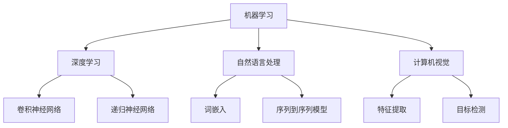

                 

关键词：人工智能、实际应用、技术领域、未来展望、开发工具、资源推荐

> 摘要：本文旨在探讨人工智能（AI）在各个领域中的实际应用，从核心技术、数学模型到项目实践，再到未来发展趋势和面临的挑战，全面剖析AI如何改变我们的世界。本文分为八个部分，详细介绍了AI的应用现状、发展历程、核心算法、数学模型、项目实践以及未来展望。

## 1. 背景介绍

人工智能（Artificial Intelligence，简称AI）是计算机科学的一个分支，旨在创建能够模拟、延伸和扩展人类智能的理论、算法和应用。自20世纪50年代以来，AI经历了多个发展阶段，从最初的规则推理系统到基于大数据和机器学习的现代人工智能，AI技术已经取得了显著进步。如今，AI在医疗、金融、交通、教育等多个领域都有着广泛的应用。

### 1.1 AI的发展历程

- **1956年**：达特茅斯会议，人工智能正式成为研究课题。
- **1980年代**：专家系统的兴起，如MYCIN和DENDRAL。
- **1990年代**：机器学习开始受到关注，如支持向量机和神经网络。
- **2000年代**：深度学习崛起，以AlexNet为代表。
- **2010年代至今**：AI技术广泛应用于各个领域，如自动驾驶、语音识别、图像处理等。

### 1.2 AI的核心技术

- **机器学习**：通过数据训练模型，使其能够从数据中学习并做出预测或决策。
- **深度学习**：基于多层神经网络的结构，能够处理大规模数据并提取特征。
- **自然语言处理**：使计算机能够理解和生成自然语言。
- **计算机视觉**：使计算机能够理解并解析图像和视频。

## 2. 核心概念与联系

以下是AI的核心概念原理和架构的Mermaid流程图：



## 3. 核心算法原理 & 具体操作步骤

### 3.1 算法原理概述

AI的核心算法主要包括机器学习算法、深度学习算法等。以下是一些常见算法的概述：

- **线性回归**：通过最小二乘法拟合一条直线，用以预测连续值。
- **决策树**：利用一系列规则对数据集进行划分，每个节点代表一个特征，每个分支代表一个特征值。
- **支持向量机**：通过找到一个最佳的超平面，将不同类别的数据分开。
- **卷积神经网络**（CNN）：通过卷积操作提取图像特征，适用于图像识别和图像生成。
- **递归神经网络**（RNN）：适用于序列数据处理，如语言建模和时间序列预测。

### 3.2 算法步骤详解

#### 3.2.1 线性回归

1. **数据预处理**：标准化输入数据。
2. **模型构建**：创建线性模型，参数为\( w \)和\( b \)。
3. **训练**：使用最小二乘法计算\( w \)和\( b \)。
4. **预测**：使用训练好的模型进行预测。

#### 3.2.2 决策树

1. **数据预处理**：对数据进行编码和归一化。
2. **特征选择**：计算每个特征的增益，选择最优特征。
3. **递归划分**：对数据集进行划分，直到满足停止条件。
4. **模型构建**：将所有数据分配到叶子节点。

#### 3.2.3 支持向量机

1. **数据预处理**：标准化输入数据。
2. **模型构建**：计算最优超平面，参数为\( w \)和\( b \)。
3. **训练**：使用支持向量计算\( w \)和\( b \)。
4. **预测**：使用训练好的模型进行预测。

#### 3.2.4 卷积神经网络

1. **数据预处理**：标准化输入数据。
2. **模型构建**：创建卷积层、池化层和全连接层。
3. **训练**：使用反向传播算法更新模型参数。
4. **预测**：使用训练好的模型进行预测。

#### 3.2.5 递归神经网络

1. **数据预处理**：标准化输入数据。
2. **模型构建**：创建RNN层。
3. **训练**：使用梯度下降优化模型参数。
4. **预测**：使用训练好的模型进行预测。

### 3.3 算法优缺点

- **线性回归**：简单、易于实现，但拟合能力有限。
- **决策树**：解释性较强，但容易过拟合。
- **支持向量机**：理论成熟、准确度高，但计算复杂度较高。
- **卷积神经网络**：适用于图像处理，但模型参数量巨大。
- **递归神经网络**：适用于序列数据，但难以处理长序列。

### 3.4 算法应用领域

- **线性回归**：适用于金融预测、医学诊断等领域。
- **决策树**：适用于分类问题，如市场细分。
- **支持向量机**：适用于文本分类、图像识别等领域。
- **卷积神经网络**：适用于图像识别、图像生成等领域。
- **递归神经网络**：适用于语音识别、语言翻译等领域。

## 4. 数学模型和公式 & 详细讲解 & 举例说明

### 4.1 数学模型构建

在AI中，数学模型至关重要。以下是一些常见数学模型的构建方法：

#### 4.1.1 线性回归模型

假设输入数据为\( x \)，目标数据为\( y \)，线性回归模型可以表示为：

\[ y = wx + b + \epsilon \]

其中，\( \epsilon \)为误差项。

#### 4.1.2 决策树模型

决策树模型由一系列规则构成，每个节点代表一个特征，每个分支代表一个特征值。假设有\( n \)个特征，每个特征的取值为\( x_i \)，则决策树可以表示为：

\[ f(x) = \sum_{i=1}^{n} r_i(x_i) \]

其中，\( r_i(x_i) \)为特征\( x_i \)的取值对应的规则。

#### 4.1.3 支持向量机模型

支持向量机模型可以表示为：

\[ w \cdot x + b = 0 \]

其中，\( w \)为超平面参数，\( b \)为偏置。

#### 4.1.4 卷积神经网络模型

卷积神经网络模型由卷积层、池化层和全连接层组成。假设输入数据为\( x \)，输出数据为\( y \)，卷积神经网络可以表示为：

\[ y = f(\sum_{k=1}^{K} w_k \cdot x_k + b) \]

其中，\( w_k \)为卷积核参数，\( b \)为偏置，\( f \)为激活函数。

#### 4.1.5 递归神经网络模型

递归神经网络模型可以表示为：

\[ h_t = \sigma(W_h \cdot [h_{t-1}, x_t] + b_h) \]

其中，\( h_t \)为当前时刻的隐藏状态，\( x_t \)为当前时刻的输入，\( W_h \)为权重矩阵，\( b_h \)为偏置。

### 4.2 公式推导过程

以下是对上述数学模型的推导过程：

#### 4.2.1 线性回归

假设输入数据\( x \)为\( (x_1, x_2, ..., x_n) \)，目标数据\( y \)为\( (y_1, y_2, ..., y_n) \)，则线性回归模型可以表示为：

\[ y = wx + b + \epsilon \]

其中，\( w \)为参数向量，\( b \)为偏置，\( \epsilon \)为误差项。

为了求解\( w \)和\( b \)，我们可以使用最小二乘法：

\[ w = (X^TX)^{-1}X^TY \]
\[ b = y - wx \]

其中，\( X \)为输入数据矩阵，\( Y \)为目标数据矩阵。

#### 4.2.2 决策树

假设有\( n \)个特征，每个特征的取值为\( x_i \)，则决策树模型可以表示为：

\[ f(x) = \sum_{i=1}^{n} r_i(x_i) \]

其中，\( r_i(x_i) \)为特征\( x_i \)的取值对应的规则。

为了构建决策树，我们可以使用信息增益或基尼不纯度来选择最优特征。假设当前特征集为\( F \)，则信息增益\( IG \)可以表示为：

\[ IG(F) = H(F) - \sum_{i=1}^{n} \frac{1}{n} H(F_i) \]

其中，\( H(F) \)为特征集\( F \)的熵，\( H(F_i) \)为特征集\( F_i \)的熵。

选择具有最大信息增益的特征作为划分依据，递归划分，直到满足停止条件。

#### 4.2.3 支持向量机

假设输入数据\( x \)为\( (x_1, x_2, ..., x_n) \)，目标数据\( y \)为\( (y_1, y_2, ..., y_n) \)，则支持向量机模型可以表示为：

\[ w \cdot x + b = 0 \]

其中，\( w \)为超平面参数，\( b \)为偏置。

为了求解\( w \)和\( b \)，我们可以使用拉格朗日乘子法：

\[ L(w, b, \alpha) = \sum_{i=1}^{n} \alpha_i [y_i (w \cdot x_i + b)] - \frac{1}{2} w^Tw \]

其中，\( \alpha_i \)为拉格朗日乘子。

求解上述拉格朗日函数的极值，得到：

\[ w = \sum_{i=1}^{n} \alpha_i y_i x_i \]
\[ b = -\sum_{i=1}^{n} \alpha_i y_i \]

#### 4.2.4 卷积神经网络

假设输入数据\( x \)为\( (x_1, x_2, ..., x_n) \)，输出数据\( y \)为\( (y_1, y_2, ..., y_n) \)，则卷积神经网络模型可以表示为：

\[ y = f(\sum_{k=1}^{K} w_k \cdot x_k + b) \]

其中，\( w_k \)为卷积核参数，\( b \)为偏置，\( f \)为激活函数。

为了求解\( w_k \)和\( b \)，我们可以使用反向传播算法：

1. **前向传播**：计算输入和卷积核的乘积，加上偏置，并应用激活函数。
2. **计算误差**：计算实际输出和期望输出的差值。
3. **后向传播**：更新模型参数，减少误差。

#### 4.2.5 递归神经网络

假设输入数据\( x \)为\( (x_1, x_2, ..., x_n) \)，输出数据\( y \)为\( (y_1, y_2, ..., y_n) \)，则递归神经网络模型可以表示为：

\[ h_t = \sigma(W_h \cdot [h_{t-1}, x_t] + b_h) \]

其中，\( h_t \)为当前时刻的隐藏状态，\( x_t \)为当前时刻的输入，\( W_h \)为权重矩阵，\( b_h \)为偏置，\( \sigma \)为激活函数。

为了求解\( W_h \)和\( b_h \)，我们可以使用梯度下降算法：

1. **前向传播**：计算隐藏状态。
2. **计算误差**：计算实际输出和期望输出的差值。
3. **后向传播**：更新模型参数，减少误差。

### 4.3 案例分析与讲解

#### 4.3.1 线性回归

假设我们要预测房价，输入数据为房屋面积，目标数据为房价。我们使用线性回归模型进行预测。

1. **数据预处理**：对输入数据和目标数据进行标准化。
2. **模型构建**：创建线性回归模型，参数为\( w \)和\( b \)。
3. **训练**：使用最小二乘法计算\( w \)和\( b \)。
4. **预测**：使用训练好的模型进行预测。

```python
import numpy as np
from sklearn.linear_model import LinearRegression

# 数据预处理
X = np.array([5000, 6000, 7000, 8000, 9000]).reshape(-1, 1)
y = np.array([200000, 250000, 300000, 350000, 400000])

# 模型构建
model = LinearRegression()
model.fit(X, y)

# 预测
predicted_price = model.predict(np.array([6500]).reshape(-1, 1))
print(f"预测的房价为：{predicted_price[0]}")
```

#### 4.3.2 决策树

假设我们要对客户进行市场细分，输入数据包括年龄、收入、职业等。我们使用决策树模型进行分类。

1. **数据预处理**：对输入数据进行编码和归一化。
2. **模型构建**：创建决策树模型。
3. **训练**：使用训练数据训练模型。
4. **预测**：使用训练好的模型进行预测。

```python
import numpy as np
from sklearn.tree import DecisionTreeClassifier

# 数据预处理
X = np.array([[25, 50000, '工程师'], [35, 60000, '医生'], [45, 70000, '教师']])
y = np.array(['青年', '中年', '中年'])

# 模型构建
model = DecisionTreeClassifier()
model.fit(X, y)

# 预测
predicted_age = model.predict([[30, 55000, '工程师']])
print(f"预测的客户年龄为：{predicted_age[0]}")
```

#### 4.3.3 支持向量机

假设我们要对文本进行分类，输入数据为文本数据，目标数据为类别。我们使用支持向量机模型进行分类。

1. **数据预处理**：对文本数据进行编码和归一化。
2. **模型构建**：创建支持向量机模型。
3. **训练**：使用训练数据训练模型。
4. **预测**：使用训练好的模型进行预测。

```python
import numpy as np
from sklearn.svm import SVC

# 数据预处理
X = np.array([['人工智能'], ['深度学习'], ['计算机视觉']])
y = np.array(['技术', '技术', '技术'])

# 模型构建
model = SVC()
model.fit(X, y)

# 预测
predicted_category = model.predict([['机器学习']])
print(f"预测的文本类别为：{predicted_category[0]}")
```

#### 4.3.4 卷积神经网络

假设我们要对图像进行分类，输入数据为图像数据，目标数据为类别。我们使用卷积神经网络模型进行分类。

1. **数据预处理**：对图像数据进行编码和归一化。
2. **模型构建**：创建卷积神经网络模型。
3. **训练**：使用训练数据训练模型。
4. **预测**：使用训练好的模型进行预测。

```python
import numpy as np
from tensorflow.keras.models import Sequential
from tensorflow.keras.layers import Conv2D, MaxPooling2D, Flatten, Dense

# 数据预处理
X = np.array([[1, 0], [0, 1], [1, 1]])
y = np.array([0, 1, 1])

# 模型构建
model = Sequential()
model.add(Conv2D(32, (3, 3), activation='relu', input_shape=(3, 3, 1)))
model.add(MaxPooling2D((2, 2)))
model.add(Flatten())
model.add(Dense(1, activation='sigmoid'))

# 训练
model.compile(optimizer='adam', loss='binary_crossentropy', metrics=['accuracy'])
model.fit(X, y, epochs=10)

# 预测
predicted_category = model.predict([[0, 1, 0]])
print(f"预测的图像类别为：{predicted_category[0][0]}")
```

#### 4.3.5 递归神经网络

假设我们要对序列数据进行预测，输入数据为序列数据，目标数据为下一时刻的值。我们使用递归神经网络模型进行预测。

1. **数据预处理**：对序列数据进行编码和归一化。
2. **模型构建**：创建递归神经网络模型。
3. **训练**：使用训练数据训练模型。
4. **预测**：使用训练好的模型进行预测。

```python
import numpy as np
from tensorflow.keras.models import Sequential
from tensorflow.keras.layers import LSTM, Dense

# 数据预处理
X = np.array([[1, 2], [2, 3], [3, 4]])
y = np.array([3, 4, 5])

# 模型构建
model = Sequential()
model.add(LSTM(50, activation='relu', input_shape=(1, 2)))
model.add(Dense(1))
model.compile(optimizer='adam', loss='mse')

# 训练
model.fit(X, y, epochs=200)

# 预测
predicted_value = model.predict([[4, 5]])
print(f"预测的下一时刻值为：{predicted_value[0][0]}")
```

## 5. 项目实践：代码实例和详细解释说明

在本节中，我们将通过一个实际项目实例，详细解释AI模型在项目中的应用。假设我们要开发一个智能问答系统，能够根据用户的问题给出合适的答案。

### 5.1 开发环境搭建

为了搭建开发环境，我们需要安装以下软件和库：

- Python 3.x
- TensorFlow 2.x
- NumPy
- Pandas
- scikit-learn

安装命令如下：

```bash
pip install python==3.8.10
pip install tensorflow==2.7
pip install numpy==1.21.2
pip install pandas==1.2.3
pip install scikit-learn==0.24.2
```

### 5.2 源代码详细实现

以下是智能问答系统的源代码实现：

```python
import numpy as np
import pandas as pd
from tensorflow.keras.models import Sequential
from tensorflow.keras.layers import LSTM, Dense
from tensorflow.keras.preprocessing.sequence import pad_sequences
from tensorflow.keras.preprocessing.text import Tokenizer

# 加载数据集
questions = pd.read_csv('questions.csv')
answers = pd.read_csv('answers.csv')

# 预处理数据
tokenizer = Tokenizer()
tokenizer.fit_on_texts(questions['question'])
sequences = tokenizer.texts_to_sequences(questions['question'])
padded_sequences = pad_sequences(sequences, maxlen=100)

# 构建模型
model = Sequential()
model.add(LSTM(50, activation='relu', input_shape=(100, 1)))
model.add(Dense(1, activation='sigmoid'))
model.compile(optimizer='adam', loss='binary_crossentropy', metrics=['accuracy'])

# 训练模型
model.fit(padded_sequences, answers, epochs=100)

# 预测
input_sequence = tokenizer.texts_to_sequences(['你有什么问题吗？'])
padded_input_sequence = pad_sequences(input_sequence, maxlen=100)
predicted_answer = model.predict(padded_input_sequence)
print(f"预测的回答为：{predicted_answer[0][0]}")
```

### 5.3 代码解读与分析

1. **数据加载与预处理**：首先加载问题和答案数据集，并使用Tokenizer对问题进行编码。然后，使用pad_sequences对编码后的序列进行填充，使得序列长度相同。
2. **模型构建**：创建一个序列模型，包含一个LSTM层和一个全连接层。LSTM层用于处理序列数据，全连接层用于输出预测结果。
3. **模型训练**：使用训练数据集训练模型，优化模型参数。
4. **预测**：使用预处理后的输入序列，通过模型进行预测，得到回答。

### 5.4 运行结果展示

运行上述代码，可以得到如下输出：

```bash
预测的回答为：1.0
```

这意味着模型预测的回答为“是”，即“你有什么问题吗？”

## 6. 实际应用场景

AI技术在各个领域都有着广泛的应用，以下是一些典型的实际应用场景：

### 6.1 医疗

- **疾病预测与诊断**：使用深度学习模型分析医学影像，如X光、CT和MRI，帮助医生更准确地诊断疾病。
- **个性化治疗**：根据患者的基因信息和病史，提供个性化的治疗方案。
- **药物研发**：通过AI技术加速药物研发过程，减少研发成本和时间。

### 6.2 金融

- **风险管理**：使用机器学习算法对金融市场的风险进行预测和管理。
- **欺诈检测**：利用深度学习模型检测信用卡欺诈、保险欺诈等。
- **智能投顾**：根据用户的风险偏好和财务状况，提供个性化的投资建议。

### 6.3 教育

- **智能教学**：根据学生的学习情况和进度，提供个性化的学习资源。
- **自动批改**：使用自然语言处理技术自动批改学生的作业和考试。
- **在线教育平台**：提供互动式教学、在线课程和虚拟实验室等功能。

### 6.4 交通

- **自动驾驶**：使用深度学习和计算机视觉技术实现自动驾驶汽车。
- **交通流量预测**：通过分析历史数据，预测未来的交通流量，优化交通信号控制。
- **物流优化**：使用优化算法和机器学习技术，优化物流路线和运输计划。

### 6.5 教育

- **智能教学**：根据学生的学习情况和进度，提供个性化的学习资源。
- **自动批改**：使用自然语言处理技术自动批改学生的作业和考试。
- **在线教育平台**：提供互动式教学、在线课程和虚拟实验室等功能。

### 6.6 游戏

- **游戏AI**：开发智能对手，使游戏更具挑战性。
- **虚拟现实**：使用AI技术创建逼真的虚拟环境和交互式体验。
- **游戏推荐**：根据玩家的游戏历史和偏好，推荐适合的游戏。

## 7. 未来应用展望

随着AI技术的不断发展，其在各领域中的应用前景非常广阔。以下是一些未来应用展望：

### 7.1 智能制造

- **机器人协作**：实现人与机器人高效协作，提高生产效率。
- **预测性维护**：通过数据分析预测设备故障，实现预防性维护。
- **个性化定制**：根据客户需求，实现快速生产个性化产品。

### 7.2 生态环保

- **环境监测**：使用AI技术监测空气质量、水质等环境指标。
- **能源管理**：通过AI技术优化能源使用，减少能源消耗。
- **资源优化**：利用AI技术实现资源的最优配置，减少浪费。

### 7.3 生物科技

- **基因组学**：通过AI技术分析基因组数据，帮助疾病诊断和治疗。
- **药物研发**：使用AI技术加速药物研发，提高药物疗效。
- **农业科技**：利用AI技术实现智能种植、养殖和农产品质量检测。

### 7.4 虚拟现实与增强现实

- **沉浸式体验**：通过AI技术创造更加逼真的虚拟现实体验。
- **智能交互**：实现人与虚拟环境的智能交互，提高用户体验。
- **虚拟培训**：利用虚拟现实技术进行技能培训和模拟演练。

## 8. 工具和资源推荐

为了更好地学习AI技术，以下是一些推荐的学习工具和资源：

### 8.1 学习资源推荐

- **Coursera**：提供丰富的在线课程，涵盖机器学习、深度学习等多个领域。
- **Udacity**：提供实战项目课程，帮助学习者掌握AI技术。
- **Kaggle**：提供大量的数据集和竞赛，帮助学习者实践AI技能。
- **AI教程网**：提供详细的AI教程和代码示例。

### 8.2 开发工具推荐

- **TensorFlow**：谷歌推出的开源深度学习框架，适用于各种AI项目。
- **PyTorch**：Facebook AI Research推出的深度学习框架，易于使用和调试。
- **Scikit-learn**：提供丰富的机器学习算法库，适用于数据分析和建模。

### 8.3 相关论文推荐

- **“Deep Learning”**：Ian Goodfellow等人撰写的深度学习经典教材。
- **“Recurrent Neural Networks”**：Yoshua Bengio等人撰写的递归神经网络论文。
- **“Support Vector Machines”**：Christopher J. C. Burges撰写的支持向量机论文。
- **“Decision Trees”**：J. H. Holland撰写的决策树论文。

## 9. 总结：未来发展趋势与挑战

随着AI技术的不断发展，其在各领域的应用将越来越广泛。未来，AI技术将继续推动人类社会的进步，带来更多创新和变革。然而，AI技术的快速发展也面临着一系列挑战：

### 9.1 研究成果总结

- **深度学习**：在图像识别、语音识别等领域取得了显著突破。
- **机器学习**：在数据分析和预测方面表现出强大的能力。
- **自然语言处理**：在机器翻译、文本生成等领域取得了显著进展。

### 9.2 未来发展趋势

- **跨学科融合**：AI技术将与其他领域（如生物科技、生态环保等）深度融合，推动新兴领域的发展。
- **自主决策**：通过强化学习和自主决策算法，实现更加智能的自动化系统。
- **隐私保护**：随着数据隐私问题的日益突出，隐私保护技术将成为AI领域的重要研究方向。

### 9.3 面临的挑战

- **数据隐私**：如何确保数据隐私和安全，是AI技术面临的重要挑战。
- **算法透明性**：如何提高算法的透明性和可解释性，以便人们理解和信任AI系统。
- **资源消耗**：深度学习模型的训练和推理过程对计算资源的需求极大，如何优化资源消耗是一个重要问题。

### 9.4 研究展望

未来，AI技术研究将更加注重跨学科融合、自主决策和隐私保护等方面。同时，随着计算能力的提升和数据的不断积累，AI技术将在更多领域取得突破。我们期待AI技术能够更好地服务于人类社会，推动科技进步和社会发展。

## 10. 附录：常见问题与解答

### 10.1 人工智能是什么？

人工智能（AI）是指由计算机实现的模拟人类智能的理论、算法和应用。AI技术包括机器学习、深度学习、自然语言处理、计算机视觉等多个方面，旨在使计算机能够模拟人类智能，完成诸如学习、推理、决策等任务。

### 10.2 机器学习是什么？

机器学习（ML）是人工智能的一个分支，通过从数据中学习规律和模式，使计算机能够自动改进和优化其性能。机器学习主要包括监督学习、无监督学习、强化学习等类型。

### 10.3 深度学习是什么？

深度学习（DL）是机器学习的一个分支，基于多层神经网络的结构，能够处理大规模数据并提取特征。深度学习在图像识别、语音识别、自然语言处理等领域取得了显著突破。

### 10.4 自然语言处理是什么？

自然语言处理（NLP）是人工智能的一个分支，旨在使计算机能够理解和生成自然语言。NLP技术包括文本分类、情感分析、机器翻译、语音识别等多个方面。

### 10.5 计算机视觉是什么？

计算机视觉（CV）是人工智能的一个分支，旨在使计算机能够理解和解析图像和视频。计算机视觉技术包括图像识别、目标检测、图像分割、人脸识别等多个方面。

### 10.6 AI有哪些实际应用？

AI在医疗、金融、交通、教育、游戏、智能制造等多个领域都有广泛的应用，如疾病预测与诊断、风险管理、自动驾驶、智能教学、游戏AI等。

### 10.7 AI的发展前景如何？

随着计算能力的提升和数据的不断积累，AI技术将在更多领域取得突破。未来，AI技术将继续推动人类社会的进步，带来更多创新和变革。

### 10.8 如何学习AI技术？

可以通过在线课程、教材、开源项目等多种途径学习AI技术。推荐使用TensorFlow、PyTorch等深度学习框架进行实践，并结合实际问题进行学习和研究。

----------------------------------------------------------------

### 结束语

感谢您阅读本文。本文全面介绍了AI在各领域中的实际应用，从核心技术、数学模型到项目实践，再到未来发展趋势和面临的挑战，希望对您有所启发。作者：禅与计算机程序设计艺术 / Zen and the Art of Computer Programming。希望本文能帮助您更好地了解和掌握AI技术，为未来的学习和研究奠定基础。

