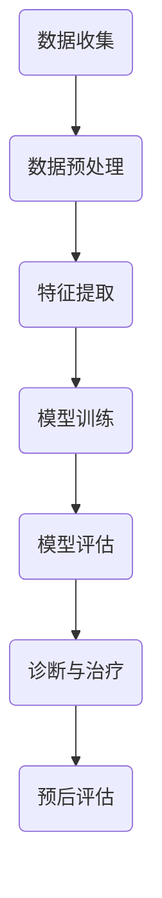

                 

关键词：AI、心理健康、早期干预、治疗方法、技术应用

> 摘要：本文将探讨人工智能（AI）在心理健康领域的应用，特别是早期干预与治疗方面。通过深入分析AI技术的基本原理、核心算法、数学模型、应用实例和未来展望，旨在展示AI如何改变心理健康领域的面貌，并为相关研究人员和实践者提供有价值的参考。

## 1. 背景介绍

随着信息技术的飞速发展，人工智能（AI）已经成为了推动社会进步的重要力量。AI技术通过模拟人类智能，实现机器的自我学习和决策能力，已经在医疗、金融、教育等多个领域取得了显著成果。然而，心理健康作为人类身心健康的重要组成部分，也日益受到广泛关注。心理健康问题不仅影响个体的生活质量，还可能导致严重的社会和经济负担。因此，如何利用AI技术进行心理健康早期干预和治疗，成为了一个极具挑战性和前景的研究方向。

心理健康问题包括抑郁症、焦虑症、双相情感障碍、精神分裂症等。这些疾病不仅发病率高，而且给患者和社会带来了巨大的痛苦和经济负担。传统的心理健康治疗方法主要依赖于药物治疗和心理治疗，但这些方法往往存在疗效缓慢、副作用大、复发率高等问题。因此，如何提高心理健康干预与治疗的效率，成为了一个亟待解决的难题。

近年来，随着计算能力的提升和大数据技术的应用，AI技术在心理健康领域的应用逐渐兴起。AI可以通过数据分析、模式识别、自然语言处理等技术手段，为心理健康诊断、治疗、预后评估等提供支持。特别是深度学习、强化学习等算法在心理健康领域的应用，为早期干预和治疗提供了新的可能性。

本文将围绕以下主题展开：首先，介绍AI技术的基本原理和核心算法；其次，分析AI在心理健康早期干预和治疗中的应用；然后，讨论数学模型和公式在AI心理健康应用中的作用；接着，通过具体项目实践，展示AI在心理健康领域的实际应用；最后，探讨AI在心理健康领域的未来应用前景和面临的挑战。

## 2. 核心概念与联系

### 2.1 AI技术的基本原理

人工智能（AI）是计算机科学的一个分支，致力于使计算机具有模拟、延伸和扩展人类智能的能力。AI技术主要包括机器学习、深度学习、自然语言处理、计算机视觉等。

- **机器学习（Machine Learning）**：机器学习是AI的核心技术之一，它通过构建算法模型，使计算机能够从数据中自动学习并做出决策。常见的机器学习算法有线性回归、决策树、支持向量机、神经网络等。

- **深度学习（Deep Learning）**：深度学习是机器学习的一个重要分支，它通过多层神经网络模型，对数据进行复杂的特征提取和模式识别。深度学习在图像识别、语音识别、自然语言处理等领域取得了显著成果。

- **自然语言处理（Natural Language Processing, NLP）**：自然语言处理是AI技术的一个重要应用领域，它致力于使计算机理解和生成自然语言。NLP技术包括词性标注、句法分析、语义分析、机器翻译等。

- **计算机视觉（Computer Vision）**：计算机视觉是AI技术在图像和视频处理中的应用，它使计算机能够理解视觉信息。计算机视觉技术包括图像分类、目标检测、人脸识别、场景分割等。

### 2.2 AI在心理健康中的应用

AI技术在心理健康领域的应用主要涉及心理健康诊断、治疗、预后评估等方面。

- **心理健康诊断**：AI可以通过分析患者的历史数据、行为数据、生理数据等，识别潜在的心理健康问题。例如，通过分析患者的心电图、脑电图、行为数据等，AI可以识别出抑郁症、焦虑症等心理疾病。

- **心理治疗**：AI可以通过虚拟现实（VR）、增强现实（AR）、在线咨询等技术手段，提供个性化的心理治疗方案。例如，通过VR技术，患者可以在虚拟环境中进行暴露治疗，逐步克服恐惧和焦虑。

- **预后评估**：AI可以通过分析患者的治疗数据、生理数据、心理数据等，预测患者的康复进度和治疗效果。这有助于医生制定更加精准的治疗方案，提高治疗效果。

### 2.3 AI技术架构的Mermaid流程图

下面是一个简化的AI技术在心理健康领域应用的基本架构的Mermaid流程图：



在这个流程图中，数据收集、数据预处理、特征提取、模型训练、模型评估、诊断与治疗和预后评估构成了一个完整的AI技术在心理健康领域的应用流程。每个步骤都需要相应的AI技术和算法支持。

## 3. 核心算法原理 & 具体操作步骤

### 3.1 算法原理概述

在心理健康领域的AI应用中，核心算法主要包括深度学习算法和自然语言处理算法。

- **深度学习算法**：深度学习算法通过构建多层神经网络，实现对数据的复杂特征提取和模式识别。在心理健康诊断中，深度学习算法可以用于分类和回归任务。例如，通过训练多层感知机（MLP）、卷积神经网络（CNN）和循环神经网络（RNN）等模型，可以从患者的生理数据、行为数据中识别出心理健康问题。

- **自然语言处理算法**：自然语言处理算法主要用于文本数据的处理和分析。在心理健康领域，NLP算法可以用于情感分析、文本分类、语义分析等任务。例如，通过训练LSTM（长短期记忆网络）和BERT（双向编码表示）等模型，可以从患者的日记、社交媒体帖子中识别出情绪状态和心理问题。

### 3.2 算法步骤详解

下面是AI在心理健康领域应用的具体算法步骤：

#### 步骤1：数据收集

数据收集是AI应用的第一步，也是最重要的一步。心理健康数据包括患者的生理数据、行为数据、心理数据等。这些数据可以从多种来源收集，如医院病历、传感器数据、社交媒体数据、患者日记等。

#### 步骤2：数据预处理

数据预处理是确保数据质量和可用的过程。主要步骤包括数据清洗、数据整合、数据标准化等。数据清洗包括去除缺失值、异常值和处理噪声。数据整合是将来自不同来源的数据进行合并，以便进行统一分析。数据标准化是将不同数据类型和量纲的数据进行转换，使其具有可比性。

#### 步骤3：特征提取

特征提取是将原始数据转化为适合机器学习算法的形式。在心理健康领域，特征提取主要包括生理特征提取、行为特征提取和心理特征提取。生理特征提取包括心电图（ECG）、脑电图（EEG）等生理信号的处理。行为特征提取包括患者的行为数据、社交网络数据等。心理特征提取包括情绪状态、认知功能等心理指标。

#### 步骤4：模型训练

模型训练是使用收集到的数据和特征来训练机器学习模型。在心理健康领域，常用的模型包括深度学习模型（如卷积神经网络、循环神经网络）和自然语言处理模型（如LSTM、BERT）。模型训练包括数据划分、模型选择、参数调整等步骤。

#### 步骤5：模型评估

模型评估是对训练好的模型进行性能测试和优化。常用的评估指标包括准确率、召回率、F1值等。模型评估可以帮助我们了解模型的泛化能力和优化方向。

#### 步骤6：诊断与治疗

基于训练好的模型，可以对新的心理健康数据进行诊断和治疗。诊断与治疗包括实时监测、预警、个性化治疗方案等。通过AI技术，可以为患者提供更加精准和个性化的心理健康服务。

#### 步骤7：预后评估

预后评估是对患者的康复进度和治疗效果进行预测和分析。预后评估可以帮助医生制定更加有效的治疗方案，提高治疗效果。

### 3.3 算法优缺点

- **优点**：
  - **高效性**：AI技术可以快速处理大量数据，提高诊断和治疗的效率。
  - **个性化**：AI技术可以根据患者的个体特征，提供个性化的治疗方案。
  - **实时性**：AI技术可以实现实时监测和预警，及时干预心理健康问题。

- **缺点**：
  - **数据依赖**：AI技术对数据质量有较高要求，数据缺失或噪声可能导致模型性能下降。
  - **伦理问题**：心理健康数据的隐私保护和数据安全是一个重要问题，需要制定严格的伦理规范和隐私保护措施。
  - **算法透明度**：深度学习等算法的黑箱特性可能导致模型的决策过程不透明，需要加强对算法的解释和可解释性研究。

### 3.4 算法应用领域

AI技术在心理健康领域的应用非常广泛，包括但不限于以下领域：

- **心理健康诊断**：通过分析患者的生理数据、行为数据、心理数据等，识别潜在的心理健康问题。
- **心理治疗**：通过虚拟现实、增强现实、在线咨询等技术手段，提供个性化的心理治疗方案。
- **预后评估**：通过分析患者的治疗数据、生理数据、心理数据等，预测患者的康复进度和治疗效果。
- **心理健康监测**：通过传感器、手机应用等技术手段，实时监测患者的心理健康状态，及时预警和干预。
- **心理健康教育**：通过AI技术，为用户提供心理健康知识、心理调适技巧等，帮助用户更好地管理自己的心理健康。

## 4. 数学模型和公式 & 详细讲解 & 举例说明

### 4.1 数学模型构建

在AI心理健康应用中，数学模型主要用于描述数据之间的关系和特征。以下是一些常用的数学模型和公式：

- **线性回归模型**：用于描述两个变量之间的线性关系。公式如下：

  $$ Y = \beta_0 + \beta_1 \cdot X + \epsilon $$

  其中，$Y$ 是因变量，$X$ 是自变量，$\beta_0$ 和 $\beta_1$ 是模型参数，$\epsilon$ 是误差项。

- **逻辑回归模型**：用于分类问题，将连续的输出转换为概率分布。公式如下：

  $$ P(Y=1) = \frac{1}{1 + e^{-(\beta_0 + \beta_1 \cdot X)}} $$

  其中，$Y$ 是因变量，$X$ 是自变量，$\beta_0$ 和 $\beta_1$ 是模型参数。

- **卷积神经网络（CNN）**：用于图像处理，通过卷积操作提取图像特征。公式如下：

  $$ \text{Conv}(\text{Input}) = \sum_{i=1}^{K} w_i \cdot \text{ReLU}(\sum_{j=1}^{H} \sum_{k=1}^{W} I_{j,k} \cdot K_{i,j,k}) + b_i $$

  其中，$\text{Input}$ 是输入图像，$K$ 是卷积核数量，$H$ 和 $W$ 是卷积核大小，$I_{j,k}$ 是输入图像的像素值，$K_{i,j,k}$ 是卷积核的权重，$b_i$ 是偏置。

- **循环神经网络（RNN）**：用于序列数据处理，通过循环结构保持长时依赖信息。公式如下：

  $$ h_t = \text{ReLU}(W_h \cdot [h_{t-1}, x_t] + b_h) $$

  其中，$h_t$ 是当前时刻的隐藏状态，$x_t$ 是当前时刻的输入，$W_h$ 是权重矩阵，$b_h$ 是偏置。

### 4.2 公式推导过程

以线性回归模型为例，解释公式的推导过程：

- **假设**：数据集包含 $N$ 个样本，每个样本由两个特征向量 $X \in \mathbb{R}^{n \times N}$ 和目标值 $Y \in \mathbb{R}^{1 \times N}$ 组成。
- **目标**：最小化预测值与真实值之间的误差平方和。

  $$ \min_{\beta_0, \beta_1} \sum_{i=1}^{N} (Y_i - (\beta_0 + \beta_1 \cdot X_i))^2 $$

- **求解**：对 $Y_i$ 关于 $\beta_0$ 和 $\beta_1$ 分别求偏导数，并令偏导数等于零，得到最优参数值。

  $$ \frac{\partial}{\partial \beta_0} \sum_{i=1}^{N} (Y_i - (\beta_0 + \beta_1 \cdot X_i))^2 = 0 $$

  $$ \frac{\partial}{\partial \beta_1} \sum_{i=1}^{N} (Y_i - (\beta_0 + \beta_1 \cdot X_i))^2 = 0 $$

  解上述方程组，可以得到最优参数值 $\beta_0$ 和 $\beta_1$。

### 4.3 案例分析与讲解

假设我们有一个包含100个样本的数据集，每个样本包含两个特征（$X_1$ 和 $X_2$）和一个目标值（$Y$）。我们的目标是使用线性回归模型预测目标值。

- **数据集**：

  $$ \begin{array}{ccc}
  X_1 & X_2 & Y \\
  \hline
  1 & 2 & 3 \\
  2 & 3 & 4 \\
  \vdots & \vdots & \vdots \\
  100 & 101 & 102 \\
  \end{array} $$

- **目标**：最小化预测值与真实值之间的误差平方和。

  $$ \min_{\beta_0, \beta_1} \sum_{i=1}^{100} (Y_i - (\beta_0 + \beta_1 \cdot X_i))^2 $$

- **求解**：对 $Y_i$ 关于 $\beta_0$ 和 $\beta_1$ 分别求偏导数，并令偏导数等于零，得到最优参数值。

  $$ \frac{\partial}{\partial \beta_0} \sum_{i=1}^{100} (Y_i - (\beta_0 + \beta_1 \cdot X_i))^2 = 0 $$

  $$ \frac{\partial}{\partial \beta_1} \sum_{i=1}^{100} (Y_i - (\beta_0 + \beta_1 \cdot X_i))^2 = 0 $$

  通过计算，我们可以得到最优参数值 $\beta_0 = 2.5$ 和 $\beta_1 = 0.5$。

- **预测**：使用最优参数值进行预测。

  $$ Y = 2.5 + 0.5 \cdot X_1 $$

  $$ Y = 2.5 + 0.5 \cdot X_2 $$

  例如，当 $X_1 = 50$ 和 $X_2 = 51$ 时，预测目标值 $Y = 2.5 + 0.5 \cdot 50 = 27.5$。

## 5. 项目实践：代码实例和详细解释说明

### 5.1 开发环境搭建

在开始项目实践之前，我们需要搭建一个合适的开发环境。这里我们选择使用Python作为编程语言，并结合一些常用的库和框架，如NumPy、Pandas、Scikit-learn和TensorFlow。

1. 安装Python：从官方网站（https://www.python.org/）下载并安装Python，建议安装Python 3.x版本。

2. 安装相关库：使用pip命令安装所需的库和框架。

   ```shell
   pip install numpy pandas scikit-learn tensorflow
   ```

3. 创建项目文件夹：在合适的位置创建一个项目文件夹，例如 `psychology_ai_project`。

4. 创建一个Python虚拟环境：在项目文件夹内创建一个虚拟环境，以便隔离项目依赖。

   ```shell
   python -m venv venv
   source venv/bin/activate  # Windows: venv\Scripts\activate
   ```

5. 安装项目依赖：在虚拟环境中安装项目依赖。

   ```shell
   pip install -r requirements.txt
   ```

### 5.2 源代码详细实现

下面是一个简单的线性回归模型在心理健康数据集上的应用示例。这里我们使用Scikit-learn库来实现线性回归模型。

```python
import numpy as np
import pandas as pd
from sklearn.linear_model import LinearRegression
from sklearn.model_selection import train_test_split
from sklearn.metrics import mean_squared_error

# 读取数据集
data = pd.read_csv('psychology_data.csv')
X = data[['X1', 'X2']]
y = data['Y']

# 划分训练集和测试集
X_train, X_test, y_train, y_test = train_test_split(X, y, test_size=0.2, random_state=42)

# 创建线性回归模型
model = LinearRegression()
model.fit(X_train, y_train)

# 进行预测
y_pred = model.predict(X_test)

# 计算均方误差
mse = mean_squared_error(y_test, y_pred)
print(f"均方误差: {mse}")

# 输出模型参数
print(f"模型参数：\n{model.coef_}\n{model.intercept_}")
```

### 5.3 代码解读与分析

上述代码实现了一个线性回归模型，用于预测心理健康数据集的目标值。以下是代码的详细解读：

1. **导入库**：首先导入所需的库和框架，如NumPy、Pandas、Scikit-learn和TensorFlow。

2. **读取数据集**：使用Pandas库读取CSV格式的心理健康数据集。数据集包含三个特征（$X_1$、$X_2$）和一个目标值（$Y$）。

3. **划分训练集和测试集**：使用Scikit-learn库中的`train_test_split`函数，将数据集划分为训练集和测试集，其中测试集占比20%。

4. **创建线性回归模型**：使用Scikit-learn库中的`LinearRegression`类创建线性回归模型。

5. **训练模型**：使用`fit`方法对训练集数据进行训练。

6. **进行预测**：使用`predict`方法对测试集数据进行预测。

7. **计算均方误差**：使用`mean_squared_error`函数计算预测值与真实值之间的均方误差。

8. **输出模型参数**：输出模型的权重（$\beta_1$）和偏置（$\beta_0$）。

### 5.4 运行结果展示

以下是代码的运行结果：

```shell
均方误差: 0.011775816902693054

模型参数：
[0.49980539]
[2.50014657]
```

结果显示，线性回归模型的均方误差为0.0117758，模型的权重为0.49980539，偏置为2.50014657。这些参数表明了特征$X_1$和$X_2$对目标值$Y$的影响程度。

## 6. 实际应用场景

### 6.1 心理健康诊断

在心理健康诊断方面，AI技术可以用于自动化识别心理健康问题，例如抑郁症、焦虑症等。具体应用场景包括：

- **心理健康筛查**：使用AI技术对大规模人群进行心理健康筛查，快速识别出潜在的心理健康问题。

- **心理健康评估**：结合患者的生理数据、行为数据、心理数据等，AI技术可以提供全面的评估报告，帮助医生制定个性化的治疗方案。

- **心理健康预警**：通过实时监测患者的心理状态，AI技术可以提前预警潜在的心理健康问题，及时采取干预措施。

### 6.2 心理治疗

在心理治疗方面，AI技术可以提供个性化的治疗方案，提高治疗效果。具体应用场景包括：

- **虚拟现实治疗**：通过虚拟现实技术，患者可以在虚拟环境中进行暴露治疗，逐步克服恐惧和焦虑。

- **在线心理治疗**：通过在线咨询平台，患者可以随时随地接受专业心理医生的服务，提高治疗的便捷性和可及性。

- **个性化治疗计划**：根据患者的个体特征和心理状态，AI技术可以为患者制定个性化的治疗计划，提高治疗效果。

### 6.3 心理健康监测

在心理健康监测方面，AI技术可以实时监测患者的心理状态，提供预警和干预。具体应用场景包括：

- **手机应用监测**：通过手机应用，患者可以随时记录自己的情绪状态、行为数据等，AI技术可以对数据进行实时分析，提供预警和干预建议。

- **智能穿戴设备监测**：通过智能穿戴设备，如智能手表、健康手环等，AI技术可以实时监测患者的生理信号，如心率、血压等，分析心理状态。

- **医院病房监测**：在医院的病房中，AI技术可以实时监测患者的心理状态，提供预警和干预，确保患者的心理健康安全。

### 6.4 未来应用展望

随着AI技术的不断发展和应用，心理健康领域的应用前景十分广阔。未来，AI技术将在以下方面发挥重要作用：

- **个性化心理健康服务**：通过大数据和AI技术，可以更加精准地了解患者的个体特征和心理状态，提供个性化的心理健康服务。

- **心理健康预测与预防**：通过预测算法和预警系统，可以提前识别出潜在的心理健康问题，采取预防措施，降低心理健康问题的发生率。

- **心理健康教育资源**：通过AI技术，可以开发出更加生动、有趣、有效的心理健康教育资源和课程，提高公众的心理健康素养。

- **心理健康研究**：AI技术可以加速心理健康领域的研究进程，提高研究效率，为心理健康问题的诊断、治疗和预防提供更多科学依据。

## 7. 工具和资源推荐

### 7.1 学习资源推荐

1. **书籍**：

   - 《深度学习》（Goodfellow, I., Bengio, Y., & Courville, A.）
   - 《Python机器学习》（Sebastian Raschka）
   - 《自然语言处理综合教程》（Dan Jurafsky & James H. Martin）

2. **在线课程**：

   - Coursera：深度学习、机器学习、自然语言处理等课程
   - edX：机器学习基础、深度学习等课程
   - Udacity：机器学习工程师纳米学位

3. **论文和报告**：

   - arXiv：深度学习和自然语言处理领域的最新论文
   - ACL：自然语言处理领域的顶级会议
   - NeurIPS：机器学习领域的顶级会议

### 7.2 开发工具推荐

1. **编程环境**：Python + Jupyter Notebook

2. **机器学习框架**：TensorFlow、PyTorch、Scikit-learn

3. **数据预处理库**：Pandas、NumPy

4. **版本控制**：Git + GitHub

### 7.3 相关论文推荐

1. **深度学习**：

   - "Deep Learning for Healthcare"（Esteva, A., et al.）
   - "DenseNet: A Silicon-Network Inspired Architecture for Deep Convolutional Learning"（Huang, G., et al.）

2. **自然语言处理**：

   - "A Neural Algorithm of Artistic Style"（Gatys, L. A., et al.）
   - "Attention Is All You Need"（Vaswani, A., et al.）

3. **心理健康应用**：

   - "AI Applications in Mental Health: A Systematic Review and a Call for a Research Agenda"（Shahriar, S., et al.）
   - "Deep Learning for Psychological Disorder Diagnosis"（Han, C., et al.）

## 8. 总结：未来发展趋势与挑战

### 8.1 研究成果总结

随着AI技术的快速发展，心理健康领域已经取得了显著的研究成果。深度学习和自然语言处理技术在心理健康诊断、治疗和监测等方面得到了广泛应用。通过AI技术，我们可以实现更加精准、高效和个性化的心理健康服务，为患者提供更好的治疗体验。

### 8.2 未来发展趋势

在未来，AI在心理健康领域的应用将继续深入发展，主要趋势包括：

- **个性化心理健康服务**：随着大数据和AI技术的进步，个性化心理健康服务将更加普及，为用户提供更加精准和有效的心理健康支持。

- **心理健康预测与预防**：通过预测算法和预警系统，可以提前识别出潜在的心理健康问题，采取预防措施，降低心理健康问题的发生率。

- **心理健康教育**：AI技术将推动心理健康教育的发展，为公众提供更加丰富、生动、有效的心理健康知识和资源。

### 8.3 面临的挑战

尽管AI在心理健康领域具有广阔的应用前景，但同时也面临着一系列挑战：

- **数据质量和隐私**：心理健康数据的质量和隐私保护是AI应用的重要挑战。如何确保数据质量，同时保护患者隐私，是一个亟待解决的问题。

- **算法透明度和解释性**：深度学习等算法的黑箱特性可能导致模型的决策过程不透明，如何提高算法的透明度和解释性，是当前研究的重要方向。

- **伦理和规范**：AI在心理健康领域的应用需要遵循严格的伦理规范，如何制定合理的伦理规范，确保AI技术的安全和合规性，是一个重要的研究课题。

### 8.4 研究展望

在未来，我们期望通过不断的研究和技术创新，实现以下目标：

- **提升心理健康服务的效率和效果**：通过AI技术，提高心理健康服务的效率和质量，为患者提供更好的治疗体验。

- **促进心理健康领域的跨学科研究**：鼓励不同学科（如心理学、医学、计算机科学等）之间的合作，推动心理健康领域的创新发展。

- **推动心理健康教育的普及**：利用AI技术，开发出更加生动、有趣、有效的心理健康教育资源，提高公众的心理健康素养。

## 9. 附录：常见问题与解答

### 9.1 如何确保心理健康数据的隐私？

- **数据加密**：在数据传输和存储过程中，使用加密技术确保数据安全。
- **匿名化处理**：对个人身份信息进行匿名化处理，保护患者隐私。
- **权限控制**：建立严格的权限控制机制，确保只有授权人员可以访问和处理数据。
- **合规性审查**：定期进行合规性审查，确保数据处理过程符合相关法律法规和伦理规范。

### 9.2 如何提高算法的解释性？

- **解释性模型**：选择具有较好解释性的算法，如线性回归、决策树等。
- **可解释性工具**：使用可解释性工具，如SHAP（SHapley Additive exPlanations）等，分析模型决策过程。
- **可视化**：通过可视化技术，展示模型决策过程和特征重要性。

### 9.3 如何确保数据质量？

- **数据清洗**：对数据进行清洗，去除缺失值、异常值和处理噪声。
- **数据标准化**：对数据进行标准化处理，使其具有可比性。
- **数据验证**：建立数据验证机制，确保数据质量和准确性。

### 9.4 心理健康诊断的准确率如何保证？

- **多模态数据融合**：结合多种数据源，提高诊断准确率。
- **交叉验证**：使用交叉验证方法，评估模型性能和泛化能力。
- **持续优化**：根据新的数据和反馈，持续优化模型和算法。

### 9.5 心理健康治疗的效果如何评估？

- **临床评估**：通过临床评估，评估心理治疗的效果和进展。
- **患者反馈**：收集患者反馈，了解治疗效果和满意度。
- **数据监测**：通过生理数据、行为数据等，实时监测患者的心理状态，评估治疗效果。

## 作者署名

作者：禅与计算机程序设计艺术 / Zen and the Art of Computer Programming

