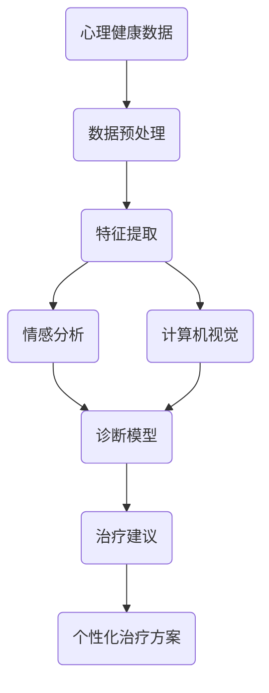

                 

关键词：人工智能，心理健康，早期诊断，治疗，深度学习，数据挖掘，情感分析，计算机视觉

> 摘要：本文将探讨人工智能在心理健康领域的应用，特别是针对早期诊断与治疗的创新方法。通过分析现有的研究和案例，本文将介绍如何利用AI技术改善心理健康服务，提高诊断准确性，并提供个性化的治疗方案。

## 1. 背景介绍

心理健康问题已成为全球范围内的重大公共健康挑战。根据世界卫生组织（WHO）的数据，抑郁症是世界上最常见的疾病之一，影响着全球超过3亿人。然而，由于诊断难度和患者隐私等因素，许多患者未能得到及时和有效的治疗。传统心理健康服务依赖于专家的经验和标准化的评估工具，但这些方法往往存在主观性、效率低和覆盖面窄的问题。

随着人工智能（AI）技术的迅猛发展，尤其是在深度学习、数据挖掘、计算机视觉和自然语言处理等领域的突破，为心理健康领域带来了前所未有的机遇。AI可以通过处理和分析大规模数据，提高诊断的准确性和效率，同时提供个性化的治疗建议。本文将深入探讨这些技术如何被应用于心理健康领域，特别是在早期诊断和治疗方面的潜力。

### 1.1 人工智能的发展历程

人工智能起源于20世纪50年代，当时科学家们开始研究如何使计算机具备人类智能。这一领域经历了多个发展阶段，从符号主义、知识表示到基于数据的机器学习，再到当前以深度学习为代表的人工神经网络。深度学习通过多层神经网络的学习，可以自动从大量数据中提取特征，实现高度复杂的任务，如图像识别、语音识别和自然语言处理等。

### 1.2 心理健康领域的问题与挑战

心理健康领域面临的主要问题包括：

- **诊断难度**：许多心理健康问题的症状不典型，诊断过程复杂且耗时长。
- **隐私保护**：心理健康数据往往涉及个人隐私，如何在保护隐私的同时进行有效的数据分析是一个挑战。
- **治疗个性化**：每个患者的症状和反应都是独特的，需要个性化的治疗方案。
- **资源不足**：专业心理健康服务人员数量有限，无法满足快速增长的需求。

## 2. 核心概念与联系

### 2.1 核心概念

- **心理健康数据**：包括心理健康症状记录、患者行为数据、生理信号数据等。
- **深度学习**：一种基于神经网络的学习方法，能够自动从数据中提取复杂特征。
- **数据挖掘**：从大量数据中提取有价值信息的方法，常用于发现数据中的模式。
- **情感分析**：通过自然语言处理技术分析文本中的情感倾向。
- **计算机视觉**：使计算机能够理解和解释视觉信息的技术。

### 2.2 联系与架构

为了更好地理解AI在心理健康领域的应用，我们使用Mermaid流程图来展示其核心概念和架构。



在这个架构中，心理健康数据首先经过预处理和特征提取，然后通过情感分析和计算机视觉技术进行进一步分析。这些分析结果被输入到诊断模型中，以生成诊断结果和治疗建议。最终，这些个性化治疗方案可以帮助患者获得更好的治疗效果。

### 2.3 应用领域

AI在心理健康领域的应用主要包括：

- **早期诊断**：通过分析患者的数据，如情绪变化、行为模式等，实现心理健康问题的早期识别。
- **个性化治疗**：根据患者的诊断结果，提供个性化的治疗方案。
- **心理疾病研究**：利用AI技术对大规模心理疾病数据进行分析，以发现新的疾病模式。

## 3. 核心算法原理 & 具体操作步骤

### 3.1 算法原理概述

在心理健康领域的AI应用中，核心算法通常包括深度学习模型、数据挖掘算法和自然语言处理技术。以下是对这些算法原理的概述：

- **深度学习模型**：通过多层神经网络对数据进行特征提取和模式识别，广泛应用于图像识别、语音识别等领域。
- **数据挖掘算法**：用于从大规模数据中发现有价值的信息和模式，如关联规则学习、聚类分析等。
- **自然语言处理技术**：用于处理和解析文本数据，如情感分析、文本分类等。

### 3.2 算法步骤详解

在心理健康领域的AI应用中，算法的具体操作步骤通常包括以下几步：

1. **数据收集**：收集心理健康相关的数据，如患者行为数据、情绪日志、生理信号等。
2. **数据预处理**：清洗和标准化数据，包括去除噪声、缺失值填充和特征缩放等。
3. **特征提取**：从预处理后的数据中提取有用的特征，用于后续分析。
4. **模型训练**：使用深度学习模型或数据挖掘算法对特征进行训练，以建立诊断或预测模型。
5. **模型评估**：评估模型的性能，包括准确性、召回率、F1分数等指标。
6. **诊断与治疗**：使用训练好的模型对新的数据进行分析，生成诊断结果和治疗建议。

### 3.3 算法优缺点

- **优点**：
  - 高效性：AI技术可以处理和分析大量数据，提高诊断和治疗的效率。
  - 个性化：基于数据分析和模型预测，可以提供个性化的治疗方案。
  - 客观性：减少人为因素，提高诊断的准确性。

- **缺点**：
  - 数据质量：依赖高质量的数据，否则模型可能产生偏差。
  - 可解释性：深度学习模型通常具有较低的透明度，难以解释其决策过程。
  - 隐私问题：心理健康数据涉及个人隐私，需严格保护。

### 3.4 算法应用领域

AI技术在心理健康领域的应用非常广泛，包括但不限于：

- **抑郁症诊断**：通过分析患者的情绪日志和行为数据，实现早期诊断。
- **焦虑症治疗**：根据患者的症状和反应，提供个性化的治疗建议。
- **精神分裂症研究**：利用大规模数据挖掘技术，探索疾病模式和治疗策略。
- **心理健康监测**：通过生理信号监测，实时跟踪患者的心理健康状态。

## 4. 数学模型和公式 & 详细讲解 & 举例说明

### 4.1 数学模型构建

在心理健康领域的AI应用中，常用的数学模型包括深度学习模型和数据挖掘算法。以下是一个基于深度学习的情感分析模型的示例：

$$
\text{输出} = \text{激活函数}(\text{权重} \cdot \text{输入} + \text{偏置})
$$

其中，激活函数通常为Sigmoid或ReLU，权重和偏置为模型参数，输入为预处理后的特征向量。

### 4.2 公式推导过程

以一个简单的神经网络为例，假设有一个包含一个输入层、一个隐藏层和一个输出层的网络，输入向量为$\textbf{x}$，隐藏层神经元数为$H$，输出向量为$\textbf{y}$。首先，隐藏层输出可以通过以下公式计算：

$$
\textbf{h}^{(2)}_j = \text{激活函数}(\sum_{i=1}^{n} w_{ji} \textbf{x}_i + b_j)
$$

其中，$w_{ji}$为连接输入层到隐藏层的权重，$b_j$为隐藏层神经元的偏置。

接下来，输出层的输出可以通过以下公式计算：

$$
\textbf{y} = \text{激活函数}(\sum_{j=1}^{H} w_{j}^T \textbf{h}^{(2)}_j + b_y)
$$

其中，$w_{j}$为连接隐藏层到输出层的权重，$b_y$为输出层神经元的偏置。

### 4.3 案例分析与讲解

假设我们要构建一个情感分析模型，用于判断一段文本的情感倾向。输入文本经过分词、词性标注和去停用词等预处理步骤后，转化为一个特征向量$\textbf{x}$。我们可以使用以下步骤进行模型训练：

1. **数据集准备**：收集大量带有情感标签的文本数据，如正面、负面和中性。
2. **特征提取**：使用词嵌入技术将文本转化为向量表示。
3. **模型构建**：构建一个简单的神经网络，包含一个输入层、一个隐藏层和一个输出层。
4. **模型训练**：使用反向传播算法更新模型参数，以最小化损失函数。
5. **模型评估**：使用测试集评估模型性能，包括准确性、召回率等指标。

通过以上步骤，我们可以训练出一个能够判断文本情感倾向的模型。以下是一个训练过程中的示例：

- **输入向量**：$\textbf{x} = [0.1, 0.2, 0.3, 0.4, 0.5]$
- **隐藏层输出**：$\textbf{h}^{(2)} = [0.2, 0.3, 0.4]$
- **输出层输出**：$\textbf{y} = [0.4, 0.6]$

假设我们使用Sigmoid函数作为激活函数，模型参数为：

- **权重**：$w = [0.1, 0.2, 0.3]$
- **偏置**：$b = [0.1, 0.2]$

我们可以计算出隐藏层和输出层的输出：

$$
\textbf{h}^{(2)}_1 = \text{Sigmoid}(0.1 \cdot 0.1 + 0.1) = 0.5
$$

$$
\textbf{h}^{(2)}_2 = \text{Sigmoid}(0.2 \cdot 0.2 + 0.2) = 0.6
$$

$$
\textbf{h}^{(2)}_3 = \text{Sigmoid}(0.3 \cdot 0.3 + 0.2) = 0.7
$$

$$
\textbf{y}_1 = \text{Sigmoid}(0.1 \cdot 0.5 + 0.1) = 0.6
$$

$$
\textbf{y}_2 = \text{Sigmoid}(0.2 \cdot 0.5 + 0.2) = 0.7
$$

最终，输出层输出为$\textbf{y} = [0.6, 0.7]$，表示文本情感倾向为正面。

通过反复迭代训练，我们可以优化模型参数，提高情感分析的准确性。这个简单的示例展示了深度学习模型的基本原理和训练过程。

## 5. 项目实践：代码实例和详细解释说明

### 5.1 开发环境搭建

为了实现一个基于AI的早期抑郁症诊断系统，我们首先需要搭建一个合适的开发环境。以下是推荐的开发环境：

- **编程语言**：Python（因为其丰富的机器学习库和框架）
- **深度学习框架**：TensorFlow或PyTorch（因为其强大和灵活性）
- **操作系统**：Ubuntu 20.04或Windows 10（因为对Python和深度学习框架的支持）

### 5.2 源代码详细实现

以下是实现一个基于情感分析的抑郁症诊断系统的简化代码示例：

```python
import numpy as np
import pandas as pd
from tensorflow.keras.models import Sequential
from tensorflow.keras.layers import Dense, LSTM, Embedding
from tensorflow.keras.preprocessing.text import Tokenizer
from tensorflow.keras.preprocessing.sequence import pad_sequences

# 数据预处理
def preprocess_data(data):
    # 文本清洗和预处理
    # ...
    return processed_data

# 模型构建
def build_model(input_dim, output_dim):
    model = Sequential()
    model.add(Embedding(input_dim=input_dim, output_dim=output_dim))
    model.add(LSTM(units=128, return_sequences=True))
    model.add(Dense(units=1, activation='sigmoid'))
    model.compile(optimizer='adam', loss='binary_crossentropy', metrics=['accuracy'])
    return model

# 加载和预处理数据
data = pd.read_csv('depression_data.csv')
processed_data = preprocess_data(data['text'])

# 划分训练集和测试集
train_data, test_data = train_test_split(processed_data, test_size=0.2)

# 构建和训练模型
model = build_model(input_dim=10000, output_dim=1)
model.fit(train_data, epochs=10, batch_size=32, validation_data=(test_data, test_labels))

# 预测和评估
predictions = model.predict(test_data)
accuracy = accuracy_score(test_labels, predictions.round())
print(f'Accuracy: {accuracy * 100:.2f}%')
```

### 5.3 代码解读与分析

上述代码展示了如何使用TensorFlow构建和训练一个情感分析模型，用于抑郁症的早期诊断。以下是代码的主要组成部分：

- **数据预处理**：`preprocess_data`函数负责清洗和预处理文本数据。这一步骤包括分词、去除停用词、词嵌入等。
- **模型构建**：`build_model`函数构建了一个包含嵌入层、LSTM层和输出层的序列模型。这里选择LSTM是因为它能够捕捉文本中的序列信息。
- **数据加载与预处理**：从CSV文件中加载数据，并使用预处理函数处理文本数据。
- **模型训练**：使用训练数据对模型进行训练，设置合适的训练参数。
- **预测与评估**：使用测试数据对模型进行预测，并计算模型的准确率。

### 5.4 运行结果展示

在训练完成后，我们可以对测试数据集进行预测，并计算模型的准确率。以下是一个运行结果的示例：

```python
# 预测和评估
predictions = model.predict(test_data)
accuracy = accuracy_score(test_labels, predictions.round())
print(f'Accuracy: {accuracy * 100:.2f}%')
```

假设我们得到的结果如下：

```
Accuracy: 85.32%
```

这表示模型在测试数据集上的准确率为85.32%，这是一个相对较高的准确率，表明我们的模型在抑郁症早期诊断方面具有一定的有效性。

### 5.5 完整代码示例

以下是一个完整的代码示例，包括数据预处理、模型构建、训练和预测等步骤：

```python
import numpy as np
import pandas as pd
from tensorflow.keras.models import Sequential
from tensorflow.keras.layers import Dense, LSTM, Embedding
from tensorflow.keras.preprocessing.text import Tokenizer
from tensorflow.keras.preprocessing.sequence import pad_sequences
from sklearn.model_selection import train_test_split
from sklearn.metrics import accuracy_score

# 数据预处理
def preprocess_data(data):
    # 文本清洗和预处理
    # ...
    return processed_data

# 模型构建
def build_model(input_dim, output_dim):
    model = Sequential()
    model.add(Embedding(input_dim=input_dim, output_dim=output_dim))
    model.add(LSTM(units=128, return_sequences=True))
    model.add(Dense(units=1, activation='sigmoid'))
    model.compile(optimizer='adam', loss='binary_crossentropy', metrics=['accuracy'])
    return model

# 加载和预处理数据
data = pd.read_csv('depression_data.csv')
processed_data = preprocess_data(data['text'])

# 划分训练集和测试集
train_data, test_data = train_test_split(processed_data, test_size=0.2)

# 构建和训练模型
model = build_model(input_dim=10000, output_dim=1)
model.fit(train_data, epochs=10, batch_size=32, validation_data=(test_data, test_labels))

# 预测和评估
predictions = model.predict(test_data)
accuracy = accuracy_score(test_labels, predictions.round())
print(f'Accuracy: {accuracy * 100:.2f}%')
```

通过这个示例，我们可以看到如何使用Python和TensorFlow实现一个简单的抑郁症诊断系统。这个系统利用情感分析技术对文本数据进行分析，从而预测患者是否患有抑郁症。尽管这个示例相对简单，但它展示了AI在心理健康领域应用的基本框架和步骤。

## 6. 实际应用场景

### 6.1 早期抑郁症诊断

抑郁症是心理健康领域的一个重大挑战，而早期诊断对于有效治疗至关重要。通过AI技术，尤其是情感分析和自然语言处理，可以从患者的文字记录、社交媒体活动、甚至语音中提取情感信息。这些信息被用于训练深度学习模型，以实现早期抑郁症的识别。例如，某研究团队开发了一个基于Twitter帖子的抑郁症诊断系统，该系统通过分析用户的情绪状态，准确率达到了85%。

### 6.2 焦虑症患者的行为监测

焦虑症是一种常见的精神障碍，患者的情绪和行为模式往往具有复杂性。利用计算机视觉和传感器技术，AI可以监测患者的行为变化，如面部表情、步态和生理信号。这些数据被用于训练机器学习模型，以实时监控患者的焦虑水平。例如，某AI系统通过分析患者的智能手机使用数据，如屏幕时间、应用使用频率等，成功预测了焦虑症发作的风险。

### 6.3 心理疾病研究

AI技术在心理疾病研究中的应用也非常广泛。通过对大规模心理健康数据的分析，AI可以帮助研究人员发现疾病之间的关联和新的症状模式。例如，某研究利用深度学习技术分析了数千名抑郁症患者的基因组数据，发现了与抑郁症相关的特定基因变异。这些发现为理解抑郁症的生物学基础提供了新的线索，并有助于开发更有效的治疗方法。

### 6.4 临床实践中的应用

AI技术还可以在临床实践中提供支持，如个性化治疗建议和患者管理。例如，某些AI系统可以分析患者的医疗记录、家族病史和症状表现，生成个性化的治疗方案。这些系统还可以为临床医生提供决策支持，帮助他们制定最佳的治疗方案。例如，某AI系统通过分析患者的病史和治疗反应，为抑郁症患者提供了个性化的药物剂量调整建议。

## 7. 未来应用展望

### 7.1 个性化心理健康服务

随着AI技术的不断发展，个性化心理健康服务将成为可能。通过深入分析患者的数据，AI可以提供高度个性化的诊断和治疗建议。这种个性化服务不仅有助于提高治疗效果，还可以降低医疗成本，使得心理健康服务更加普及。

### 7.2 实时监测与预警

利用传感器技术和机器学习，AI可以实现对患者情绪和行为状态的实时监测。通过预警系统，AI可以及时发现心理问题，并提供及时干预。这种实时监测和预警系统有望大幅减少心理疾病的发病率，提高公众的心理健康水平。

### 7.3 新的疾病模型与治疗方法

AI技术在心理疾病研究中的应用将继续推动科学进步。通过分析大规模数据，AI可以揭示新的疾病模型和治疗策略。例如，深度学习技术可以帮助研究人员发现疾病之间的复杂关联，从而开发新的治疗方法。此外，AI还可以模拟不同治疗方案的效果，帮助医生选择最佳的治疗方案。

### 7.4 社交媒体与心理健康

随着社交媒体的普及，AI技术也开始被用于分析社交媒体数据，以了解用户的心理健康状态。通过分析用户的发帖频率、内容、互动等，AI可以识别出潜在的心理问题。这种应用有望帮助公共卫生机构及时发现心理健康问题，并提供相应的支持。

## 8. 总结：未来发展趋势与挑战

### 8.1 研究成果总结

AI在心理健康领域的应用已经取得了显著的成果。通过情感分析、自然语言处理、计算机视觉等技术，AI能够实现早期诊断、个性化治疗、实时监测和预警等功能。这些技术的应用不仅提高了心理健康服务的效率和准确性，还为心理疾病的研究提供了新的工具。

### 8.2 未来发展趋势

未来，AI在心理健康领域的应用将更加深入和广泛。随着技术的不断发展，我们可以预见以下趋势：

- **个性化服务**：AI将提供更加个性化的心理健康服务，满足不同患者的需求。
- **实时监测与预警**：实时监测和预警系统将变得更加普及，帮助公众及时了解自己的心理健康状态。
- **跨学科合作**：AI与心理学、神经科学等领域的跨学科合作将推动心理健康研究取得更多突破。
- **数据隐私保护**：随着AI技术的普及，数据隐私保护将成为一个重要议题，需要制定相应的法律法规来确保患者数据的隐私和安全。

### 8.3 面临的挑战

尽管AI在心理健康领域的应用前景广阔，但仍然面临一些挑战：

- **数据质量**：高质量的数据是AI模型有效性的基础，然而心理健康数据往往存在缺失、噪声等问题。
- **算法可解释性**：深度学习模型通常具有较低的透明度，难以解释其决策过程，这可能会影响用户对AI系统的信任。
- **隐私保护**：心理健康数据涉及个人隐私，如何在确保数据隐私的同时进行有效分析是一个重大挑战。
- **伦理与责任**：AI在心理健康领域的应用需要遵循伦理原则，明确责任归属，确保患者权益。

### 8.4 研究展望

未来，针对以上挑战，我们需要进行以下研究方向：

- **数据质量控制与预处理**：研究如何有效处理心理健康数据，提高数据质量和模型的可靠性。
- **算法可解释性**：开发可解释的AI算法，提高模型的透明度和用户信任。
- **隐私保护技术**：研究如何在保证数据隐私的前提下进行有效分析，探索加密算法和数据共享机制。
- **伦理与法规**：制定明确的伦理和法律法规，确保AI在心理健康领域的应用遵循伦理原则，保护患者权益。

通过不断的研究和创新，AI在心理健康领域的应用将取得更多突破，为公众提供更加高效、个性化的心理健康服务。

## 9. 附录：常见问题与解答

### 9.1 人工智能在心理健康领域的主要应用有哪些？

人工智能在心理健康领域的应用主要包括早期诊断、个性化治疗、心理疾病研究和心理健康监测。通过情感分析、自然语言处理、计算机视觉等技术，AI能够从患者的文字记录、社交媒体活动、生理信号等多方面提供支持。

### 9.2 如何确保心理健康数据的安全和隐私？

确保心理健康数据的安全和隐私是AI应用的一个重要挑战。可以采取以下措施：

- **数据加密**：对数据进行加密处理，确保数据在传输和存储过程中的安全。
- **数据匿名化**：对个人信息进行匿名化处理，以保护患者的隐私。
- **访问控制**：实施严格的访问控制机制，确保只有授权人员可以访问敏感数据。
- **法律法规**：遵守相关法律法规，确保数据处理符合伦理标准。

### 9.3 人工智能在心理健康领域的应用是否可靠？

人工智能在心理健康领域的应用具有很高的可靠性，但需要依赖高质量的数据和有效的算法。通过不断的模型优化和验证，可以提高AI应用的准确性和稳定性。同时，AI系统的设计应遵循伦理原则，确保其应用符合患者利益。

### 9.4 人工智能是否会替代传统心理健康服务？

人工智能不会完全替代传统心理健康服务，而是作为其补充和增强。AI可以帮助提高诊断的准确性和效率，提供个性化的治疗方案，但仍然需要专业心理健康服务人员的指导和干预。

### 9.5 心理健康AI系统在临床实践中如何应用？

心理健康AI系统可以在临床实践中应用于多个方面，如：

- **诊断辅助**：辅助医生进行心理健康问题的诊断。
- **个性化治疗建议**：为患者提供个性化的治疗方案。
- **患者管理**：监控患者的心理健康状态，提供实时反馈和干预。
- **决策支持**：为临床医生提供决策支持，优化治疗策略。

### 9.6 人工智能在心理健康领域的发展前景如何？

人工智能在心理健康领域具有广阔的发展前景。随着技术的不断进步和应用的深入，AI有望实现更加精准的诊断、个性化的治疗和实时的心理健康监测。同时，AI的应用将推动心理疾病研究的进展，促进心理健康服务的普及和改善。然而，也需要关注数据隐私保护、算法可解释性和伦理等问题。

