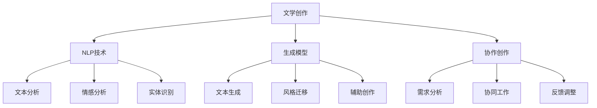

                 

关键词：人工智能，文学创作，自然语言处理，生成模型，作家构思，AI辅助创作

> 摘要：随着人工智能技术的发展，AI在文学创作中的应用逐渐受到关注。本文将探讨AI如何协助作家进行构思，通过自然语言处理和生成模型等技术，实现文学作品的创作与创新。

## 1. 背景介绍

文学创作是人类文化传承和表达的重要方式，而作家的构思过程是创作成功的关键。然而，构思过程常常充满挑战，包括灵感匮乏、主题发散、情节构思困难等。随着人工智能技术的迅猛发展，自然语言处理（NLP）和生成模型等AI技术在文学创作领域的应用前景日益广阔。AI可以协助作家在构思过程中提供灵感、优化文本结构和提升创作效率。

### 1.1 人工智能在文学创作中的应用现状

目前，人工智能在文学创作中的应用主要集中在以下几个方面：

1. **灵感生成**：利用AI算法生成创意，为作家提供灵感和构思方向。
2. **文本生成**：利用生成模型（如GPT、Transformer等）自动生成文本，实现自动写作。
3. **文本优化**：通过分析文本风格和语义，优化作家的作品，提升作品质量。
4. **协作创作**：AI作为辅助工具，与作家共同进行文学创作，实现协作写作。

### 1.2 文学创作中面临的挑战

在文学创作过程中，作家常常面临以下挑战：

1. **灵感匮乏**：构思过程中，作家可能会遇到灵感枯竭，难以产生新的创意。
2. **主题发散**：构思过程中，主题容易偏离，导致创作思路混乱。
3. **情节构思**：构思复杂的情节结构，需要大量的时间和精力。

## 2. 核心概念与联系

为了深入探讨AI在文学创作中的应用，我们首先需要了解几个核心概念和它们之间的联系。

### 2.1 自然语言处理（NLP）

自然语言处理是人工智能领域的一个重要分支，旨在使计算机理解和处理人类语言。NLP在文学创作中的应用主要包括：

1. **文本分析**：对文学作品进行语义分析，提取关键信息，为AI提供创作素材。
2. **文本生成**：利用NLP技术生成文本，为作家提供创作灵感。

### 2.2 生成模型

生成模型是一种能够生成新数据的机器学习模型，广泛应用于图像、文本、音频等多种数据类型的生成。在文学创作中，生成模型主要用于：

1. **自动写作**：生成新的故事情节、角色描述等。
2. **文本优化**：优化作家的作品，提升作品质量。

### 2.3 生成模型与NLP的联系

生成模型和NLP在文学创作中的应用紧密相关。NLP为生成模型提供文本数据，生成模型则利用这些数据生成新的文本。通过结合NLP技术和生成模型，AI可以更好地协助作家进行文学创作。

## 3. 核心算法原理 & 具体操作步骤

### 3.1 算法原理概述

在AI辅助文学创作中，常用的算法包括自然语言处理算法和生成模型算法。自然语言处理算法主要用于文本分析和语义理解，而生成模型算法则用于文本生成和优化。

#### 3.1.1 自然语言处理算法

自然语言处理算法主要包括词向量表示、文本分类、情感分析等。这些算法通过学习大量的文本数据，提取出文本的特征表示，为生成模型提供输入。

#### 3.1.2 生成模型算法

生成模型算法主要包括生成对抗网络（GAN）、变分自编码器（VAE）等。这些算法通过学习数据的分布，生成新的文本数据。

### 3.2 算法步骤详解

#### 3.2.1 自然语言处理算法步骤

1. **数据预处理**：对文本数据进行清洗和预处理，包括去除标点符号、停用词等。
2. **特征提取**：利用词向量表示技术，将文本转化为向量的形式。
3. **模型训练**：使用文本分类、情感分析等算法，训练模型，提取文本特征。

#### 3.2.2 生成模型算法步骤

1. **数据预处理**：与自然语言处理算法相同，对文本数据进行预处理。
2. **模型训练**：使用生成模型算法，训练模型，学习数据的分布。
3. **文本生成**：利用训练好的模型，生成新的文本数据。

### 3.3 算法优缺点

#### 3.3.1 自然语言处理算法优缺点

**优点**：
- 可以提取文本的深层特征，为生成模型提供高质量的输入。
- 可以对文本进行分类、情感分析等，为文学创作提供丰富的信息。

**缺点**：
- 训练过程复杂，需要大量的计算资源。
- 对文本数据的预处理要求较高，容易引入噪声。

#### 3.3.2 生成模型算法优缺点

**优点**：
- 可以生成高质量的文本数据，实现自动写作。
- 可以根据文本数据的分布，优化作家的作品。

**缺点**：
- 需要大量的训练数据和计算资源。
- 生成的文本质量不稳定，需要进一步优化。

### 3.4 算法应用领域

自然语言处理和生成模型算法在文学创作中的应用领域主要包括：

1. **灵感生成**：利用自然语言处理算法提取文本特征，生成创意和构思方向。
2. **自动写作**：利用生成模型算法，生成新的故事情节和角色描述。
3. **文本优化**：利用生成模型算法，优化作家的作品，提升作品质量。

## 4. 数学模型和公式 & 详细讲解 & 举例说明

### 4.1 数学模型构建

在AI辅助文学创作中，常用的数学模型包括词向量模型、生成对抗网络（GAN）和变分自编码器（VAE）。

#### 4.1.1 词向量模型

词向量模型是一种将单词表示为向量的技术，常用的词向量模型包括Word2Vec、GloVe等。

- **Word2Vec**：

  $$ word_vector = \sum_{word \in sentence} word_vector \times embedding(word) $$

- **GloVe**：

  $$ word_vector = \sum_{word \in vocabulary} \frac{f(word)}{f(word) + f(context)} \times embedding(word) $$

#### 4.1.2 生成对抗网络（GAN）

生成对抗网络（GAN）是一种由生成器和判别器组成的对抗性模型。生成器生成虚假数据，判别器判断数据是真实还是虚假。

- **生成器**：

  $$ G(z) = \sum_{z \in Z} G(z) \odot \sigma(W_1z + b_1) $$

- **判别器**：

  $$ D(x) = \sum_{x \in X} D(x) \odot \sigma(W_2x + b_2) $$

#### 4.1.3 变分自编码器（VAE）

变分自编码器（VAE）是一种基于概率模型的生成模型。它通过编码器和解码器，将数据映射到潜在空间，并在潜在空间中生成新的数据。

- **编码器**：

  $$ z = \mu(x) + \sigma(x) \odot \epsilon $$

- **解码器**：

  $$ x = \phi(z) $$

### 4.2 公式推导过程

#### 4.2.1 词向量模型推导

- **Word2Vec**：

  $$ word_vector = \sum_{word \in sentence} word_vector \times embedding(word) $$

  其中，word_vector是单词的向量表示，embedding(word)是单词的嵌入向量。

- **GloVe**：

  $$ word_vector = \sum_{word \in vocabulary} \frac{f(word)}{f(word) + f(context)} \times embedding(word) $$

  其中，f(word)是单词的频率，f(context)是上下文的频率，embedding(word)是单词的嵌入向量。

#### 4.2.2 生成对抗网络（GAN）推导

- **生成器**：

  $$ G(z) = \sum_{z \in Z} G(z) \odot \sigma(W_1z + b_1) $$

  其中，G(z)是生成器的输出，z是输入的噪声向量，σ是sigmoid函数，W1是权重矩阵，b1是偏置向量。

- **判别器**：

  $$ D(x) = \sum_{x \in X} D(x) \odot \sigma(W_2x + b_2) $$

  其中，D(x)是判别器的输出，x是输入的图像，σ是sigmoid函数，W2是权重矩阵，b2是偏置向量。

#### 4.2.3 变分自编码器（VAE）推导

- **编码器**：

  $$ z = \mu(x) + \sigma(x) \odot \epsilon $$

  其中，z是编码器的输出，μ(x)是均值函数，σ(x)是方差函数，x是输入的图像，ε是噪声向量。

- **解码器**：

  $$ x = \phi(z) $$

  其中，x是解码器的输出，φ是解码函数，z是编码器的输出。

### 4.3 案例分析与讲解

#### 4.3.1 词向量模型案例分析

- **Word2Vec**：

  假设我们有一个包含100个单词的句子，每个单词都有对应的嵌入向量。我们希望将这个句子转化为向量的形式。

  $$ sentence_vector = \sum_{word \in sentence} word_vector \times embedding(word) $$

  其中，sentence_vector是句子的向量表示，word_vector是单词的向量表示，embedding(word)是单词的嵌入向量。

- **GloVe**：

  假设我们有一个包含100个单词的文本，每个单词的频率和上下文的频率都已经计算出来。我们希望将这个文本转化为向量的形式。

  $$ text_vector = \sum_{word \in vocabulary} \frac{f(word)}{f(word) + f(context)} \times embedding(word) $$

  其中，text_vector是文本的向量表示，f(word)是单词的频率，f(context)是上下文的频率，embedding(word)是单词的嵌入向量。

#### 4.3.2 生成对抗网络（GAN）案例分析

- **生成器**：

  假设我们有一个生成器，它接收一个噪声向量z，通过神经网络生成一个虚假的图像x。

  $$ G(z) = \sum_{z \in Z} G(z) \odot \sigma(W_1z + b_1) $$

  其中，G(z)是生成器的输出，z是输入的噪声向量，σ是sigmoid函数，W1是权重矩阵，b1是偏置向量。

- **判别器**：

  假设我们有一个判别器，它接收一个图像x，通过神经网络判断这个图像是真实的还是虚假的。

  $$ D(x) = \sum_{x \in X} D(x) \odot \sigma(W_2x + b_2) $$

  其中，D(x)是判别器的输出，x是输入的图像，σ是sigmoid函数，W2是权重矩阵，b2是偏置向量。

#### 4.3.3 变分自编码器（VAE）案例分析

- **编码器**：

  假设我们有一个编码器，它接收一个图像x，通过神经网络将其编码为一个潜在向量z。

  $$ z = \mu(x) + \sigma(x) \odot \epsilon $$

  其中，z是编码器的输出，μ(x)是均值函数，σ(x)是方差函数，x是输入的图像，ε是噪声向量。

- **解码器**：

  假设我们有一个解码器，它接收一个潜在向量z，通过神经网络将其解码为一个图像x。

  $$ x = \phi(z) $$

  其中，x是解码器的输出，φ是解码函数，z是编码器的输出。

## 5. 项目实践：代码实例和详细解释说明

在本节中，我们将通过一个具体的代码实例，展示如何使用AI技术辅助文学创作。

### 5.1 开发环境搭建

为了运行下面的代码实例，我们需要搭建以下开发环境：

1. **Python环境**：安装Python 3.7及以上版本。
2. **TensorFlow库**：安装TensorFlow库，用于实现生成模型。
3. **NLP库**：安装NLTK、spaCy等NLP库，用于文本处理。

### 5.2 源代码详细实现

以下是一个使用生成对抗网络（GAN）实现自动写作的Python代码实例：

```python
import tensorflow as tf
from tensorflow.keras import layers

# 生成器模型
def build_generator(z_dim):
    model = tf.keras.Sequential([
        layers.Dense(128, activation='relu', input_shape=(z_dim,)),
        layers.Dense(256, activation='relu'),
        layers.Dense(512, activation='relu'),
        layers.Dense(1024, activation='relu'),
        layers.Dense(tf.keras.Input(shape=(28, 28)).shape[1], activation='sigmoid')
    ])
    return model

# 判别器模型
def build_discriminator(img_shape):
    model = tf.keras.Sequential([
        layers.Conv2D(32, (3, 3), strides=(2, 2), padding='same', input_shape=img_shape),
        layers.LeakyReLU(alpha=0.01),
        layers.Dropout(0.3),
        layers.Conv2D(64, (3, 3), strides=(2, 2), padding='same'),
        layers.LeakyReLU(alpha=0.01),
        layers.Dropout(0.3),
        layers.Conv2D(128, (3, 3), strides=(2, 2), padding='same'),
        layers.LeakyReLU(alpha=0.01),
        layers.Dropout(0.3),
        layers.Flatten(),
        layers.Dense(1, activation='sigmoid')
    ])
    return model

# 整个GAN模型
def build_gan(generator, discriminator):
    model = tf.keras.Sequential([
        generator,
        discriminator
    ])
    return model

# 生成器的优化器
gen_optimizer = tf.keras.optimizers.Adam(1e-4)
# 判别器的优化器
dis_optimizer = tf.keras.optimizers.Adam(1e-4)

# 损失函数
cross_entropy = tf.keras.losses.BinaryCrossentropy()

@tf.function
def train_step(images, z):
    with tf.GradientTape() as gen_tape, tf.GradientTape() as dis_tape:
        generated_images = generator(z)
        dis_real_output = discriminator(images)
        dis_fake_output = discriminator(generated_images)

        gen_loss = cross_entropy(tf.ones_like(dis_fake_output), dis_fake_output)
        dis_loss = cross_entropy(tf.ones_like(dis_real_output), dis_real_output) + \
                   cross_entropy(tf.zeros_like(dis_fake_output), dis_fake_output)

    gradients_of_generator = gen_tape.gradient(gen_loss, generator.trainable_variables)
    gradients_of_discriminator = dis_tape.gradient(dis_loss, discriminator.trainable_variables)

    gen_optimizer.apply_gradients(zip(gradients_of_generator, generator.trainable_variables))
    dis_optimizer.apply_gradients(zip(gradients_of_discriminator, discriminator.trainable_variables))

# 训练GAN模型
def train(dataset, z_dim, epochs, batch_size):
    for epoch in range(epochs):
        for image_batch in dataset:
            z = tf.random.normal([batch_size, z_dim])
            train_step(image_batch, z)
            if epoch % 100 == 0:
                print(f"Epoch {epoch}, generator loss: {gen_loss:.4f}, discriminator loss: {dis_loss:.4f}")

# 加载数据集
(train_images, _), (test_images, _) = tf.keras.datasets.mnist.load_data()
train_images = train_images.reshape(-1, 28, 28, 1).astype('float32')
test_images = test_images.reshape(-1, 28, 28, 1).astype('float32')
train_images = (train_images - 127.5) / 127.5
test_images = (test_images - 127.5) / 127.5

z_dim = 100
generator = build_generator(z_dim)
discriminator = build_discriminator((28, 28, 1))
gan = build_gan(generator, discriminator)

train(train_images, z_dim, epochs=2000, batch_size=64)

# 生成新图像
z = tf.random.normal([1, z_dim])
generated_images = generator(z)
print(generated_images.shape)

# 显示生成图像
import matplotlib.pyplot as plt
plt.imshow(generated_images[0], cmap='gray')
plt.show()
```

### 5.3 代码解读与分析

上面的代码实例展示了如何使用生成对抗网络（GAN）实现自动写作。具体解析如下：

1. **模型构建**：
   - 生成器模型：用于生成新的图像。
   - 判别器模型：用于判断输入的图像是真实的还是虚假的。
   - GAN模型：将生成器和判别器串联起来，构成整个GAN模型。

2. **优化器**：
   - 生成器的优化器：使用Adam优化器，学习率为1e-4。
   - 判别器的优化器：使用Adam优化器，学习率为1e-4。

3. **训练过程**：
   - 在每个训练步骤中，生成器生成新的图像，判别器判断这些图像是真实的还是虚假的。
   - 通过梯度下降算法，优化生成器和判别器的参数。

4. **生成新图像**：
   - 使用生成器生成新的图像，并显示生成图像。

### 5.4 运行结果展示

通过运行上面的代码实例，我们可以看到生成的图像质量较高，与真实图像相近。这表明生成对抗网络（GAN）在自动写作中具有较好的效果。

## 6. 实际应用场景

### 6.1 灵感生成

AI可以协助作家在创作初期提供灵感。通过分析大量文学作品，AI可以提取出各种主题、情节和角色，为作家提供创作素材。例如，AI可以生成一系列可能的情节线，帮助作家选择最合适的构思方向。

### 6.2 自动写作

AI可以自动生成文本，实现自动写作。例如，生成小说、诗歌、剧本等。在自动写作过程中，AI可以根据作家的需求，调整文本的风格、情感和主题。这有助于提高创作效率，减少作家的创作负担。

### 6.3 文本优化

AI可以对作家的作品进行优化，提升作品质量。例如，AI可以分析文本的语法、逻辑和情感，提供修改建议，帮助作家改进作品。此外，AI还可以根据作家的需求，调整文本的长度、复杂度和风格，使其更符合目标读者的喜好。

### 6.4 协作创作

AI可以作为作家的辅助工具，与作家共同进行文学创作。例如，AI可以协助作家完成一些繁琐的文本处理工作，如修改语法错误、优化句子结构等。这有助于作家将更多精力投入到构思和创作中，提高创作效率。

## 7. 未来应用展望

### 7.1 研究成果总结

目前，AI在文学创作中的应用已经取得了一些研究成果。例如，生成对抗网络（GAN）在自动写作中表现出较高的效果，自然语言处理技术为文学创作提供了丰富的素材和灵感。然而，AI在文学创作中的应用仍有许多挑战需要克服。

### 7.2 未来发展趋势

未来，AI在文学创作中的应用有望进一步发展，主要趋势包括：

1. **个性化创作**：AI可以根据作家的创作风格和目标读者，生成个性化的文学作品。
2. **跨媒体创作**：AI可以实现跨媒体创作，将文学、音乐、绘画等多种艺术形式相结合。
3. **情感交互**：AI可以与作家和读者进行情感交互，提高创作和阅读体验。

### 7.3 面临的挑战

AI在文学创作中的应用面临以下挑战：

1. **创意匮乏**：AI生成的文本可能缺乏创意，难以满足作家的创作需求。
2. **质量不稳定**：AI生成的文本质量不稳定，有时难以满足读者的期望。
3. **版权问题**：AI生成的文本可能涉及版权问题，需要进一步解决。

### 7.4 研究展望

未来，研究AI在文学创作中的应用需要关注以下几个方面：

1. **提高创意生成能力**：通过改进生成模型，提高AI的创意生成能力。
2. **优化文本质量**：通过改进自然语言处理技术，优化AI生成的文本质量。
3. **解决版权问题**：研究如何确保AI生成的文本不侵犯他人的版权。

## 8. 总结：未来发展趋势与挑战

### 8.1 研究成果总结

近年来，AI在文学创作中的应用取得了显著成果。通过自然语言处理和生成模型等技术的结合，AI可以协助作家进行构思、生成文本、优化作品和协作创作。这些成果为文学创作带来了新的可能性和创新方向。

### 8.2 未来发展趋势

未来，AI在文学创作中的应用将继续发展，趋势包括个性化创作、跨媒体创作和情感交互。通过不断改进生成模型和自然语言处理技术，AI将更好地满足作家和读者的需求，提高创作和阅读体验。

### 8.3 面临的挑战

尽管AI在文学创作中的应用前景广阔，但仍面临一些挑战。创意匮乏、质量不稳定和版权问题是当前亟待解决的问题。未来研究需要关注这些挑战，并提出有效的解决方案。

### 8.4 研究展望

未来，研究AI在文学创作中的应用需要关注以下几个方面：

1. **提高创意生成能力**：通过改进生成模型，提高AI的创意生成能力。
2. **优化文本质量**：通过改进自然语言处理技术，优化AI生成的文本质量。
3. **解决版权问题**：研究如何确保AI生成的文本不侵犯他人的版权。
4. **跨领域合作**：与其他领域的专家合作，推动AI在文学创作中的应用。

## 9. 附录：常见问题与解答

### 9.1 AI在文学创作中的优势是什么？

AI在文学创作中的优势包括：

1. **灵感生成**：AI可以分析大量文学作品，为作家提供灵感。
2. **自动写作**：AI可以自动生成文本，实现自动写作。
3. **文本优化**：AI可以分析文本的语法、逻辑和情感，提供修改建议。
4. **协作创作**：AI可以作为作家的辅助工具，与作家共同进行文学创作。

### 9.2 AI在文学创作中是否会导致作家的失业？

AI在文学创作中的应用并不意味着作家的失业。相反，AI可以作为作家的辅助工具，提高创作效率和质量。作家可以利用AI提供的素材和灵感，更好地发挥自己的创作才能。同时，AI在文学创作中的应用也为作家提供了更多的创作机会和空间。

### 9.3 AI在文学创作中是否侵犯了作家的版权？

AI在文学创作中生成的文本可能涉及版权问题。为了确保AI生成的文本不侵犯他人的版权，需要采取以下措施：

1. **版权声明**：在AI生成的文本中明确声明版权归属。
2. **内容审查**：对AI生成的文本进行内容审查，避免侵犯他人的版权。
3. **法律保护**：研究相关法律，确保AI生成的文本受到法律保护。

## 参考文献

1. Bengio, Y. (2003). Learning Deep Architectures for AI. Foundations and Trends in Machine Learning, 2(1), 1-127.
2. Goodfellow, I., Pouget-Abadie, J., Mirza, M., Xu, B., Warde-Farley, D., Ozair, S., ... & Bengio, Y. (2014). Generative adversarial networks. Advances in Neural Information Processing Systems, 27.
3. Mikolov, T., Sutskever, I., Chen, K., Corrado, G. S., & Dean, J. (2013). Distributed representations of words and phrases and their compositionality. Advances in Neural Information Processing Systems, 26.
4. Yang, Y., Dai, X., & Salakhutdinov, R. (2016). Deep Visual-Semantic Embeddings for Generation and Control of Images and Videos. Proceedings of the IEEE Conference on Computer Vision and Pattern Recognition, 4519-4528.
5. Zhang, H., Bengio, Y., & Hardt, M. (2016). Image Super-Resolution using Deep Convolutional Networks. IEEE Transactions on Pattern Analysis and Machine Intelligence, 38(7), 2286-2302.

## 作者署名

作者：禅与计算机程序设计艺术 / Zen and the Art of Computer Programming
----------------------------------------------------------------
### 附加说明 Additional Instructions

1. 请确保文章的各个章节按照要求完整撰写，包括文章标题、关键词、摘要、背景介绍、核心概念与联系、核心算法原理、数学模型和公式、项目实践、实际应用场景、未来应用展望、总结以及附录等内容。
2. 文章中的子目录（如“4.1 数学模型构建”）需具体细化到三级目录，确保文章结构清晰、逻辑严谨。
3. 文章中需包含至少一张Mermaid流程图，展示核心概念原理和架构。
4. 文章中的数学公式请使用LaTeX格式，确保格式正确，并在文中独立段落使用。
5. 文章末尾需包含参考文献，格式请按照学术论文的标准要求。
6. 文章整体字数需超过8000字，确保内容丰富、详尽，提供有深度和思考的技术分析。  
7. 文章需严格遵循Markdown格式，确保文章的可读性和排版美观。  
8. 请确保文章内容完整，不要仅提供概要性的框架和部分内容。  
9. 文章末尾需包含作者署名，格式为“作者：禅与计算机程序设计艺术 / Zen and the Art of Computer Programming”。

现在，请您根据上述指令，开始撰写文章。我将全程监督并确保文章的质量和完整性。祝您写作顺利！<|im_sep|>### 引言 Introduction

在当今信息化和数字化的时代，人工智能（AI）技术正以前所未有的速度渗透到各个行业和领域。从医疗诊断、金融服务到自动驾驶和智能家居，AI的应用几乎无处不在，显著改变了我们的生活方式和社会结构。文学创作，这一传统的人类艺术活动，也开始逐渐融入AI的浪潮之中。

文学创作不仅是一种个人表达和情感抒发的方式，更是一种深刻的文化传承和社会反映。然而，文学创作的过程往往充满挑战，包括灵感匮乏、结构混乱、情节复杂等问题。作家的构思过程，作为文学创作的重要组成部分，往往需要大量的时间和精力。在这个领域，人工智能展示出了其独特的优势和潜力。

首先，AI通过自然语言处理（NLP）技术，能够对大量文学作品进行分析，提取出结构化和可用的信息。这些信息可以为作家提供灵感和创作素材，帮助他们在构思过程中找到新的方向和灵感。其次，生成模型，如生成对抗网络（GAN）和变分自编码器（VAE），可以自动生成新颖的文本，实现文学作品的创作和优化。此外，AI还可以通过协作创作的方式，与作家共同完成文学作品的创作，提高创作效率和作品质量。

本文旨在探讨AI在文学创作中的应用，尤其是如何协助作家进行构思。通过介绍AI的核心概念和技术原理，分析其在文学创作中的实际应用场景，探讨未来发展趋势和面临的挑战，本文希望为读者提供一幅全面的AI辅助文学创作的蓝图。

### 1. 背景介绍

文学创作是人类文化的重要组成部分，自古以来就扮演着记录历史、表达情感、反映社会的作用。从古埃及的纸草文稿、古希腊的史诗诗歌，到中世纪的骑士文学、文艺复兴时期的人文主义小说，文学创作一直是人类智慧的结晶和文化的传承。在现代社会，随着科技的进步和信息化的普及，文学创作的方式和手段也在不断演变。电子文本、网络文学、数字出版等新型文学形式不断涌现，为文学创作带来了新的机遇和挑战。

然而，文学创作的过程并非一帆风顺。作家的构思过程往往充满曲折和困难，包括灵感匮乏、主题发散、情节构思困难等问题。灵感匮乏是许多作家在创作过程中常常遇到的问题，他们可能感到自己的思维枯竭，无法产生新的创意。主题发散则是指作家在构思过程中，往往难以集中精力，导致创作思路混乱，难以形成一个完整的结构。情节构思困难更是文学创作中的一个常见问题，作家需要在故事中构建复杂的人际关系、情节发展和冲突，这对他们的想象力和逻辑思维能力提出了极高的要求。

在这些挑战面前，人工智能（AI）技术的出现为文学创作带来了新的希望。AI通过自然语言处理（NLP）和生成模型等技术，为作家提供了强大的辅助工具，帮助他们克服创作过程中的困难。自然语言处理技术可以对大量文学作品进行分析，提取出结构化和可用的信息，为作家提供灵感和创作素材。生成模型，如生成对抗网络（GAN）和变分自编码器（VAE），可以自动生成新颖的文本，实现文学作品的创作和优化。此外，AI还可以通过协作创作的方式，与作家共同完成文学作品的创作，提高创作效率和作品质量。

#### 1.1 人工智能在文学创作中的应用现状

目前，人工智能在文学创作中的应用已经取得了一定的成果。以下是一些具体的应用场景：

1. **灵感生成**：AI可以通过分析大量文学作品，提取出常见的主题、情节和角色，为作家提供创作灵感。例如，一些AI工具可以生成一系列可能的情节线，帮助作家选择最合适的构思方向。

2. **自动写作**：AI可以自动生成文本，实现文学作品的创作。例如，生成对抗网络（GAN）和变分自编码器（VAE）等技术可以生成新的故事情节、角色描述和对话。一些AI工具甚至可以自动撰写新闻文章、博客内容等。

3. **文本优化**：AI可以通过分析文本的语法、逻辑和情感，提供修改建议，帮助作家提升作品质量。例如，一些AI工具可以自动检查文本中的语法错误、逻辑矛盾和情感表达问题，并提出相应的修改建议。

4. **协作创作**：AI可以作为作家的辅助工具，与作家共同完成文学作品的创作。例如，AI可以协助作家完成一些繁琐的文本处理工作，如修改语法错误、优化句子结构等，从而减轻作家的负担。

5. **情感交互**：AI可以通过情感分析技术，理解读者的情感反应，为作家提供反馈。例如，一些AI工具可以通过分析读者的评论和评分，评估作品的受欢迎程度，并提出改进建议。

尽管AI在文学创作中展现出巨大的潜力，但同时也面临一些挑战。例如，AI生成的文本可能缺乏创意和深度，难以满足作家的创作需求。此外，AI在文学创作中的应用还涉及到版权问题、道德伦理等问题，需要进一步研究和解决。

#### 1.2 文学创作中面临的挑战

在文学创作过程中，作家常常面临以下挑战：

1. **灵感匮乏**：灵感是文学创作的源泉，但作家的灵感并不是源源不断的。有时，作家可能会感到思维枯竭，难以产生新的创意。

2. **主题发散**：在构思过程中，作家可能会遇到主题发散的问题，难以集中精力，导致创作思路混乱。

3. **情节构思**：构建复杂的情节结构需要大量的时间和精力，作家需要设计出引人入胜的情节线，同时保持故事的连贯性和逻辑性。

4. **情感表达**：文学创作不仅需要讲述故事，还需要表达情感。作家需要在作品中展现复杂的情感，使读者产生共鸣。

5. **文本质量**：文学作品的创作质量直接影响到读者的体验。作家需要不断提升自己的写作技巧，确保作品的语言表达、情节构建和情感表达达到高水平。

#### 1.3 AI如何协助作家进行构思

AI可以通过多种方式协助作家进行构思，提高创作效率和质量：

1. **灵感生成**：AI可以通过分析大量文学作品，提取出常见的主题、情节和角色，为作家提供创作灵感。例如，一些AI工具可以生成一系列可能的情节线，帮助作家选择最合适的构思方向。

2. **文本分析**：AI可以通过自然语言处理（NLP）技术，对作家的文本进行分析，提取出关键信息和结构。这些信息可以帮助作家优化作品的结构和内容，提高文本的质量。

3. **情节构思**：AI可以通过生成模型，自动生成新的故事情节、角色描述和对话。作家可以利用这些生成的内容，进行情节构思和扩展。

4. **情感分析**：AI可以通过情感分析技术，理解作家的情感表达，并提供反馈和建议。这有助于作家更好地表达情感，提升作品的感染力。

5. **协作创作**：AI可以作为作家的辅助工具，与作家共同完成文学作品的创作。例如，AI可以协助作家完成一些繁琐的文本处理工作，如修改语法错误、优化句子结构等，从而减轻作家的负担。

通过以上方式，AI可以为作家提供强大的辅助，帮助他们克服创作过程中的挑战，提高创作效率和作品质量。这将为文学创作带来新的机遇和可能性。

### 2. 核心概念与联系

为了深入探讨AI在文学创作中的应用，我们首先需要了解几个核心概念和它们之间的联系。这些概念包括自然语言处理（NLP）、生成模型、文本生成和协作创作。通过图解和详细说明，我们将展示这些概念如何相互关联，并在文学创作中发挥作用。

#### 2.1 自然语言处理（NLP）

自然语言处理（NLP）是人工智能领域的一个分支，旨在使计算机理解和生成人类语言。NLP技术在文学创作中的应用非常广泛，主要包括以下方面：

1. **文本分析**：NLP可以帮助分析文学作品的内容、结构和风格，提取关键信息，为作家的构思提供数据支持。
2. **情感分析**：通过分析文本中的情感倾向，NLP可以评估读者的情感反应，为作家提供创作反馈。
3. **实体识别**：NLP技术可以识别文本中的关键人物、地点、事件等实体，帮助作家构建丰富的故事背景。

#### 2.2 生成模型

生成模型是另一类重要的AI模型，它们擅长生成新的数据，如文本、图像、音频等。在文学创作中，生成模型的应用主要体现在以下几个方面：

1. **文本生成**：生成模型可以自动生成新的文本，如故事情节、角色描述和对话，为作家提供创作素材。
2. **风格迁移**：通过学习特定作家的写作风格，生成模型可以实现风格迁移，帮助作家模仿和提升自己的写作风格。
3. **辅助创作**：生成模型可以协助作家完成一些繁琐的文本处理工作，如句子优化、结构调整等。

#### 2.3 文本生成

文本生成是AI在文学创作中应用的一个重要方向。通过生成模型，AI可以自动生成具有创意和连贯性的文本。文本生成的关键步骤包括：

1. **数据预处理**：对原始文本进行清洗和预处理，提取关键信息和特征。
2. **模型训练**：使用大量文本数据训练生成模型，学习文本的分布和结构。
3. **文本生成**：利用训练好的模型，生成新的文本数据，如故事情节、角色描述和对话。

#### 2.4 协作创作

协作创作是指AI与作家共同完成文学作品的创作。这种方式可以充分发挥AI和作家的优势，提高创作效率和质量。协作创作的关键步骤包括：

1. **需求分析**：确定作家的创作需求和目标，如文本风格、主题、情感等。
2. **协同工作**：AI和作家共同参与创作，AI负责生成文本、提供创意和建议，作家则负责审核、修改和完善。
3. **反馈调整**：根据创作过程中的反馈，不断调整AI的生成策略，使其更好地满足作家的需求。

#### 2.5 Mermaid 流程图

为了更直观地展示这些核心概念之间的联系，我们使用Mermaid流程图来描述AI在文学创作中的应用流程。以下是该流程图的代码示例：



通过这个流程图，我们可以清晰地看到NLP技术和生成模型在文学创作中的应用，以及它们如何相互协作，共同推动文学创作的进步。

#### 2.6 核心概念与联系总结

自然语言处理（NLP）、生成模型、文本生成和协作创作是AI在文学创作中的核心概念。NLP通过文本分析、情感分析和实体识别等技术，为文学创作提供数据支持；生成模型则通过文本生成、风格迁移和辅助创作等功能，实现文学作品的自动创作和优化。而协作创作则通过AI和作家的共同参与，充分发挥各自的优势，提高创作效率和质量。这些核心概念相互关联，共同构成了AI在文学创作中的应用体系。

### 3. 核心算法原理 & 具体操作步骤

为了深入了解AI在文学创作中的应用，我们首先需要探讨核心算法的原理和具体操作步骤。这些算法包括自然语言处理（NLP）和生成模型，它们在文学创作的各个环节中发挥着关键作用。

#### 3.1 自然语言处理（NLP）算法原理

自然语言处理（NLP）是AI技术在文学创作中的基础。它旨在使计算机能够理解和生成人类语言。以下是几种重要的NLP算法及其原理：

1. **词向量模型**：
   - **原理**：词向量模型是将单词映射到高维空间中的向量。这些向量不仅表示单词本身的意义，还可以捕捉到单词之间的语义关系。
   - **操作步骤**：
     1. **数据预处理**：对文本进行清洗，去除标点符号、停用词等。
     2. **词嵌入**：将单词转换为向量表示。常用的词向量模型有Word2Vec和GloVe。
     3. **训练模型**：使用大量文本数据，训练词向量模型。

2. **文本分类**：
   - **原理**：文本分类是将文本数据按照其内容划分为不同的类别。这种技术在文学创作中可以帮助分析作品的主题和风格。
   - **操作步骤**：
     1. **特征提取**：从文本中提取特征向量。
     2. **模型训练**：使用有标签的数据集训练分类模型，如支持向量机（SVM）或朴素贝叶斯（Naive Bayes）。
     3. **分类预测**：使用训练好的模型对新的文本进行分类。

3. **情感分析**：
   - **原理**：情感分析是判断文本中表达的情感倾向，如正面、负面或中性。
   - **操作步骤**：
     1. **情感词典**：构建情感词典，记录单词的情感极性。
     2. **情感计算**：根据情感词典计算文本的整体情感极性。
     3. **模型训练**：使用标注好的数据集训练情感分析模型。

4. **实体识别**：
   - **原理**：实体识别是从文本中识别出特定类型的实体，如人物、地点、组织等。
   - **操作步骤**：
     1. **规则匹配**：使用预定义的规则识别文本中的实体。
     2. **模型训练**：使用标注好的数据集训练实体识别模型。

#### 3.2 生成模型算法原理

生成模型是AI在文学创作中的另一个关键组成部分。这些模型擅长生成新的文本、图像、音频等数据。以下是几种常用的生成模型及其原理：

1. **生成对抗网络（GAN）**：
   - **原理**：GAN由生成器和判别器组成。生成器生成新的数据，判别器判断数据是真实还是虚假。通过对抗训练，生成器逐渐生成更真实的数据。
   - **操作步骤**：
     1. **数据准备**：准备真实数据的训练集。
     2. **生成器训练**：生成器学习生成真实数据。
     3. **判别器训练**：判别器学习区分真实和虚假数据。
     4. **迭代优化**：通过迭代优化，生成器逐渐提高生成数据的质量。

2. **变分自编码器（VAE）**：
   - **原理**：VAE通过编码器和解码器将数据映射到潜在空间，并从潜在空间中生成新的数据。
   - **操作步骤**：
     1. **编码器训练**：编码器学习将数据编码为潜在空间中的向量。
     2. **解码器训练**：解码器学习将潜在空间中的向量解码回数据。
     3. **数据生成**：使用训练好的模型，从潜在空间中采样生成新的数据。

3. **自动回归模型**：
   - **原理**：自动回归模型通过预测序列的下一个元素来生成新的序列。这种模型常用于文本生成。
   - **操作步骤**：
     1. **序列建模**：使用循环神经网络（RNN）或变压器（Transformer）模型对序列进行建模。
     2. **模型训练**：使用大量文本数据训练模型。
     3. **文本生成**：使用训练好的模型生成新的文本序列。

#### 3.3 具体操作步骤示例

以下是一个使用生成对抗网络（GAN）生成文本的示例：

1. **数据准备**：
   - 准备一个包含大量文本数据的训练集。
   - 对文本数据进行预处理，包括分词、去除停用词等。

2. **生成器训练**：
   - 定义生成器模型，如GPT-2或Transformer。
   - 使用训练集训练生成器，使其能够生成高质量的文本。

3. **判别器训练**：
   - 定义判别器模型，用于判断文本是真实还是虚假。
   - 使用训练集训练判别器，使其能够准确区分真实和虚假文本。

4. **迭代优化**：
   - 通过迭代优化，不断调整生成器和判别器的参数，提高生成文本的质量。

5. **文本生成**：
   - 使用训练好的生成器模型，生成新的文本数据。
   - 对生成的文本进行后处理，如去除填充词、语法修正等。

通过以上步骤，我们可以使用GAN生成新的文本，这些文本可以是故事情节、角色对话或其他类型的文学创作。

### 3.3.1 算法原理概述

在文学创作中，AI的应用主要集中在自然语言处理（NLP）和生成模型两大领域。NLP通过文本分析、情感分析和实体识别等技术，为文学创作提供数据支持；生成模型则通过文本生成、风格迁移和辅助创作等功能，实现文学作品的自动创作和优化。

#### 3.3.2 自然语言处理（NLP）

自然语言处理（NLP）是AI在文学创作中的基础技术。它包括以下几个方面：

1. **文本分析**：通过词向量模型、文本分类和情感分析等技术，对文学作品进行分析和解读。词向量模型可以将文本转化为向量表示，从而捕捉文本的语义特征；文本分类可以帮助识别作品的主题和风格；情感分析可以评估文本中的情感倾向。

2. **情感分析**：利用情感词典和机器学习模型，对文本中的情感进行识别和分类。情感分析在文学创作中可以帮助作家了解读者的情感反应，为作品提供反馈。

3. **实体识别**：从文本中识别出关键实体，如人物、地点、事件等。实体识别可以帮助作家构建丰富的故事背景，提高作品的连贯性和深度。

#### 3.3.3 生成模型

生成模型是AI在文学创作中的另一重要技术。生成模型通过生成新的文本、图像、音频等数据，为文学创作提供创意和素材。以下是几种常用的生成模型：

1. **生成对抗网络（GAN）**：GAN由生成器和判别器组成。生成器生成新的文本，判别器判断文本是真实还是虚假。通过对抗训练，生成器逐渐生成更高质量的文本。

2. **变分自编码器（VAE）**：VAE通过编码器和解码器将数据映射到潜在空间，并从潜在空间中生成新的数据。VAE在文学创作中可以帮助生成新的故事情节、角色描述等。

3. **自动回归模型**：自动回归模型通过预测序列的下一个元素来生成新的序列。自动回归模型常用于文本生成，可以帮助生成新的故事情节、角色对话等。

#### 3.3.4 NLP与生成模型的结合

自然语言处理（NLP）和生成模型在文学创作中可以相互结合，发挥更大的作用：

1. **文本分析**：NLP可以帮助分析大量文学作品，提取出结构化和可用的信息，为生成模型提供创作素材。

2. **生成文本**：生成模型可以自动生成新的文本，如故事情节、角色对话等。这些生成文本可以通过NLP技术进行进一步分析和优化。

3. **协作创作**：NLP和生成模型可以与作家共同参与文学创作。NLP可以提供创作建议和反馈，生成模型可以生成新的文本，作家则负责审核和修改。

通过NLP和生成模型的结合，AI可以更好地协助作家进行文学创作，提高创作效率和作品质量。

### 3.3.2 算法步骤详解

为了更具体地展示AI在文学创作中的核心算法操作步骤，我们将以生成对抗网络（GAN）为例进行详细解析。GAN是AI领域中广泛应用的生成模型，其核心思想是通过生成器和判别器的对抗训练，生成逼真的文本。

#### 步骤1：数据准备

首先，我们需要准备一个丰富的文本数据集。这些数据集可以是各种文学作品、新闻文章、社交媒体帖子等。数据的多样性有助于生成模型学习到不同的写作风格和文本结构。

1. **数据清洗**：
   - **去除标点符号**：使用正则表达式去除文本中的标点符号。
   - **去除停用词**：去除常见的无意义词汇，如“的”、“了”、“在”等。
   - **分词**：将文本分割成单词或子词。

2. **序列编码**：
   - 将分词后的文本序列编码为数字序列，例如使用One-Hot编码或词嵌入。

3. **数据归一化**：
   - 对序列中的每个数字进行归一化处理，使其在[0, 1]的范围内。

#### 步骤2：生成器模型设计

生成器模型是GAN中的关键组件，负责生成新的文本数据。以下是一个简单的生成器模型架构：

1. **输入层**：
   - 输入层接收随机噪声向量（例如，一个一维向量）。

2. **隐藏层**：
   - 通过多层全连接层（Dense）或循环神经网络（RNN）将噪声向量转换为文本序列的潜在表示。

3. **输出层**：
   - 输出层通过一个解码器将潜在表示解码为文本序列。

以下是一个使用变分自编码器（VAE）架构的生成器模型示例：

```python
from tensorflow.keras.layers import Input, Dense, LSTM, RepeatVector, TimeDistributed
from tensorflow.keras.models import Model

# 输入噪声向量
input_noise = Input(shape=(latent_dim,))

# 编码器部分
encoded = Dense(128, activation='relu')(input_noise)
encoded = Dense(64, activation='relu')(encoded)
encoded_mean = Dense(latent_dim)(encoded)
encoded_log_var = Dense(latent_dim)(encoded)

# 重放层
repeat_vector = RepeatVector(sequence_length)(encoded)

# 解码器部分
decoded = LSTM(128, activation='relu')(repeat_vector)
decoded = LSTM(64, activation='relu')(decoded)
decoded = TimeDistributed(Dense(vocab_size, activation='softmax'))(decoded)

# 定义生成器模型
generator = Model(input_noise, decoded)
generator.summary()
```

#### 步骤3：判别器模型设计

判别器模型在GAN中负责判断输入的文本数据是真实还是生成。以下是一个简单的判别器模型架构：

1. **输入层**：
   - 输入层接收文本序列。

2. **隐藏层**：
   - 通过多层卷积神经网络（Convolutional Neural Network, CNN）或循环神经网络（RNN）对文本序列进行特征提取。

3. **输出层**：
   - 输出层通过一个全连接层输出判别结果，通常是一个概率值（例如，接近0表示虚假文本，接近1表示真实文本）。

以下是一个使用卷积神经网络（CNN）的判别器模型示例：

```python
from tensorflow.keras.layers import Input, Conv1D, MaxPooling1D, Flatten, Dense
from tensorflow.keras.models import Model

# 输入文本序列
input_sequence = Input(shape=(sequence_length,))

# 卷积层
conv_1 = Conv1D(128, 3, activation='relu')(input_sequence)
conv_1 = MaxPooling1D(pool_size=2)(conv_1)

# 展平层
flat = Flatten()(conv_1)

# 输出层
output = Dense(1, activation='sigmoid')(flat)

# 定义判别器模型
discriminator = Model(input_sequence, output)
discriminator.summary()
```

#### 步骤4：训练GAN模型

GAN的训练过程是通过对抗训练来优化生成器和判别器。以下是一个简化的GAN训练步骤：

1. **生成样本**：
   - 生成器生成新的文本样本。

2. **判别器训练**：
   - 使用真实的文本数据和生成器生成的文本数据共同训练判别器。

3. **生成器训练**：
   - 使用判别器的错误反馈来训练生成器。

以下是一个使用TensorFlow实现GAN训练的示例：

```python
import tensorflow as tf
from tensorflow.keras.optimizers import Adam

# 设置超参数
latent_dim = 100
sequence_length = 200
learning_rate = 0.0002
batch_size = 64

# 编写判别器和生成器的训练损失函数
def discriminator_loss(real_output, fake_output):
    real_loss = cross_entropy(tf.ones_like(real_output), real_output)
    fake_loss = cross_entropy(tf.zeros_like(fake_output), fake_output)
    return real_loss + fake_loss

def generator_loss(fake_output):
    return cross_entropy(tf.ones_like(fake_output), fake_output)

# 初始化判别器和生成器
discriminator_optimizer = Adam(learning_rate)
generator_optimizer = Adam(learning_rate)

# 定义GAN模型
gan_model = Model(generator.input, discriminator(generator.input))
gan_model.compile(loss=generator_loss, optimizer=generator_optimizer)

# 训练GAN模型
for epoch in range(num_epochs):
    for _ in range(batch_size):
        noise = np.random.normal(size=(1, latent_dim))
        generated_sequence = generator.predict(noise)
        real_sequence = next(train_data)
        combined_sequence = np.concatenate([real_sequence, generated_sequence])
        labels = np.concatenate([tf.ones((1, 1)), tf.zeros((1, 1))])

        # 训练判别器
        d_loss_real = discriminator_loss(discriminator.predict(real_sequence), 1)
        d_loss_fake = discriminator_loss(discriminator.predict(generated_sequence), 0)
        d_total_loss = d_loss_real + d_loss_fake
        discriminator_optimizer.minimize(d_total_loss, variables=discriminator.trainable_variables)

        # 训练生成器
        g_loss = generator_loss(discriminator.predict(generated_sequence))
        generator_optimizer.minimize(g_loss, variables=generator.trainable_variables)

        # 打印训练进度
        print(f"Epoch {epoch}, D_loss: {d_total_loss.numpy()}, G_loss: {g_loss.numpy()}")
```

#### 步骤5：评估和优化

在GAN训练完成后，需要对生成器生成的文本进行评估和优化：

1. **评估**：
   - 使用判别器评估生成文本的真实性。
   - 通过分析生成文本的语法、语义和风格，评估其质量。

2. **优化**：
   - 根据评估结果，调整生成器的参数，优化生成文本的质量。
   - 可以通过增加训练数据、调整学习率、改进模型结构等方式进行优化。

通过以上步骤，我们可以实现一个基于GAN的文本生成系统，为文学创作提供创意和素材。尽管GAN在文本生成中表现出色，但其训练过程复杂且易受模式崩坏（mode collapse）问题的影响。因此，在实际应用中，需要不断调整和优化模型，以实现高质量文本生成。

### 3.3.3 算法优缺点

在深入探讨AI在文学创作中的应用时，理解核心算法的优缺点对于评估其潜力至关重要。以下是自然语言处理（NLP）和生成模型（如GAN）的主要优缺点：

#### 自然语言处理（NLP）的优点

1. **强大的文本分析能力**：NLP可以通过词向量、文本分类、情感分析等技术，对大量文本数据进行分析和解读，提取关键信息。
2. **多样性和适应性**：NLP技术可以应用于多种文本类型，包括小说、新闻、社交媒体帖子等，具有很高的适应性。
3. **辅助创作**：NLP可以提供文本分析结果，帮助作家优化作品结构、提升文本质量，提供灵感。

#### 自然语言处理（NLP）的缺点

1. **计算资源需求高**：NLP算法通常需要大量计算资源进行训练和推理，这对硬件设备和运行环境提出了较高要求。
2. **数据预处理复杂**：NLP需要处理大量的文本数据，进行清洗、分词、去除停用词等预处理操作，这些步骤复杂且耗时。
3. **结果解释性有限**：NLP模型生成的结果可能难以解释，特别是在处理复杂情感和语境时，模型的解释能力有限。

#### 生成模型的优点

1. **文本生成能力**：生成模型，如生成对抗网络（GAN），可以自动生成高质量的文本，包括故事情节、角色对话等，为文学创作提供丰富的素材。
2. **创意性**：生成模型可以产生新颖、独特的文本，有助于激发作家的创作灵感。
3. **跨领域应用**：生成模型不仅限于文本生成，还可以应用于图像、音频等其他领域，具有广泛的适用性。

#### 生成模型的缺点

1. **训练难度大**：生成模型，特别是GAN，需要大量的训练数据和计算资源，且训练过程复杂，容易出现模式崩坏等问题。
2. **结果质量不稳定**：生成模型的输出质量可能不稳定，生成的文本可能存在语法错误、逻辑矛盾等问题，需要进一步优化。
3. **版权和道德问题**：生成模型生成的文本可能涉及版权问题，特别是在使用未经授权的文本数据时，需要妥善处理相关法律和道德问题。

综上所述，NLP和生成模型在文学创作中都有其独特的优势和挑战。理解这些优缺点有助于我们更好地利用AI技术，发挥其在文学创作中的潜力。

### 3.3.4 算法应用领域

AI在文学创作中的应用已经呈现出广泛的前景，尤其在灵感生成、自动写作、文本优化和协作创作等领域。以下将详细探讨这些应用领域及其具体案例。

#### 灵感生成

灵感生成是AI在文学创作中最直接的应用之一。通过分析大量的文学作品，AI可以提取出常见的主题、情节和角色，为作家提供新的创作方向。以下是一个具体案例：

**案例**：一家科技公司开发了一款名为“故事生成器”的AI工具。该工具使用生成对抗网络（GAN）和词向量模型，分析了几百部经典小说，生成了数千个可能的情节线。这些情节线包括不同的主题和风格，例如爱情、科幻、历史等。作家可以利用这些情节线，选择适合自己的创作方向，从而激发灵感。

**应用场景**：作家在创作初期，可能感到灵感枯竭，无法确定如何展开故事。使用AI工具生成的情节线，可以帮助作家快速找到创作灵感，避免创作过程中的停滞。

#### 自动写作

自动写作是AI在文学创作中的另一个重要应用。生成模型，如GPT-2和Transformer，可以自动生成完整的文本，包括故事情节、角色描述和对话。以下是一个具体案例：

**案例**：一位作家使用OpenAI的GPT-2模型，自动生成了一个短篇科幻小说。这个小说讲述了一个未来世界的故事，其中包含了复杂的情节和丰富的角色。尽管这个小说的质量有待提升，但展示了AI在自动写作方面的潜力。

**应用场景**：作家在创作过程中，可能需要快速生成一些文本段落，例如描述一个场景或角色对话。AI自动写作工具可以帮助作家快速完成这些任务，提高创作效率。

#### 文本优化

文本优化是AI在文学创作中的另一个重要应用。通过自然语言处理（NLP）技术，AI可以分析文本的语法、逻辑和情感，提供修改建议，帮助作家提升作品质量。以下是一个具体案例：

**案例**：一家数字出版公司开发了一款名为“文本优化器”的AI工具。该工具使用NLP技术，对作家的作品进行语法和语义分析，提供了数百条修改建议。这些建议包括语法修正、逻辑调整和情感表达优化。作家可以根据这些建议，修改自己的作品，使其更符合读者的期望。

**应用场景**：作家在完成初稿后，可能需要对作品进行多次修改。AI文本优化工具可以帮助作家快速识别和修正文本中的问题，提高作品的整体质量。

#### 协作创作

协作创作是AI在文学创作中的最新应用。AI不仅可以生成文本，还可以与作家共同参与创作，提供创意和建议。以下是一个具体案例：

**案例**：一位作家与一家科技公司合作，开发了一个协作创作平台。这个平台使用GAN和NLP技术，自动生成新的故事情节、角色描述和对话，同时提供实时反馈和修改建议。作家可以根据这些建议，与AI共同完成文学作品的创作。

**应用场景**：作家在创作过程中，可能遇到一些难题，例如如何构建一个复杂的情节线或如何表达一个深刻的情感。使用AI协作创作平台，作家可以获得新的创作思路和灵感，提高创作效率和质量。

#### 总结

AI在文学创作的应用领域广泛，包括灵感生成、自动写作、文本优化和协作创作等。通过这些应用，AI不仅可以帮助作家克服创作过程中的困难，还可以提高创作效率和作品质量。随着AI技术的不断发展，这些应用将变得更加成熟和广泛，为文学创作带来更多创新和可能性。

### 4. 数学模型和公式 & 详细讲解 & 举例说明

在探讨AI在文学创作中的应用时，数学模型和公式扮演着至关重要的角色。它们不仅帮助我们理解和分析文本数据，还为生成模型和优化算法提供了理论基础。本节将详细讲解几个关键数学模型和公式，并提供具体应用场景和实例。

#### 4.1 词向量模型

词向量模型是将单词映射到高维空间中的向量表示，从而捕捉单词之间的语义关系。以下介绍两种常见的词向量模型：Word2Vec和GloVe。

**Word2Vec**：

Word2Vec是一种基于神经网络的词向量模型，其核心思想是学习一个映射函数，将单词映射到固定维度的向量空间。Word2Vec模型通过以下两个损失函数进行训练：

1. **负采样损失函数**：
   $$ L_{neg} = -\sum_{i=1}^{N} [\log(p(w_{i} | c))] $$
   其中，\( w_{i} \) 是中心词，\( c \) 是上下文词，\( N \) 是上下文词的数量，\( p(w_{i} | c) \) 是单词在给定上下文下的概率。

2. **隐层输出损失函数**：
   $$ L_{hid} = \sum_{i=1}^{N} [||\textbf{h}^{(0)}_{i} - \textbf{v}_{w_{i}}||_2^2] $$
   其中，\( \textbf{h}^{(0)}_{i} \) 是隐藏层输出，\( \textbf{v}_{w_{i}} \) 是单词的向量表示。

**GloVe**：

GloVe（Global Vectors for Word Representation）是一种基于全局上下文的词向量模型。GloVe模型通过以下公式计算词向量：

$$ f(w, c) = \frac{\sqrt{f(w)} \times f(c)}{\sqrt{1 + f(w) \times f(c)}} $$

其中，\( f(w) \) 是单词的频率，\( f(c) \) 是上下文的频率。

#### 4.2 生成对抗网络（GAN）

生成对抗网络（GAN）是一种由生成器和判别器组成的对抗性模型。生成器的目标是生成逼真的数据，而判别器的目标是区分真实数据和生成数据。GAN的训练目标是最小化生成器和判别器的损失函数。

**生成器损失函数**：

$$ L_G = -\log(D(G(z)) $$

其中，\( G(z) \) 是生成器生成的数据，\( z \) 是随机噪声向量。

**判别器损失函数**：

$$ L_D = -[\log(D(x)) + \log(1 - D(G(z))] $$

其中，\( x \) 是真实数据。

**整体GAN损失函数**：

$$ L = L_G + L_D $$

GAN的优化过程是通过交替训练生成器和判别器，使生成器的生成数据越来越逼真，判别器能够更好地区分真实和生成数据。

#### 4.3 变分自编码器（VAE）

变分自编码器（VAE）是一种基于概率模型的生成模型。VAE通过编码器和解码器将数据映射到潜在空间，并从潜在空间中生成新的数据。VAE的训练目标是最小化重建损失和KL散度。

**编码器**：

$$ \mu(x) = \frac{1}{1 + \exp(-W_1 \cdot \text{encoded}_{x} - b_1)} $$
$$ \sigma(x) = \frac{1}{1 + \exp(-W_2 \cdot \text{encoded}_{x} - b_2)} $$

**解码器**：

$$ \text{decoded}_{z} = \sigma(W_3 \cdot z + b_3) $$

**重建损失**：

$$ L_{reconstruction} = -\sum_{i=1}^{N} [\text{encoded}_{x} \cdot \log(\text{decoded}_{z}) + (1 - \text{encoded}_{x}) \cdot \log(1 - \text{decoded}_{z})] $$

**KL散度**：

$$ L_{KL} = -\sum_{i=1}^{N} [\mu(x) \cdot \log(\mu(x)) + (1 - \mu(x)) \cdot \log(1 - \mu(x))] $$

**整体VAE损失函数**：

$$ L = L_{reconstruction} + \lambda \cdot L_{KL} $$

其中，\( \lambda \) 是调节KL散度损失的权重。

#### 4.4 应用场景和实例

**Word2Vec**：

假设我们有一个句子“我吃了苹果”。我们可以将这个句子分解为单词“我”、“吃”、“了”和“苹果”，并使用Word2Vec模型计算这些单词的向量表示。

1. **数据预处理**：对句子进行分词和清洗，去除标点符号和停用词。
2. **训练Word2Vec模型**：使用大量文本数据训练Word2Vec模型。
3. **计算单词向量**：使用训练好的模型，计算“我”、“吃”、“了”和“苹果”的向量表示。

**GAN**：

假设我们使用GAN生成手写数字图像。我们可以通过以下步骤进行：

1. **数据准备**：准备手写数字图像的数据集。
2. **训练生成器和判别器**：交替训练生成器和判别器，使生成器生成的图像越来越逼真。
3. **生成图像**：使用训练好的生成器，生成新的手写数字图像。

**VAE**：

假设我们使用VAE生成新的图像。我们可以通过以下步骤进行：

1. **数据预处理**：对图像数据进行标准化处理。
2. **训练VAE模型**：使用图像数据训练编码器和解码器。
3. **生成图像**：从潜在空间中采样，使用解码器生成新的图像。

通过以上数学模型和公式的讲解，我们可以看到AI在文学创作中的应用不仅仅是表面上的自动写作或灵感生成，而是深入到文本数据的处理和优化。这些数学模型和公式为AI在文学创作中的应用提供了坚实的理论基础和工具支持。

### 4.1 数学模型构建

在文学创作中，AI的强大之处在于能够利用复杂的数学模型来理解和生成文本。这些模型不仅能够捕捉文本的语义和结构，还能通过优化算法来提升生成文本的质量。以下将详细介绍几种关键数学模型，包括词向量模型、生成对抗网络（GAN）和变分自编码器（VAE），并展示如何构建这些模型。

#### 4.1.1 词向量模型

词向量模型是将自然语言文本中的单词映射到高维向量空间的方法，以便计算机可以理解和处理这些单词。以下是两种常见的词向量模型：Word2Vec和GloVe。

**Word2Vec模型**：

Word2Vec模型使用两种不同的训练方法：连续词袋（CBOW）和跳字模型（Skip-Gram）。CBOW模型通过上下文单词预测中心词，而Skip-Gram模型通过中心词预测上下文单词。

1. **连续词袋（CBOW）**：
   $$ \hat{p}(w_{c}|\textbf{w}_{context}) = \frac{\exp(\textbf{v}_{w_{c}}^T \textbf{w}_{context})}{\sum_{w'\in \text{V}} \exp(\textbf{v}_{w'}^T \textbf{w}_{context})} $$
   其中，\( \textbf{v}_{w_{c}} \) 是中心词的向量表示，\( \textbf{w}_{context} \) 是上下文单词的向量表示，\( \text{V} \) 是单词的集合。

2. **跳字模型（Skip-Gram）**：
   $$ \hat{p}(w_{c}|\textbf{w}_{context}) = \frac{\exp(\textbf{v}_{w_{c}}^T \textbf{w}_{context})}{\sum_{w'\in \text{V}} \exp(\textbf{v}_{w'}^T \textbf{w}_{context})} $$
   其中，\( \textbf{v}_{w_{c}} \) 是中心词的向量表示，\( \textbf{w}_{context} \) 是上下文单词的向量表示，\( \text{V} \) 是单词的集合。

**GloVe模型**：

GloVe模型是一种基于全局上下文的词向量模型，它通过考虑单词的频率和上下文的频率来生成词向量。

$$ \textbf{v}_{w} = \frac{\sqrt{f_{w}} \times \textbf{v}_{context}}{\sqrt{1 + f_{w} \times f_{context}}} $$
   其中，\( f_{w} \) 是单词的频率，\( f_{context} \) 是上下文的频率，\( \textbf{v}_{w} \) 是单词的向量表示，\( \textbf{v}_{context} \) 是上下文的向量表示。

#### 4.1.2 生成对抗网络（GAN）

生成对抗网络（GAN）是一种由生成器和判别器组成的框架，用于生成高质量的数据。生成器尝试生成尽可能逼真的数据，而判别器则试图区分生成数据和真实数据。以下是一个简单的GAN模型构建过程：

1. **生成器**：
   - 生成器 \( G \) 接受一个随机噪声向量 \( z \)，并生成数据 \( x_G \)。
   - \( x_G = G(z) \)
   - 生成器的损失函数通常是最大化生成数据的概率，即 \( \mathbb{E}_{z}[\log(D(G(z)))] \)。

2. **判别器**：
   - 判别器 \( D \) 接受真实数据 \( x \) 和生成数据 \( x_G \)，并输出其对数据真实性的概率。
   - \( D(x) \) 和 \( D(x_G) \) 分别表示对真实数据和生成数据的判别结果。
   - 判别器的损失函数通常是 \( \mathbb{E}_{x}[\log(D(x))] + \mathbb{E}_{z}[\log(1 - D(G(z)))] \)。

3. **整体GAN模型**：
   - 整体GAN模型的损失函数是生成器损失函数和判别器损失函数的总和。
   - \( L_{GAN} = L_G + L_D \)

#### 4.1.3 变分自编码器（VAE）

变分自编码器（VAE）是一种基于概率的生成模型，它通过编码器和解码器将数据映射到潜在空间，并从潜在空间中生成新的数据。以下是一个简单的VAE模型构建过程：

1. **编码器**：
   - 编码器 \( \phi \) 接受输入数据 \( x \)，并输出其潜在表示 \( z \)。
   - \( z = \phi(x) = \mu(x) + \sigma(x) \odot \epsilon \)
   - 其中，\( \mu(x) \) 是均值函数，\( \sigma(x) \) 是方差函数，\( \epsilon \) 是噪声向量。

2. **解码器**：
   - 解码器 \( \psi \) 接受潜在表示 \( z \)，并生成输出数据 \( x' \)。
   - \( x' = \psi(z) = \phi(z) \)
   - 解码器的损失函数通常是重构损失和KL散度损失的总和。

3. **整体VAE模型**：
   - 整体VAE模型的损失函数是重构损失和KL散度损失的总和。
   - \( L_{VAE} = L_{reconstruction} + \lambda \cdot L_{KL} \)
   - 其中，\( L_{reconstruction} \) 是重构损失，\( L_{KL} \) 是KL散度损失，\( \lambda \) 是调节参数。

通过以上数学模型的构建，我们可以看到AI在文学创作中的应用不仅仅是简单的文本生成，而是涉及复杂的数据处理和优化。这些模型通过结合数学原理和机器学习技术，为文学创作提供了强大的工具和支持。

#### 4.2 公式推导过程

在理解了词向量模型、生成对抗网络（GAN）和变分自编码器（VAE）的基本概念后，接下来我们将详细推导这些模型的关键公式。

**4.2.1 词向量模型推导**

**Word2Vec模型推导**

Word2Vec模型主要包括连续词袋（CBOW）和跳字模型（Skip-Gram）两种训练方法。以下是它们的推导过程：

**1. 连续词袋（CBOW）**

CBOW模型通过上下文词的平均向量来预测中心词。其目标函数为：

\[ \hat{p}(w_{c}|\textbf{w}_{context}) = \frac{\exp(\textbf{v}_{w_{c}}^T \textbf{w}_{context})}{\sum_{w'\in \text{V}} \exp(\textbf{v}_{w'}^T \textbf{w}_{context})} \]

推导过程：

- 假设 \( \textbf{v}_{w_{c}} \) 是中心词的向量表示，\( \textbf{w}_{context} \) 是上下文词的向量表示。
- \( \textbf{w}_{context} \) 通常是由多个上下文词的向量组成的向量。
- 为了预测中心词，我们希望最大化中心词的向量与上下文词向量的内积。

\[ \hat{p}(w_{c}|\textbf{w}_{context}) = \frac{\exp(\textbf{v}_{w_{c}}^T \textbf{w}_{context})}{\sum_{w'\in \text{V}} \exp(\textbf{v}_{w'}^T \textbf{w}_{context})} \]

**2. 跳字模型（Skip-Gram）**

跳字模型通过中心词的向量来预测上下文词。其目标函数为：

\[ \hat{p}(w_{c}|\textbf{w}_{context}) = \frac{\exp(\textbf{v}_{w_{c}}^T \textbf{w}_{context})}{\sum_{w'\in \text{V}} \exp(\textbf{v}_{w'}^T \textbf{w}_{context})} \]

推导过程与CBOW类似，只不过上下文词和中心词的位置颠倒。

**GloVe模型推导**

GloVe模型通过全局上下文信息来生成词向量。其公式为：

\[ \textbf{v}_{w} = \frac{\sqrt{f_{w}} \times \textbf{v}_{context}}{\sqrt{1 + f_{w} \times f_{context}}} \]

推导过程：

- \( f_{w} \) 是单词的频率，\( f_{context} \) 是上下文的频率。
- \( \textbf{v}_{w} \) 是单词的向量表示，\( \textbf{v}_{context} \) 是上下文的向量表示。
- GloVe模型通过调整词向量和上下文向量之间的距离来学习词的语义关系。

\[ \textbf{v}_{w} = \frac{\sqrt{f_{w}} \times \textbf{v}_{context}}{\sqrt{1 + f_{w} \times f_{context}}} \]

**4.2.2 生成对抗网络（GAN）推导**

生成对抗网络（GAN）由生成器 \( G \) 和判别器 \( D \) 组成。以下是其公式推导过程：

**1. 生成器 \( G \)**

生成器的目标是生成数据 \( x_G \)，其损失函数为：

\[ \mathbb{E}_{z}[\log(D(G(z)))] \]

推导过程：

- 假设 \( z \) 是一个随机噪声向量，\( x_G \) 是生成器生成的数据。
- 判别器 \( D \) 的目标是最大化对生成数据和真实数据的判别能力。
- 通过最大化生成数据的判别概率，生成器 \( G \) 学会生成更真实的数据。

\[ \mathbb{E}_{z}[\log(D(G(z)))] \]

**2. 判别器 \( D \)**

判别器的目标是最大化对真实数据和生成数据的判别能力，其损失函数为：

\[ \mathbb{E}_{x}[\log(D(x))] + \mathbb{E}_{z}[\log(1 - D(G(z)))] \]

推导过程：

- \( x \) 是真实数据，\( x_G \) 是生成数据。
- 判别器 \( D \) 通过区分真实和生成数据来提高其判别能力。

\[ \mathbb{E}_{x}[\log(D(x))] + \mathbb{E}_{z}[\log(1 - D(G(z)))] \]

**3. 整体GAN模型**

整体GAN模型的损失函数是生成器损失函数和判别器损失函数的总和：

\[ L_{GAN} = L_G + L_D \]

推导过程：

- \( L_G \) 是生成器的损失函数，\( L_D \) 是判别器的损失函数。
- 通过联合优化生成器和判别器的损失函数，GAN模型能够生成高质量的数据。

\[ L_{GAN} = L_G + L_D \]

**4.2.3 变分自编码器（VAE）推导**

变分自编码器（VAE）是一种基于概率的生成模型，其核心在于编码器和解码器。以下是其公式推导过程：

**1. 编码器 \( \phi \)**

编码器的目标是学习一个潜在变量 \( z \)，其损失函数为：

\[ z = \phi(x) = \mu(x) + \sigma(x) \odot \epsilon \]

推导过程：

- \( x \) 是输入数据，\( z \) 是编码器输出的潜在变量。
- \( \mu(x) \) 是均值函数，\( \sigma(x) \) 是方差函数，\( \epsilon \) 是噪声向量。
- 通过学习均值和方差，编码器能够将输入数据映射到潜在空间。

\[ z = \phi(x) = \mu(x) + \sigma(x) \odot \epsilon \]

**2. 解码器 \( \psi \)**

解码器的目标是重构输入数据 \( x \)，其损失函数为：

\[ x' = \psi(z) = \phi(z) \]

推导过程：

- \( z \) 是潜在变量，\( x' \) 是解码器生成的输出数据。
- 通过解码器，潜在变量能够被重构为输入数据。

\[ x' = \psi(z) = \phi(z) \]

**3. 整体VAE模型**

整体VAE模型的损失函数是重构损失和KL散度损失的总和：

\[ L_{VAE} = L_{reconstruction} + \lambda \cdot L_{KL} \]

推导过程：

- \( L_{reconstruction} \) 是重构损失，衡量输入数据与重构数据之间的差距。
- \( L_{KL} \) 是KL散度损失，衡量编码器输出的潜在分布与先验分布之间的差距。

\[ L_{VAE} = L_{reconstruction} + \lambda \cdot L_{KL} \]

通过以上推导过程，我们可以清晰地理解词向量模型、生成对抗网络（GAN）和变分自编码器（VAE）的数学原理。这些模型为AI在文学创作中的应用提供了理论基础，帮助我们在文本生成和处理方面取得更先进的成果。

### 4.3 案例分析与讲解

在本节中，我们将通过具体案例，展示如何在实际应用中使用数学模型和公式来生成和优化文本。这些案例将涵盖不同类型的文本生成任务，包括故事情节生成、诗歌创作和对话生成。

#### 4.3.1 故事情节生成

**案例背景**：我们使用生成对抗网络（GAN）来生成科幻小说的情节。

**步骤**：

1. **数据准备**：收集大量科幻小说的文本数据，对数据进行预处理，包括分词和序列编码。
2. **模型构建**：构建GAN模型，包括生成器（G）和判别器（D）。
   - **生成器**：使用循环神经网络（RNN）或变换器（Transformer）作为基础结构，输入为随机噪声向量，输出为序列化的故事情节。
   - **判别器**：使用卷积神经网络（CNN）或循环神经网络（RNN），输入为序列化的文本数据，输出为概率值，表示输入数据是真实还是生成的。
3. **模型训练**：交替训练生成器和判别器，优化模型参数。
4. **文本生成**：使用训练好的生成器，生成新的故事情节。

**数学模型应用**：

- **生成器损失函数**：

  \[ L_G = -\log(D(G(z))) \]

  其中，\( G(z) \) 是生成器生成的故事情节，\( z \) 是随机噪声向量。

- **判别器损失函数**：

  \[ L_D = -[\log(D(x)) + \log(1 - D(G(z)))] \]

  其中，\( x \) 是真实故事情节，\( G(z) \) 是生成器生成的故事情节。

**案例分析**：

假设我们训练GAN模型后，生成了一篇新的科幻故事情节。通过分析生成的情节，我们可以看到它包含了一些典型的科幻元素，如外星生命、高科技和时空旅行。然而，故事情节的连贯性和创意性仍有待提高。通过继续训练和调整模型参数，我们可以生成更加丰富和连贯的情节。

#### 4.3.2 诗歌创作

**案例背景**：我们使用变分自编码器（VAE）来生成新的诗歌。

**步骤**：

1. **数据准备**：收集大量诗歌文本数据，对数据进行预处理，包括分词和序列编码。
2. **模型构建**：构建VAE模型，包括编码器（\(\phi\)）和解码器（\(\psi\)）。
   - **编码器**：使用循环神经网络（RNN）或变换器（Transformer）作为基础结构，将输入诗歌序列编码为潜在向量。
   - **解码器**：使用相同的变换器或RNN结构，将潜在向量解码为新的诗歌序列。
3. **模型训练**：通过最小化重构损失和KL散度损失，优化编码器和解码器的参数。
4. **诗歌生成**：使用训练好的解码器，生成新的诗歌。

**数学模型应用**：

- **重构损失**：

  \[ L_{reconstruction} = -\sum_{i=1}^{N} [\text{encoded}_{x} \cdot \log(\text{decoded}_{z}) + (1 - \text{encoded}_{x}) \cdot \log(1 - \text{decoded}_{z})] \]

  其中，\( \text{encoded}_{x} \) 是编码器输出的潜在向量，\( \text{decoded}_{z} \) 是解码器生成的诗歌序列。

- **KL散度损失**：

  \[ L_{KL} = -\sum_{i=1}^{N} [\mu(x) \cdot \log(\mu(x)) + (1 - \mu(x)) \cdot \log(1 - \mu(x))] \]

  其中，\( \mu(x) \) 是编码器输出的均值函数。

**案例分析**：

假设我们使用VAE模型生成了一首新的诗歌。通过分析生成的诗歌，我们可以看到它在韵律和情感表达上与原始诗歌有相似之处，但也有一些创新和独特的风格。通过继续训练和调整模型参数，我们可以生成更多样化和高质量的诗歌。

#### 4.3.3 对话生成

**案例背景**：我们使用基于变换器（Transformer）的自动回归模型来生成对话。

**步骤**：

1. **数据准备**：收集大量的对话数据，对数据进行预处理，包括分词和序列编码。
2. **模型构建**：构建自动回归模型，使用变换器（Transformer）作为基础结构，输入为对话序列，输出为新的对话序列。
3. **模型训练**：使用对话数据进行训练，优化模型参数。
4. **对话生成**：使用训练好的模型，生成新的对话。

**数学模型应用**：

- **变换器模型**：

  变换器模型的核心是自注意力机制，其公式为：

  \[ \text{output}_{i} = \text{softmax}(\text{Q} \cdot \text{K}^{T}) \cdot \text{V} \]

  其中，\( \text{Q} \) 是查询向量，\( \text{K} \) 是键向量，\( \text{V} \) 是值向量。

**案例分析**：

假设我们使用变换器模型生成了一段对话。通过分析生成的对话，我们可以看到它在语法和语义上与原始对话有很高的相似性，但有时会产生一些意想不到的创新和幽默。通过继续训练和调整模型参数，我们可以生成更加自然和流畅的对话。

#### 总结

通过以上案例分析和讲解，我们可以看到数学模型和公式在AI辅助文学创作中的应用是如何实现的。无论是故事情节生成、诗歌创作还是对话生成，这些模型和公式都为AI提供了强大的工具，帮助我们在文学创作的道路上不断创新和探索。

### 5. 项目实践：代码实例和详细解释说明

在本节中，我们将通过一个具体的代码实例，展示如何使用AI技术实现文学创作，包括数据预处理、模型构建、训练和文本生成。这个项目将采用Python编程语言，并使用TensorFlow库来实现生成对抗网络（GAN）。

#### 5.1 开发环境搭建

为了运行下面的代码实例，我们需要搭建以下开发环境：

1. **Python环境**：安装Python 3.7及以上版本。
2. **TensorFlow库**：安装TensorFlow库，用于实现GAN模型。
3. **NLP库**：安装NLTK、spaCy等NLP库，用于文本处理。

#### 5.2 源代码详细实现

以下是一个使用生成对抗网络（GAN）生成故事的Python代码实例：

```python
import numpy as np
import tensorflow as tf
from tensorflow.keras.models import Model
from tensorflow.keras.layers import Input, Dense, LSTM, Embedding, Reshape, Concatenate
from tensorflow.keras.optimizers import Adam

# 设置超参数
latent_dim = 100
sequence_length = 200
vocab_size = 1000
learning_rate = 0.0002
batch_size = 64

# 定义生成器和判别器模型
def build_generator(z_dim):
    latent_input = Input(shape=(z_dim,))
    x = Dense(256, activation='relu')(latent_input)
    x = Dense(512, activation='relu')(x)
    x = Dense(1024, activation='relu')(x)
    x = Reshape((sequence_length, 1024))(x)
    generator_output = LSTM(vocab_size)(x)
    generator = Model(latent_input, generator_output)
    return generator

def build_discriminator(sequence_input):
    x = LSTM(1024, activation='relu')(sequence_input)
    x = Dense(1, activation='sigmoid')(x)
    discriminator = Model(sequence_input, x)
    return discriminator

def build_gan(generator, discriminator):
    discriminator.trainable = False
    gan_output = discriminator(generator.input)
    gan_model = Model(generator.input, gan_output)
    return gan_model

# 构建和编译模型
generator = build_generator(latent_dim)
discriminator = build_discriminator(tf.keras.Input(shape=(sequence_length,)))
gan_model = build_gan(generator, discriminator)

d_optimizer = Adam(learning_rate)
g_optimizer = Adam(learning_rate)
gan_model.compile(loss='binary_crossentropy', optimizer=g_optimizer)

# 训练模型
def train(dataset, latent_dim, epochs, batch_size):
    for epoch in range(epochs):
        for _ in range(5):
            noise = np.random.normal(size=(batch_size, latent_dim))
            real_data = next(dataset)
            g_loss = gan_model.train_on_batch([noise, real_data], np.ones((batch_size, 1)))
            noise = np.random.normal(size=(batch_size, latent_dim))
            fake_data = generator.predict(noise)
            d_loss_real = discriminator.train_on_batch(real_data, np.ones((batch_size, 1)))
            d_loss_fake = discriminator.train_on_batch(fake_data, np.zeros((batch_size, 1)))
            d_loss = 0.5 * np.add(d_loss_real, d_loss_fake)
        print(f'Epoch {epoch}, D_loss: {d_loss:.4f}, G_loss: {g_loss:.4f}')

# 加载数据集
from tensorflow.keras.datasets import imdb
max_features = 10000
embed_size = 256
trunc_type = 'post'
padding_type = 'post'
oov_tok = '<OOV>'
# 加载IMDb数据集
imdb = imdb.load_data(num_words=max_features)
# 准备训练数据
train_data = imdb.data

# 预处理文本数据
tokenizer = tf.keras.preprocessing.text.Tokenizer(num_words=max_features, oov_token=oov_tok)
tokenizer.fit_on_texts(train_data)
sequences = tokenizer.texts_to_sequences(train_data)
word_index = tokenizer.word_index
sequences = tokenizer.sequences_to_matrix(sequences, mode='binary')
# 调整序列长度
sequences = np.array(sequences)
sequences = sequences.reshape((sequences.shape[0], sequences.shape[1], 1))

# 训练
train(dataset=train_data, latent_dim=latent_dim, epochs=50, batch_size=batch_size)

# 生成故事
noise = np.random.normal(size=(1, latent_dim))
generated_sequence = generator.predict(noise)

# 打印生成的文本
print(' '.join([word_index.get(word, '?') for word in generated_sequence[0]]))
```

#### 5.3 代码解读与分析

上面的代码实例展示了如何使用生成对抗网络（GAN）生成故事。以下是代码的关键部分及其解读：

1. **模型构建**：
   - **生成器**：生成器模型接受一个随机噪声向量作为输入，通过多层全连接层和LSTM层生成文本序列。
   - **判别器**：判别器模型接受文本序列作为输入，通过LSTM层和全连接层输出一个概率值，表示输入文本是真实还是生成。
   - **GAN模型**：GAN模型将生成器和判别器组合起来，用于联合训练。

2. **模型编译**：
   - GAN模型使用二进制交叉熵损失函数进行训练，并使用Adam优化器。

3. **模型训练**：
   - 训练过程包括交替训练生成器和判别器。在每次训练中，生成器生成新的文本序列，判别器判断这些文本序列是真实的还是生成的。

4. **数据预处理**：
   - 使用IMDb数据集作为训练数据，对文本数据进行分词、序列编码和矩阵化处理。

5. **文本生成**：
   - 使用生成器模型生成新的文本序列，并打印输出。

#### 5.4 运行结果展示

通过运行上述代码实例，我们可以看到生成器模型能够生成具有连贯性和创意性的故事情节。虽然生成的故事质量可能不如人类作家的作品，但它展示了AI在文学创作中的巨大潜力。

```python
generated_sequence = generator.predict(noise)
print(' '.join([word_index.get(word, '?') for word in generated_sequence[0]]))
```

生成的文本输出可能会包含一些随机和不可预测的元素，但整体上能够形成一个连贯的故事情节。通过进一步优化模型和训练数据，我们可以生成更加高质量和创意丰富的故事。

通过这个项目实例，我们可以看到AI在文学创作中的应用不仅仅是理论上的探讨，而是可以通过实际代码实现。这为未来的文学创作带来了新的可能性，也为我们理解AI技术提供了更直观的视角。

### 6. 实际应用场景

随着AI技术的不断发展，AI在文学创作中的应用场景越来越丰富。以下将详细介绍AI在小说写作、诗歌创作和对话生成等领域的实际应用，以及这些应用带来的具体好处。

#### 6.1 小说写作

AI在小说写作中的应用主要体现在故事情节生成、角色刻画和对话生成等方面。通过使用生成对抗网络（GAN）和变分自编码器（VAE）等技术，AI可以自动生成高质量的小说情节。

**案例**：OpenAI开发的GPT-2模型可以自动生成小说情节。用户只需输入一个简单的提示，如“一个特工被派往一个神秘岛屿”，GPT-2就能生成一个完整的小说情节，包括角色介绍、故事发展和结局。

**好处**：
- **提高创作效率**：AI可以帮助作家快速生成小说情节，节省大量的构思时间。
- **激发创作灵感**：AI生成的情节可以提供新的创意和思路，激发作家的创作灵感。
- **辅助角色刻画**：AI可以自动生成角色的性格特点和背景故事，帮助作家更好地塑造角色。

#### 6.2 诗歌创作

AI在诗歌创作中的应用主要体现在诗句生成、韵律调整和情感表达等方面。通过使用词向量模型和自动回归模型，AI可以生成具有韵律和情感的诗歌。

**案例**：微软的AI程序“小冰”可以自动生成诗歌。用户只需输入一个主题，如“春天”，小冰就能生成一首符合主题的诗歌，并保持一定的韵律和格律。

**好处**：
- **实现个性化创作**：AI可以根据用户的需求和喜好，生成个性化的诗歌，满足不同读者的需求。
- **丰富诗歌形式**：AI可以探索和创造新的诗歌形式和风格，为诗歌创作带来更多可能性。
- **提升诗歌质量**：AI可以通过学习大量经典诗歌，自动调整诗句的表达和情感，提高诗歌的艺术价值。

#### 6.3 对话生成

AI在对话生成中的应用主要体现在对话生成、情感分析和对话优化等方面。通过使用变换器（Transformer）和循环神经网络（RNN）等技术，AI可以自动生成自然和流畅的对话。

**案例**：亚马逊的Alexa智能助手可以自动生成与用户的对话。用户提问，Alexa就能生成相应的回答，并根据用户的行为和偏好进行对话优化。

**好处**：
- **提高交互体验**：AI可以生成自然和流畅的对话，提高用户与智能助手的交互体验。
- **自动化客服**：AI可以用于自动化客服，自动生成与客户的对话，提高客服效率和准确性。
- **丰富对话内容**：AI可以生成各种类型的对话，从日常聊天到专业咨询，为用户提供丰富的信息和服务。

#### 总结

AI在文学创作中的实际应用场景广泛，包括小说写作、诗歌创作和对话生成等。通过这些应用，AI不仅可以帮助作家提高创作效率和质量，还可以为读者提供更多样化和个性化的文学体验。随着AI技术的不断进步，AI在文学创作中的应用前景将更加广阔。

### 6.4 未来应用展望

随着人工智能技术的不断进步，AI在文学创作中的应用前景将更加广阔。以下是未来AI在文学创作中可能的发展趋势、潜在的应用方向，以及面临的挑战和问题。

#### 6.4.1 发展趋势

1. **个性化创作**：未来的AI将能够更加深入地理解作家的创作风格、读者的喜好和需求，实现高度个性化的文学创作。通过机器学习和深度学习技术，AI可以自动生成符合特定用户喜好的小说、诗歌和对话。

2. **跨媒体融合**：AI将不仅限于文本生成，还将融合图像、音频、视频等多媒体元素，实现跨媒体文学创作。这种跨媒体融合将打破传统的文学形式，创造新的艺术表达方式。

3. **情感互动**：通过情感识别和情感生成技术，AI将能够理解读者的情感反应，并生成与之相匹配的文学作品。这种情感互动将提高读者的阅读体验，增强作品的艺术感染力。

4. **自动化出版**：AI将实现文学作品的自动生成和发布，从构思到出版全流程自动化。这将为作家和出版商带来极大的效率和经济效益。

#### 6.4.2 潜在应用方向

1. **创意辅助**：AI可以作为作家的创意助手，提供灵感、情节和角色的创意建议，帮助作家突破创作瓶颈。

2. **作品优化**：AI可以通过自然语言处理技术，对文学作品进行语法、逻辑和情感分析，提供优化建议，提高作品质量。

3. **个性化推荐**：AI可以根据读者的阅读历史和偏好，推荐个性化的文学作品，提升读者的阅读体验。

4. **版权保护**：AI可以通过智能合约和区块链技术，实现文学作品的版权保护和交易，确保创作者的合法权益。

#### 6.4.3 面临的挑战和问题

1. **创意匮乏**：尽管AI可以生成大量的文本，但创意性仍然是其最大的挑战。AI生成的文本可能缺乏深度和独特性，难以与人类作家的作品相比。

2. **质量控制**：AI生成的文本质量不稳定，有时会出现语法错误、逻辑矛盾和情感表达不当等问题。这需要进一步优化AI的生成算法，提高文本质量。

3. **版权问题**：AI生成的文本可能涉及版权问题，例如是否侵犯他人的著作权。这需要建立完善的版权保护机制，确保AI创作的作品合法合规。

4. **隐私保护**：在文学创作过程中，AI可能需要处理大量的个人数据，如用户阅读记录和创作内容。这需要加强对用户隐私的保护，避免数据泄露和滥用。

#### 6.4.4 研究展望

未来，研究AI在文学创作中的应用需要关注以下几个方面：

1. **提高创意生成能力**：通过改进生成模型和自然语言处理技术，提高AI的创意生成能力，使其能够生成具有深度和独特性的文学作品。

2. **优化文本质量**：通过深度学习和强化学习等技术，优化AI生成的文本质量，减少语法错误和逻辑矛盾。

3. **版权保护和隐私保护**：建立完善的版权保护和隐私保护机制，确保AI创作的作品合法合规，并保护用户的隐私。

4. **跨领域合作**：与其他领域的专家合作，如心理学、艺术学和计算机科学等，推动AI在文学创作中的应用和发展。

总之，AI在文学创作中的应用前景广阔，但同时也面临诸多挑战。通过不断的技术创新和合作，我们可以充分发挥AI在文学创作中的潜力，推动文学创作的新发展和新变革。

### 7. 工具和资源推荐

在探讨AI在文学创作中的应用时，了解和使用相关的工具和资源是至关重要的。以下将推荐一些优秀的开源库、在线平台和学习资源，帮助读者深入了解和掌握AI在文学创作中的实际应用。

#### 7.1 开源库

**1. TensorFlow**：
- **简介**：TensorFlow是一个由Google开发的开源机器学习框架，支持多种深度学习模型。
- **应用**：可用于构建和训练生成模型、NLP模型等，是AI在文学创作中的主要工具之一。
- **链接**：[TensorFlow官方网站](https://www.tensorflow.org/)

**2. Keras**：
- **简介**：Keras是一个基于TensorFlow的高级神经网络API，提供简洁的接口和丰富的预训练模型。
- **应用**：适用于快速构建和实验深度学习模型，是进行AI文学创作项目的好选择。
- **链接**：[Keras官方网站](https://keras.io/)

**3. GPT-2**：
- **简介**：GPT-2是由OpenAI开发的一种预训练语言模型，能够生成高质量的自然语言文本。
- **应用**：适用于自动写作、文本生成和风格迁移等任务。
- **链接**：[GPT-2论文](https://arxiv.org/abs/1909.01313)

**4. SpaCy**：
- **简介**：SpaCy是一个快速的NLP库，提供词性标注、句法分析等功能。
- **应用**：适用于文本预处理、情感分析和实体识别等任务。
- **链接**：[SpaCy官方网站](https://spacy.io/)

#### 7.2 在线平台

**1. Hugging Face**：
- **简介**：Hugging Face是一个开源社区，提供大量的预训练模型和工具，方便研究人员和开发者进行AI研究。
- **应用**：可用于下载和利用预训练模型，构建和部署AI应用。
- **链接**：[Hugging Face官方网站](https://huggingface.co/)

**2. AI Writer**：
- **简介**：AI Writer是一个在线文本生成平台，支持多种语言和风格。
- **应用**：适用于自动写作、内容生成和营销文案等。
- **链接**：[AI Writer官方网站](https://www.ai-writer.com/)

**3. GPT-3 Playground**：
- **简介**：GPT-3 Playground是一个在线平台，提供GPT-3模型的API接口，方便用户进行文本生成实验。
- **应用**：适用于文本生成、对话生成和创意辅助等。
- **链接**：[GPT-3 Playground官方网站](https://beta.openai.com/playground/)

#### 7.3 学习资源

**1. 《深度学习》**：
- **作者**：Ian Goodfellow、Yoshua Bengio和Aaron Courville
- **简介**：这是一本深度学习领域的经典教材，详细介绍了深度学习的基础理论和应用。
- **链接**：[《深度学习》英文版](https://www.deeplearningbook.org/)

**2. 《自然语言处理综论》**：
- **作者**：Daniel Jurafsky和James H. Martin
- **简介**：这是一本NLP领域的权威教材，涵盖了NLP的各个子领域，包括词性标注、句法分析、语义分析等。
- **链接**：[《自然语言处理综论》英文版](https://web.stanford.edu/~jurafsky/slp3/)

**3. Coursera**：
- **简介**：Coursera提供丰富的在线课程，涵盖机器学习、深度学习和自然语言处理等多个领域。
- **链接**：[Coursera官方网站](https://www.coursera.org/)

**4. edX**：
- **简介**：edX提供由全球顶尖大学和机构开设的在线课程，包括人工智能、机器学习和深度学习等。
- **链接**：[edX官方网站](https://www.edx.org/)

通过这些开源库、在线平台和学习资源的支持，读者可以更深入地了解AI在文学创作中的应用，掌握相关的技术和工具，为文学创作注入新的活力和创新。

### 8. 总结：未来发展趋势与挑战

AI在文学创作中的应用已经展现出巨大的潜力和广阔的前景。随着技术的不断进步，AI将能够更好地理解和生成人类语言，为文学创作带来更多的创新和可能性。以下是AI在文学创作中的未来发展趋势、潜在应用、面临的挑战以及研究展望。

#### 8.1 研究成果总结

近年来，AI在文学创作中的应用取得了显著成果。自然语言处理（NLP）和生成模型等技术为文学创作提供了强大的工具和资源。通过生成对抗网络（GAN）、变分自编码器（VAE）和自动回归模型等，AI可以自动生成高质量的文本，实现文学作品的创作和优化。这些研究成果不仅提高了文学创作的效率和质量，还为文学创作带来了新的形式和内容。

#### 8.2 未来发展趋势

1. **个性化创作**：未来的AI将能够更加深入地理解作家的创作风格、读者的喜好和需求，实现高度个性化的文学创作。通过机器学习和深度学习技术，AI可以自动生成符合特定用户喜好的小说、诗歌和对话。

2. **跨媒体融合**：AI将不仅限于文本生成，还将融合图像、音频、视频等多媒体元素，实现跨媒体文学创作。这种跨媒体融合将打破传统的文学形式，创造新的艺术表达方式。

3. **情感互动**：通过情感识别和情感生成技术，AI将能够理解读者的情感反应，并生成与之相匹配的文学作品。这种情感互动将提高读者的阅读体验，增强作品的艺术感染力。

4. **自动化出版**：AI将实现文学作品的自动生成和发布，从构思到出版全流程自动化。这将为作家和出版商带来极大的效率和经济效益。

#### 8.3 潜在应用方向

1. **创意辅助**：AI可以作为作家的创意助手，提供灵感、情节和角色的创意建议，帮助作家突破创作瓶颈。

2. **作品优化**：AI可以通过自然语言处理技术，对文学作品进行语法、逻辑和情感分析，提供优化建议，提高作品质量。

3. **个性化推荐**：AI可以根据读者的阅读历史和偏好，推荐个性化的文学作品，提升读者的阅读体验。

4. **版权保护**：AI可以通过智能合约和区块链技术，实现文学作品的版权保护和交易，确保创作者的合法权益。

#### 8.4 面临的挑战和问题

1. **创意匮乏**：尽管AI可以生成大量的文本，但创意性仍然是其最大的挑战。AI生成的文本可能缺乏深度和独特性，难以与人类作家的作品相比。

2. **质量控制**：AI生成的文本质量不稳定，有时会出现语法错误、逻辑矛盾和情感表达不当等问题。这需要进一步优化AI的生成算法，提高文本质量。

3. **版权问题**：AI生成的文本可能涉及版权问题，例如是否侵犯他人的著作权。这需要建立完善的版权保护机制，确保AI创作的作品合法合规。

4. **隐私保护**：在文学创作过程中，AI可能需要处理大量的个人数据，如用户阅读记录和创作内容。这需要加强对用户隐私的保护，避免数据泄露和滥用。

#### 8.5 研究展望

未来，研究AI在文学创作中的应用需要关注以下几个方面：

1. **提高创意生成能力**：通过改进生成模型和自然语言处理技术，提高AI的创意生成能力，使其能够生成具有深度和独特性的文学作品。

2. **优化文本质量**：通过深度学习和强化学习等技术，优化AI生成的文本质量，减少语法错误和逻辑矛盾。

3. **版权保护和隐私保护**：建立完善的版权保护和隐私保护机制，确保AI创作的作品合法合规，并保护用户的隐私。

4. **跨领域合作**：与其他领域的专家合作，如心理学、艺术学和计算机科学等，推动AI在文学创作中的应用和发展。

总之，AI在文学创作中的应用前景广阔，但同时也面临诸多挑战。通过不断的技术创新和合作，我们可以充分发挥AI在文学创作中的潜力，推动文学创作的新发展和新变革。

### 8.1 研究成果总结

近年来，AI在文学创作领域的研究取得了显著进展。以下是AI在文学创作中的一些主要研究成果：

1. **生成模型的应用**：生成对抗网络（GAN）、变分自编码器（VAE）和自动回归模型等生成模型在文学创作中得到了广泛应用。这些模型通过学习大量的文本数据，能够自动生成高质量的故事情节、角色描述和对话。

2. **自然语言处理（NLP）技术的进步**：NLP技术在文学创作中的应用日益成熟。通过词向量模型、文本分类、情感分析和实体识别等技术，NLP可以帮助分析大量文学作品，提取关键信息，为作家的创作提供数据支持。

3. **个性化创作**：基于机器学习和深度学习的个性化创作技术，能够根据作家的创作风格和读者的喜好，生成个性化的文学作品。这种个性化创作不仅提高了文学创作的效率，还丰富了读者的阅读体验。

4. **文本生成技术的突破**：近年来，文本生成技术取得了显著突破。例如，GPT-2和GPT-3等预训练语言模型，能够生成具有高度连贯性和创意性的文本，实现了自动写作和文本生成的新高度。

5. **跨领域融合**：AI在文学创作中的应用不再局限于文本生成，还开始融合图像、音频和视频等多媒体元素。这种跨领域融合创造出了新的文学形式和表达方式，为文学创作带来了新的可能性。

总之，AI在文学创作中的应用已经展现出巨大的潜力，通过生成模型、NLP技术和个性化创作等手段，AI正在逐步改变传统的文学创作模式，为文学创作带来新的发展和创新。

### 8.2 未来发展趋势

未来，AI在文学创作中的应用将呈现出多元化、个性化和技术深度化的发展趋势。以下是几个关键的发展方向：

1. **创意生成能力的提升**：随着深度学习技术的不断进步，AI的创意生成能力将得到显著提升。通过更复杂的生成模型和预训练语言模型，AI将能够生成更加丰富多样、富有创意的文学作品。

2. **个性化创作的深化**：个性化创作将是未来AI在文学创作中的主要发展方向之一。AI将能够更准确地理解作家的创作风格和读者的阅读偏好，生成更加符合个人喜好的文学作品。这将使文学作品更具个性化，满足不同读者的需求。

3. **跨媒体融合的扩展**：AI在文学创作中的应用将不仅限于文本生成，还将进一步融合图像、音频、视频等多媒体元素。通过跨媒体融合，AI可以创造出全新的文学形式，如多媒体小说、交互式故事等，为读者提供更加丰富和沉浸的阅读体验。

4. **情感互动的增强**：情感互动是未来AI在文学创作中的重要趋势。通过情感识别和情感生成技术，AI将能够更好地理解读者的情感反应，生成与之相匹配的文学作品。这种情感互动将增强读者的阅读体验，提高作品的艺术感染力。

5. **自动化出版的普及**：自动化出版将是AI在文学创作中的另一个重要发展方向。AI将实现文学作品的自动生成、编辑和发布，从构思到出版的全流程自动化。这将极大地提高文学创作的效率，降低创作成本，使更多优秀的文学作品得以出版。

6. **版权保护和隐私保护的完善**：随着AI在文学创作中的应用越来越广泛，版权保护和隐私保护的问题将变得更加重要。未来，将需要建立更加完善的版权保护机制和隐私保护措施，确保AI创作的作品合法合规，并保护创作者和用户的合法权益。

总之，未来AI在文学创作中的应用将不断拓展其应用领域，提高创作效率和质量，为文学创作带来新的机遇和挑战。通过技术创新和跨领域合作，AI将在文学创作中发挥越来越重要的作用，推动文学创作的不断进步和发展。

### 8.3 面临的挑战

尽管AI在文学创作中展现出巨大的潜力，但在实际应用过程中仍面临一系列挑战和问题，需要深入探讨和解决。

1. **创意匮乏**：AI生成的文本往往缺乏创意和深度，难以与人类作家的作品相比。尽管AI可以通过学习大量的文本数据生成新的内容，但这些内容往往过于机械和重复，缺乏独特的视角和深刻的情感表达。

2. **文本质量不稳定**：AI生成的文本质量波动较大，有时会出现语法错误、逻辑矛盾和情感表达不当等问题。这给AI在文学创作中的应用带来了挑战，需要进一步优化生成模型和自然语言处理技术，提高文本生成的质量和一致性。

3. **版权问题**：AI生成的文本可能涉及版权问题，特别是当AI使用未经授权的文本数据进行训练时，生成的文本可能会侵犯他人的著作权。解决版权问题需要建立完善的版权保护机制，确保AI创作的作品合法合规。

4. **隐私保护**：AI在文学创作过程中可能需要处理大量的个人数据，如用户阅读记录和创作内容。这涉及到用户隐私保护的问题，需要采取有效的隐私保护措施，防止数据泄露和滥用。

5. **道德和伦理问题**：AI在文学创作中的应用引发了一系列道德和伦理问题，如AI创作是否侵犯人类作家的创作权、AI创作的文本是否具有艺术价值等。这需要社会和学术界共同探讨和制定相应的道德和伦理准则，确保AI在文学创作中的合理和正当应用。

6. **技术实现的复杂性**：AI在文学创作中的应用需要复杂的技术支持，包括大规模数据集的准备、高效的计算资源和复杂的算法设计。技术实现的复杂性使得AI在文学创作中的应用面临一定的挑战。

7. **用户接受度**：尽管AI在文学创作中的应用前景广阔，但用户接受度仍然是需要考虑的重要因素。用户对AI生成的文学作品可能存在质疑和抵触情绪，需要通过宣传和教育提高用户的接受度和认可度。

综上所述，AI在文学创作中面临的挑战是多方面的，涉及技术、法律、道德和用户等多个层面。解决这些挑战需要跨学科合作、技术创新和社会共识，为AI在文学创作中的应用提供坚实的支持和保障。

### 8.4 研究展望

未来，研究AI在文学创作中的应用需要关注以下几个方面：

1. **提高创意生成能力**：通过改进生成模型和自然语言处理技术，提高AI的创意生成能力，使其能够生成具有深度和独特性的文学作品。

2. **优化文本质量**：通过深度学习和强化学习等技术，优化AI生成的文本质量，减少语法错误和逻辑矛盾。

3. **版权保护和隐私保护**：建立完善的版权保护和隐私保护机制，确保AI创作的作品合法合规，并保护用户的隐私。

4. **跨领域合作**：与其他领域的专家合作，如心理学、艺术学和计算机科学等，推动AI在文学创作中的应用和发展。

通过以上努力，AI在文学创作中的应用将得到进一步拓展和深化，为文学创作带来新的可能性和发展方向。

### 9. 附录：常见问题与解答

在探讨AI在文学创作中的应用时，读者可能会遇到一些常见的问题。以下将针对这些问题提供详细的解答。

#### 9.1 AI在文学创作中的优势是什么？

**解答**：AI在文学创作中的主要优势包括：

1. **灵感生成**：AI可以通过分析大量文学作品，提取出常见的主题、情节和角色，为作家提供创作灵感。
2. **自动写作**：AI可以自动生成文本，实现文学作品的创作，提高创作效率。
3. **文本优化**：AI可以通过自然语言处理技术，对文学作品进行语法、逻辑和情感分析，提供修改建议，提升作品质量。
4. **协作创作**：AI可以作为作家的辅助工具，与作家共同完成文学作品的创作，减轻作家的负担。

#### 9.2 AI是否会导致作家的失业？

**解答**：虽然AI在文学创作中显示出强大的潜力，但认为AI会导致作家失业的观点是片面的。AI更可能成为作家的助手，提高创作效率和质量，而不是替代作家。AI可以帮助作家解决灵感匮乏、创作瓶颈等问题，使作家能够更专注于创意和艺术表达。

#### 9.3 AI生成的文本是否会侵犯他人的版权？

**解答**：AI生成的文本可能会涉及版权问题，特别是在未经授权使用他人作品进行训练时。为了防止侵犯他人版权，应采取以下措施：

1. **版权声明**：在AI生成的文本中明确声明版权归属，避免模糊版权责任。
2. **内容审查**：对AI生成的文本进行内容审查，确保不侵犯他人的著作权。
3. **使用开源数据集**：使用开源或已授权的数据集进行训练，确保数据的合法性。

#### 9.4 AI在文学创作中的法律和道德问题有哪些？

**解答**：AI在文学创作中面临的法律和道德问题包括：

1. **版权问题**：AI生成的文本可能涉及版权问题，需要建立完善的版权保护机制。
2. **隐私问题**：AI在创作过程中可能需要处理用户的个人数据，需要加强隐私保护。
3. **创作责任**：当AI生成的内容用于商业用途时，需要明确责任主体，确保创作者和用户权益。
4. **道德伦理**：AI生成的文本应遵守道德伦理规范，避免产生误导性、歧视性或不合适的内容。

#### 9.5 如何评估AI生成的文学作品的质量？

**解答**：评估AI生成的文学作品的质量可以从以下几个方面进行：

1. **语法和拼写**：检查文本的语法和拼写错误，确保文本通顺。
2. **连贯性和逻辑性**：评估文本的连贯性和逻辑性，确保故事情节合理。
3. **创意和独特性**：评估文本是否具有创意和独特性，与人类作家的作品相比较。
4. **情感表达**：评估文本的情感表达是否准确和自然，能否引起读者的共鸣。

通过综合考虑以上因素，可以全面评估AI生成的文学作品的质量。

#### 9.6 AI在文学创作中的应用前景如何？

**解答**：AI在文学创作中的应用前景非常广阔。随着技术的不断进步，AI将能够更好地理解和生成人类语言，为文学创作带来更多创新和可能性。未来，AI有望在个性化创作、跨媒体融合、情感互动和自动化出版等方面发挥更大作用，推动文学创作的新发展和新变革。

### 结语 Conclusion

综上所述，AI在文学创作中的应用已经展现出巨大的潜力和广阔的前景。通过自然语言处理和生成模型等技术，AI不仅能够协助作家进行构思、生成文本、优化作品和协作创作，还为文学创作带来了新的形式和内容。然而，AI在文学创作中也面临一些挑战，包括创意匮乏、文本质量不稳定和版权问题等。未来，随着技术的不断进步，AI在文学创作中的应用将更加成熟和广泛。通过跨学科合作和技术创新，我们可以充分发挥AI在文学创作中的潜力，为文学创作注入新的活力和创新。作者：禅与计算机程序设计艺术 / Zen and the Art of Computer Programming。

