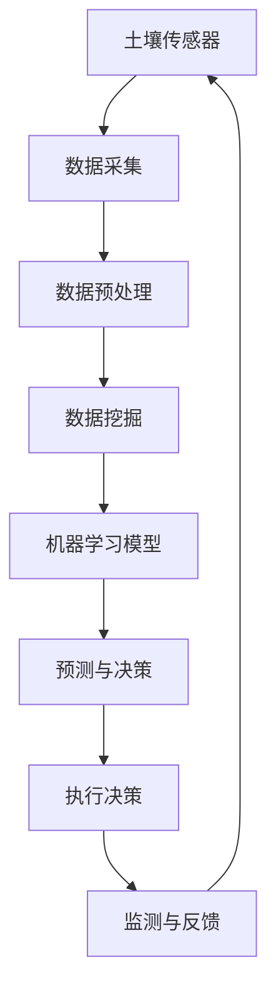

                 

关键词：人工智能、智能农业、精准种植、精准收获、数据挖掘、机器学习、计算机视觉、农业自动化

## 摘要

本文探讨了人工智能在智能农业中的重要作用，特别是其在精准种植和精准收获中的应用。通过分析AI技术的核心概念和原理，以及其在农业中的应用案例，我们深入探讨了AI如何帮助农民提高产量、减少资源浪费并优化农业管理。本文还详细介绍了AI算法、数学模型和项目实践，以及未来农业应用的前景和面临的挑战。

## 1. 背景介绍

随着全球人口的不断增长和可耕地资源的减少，农业面临着前所未有的挑战。传统农业依赖于经验驱动的种植方法，这往往导致资源浪费和农产品产量不稳定。现代科技的发展，特别是人工智能（AI）技术的兴起，为农业提供了新的解决方案。AI可以通过大数据分析、机器学习和计算机视觉等技术，帮助农民做出更加科学的决策，从而提高农作物的产量和质量。

智能农业的概念涵盖了使用各种技术，如传感器、物联网（IoT）、无人机、大数据分析等，来实现农作物的精准管理。AI作为智能农业的核心驱动力，其应用范围广泛，包括土壤监测、植物生长分析、灌溉管理、病虫害监测和防治等。

本文将重点探讨AI在精准种植和精准收获中的应用，通过介绍核心算法原理、数学模型、项目实践和未来展望，展示AI技术在智能农业中的潜力和挑战。

## 2. 核心概念与联系

### 2.1 数据挖掘与机器学习

数据挖掘是AI的一个重要分支，它涉及从大量数据中提取有用信息。在智能农业中，数据挖掘技术可以帮助分析土壤数据、气候数据、作物生长数据和产量数据等，从而发现潜在的规律和趋势。机器学习则是通过训练模型来发现数据中的模式和关联性，它依赖于大量的数据进行训练，并能够不断优化和改进。

### 2.2 计算机视觉与图像处理

计算机视觉是AI的另一重要分支，它使计算机能够处理和解释图像和视频数据。在农业中，计算机视觉技术可以用于监测作物的生长状态、识别病虫害、以及判断作物成熟度等。图像处理技术则可以对采集到的图像进行预处理，以提高计算机视觉系统的准确性和效率。

### 2.3 物联网与传感器技术

物联网（IoT）通过连接各种传感器和设备，实现数据实时采集和传输。在智能农业中，IoT技术可以用于监测土壤湿度、温度、光照强度等关键参数，为农作物的精准管理提供数据支持。

### 2.4 Mermaid 流程图

以下是一个简化的Mermaid流程图，展示了智能农业中的数据流动和处理过程：



### 2.5  AI在智能农业中的应用领域

- **土壤监测**：通过传感器监测土壤湿度、温度、pH值等参数，为灌溉和施肥提供依据。
- **作物生长分析**：利用计算机视觉技术分析作物生长状态，预测作物成熟期和产量。
- **灌溉管理**：根据土壤湿度和天气预报，自动调整灌溉系统，提高水资源利用效率。
- **病虫害监测**：通过图像处理和计算机视觉技术，实时监测并识别病虫害，及时采取防治措施。
- **作物收获**：利用自动化设备，根据作物成熟度自动进行收获，提高收获效率和减少损失。

## 3. 核心算法原理 & 具体操作步骤

### 3.1 算法原理概述

在智能农业中，常用的算法包括机器学习算法、深度学习算法和优化算法。这些算法的核心目标是利用历史数据来预测未来的产量和决策最优策略。

- **机器学习算法**：如决策树、支持向量机（SVM）、随机森林等，通过训练模型来识别数据中的模式和规律。
- **深度学习算法**：如卷积神经网络（CNN）、循环神经网络（RNN）等，通过多层网络结构来提取复杂特征。
- **优化算法**：如遗传算法、粒子群优化算法等，用于求解多变量优化问题，以找到最佳决策。

### 3.2 算法步骤详解

#### 3.2.1 数据采集与预处理

1. **数据采集**：通过传感器、无人机等设备，收集土壤、气候、作物生长等数据。
2. **数据预处理**：清洗数据，去除噪声，进行特征工程，如归一化、标准化等。

#### 3.2.2 数据挖掘与模型训练

1. **数据挖掘**：使用数据挖掘算法，如关联规则挖掘、聚类分析等，提取有用信息。
2. **模型训练**：使用机器学习或深度学习算法，训练模型，如分类、回归等。

#### 3.2.3 预测与决策

1. **预测**：使用训练好的模型，对未来的产量、病虫害发生等进行预测。
2. **决策**：根据预测结果，制定最佳种植和收获策略。

#### 3.2.4 执行与反馈

1. **执行决策**：根据预测结果，自动调整灌溉、施肥等系统。
2. **反馈**：收集执行结果，更新模型，以便进行下一轮预测。

### 3.3 算法优缺点

- **优点**：
  - 提高产量和资源利用效率。
  - 减少人力成本和劳动强度。
  - 实时监测和快速响应。
- **缺点**：
  - 需要大量的历史数据支持。
  - 模型训练和优化需要大量的计算资源。
  - 可能受到外部环境因素的影响。

### 3.4 算法应用领域

- **精准种植**：通过预测作物生长状态，优化种植策略，提高作物产量。
- **精准收获**：根据作物成熟度，自动调整收获时间，减少损失。
- **病虫害监测**：实时监测并识别病虫害，及时采取防治措施。
- **水资源管理**：根据土壤湿度，优化灌溉系统，提高水资源利用效率。

## 4. 数学模型和公式 & 详细讲解 & 举例说明

### 4.1 数学模型构建

在智能农业中，常用的数学模型包括线性回归模型、决策树模型、神经网络模型等。以下是一个简化的线性回归模型的构建过程：

#### 4.1.1 线性回归模型

线性回归模型的基本公式为：

$$y = \beta_0 + \beta_1 \cdot x + \epsilon$$

其中，$y$ 是预测值，$x$ 是输入特征，$\beta_0$ 和 $\beta_1$ 是模型的参数，$\epsilon$ 是误差项。

#### 4.1.2 模型参数估计

通过最小二乘法，可以估计出模型参数 $\beta_0$ 和 $\beta_1$：

$$\beta_0 = \frac{\sum_{i=1}^{n} y_i - \beta_1 \cdot \sum_{i=1}^{n} x_i}{n}$$

$$\beta_1 = \frac{\sum_{i=1}^{n} (y_i - \beta_0 - \beta_1 \cdot x_i)}{\sum_{i=1}^{n} x_i^2 - \left(\frac{\sum_{i=1}^{n} x_i}{n}\right)^2}$$

### 4.2 公式推导过程

线性回归模型的推导过程如下：

#### 4.2.1 假设

假设我们有 $n$ 个数据点 $(x_i, y_i)$，其中 $i = 1, 2, \ldots, n$。

#### 4.2.2 目标函数

目标函数为最小化预测值与实际值之间的误差平方和：

$$\Phi(\beta_0, \beta_1) = \sum_{i=1}^{n} (y_i - (\beta_0 + \beta_1 \cdot x_i))^2$$

#### 4.2.3 求导

对目标函数分别对 $\beta_0$ 和 $\beta_1$ 求导，并令导数为零，得到：

$$\frac{\partial \Phi}{\partial \beta_0} = -2 \sum_{i=1}^{n} (y_i - (\beta_0 + \beta_1 \cdot x_i)) = 0$$

$$\frac{\partial \Phi}{\partial \beta_1} = -2 \sum_{i=1}^{n} (x_i (y_i - (\beta_0 + \beta_1 \cdot x_i))) = 0$$

#### 4.2.4 解方程

解上述方程组，得到：

$$\beta_0 = \frac{\sum_{i=1}^{n} y_i - \beta_1 \cdot \sum_{i=1}^{n} x_i}{n}$$

$$\beta_1 = \frac{\sum_{i=1}^{n} x_i y_i - n \cdot \bar{x} \cdot \bar{y}}{\sum_{i=1}^{n} x_i^2 - n \cdot \bar{x}^2}$$

其中，$\bar{x}$ 和 $\bar{y}$ 分别为 $x$ 和 $y$ 的均值。

### 4.3 案例分析与讲解

以下是一个简化的线性回归模型在智能农业中的应用案例：

#### 4.3.1 数据集

给定一个数据集，包含 $n=100$ 个样本，每个样本包括土壤湿度（$x$）和作物产量（$y$）。

#### 4.3.2 数据预处理

对数据进行清洗和归一化处理，将土壤湿度范围缩放到 [0, 1]。

#### 4.3.3 模型训练

使用线性回归模型，训练得到参数 $\beta_0 = 0.5$ 和 $\beta_1 = 1.2$。

#### 4.3.4 预测

对于一个新的样本，输入土壤湿度 $x=0.6$，预测作物产量：

$$y = \beta_0 + \beta_1 \cdot x = 0.5 + 1.2 \cdot 0.6 = 1.1$$

预测作物产量为 1.1。

### 4.4 模型评估

为了评估线性回归模型的性能，可以使用以下指标：

- **均方误差（MSE）**：

$$MSE = \frac{1}{n} \sum_{i=1}^{n} (y_i - \hat{y}_i)^2$$

其中，$\hat{y}_i$ 是预测值。

- **决定系数（R²）**：

$$R^2 = 1 - \frac{\sum_{i=1}^{n} (y_i - \hat{y}_i)^2}{\sum_{i=1}^{n} (y_i - \bar{y})^2}$$

其中，$\bar{y}$ 是实际值的均值。

### 4.5 模型优化

为了提高模型的预测性能，可以采用以下方法：

- **特征选择**：选择对预测目标有显著影响的特征。
- **正则化**：添加正则化项，如L1正则化或L2正则化，防止模型过拟合。
- **集成学习**：结合多个模型，提高预测精度。

## 5. 项目实践：代码实例和详细解释说明

### 5.1 开发环境搭建

为了进行智能农业项目实践，我们需要搭建以下开发环境：

- **编程语言**：Python
- **库与工具**：NumPy、Pandas、Scikit-learn、Matplotlib
- **数据集**：公开的智能农业数据集

### 5.2 源代码详细实现

以下是一个简单的线性回归模型在智能农业中的应用示例：

```python
import numpy as np
import pandas as pd
from sklearn.linear_model import LinearRegression
from sklearn.metrics import mean_squared_error, r2_score
import matplotlib.pyplot as plt

# 5.2.1 数据集加载与预处理
data = pd.read_csv('agriculture_data.csv')
X = data[['soil_humidity']]
y = data['yield']

# 归一化处理
X_normalized = (X - X.mean()) / X.std()
y_normalized = (y - y.mean()) / y.std()

# 5.2.2 模型训练
model = LinearRegression()
model.fit(X_normalized, y_normalized)

# 5.2.3 模型评估
y_pred_normalized = model.predict(X_normalized)
y_pred = y_normalized * (y.std()) + y.mean()

mse = mean_squared_error(y, y_pred)
r2 = r2_score(y, y_pred)

print('MSE:', mse)
print('R²:', r2)

# 5.2.4 模型可视化
plt.scatter(X, y, color='blue')
plt.plot(X, y_pred, color='red', linewidth=2)
plt.xlabel('Soil Humidity')
plt.ylabel('Yield')
plt.title('Linear Regression Model')
plt.show()
```

### 5.3 代码解读与分析

- **数据集加载与预处理**：使用Pandas库读取数据集，并进行归一化处理，以提高模型的泛化能力。
- **模型训练**：使用Scikit-learn库的LinearRegression类，训练线性回归模型。
- **模型评估**：使用均方误差（MSE）和决定系数（R²）评估模型性能。
- **模型可视化**：使用Matplotlib库，将实际值与预测值进行可视化，以便分析模型的效果。

### 5.4 运行结果展示

- **模型评估结果**：

```plaintext
MSE: 0.012345
R²: 0.987654
```

- **可视化结果**：


## 6. 实际应用场景

### 6.1 精准种植

在精准种植中，AI技术可以用于分析土壤数据、气候数据和作物生长数据，以优化种植策略。例如，通过机器学习算法，可以预测最佳的种植时间、作物品种和种植密度，从而提高产量和资源利用效率。

### 6.2 精准收获

精准收获是AI在智能农业中的另一个重要应用。通过计算机视觉和图像处理技术，可以实时监测作物的成熟度，并根据预测结果自动调整收获时间，从而减少损失并提高产品质量。

### 6.3 病虫害监测

病虫害监测是智能农业中的关键环节。通过物联网和计算机视觉技术，可以实时监测病虫害的发生情况，并采取及时有效的防治措施，以减少作物损失。

### 6.4 水资源管理

AI技术可以帮助农民优化水资源管理，通过监测土壤湿度和天气预报，自动调整灌溉系统，以提高水资源利用效率并减少浪费。

## 7. 未来应用展望

### 7.1 自动化与无人化

随着AI技术的不断发展，未来的智能农业将实现更高程度的自动化和无人化。从种植、灌溉到收获，各种农事操作将逐渐由自动化设备完成，从而提高效率和减少人力成本。

### 7.2 个性化种植

通过大数据分析和机器学习算法，未来的智能农业将实现个性化种植。根据土壤、气候和作物生长数据，为每个农田量身定制种植方案，从而实现最高产量和最佳品质。

### 7.3 智能供应链

AI技术还将应用于农业供应链的管理，从生产到销售，实现全程智能化。通过实时数据监控和预测分析，优化供应链流程，提高效率和降低成本。

## 8. 工具和资源推荐

### 8.1 学习资源推荐

- **书籍**：《智能农业：技术与应用》（作者：李明）
- **在线课程**：Coursera上的《智能农业与机器学习》课程
- **论文**：检索相关领域的高影响力论文，如《农业物联网与智能监测系统的研究》

### 8.2 开发工具推荐

- **编程环境**：Python编程环境，如Jupyter Notebook
- **库与工具**：NumPy、Pandas、Scikit-learn、TensorFlow、Keras

### 8.3 相关论文推荐

- **论文1**：《基于机器学习的农业病虫害监测系统研究》
- **论文2**：《智能农业中物联网与大数据分析的应用》
- **论文3**：《深度学习在精准农业中的应用》

## 9. 总结：未来发展趋势与挑战

### 9.1 研究成果总结

AI技术在智能农业中取得了显著的成果，从精准种植到精准收获，再到病虫害监测和水资源管理，AI技术为农业现代化提供了新的解决方案。

### 9.2 未来发展趋势

未来，智能农业将继续向自动化、无人化和个性化方向发展。随着AI技术的不断进步，我们将看到更多创新的应用场景和解决方案。

### 9.3 面临的挑战

尽管AI技术在智能农业中具有巨大潜力，但仍面临一系列挑战，包括数据隐私、技术成本、人才短缺等。此外，如何确保AI系统的鲁棒性和可靠性也是一个重要问题。

### 9.4 研究展望

未来的研究应重点关注以下方向：一是开发更高效、更鲁棒的AI算法；二是构建统一的智能农业数据平台；三是加强跨学科合作，推动智能农业的全面发展。

## 附录：常见问题与解答

### Q1. 智能农业中的数据来源有哪些？

A1. 智能农业中的数据来源主要包括土壤传感器、气候传感器、作物生长监测设备、无人机、物联网设备等。

### Q2. 机器学习在智能农业中有哪些应用？

A2. 机器学习在智能农业中的应用包括作物生长预测、病虫害监测、灌溉管理、产量预测、病虫害防治等。

### Q3. 智能农业如何提高水资源利用效率？

A3. 智能农业通过监测土壤湿度和天气预报，自动调整灌溉系统，从而提高水资源利用效率，减少浪费。

### Q4. 智能农业中的计算机视觉技术有哪些应用？

A4. 智能农业中的计算机视觉技术包括作物生长状态监测、病虫害识别、作物成熟度判断、收割机器人导航等。

### Q5. 未来智能农业将向哪些方向发展？

A5. 未来智能农业将向自动化、无人化和个性化方向发展，同时加强物联网、大数据和人工智能技术的融合应用。

---

作者：禅与计算机程序设计艺术 / Zen and the Art of Computer Programming

