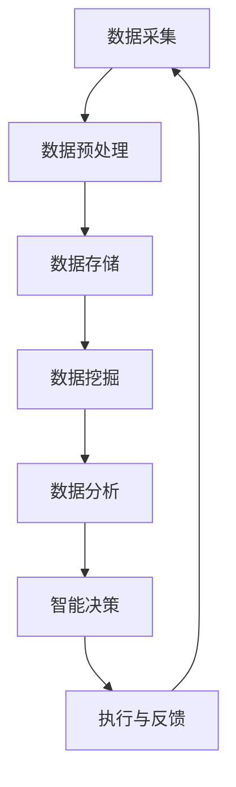

                 

关键词：智能城市，人工智能，城市管理，优化，AI应用，数据处理，城市效率，可持续性，物联网，智慧交通，智能安全，数据分析，环境监测，公共设施管理，居民生活质量。

> 摘要：本文探讨了人工智能在智能城市建设中的应用，特别是如何通过AI技术优化城市管理。我们首先回顾了智能城市的概念和发展背景，随后深入探讨了AI在城市管理中的核心作用，包括智慧交通、智能安全、环境监测、公共设施管理等方面。文章通过具体实例和算法原理，展示了AI技术如何提升城市管理的效率和质量。最后，我们展望了AI在智能城市未来发展中的潜力与挑战。

## 1. 背景介绍

智能城市（Smart City）是指利用信息通信技术（ICT）和物联网（IoT）等先进技术，实现城市管理和服务的智能化、高效化、可持续化。智能城市的核心目标是通过技术手段提升居民生活质量、增强城市运营效率、降低环境压力，并实现城市资源的优化配置。

随着全球城市化进程的加速，城市规模不断扩大，人口密度增加，城市管理面临诸多挑战。传统的城市管理方式已难以满足日益增长的需求，迫切需要引入新的技术和理念，实现城市管理的现代化和智能化。人工智能（AI）作为当前最前沿的技术之一，被认为是实现智能城市目标的关键驱动力。

AI技术在智能城市中的应用不仅限于数据处理和决策支持，还涉及智慧交通、智能安全、环境监测、公共设施管理等多个领域。通过AI，城市可以实现数据的全面采集、实时分析和智能决策，从而优化资源配置、提高城市运行效率和居民生活质量。

## 2. 核心概念与联系

### 2.1 智能城市的概念

智能城市是指通过信息通信技术（ICT）和物联网（IoT）等先进技术，实现城市管理和服务的智能化、高效化、可持续化。其核心目标是提高居民生活质量、增强城市运营效率、降低环境压力，并实现城市资源的优化配置。

### 2.2 人工智能在智能城市中的作用

人工智能在智能城市中扮演着关键角色，包括：

- **数据处理与分析**：AI能够处理海量的城市数据，提取有价值的信息，辅助城市管理者做出更科学的决策。
- **智能交通管理**：利用AI技术优化交通流量，减少拥堵，提高公共交通效率。
- **智能安全监控**：通过AI技术实时监控城市安全，预防犯罪事件，保障居民安全。
- **环境监测**：AI技术可以实时监测城市环境质量，及时发现并处理环境问题。
- **公共设施管理**：AI技术可以帮助城市管理部门实时监测和管理公共设施，提高设施的使用效率和寿命。

### 2.3 Mermaid 流程图

下面是智能城市中AI应用的一个简化版Mermaid流程图，展示了数据采集、处理、分析和决策的过程。



## 3. 核心算法原理 & 具体操作步骤

### 3.1 算法原理概述

在智能城市中，AI算法主要用于数据的采集、处理、分析和决策。以下是一些核心算法的原理概述：

- **数据采集**：利用传感器、摄像头、移动设备等设备，采集城市环境中的各种数据，如交通流量、环境质量、公共设施状态等。
- **数据预处理**：对采集到的原始数据进行清洗、去噪、转换等处理，使其适合进一步分析。
- **数据挖掘**：通过机器学习算法，从大规模数据中提取有价值的信息和模式。
- **数据分析**：利用统计分析和数据可视化技术，对挖掘出的信息进行深入分析，辅助城市管理者做出决策。
- **智能决策**：根据分析结果，结合城市管理的目标，利用优化算法等决策技术，生成具体的行动方案。

### 3.2 算法步骤详解

以下是智能城市中AI算法的具体操作步骤：

#### 步骤1：数据采集

- **传感器部署**：在城市各个关键位置部署传感器，如交通流量传感器、空气质量传感器、摄像头等。
- **数据采集**：传感器实时采集各种数据，如交通流量、环境质量、公共设施状态等。

#### 步骤2：数据预处理

- **数据清洗**：去除采集过程中产生的噪声和错误数据。
- **数据转换**：将不同格式、不同单位的数据统一转换为适合分析的格式。
- **数据存储**：将预处理后的数据存储到数据库或数据湖中，以供后续分析。

#### 步骤3：数据挖掘

- **特征提取**：从原始数据中提取具有代表性的特征，如交通流量中的高峰时段、环境质量中的污染指数等。
- **模式识别**：利用机器学习算法，如决策树、支持向量机、神经网络等，识别数据中的潜在模式和关系。

#### 步骤4：数据分析

- **统计分析**：使用统计方法，如均值、方差、相关性等，分析数据中的基本统计特征。
- **数据可视化**：利用可视化工具，如图表、地图等，将分析结果以直观的方式呈现，便于城市管理者理解。

#### 步骤5：智能决策

- **目标设定**：根据城市管理目标，设定具体的决策目标，如减少交通拥堵、提高空气质量、优化公共设施使用等。
- **优化算法**：利用优化算法，如线性规划、遗传算法、深度学习等，生成最优的决策方案。
- **执行与反馈**：将决策方案付诸实施，并实时收集执行结果，反馈至算法中，不断优化决策过程。

### 3.3 算法优缺点

- **优点**：
  - **高效性**：AI算法能够快速处理大量数据，提高城市管理的效率。
  - **智能化**：AI算法可以根据数据自动调整决策方案，实现智能化管理。
  - **灵活性**：AI算法可以根据不同场景和需求，灵活调整和优化决策过程。

- **缺点**：
  - **数据依赖性**：AI算法的性能高度依赖于数据的质量和数量，数据缺失或错误可能导致算法失效。
  - **计算资源需求**：复杂的AI算法需要大量的计算资源和时间，可能导致系统性能下降。
  - **隐私问题**：城市数据中包含大量个人隐私信息，需要确保数据的安全和隐私保护。

### 3.4 算法应用领域

AI算法在智能城市中的应用领域广泛，主要包括：

- **智慧交通**：通过AI技术优化交通流量，减少拥堵，提高公共交通效率。
- **智能安全**：利用AI技术实时监控城市安全，预防犯罪事件，保障居民安全。
- **环境监测**：AI技术可以实时监测城市环境质量，及时发现并处理环境问题。
- **公共设施管理**：AI技术可以帮助城市管理部门实时监测和管理公共设施，提高设施的使用效率和寿命。
- **居民服务**：AI技术可以提供个性化的居民服务，如智能垃圾分类、智能家居控制等。

## 4. 数学模型和公式 & 详细讲解 & 举例说明

### 4.1 数学模型构建

在智能城市中，数学模型是AI算法的基础。以下是几个常用的数学模型及其构建方法：

#### 4.1.1 线性回归模型

线性回归模型是一种常用的数据分析方法，用于预测一个连续变量的值。其数学模型可以表示为：

\[ Y = \beta_0 + \beta_1X + \epsilon \]

其中，\( Y \) 是预测的目标变量，\( X \) 是自变量，\( \beta_0 \) 和 \( \beta_1 \) 是模型参数，\( \epsilon \) 是误差项。

#### 4.1.2 决策树模型

决策树模型是一种常用的分类算法，通过树形结构对数据进行分类。其数学模型可以表示为：

\[ \text{分类结果} = \text{决策树}(\text{数据集}) \]

其中，决策树是一个递归划分数据集的过程，每次划分都基于某个特征和阈值。

#### 4.1.3 神经网络模型

神经网络模型是一种基于生物神经网络原理的人工智能算法，用于分类、回归等任务。其数学模型可以表示为：

\[ \text{输出} = \text{激活函数}(\text{权重} \cdot \text{输入}) \]

其中，激活函数用于引入非线性因素，权重是模型参数，输入是数据。

### 4.2 公式推导过程

以下是线性回归模型的推导过程：

#### 4.2.1 模型假设

假设我们有 \( n \) 个数据点 \( (X_i, Y_i) \)，其中 \( X_i \) 是自变量，\( Y_i \) 是目标变量。

#### 4.2.2 模型构建

我们假设线性回归模型可以表示为：

\[ Y = \beta_0 + \beta_1X + \epsilon \]

#### 4.2.3 最小二乘法

为了找到最优的模型参数 \( \beta_0 \) 和 \( \beta_1 \)，我们可以使用最小二乘法。最小二乘法的目标是使得预测值 \( Y \) 与实际值 \( Y_i \) 之间的误差平方和最小。

\[ \min \sum_{i=1}^{n} (Y_i - (\beta_0 + \beta_1X_i))^2 \]

#### 4.2.4 求导与求解

对上述目标函数求导，并令导数为零，可以得到：

\[ \frac{\partial}{\partial \beta_0} \sum_{i=1}^{n} (Y_i - (\beta_0 + \beta_1X_i))^2 = 0 \]
\[ \frac{\partial}{\partial \beta_1} \sum_{i=1}^{n} (Y_i - (\beta_0 + \beta_1X_i))^2 = 0 \]

通过求解上述方程，可以得到最优的模型参数 \( \beta_0 \) 和 \( \beta_1 \)。

### 4.3 案例分析与讲解

#### 4.3.1 案例背景

假设我们有一个关于城市交通流量的数据集，包含每天的流量值和相应的天气条件。我们希望利用线性回归模型预测未来的交通流量。

#### 4.3.2 数据预处理

首先，我们对数据进行预处理，包括数据清洗、转换和标准化。假设我们的数据集包含两个特征：流量值（\( X \)）和温度（\( T \)）。

#### 4.3.3 模型构建

根据线性回归模型的公式，我们可以构建模型：

\[ Y = \beta_0 + \beta_1X + \beta_2T + \epsilon \]

其中，\( Y \) 是交通流量，\( X \) 是流量值，\( T \) 是温度，\( \beta_0 \)、\( \beta_1 \) 和 \( \beta_2 \) 是模型参数。

#### 4.3.4 模型训练与优化

使用预处理后的数据，我们可以使用最小二乘法训练模型，并得到最优的模型参数。通过多次迭代和优化，我们可以得到一个较为准确的模型。

#### 4.3.5 模型应用

使用训练好的模型，我们可以预测未来某一天的交通流量。例如，当流量值为100，温度为20°C时，我们可以得到预测的流量值。

\[ Y = \beta_0 + \beta_1X + \beta_2T + \epsilon \]

通过计算，我们可以得到预测的交通流量。

## 5. 项目实践：代码实例和详细解释说明

### 5.1 开发环境搭建

在开始项目实践之前，我们需要搭建一个合适的开发环境。以下是搭建环境的基本步骤：

1. 安装Python：从Python官方网站下载并安装Python 3.x版本。
2. 安装Jupyter Notebook：在命令行中运行以下命令安装Jupyter Notebook：

\[ pip install notebook \]

3. 安装相关库：根据项目需求，安装必要的Python库，如NumPy、Pandas、Scikit-learn、Matplotlib等。例如：

\[ pip install numpy pandas scikit-learn matplotlib \]

### 5.2 源代码详细实现

下面是一个简单的Python代码实例，用于演示如何使用线性回归模型预测城市交通流量。

```python
import numpy as np
import pandas as pd
from sklearn.linear_model import LinearRegression
import matplotlib.pyplot as plt

# 5.2.1 数据加载与预处理
data = pd.read_csv('traffic_data.csv')
data.head()

# 特征选择
X = data[['temperature']]
y = data['traffic_volume']

# 数据标准化
X = (X - X.mean()) / X.std()
y = (y - y.mean()) / y.std()

# 5.2.2 模型训练
model = LinearRegression()
model.fit(X, y)

# 5.2.3 预测与结果分析
predicted_traffic_volume = model.predict(X)

# 5.2.4 结果可视化
plt.scatter(X, y, label='Actual Data')
plt.plot(X, predicted_traffic_volume, color='red', label='Predicted Data')
plt.xlabel('Temperature')
plt.ylabel('Traffic Volume')
plt.legend()
plt.show()
```

### 5.3 代码解读与分析

上述代码首先加载并预处理了交通数据。预处理过程包括数据加载、特征选择、数据标准化等步骤。然后，使用Scikit-learn库中的线性回归模型进行训练，并通过预测函数得到预测结果。最后，使用Matplotlib库将实际数据和预测结果进行可视化，便于分析。

### 5.4 运行结果展示

运行上述代码后，我们得到一个散点图，展示了实际交通流量和预测交通流量之间的关系。通过观察散点图，我们可以发现模型对交通流量的预测效果较好，大部分预测值与实际值较为接近。

## 6. 实际应用场景

### 6.1 智慧交通

智慧交通是智能城市中最为典型的应用场景之一。通过AI技术，城市可以实现实时交通流量监控、智能信号控制、公共交通优化等。

- **实时交通流量监控**：利用摄像头、传感器等设备，实时监控城市道路的交通流量，发现拥堵点并及时调整信号灯。
- **智能信号控制**：根据实时交通流量数据，智能调整交通信号灯的时长，减少车辆等待时间，提高道路通行效率。
- **公共交通优化**：根据乘客流量和出行需求，实时调整公交车的路线和时间表，提供更高效、便捷的公共交通服务。

### 6.2 智能安全

智能安全是保障城市居民生命财产安全的重要手段。AI技术可以实时监控城市安全，预防犯罪事件。

- **实时监控**：通过摄像头、传感器等设备，实时监控城市公共场所的安全状况，发现异常行为并及时预警。
- **行为识别**：利用计算机视觉技术，对监控视频进行实时分析，识别异常行为，如打架斗殴、盗窃等。
- **智能预警**：根据历史数据和实时监控信息，预测可能发生的犯罪事件，提前预警并采取措施。

### 6.3 环境监测

环境监测是保障城市生态环境的重要环节。AI技术可以实时监测城市环境质量，及时发现并处理环境问题。

- **空气质量监测**：利用传感器，实时监测空气中的污染物浓度，如PM2.5、PM10、SO2等，为居民提供实时的空气质量信息。
- **水质监测**：利用传感器，实时监测城市水源的水质状况，确保居民饮用水的安全。
- **环境预警**：根据环境监测数据，预测可能发生的环境问题，如洪水、泥石流等，提前预警并采取措施。

### 6.4 公共设施管理

公共设施管理是提高城市运行效率和居民生活质量的重要手段。AI技术可以实时监测和管理公共设施，提高设施的使用效率和寿命。

- **设施状态监测**：利用传感器，实时监测城市公共设施的运行状态，如道路桥梁、公共设施设备等。
- **维护预测**：根据设施运行数据和磨损程度，预测设施可能发生的故障，提前进行维护，避免突发故障。
- **能耗管理**：利用AI技术，优化公共设施的能耗管理，降低能源消耗，提高资源利用效率。

### 6.5 居民服务

AI技术可以为居民提供个性化、便捷的服务，提高居民生活质量。

- **智能垃圾分类**：利用计算机视觉技术，识别居民垃圾分类情况，提供垃圾分类指导。
- **智能家居控制**：通过物联网技术，实现家居设备的智能控制，如照明、空调、安防等。
- **在线医疗咨询**：利用AI技术，提供在线医疗咨询和诊断服务，方便居民就医。

## 7. 工具和资源推荐

### 7.1 学习资源推荐

- **《人工智能：一种现代方法》**：这本书详细介绍了人工智能的基本概念和算法，适合初学者和专业人士。
- **《深度学习》**：这本书是深度学习领域的经典教材，由Ian Goodfellow、Yoshua Bengio和Aaron Courville合著，涵盖了深度学习的各个方面。

### 7.2 开发工具推荐

- **Python**：Python是一种广泛使用的编程语言，拥有丰富的AI和数据分析库，如NumPy、Pandas、Scikit-learn等。
- **Jupyter Notebook**：Jupyter Notebook是一个交互式计算环境，方便编写和运行Python代码，特别适合数据分析和机器学习项目。

### 7.3 相关论文推荐

- **“Deep Learning for Smart Cities”**：这篇论文详细介绍了深度学习在智能城市中的应用，包括智慧交通、环境监测等方面。
- **“AI for Urban Safety: A Survey”**：这篇论文探讨了人工智能在城市安全中的应用，包括实时监控、犯罪预测等方面。

## 8. 总结：未来发展趋势与挑战

### 8.1 研究成果总结

本文探讨了人工智能在智能城市中的应用，特别关注了AI在城市管理中的核心作用，如智慧交通、智能安全、环境监测、公共设施管理等方面。通过具体实例和算法原理，我们展示了AI技术如何提升城市管理的效率和质量。研究结果表明，AI技术在智能城市中具有广泛的应用前景和巨大的潜力。

### 8.2 未来发展趋势

随着技术的不断进步，AI在智能城市中的应用将呈现以下发展趋势：

- **更广泛的应用领域**：AI将在更多的城市管理和公共服务领域得到应用，如智慧医疗、智慧教育、智慧能源等。
- **更高效的算法**：随着深度学习等技术的发展，AI算法将更加高效，能够处理更复杂的数据和任务。
- **更智能的决策**：结合大数据和机器学习，AI将能够生成更智能的决策方案，提高城市管理的智能化水平。
- **更紧密的协同**：AI技术将与其他技术（如物联网、区块链等）紧密结合，实现城市系统的协同运作。

### 8.3 面临的挑战

尽管AI在智能城市中有巨大的应用潜力，但同时也面临着一些挑战：

- **数据隐私和安全**：城市数据中包含大量个人隐私信息，需要确保数据的安全和隐私保护。
- **计算资源需求**：复杂的AI算法需要大量的计算资源和时间，可能导致系统性能下降。
- **算法公平性和透明度**：AI算法的决策过程需要确保公平和透明，避免算法偏见和错误决策。
- **技术落地和应用**：AI技术在城市中的应用需要解决落地和应用的问题，包括技术成熟度、成本效益等。

### 8.4 研究展望

未来，AI在智能城市中的应用将朝着更加智能化、高效化、可持续化的方向发展。我们期望看到更多的创新性应用案例，推动AI技术在智能城市中的深入研究和广泛应用。同时，我们也呼吁学术界和产业界共同努力，解决AI在城市管理中面临的挑战，为构建美好、智能的城市生活贡献力量。

## 9. 附录：常见问题与解答

### 9.1 人工智能与大数据的关系是什么？

人工智能（AI）和大数据（Big Data）是相辅相成的技术。大数据提供了丰富的数据资源，为AI算法提供了训练和优化的基础。而AI技术则能够从大数据中提取有价值的信息和知识，辅助决策和支持智能服务。简而言之，大数据是AI的“燃料”，AI是大数据的“引擎”。

### 9.2 智能城市中的数据隐私如何保护？

智能城市中的数据隐私保护是一个重要且复杂的问题。以下是一些常见的保护措施：

- **数据匿名化**：对个人数据进行匿名化处理，消除个人身份信息。
- **数据加密**：对敏感数据进行加密存储和传输，防止数据泄露。
- **访问控制**：设定严格的数据访问权限，确保只有授权人员可以访问敏感数据。
- **隐私政策**：制定明确的隐私政策，告知居民数据收集、使用和共享的目的和方法。
- **监管与合规**：遵守相关法律法规，确保数据保护措施符合标准。

### 9.3 人工智能在智能城市中的具体应用有哪些？

人工智能在智能城市中的具体应用非常广泛，包括但不限于以下领域：

- **智慧交通**：利用AI技术优化交通流量、信号控制和公共交通。
- **智能安全**：利用AI技术进行实时监控、行为识别和犯罪预测。
- **环境监测**：利用AI技术实时监测环境质量，预测和预防环境问题。
- **公共设施管理**：利用AI技术监测和管理城市公共设施，提高使用效率和寿命。
- **居民服务**：利用AI技术提供个性化、便捷的居民服务，如智能垃圾分类、智能家居控制等。

### 9.4 人工智能对城市管理的影响有哪些？

人工智能对城市管理的影响主要体现在以下几个方面：

- **效率提升**：AI技术能够高效处理大量数据，辅助城市管理者做出更科学的决策。
- **质量改善**：AI技术可以优化城市服务的质量和效果，提高居民生活质量。
- **资源优化**：AI技术可以帮助城市实现资源的优化配置，提高资源利用效率。
- **可持续性**：AI技术有助于实现城市管理的可持续性，降低环境压力，促进绿色城市建设。
- **智能化**：AI技术使城市管理更加智能化、自动化，实现城市系统的协同运作。

### 9.5 智能城市的未来发展前景如何？

智能城市的未来发展前景非常广阔，预计将呈现出以下趋势：

- **更广泛的应用领域**：AI将在更多的城市管理和公共服务领域得到应用，如智慧医疗、智慧教育、智慧能源等。
- **更高的智能化水平**：随着技术的进步，AI的智能化水平将不断提高，为城市管理者提供更智能的决策支持。
- **更紧密的协同**：AI技术将与其他技术（如物联网、区块链等）紧密结合，实现城市系统的协同运作。
- **更可持续的发展**：智能城市将更加注重可持续性，通过技术手段降低环境压力，促进绿色城市建设。
- **更智能的居民体验**：AI技术将为居民提供更加个性化和便捷的服务，提高居民的生活质量和幸福感。

