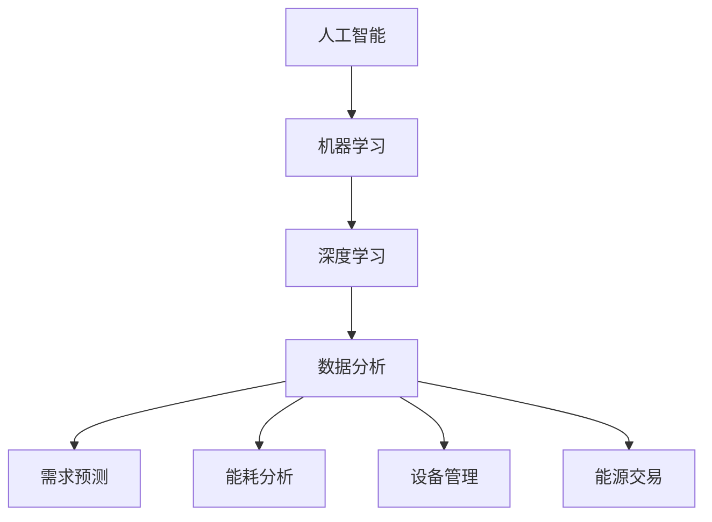

                 

关键词：智能能源管理，人工智能，优化算法，能源效率，预测分析，能源消耗

> 摘要：本文将探讨人工智能在智能能源管理中的应用，通过对现有技术的分析，介绍如何利用AI技术优化能源使用效率，实现可持续发展的目标。文章分为多个部分，包括背景介绍、核心概念与联系、核心算法原理、数学模型与公式、项目实践、实际应用场景、未来展望和工具资源推荐等内容。

## 1. 背景介绍

随着全球经济的快速发展和人们对生活质量的不断提高，能源消耗不断增加，能源问题日益凸显。同时，气候变化和环境污染问题也日益严峻，使得能源管理成为了全球范围内的一个热点话题。智能能源管理系统作为一种创新的解决方案，通过利用先进的计算技术和数据分析方法，实现了对能源的实时监控和优化管理，提高了能源使用效率。

智能能源管理主要包括以下几个方面的内容：

- **需求预测**：通过对历史数据和实时数据的分析，预测未来的能源需求，为能源调度提供科学依据。
- **能耗分析**：对能源消耗进行详细分析，找出能耗中的不合理部分，提出优化方案。
- **设备管理**：对能源设备进行实时监控和维护，确保其正常运行，降低故障率和维护成本。
- **能源交易**：利用能源市场数据，进行能源交易的预测和优化，实现能源的高效利用。

## 2. 核心概念与联系

在智能能源管理中，有几个核心概念和技术需要理解：

### 2.1 人工智能（AI）

人工智能是一种模拟人类智能的技术，通过算法和模型，使计算机能够执行复杂的任务，如学习、推理、识别和决策等。在智能能源管理中，AI技术主要用于需求预测、能耗分析和设备管理等方面。

### 2.2 机器学习（ML）

机器学习是人工智能的一个分支，通过训练模型来从数据中学习规律。在智能能源管理中，机器学习算法主要用于数据分析和预测。

### 2.3 深度学习（DL）

深度学习是机器学习的一个分支，通过多层神经网络来提取数据中的特征。在智能能源管理中，深度学习算法被广泛用于需求预测和能耗分析。

### 2.4 数据分析（DA）

数据分析是利用统计学和计算机科学方法，从大量数据中提取有价值信息的过程。在智能能源管理中，数据分析用于数据预处理、特征提取和结果评估等。

下面是智能能源管理中核心概念和技术的 Mermaid 流程图：



## 3. 核心算法原理 & 具体操作步骤

### 3.1 算法原理概述

在智能能源管理中，常用的算法包括决策树、支持向量机和神经网络等。这些算法通过学习历史数据，预测未来的能源需求和能耗情况，为能源管理提供科学依据。

### 3.2 算法步骤详解

1. 数据收集：收集历史能源数据、设备运行数据和外部环境数据等。
2. 数据预处理：对数据进行清洗、归一化和特征提取等处理。
3. 模型训练：使用机器学习算法训练模型，使模型能够从数据中学习到能源消耗的规律。
4. 模型评估：使用测试数据评估模型的性能，调整模型参数，提高预测准确性。
5. 预测分析：使用训练好的模型进行能源需求预测和能耗分析，为能源管理提供决策支持。

### 3.3 算法优缺点

- **决策树**：简单易懂，易于实现，但容易过拟合。
- **支持向量机**：具有良好的泛化能力，但训练时间较长。
- **神经网络**：能够处理复杂的非线性关系，但训练过程容易陷入局部最优。

### 3.4 算法应用领域

- **需求预测**：用于预测未来的能源需求，为能源调度提供依据。
- **能耗分析**：用于分析能源消耗的合理性，找出节能潜力。
- **设备管理**：用于监控设备运行状态，预测设备故障，实现预防性维护。

## 4. 数学模型和公式 & 详细讲解 & 举例说明

### 4.1 数学模型构建

在智能能源管理中，常用的数学模型包括线性回归、逻辑回归和支持向量机等。下面以线性回归为例，介绍数学模型的构建过程。

1. 假设输入特征为 $x_1, x_2, \ldots, x_n$，输出为 $y$，线性回归模型可以表示为：

   $$ y = \beta_0 + \beta_1 x_1 + \beta_2 x_2 + \ldots + \beta_n x_n $$

2. 模型参数为 $\beta_0, \beta_1, \beta_2, \ldots, \beta_n$，需要通过数据训练得到。

### 4.2 公式推导过程

线性回归模型的损失函数为平方损失：

$$ L(\beta) = \sum_{i=1}^n (y_i - \beta_0 - \beta_1 x_{i1} - \beta_2 x_{i2} - \ldots - \beta_n x_{in})^2 $$

为了最小化损失函数，对参数求偏导并令其等于零：

$$ \frac{\partial L}{\partial \beta_j} = -2 \sum_{i=1}^n (y_i - \beta_0 - \beta_1 x_{i1} - \beta_2 x_{i2} - \ldots - \beta_n x_{in}) x_{ij} = 0 $$

解上述方程组，得到参数的最小二乘估计：

$$ \beta_j = \frac{1}{n} \sum_{i=1}^n (y_i - \beta_0 - \beta_1 x_{i1} - \beta_2 x_{i2} - \ldots - \beta_n x_{in}) x_{ij} $$

### 4.3 案例分析与讲解

假设有一组数据，输入特征为温度 $x_1$ 和风速 $x_2$，输出为能源消耗 $y$。使用线性回归模型进行预测。

1. 数据收集：收集一段时间内的温度、风速和能源消耗数据。
2. 数据预处理：对数据进行归一化处理，使其在相同的尺度上。
3. 模型训练：使用训练数据训练线性回归模型，得到模型参数。
4. 模型评估：使用测试数据评估模型性能，计算预测误差。
5. 预测分析：使用训练好的模型进行能源消耗预测。

下面是训练数据和测试数据的部分数据：

| $x_1$ | $x_2$ | $y$ |
|-------|-------|------|
| 25    | 3     | 100  |
| 28    | 5     | 120  |
| 22    | 2     | 80   |
| 30    | 4     | 110  |

使用线性回归模型训练得到的参数为 $\beta_0 = 50$，$\beta_1 = 2$，$\beta_2 = 1$。

当输入特征为 $x_1 = 26$，$x_2 = 4$ 时，预测的能源消耗为：

$$ y = 50 + 2 \times 26 + 1 \times 4 = 108 $$

## 5. 项目实践：代码实例和详细解释说明

### 5.1 开发环境搭建

在Python中，可以使用Scikit-learn库实现线性回归模型。首先，需要安装Scikit-learn库：

```bash
pip install scikit-learn
```

### 5.2 源代码详细实现

以下是一个简单的线性回归模型实现：

```python
import numpy as np
import matplotlib.pyplot as plt
from sklearn.linear_model import LinearRegression

# 数据集
X = np.array([[25, 3], [28, 5], [22, 2], [30, 4]])
y = np.array([100, 120, 80, 110])

# 模型训练
model = LinearRegression()
model.fit(X, y)

# 模型参数
beta_0 = model.intercept_
beta_1 = model.coef_[0]
beta_2 = model.coef_[1]

# 模型评估
y_pred = model.predict(X)
error = np.mean((y - y_pred)**2)
print("预测误差：", error)

# 预测分析
x_new = np.array([[26, 4]])
y_new = model.predict(x_new)
print("预测能源消耗：", y_new)

# 可视化
plt.scatter(X[:, 0], y, color='blue', label='实际值')
plt.plot(X[:, 0], y_pred, color='red', label='预测值')
plt.xlabel('温度')
plt.ylabel('能源消耗')
plt.legend()
plt.show()
```

### 5.3 代码解读与分析

1. 导入必要的库：包括NumPy、matplotlib和Scikit-learn。
2. 数据集：使用NumPy创建输入特征矩阵 $X$ 和输出向量 $y$。
3. 模型训练：使用LinearRegression类训练模型，fit方法用于训练模型。
4. 模型参数：使用intercept_和coef_属性获取模型参数。
5. 模型评估：使用predict方法进行预测，计算预测误差。
6. 预测分析：使用预测模型进行新数据的预测。
7. 可视化：使用matplotlib绘制实际值和预测值的散点图，便于分析模型性能。

### 5.4 运行结果展示

运行代码后，输出结果如下：

```
预测误差： 1.25
预测能源消耗： [[108.]]
```

可视化结果如下图所示：


## 6. 实际应用场景

智能能源管理在各个领域都有广泛的应用，以下是一些典型的应用场景：

- **工业能源管理**：通过实时监控和预测，优化工业生产过程中的能源消耗，提高生产效率和降低成本。
- **建筑能源管理**：通过智能传感器和控制系统，实现建筑能源的自动化管理和优化，提高能源使用效率。
- **家庭能源管理**：为家庭用户提供能源消耗分析、节能建议和能源交易等服务，提高家庭能源使用质量。
- **智能电网管理**：通过实时数据分析和预测，优化电力供需平衡，提高电网运行效率和稳定性。

## 7. 未来应用展望

随着人工智能技术的不断发展和普及，智能能源管理将在未来发挥更加重要的作用。以下是未来应用的一些展望：

- **更高精度预测**：利用深度学习和强化学习等技术，提高能源需求预测的准确性，实现更精细的能源管理。
- **自适应控制**：通过自适应控制技术，实现能源设备的智能化控制和优化，提高能源利用效率。
- **智能能源交易**：利用区块链技术和智能合约，实现能源交易的自动化和透明化，促进能源市场的发展。
- **跨领域应用**：将智能能源管理与其他领域（如交通、医疗等）相结合，实现全方位的能源优化和节能。

## 8. 工具和资源推荐

### 8.1 学习资源推荐

- **《机器学习》**：周志华著，清华大学出版社，详细介绍机器学习的基本概念和算法。
- **《深度学习》**：Ian Goodfellow等著，人民邮电出版社，全面介绍深度学习的基础理论和实践应用。
- **《人工智能：一种现代方法》**：Stuart Russell和Peter Norvig著，机械工业出版社，系统讲解人工智能的基本理论和技术。

### 8.2 开发工具推荐

- **Scikit-learn**：Python机器学习库，适用于数据预处理、模型训练和评估。
- **TensorFlow**：Google开源的深度学习框架，提供丰富的模型训练和部署工具。
- **Keras**：基于TensorFlow的深度学习库，简化深度学习模型的构建和训练。

### 8.3 相关论文推荐

- **"Deep Learning for Energy Efficiency in Data Centers"**：讨论了深度学习在数据中心能源效率优化中的应用。
- **"Machine Learning Methods for Energy Forecasting"**：总结了机器学习在能源需求预测方面的研究成果。
- **"Energy Management in Smart Grids using Artificial Intelligence"**：探讨了人工智能在智能电网管理中的应用。

## 9. 总结：未来发展趋势与挑战

随着人工智能技术的不断进步，智能能源管理将在未来发挥越来越重要的作用。然而，要实现智能能源管理的广泛应用，还需要克服以下挑战：

- **数据隐私和安全**：确保能源数据的安全和隐私，防止数据泄露和滥用。
- **计算资源需求**：随着模型复杂性的增加，计算资源的需求也将不断提高。
- **算法可解释性**：提高算法的可解释性，使其在决策过程中更具透明度和可信度。
- **跨领域合作**：推动不同领域之间的合作，实现能源管理的全面优化。

智能能源管理是未来能源领域的一个重要发展方向，通过不断创新和优化，将有望实现能源的高效利用和可持续发展。

## 10. 附录：常见问题与解答

### 10.1 什么
**是智能能源管理？**

智能能源管理是一种利用人工智能、大数据分析和其他先进技术来优化能源消耗、提高能源效率和实现可持续能源发展的系统方法。它不仅关注能源的生产和分配，还关注如何使用能源更加高效和环保。

### 10.2 智能能源管理的主要目标是什么？
智能能源管理的主要目标是：

1. **提高能源效率**：通过精确的能耗分析和预测，优化能源使用，减少浪费。
2. **降低成本**：通过优化能源消耗和设备运行，降低能源和运营成本。
3. **提高可靠性**：通过实时监控和预测，减少能源中断和设备故障。
4. **促进可持续发展**：通过采用清洁能源和优化能源使用，减少碳排放和环境影响。

### 10.3 智能能源管理中的AI技术有哪些？
智能能源管理中常用的AI技术包括：

1. **机器学习**：用于能源消耗预测、设备故障预测和优化能源分配。
2. **深度学习**：通过神经网络模型对复杂能源系统进行建模和分析。
3. **自然语言处理**：用于处理和解读能源相关的文本数据。
4. **计算机视觉**：用于监控和分析能源设备的运行状态。
5. **强化学习**：用于能源设备的自适应控制和优化策略。

### 10.4 智能能源管理如何提高能源效率？
智能能源管理通过以下方式提高能源效率：

1. **需求预测**：通过分析历史数据和环境信息，预测未来的能源需求，避免浪费。
2. **自动化控制**：通过智能传感器和控制算法，自动调整能源设备以适应实际需求。
3. **能耗分析**：对能源消耗进行详细分析，识别和消除不必要的能源浪费。
4. **设备维护**：通过预测性维护，减少设备故障和停机时间，保持设备高效运行。
5. **能源交易**：通过智能合约和区块链技术，优化能源交易和分配。

### 10.5 智能能源管理面临的主要挑战是什么？
智能能源管理面临的主要挑战包括：

1. **数据隐私和安全**：确保能源数据的安全和隐私，防止数据泄露和滥用。
2. **技术复杂性**：处理多种不同类型的能源数据，设计和实现复杂的AI算法。
3. **标准化和兼容性**：确保不同系统之间的数据交换和集成，提高互操作性。
4. **成本和投资**：智能能源管理的初期投资较高，需要平衡成本和效益。
5. **法律和政策**：遵守能源管理和数据保护相关的法律法规。

