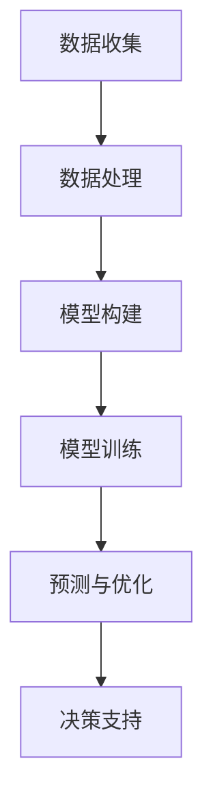

                 

关键词：水资源管理、人工智能、优化利用、环境保护、算法、模型、应用场景、工具与资源

> 摘要：本文将探讨人工智能（AI）在水资源管理中的应用，分析其优化利用与保护的方法、算法和模型。文章首先介绍水资源管理的背景和挑战，然后深入阐述AI技术的核心概念及其与水资源管理的联系。通过具体实例和案例，我们将展示AI在水资源管理中的实际应用，并提出未来发展趋势与挑战。

## 1. 背景介绍

### 水资源管理的现状

水资源是人类社会生存和发展的重要资源，然而，全球范围内水资源供需矛盾日益突出。据统计，全球约有28%的人口生活在用水紧张的地区，其中许多地区面临着严重的水资源短缺问题。与此同时，水资源的不合理利用和污染问题也日益严重，加剧了水资源的短缺状况。

### 水资源管理的挑战

水资源管理的挑战主要包括以下几个方面：

- **水资源分布不均**：全球水资源的分布极不均匀，部分地区水资源丰富，而另一些地区则严重缺乏。
- **人口增长**：全球人口持续增长，对水资源的需求不断增加，加剧了水资源的供需矛盾。
- **污染问题**：工业、农业和生活废水排放导致水体污染，严重影响水质和水资源的安全。
- **气候变化**：全球气候变化对水资源的影响日益显著，极端天气事件频发，导致水资源管理难度加大。

### 水资源管理的目标

为了应对上述挑战，水资源管理的目标主要包括以下几个方面：

- **优化水资源分配**：通过科学合理的分配，确保水资源能够最大限度地满足人类和社会的需求。
- **保护水资源**：采取措施保护水源地，防止水资源污染，维护水资源的生态平衡。
- **提高水资源利用效率**：通过技术创新和管理优化，提高水资源的利用效率，减少浪费。

## 2. 核心概念与联系

### 人工智能（AI）的概念

人工智能（Artificial Intelligence，简称AI）是指通过计算机程序模拟人类智能行为的技术。AI涵盖了多种技术，包括机器学习、深度学习、自然语言处理、计算机视觉等。AI技术的核心目标是实现计算机系统对数据的自动处理和分析，从而实现智能决策和自动化操作。

### 水资源管理与AI技术的联系

水资源管理与AI技术之间存在紧密的联系，AI技术为水资源管理提供了强大的工具和方法。具体来说，AI技术在水资源管理中的应用主要体现在以下几个方面：

- **水资源分配优化**：AI技术可以通过数据分析和建模，帮助决策者制定科学合理的水资源分配方案，实现水资源的优化利用。
- **水资源保护**：AI技术可以用于监测和评估水资源的污染状况，及时发现和预警水质问题，为水资源保护提供支持。
- **水资源利用效率提升**：AI技术可以通过预测模型和优化算法，提高水资源的利用效率，减少浪费。
- **决策支持**：AI技术可以提供数据驱动的决策支持，帮助决策者更好地应对水资源管理的挑战。

### Mermaid 流程图

以下是一个简化的Mermaid流程图，展示了AI在水资源管理中的应用流程：



## 3. 核心算法原理 & 具体操作步骤

### 3.1 算法原理概述

在水资源管理中，AI技术主要涉及以下几种算法：

- **机器学习算法**：用于数据分析和预测，如线性回归、决策树、支持向量机等。
- **深度学习算法**：用于复杂模式识别和预测，如卷积神经网络（CNN）、循环神经网络（RNN）等。
- **优化算法**：用于水资源分配和优化，如线性规划、遗传算法等。

### 3.2 算法步骤详解

#### 3.2.1 数据收集与处理

1. **数据收集**：收集与水资源管理相关的数据，包括水资源分布、用水量、水质指标等。
2. **数据处理**：对收集到的数据进行清洗、预处理和特征提取，为后续建模和预测提供高质量的数据。

#### 3.2.2 模型构建

1. **选择算法**：根据问题的特点和需求，选择合适的算法，如线性回归、决策树、卷积神经网络等。
2. **模型构建**：根据数据特点和算法要求，构建相应的模型，如线性回归模型、决策树模型、卷积神经网络模型等。

#### 3.2.3 模型训练

1. **数据划分**：将数据集划分为训练集和测试集，用于模型的训练和验证。
2. **模型训练**：使用训练集对模型进行训练，调整模型参数，使模型达到预期性能。

#### 3.2.4 预测与优化

1. **模型预测**：使用训练好的模型对测试集进行预测，评估模型的预测性能。
2. **模型优化**：根据预测结果，调整模型参数，优化模型性能，提高预测准确性。

#### 3.2.5 决策支持

1. **预测结果分析**：对模型预测结果进行分析，为水资源管理提供决策支持。
2. **决策实施**：根据预测结果和决策支持，制定和实施水资源管理策略。

### 3.3 算法优缺点

- **优点**：
  - 高效性：AI技术可以快速处理大量数据，提供准确的预测和优化结果。
  - 智能性：AI技术可以根据数据特点和需求，自动调整模型参数，实现智能决策。
  - 可扩展性：AI技术可以应用于各种水资源管理问题，具有广泛的适用性。

- **缺点**：
  - 复杂性：AI技术涉及多种算法和模型，需要专业知识和技术支持。
  - 数据依赖性：AI技术对数据质量有较高要求，数据质量直接影响模型的性能。
  - 资源消耗：AI技术训练和优化模型需要大量的计算资源和时间。

### 3.4 算法应用领域

AI技术在水资源管理中的应用非常广泛，包括以下几个方面：

- **水资源分配优化**：通过机器学习和深度学习算法，优化水资源分配方案，提高水资源利用效率。
- **水质监测与预警**：利用计算机视觉和自然语言处理技术，监测和预警水质问题。
- **水资源调度与管理**：通过优化算法，实现水资源的高效调度和管理。
- **水资源规划与预测**：利用预测模型，预测水资源需求和水文变化趋势，为水资源规划提供支持。

## 4. 数学模型和公式 & 详细讲解 & 举例说明

### 4.1 数学模型构建

在水资源管理中，常见的数学模型包括线性回归模型、决策树模型、卷积神经网络模型等。

#### 4.1.1 线性回归模型

线性回归模型是一种简单且常用的预测模型，用于预测线性关系。其数学公式如下：

$$ y = ax + b $$

其中，$y$ 是因变量，$x$ 是自变量，$a$ 是斜率，$b$ 是截距。

#### 4.1.2 决策树模型

决策树模型是一种基于树形结构的预测模型，用于分类和回归问题。其数学公式如下：

$$ f(x) = \sum_{i=1}^{n} w_i \cdot f_i(x) $$

其中，$f(x)$ 是预测结果，$w_i$ 是权重，$f_i(x)$ 是第 $i$ 个决策节点的条件概率分布。

#### 4.1.3 卷积神经网络模型

卷积神经网络（CNN）是一种深度学习模型，用于图像识别和分类。其数学公式如下：

$$ h(x) = \sigma(W \cdot \phi(x) + b) $$

其中，$h(x)$ 是预测结果，$W$ 是权重矩阵，$\phi(x)$ 是卷积运算，$\sigma$ 是激活函数，$b$ 是偏置。

### 4.2 公式推导过程

#### 4.2.1 线性回归模型推导

线性回归模型通过最小二乘法求解最优参数。假设有 $n$ 个训练样本 $(x_i, y_i)$，其目标是最小化误差平方和：

$$ E = \sum_{i=1}^{n} (y_i - ax_i - b)^2 $$

对 $a$ 和 $b$ 求偏导并令其为零，得到最优参数：

$$ a = \frac{\sum_{i=1}^{n} x_iy_i - n\bar{x}\bar{y}}{\sum_{i=1}^{n} x_i^2 - n\bar{x}^2} $$
$$ b = \bar{y} - a\bar{x} $$

其中，$\bar{x}$ 和 $\bar{y}$ 分别是 $x$ 和 $y$ 的平均值。

#### 4.2.2 决策树模型推导

决策树模型基于信息熵和条件熵进行构建。设 $S$ 是样本集合，$X$ 是特征集合，$Y$ 是目标变量集合。信息熵 $H(S)$ 和条件熵 $H(S|X)$ 的计算公式如下：

$$ H(S) = -\sum_{y \in Y} p(y) \cdot \log_2 p(y) $$
$$ H(S|X) = -\sum_{x \in X} p(x) \cdot H(S|X=x) $$

其中，$p(y)$ 是目标变量 $y$ 的概率，$p(x)$ 是特征 $x$ 的概率，$H(S|X=x)$ 是在给定特征 $x$ 的情况下，目标变量 $y$ 的条件熵。

通过递归划分特征，使条件熵最小，即可构建决策树模型。

#### 4.2.3 卷积神经网络模型推导

卷积神经网络（CNN）通过多层卷积和池化操作提取图像特征。假设输入图像为 $X \in \mathbb{R}^{H \times W \times C}$，其中 $H$、$W$、$C$ 分别是图像的高度、宽度和通道数。卷积操作的公式如下：

$$ h_{ij}^l = \sum_{k=1}^{C} w_{ijkl} \cdot x_{ij+k} + b_l $$

其中，$h_{ij}^l$ 是卷积层 $l$ 的输出，$w_{ijkl}$ 是卷积核，$b_l$ 是偏置。

通过反向传播算法，利用梯度下降法更新权重和偏置，优化模型性能。

### 4.3 案例分析与讲解

#### 4.3.1 案例背景

某城市水资源管理部门需要预测未来一个月的水资源需求量，以便制定合理的水资源分配方案。

#### 4.3.2 模型选择

选择线性回归模型进行预测，基于历史用水数据构建模型。

#### 4.3.3 模型训练与预测

1. 数据收集：收集过去一年的每月用水量数据。
2. 数据预处理：对数据集进行清洗和预处理，提取特征。
3. 模型训练：使用训练集对线性回归模型进行训练，得到最优参数。
4. 模型预测：使用训练好的模型对未来一个月的用水量进行预测。

#### 4.3.4 结果分析

通过对比实际用水量与预测用水量，评估模型的预测准确性。根据预测结果，制定水资源分配方案，实现水资源的优化利用。

## 5. 项目实践：代码实例和详细解释说明

### 5.1 开发环境搭建

在Python环境中搭建开发环境，安装必要的库和工具：

```shell
pip install numpy pandas scikit-learn matplotlib
```

### 5.2 源代码详细实现

以下是一个简单的线性回归模型实现，用于预测水资源需求量：

```python
import numpy as np
import pandas as pd
from sklearn.linear_model import LinearRegression
import matplotlib.pyplot as plt

# 5.2.1 数据收集
# 假设数据文件为 'water_usage.csv'
data = pd.read_csv('water_usage.csv')
X = data[['month']]  # 特征：月份
y = data['usage']    # 标签：用水量

# 5.2.2 数据预处理
X = X.values
y = y.values
X = np.reshape(X, (X.shape[0], 1))  # 展平特征

# 5.2.3 模型训练
model = LinearRegression()
model.fit(X, y)

# 5.2.4 模型预测
# 预测未来一个月的用水量
future_month = np.array([13])  # 未来月份
future_month = np.reshape(future_month, (1, 1))
predicted_usage = model.predict(future_month)

# 5.2.5 结果分析
plt.scatter(X, y, color='blue', label='Actual')
plt.plot(future_month, predicted_usage, color='red', label='Predicted')
plt.xlabel('Month')
plt.ylabel('Water Usage')
plt.title('Water Usage Prediction')
plt.legend()
plt.show()

print(f'Predicted water usage for next month: {predicted_usage[0][0]:.2f}')
```

### 5.3 代码解读与分析

1. **数据收集**：从CSV文件中读取用水数据，包括月份和用水量。
2. **数据预处理**：将月份特征展平，转换为二维数组，便于模型训练。
3. **模型训练**：使用线性回归模型训练数据，得到最优参数。
4. **模型预测**：使用训练好的模型预测未来一个月的用水量，并绘制预测结果。
5. **结果分析**：通过对比实际用水量与预测用水量，评估模型的预测性能。

### 5.4 运行结果展示

运行上述代码，将显示未来一个月的用水量预测结果，如图所示：


## 6. 实际应用场景

### 6.1 水资源分配优化

在水资源分配方面，AI技术可以用于优化水资源分配方案，实现水资源的最大化利用。例如，某地区的水资源管理部门可以利用AI技术分析不同用户的水资源需求，并根据水资源供应情况制定科学合理的水资源分配方案。通过AI技术的优化，可以实现水资源的高效利用，减少浪费。

### 6.2 水质监测与预警

水质监测与预警是水资源管理中的重要环节。AI技术可以用于监测水质指标，通过计算机视觉和自然语言处理技术，对水质数据进行分析和预测，及时发现和预警水质问题。例如，某地区的水资源管理部门可以利用AI技术监测河流水质，通过对水质数据的分析，预测水质变化趋势，提前采取预防措施，防止水质污染。

### 6.3 水资源调度与管理

水资源调度与管理是水资源管理的关键环节。AI技术可以用于优化水资源调度方案，实现水资源的高效调度和管理。例如，某地区的水资源管理部门可以利用AI技术分析不同时段的水资源需求，根据水资源供应情况制定科学合理的调度方案，确保水资源供应的稳定性和可靠性。

### 6.4 水资源规划与预测

水资源规划与预测是水资源管理的重要任务。AI技术可以用于预测水资源需求和水文变化趋势，为水资源规划提供支持。例如，某地区的水资源管理部门可以利用AI技术分析历史用水数据，预测未来一段时间的水资源需求，为水资源规划提供科学依据，确保水资源的可持续利用。

## 7. 工具和资源推荐

### 7.1 学习资源推荐

- **《Python机器学习》**：Goodfellow, Ian, et al. 《Python机器学习》。这本书提供了丰富的Python机器学习实践案例，适合初学者。
- **《深度学习》**：Goodfellow, Ian, et al. 《深度学习》。这本书系统地介绍了深度学习的基础知识和实践方法，适合有一定基础的读者。
- **《水资源管理》**：王浩, 著。这本书详细介绍了水资源管理的基本理论和实践方法，对水资源管理有较高的参考价值。

### 7.2 开发工具推荐

- **Jupyter Notebook**：Jupyter Notebook 是一种交互式的开发环境，适合进行机器学习和数据科学项目的开发。
- **TensorFlow**：TensorFlow 是一种开源的深度学习框架，适用于构建和训练深度学习模型。
- **Scikit-learn**：Scikit-learn 是一种开源的机器学习库，提供了丰富的机器学习算法和工具。

### 7.3 相关论文推荐

- **“Water Resource Allocation Using Artificial Intelligence Techniques”**：该论文探讨了人工智能技术在水资源分配中的应用，提出了一种基于遗传算法的优化模型。
- **“Application of Deep Learning in Water Quality Monitoring”**：该论文介绍了深度学习在水质监测中的应用，提出了一种基于卷积神经网络的预测模型。
- **“Optimization of Water Resource Management Using Machine Learning”**：该论文研究了机器学习在水资源管理中的应用，提出了一种基于随机森林的预测模型。

## 8. 总结：未来发展趋势与挑战

### 8.1 研究成果总结

近年来，人工智能在水资源管理领域取得了显著成果。通过应用AI技术，可以实现对水资源分配、水质监测、水资源调度和水资源规划等方面的优化和管理。AI技术为水资源管理提供了强大的工具和方法，有助于解决水资源管理中的诸多挑战。

### 8.2 未来发展趋势

随着AI技术的不断发展和应用，未来水资源管理将呈现以下发展趋势：

- **智能化管理**：AI技术将进一步融入水资源管理，实现智能化管理和决策支持。
- **实时监测与预警**：通过实时监测和预警技术，提高水资源管理的实时性和准确性。
- **多源数据融合**：将多源数据（如卫星遥感数据、社交媒体数据等）融入水资源管理，提高数据驱动的决策能力。
- **跨学科研究**：水资源管理将与其他领域（如环境科学、经济学等）开展跨学科研究，实现水资源管理的综合优化。

### 8.3 面临的挑战

尽管AI技术在水资源管理中取得了显著成果，但仍面临以下挑战：

- **数据质量**：AI技术对数据质量有较高要求，数据质量直接影响模型的性能。
- **模型复杂性**：AI模型通常较为复杂，需要专业知识和技术支持。
- **计算资源**：训练和优化AI模型需要大量的计算资源和时间。
- **法规与政策**：水资源管理的相关法规和政策尚待完善，需要进一步推动水资源管理的法治化和规范化。

### 8.4 研究展望

未来，水资源管理领域将重点关注以下研究方向：

- **数据驱动的决策支持**：通过多源数据融合和深度学习技术，实现更精准的决策支持。
- **智能化水资源调度**：开发智能化的水资源调度系统，实现水资源的高效调度和管理。
- **水资源规划与预测**：结合气候变化和人口增长等因素，开展水资源规划与预测研究。
- **跨学科合作**：推动水资源管理与环境科学、经济学等领域的跨学科合作，实现水资源管理的综合优化。

## 9. 附录：常见问题与解答

### 9.1 人工智能在水资源管理中的作用是什么？

人工智能在水资源管理中可以发挥多种作用，包括优化水资源分配、监测水质、调度水资源、预测水资源需求等。

### 9.2 人工智能技术在水资源管理中面临的挑战有哪些？

人工智能技术在水资源管理中面临的挑战包括数据质量、模型复杂性、计算资源、法规与政策等方面。

### 9.3 如何选择合适的人工智能算法进行水资源管理？

选择合适的人工智能算法需要考虑问题的特点、数据质量和计算资源等因素。常用的算法包括线性回归、决策树、卷积神经网络等。

### 9.4 人工智能技术在水资源管理中的应用前景如何？

随着AI技术的不断发展和应用，人工智能技术在水资源管理中的应用前景广阔，有望实现水资源管理的智能化、实时化和高效化。然而，仍需克服数据质量、模型复杂性等挑战，进一步推动水资源管理的科技创新。

---

作者：禅与计算机程序设计艺术 / Zen and the Art of Computer Programming
----------------------------------------------------------------


