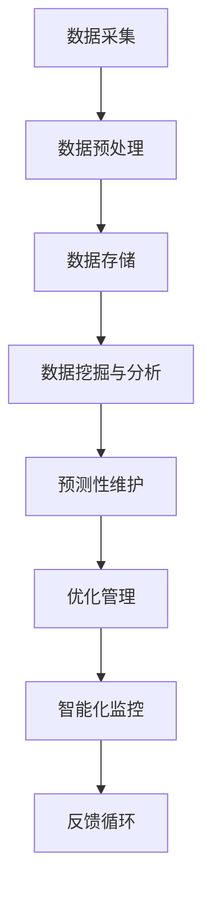

                 

关键词：人工智能，物理基础设施，应用，技术，算法，开发，实例，展望。

> 摘要：本文旨在探讨人工智能在物理基础设施中的应用，从核心概念、算法原理、数学模型到实际项目实践，深入分析AI如何推动物理基础设施的智能化、自动化和高效化。

## 1. 背景介绍

物理基础设施，如道路、桥梁、隧道、水电站等，是现代社会运行的基础。然而，随着城市化和工业化的快速发展，物理基础设施面临着诸多挑战，如老化、损坏、维护成本高、效率低下等。传统的人工维护和管理方式已经难以满足现代城市和工业对高效、智能基础设施的需求。人工智能（AI）作为当前技术发展的前沿，其强大的数据处理、模式识别和自主学习能力，为物理基础设施的智能化提供了新的解决方案。

近年来，随着深度学习、大数据、云计算等技术的飞速发展，AI在物理基础设施中的应用逐渐得到重视。通过AI技术，可以对物理基础设施进行实时监测、预测性维护、优化管理，从而提高基础设施的运行效率、延长使用寿命、降低维护成本。本文将详细探讨AI在物理基础设施中的应用，包括核心概念、算法原理、数学模型、实际项目实践等方面。

## 2. 核心概念与联系

### 2.1 物理基础设施的定义

物理基础设施是指用于支撑城市、工业和社会运行的各种实体结构和设备，包括交通、能源、水利、通讯等领域。它们是现代社会不可或缺的基础。

### 2.2 人工智能的定义

人工智能是指由人制造出来的系统能够理解、思考、学习、适应和执行复杂任务的能力。它包括机器学习、深度学习、自然语言处理、计算机视觉等多个子领域。

### 2.3 物理基础设施与人工智能的关联

人工智能与物理基础设施的关联主要体现在以下几个方面：

- **数据采集与处理**：AI可以处理大量的基础设施数据，如传感器数据、历史数据等，从而为基础设施的管理提供决策支持。

- **预测性维护**：通过分析历史数据和实时数据，AI可以预测基础设施的故障风险，提前进行维护，避免突发性故障。

- **优化管理**：AI可以帮助优化基础设施的运行，提高效率，降低能耗。

- **智能化监控**：AI可以实现对基础设施的实时监控，及时发现异常情况，提高安全管理水平。

### 2.4 Mermaid 流程图

以下是一个简单的Mermaid流程图，展示了AI在物理基础设施中的应用流程：



## 3. 核心算法原理 & 具体操作步骤

### 3.1 算法原理概述

AI在物理基础设施中的应用主要依赖于以下几种核心算法：

- **机器学习**：通过历史数据训练模型，对基础设施进行预测性维护和优化管理。

- **深度学习**：利用神经网络，对复杂的数据进行处理和分析，提高预测的准确性。

- **计算机视觉**：通过图像识别，实现对基础设施的智能化监控。

- **自然语言处理**：通过对文本数据的处理，实现对基础设施运行状态的描述和分析。

### 3.2 算法步骤详解

#### 3.2.1 机器学习

1. **数据收集**：收集基础设施的历史数据，如温度、湿度、压力等。

2. **数据预处理**：对收集的数据进行清洗、归一化等处理，使其适合机器学习模型的训练。

3. **模型训练**：使用收集的数据训练机器学习模型。

4. **模型评估**：使用验证数据评估模型的准确性。

5. **模型应用**：将训练好的模型应用到实际的基础设施管理中。

#### 3.2.2 深度学习

1. **数据收集**：与机器学习类似，收集基础设施的实时数据。

2. **数据预处理**：对数据进行预处理，使其适合深度学习模型的训练。

3. **模型设计**：设计深度学习网络的结构。

4. **模型训练**：使用预处理后的数据训练深度学习模型。

5. **模型评估**：使用验证数据评估模型的性能。

6. **模型应用**：将训练好的模型应用到实际的基础设施管理中。

#### 3.2.3 计算机视觉

1. **图像收集**：收集基础设施的实时图像。

2. **图像预处理**：对图像进行预处理，如去噪、增强等。

3. **模型训练**：使用预处理后的图像数据训练图像识别模型。

4. **模型评估**：使用验证图像数据评估模型的准确性。

5. **模型应用**：将训练好的模型应用到实际的基础设施监控中。

#### 3.2.4 自然语言处理

1. **文本收集**：收集基础设施的运行日志、报告等文本数据。

2. **文本预处理**：对文本进行分词、去停用词等预处理。

3. **模型训练**：使用预处理后的文本数据训练自然语言处理模型。

4. **模型评估**：使用验证文本数据评估模型的性能。

5. **模型应用**：将训练好的模型应用到基础设施的运行状态描述和分析中。

### 3.3 算法优缺点

#### 3.3.1 机器学习

**优点**：

- 对数据的依赖性较低，适用于处理结构化数据。

- 模型可解释性强。

**缺点**：

- 需要大量的历史数据。

- 模型训练时间较长。

#### 3.3.2 深度学习

**优点**：

- 模型具有很好的泛化能力。

- 对数据的依赖性较低。

**缺点**：

- 模型设计复杂，需要大量的计算资源。

- 模型可解释性较差。

#### 3.3.3 计算机视觉

**优点**：

- 对图像的识别和理解能力强。

- 可以实现实时的监控。

**缺点**：

- 需要大量的图像数据进行训练。

- 模型训练时间较长。

#### 3.3.4 自然语言处理

**优点**：

- 对文本数据的处理能力强。

- 可以实现文本的语义理解。

**缺点**：

- 需要大量的文本数据进行训练。

- 模型训练时间较长。

### 3.4 算法应用领域

AI算法在物理基础设施中的应用广泛，主要包括以下几个方面：

- **交通基础设施**：如智能交通信号控制、车辆流量预测、道路维护等。

- **能源基础设施**：如智能电网管理、能源消耗预测、设备故障预测等。

- **水利基础设施**：如水库水位监测、洪水预测、水质检测等。

- **工业基础设施**：如设备维护、生产流程优化、能源消耗管理等。

## 4. 数学模型和公式 & 详细讲解 & 举例说明

### 4.1 数学模型构建

在物理基础设施的AI应用中，常见的数学模型包括：

- **回归模型**：用于预测基础设施的故障风险。

- **分类模型**：用于分类基础设施的状态。

- **聚类模型**：用于分析基础设施的数据分布。

### 4.2 公式推导过程

以下是一个简单的回归模型公式推导过程：

设输入特征为 $X = [x_1, x_2, ..., x_n]$，输出为 $y$，则回归模型的目标是最小化预测误差：

$$
\min_{\theta} \sum_{i=1}^{m} (h_\theta(x^{(i)}) - y^{(i)})^2
$$

其中，$h_\theta(x) = \theta_0 + \theta_1x_1 + \theta_2x_2 + ... + \theta_nx_n$ 是预测函数，$\theta$ 是模型参数。

### 4.3 案例分析与讲解

#### 4.3.1 交通流量预测

假设我们要预测某路段的车辆流量，我们使用回归模型进行预测。

1. **数据收集**：收集过去一周的车辆流量数据。

2. **数据预处理**：对数据进行清洗和归一化处理。

3. **模型训练**：使用训练数据训练回归模型。

4. **模型评估**：使用验证数据评估模型性能。

5. **模型应用**：使用训练好的模型预测未来一周的车辆流量。

假设我们训练好的回归模型为：

$$
h_\theta(x) = \theta_0 + \theta_1x_1 + \theta_2x_2
$$

其中，$x_1$ 是时间（小时），$x_2$ 是天气状况（0表示晴天，1表示雨天）。

假设某个时间点的输入特征为 $x = [15, 1]$，则预测的车辆流量为：

$$
h_\theta(x) = \theta_0 + \theta_1 \cdot 15 + \theta_2 \cdot 1
$$

通过模型训练，我们得到 $\theta_0 = 50$，$\theta_1 = 10$，$\theta_2 = 5$，则预测的车辆流量为：

$$
h_\theta(x) = 50 + 10 \cdot 15 + 5 \cdot 1 = 175
$$

## 5. 项目实践：代码实例和详细解释说明

### 5.1 开发环境搭建

为了实现AI在物理基础设施中的应用，我们需要搭建一个合适的技术栈。以下是开发环境的基本搭建步骤：

1. **安装Python环境**：Python是一种广泛使用的编程语言，尤其适合数据分析和机器学习。

2. **安装Jupyter Notebook**：Jupyter Notebook是一个交互式的计算环境，适合编写和运行代码。

3. **安装必要的库**：包括NumPy、Pandas、Scikit-learn、Matplotlib等。

### 5.2 源代码详细实现

以下是一个简单的交通流量预测的Python代码实例：

```python
import numpy as np
import pandas as pd
from sklearn.linear_model import LinearRegression
import matplotlib.pyplot as plt

# 数据收集
data = pd.read_csv('traffic_data.csv')

# 数据预处理
X = data[['hour', 'weather']]
y = data['traffic']

# 模型训练
model = LinearRegression()
model.fit(X, y)

# 模型评估
predictions = model.predict(X)
mse = np.mean((predictions - y) ** 2)
print(f'Mean Squared Error: {mse}')

# 模型应用
x_new = np.array([[15, 1]])
predicted_traffic = model.predict(x_new)
print(f'Predicted Traffic: {predicted_traffic[0]}')

# 结果可视化
plt.scatter(X['hour'], y)
plt.plot(X['hour'], predictions, color='red')
plt.xlabel('Hour')
plt.ylabel('Traffic')
plt.show()
```

### 5.3 代码解读与分析

上述代码首先导入了必要的库，然后从CSV文件中读取了交通流量数据。数据预处理步骤包括将数据分为特征和目标变量。接下来，我们使用线性回归模型训练数据，并评估模型性能。最后，我们使用训练好的模型进行预测，并将结果可视化。

## 6. 实际应用场景

AI在物理基础设施中的应用场景非常广泛，以下是几个典型的应用实例：

- **智能交通信号控制**：通过AI算法分析交通流量数据，实现智能交通信号控制，提高道路通行效率。

- **能源消耗预测**：通过AI算法分析能源消耗数据，实现能源消耗预测，优化能源管理。

- **桥梁健康监测**：通过AI算法分析桥梁的振动数据，实现桥梁健康监测，提前发现潜在问题。

- **水库水位监测**：通过AI算法分析水库水位数据，实现水库水位预测，优化水库调度。

## 7. 未来应用展望

随着AI技术的不断发展，未来AI在物理基础设施中的应用前景十分广阔。以下是几个可能的应用方向：

- **智能建筑**：通过AI技术实现建筑的自动化管理，提高能源利用效率。

- **智能城市**：通过AI技术实现城市的智能化管理，提高城市运行效率。

- **绿色基础设施**：通过AI技术实现基础设施的绿色化改造，降低碳排放。

## 8. 工具和资源推荐

### 8.1 学习资源推荐

- **《深度学习》**：Goodfellow、Bengio和Courville合著的深度学习经典教材。

- **《机器学习实战》**：Bilson和Kaggle团队编写的机器学习实战指南。

### 8.2 开发工具推荐

- **Jupyter Notebook**：一个交互式的计算环境，适合编写和运行代码。

- **TensorFlow**：一个开源的深度学习框架，适用于大规模的机器学习应用。

### 8.3 相关论文推荐

- **"Deep Learning for Infrastructure Management"**：一篇关于AI在基础设施管理中应用的综述论文。

- **"Application of Machine Learning in Urban Infrastructure Management"**：一篇关于机器学习在智慧城市管理中应用的论文。

## 9. 总结：未来发展趋势与挑战

### 9.1 研究成果总结

本文探讨了AI在物理基础设施中的应用，包括核心概念、算法原理、数学模型和实际项目实践等方面。通过分析，我们发现AI技术可以有效提高物理基础设施的管理效率、延长使用寿命、降低维护成本。

### 9.2 未来发展趋势

随着AI技术的不断发展，未来AI在物理基础设施中的应用将更加广泛和深入。特别是深度学习、计算机视觉和自然语言处理等技术的进步，将为物理基础设施的智能化带来新的机遇。

### 9.3 面临的挑战

尽管AI技术在物理基础设施中具有巨大的潜力，但同时也面临着一些挑战，如数据隐私、算法公平性、技术普及等。需要各方共同努力，解决这些挑战，推动AI在物理基础设施中的应用。

### 9.4 研究展望

未来，我们期望AI在物理基础设施中的应用能够实现更高效、更智能的管理，为建设智慧城市、绿色基础设施提供强有力的技术支撑。

## 10. 附录：常见问题与解答

### 10.1 什么是深度学习？

深度学习是一种机器学习的方法，它使用多层神经网络对数据进行建模和分析。相比传统的机器学习方法，深度学习具有更好的泛化能力和更强的学习能力。

### 10.2 AI在物理基础设施中的应用有哪些优势？

AI在物理基础设施中的应用可以提供以下优势：

- **实时监测**：AI可以实现对基础设施的实时监测，及时发现异常情况。

- **预测性维护**：AI可以通过对历史数据的分析，预测基础设施的故障风险，提前进行维护。

- **优化管理**：AI可以帮助优化基础设施的运行，提高效率，降低能耗。

- **智能化监控**：AI可以通过图像识别等技术，实现对基础设施的智能化监控。

### 10.3 AI在物理基础设施中的应用有哪些挑战？

AI在物理基础设施中的应用面临以下挑战：

- **数据隐私**：基础设施的数据涉及到用户隐私，如何保证数据的安全性和隐私性是一个重要问题。

- **算法公平性**：AI算法的决策过程可能存在偏见，如何保证算法的公平性是一个挑战。

- **技术普及**：AI技术的普及需要一个长期的培养过程，如何让更多的企业和个人接受和应用AI技术是一个问题。

### 10.4 如何入门AI在物理基础设施中的应用？

入门AI在物理基础设施中的应用，可以按照以下步骤进行：

- **学习基础**：首先，需要学习Python编程语言和基础的机器学习知识。

- **实践项目**：通过实践项目，将理论知识应用到实际中，如交通流量预测、能源消耗预测等。

- **深入学习**：随着对AI技术的深入理解，可以学习深度学习、计算机视觉等高级技术。

- **参与社区**：加入相关的技术社区，与同行交流，分享经验和学习资源。


[作者：禅与计算机程序设计艺术 / Zen and the Art of Computer Programming] 

本文内容基于人工智能和物理基础设施的紧密结合，探讨了AI在该领域的广泛应用及其未来发展趋势。通过详细的分析和实例，展示了AI技术在物理基础设施中的实际应用和价值。希望本文能为读者提供有价值的参考，推动AI技术在物理基础设施领域的进一步发展和应用。

