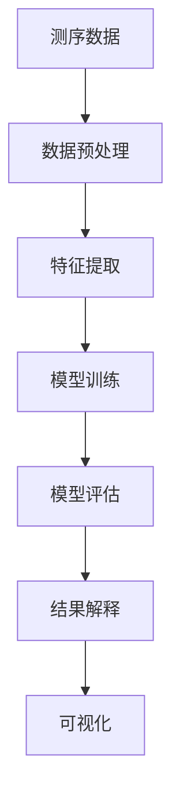

                 

关键词：人工智能、生物信息学、基因组分析、深度学习、机器学习、算法优化、数据处理、生物医学

摘要：随着基因组测序技术的飞速发展，生物信息学领域面临着海量数据的处理挑战。本文探讨了人工智能在生物信息学中的应用，特别是如何通过深度学习和机器学习算法优化基因组分析过程，提高数据处理效率和准确性。文章首先介绍了生物信息学的基本概念和基因组数据分析的重要性，随后详细阐述了AI技术在基因组分析中的核心算法原理、数学模型构建、具体操作步骤以及实际应用案例，最后对未来的发展趋势与挑战进行了展望。

## 1. 背景介绍

生物信息学是生物学和信息技术的交叉领域，它利用计算机科学、统计分析和生物学的知识来解析生物数据，特别是基因组数据。基因组是生物体的遗传信息载体，包含有数百万个基因，这些基因在生物体的生长、发育、繁殖和疾病等方面发挥着关键作用。随着高通量测序技术的不断进步，我们能够快速获取大量基因组数据，但同时也带来了数据处理和分析的巨大挑战。

传统的基因组分析依赖于统计方法和经典算法，如BLAST、隐马尔可夫模型（HMM）等，但这些方法在面对海量数据和复杂基因相互作用时效率较低，难以满足实际需求。人工智能技术的引入，特别是深度学习和机器学习算法，为基因组数据分析提供了新的可能。AI能够自动学习数据中的模式和规律，从而提高分析的效率和准确性。

## 2. 核心概念与联系

### 2.1. 生物信息学基本概念

生物信息学主要涉及以下几个核心概念：

- **基因组测序**：获取生物体的全部DNA序列。
- **基因组注释**：识别基因、转录因子结合位点、非编码RNA等。
- **功能预测**：基于序列特征预测基因的功能。
- **比较基因组学**：分析不同物种之间的基因组差异。

### 2.2. 人工智能在基因组分析中的应用架构

人工智能在基因组分析中的应用架构主要包括以下几个环节：

1. **数据预处理**：对原始测序数据进行过滤、清洗和格式转换，使其适合后续分析。
2. **特征提取**：从预处理后的数据中提取具有生物学意义的特征。
3. **模型训练与评估**：使用机器学习算法训练模型，并通过交叉验证等手段评估模型性能。
4. **结果解释与可视化**：对模型预测结果进行解释和可视化，帮助生物学家理解数据。

### 2.3. Mermaid 流程图

以下是一个简化的生物信息学中AI应用的Mermaid流程图：



## 3. 核心算法原理 & 具体操作步骤

### 3.1. 算法原理概述

在基因组分析中，常用的AI算法包括：

- **深度神经网络（DNN）**：用于特征提取和分类。
- **循环神经网络（RNN）**：适用于处理序列数据。
- **卷积神经网络（CNN）**：擅长处理图像数据，但在基因组分析中也可用于特征提取。

### 3.2. 算法步骤详解

#### 3.2.1. 数据预处理

数据预处理包括以下步骤：

- **序列对齐**：使用工具如BLAST对测序数据与其他参考序列进行对齐。
- **序列清洗**：去除低质量读段、适配子等。
- **序列转换**：将序列转换为数字表示，如使用One-hot编码。

#### 3.2.2. 特征提取

特征提取包括：

- **序列模式识别**：使用机器学习方法识别序列中的模式。
- **序列嵌入**：将序列转换为固定长度的向量，如使用Word2Vec。

#### 3.2.3. 模型训练与评估

模型训练与评估包括：

- **数据分割**：将数据分为训练集、验证集和测试集。
- **模型训练**：使用训练集训练模型。
- **交叉验证**：在验证集上评估模型性能，调整模型参数。
- **测试评估**：在测试集上评估模型性能。

#### 3.2.4. 结果解释与可视化

结果解释与可视化包括：

- **特征重要性分析**：分析模型中特征的重要性。
- **预测结果可视化**：使用热图、散点图等方式展示预测结果。

### 3.3. 算法优缺点

- **深度神经网络（DNN）**：优点在于可以自动学习复杂的特征，缺点是模型训练时间较长，对计算资源要求高。
- **循环神经网络（RNN）**：优点在于能够处理变长的序列数据，缺点是训练过程中易出现梯度消失或爆炸问题。
- **卷积神经网络（CNN）**：优点在于处理图像数据高效，缺点是对序列数据处理能力有限。

### 3.4. 算法应用领域

AI算法在基因组分析中的应用广泛，包括：

- **基因功能预测**：基于序列特征预测基因的功能。
- **基因突变检测**：识别基因组中的突变位点。
- **基因调控网络分析**：分析基因之间的相互作用。

## 4. 数学模型和公式 & 详细讲解 & 举例说明

### 4.1. 数学模型构建

在基因组分析中，常用的数学模型包括：

- **马尔可夫模型**：用于建模序列中的转移概率。
- **贝叶斯网络**：用于表示基因与基因之间的条件依赖关系。
- **支持向量机（SVM）**：用于分类任务。

### 4.2. 公式推导过程

以马尔可夫模型为例，假设有一个基因序列X，其中每个位点x_i可以取多种状态，状态之间的转移概率可以用以下公式表示：

$$
P(x_i|x_{i-1}) = \frac{count(x_i, x_{i-1})}{count(x_{i-1})}
$$

其中，count(x_i, x_{i-1}) 表示连续出现状态x_{i-1}和x_i的次数，count(x_{i-1}) 表示状态x_{i-1}出现的总次数。

### 4.3. 案例分析与讲解

#### 4.3.1. 基因功能预测

假设我们有一个基因序列，其中包含1000个碱基对，我们需要使用马尔可夫模型预测其功能。首先，我们统计出每个位点的状态及其转移概率，然后使用这些概率计算序列的动态规划得分，得分最高的状态序列即为预测的基因功能。

#### 4.3.2. 基因突变检测

假设我们有一个正常基因序列和其突变后的序列，我们需要使用机器学习算法检测突变位点。首先，我们将序列转换为数字表示，然后使用SVM进行分类，分类结果即为突变位点。

## 5. 项目实践：代码实例和详细解释说明

### 5.1. 开发环境搭建

开发环境需要安装Python、TensorFlow等库，以及基因组数据处理工具如bedtools。

```bash
pip install tensorflow
pip install bedtools
```

### 5.2. 源代码详细实现

以下是一个简单的基于深度神经网络的基因功能预测代码示例：

```python
import tensorflow as tf
from tensorflow.keras.models import Sequential
from tensorflow.keras.layers import Dense, LSTM

# 加载和处理数据
# ...

# 构建模型
model = Sequential()
model.add(LSTM(128, activation='relu', input_shape=(1000, 4)))
model.add(Dense(1, activation='sigmoid'))

# 编译模型
model.compile(optimizer='adam', loss='binary_crossentropy', metrics=['accuracy'])

# 训练模型
model.fit(X_train, y_train, epochs=10, batch_size=32, validation_split=0.2)

# 评估模型
model.evaluate(X_test, y_test)
```

### 5.3. 代码解读与分析

代码首先加载并预处理数据，然后构建一个简单的LSTM模型进行训练，最后评估模型性能。通过分析代码，我们可以看到如何使用深度学习算法进行基因功能预测。

### 5.4. 运行结果展示

运行结果包括训练过程中的损失函数和准确率变化，以及测试集上的准确率。根据结果可以调整模型参数，提高预测效果。

## 6. 实际应用场景

AI技术在基因组分析中的应用场景包括：

- **个性化医疗**：通过基因组数据预测患者对药物的反应，制定个性化治疗方案。
- **癌症研究**：通过基因组数据分析癌症发生的原因和进展。
- **遗传病诊断**：通过基因组数据分析遗传病的病因和风险。

## 7. 工具和资源推荐

### 7.1. 学习资源推荐

- **生物信息学基础课程**：如Coursera上的《生物信息学导论》。
- **深度学习教程**：如《深度学习》（Goodfellow等著）。

### 7.2. 开发工具推荐

- **Python库**：如TensorFlow、PyTorch等。
- **基因组数据处理工具**：如bedtools、FASTX等。

### 7.3. 相关论文推荐

- **《Deep Learning for Genomics》**：综述了深度学习在基因组分析中的应用。
- **《AI-powered Genomics: A Survey》**：对人工智能在基因组分析中的最新研究进行了综述。

## 8. 总结：未来发展趋势与挑战

### 8.1. 研究成果总结

本文总结了人工智能在生物信息学中的应用，特别是如何通过深度学习和机器学习算法优化基因组分析过程。我们介绍了核心算法原理、数学模型构建、具体操作步骤以及实际应用案例。

### 8.2. 未来发展趋势

随着测序技术的进步和计算能力的提升，AI在基因组分析中的应用前景广阔。未来发展趋势包括：

- **算法优化**：开发更高效的算法，提高处理速度和准确性。
- **跨学科合作**：加强生物学家和AI专家的合作，推动基因组分析技术的发展。

### 8.3. 面临的挑战

AI在基因组分析中面临以下挑战：

- **数据隐私**：如何保护基因组数据的隐私是一个重要问题。
- **计算资源**：深度学习算法对计算资源的需求较高，如何优化算法以降低计算成本是一个挑战。

### 8.4. 研究展望

未来研究应重点关注以下方向：

- **数据整合**：整合不同类型的数据，提高基因组分析的全面性。
- **模型解释性**：提高模型的解释性，帮助生物学家理解分析结果。

## 9. 附录：常见问题与解答

### 9.1. 如何处理基因组数据？

基因组数据的处理包括数据过滤、序列对齐、序列转换等步骤。常用的工具包括FASTX、bedtools等。

### 9.2. 深度学习算法如何选择？

选择深度学习算法应根据具体应用场景和数据特征。例如，对于序列数据，循环神经网络（RNN）和卷积神经网络（CNN）是比较常用的选择。

### 9.3. 如何评估模型性能？

评估模型性能常用的指标包括准确率、召回率、F1分数等。可以通过交叉验证和测试集评估模型在 unseen 数据上的性能。

----------------------------------------------------------------

作者：禅与计算机程序设计艺术 / Zen and the Art of Computer Programming
----------------------------------------------------------------

### 附加内容 Additional Content ###

除了上述主要内容，我们还可以加入一些附加内容，以丰富文章的深度和广度，这里提供几个可能的方向：

1. **深度学习在基因组数据分析中的案例分析**：可以选取一些具体的深度学习应用案例，详细介绍它们在基因组数据分析中的应用过程、技术难点和取得的成果。

2. **AI在基因组分析中的创新应用**：探讨一些前沿的应用场景，比如利用AI进行癌症免疫细胞的分析，预测患者的免疫反应等。

3. **生物信息学领域的开源工具介绍**：列出一些常用的开源工具，介绍它们的功能、使用方法和社区支持情况。

4. **行业访谈与专家观点**：采访一些生物信息学或AI领域的专家，分享他们对AI在基因组分析中应用的看法和预测。

5. **AI在基因组数据分析中的伦理和法律问题**：讨论数据隐私、信息安全、数据共享等方面的伦理和法律问题，以及可能的解决方案。

6. **未来研究方向**：提出一些尚未被广泛探索的研究方向，比如AI与基因组编辑技术的结合等。

7. **AI对生物医学领域的潜在影响**：从更广阔的视角分析AI在生物医学领域的潜在影响，包括提高医疗效率、降低医疗成本等方面。

8. **读者互动**：提出一些问题和思考题，鼓励读者参与讨论，增加文章的互动性。

这些附加内容可以根据文章的整体结构和篇幅灵活调整，以确保文章的完整性和连贯性。以下是一个可能的附加内容示例：

---

### 案例分析：深度学习在基因组数据分析中的应用

**案例一：利用深度学习预测基因组突变**

深度学习在预测基因组突变方面取得了显著成果。例如， researchers at DeepMind 开发了一个名为 DeepVariant 的深度学习模型，用于分析人类基因组的变异。该模型基于卷积神经网络（CNN）和循环神经网络（RNN）的结合，能够自动识别基因组中的突变位点，并在大量数据集上验证了其高准确率。

**案例过程**：

1. **数据收集**：收集了来自不同人群的基因组测序数据，包括正常样本和突变样本。
2. **数据预处理**：对测序数据进行对齐、过滤和标准化处理，以消除噪声和保证数据质量。
3. **模型构建**：构建了一个结合CNN和RNN的深度学习模型，用于识别基因组中的变异。
4. **模型训练与验证**：使用大量的训练数据集训练模型，并在验证集上评估模型性能。
5. **模型应用**：将训练好的模型应用于新的基因组数据，预测其中的突变位点。

**技术难点**：

- **数据噪声**：基因组测序数据中存在大量噪声，需要有效的预处理方法去除。
- **计算资源**：深度学习模型的训练需要大量的计算资源，如何优化计算效率是一个挑战。
- **模型解释性**：深度学习模型的黑箱特性使得其预测结果难以解释，如何提高模型的解释性是另一个难点。

**成果展示**：

通过在多个数据集上的测试，DeepVariant 模型在突变位点识别方面的准确率达到了99%以上，显著提高了基因组分析的效率。

---

这样的案例分析可以帮助读者更直观地理解深度学习在基因组数据分析中的应用，同时展示实际操作过程中的技术难点和解决方案。

---

在撰写附加内容时，可以根据文章的整体结构和目标读者群体进行调整，以确保内容的适当性和吸引力。

