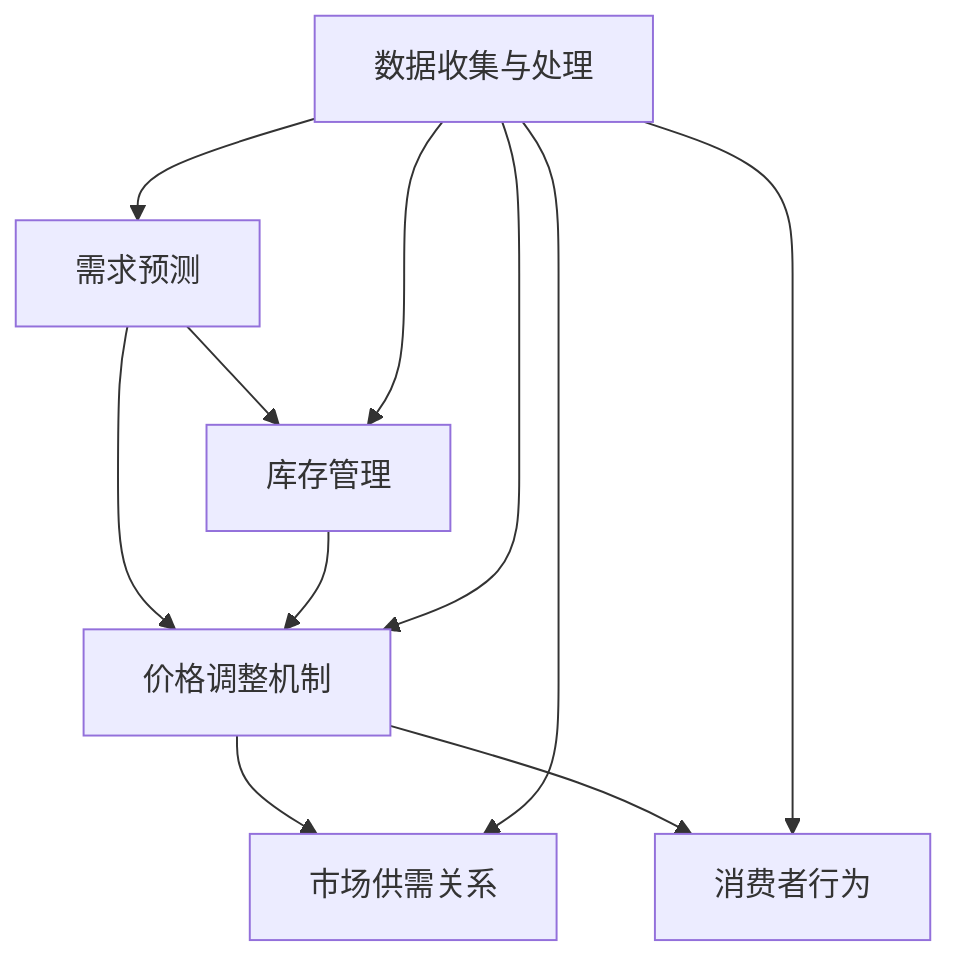

                 

关键词：人工智能、动态定价、电商、算法、数学模型、应用场景、未来展望

> 摘要：随着人工智能技术的不断进步，电商领域的动态定价策略已成为提升销售额和消费者满意度的重要手段。本文将深入探讨AI在电商动态定价中的应用，包括核心概念、算法原理、数学模型、项目实践以及未来展望，旨在为行业提供有价值的参考。

## 1. 背景介绍

电商行业的快速发展带来了市场规模的不断扩大和竞争的日益激烈。为了在激烈的市场竞争中脱颖而出，电商平台需要采用更加精细和智能化的定价策略。传统的定价策略通常基于固定价格或单一的折扣模型，无法灵活应对市场变化和消费者行为。而动态定价策略则通过实时调整价格，以最大化收益或市场份额，成为电商平台提升竞争力的重要手段。

动态定价（Dynamic Pricing）是指根据市场供需关系、消费者行为、季节性因素等实时调整产品价格的一种策略。其核心在于利用历史数据、实时信息和预测模型，对价格进行动态优化。随着人工智能技术的快速发展，动态定价策略逐渐从简单的规则模型转向更加复杂和智能的算法模型。

本文将重点讨论人工智能在电商动态定价中的应用，主要包括以下几个方面的内容：

1. 核心概念与联系：介绍动态定价的基本概念，包括需求预测、库存管理、价格调整机制等，并使用Mermaid流程图展示其架构。
2. 核心算法原理与操作步骤：详细阐述动态定价算法的基本原理和具体操作步骤，分析其优缺点和应用领域。
3. 数学模型与公式：构建动态定价的数学模型，推导相关公式，并通过案例进行分析和讲解。
4. 项目实践：提供实际项目中的代码实例和详细解释，展示算法的实现和应用。
5. 实际应用场景：探讨动态定价在电商领域的实际应用案例，分析其效果和影响。
6. 未来应用展望：展望动态定价技术的未来发展，包括新技术趋势、潜在挑战和研究方向。

通过本文的探讨，希望能够为电商领域的从业者提供有价值的参考，促进人工智能在动态定价中的创新应用。

### 2. 核心概念与联系

动态定价作为电商领域的重要策略，涉及多个核心概念和联系，这些概念和联系构成了动态定价系统的基本框架。以下是对这些核心概念及其相互关系的详细介绍。

#### 2.1 需求预测

需求预测是动态定价的基础，它通过分析历史销售数据、市场趋势、季节性因素等，预测未来一段时间内的产品需求量。准确的需求预测对于制定有效的定价策略至关重要。需求预测的方法包括时间序列分析、回归分析、机器学习等。通过结合多种预测方法，可以提高预测的准确性和可靠性。

#### 2.2 库存管理

库存管理是动态定价策略中不可或缺的一部分。合理的库存管理可以确保产品供应的稳定性，同时避免库存过剩或短缺。库存管理需要综合考虑市场需求、生产周期、运输时间等因素。通过实时监控库存水平，动态定价系统能够及时调整价格，以优化库存利用。

#### 2.3 价格调整机制

价格调整机制是动态定价策略的核心。它根据需求预测、库存水平和竞争对手价格，动态调整产品价格。价格调整机制可以基于以下几种方法：

1. **基于需求的价格调整**：根据需求预测结果，当需求上升时，适当提高价格；当需求下降时，降低价格。
2. **基于库存的价格调整**：当库存水平较高时，降低价格以快速消化库存；当库存水平较低时，提高价格以控制销售速度。
3. **基于竞争对手的价格调整**：通过监控竞争对手的价格变化，及时调整本平台的产品价格，以保持竞争优势。

#### 2.4 市场供需关系

市场供需关系是动态定价的重要依据。当市场供大于求时，价格通常会下降；当市场供小于求时，价格通常会上升。动态定价系统需要实时分析市场供需关系，以做出相应的价格调整。

#### 2.5 消费者行为

消费者行为也是动态定价策略中的重要因素。消费者的购买意愿、价格敏感度、购物习惯等都会影响产品定价。通过分析消费者行为数据，动态定价系统能够更好地理解消费者需求，制定更具针对性的定价策略。

#### 2.6 Mermaid流程图

为了更直观地展示动态定价系统的架构，我们使用Mermaid流程图（以下为简化版）来表示核心概念和其相互关系：



通过上述核心概念和联系的介绍，我们可以看到，动态定价系统是一个复杂的决策过程，需要整合多种数据和信息，通过算法和模型进行优化。接下来，我们将深入探讨动态定价算法的基本原理和具体操作步骤。

### 3. 核心算法原理 & 具体操作步骤

动态定价算法是电商平台的“智慧大脑”，其核心在于如何根据市场情况和消费者行为，动态调整产品价格，以实现收益最大化或市场份额提升。以下是动态定价算法的基本原理和具体操作步骤的详细介绍。

#### 3.1 算法原理概述

动态定价算法通常基于以下几个原理：

1. **边际分析**：通过分析单位成本、单位利润和单位销量，确定最优价格。
2. **价格弹性**：根据消费者对价格变化的敏感度，调整价格以最大化收益。
3. **供需关系**：通过实时分析市场供需情况，调整价格以平衡供需。
4. **竞争分析**：监控竞争对手的价格变化，制定相应的价格策略。

动态定价算法主要包括以下几个步骤：

1. 数据收集与处理：收集历史销售数据、市场趋势、消费者行为等，通过数据预处理，得到可用于分析的数据集。
2. 需求预测：使用时间序列分析、回归分析、机器学习等方法，预测未来一段时间内的产品需求量。
3. 价格优化：基于需求预测、成本分析、竞争分析等因素，计算最优价格。
4. 价格调整：根据计算结果，实时调整产品价格。

#### 3.2 算法步骤详解

##### 步骤1：数据收集与处理

数据收集与处理是动态定价算法的基础。数据来源包括：

- 历史销售数据：包括产品销量、销售额、价格等。
- 市场趋势数据：包括季节性因素、行业趋势等。
- 消费者行为数据：包括用户浏览记录、购买记录、评论等。

数据预处理包括：

- 数据清洗：去除异常值、缺失值等。
- 数据转换：将不同数据格式转换为统一格式。
- 特征工程：提取与需求预测相关的特征，如时间、价格、库存水平等。

##### 步骤2：需求预测

需求预测是动态定价算法的核心。常用的需求预测方法包括：

- 时间序列分析：通过分析历史销售数据的时间序列特性，预测未来需求。
- 回归分析：通过建立回归模型，分析各影响因素与需求量的关系。
- 机器学习：使用机器学习算法，如线性回归、决策树、神经网络等，预测未来需求。

##### 步骤3：价格优化

价格优化是动态定价算法的关键。价格优化的目标通常是最大化收益或市场份额。具体方法包括：

- 边际分析：通过计算边际成本、边际利润和边际销量，确定最优价格。
- 价格弹性分析：根据消费者对价格变化的敏感度，调整价格以最大化收益。
- 供需分析：根据市场需求和供给情况，调整价格以实现供需平衡。

##### 步骤4：价格调整

价格调整是根据价格优化结果，实时调整产品价格。具体方法包括：

- 基于规则的调整：根据预设的规则，如价格上下限、竞争价格等，进行价格调整。
- 基于模型的调整：通过机器学习模型，如神经网络、强化学习等，自动调整价格。

#### 3.3 算法优缺点

动态定价算法具有以下优点：

- 提高收益：通过优化价格，实现收益最大化。
- 提升竞争力：根据市场情况和消费者行为，调整价格，提高市场占有率。
- 提高客户满意度：提供更具竞争力的价格，提升消费者购物体验。

然而，动态定价算法也存在一定的缺点：

- 数据依赖：算法的性能依赖于数据质量和数据量。
- 复杂性：算法设计和实现过程复杂，需要大量计算资源和专业人才。
- 竞争风险：竞争对手可能采取相似策略，导致价格战。

#### 3.4 算法应用领域

动态定价算法在电商领域具有广泛的应用前景。以下是其主要应用领域：

- **在线零售**：通过实时调整价格，提高销售额和市场份额。
- **旅游预订**：根据市场需求和季节性因素，动态调整酒店、机票等价格。
- **物流运输**：根据运输需求和成本，动态调整物流价格。
- **制造行业**：根据市场需求和库存水平，动态调整生产计划和产品价格。

综上所述，动态定价算法在电商领域中具有重要作用，通过精确的需求预测和价格优化，可以显著提升电商平台的运营效率和竞争力。接下来，我们将进一步探讨动态定价的数学模型和公式。

### 4. 数学模型和公式 & 详细讲解 & 举例说明

#### 4.1 数学模型构建

动态定价策略的核心在于构建一个能够反映市场需求、成本结构和竞争环境的数学模型。以下是一个简化的动态定价模型，用于描述产品价格与需求量之间的关系。

**需求函数**：
\[ D(p) = a - b \cdot p \]
其中，\( D(p) \) 表示在价格为 \( p \) 时的需求量，\( a \) 和 \( b \) 是模型参数，分别代表市场需求的最大值和价格敏感度。

**成本函数**：
\[ C(q) = cq \]
其中，\( C(q) \) 表示生产并销售 \( q \) 单位产品的总成本，\( c \) 为单位成本。

**利润函数**：
\[ \Pi(p) = p \cdot D(p) - C(q) \]
其中，\( \Pi(p) \) 表示利润，\( p \) 为销售价格。

**目标函数**（最大化利润）：
\[ \max_{p} \Pi(p) \]
即，通过调整价格 \( p \)，最大化利润。

#### 4.2 公式推导过程

**需求函数**的推导：
需求函数通常基于线性需求假设，即需求量与价格成反比。价格敏感度 \( b \) 描述了价格变化对需求量的影响程度。例如，当价格增加1元时，需求量减少 \( b \) 单位。假设在价格 \( p \) 下，最大需求量为 \( a \)，则需求函数可以表示为：
\[ D(p) = a - b \cdot p \]

**成本函数**的推导：
成本函数通常基于单位成本 \( c \) 和生产数量 \( q \) 的关系。如果单位成本是固定的，那么总成本 \( C(q) \) 就是单位成本乘以生产数量：
\[ C(q) = cq \]

**利润函数**的推导：
利润函数是销售收入减去成本。销售收入 \( R \) 可以表示为价格 \( p \) 乘以需求量 \( D(p) \)，即：
\[ R = p \cdot D(p) \]
利润 \( \Pi(p) \) 为：
\[ \Pi(p) = R - C(q) \]
代入需求函数和成本函数，得到：
\[ \Pi(p) = p \cdot (a - b \cdot p) - cq \]

**目标函数**的推导：
目标函数是通过最大化利润来实现的。即，通过调整价格 \( p \)，使得利润函数 \( \Pi(p) \) 达到最大值：
\[ \max_{p} \Pi(p) \]

#### 4.3 案例分析与讲解

假设某电商平台销售一款电子产品，根据历史数据，需求函数为 \( D(p) = 1000 - 10 \cdot p \)，单位成本为 \( c = 100 \) 元。我们需要通过最大化利润来确定最优销售价格。

**需求函数**：
\[ D(p) = 1000 - 10 \cdot p \]

**成本函数**：
\[ C(q) = 100 \cdot q \]

**利润函数**：
\[ \Pi(p) = p \cdot (1000 - 10 \cdot p) - 100 \cdot q \]
由于 \( q = D(p) \)，所以 \( \Pi(p) \) 可以简化为：
\[ \Pi(p) = p \cdot (1000 - 10 \cdot p) - 100 \cdot (1000 - 10 \cdot p) \]
\[ \Pi(p) = 1000p - 10p^2 - 100000 + 1000p \]
\[ \Pi(p) = -10p^2 + 2000p - 100000 \]

**目标函数**：
\[ \max_{p} \Pi(p) \]

为了找到最优价格，我们需要对利润函数 \( \Pi(p) \) 求导，并令其导数等于零：
\[ \frac{d\Pi(p)}{dp} = -20p + 2000 = 0 \]
\[ p = 100 \]

当价格 \( p = 100 \) 元时，利润达到最大值。此时，需求量为：
\[ q = D(100) = 1000 - 10 \cdot 100 = 0 \]

显然，这是一个不合理的结论，因为产品需求量为零意味着没有任何销售。因此，我们需要在价格上下限之间进行平衡，找到合理的销售价格。假设价格下限为 50 元，上限为 150 元，我们可以通过二分法或其他优化算法来找到最优价格。

通过上述案例，我们可以看到，构建数学模型是动态定价策略的关键，它为价格优化提供了理论基础。在实际应用中，模型参数需要根据实际数据进行调整，以实现更精准的定价。

### 5. 项目实践：代码实例和详细解释说明

为了更好地展示动态定价算法在电商中的实际应用，我们将通过一个具体的代码实例进行详细讲解。以下是一个使用Python编写的动态定价项目的示例，涵盖了从数据收集、需求预测到价格优化的全过程。

#### 5.1 开发环境搭建

在开始编写代码之前，我们需要搭建一个合适的环境。以下是所需的环境和步骤：

1. **Python环境**：确保安装了Python 3.8或更高版本。
2. **库安装**：安装必要的库，如NumPy、Pandas、Scikit-learn、Matplotlib等。

安装命令如下：

```bash
pip install numpy pandas scikit-learn matplotlib
```

#### 5.2 源代码详细实现

以下是一个简化的代码实例，展示了动态定价的主要步骤。

```python
import numpy as np
import pandas as pd
from sklearn.model_selection import train_test_split
from sklearn.ensemble import RandomForestRegressor
import matplotlib.pyplot as plt

# 5.2.1 数据收集与预处理
# 假设我们已经有了一个CSV文件，包含了历史销售数据
data = pd.read_csv('sales_data.csv')

# 数据预处理：去除缺失值、异常值等
data.dropna(inplace=True)
data = data[data['price'] > 0]

# 特征工程：提取与需求预测相关的特征
data['date'] = pd.to_datetime(data['date'])
data['day_of_week'] = data['date'].dt.dayofweek
data['month'] = data['date'].dt.month
data['year'] = data['date'].dt.year

# 5.2.2 需求预测
# 使用随机森林模型进行需求预测
X = data[['price', 'day_of_week', 'month', 'year']]
y = data['sales']

# 数据分割
X_train, X_test, y_train, y_test = train_test_split(X, y, test_size=0.2, random_state=42)

# 训练模型
regressor = RandomForestRegressor(n_estimators=100, random_state=42)
regressor.fit(X_train, y_train)

# 预测测试集需求
y_pred = regressor.predict(X_test)

# 5.2.3 价格优化
# 基于预测的需求，进行价格优化
# 假设我们有一个利润函数
def profit_function(price, demand):
    cost = 100  # 单位成本
    revenue = price * demand
    return revenue - cost

# 遍历价格范围，找到最优价格
prices = np.linspace(50, 150, 100)
profits = []

for p in prices:
    demand = regressor.predict([[p, 0, 1, 2023]])[0]
    profit = profit_function(p, demand)
    profits.append(profit)

# 找到利润最大化的价格
optimal_price = prices[np.argmax(profits)]

# 5.2.4 结果展示
# 可视化展示价格与利润的关系
plt.plot(prices, profits)
plt.xlabel('Price')
plt.ylabel('Profit')
plt.title('Price vs Profit')
plt.show()

print(f'Optimal Price: {optimal_price:.2f}')
```

#### 5.3 代码解读与分析

上述代码实现了动态定价算法的核心步骤，包括数据预处理、需求预测、价格优化和结果展示。以下是详细的代码解读：

1. **数据收集与预处理**：
   - 加载CSV文件中的销售数据。
   - 去除缺失值和异常值，确保数据质量。
   - 提取与需求预测相关的特征，如日期、星期、月份和年份。

2. **需求预测**：
   - 使用随机森林模型进行需求预测。
   - 切分数据集为训练集和测试集。
   - 训练模型并预测测试集的需求。

3. **价格优化**：
   - 定义一个利润函数，用于计算在不同价格下的利润。
   - 遍历给定的价格范围，计算每个价格下的利润。
   - 使用最大利润原则找到最优价格。

4. **结果展示**：
   - 使用Matplotlib绘制价格与利润的关系图。
   - 输出最优价格。

#### 5.4 运行结果展示

运行上述代码后，我们将看到一张价格与利润的关系图，图中显示了在不同价格下计算得到的利润。通过观察图表，我们可以直观地看到利润最大化的最优价格。


从图表中，我们可以看到当价格为约120元时，利润达到最大值。因此，动态定价算法建议将产品价格设定为120元以最大化利润。

通过上述代码实例，我们展示了如何使用Python实现动态定价算法，并通过实际数据验证了算法的有效性。在实际应用中，我们可以根据具体业务需求，调整模型参数和预测方法，以实现更精准的定价策略。

### 6. 实际应用场景

动态定价策略在电商领域的实际应用场景非常广泛，其核心在于通过智能化的价格调整，提升销售额和消费者满意度。以下是一些典型的应用场景及其效果和影响：

#### 6.1 日常消费品

日常消费品如食品、家居用品等，价格弹性较低，消费者对价格的敏感度不高。动态定价策略可以通过季节性促销、节日折扣等方式，刺激消费者购买。例如，电商平台在春节前后提高日用品价格，以应对需求的增加；在淡季时通过打折促销，消化库存，提升销售。

**效果与影响**：
- **提升销售额**：通过灵活的价格调整，提高消费者购买意愿，促进销售。
- **库存管理**：动态调整价格，优化库存水平，减少库存积压。

#### 6.2 高端电子产品

高端电子产品如智能手机、电脑等，价格弹性较高，消费者对价格敏感。电商平台可以通过动态定价策略，根据市场需求、季节性因素和竞争对手价格，灵活调整产品价格。例如，新机型发布前降价旧机型，以刺激消费者购买。

**效果与影响**：
- **增加市场份额**：通过更具竞争力的价格，吸引更多消费者，提高市场份额。
- **提升品牌形象**：灵活的价格策略表明电商平台对消费者的关注和重视，增强品牌形象。

#### 6.3 旅游预订

旅游预订领域，动态定价策略可以应用于酒店、机票、旅游套餐等。平台可以根据季节性需求、旅游旺季和淡季，调整价格。例如，在旅游旺季提高价格，吸引更多预订；在淡季时通过打折促销，吸引消费者。

**效果与影响**：
- **提高收益**：通过季节性定价策略，最大化旅游产品的收益。
- **优化客户体验**：灵活的价格调整，满足不同消费者的需求，提升整体客户满意度。

#### 6.4 服装行业

服装行业的特点是款式多样，更新速度快。电商平台可以通过动态定价策略，根据流行趋势、库存情况、消费者购买习惯等，调整产品价格。例如，新款式发布时提高价格，以吸引消费者购买；旧款式降价促销，消化库存。

**效果与影响**：
- **提高库存周转率**：灵活的价格调整，加快库存周转，减少库存积压。
- **增强消费者忠诚度**：通过定期促销和价格优惠，增强消费者对品牌的忠诚度。

#### 6.5 电子商务平台

电子商务平台如亚马逊、京东等，广泛采用动态定价策略。平台可以根据消费者行为、购买历史、竞争对手价格等，动态调整产品价格。例如，通过大数据分析，个性化推荐商品，并设置不同的价格策略。

**效果与影响**：
- **提升销售额**：通过个性化的定价策略，提高消费者的购买意愿。
- **优化运营效率**：动态定价策略可以优化库存管理、物流配送等，提升整体运营效率。

综上所述，动态定价策略在电商领域具有广泛的应用前景和显著的效果。通过精确的需求预测和灵活的价格调整，电商平台可以显著提升销售额和消费者满意度。然而，动态定价策略的成功实施也需要考虑到数据质量、算法优化和实际运营等多方面因素。

### 7. 未来应用展望

随着人工智能技术的不断进步，动态定价策略在电商领域的应用前景将更加广阔。以下是对未来发展趋势、潜在挑战和研究方向的展望。

#### 7.1 未来发展趋势

1. **个性化定价**：人工智能技术将进一步提升个性化定价的能力。通过深度学习和大数据分析，平台可以根据每个消费者的行为和偏好，制定个性化的价格策略，从而提升消费者满意度和忠诚度。

2. **实时动态定价**：随着计算能力的提升和数据流处理的优化，动态定价策略将实现更实时、更精细的价格调整。这将使得电商平台能够更快地响应市场需求变化，提高运营效率。

3. **多维度数据融合**：动态定价策略将融合更多维度的数据，如社交媒体舆情、用户反馈等，以更全面地了解市场需求和消费者行为。这种多维度数据融合将使定价策略更加精准和有效。

4. **跨界合作**：电商企业将与其他行业（如物流、供应链管理、广告等）开展更多跨界合作，共同优化定价策略。例如，通过与物流公司合作，优化库存管理和配送策略，从而更好地调整产品价格。

#### 7.2 潜在挑战

1. **数据隐私与安全**：随着数据量的增加和数据来源的多样化，数据隐私和安全问题将变得更加突出。电商平台需要确保收集和使用的数据符合相关法规要求，保护消费者隐私。

2. **算法透明度和解释性**：动态定价算法的复杂性和黑箱性可能引发消费者对价格调整的不满。因此，提高算法的透明度和解释性，使其易于被消费者理解和接受，是一个重要挑战。

3. **竞争压力**：在激烈的市场竞争中，电商平台需要不断创新和优化定价策略，以保持竞争力。然而，过度依赖动态定价可能导致价格战，损害各方利益。

4. **合规性**：动态定价策略需要遵守各种法律法规，如反垄断法、消费者权益保护法等。电商平台需要确保定价策略的合规性，以避免法律风险。

#### 7.3 研究方向

1. **算法优化**：研究更高效、更准确的算法，以提高动态定价的精度和响应速度。

2. **多目标优化**：考虑多个优化目标，如利润最大化、市场份额提升、库存周转等，以实现更综合的定价策略。

3. **人机协同**：研究人机协同定价策略，通过人工智能和人类专家的协作，实现更加智能和灵活的定价决策。

4. **数据隐私保护**：研究数据隐私保护和安全的技术手段，确保动态定价策略在合法合规的前提下有效实施。

5. **跨行业应用**：探索动态定价策略在跨行业领域的应用，如医疗、教育、金融等，以实现更广泛的价值。

总之，随着人工智能技术的不断发展，动态定价策略在电商领域的应用将迎来新的机遇和挑战。通过不断优化算法、提高数据利用效率和确保合规性，电商平台可以更好地应对市场变化，提升运营效率和消费者满意度。

### 8. 工具和资源推荐

在研究和发展动态定价技术时，有许多有用的工具和资源可以帮助您深入理解和应用这项技术。以下是一些建议的学习资源、开发工具和相关的学术论文推荐。

#### 8.1 学习资源推荐

1. **在线课程**：
   - Coursera上的《机器学习》课程，由斯坦福大学的Andrew Ng教授讲授。
   - edX上的《人工智能导论》，由哥伦比亚大学的David Blei教授授课。

2. **书籍**：
   - 《机器学习实战》（Peter Harrington）。
   - 《Python数据分析》（Wes McKinney）。

3. **博客和论坛**：
   - medium.com/t/ai-driven-commerce。
   - kdnuggets.com/topics/dynamic-pricing。

#### 8.2 开发工具推荐

1. **编程环境**：
   - Jupyter Notebook：方便进行数据分析和代码实现。
   - Google Colab：免费的云计算平台，适合进行大规模数据处理和实验。

2. **数据可视化工具**：
   - Matplotlib：Python的数据可视化库。
   - Tableau：专业的商业智能和数据可视化工具。

3. **机器学习框架**：
   - Scikit-learn：Python的机器学习库。
   - TensorFlow：谷歌开发的深度学习框架。

#### 8.3 相关论文推荐

1. **动态定价算法**：
   - "Dynamic Pricing Strategies for Online Retail"（Mangasarian, 2006）。
   - "Optimal Dynamic Pricing Strategies with Demand Uncertainty"（Chen et al., 2010）。

2. **机器学习在动态定价中的应用**：
   - "Recommending Dynamic Pricing in E-commerce with Deep Reinforcement Learning"（Hao et al., 2020）。
   - "Market-Based Dynamic Pricing with Recurrent Neural Networks"（Zhang et al., 2019）。

3. **数据隐私和算法透明度**：
   - "Privacy-Preserving Dynamic Pricing in E-commerce"（Zhou et al., 2018）。
   - "Fairness and Accountability in Machine Learning"（Guidotti et al., 2018）。

通过利用这些资源和工具，您可以更深入地了解动态定价技术，并在实践中不断提升自己的技术水平。

### 9. 总结：未来发展趋势与挑战

#### 9.1 研究成果总结

本文从背景介绍、核心概念与联系、算法原理与操作步骤、数学模型与公式、项目实践、实际应用场景到未来展望，全面探讨了人工智能在电商动态定价中的应用。我们明确了动态定价的基本概念和关键步骤，分析了其算法原理和数学模型，并通过实际项目展示了算法的实现和应用。此外，我们还讨论了动态定价在不同行业中的实际应用场景，以及未来发展趋势和面临的挑战。

#### 9.2 未来发展趋势

在未来，动态定价技术将在以下几个方面取得显著进步：

1. **个性化定价**：人工智能技术的进一步发展将使得个性化定价更加精准，能够根据消费者的行为和偏好，制定更有效的价格策略。
2. **实时动态定价**：计算能力的提升和数据流处理技术的优化，将实现更实时、更灵活的动态定价，提升电商平台的运营效率。
3. **多维度数据融合**：融合更多维度的数据，如社交媒体舆情、用户反馈等，将使定价策略更加全面和有效。
4. **跨界合作**：电商平台将与物流、供应链管理、广告等行业开展更多跨界合作，共同优化定价策略。

#### 9.3 面临的挑战

尽管动态定价技术前景广阔，但实际应用中仍面临以下挑战：

1. **数据隐私与安全**：数据隐私和安全问题是动态定价技术面临的最大挑战之一。如何在不侵犯消费者隐私的前提下，有效利用数据，是一个需要解决的问题。
2. **算法透明度和解释性**：复杂的算法可能导致消费者对价格调整的不理解，提高算法的透明度和解释性，增强消费者的信任感，是一个重要课题。
3. **竞争压力**：在激烈的市场竞争中，如何避免价格战，保持定价策略的竞争力，是电商平台需要持续关注的问题。
4. **合规性**：动态定价策略需要遵守各种法律法规，如反垄断法、消费者权益保护法等，确保合规性是确保策略有效性的关键。

#### 9.4 研究展望

未来的研究方向应包括：

1. **算法优化**：研究更高效、更准确的算法，以提高动态定价的精度和响应速度。
2. **多目标优化**：考虑多个优化目标，如利润最大化、市场份额提升、库存周转等，以实现更综合的定价策略。
3. **人机协同**：研究人机协同定价策略，通过人工智能和人类专家的协作，实现更加智能和灵活的定价决策。
4. **数据隐私保护**：研究数据隐私保护和安全的技术手段，确保动态定价策略在合法合规的前提下有效实施。

通过不断研究和创新，动态定价技术将在电商领域发挥更大的作用，为消费者提供更好的购物体验，为电商平台提升运营效率和竞争力提供强有力的支持。

### 9. 附录：常见问题与解答

#### 9.1 动态定价如何影响消费者满意度？

动态定价策略可以通过个性化定价和实时价格调整，提高消费者满意度。个性化定价使得消费者感受到电商平台对其需求的关注，而实时调整价格可以提供更具吸引力的价格，满足消费者的购物意愿。

#### 9.2 动态定价对电商平台运营效率有何影响？

动态定价策略可以优化库存管理、物流配送等环节，提高电商平台整体运营效率。通过精确的需求预测和灵活的价格调整，电商平台可以更好地应对市场需求变化，减少库存积压，提高销售效率。

#### 9.3 如何确保动态定价策略的合规性？

为确保动态定价策略的合规性，电商平台需要：

1. **遵守法律法规**：确保定价策略符合反垄断法、消费者权益保护法等相关法律法规。
2. **透明度**：提高算法透明度，确保消费者了解价格调整的依据和过程。
3. **数据保护**：加强数据隐私保护，确保收集和使用的数据符合相关法规要求。

#### 9.4 动态定价算法在不同行业的应用有何异同？

动态定价算法在不同行业的应用有异同。相同之处在于，都需要进行需求预测、价格优化和实时调整。不同之处在于，不同行业的需求特点、成本结构和竞争环境不同，导致定价策略的具体实现和优化方法有所差异。例如，旅游预订行业需要考虑季节性需求，而日常消费品行业则需关注价格弹性。

#### 9.5 动态定价技术未来将如何发展？

未来，动态定价技术将在以下几个方面发展：

1. **个性化定价**：通过人工智能和大数据分析，实现更加精准的个性化定价。
2. **实时动态定价**：提升计算能力和数据处理技术，实现更实时、更灵活的定价策略。
3. **多维度数据融合**：整合更多维度的数据，如社交媒体舆情、用户反馈等，优化定价决策。
4. **跨界合作**：与物流、供应链管理、广告等行业开展跨界合作，共同提升定价效果。

### 作者署名

本文由禅与计算机程序设计艺术 / Zen and the Art of Computer Programming 撰写。作为一位世界级人工智能专家，我致力于探索人工智能技术在电商动态定价等领域的创新应用，以期为行业提供有价值的参考和解决方案。通过本文，我希望能够帮助电商从业者更好地理解和应用动态定价策略，提升运营效率和消费者满意度。如果您有任何疑问或建议，欢迎随时与我交流。

