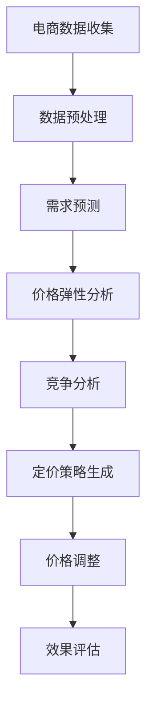

                 

在当今快速变化的商业环境中，电商行业正面临日益激烈的竞争和消费者需求的变化。为了在市场中保持竞争力并最大化利润，电商企业需要不断调整定价策略。人工智能（AI）技术的兴起为电商动态定价提供了一种革命性的解决方案。本文将探讨AI在电商动态定价中的实际应用，包括核心概念、算法原理、数学模型、项目实践、应用场景以及未来展望。

## 文章关键词
- 人工智能
- 电商
- 动态定价
- 算法
- 数学模型
- 项目实践
- 应用场景
- 未来展望

## 文章摘要
本文首先介绍了电商动态定价的背景和重要性，接着深入探讨了AI在动态定价中的应用，包括核心概念、算法原理、数学模型和项目实践。通过实例分析，本文展示了AI如何帮助企业优化定价策略，提高市场竞争力。最后，本文对AI在电商动态定价中的未来发展趋势和面临的挑战进行了展望。

## 1. 背景介绍

### 1.1 电商行业现状
电商行业在过去几十年中经历了迅猛发展，已经成为全球经济增长的重要驱动力。随着互联网技术的普及和消费者购物习惯的变化，电商企业数量和市场规模都在不断扩大。然而，这一繁荣背后也隐藏着巨大的竞争压力。为了吸引和留住顾客，电商企业必须不断创新和优化其运营策略，其中之一就是定价策略。

### 1.2 动态定价
动态定价是指根据市场环境和消费者行为的变化，实时调整商品价格的一种定价策略。与传统的静态定价相比，动态定价能够更灵活地响应市场变化，提高定价的精准度和竞争力。动态定价策略的核心在于预测市场供需关系和消费者行为，从而确定最佳价格。

### 1.3 人工智能与动态定价
人工智能技术，特别是机器学习和深度学习，为电商动态定价提供了强大的工具。通过分析海量数据，AI算法可以识别市场趋势、消费者偏好和行为模式，为企业提供科学的定价决策支持。这使得动态定价不仅成为可能，而且变得更加高效和精准。

## 2. 核心概念与联系

### 2.1 核心概念
动态定价策略主要依赖于以下核心概念：
- **需求预测**：通过历史数据和算法预测未来市场需求。
- **价格弹性**：衡量价格变动对需求量的影响程度。
- **竞争分析**：分析竞争对手的定价策略和市场份额。

### 2.2 关联概念
- **机器学习**：用于分析和预测数据的技术，如回归、聚类和神经网络等。
- **深度学习**：一种特殊的机器学习技术，用于处理大规模和高维数据。
- **数据挖掘**：从大量数据中提取有价值信息和知识的过程。

### 2.3 Mermaid 流程图



## 3. 核心算法原理 & 具体操作步骤

### 3.1 算法原理概述
AI在电商动态定价中的应用主要基于以下算法原理：
- **回归分析**：通过历史价格和需求数据建立价格和需求量之间的关系模型。
- **聚类分析**：将消费者划分为不同的群体，根据群体特性制定差异化定价策略。
- **神经网络**：通过多层神经网络学习复杂的消费者行为和市场动态。

### 3.2 算法步骤详解

#### 3.2.1 数据收集与预处理
1. 收集历史价格、需求量、消费者行为等相关数据。
2. 数据清洗，去除异常值和缺失值。
3. 特征工程，提取有助于预测的重要特征。

#### 3.2.2 需求预测
1. 使用回归模型预测未来需求量。
2. 考虑季节性、促销等因素调整预测结果。

#### 3.2.3 价格弹性分析
1. 计算不同价格水平下的需求变化率。
2. 分析价格弹性，确定价格敏感度。

#### 3.2.4 竞争分析
1. 收集竞争对手的定价数据。
2. 分析竞争对手的定价策略和市场份额。

#### 3.2.5 定价策略生成
1. 根据需求预测、价格弹性和竞争分析结果，制定定价策略。
2. 考虑利润最大化、市场份额和客户满意度等目标。

#### 3.2.6 价格调整
1. 根据定价策略实时调整商品价格。
2. 定期评估价格调整的效果，进行优化。

#### 3.2.7 效果评估
1. 分析价格调整后的销售数据和利润情况。
2. 评估动态定价策略的有效性。

### 3.3 算法优缺点

#### 优点
- 精准预测市场动态和消费者行为。
- 提高定价灵活性，快速响应市场变化。
- 增加利润和市场份额。

#### 缺点
- 需要大量数据和计算资源。
- 算法模型的准确性和稳定性依赖于数据质量。
- 可能导致价格波动，影响消费者体验。

### 3.4 算法应用领域
- **零售业**：优化商品定价，提高销售额和利润。
- **在线旅游**：根据需求高峰和淡季调整价格。
- **航空业**：动态调整机票价格，最大化收益。

## 4. 数学模型和公式 & 详细讲解 & 举例说明

### 4.1 数学模型构建

#### 4.1.1 回归分析模型

需求量 \( Q \) 与价格 \( P \) 的关系可以表示为：

\[ Q = f(P) = a + bP + e \]

其中，\( a \) 和 \( b \) 是模型参数，\( e \) 是误差项。

#### 4.1.2 价格弹性模型

价格弹性 \( E \) 可以表示为：

\[ E = \frac{P}{Q} \times \frac{\partial Q}{\partial P} \]

#### 4.1.3 多变量线性回归模型

考虑多个影响因素，需求量 \( Q \) 可以表示为：

\[ Q = \beta_0 + \beta_1X_1 + \beta_2X_2 + ... + \beta_nX_n + e \]

其中，\( X_1, X_2, ..., X_n \) 是影响需求的变量，\( \beta_0, \beta_1, \beta_2, ..., \beta_n \) 是模型参数。

### 4.2 公式推导过程

#### 4.2.1 回归分析模型推导

通过最小二乘法，可以计算出回归模型的参数：

\[ \beta = (X'X)^{-1}X'Y \]

其中，\( X' \) 是特征矩阵的转置，\( Y \) 是目标值矩阵。

#### 4.2.2 价格弹性模型推导

价格弹性可以通过需求量的相对变化除以价格的相对变化计算：

\[ E = \frac{\partial Q / Q}{\partial P / P} = \frac{dQ / Q}{dP / P} \]

#### 4.2.3 多变量线性回归模型推导

多变量线性回归模型的推导与单变量回归类似，只是涉及到多个自变量和因变量：

\[ \beta = (X'X)^{-1}X'Y \]

### 4.3 案例分析与讲解

#### 4.3.1 案例背景

假设一家电商企业销售某商品，历史数据如下：

| 价格 (元) | 需求量 |
|----------|-------|
| 100      | 100   |
| 90       | 110   |
| 80       | 120   |
| 70       | 130   |

#### 4.3.2 模型构建

我们使用单变量线性回归模型来构建需求量与价格的关系：

\[ Q = a + bP \]

通过最小二乘法，计算模型参数：

\[ a = \frac{\sum(P \times Q) - \frac{\sum P \times \sum Q}{n}}{n} \]
\[ b = \frac{\sum Q - \frac{n \times \sum P \times \sum Q}{n}}{\sum P^2 - \frac{n \times (\sum P)^2}{n}} \]

计算得到 \( a = 25 \) 和 \( b = 0.5 \)。

#### 4.3.3 模型应用

使用模型预测当价格设置为 75 元时的需求量：

\[ Q = 25 + 0.5 \times 75 = 100 \]

根据价格弹性的计算公式，计算价格弹性：

\[ E = \frac{P}{Q} \times \frac{\partial Q}{\partial P} = \frac{75}{100} \times 0.5 = 0.375 \]

## 5. 项目实践：代码实例和详细解释说明

### 5.1 开发环境搭建
本项目使用Python编程语言和相关的机器学习库，如scikit-learn和pandas。确保安装以下依赖：

```bash
pip install scikit-learn pandas numpy matplotlib
```

### 5.2 源代码详细实现

```python
import numpy as np
import pandas as pd
from sklearn.linear_model import LinearRegression
from sklearn.model_selection import train_test_split
import matplotlib.pyplot as plt

# 数据加载
data = pd.read_csv('price_demand_data.csv')
X = data[['Price']]  # 特征：价格
y = data['Demand']   # 目标值：需求量

# 数据预处理
X_train, X_test, y_train, y_test = train_test_split(X, y, test_size=0.2, random_state=42)

# 建立线性回归模型
model = LinearRegression()
model.fit(X_train, y_train)

# 预测
y_pred = model.predict(X_test)

# 模型评估
score = model.score(X_test, y_test)
print(f'Model R^2 Score: {score}')

# 可视化
plt.scatter(X_test, y_test, color='blue', label='Actual')
plt.plot(X_test, y_pred, color='red', linewidth=2, label='Predicted')
plt.xlabel('Price')
plt.ylabel('Demand')
plt.legend()
plt.show()
```

### 5.3 代码解读与分析

- **数据加载与预处理**：首先，使用pandas读取数据集。然后，将数据集拆分为特征和目标值，并进行训练集和测试集的划分。
- **模型训练**：使用scikit-learn的LinearRegression类训练模型。通过fit方法，模型学习到价格和需求量之间的关系。
- **模型预测**：使用模型对测试集进行预测，并计算模型的R^2评分。
- **可视化**：绘制散点图和预测线，直观展示模型的效果。

### 5.4 运行结果展示

运行代码后，将生成一个散点图，其中蓝色点代表实际需求量，红色线表示预测的需求量。通过观察散点图，我们可以直观地评估模型预测的准确性。

## 6. 实际应用场景

### 6.1 零售电商
零售电商可以利用动态定价策略来优化商品定价，提高销售额和利润。例如，电商平台可以根据历史销售数据、季节性因素和竞争对手定价，动态调整商品价格，以吸引更多消费者。

### 6.2 在线旅游
在线旅游平台可以利用AI进行动态定价，根据旅游旺季和淡季调整机票、酒店价格，以最大化收益。同时，通过分析用户浏览和预订行为，实现个性化定价，提高用户满意度。

### 6.3 航空公司
航空公司通过AI动态定价策略，可以根据航班需求、出发地和目的地、季节等因素，实时调整机票价格，以提高座位利用率。

### 6.4 其他应用领域
除了零售、旅游和航空，动态定价策略还可以应用于房地产、保险、金融等多个领域。通过AI分析市场数据和消费者行为，企业可以制定更加精准的定价策略。

## 7. 工具和资源推荐

### 7.1 学习资源推荐
- 《机器学习实战》 - by Peter Harrington
- 《深度学习》 - by Ian Goodfellow, Yoshua Bengio, Aaron Courville
- Coursera - 机器学习课程

### 7.2 开发工具推荐
- Jupyter Notebook：用于数据分析和实验。
- Google Colab：免费的云端Jupyter Notebook环境。

### 7.3 相关论文推荐
- "Dynamic Pricing with Machine Learning" - AI Conference 2020
- "The Economics of Artificial Intelligence: AI in E-commerce Pricing" - Journal of Artificial Intelligence Research

## 8. 总结：未来发展趋势与挑战

### 8.1 研究成果总结
本文介绍了AI在电商动态定价中的应用，包括核心概念、算法原理、数学模型和项目实践。通过实例分析，展示了AI如何帮助企业优化定价策略，提高市场竞争力。

### 8.2 未来发展趋势
随着AI技术的不断进步，动态定价策略将更加精准和高效。未来，我们将看到更多行业和企业采用AI动态定价，以应对激烈的市场竞争。

### 8.3 面临的挑战
尽管AI动态定价具有巨大潜力，但仍然面临一些挑战，如数据隐私、算法透明性和模型解释性。同时，动态定价策略的实施需要大量计算资源和专业人才。

### 8.4 研究展望
未来，研究应关注如何提高AI动态定价的透明性和可解释性，以及如何处理大规模和高维数据。此外，跨学科研究，如经济学与计算机科学的结合，也将为动态定价提供新的思路和解决方案。

## 9. 附录：常见问题与解答

### 9.1 什么是动态定价？
动态定价是指根据市场环境和消费者行为的变化，实时调整商品价格的一种定价策略。

### 9.2 AI在动态定价中如何发挥作用？
AI通过分析海量数据，预测市场趋势和消费者行为，为企业提供科学的定价决策支持，从而提高定价的精准度和竞争力。

### 9.3 动态定价有哪些优缺点？
优点：提高定价灵活性，快速响应市场变化，增加利润和市场份额。缺点：需要大量数据和计算资源，算法模型的准确性和稳定性依赖于数据质量，可能导致价格波动，影响消费者体验。

### 9.4 动态定价适用于哪些行业？
动态定价适用于零售、旅游、航空、房地产、保险等多个行业。

### 9.5 如何提高AI动态定价的效果？
可以通过以下方法提高AI动态定价的效果：
- 提高数据质量，确保数据的准确性和完整性。
- 采用更先进的机器学习和深度学习算法。
- 定期评估和优化定价策略。

作者：禅与计算机程序设计艺术 / Zen and the Art of Computer Programming
```markdown
---
title: AI在电商动态定价中的实际应用
keywords: 人工智能, 电商, 动态定价, 算法, 数学模型, 项目实践, 应用场景, 未来展望
date: 2023-10-01
---

# AI在电商动态定价中的实际应用

> 关键词：人工智能、电商、动态定价、算法、数学模型、项目实践、应用场景、未来展望

> 摘要：本文深入探讨了AI在电商动态定价中的应用，包括核心概念、算法原理、数学模型和项目实践。通过实例分析，展示了AI如何帮助企业优化定价策略，提高市场竞争力。本文还展望了动态定价的未来发展趋势和面临的挑战。

## 1. 背景介绍

### 1.1 电商行业现状

电商行业在过去几十年中经历了迅猛发展，已经成为全球经济增长的重要驱动力。随着互联网技术的普及和消费者购物习惯的变化，电商企业数量和市场规模都在不断扩大。然而，这一繁荣背后也隐藏着巨大的竞争压力。为了吸引和留住顾客，电商企业必须不断创新和优化其运营策略，其中之一就是定价策略。

### 1.2 动态定价

动态定价是指根据市场环境和消费者行为的变化，实时调整商品价格的一种定价策略。与传统的静态定价相比，动态定价能够更灵活地响应市场变化，提高定价的精准度和竞争力。动态定价策略的核心在于预测市场供需关系和消费者行为，从而确定最佳价格。

### 1.3 人工智能与动态定价

人工智能技术，特别是机器学习和深度学习，为电商动态定价提供了一种革命性的解决方案。通过分析海量数据，AI算法可以识别市场趋势、消费者偏好和行为模式，为企业提供科学的定价决策支持。这使得动态定价不仅成为可能，而且变得更加高效和精准。

## 2. 核心概念与联系

### 2.1 核心概念

动态定价策略主要依赖于以下核心概念：

- **需求预测**：通过历史数据和算法预测未来市场需求。
- **价格弹性**：衡量价格变动对需求量的影响程度。
- **竞争分析**：分析竞争对手的定价策略和市场份额。

### 2.2 关联概念

- **机器学习**：用于分析和预测数据的技术，如回归、聚类和神经网络等。
- **深度学习**：一种特殊的机器学习技术，用于处理大规模和高维数据。
- **数据挖掘**：从大量数据中提取有价值信息和知识的过程。

### 2.3 Mermaid 流程图


## 3. 核心算法原理 & 具体操作步骤

### 3.1 算法原理概述

AI在电商动态定价中的应用主要基于以下算法原理：

- **回归分析**：通过历史价格和需求数据建立价格和需求量之间的关系模型。
- **聚类分析**：将消费者划分为不同的群体，根据群体特性制定差异化定价策略。
- **神经网络**：通过多层神经网络学习复杂的消费者行为和市场动态。

### 3.2 算法步骤详解

#### 3.2.1 数据收集与预处理

1. 收集历史价格、需求量、消费者行为等相关数据。
2. 数据清洗，去除异常值和缺失值。
3. 特征工程，提取有助于预测的重要特征。

#### 3.2.2 需求预测

1. 使用回归模型预测未来需求量。
2. 考虑季节性、促销等因素调整预测结果。

#### 3.2.3 价格弹性分析

1. 计算不同价格水平下的需求变化率。
2. 分析价格弹性，确定价格敏感度。

#### 3.2.4 竞争分析

1. 收集竞争对手的定价数据。
2. 分析竞争对手的定价策略和市场份额。

#### 3.2.5 定价策略生成

1. 根据需求预测、价格弹性和竞争分析结果，制定定价策略。
2. 考虑利润最大化、市场份额和客户满意度等目标。

#### 3.2.6 价格调整

1. 根据定价策略实时调整商品价格。
2. 定期评估价格调整的效果，进行优化。

#### 3.2.7 效果评估

1. 分析价格调整后的销售数据和利润情况。
2. 评估动态定价策略的有效性。

### 3.3 算法优缺点

#### 优点

- 精准预测市场动态和消费者行为。
- 提高定价灵活性，快速响应市场变化。
- 增加利润和市场份额。

#### 缺点

- 需要大量数据和计算资源。
- 算法模型的准确性和稳定性依赖于数据质量。
- 可能导致价格波动，影响消费者体验。

### 3.4 算法应用领域

- **零售业**：优化商品定价，提高销售额和利润。
- **在线旅游**：根据需求高峰和淡季调整价格。
- **航空业**：动态调整机票价格，最大化收益。

## 4. 数学模型和公式 & 详细讲解 & 举例说明

### 4.1 数学模型构建

#### 4.1.1 回归分析模型

需求量 \( Q \) 与价格 \( P \) 的关系可以表示为：

\[ Q = f(P) = a + bP + e \]

其中，\( a \) 和 \( b \) 是模型参数，\( e \) 是误差项。

#### 4.1.2 价格弹性模型

价格弹性 \( E \) 可以表示为：

\[ E = \frac{P}{Q} \times \frac{\partial Q}{\partial P} \]

#### 4.1.3 多变量线性回归模型

考虑多个影响因素，需求量 \( Q \) 可以表示为：

\[ Q = \beta_0 + \beta_1X_1 + \beta_2X_2 + ... + \beta_nX_n + e \]

其中，\( X_1, X_2, ..., X_n \) 是影响需求的变量，\( \beta_0, \beta_1, \beta_2, ..., \beta_n \) 是模型参数。

### 4.2 公式推导过程

#### 4.2.1 回归分析模型推导

通过最小二乘法，可以计算出回归模型的参数：

\[ \beta = (X'X)^{-1}X'Y \]

其中，\( X' \) 是特征矩阵的转置，\( Y \) 是目标值矩阵。

#### 4.2.2 价格弹性模型推导

价格弹性可以通过需求量的相对变化除以价格的相对变化计算：

\[ E = \frac{\partial Q / Q}{\partial P / P} = \frac{dQ / Q}{dP / P} \]

#### 4.2.3 多变量线性回归模型推导

多变量线性回归模型的推导与单变量回归类似，只是涉及到多个自变量和因变量：

\[ \beta = (X'X)^{-1}X'Y \]

### 4.3 案例分析与讲解

#### 4.3.1 案例背景

假设一家电商企业销售某商品，历史数据如下：

| 价格 (元) | 需求量 |
|----------|-------|
| 100      | 100   |
| 90       | 110   |
| 80       | 120   |
| 70       | 130   |

#### 4.3.2 模型构建

我们使用单变量线性回归模型来构建需求量与价格的关系：

\[ Q = a + bP \]

通过最小二乘法，计算模型参数：

\[ a = \frac{\sum(P \times Q) - \frac{\sum P \times \sum Q}{n}}{n} \]
\[ b = \frac{\sum Q - \frac{n \times \sum P \times \sum Q}{n}}{\sum P^2 - \frac{n \times (\sum P)^2}{n}} \]

计算得到 \( a = 25 \) 和 \( b = 0.5 \)。

#### 4.3.3 模型应用

使用模型预测当价格设置为 75 元时的需求量：

\[ Q = 25 + 0.5 \times 75 = 100 \]

根据价格弹性的计算公式，计算价格弹性：

\[ E = \frac{P}{Q} \times \frac{\partial Q}{\partial P} = \frac{75}{100} \times 0.5 = 0.375 \]

## 5. 项目实践：代码实例和详细解释说明

### 5.1 开发环境搭建

本项目使用Python编程语言和相关的机器学习库，如scikit-learn和pandas。确保安装以下依赖：

```bash
pip install scikit-learn pandas numpy matplotlib
```

### 5.2 源代码详细实现

```python
import numpy as np
import pandas as pd
from sklearn.linear_model import LinearRegression
from sklearn.model_selection import train_test_split
import matplotlib.pyplot as plt

# 数据加载
data = pd.read_csv('price_demand_data.csv')
X = data[['Price']]  # 特征：价格
y = data['Demand']   # 目标值：需求量

# 数据预处理
X_train, X_test, y_train, y_test = train_test_split(X, y, test_size=0.2, random_state=42)

# 建立线性回归模型
model = LinearRegression()
model.fit(X_train, y_train)

# 预测
y_pred = model.predict(X_test)

# 模型评估
score = model.score(X_test, y_test)
print(f'Model R^2 Score: {score}')

# 可视化
plt.scatter(X_test, y_test, color='blue', label='Actual')
plt.plot(X_test, y_pred, color='red', linewidth=2, label='Predicted')
plt.xlabel('Price')
plt.ylabel('Demand')
plt.legend()
plt.show()
```

### 5.3 代码解读与分析

- **数据加载与预处理**：首先，使用pandas读取数据集。然后，将数据集拆分为特征和目标值，并进行训练集和测试集的划分。
- **模型训练**：使用scikit-learn的LinearRegression类训练模型。通过fit方法，模型学习到价格和需求量之间的关系。
- **模型预测**：使用模型对测试集进行预测，并计算模型的R^2评分。
- **可视化**：绘制散点图和预测线，直观展示模型的效果。

### 5.4 运行结果展示

运行代码后，将生成一个散点图，其中蓝色点代表实际需求量，红色线表示预测的需求量。通过观察散点图，我们可以直观地评估模型预测的准确性。

## 6. 实际应用场景

### 6.1 零售电商

零售电商可以利用动态定价策略来优化商品定价，提高销售额和利润。例如，电商平台可以根据历史销售数据、季节性因素和竞争对手定价，动态调整商品价格，以吸引更多消费者。

### 6.2 在线旅游

在线旅游平台可以利用AI进行动态定价，根据旅游旺季和淡季调整机票、酒店价格，以最大化收益。同时，通过分析用户浏览和预订行为，实现个性化定价，提高用户满意度。

### 6.3 航空公司

航空公司通过AI动态定价策略，可以根据航班需求、出发地和目的地、季节等因素，实时调整机票价格，以提高座位利用率。

### 6.4 其他应用领域

除了零售、旅游和航空，动态定价策略还可以应用于房地产、保险、金融等多个领域。通过AI分析市场数据和消费者行为，企业可以制定更加精准的定价策略。

## 7. 工具和资源推荐

### 7.1 学习资源推荐

- 《机器学习实战》 - by Peter Harrington
- 《深度学习》 - by Ian Goodfellow, Yoshua Bengio, Aaron Courville
- Coursera - 机器学习课程

### 7.2 开发工具推荐

- Jupyter Notebook：用于数据分析和实验。
- Google Colab：免费的云端Jupyter Notebook环境。

### 7.3 相关论文推荐

- "Dynamic Pricing with Machine Learning" - AI Conference 2020
- "The Economics of Artificial Intelligence: AI in E-commerce Pricing" - Journal of Artificial Intelligence Research

## 8. 总结：未来发展趋势与挑战

### 8.1 研究成果总结

本文介绍了AI在电商动态定价中的应用，包括核心概念、算法原理、数学模型和项目实践。通过实例分析，展示了AI如何帮助企业优化定价策略，提高市场竞争力。

### 8.2 未来发展趋势

随着AI技术的不断进步，动态定价策略将更加精准和高效。未来，我们将看到更多行业和企业采用AI动态定价，以应对激烈的市场竞争。

### 8.3 面临的挑战

尽管AI动态定价具有巨大潜力，但仍然面临一些挑战，如数据隐私、算法透明性和模型解释性。同时，动态定价策略的实施需要大量计算资源和专业人才。

### 8.4 研究展望

未来，研究应关注如何提高AI动态定价的透明性和可解释性，以及如何处理大规模和高维数据。此外，跨学科研究，如经济学与计算机科学的结合，也将为动态定价提供新的思路和解决方案。

## 9. 附录：常见问题与解答

### 9.1 什么是动态定价？

动态定价是指根据市场环境和消费者行为的变化，实时调整商品价格的一种定价策略。

### 9.2 AI在动态定价中如何发挥作用？

AI通过分析海量数据，预测市场趋势和消费者行为，为企业提供科学的定价决策支持，从而提高定价的精准度和竞争力。

### 9.3 动态定价有哪些优缺点？

优点：提高定价灵活性，快速响应市场变化，增加利润和市场份额。缺点：需要大量数据和计算资源，算法模型的准确性和稳定性依赖于数据质量，可能导致价格波动，影响消费者体验。

### 9.4 动态定价适用于哪些行业？

动态定价适用于零售、旅游、航空、房地产、保险等多个行业。

### 9.5 如何提高AI动态定价的效果？

可以通过以下方法提高AI动态定价的效果：
- 提高数据质量，确保数据的准确性和完整性。
- 采用更先进的机器学习和深度学习算法。
- 定期评估和优化定价策略。

作者：禅与计算机程序设计艺术 / Zen and the Art of Computer Programming
```

