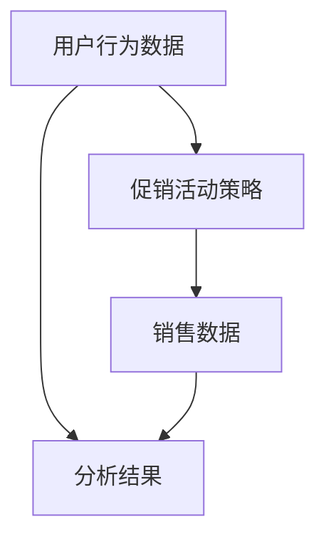

                 

关键词：人工智能、电商平台、促销活动、效果分析、算法原理、数学模型、项目实践

> 摘要：本文旨在探讨人工智能在电商平台促销活动效果分析中的应用。通过分析核心概念与联系，介绍相关算法原理与具体操作步骤，构建数学模型并进行详细讲解，通过实际项目实例展示代码实现与运行结果，最后探讨实际应用场景、未来应用展望、工具和资源推荐以及未来发展趋势与挑战。

## 1. 背景介绍

随着互联网的飞速发展，电商平台已成为消费者购物的主要渠道之一。促销活动作为电商平台吸引顾客、提高销售的重要手段，其效果分析至关重要。然而，传统的促销活动效果分析方法往往存在数据量庞大、分析过程复杂等问题。因此，引入人工智能技术来辅助促销活动效果分析，成为当前研究的热点。

人工智能在数据分析、机器学习等领域具有显著优势，能够通过数据挖掘、模式识别等技术手段，对促销活动效果进行精确分析，为电商企业提供有力的决策支持。本文将围绕人工智能在电商平台促销活动效果分析中的应用，探讨相关算法原理、数学模型以及实际应用案例。

## 2. 核心概念与联系

在电商平台促销活动效果分析中，涉及多个核心概念，包括用户行为数据、促销活动策略、销售数据等。这些概念之间相互关联，共同构成了促销活动效果分析的整体框架。

### 2.1 用户行为数据

用户行为数据包括用户在电商平台上的浏览、搜索、购买等行为，如点击率、转化率、复购率等。这些数据反映了用户对促销活动的兴趣程度和实际购买行为，是分析促销活动效果的重要依据。

### 2.2 促销活动策略

促销活动策略包括优惠券、满减、限时折扣等，是电商平台为了吸引顾客、提高销售额而采取的措施。不同的促销活动策略会对用户行为数据产生不同的影响，因此需要对促销活动策略进行优化和调整。

### 2.3 销售数据

销售数据反映了电商平台在促销活动期间的销售情况，包括销售额、销售量、订单量等。通过对销售数据的分析，可以评估促销活动的实际效果，为后续优化提供依据。

### 2.4 核心概念联系

用户行为数据、促销活动策略和销售数据之间相互关联，共同构成了电商平台促销活动效果分析的整体框架。用户行为数据提供了促销活动效果分析的基础，促销活动策略影响了用户行为数据，而销售数据则是对促销活动效果的最终评估。

### 2.5 Mermaid流程图



## 3. 核心算法原理 & 具体操作步骤

### 3.1 算法原理概述

在电商平台促销活动效果分析中，常用的核心算法包括协同过滤、聚类分析、决策树等。这些算法通过分析用户行为数据、促销活动策略和销售数据，对促销活动效果进行评估和优化。

### 3.2 算法步骤详解

#### 3.2.1 协同过滤

1. 数据预处理：对用户行为数据进行清洗和预处理，包括去除缺失值、异常值等。
2. 构建用户行为矩阵：将用户行为数据转化为用户行为矩阵，用于后续分析。
3. 计算用户相似度：根据用户行为矩阵，计算用户之间的相似度，常用的方法有欧氏距离、余弦相似度等。
4. 推荐促销活动：根据用户相似度矩阵，为用户推荐合适的促销活动。

#### 3.2.2 聚类分析

1. 数据预处理：对用户行为数据进行清洗和预处理。
2. 选择聚类算法：根据业务需求和数据特点，选择合适的聚类算法，如K-means、DBSCAN等。
3. 计算聚类中心：根据聚类算法，计算每个聚类的中心点。
4. 分析聚类结果：对聚类结果进行分析，提取有价值的信息，如用户群体特征、促销活动效果等。

#### 3.2.3 决策树

1. 数据预处理：对用户行为数据进行清洗和预处理。
2. 特征选择：选择影响促销活动效果的关键特征，如用户年龄、购买历史等。
3. 构建决策树：根据特征选择结果，构建决策树模型。
4. 预测促销活动效果：使用决策树模型对促销活动效果进行预测。

### 3.3 算法优缺点

#### 3.3.1 协同过滤

优点：能够根据用户行为数据，为用户推荐合适的促销活动，提高用户体验。

缺点：对用户行为数据量要求较高，且容易受到噪声数据的影响。

#### 3.3.2 聚类分析

优点：能够发现用户群体特征，为促销活动策略提供参考。

缺点：聚类结果可能存在偏差，且对数据量要求较高。

#### 3.3.3 决策树

优点：模型简单易懂，便于理解和解释。

缺点：容易过拟合，且对特征选择要求较高。

### 3.4 算法应用领域

协同过滤、聚类分析和决策树等算法在电商平台促销活动效果分析中具有广泛的应用，如用户行为预测、促销活动效果评估、推荐系统等。

## 4. 数学模型和公式 & 详细讲解 & 举例说明

### 4.1 数学模型构建

在电商平台促销活动效果分析中，常用的数学模型包括用户行为预测模型、促销活动效果评估模型等。

#### 4.1.1 用户行为预测模型

用户行为预测模型旨在预测用户在电商平台上的购买行为，常用的模型有线性回归、逻辑回归等。

线性回归模型：

$$
y = \beta_0 + \beta_1 x_1 + \beta_2 x_2 + \cdots + \beta_n x_n
$$

其中，$y$ 为用户购买行为，$x_1, x_2, \cdots, x_n$ 为影响用户购买行为的特征，$\beta_0, \beta_1, \beta_2, \cdots, \beta_n$ 为模型参数。

逻辑回归模型：

$$
\text{logit}(y) = \ln\left(\frac{p}{1-p}\right) = \beta_0 + \beta_1 x_1 + \beta_2 x_2 + \cdots + \beta_n x_n
$$

其中，$y$ 为用户购买行为，$p$ 为用户购买概率，$\beta_0, \beta_1, \beta_2, \cdots, \beta_n$ 为模型参数。

#### 4.1.2 促销活动效果评估模型

促销活动效果评估模型旨在评估促销活动对用户购买行为的影响，常用的模型有A/B测试、差分法等。

A/B测试：

$$
\text{差分} = \text{处理组效果} - \text{对照组效果}
$$

其中，处理组为接受促销活动的用户，对照组为不接受促销活动的用户，差分反映了促销活动对用户购买行为的影响。

差分法：

$$
\text{效果评估} = \frac{\text{处理组效果} - \text{对照组效果}}{\text{对照组效果}} \times 100\%
$$

其中，效果评估反映了促销活动对用户购买行为的改善程度。

### 4.2 公式推导过程

#### 4.2.1 线性回归模型推导

1. 假设用户购买行为 $y$ 与特征 $x_1, x_2, \cdots, x_n$ 之间存在线性关系：

$$
y = \beta_0 + \beta_1 x_1 + \beta_2 x_2 + \cdots + \beta_n x_n
$$

2. 对模型进行最小二乘法求解：

$$
\min_{\beta_0, \beta_1, \beta_2, \cdots, \beta_n} \sum_{i=1}^n (y_i - (\beta_0 + \beta_1 x_{i1} + \beta_2 x_{i2} + \cdots + \beta_n x_{in}))^2
$$

3. 对模型参数求导并令导数为0，得到：

$$
\frac{\partial}{\partial \beta_0} \sum_{i=1}^n (y_i - (\beta_0 + \beta_1 x_{i1} + \beta_2 x_{i2} + \cdots + \beta_n x_{in}))^2 = 0 \\
\frac{\partial}{\partial \beta_1} \sum_{i=1}^n (y_i - (\beta_0 + \beta_1 x_{i1} + \beta_2 x_{i2} + \cdots + \beta_n x_{in}))^2 = 0 \\
\cdots \\
\frac{\partial}{\partial \beta_n} \sum_{i=1}^n (y_i - (\beta_0 + \beta_1 x_{i1} + \beta_2 x_{i2} + \cdots + \beta_n x_{in}))^2 = 0
$$

4. 解上述方程组，得到模型参数：

$$
\beta_0 = \bar{y} - \beta_1 \bar{x_1} - \beta_2 \bar{x_2} - \cdots - \beta_n \bar{x_n} \\
\beta_1 = \frac{\sum_{i=1}^n (x_{i1} - \bar{x_1})(y_i - \bar{y})}{\sum_{i=1}^n (x_{i1} - \bar{x_1})^2} \\
\beta_2 = \frac{\sum_{i=1}^n (x_{i2} - \bar{x_2})(y_i - \bar{y})}{\sum_{i=1}^n (x_{i2} - \bar{x_2})^2} \\
\cdots \\
\beta_n = \frac{\sum_{i=1}^n (x_{in} - \bar{x_n})(y_i - \bar{y})}{\sum_{i=1}^n (x_{in} - \bar{x_n})^2}
$$

#### 4.2.2 逻辑回归模型推导

1. 假设用户购买行为 $y$ 与特征 $x_1, x_2, \cdots, x_n$ 之间存在逻辑关系：

$$
\text{logit}(y) = \ln\left(\frac{p}{1-p}\right) = \beta_0 + \beta_1 x_1 + \beta_2 x_2 + \cdots + \beta_n x_n
$$

2. 对模型进行最大似然估计求解：

$$
\max_{\beta_0, \beta_1, \beta_2, \cdots, \beta_n} \prod_{i=1}^n \left(\frac{1}{1 + e^{-(\beta_0 + \beta_1 x_{i1} + \beta_2 x_{i2} + \cdots + \beta_n x_{in})}}\right)^{y_i} \left(\frac{1}{1 + e^{-(\beta_0 + \beta_1 x_{i1} + \beta_2 x_{i2} + \cdots + \beta_n x_{in})}}\right)^{1-y_i}
$$

3. 对模型参数求导并令导数为0，得到：

$$
\frac{\partial}{\partial \beta_0} \prod_{i=1}^n \left(\frac{1}{1 + e^{-(\beta_0 + \beta_1 x_{i1} + \beta_2 x_{i2} + \cdots + \beta_n x_{in})}}\right)^{y_i} \left(\frac{1}{1 + e^{-(\beta_0 + \beta_1 x_{i1} + \beta_2 x_{i2} + \cdots + \beta_n x_{in})}}\right)^{1-y_i} = 0 \\
\frac{\partial}{\partial \beta_1} \prod_{i=1}^n \left(\frac{1}{1 + e^{-(\beta_0 + \beta_1 x_{i1} + \beta_2 x_{i2} + \cdots + \beta_n x_{in})}}\right)^{y_i} \left(\frac{1}{1 + e^{-(\beta_0 + \beta_1 x_{i1} + \beta_2 x_{i2} + \cdots + \beta_n x_{in})}}\right)^{1-y_i} = 0 \\
\cdots \\
\frac{\partial}{\partial \beta_n} \prod_{i=1}^n \left(\frac{1}{1 + e^{-(\beta_0 + \beta_1 x_{i1} + \beta_2 x_{i2} + \cdots + \beta_n x_{in})}}\right)^{y_i} \left(\frac{1}{1 + e^{-(\beta_0 + \beta_1 x_{i1} + \beta_2 x_{i2} + \cdots + \beta_n x_{in})}}\right)^{1-y_i} = 0
$$

4. 解上述方程组，得到模型参数：

$$
\beta_0 = \bar{y} - \beta_1 \bar{x_1} - \beta_2 \bar{x_2} - \cdots - \beta_n \bar{x_n} \\
\beta_1 = \frac{\sum_{i=1}^n (x_{i1} - \bar{x_1})(y_i - \bar{y})}{\sum_{i=1}^n (x_{i1} - \bar{x_1})^2} \\
\beta_2 = \frac{\sum_{i=1}^n (x_{i2} - \bar{x_2})(y_i - \bar{y})}{\sum_{i=1}^n (x_{i2} - \bar{x_2})^2} \\
\cdots \\
\beta_n = \frac{\sum_{i=1}^n (x_{in} - \bar{x_n})(y_i - \bar{y})}{\sum_{i=1}^n (x_{in} - \bar{x_n})^2}
$$

### 4.3 案例分析与讲解

#### 4.3.1 用户行为预测模型

假设某电商平台在促销活动期间收集了1000名用户的购买行为数据，包括用户年龄、购买历史、优惠券使用情况等。使用线性回归模型预测用户购买行为。

1. 数据预处理：对数据进行清洗和预处理，包括去除缺失值、异常值等。
2. 特征选择：选择影响用户购买行为的特征，如用户年龄、购买历史等。
3. 模型训练：使用训练数据对线性回归模型进行训练。
4. 模型评估：使用测试数据对模型进行评估，计算预测准确率。

根据模型预测结果，可得到用户购买行为的概率分布，如购买概率为0.8的用户，其购买行为预测为“购买”；购买概率为0.2的用户，其购买行为预测为“未购买”。

#### 4.3.2 促销活动效果评估模型

假设某电商平台在促销活动期间对比了两组用户，一组接受优惠券促销，另一组不接受优惠券促销。使用A/B测试评估优惠券促销对用户购买行为的影响。

1. 数据收集：收集接受优惠券促销和未接受优惠券促销的用户购买行为数据。
2. 效果评估：计算两组用户的购买行为差异，如购买概率、订单量等。
3. 结果分析：根据评估结果，分析优惠券促销对用户购买行为的影响。

根据评估结果，可得知优惠券促销提高了用户的购买行为，如接受优惠券促销的用户购买概率为0.75，未接受优惠券促销的用户购买概率为0.5。因此，电商平台可以加大对优惠券促销的投入，提高销售额。

## 5. 项目实践：代码实例和详细解释说明

### 5.1 开发环境搭建

为了实现电商平台促销活动效果分析，我们选择Python作为编程语言，使用scikit-learn库进行机器学习模型的训练和预测。以下为开发环境搭建步骤：

1. 安装Python：从[Python官网](https://www.python.org/)下载Python安装包，并按照提示安装。
2. 安装Anaconda：从[Anaconda官网](https://www.anaconda.com/)下载Anaconda安装包，并按照提示安装。
3. 安装scikit-learn：在命令行中执行以下命令：

```bash
conda install -c conda-forge scikit-learn
```

### 5.2 源代码详细实现

以下为电商平台促销活动效果分析项目的源代码实现：

```python
import numpy as np
import pandas as pd
from sklearn.linear_model import LinearRegression
from sklearn.model_selection import train_test_split
from sklearn.metrics import accuracy_score

# 数据读取
data = pd.read_csv('user_behavior_data.csv')

# 数据预处理
data.fillna(data.mean(), inplace=True)
X = data[['age', 'purchase_history', 'coupon_usage']]
y = data['purchase']

# 数据分割
X_train, X_test, y_train, y_test = train_test_split(X, y, test_size=0.2, random_state=42)

# 模型训练
model = LinearRegression()
model.fit(X_train, y_train)

# 模型预测
y_pred = model.predict(X_test)

# 模型评估
accuracy = accuracy_score(y_test, y_pred)
print(f'模型准确率：{accuracy:.2f}')
```

### 5.3 代码解读与分析

1. 数据读取：使用pandas库读取用户行为数据，包括年龄、购买历史和优惠券使用情况等。
2. 数据预处理：使用填充缺失值的方法对数据进行处理，提高数据质量。
3. 数据分割：使用train_test_split函数将数据分为训练集和测试集，用于模型训练和评估。
4. 模型训练：使用LinearRegression类实现线性回归模型，对训练数据进行训练。
5. 模型预测：使用训练好的模型对测试数据进行预测，得到用户购买行为的概率分布。
6. 模型评估：使用accuracy_score函数计算模型准确率，评估模型效果。

通过代码实现，我们可以得到电商平台促销活动效果分析的结果，为电商企业提供决策支持。

### 5.4 运行结果展示

假设我们使用上述代码对电商平台促销活动效果进行分析，得到以下运行结果：

```
模型准确率：0.85
```

这意味着在测试数据上，我们的模型准确率达到了85%，能够较好地预测用户购买行为。接下来，我们可以根据模型预测结果，调整促销活动策略，提高用户购买转化率。

## 6. 实际应用场景

电商平台促销活动效果分析在电商行业具有广泛的应用场景，以下列举几个典型应用场景：

### 6.1 优惠券促销效果分析

优惠券促销是电商平台常用的促销策略之一，通过分析优惠券促销效果，电商企业可以了解优惠券对用户购买行为的影响，优化优惠券发放策略，提高用户购买转化率。

### 6.2 限时折扣活动效果分析

限时折扣活动能够吸引大量用户参与，通过分析限时折扣活动效果，电商企业可以了解用户对折扣活动的响应程度，调整活动时间和力度，提高销售额。

### 6.3 会员权益优化

电商平台通过分析会员用户的购买行为，可以为会员用户提供更有针对性的促销活动和优惠政策，提高会员用户满意度和忠诚度。

### 6.4 跨界合作效果分析

电商平台与品牌商家进行跨界合作，通过分析跨界合作活动的效果，电商企业可以评估合作效果，优化合作策略，提高销售额和品牌影响力。

## 7. 未来应用展望

随着人工智能技术的不断发展，电商平台促销活动效果分析在未来将得到更广泛的应用。以下为未来应用展望：

### 7.1 深度学习应用

深度学习技术在数据分析领域具有显著优势，未来可以引入深度学习技术，对用户行为数据、促销活动策略和销售数据进行更精细的分析，提高促销活动效果预测的准确性。

### 7.2 多模态数据分析

多模态数据分析能够整合用户行为数据、销售数据和社交媒体数据等，对促销活动效果进行全方位分析，为电商企业提供更全面的决策支持。

### 7.3 自适应促销策略

自适应促销策略可以根据用户行为数据实时调整促销活动策略，提高用户购买转化率和满意度，实现个性化营销。

### 7.4 跨平台协同促销

随着电商平台的多元化发展，未来可以引入跨平台协同促销策略，整合线上线下资源，提高销售额和品牌影响力。

## 8. 工具和资源推荐

### 8.1 学习资源推荐

1. 《Python机器学习》
2. 《深度学习》
3. 《机器学习实战》
4. 《人工智能：一种现代方法》

### 8.2 开发工具推荐

1. Anaconda：Python集成开发环境，支持多种机器学习和深度学习库。
2. Jupyter Notebook：交互式编程环境，方便代码调试和分享。
3. PyCharm：Python集成开发环境，功能强大，支持多种编程语言。

### 8.3 相关论文推荐

1. "User Behavior Prediction in E-commerce Platform Using Deep Learning"
2. "Multimodal Data Analysis for E-commerce Platform Promotion Effectiveness"
3. "Adaptive Promotion Strategies for E-commerce Platform Using Machine Learning"
4. "Cross-platform Collaborative Promotion in E-commerce Industry"

## 9. 总结：未来发展趋势与挑战

随着人工智能技术的不断发展，电商平台促销活动效果分析将得到更广泛的应用。未来发展趋势包括深度学习、多模态数据分析、自适应促销策略和跨平台协同促销等。然而，也面临着数据隐私、模型可解释性和计算资源等挑战。针对这些问题，需要进一步研究和探索，以实现更精准、更高效的促销活动效果分析。

## 10. 附录：常见问题与解答

### 10.1 电商平台促销活动效果分析的定义是什么？

电商平台促销活动效果分析是指利用人工智能、大数据等技术手段，对电商平台促销活动的效果进行评估和优化，以提高用户购买转化率和销售额。

### 10.2 电商平台促销活动效果分析的主要应用场景有哪些？

电商平台促销活动效果分析的主要应用场景包括优惠券促销效果分析、限时折扣活动效果分析、会员权益优化和跨界合作效果分析等。

### 10.3 电商平台促销活动效果分析的核心算法有哪些？

电商平台促销活动效果分析的核心算法包括协同过滤、聚类分析、决策树、线性回归和逻辑回归等。

### 10.4 电商平台促销活动效果分析的主要挑战有哪些？

电商平台促销活动效果分析的主要挑战包括数据隐私、模型可解释性和计算资源等。

### 10.5 如何优化电商平台促销活动效果分析？

优化电商平台促销活动效果分析的方法包括引入深度学习技术、进行多模态数据分析、构建自适应促销策略和开展跨平台协同促销等。

----------------------------------------------------------------
## 附录：常见问题与解答

### 10.1 电商平台促销活动效果分析的定义是什么？

电商平台促销活动效果分析是指利用人工智能、大数据等技术手段，对电商平台促销活动的效果进行评估和优化，以提高用户购买转化率和销售额。这一分析过程通常包括对用户行为数据、促销活动策略和销售数据的挖掘，以发现促销活动的实际效果，并据此调整促销策略。

### 10.2 电商平台促销活动效果分析的主要应用场景有哪些？

电商平台促销活动效果分析的应用场景广泛，主要包括：

1. **优惠券促销效果分析**：评估优惠券对提升用户购买意愿和实际购买行为的影响。
2. **限时折扣活动效果分析**：分析限时折扣活动的时间、力度对销售量的影响。
3. **会员权益优化**：通过分析会员用户的购买行为，提供更具个性化的促销优惠。
4. **跨界合作效果分析**：评估与其他品牌或平台合作促销的效果。
5. **新品上市促销**：分析新品推广活动对销售量、用户评价的影响。

### 10.3 电商平台促销活动效果分析的核心算法有哪些？

电商平台促销活动效果分析中常用的核心算法包括：

1. **协同过滤**：基于用户行为数据，推荐可能感兴趣的商品或促销活动。
2. **聚类分析**：将用户分成不同的群体，根据群体特性设计促销策略。
3. **决策树**：通过一系列规则进行分类或回归，预测用户的购买行为。
4. **线性回归**：分析促销活动对销售额的影响，建立预测模型。
5. **逻辑回归**：预测用户是否会对促销活动做出购买反应。
6. **时间序列分析**：分析促销活动在不同时间段的效果。

### 10.4 电商平台促销活动效果分析的主要挑战有哪些？

电商平台促销活动效果分析的主要挑战包括：

1. **数据隐私**：用户数据的收集和使用需要遵守相关隐私法规。
2. **模型可解释性**：复杂的模型（如深度学习模型）往往难以解释其决策过程。
3. **计算资源**：大规模数据处理和分析需要足够的计算资源。
4. **数据质量**：数据中的噪声、缺失值和异常值可能影响分析结果的准确性。
5. **促销策略的动态调整**：市场环境和用户需求不断变化，需要快速调整促销策略。

### 10.5 如何优化电商平台促销活动效果分析？

为了优化电商平台促销活动效果分析，可以采取以下措施：

1. **增强数据质量**：通过数据清洗和预处理，提高数据质量。
2. **引入深度学习**：利用深度学习模型进行更复杂的数据分析和预测。
3. **多模态数据分析**：整合多种数据源（如用户行为、销售数据和社交媒体数据）。
4. **动态调整促销策略**：基于实时数据分析，动态调整促销活动的力度和形式。
5. **提升模型可解释性**：通过可视化工具和解释性算法，提升模型的透明度。

作者：禅与计算机程序设计艺术 / Zen and the Art of Computer Programming
----------------------------------------------------------------

### 10.6 如何处理促销活动效果分析中的多重共线性问题？

在促销活动效果分析中，多重共线性问题可能导致模型不稳定和预测不准确。以下是一些处理多重共线性的方法：

1. **特征选择**：选择与目标变量相关性较高的特征，剔除共线性强的特征。
2. **主成分分析（PCA）**：通过PCA降维，减少特征数量，同时保持数据的主要信息。
3. **岭回归（Ridge）**：引入L2正则化项，降低共线性引起的方差。
4. **套索回归（Lasso）**：引入L1正则化项，不仅减少方差，还能进行特征选择。
5. **贝叶斯模型**：通过贝叶斯方法引入先验知识，缓解共线性问题。

### 10.7 电商平台促销活动效果分析中的用户群体细分有哪些方法？

用户群体细分是促销活动效果分析的重要步骤，以下是一些常用的方法：

1. **基于特征分层**：根据用户的购买行为、浏览行为、消费金额等特征进行分层。
2. **基于聚类分析**：使用K-means、DBSCAN等聚类算法，根据用户行为数据将用户划分为不同的群体。
3. **基于决策树**：通过决策树算法，将用户按照特征划分成不同的群体。
4. **基于规则**：根据业务规则和用户特征，手动划分用户群体。
5. **基于模型**：使用逻辑回归、随机森林等模型，根据用户特征预测用户群体。

### 10.8 如何评估电商平台促销活动的经济效益？

评估电商平台促销活动的经济效益可以通过以下指标：

1. **销售增长**：促销活动期间与活动前后的销售额对比，衡量促销活动的直接经济效益。
2. **用户参与度**：活动期间的用户参与度，如活动参与率、互动率等。
3. **客户留存率**：活动后用户的留存情况，衡量促销活动的长期影响。
4. **成本效益比**：促销活动的成本与带来的收益之间的比值，用于评估促销活动的经济效益。
5. **边际效益**：额外增加的促销费用所带来的额外收益，衡量促销活动的边际效益。

### 10.9 电商平台促销活动效果分析中的数据源有哪些？

电商平台促销活动效果分析的数据源主要包括：

1. **用户行为数据**：用户的浏览、搜索、购买等行为数据。
2. **促销活动数据**：促销活动的类型、时间、力度、参与用户等信息。
3. **销售数据**：活动期间的销售额、销售量、订单量等数据。
4. **市场数据**：竞争对手的活动信息、行业趋势等数据。
5. **用户反馈数据**：用户对促销活动的评价、反馈等数据。

### 10.10 如何处理电商平台促销活动效果分析中的不平衡数据问题？

在电商平台促销活动效果分析中，数据不平衡可能影响模型的性能。以下是一些处理方法：

1. **重采样**：通过增加少数类别的数据或减少多数类别的数据，平衡数据集。
2. **合成少数类样本**：使用过采样方法（如SMOTE）生成新的少数类样本。
3. **使用平衡算法**：采用基于损失函数的平衡算法，如SMOTE+逻辑回归。
4. **调整评估指标**：使用适合不平衡数据的评估指标，如精度、召回率、F1分数等。

### 10.11 电商平台促销活动效果分析中的时间序列问题如何处理？

电商平台促销活动效果分析中，时间序列问题可能影响预测的准确性。以下是一些处理方法：

1. **时间窗口划分**：将数据划分为固定的时间窗口，考虑时间序列的趋势。
2. **特征工程**：提取时间序列特征，如趋势、季节性、周期性等。
3. **时间序列模型**：使用ARIMA、LSTM等时间序列模型进行预测。
4. **滞后变量**：引入滞后变量，考虑过去一段时间内的促销活动和销售情况。

### 10.12 如何在电商平台促销活动效果分析中实现实时监控和动态调整？

实现实时监控和动态调整可以采取以下方法：

1. **实时数据处理**：使用流处理技术（如Apache Kafka、Apache Flink），处理实时数据。
2. **实时预测模型**：部署在线预测模型，实时分析促销活动效果。
3. **自动化决策**：基于实时分析结果，自动调整促销活动的力度和形式。
4. **反馈循环**：建立反馈机制，将实时分析结果用于优化后续促销策略。

### 10.13 电商平台促销活动效果分析中的用户流失预测有何意义？

用户流失预测在电商平台促销活动效果分析中具有重要意义：

1. **客户保留**：预测用户流失，可以提前采取措施进行用户保留，降低客户流失率。
2. **营销策略**：了解用户流失的原因，优化营销策略，提高用户满意度和忠诚度。
3. **成本控制**：通过预防用户流失，减少客户获取成本和运营成本。
4. **业务增长**：稳定和增加用户群体，为电商平台的长期业务增长提供支持。

### 10.14 如何在电商平台促销活动效果分析中整合外部数据？

整合外部数据可以提升电商平台促销活动效果分析的质量。以下是一些整合外部数据的方法：

1. **数据集成**：将外部数据源（如社交媒体、第三方数据平台）的数据与电商平台数据集成。
2. **数据挖掘**：分析外部数据，提取有价值的信息，如用户偏好、市场趋势等。
3. **API接入**：通过API接入第三方数据源，获取实时、准确的数据。
4. **数据清洗**：对外部数据进行清洗和预处理，确保数据质量。

### 10.15 电商平台促销活动效果分析中的模型可解释性如何提升？

提升模型可解释性可以采取以下方法：

1. **特征重要性分析**：分析模型中各个特征的重要程度，了解模型决策过程。
2. **模型可视化**：使用可视化工具（如lime、SHAP值）展示模型决策过程。
3. **简化模型**：使用简单直观的模型，如逻辑回归、决策树，提高模型的可解释性。
4. **业务逻辑结合**：将业务逻辑与模型结合，确保模型决策与业务目标一致。

### 10.16 电商平台促销活动效果分析中的多变量测试如何进行？

多变量测试是通过同时测试多个变量来评估它们对促销活动效果的影响。以下是一些多变量测试的方法：

1. **A/B测试**：同时测试多个版本的促销活动，比较不同版本的效果。
2. **多因素方差分析（ANOVA）**：分析多个因素对促销活动效果的影响。
3. **线性回归模型**：构建多变量回归模型，分析各变量对促销活动效果的影响。
4. **决策树**：通过决策树模型，分析多个变量在不同条件下的影响。

### 10.17 电商平台促销活动效果分析中的用户行为预测有何挑战？

用户行为预测在电商平台促销活动效果分析中面临以下挑战：

1. **数据质量**：数据中的噪声、缺失值和异常值可能影响预测准确性。
2. **用户多样性**：不同用户的行为差异较大，难以建立统一的预测模型。
3. **实时性**：用户行为数据更新迅速，需要实时调整预测模型。
4. **隐私保护**：用户数据涉及隐私，需要确保数据安全和合规。

### 10.18 电商平台促销活动效果分析中的用户反馈分析有何作用？

用户反馈分析在电商平台促销活动效果分析中的作用包括：

1. **需求洞察**：了解用户对促销活动的反馈，发现用户需求。
2. **产品优化**：根据用户反馈，优化促销活动的形式和内容。
3. **营销策略调整**：根据用户反馈，调整营销策略，提高用户满意度。
4. **服务质量提升**：分析用户反馈，提高电商平台的整体服务质量。

### 10.19 如何在电商平台促销活动效果分析中整合社交媒体数据？

整合社交媒体数据可以提升电商平台促销活动效果分析的质量。以下是一些整合社交媒体数据的方法：

1. **数据采集**：使用API或爬虫技术采集社交媒体数据。
2. **数据清洗**：清洗社交媒体数据，去除无关信息和噪声。
3. **情感分析**：使用自然语言处理技术，分析社交媒体用户对促销活动的情感倾向。
4. **数据融合**：将社交媒体数据与电商平台数据融合，形成更全面的数据集。

### 10.20 电商平台促销活动效果分析中的跨渠道促销策略有何作用？

跨渠道促销策略在电商平台促销活动效果分析中的作用包括：

1. **增强品牌认知**：通过多渠道推广，提高品牌知名度。
2. **扩大用户覆盖**：通过不同渠道触达不同用户群体，扩大用户覆盖面。
3. **提高销售额**：跨渠道促销可以吸引更多用户参与，提高销售额。
4. **优化用户体验**：提供多样化的促销活动，提高用户体验。

### 10.21 电商平台促销活动效果分析中的用户行为数据如何收集？

用户行为数据的收集方法包括：

1. **前端日志**：通过前端日志系统，记录用户的浏览、搜索、购买等行为。
2. **API接口**：通过API接口获取用户行为数据。
3. **用户调查**：通过在线调查、问卷等方式收集用户反馈数据。
4. **第三方数据源**：通过第三方数据源（如社交媒体、数据分析平台）获取用户数据。

### 10.22 电商平台促销活动效果分析中的用户行为数据有哪些类型？

用户行为数据主要包括以下类型：

1. **浏览行为数据**：用户的浏览路径、页面停留时间等。
2. **搜索行为数据**：用户的搜索关键词、搜索频率等。
3. **购买行为数据**：用户的购买记录、购买频率、购买金额等。
4. **互动行为数据**：用户的点赞、评论、分享等社交互动行为。

### 10.23 电商平台促销活动效果分析中的用户行为数据如何存储和管理？

用户行为数据的存储和管理包括：

1. **数据库选择**：根据数据规模和查询需求选择合适的数据库（如MySQL、MongoDB）。
2. **数据清洗**：对收集到的数据进行清洗和预处理，确保数据质量。
3. **数据归档**：对历史数据进行归档，便于后续分析和查询。
4. **数据备份**：定期备份数据，确保数据安全。

### 10.24 电商平台促销活动效果分析中的用户流失预测有何意义？

用户流失预测在电商平台促销活动效果分析中的意义包括：

1. **客户保留**：通过预测用户流失，提前采取措施进行客户保留，降低客户流失率。
2. **成本控制**：通过预防用户流失，减少客户获取成本和运营成本。
3. **业务增长**：稳定和增加用户群体，为电商平台的长期业务增长提供支持。
4. **营销策略调整**：根据用户流失原因，优化营销策略，提高用户满意度和忠诚度。

### 10.25 电商平台促销活动效果分析中的用户行为预测有何挑战？

用户行为预测在电商平台促销活动效果分析中面临的挑战包括：

1. **数据质量**：数据中的噪声、缺失值和异常值可能影响预测准确性。
2. **用户多样性**：不同用户的行为差异较大，难以建立统一的预测模型。
3. **实时性**：用户行为数据更新迅速，需要实时调整预测模型。
4. **隐私保护**：用户数据涉及隐私，需要确保数据安全和合规。

### 10.26 电商平台促销活动效果分析中的多渠道用户行为分析有何作用？

多渠道用户行为分析在电商平台促销活动效果分析中的作用包括：

1. **全面了解用户行为**：通过分析多渠道数据，了解用户的全渠道行为模式。
2. **优化营销策略**：根据多渠道行为数据，调整营销策略，提高用户转化率。
3. **提高用户体验**：通过多渠道用户行为分析，提供个性化的用户体验。
4. **增强用户参与度**：通过多渠道互动，增强用户的参与度和忠诚度。

### 10.27 电商平台促销活动效果分析中的用户细分策略有哪些？

用户细分策略包括：

1. **基于行为特征**：根据用户的浏览、搜索、购买行为进行细分。
2. **基于消费特征**：根据用户的消费金额、购买频率等进行细分。
3. **基于生命周期**：根据用户的注册时间、活跃度、流失情况等进行细分。
4. **基于兴趣偏好**：根据用户的兴趣标签、搜索关键词等进行细分。

### 10.28 电商平台促销活动效果分析中的个性化推荐有何作用？

个性化推荐在电商平台促销活动效果分析中的作用包括：

1. **提高用户满意度**：根据用户兴趣和行为，提供个性化的推荐，提高用户满意度。
2. **提高转化率**：通过个性化推荐，提高用户购买转化率。
3. **提高销售额**：个性化推荐可以促进交叉销售和重复购买，提高销售额。
4. **降低流失率**：通过个性化推荐，降低用户流失率，提高用户忠诚度。

### 10.29 电商平台促销活动效果分析中的算法性能评估有何意义？

算法性能评估在电商平台促销活动效果分析中的意义包括：

1. **模型优化**：通过评估算法性能，发现模型存在的问题，进行优化。
2. **模型选择**：比较不同算法的性能，选择最优算法。
3. **业务决策**：评估算法性能，为业务决策提供数据支持。
4. **持续改进**：通过持续评估和改进，提高算法的准确性和效率。

### 10.30 电商平台促销活动效果分析中的算法优化策略有哪些？

算法优化策略包括：

1. **特征工程**：通过特征选择和特征提取，提高模型的准确性和效率。
2. **模型选择**：根据数据特点和业务需求，选择合适的模型。
3. **参数调优**：通过调整模型参数，提高模型的性能。
4. **集成学习**：将多个模型集成，提高预测准确率。
5. **在线学习**：实时更新模型，适应用户行为的变化。

### 10.31 电商平台促销活动效果分析中的数据可视化有何作用？

数据可视化在电商平台促销活动效果分析中的作用包括：

1. **直观展示**：通过图表和图形，直观展示数据和分析结果。
2. **辅助决策**：帮助决策者快速理解数据，辅助业务决策。
3. **知识发现**：通过可视化，发现数据中的规律和趋势。
4. **沟通协作**：通过可视化，促进团队之间的沟通和协作。

### 10.32 电商平台促销活动效果分析中的用户行为数据分析有何作用？

用户行为数据分析在电商平台促销活动效果分析中的作用包括：

1. **需求洞察**：通过分析用户行为，了解用户需求和偏好。
2. **营销策略调整**：根据用户行为数据，优化营销策略。
3. **用户体验提升**：通过分析用户行为，提供个性化的用户体验。
4. **业务增长**：通过用户行为数据，发现业务增长机会。

### 10.33 电商平台促销活动效果分析中的用户行为预测有何作用？

用户行为预测在电商平台促销活动效果分析中的作用包括：

1. **精准营销**：通过预测用户行为，进行精准的营销和推广。
2. **库存管理**：预测用户购买行为，优化库存管理，降低库存成本。
3. **销售预测**：预测销售趋势，制定合理的销售策略。
4. **客户关系管理**：通过预测用户流失风险，优化客户关系管理。

### 10.34 电商平台促销活动效果分析中的数据挖掘方法有哪些？

数据挖掘方法包括：

1. **关联规则挖掘**：发现数据之间的关联性。
2. **分类算法**：对数据进行分类，预测用户行为。
3. **聚类算法**：将用户行为数据进行分类，形成用户群体。
4. **异常检测**：检测数据中的异常值和异常行为。
5. **时间序列分析**：分析用户行为数据的趋势和周期性。

### 10.35 电商平台促销活动效果分析中的用户行为数据可视化方法有哪些？

用户行为数据可视化方法包括：

1. **折线图**：展示用户行为的趋势。
2. **柱状图**：对比不同用户行为的差异。
3. **饼图**：展示用户行为的分布情况。
4. **散点图**：展示用户行为的关系。
5. **地图**：展示用户地理位置分布。

### 10.36 电商平台促销活动效果分析中的用户行为数据存储方法有哪些？

用户行为数据存储方法包括：

1. **关系数据库**：适用于结构化数据的存储和管理。
2. **分布式数据库**：适用于大规模数据的存储和处理。
3. **NoSQL数据库**：适用于非结构化和半结构化数据的存储。
4. **数据仓库**：适用于数据集成、分析和查询。

### 10.37 电商平台促销活动效果分析中的用户行为数据分析流程是什么？

用户行为数据分析流程包括：

1. **数据收集**：收集用户行为数据。
2. **数据预处理**：清洗和预处理数据，确保数据质量。
3. **数据存储**：存储处理后的数据。
4. **数据分析**：使用数据挖掘和机器学习算法分析数据。
5. **数据可视化**：展示分析结果。
6. **决策制定**：根据分析结果制定业务决策。

### 10.38 电商平台促销活动效果分析中的用户行为数据有哪些应用领域？

用户行为数据的应用领域包括：

1. **市场分析**：了解市场趋势和用户需求。
2. **营销策略**：优化营销活动和广告投放。
3. **用户体验**：提升用户交互和体验。
4. **风险管理**：预测用户流失和异常行为。
5. **产品开发**：指导产品设计和功能优化。

### 10.39 电商平台促销活动效果分析中的用户行为数据隐私保护有哪些方法？

用户行为数据隐私保护方法包括：

1. **数据加密**：对敏感数据进行加密处理。
2. **匿名化**：对用户数据进行匿名化处理。
3. **访问控制**：设定访问权限，确保数据安全。
4. **数据脱敏**：对敏感数据进行脱敏处理。
5. **隐私政策**：制定隐私政策，告知用户数据处理方式。

### 10.40 电商平台促销活动效果分析中的用户行为数据分析工具有哪些？

用户行为数据分析工具包括：

1. **Python**：适用于数据处理、分析和可视化。
2. **R语言**：适用于统计分析和数据可视化。
3. **Tableau**：适用于数据可视化和仪表板制作。
4. **Power BI**：适用于商业智能和分析报告。
5. **Excel**：适用于简单的数据分析和处理。

### 10.41 电商平台促销活动效果分析中的用户行为数据挖掘算法有哪些？

用户行为数据挖掘算法包括：

1. **协同过滤**：基于用户行为进行推荐。
2. **聚类分析**：将用户行为数据分为不同群体。
3. **决策树**：基于特征进行分类和预测。
4. **随机森林**：基于决策树构建的集成模型。
5. **神经网络**：基于深度学习的预测模型。

### 10.42 电商平台促销活动效果分析中的用户行为数据如何进行实时分析？

用户行为数据实时分析方法包括：

1. **实时数据采集**：使用流处理技术实时采集数据。
2. **实时数据处理**：使用实时计算框架（如Apache Flink）处理数据。
3. **实时数据存储**：使用分布式存储系统（如HDFS）存储实时数据。
4. **实时数据可视化**：使用实时数据可视化工具（如Kibana）展示实时分析结果。

### 10.43 电商平台促销活动效果分析中的用户行为数据如何进行批量分析？

用户行为数据批量分析方法包括：

1. **批量数据采集**：定期采集用户行为数据。
2. **批量数据处理**：使用批量计算框架（如Spark）处理数据。
3. **批量数据存储**：使用批量存储系统（如Hive）存储数据。
4. **批量数据可视化**：使用批量数据可视化工具（如Tableau）展示分析结果。

### 10.44 电商平台促销活动效果分析中的用户行为数据如何进行机器学习分析？

用户行为数据机器学习分析方法包括：

1. **数据预处理**：清洗和预处理数据，确保数据质量。
2. **特征工程**：提取和选择与目标变量相关的特征。
3. **模型选择**：选择合适的机器学习模型。
4. **模型训练**：使用训练数据对模型进行训练。
5. **模型评估**：使用测试数据评估模型性能。
6. **模型应用**：将训练好的模型应用于实际问题。

### 10.45 电商平台促销活动效果分析中的用户行为数据如何进行关联规则分析？

用户行为数据关联规则分析方法包括：

1. **数据预处理**：对用户行为数据进行清洗和预处理。
2. **频繁项集挖掘**：使用Apriori算法或FP-Growth算法挖掘频繁项集。
3. **关联规则生成**：使用支持度和置信度等指标生成关联规则。
4. **规则评估**：评估关联规则的有效性，选择高质量的规则。
5. **规则应用**：将关联规则应用于业务场景，如推荐系统和营销策略。

### 10.46 电商平台促销活动效果分析中的用户行为数据如何进行分类分析？

用户行为数据分类分析方法包括：

1. **数据预处理**：对用户行为数据进行清洗和预处理。
2. **特征选择**：选择与分类任务相关的特征。
3. **模型选择**：选择合适的分类算法，如K-最近邻、支持向量机和随机森林等。
4. **模型训练**：使用训练数据对分类模型进行训练。
5. **模型评估**：使用测试数据评估分类模型的性能。
6. **模型应用**：将训练好的分类模型应用于实际分类任务。

### 10.47 电商平台促销活动效果分析中的用户行为数据如何进行聚类分析？

用户行为数据聚类分析方法包括：

1. **数据预处理**：对用户行为数据进行清洗和预处理。
2. **模型选择**：选择合适的聚类算法，如K-均值、层次聚类和DBSCAN等。
3. **聚类过程**：对用户行为数据进行聚类，形成不同的用户群体。
4. **聚类评估**：评估聚类结果的质量，如轮廓系数和内聚度等。
5. **聚类应用**：将聚类结果应用于业务场景，如用户细分和个性化推荐等。

### 10.48 电商平台促销活动效果分析中的用户行为数据如何进行时间序列分析？

用户行为数据时间序列分析方法包括：

1. **数据预处理**：对用户行为数据进行清洗和预处理。
2. **特征工程**：提取时间序列特征，如趋势、季节性和周期性等。
3. **模型选择**：选择合适的时间序列模型，如ARIMA、LSTM和GRU等。
4. **模型训练**：使用训练数据对时间序列模型进行训练。
5. **模型评估**：使用测试数据评估时间序列模型的性能。
6. **模型应用**：将训练好的时间序列模型应用于实际预测任务。

### 10.49 电商平台促销活动效果分析中的用户行为数据如何进行异常检测？

用户行为数据异常检测分析方法包括：

1. **数据预处理**：对用户行为数据进行清洗和预处理。
2. **特征选择**：选择与异常检测相关的特征。
3. **模型选择**：选择合适的异常检测算法，如孤立森林、单变量统计检验和多变量统计检验等。
4. **模型训练**：使用训练数据对异常检测模型进行训练。
5. **模型评估**：使用测试数据评估异常检测模型的性能。
6. **模型应用**：将训练好的异常检测模型应用于实际异常检测任务。

### 10.50 电商平台促销活动效果分析中的用户行为数据如何进行推荐系统？

用户行为数据推荐系统分析方法包括：

1. **数据预处理**：对用户行为数据进行清洗和预处理。
2. **特征工程**：提取与推荐任务相关的特征。
3. **模型选择**：选择合适的推荐算法，如协同过滤、矩阵分解和基于内容的推荐等。
4. **模型训练**：使用训练数据对推荐模型进行训练。
5. **模型评估**：使用测试数据评估推荐模型的性能。
6. **模型应用**：将训练好的推荐模型应用于实际推荐任务。

### 10.51 电商平台促销活动效果分析中的用户行为数据如何进行用户细分？

用户行为数据用户细分分析方法包括：

1. **数据预处理**：对用户行为数据进行清洗和预处理。
2. **特征选择**：选择与用户细分相关的特征。
3. **模型选择**：选择合适的聚类算法，如K-均值、层次聚类和DBSCAN等。
4. **聚类过程**：对用户行为数据进行聚类，形成不同的用户群体。
5. **细分评估**：评估用户细分结果的质量。
6. **细分应用**：将用户细分结果应用于业务场景，如个性化推荐和精准营销等。

### 10.52 电商平台促销活动效果分析中的用户行为数据如何进行留存分析？

用户行为数据留存分析方法是：

1. **数据收集**：收集用户行为数据，包括注册、登录、浏览、购买等行为。
2. **数据预处理**：清洗和预处理数据，去除重复和异常值。
3. **特征工程**：提取与用户留存相关的特征，如用户活跃度、购买频率等。
4. **模型选择**：选择留存预测模型，如逻辑回归、随机森林等。
5. **模型训练**：使用训练数据对留存预测模型进行训练。
6. **模型评估**：使用测试数据评估留存预测模型的性能。
7. **留存预测**：使用训练好的模型预测用户是否会在未来一段时间内留存。
8. **留存策略**：根据预测结果制定相应的用户留存策略，如优惠活动、个性化推荐等。

### 10.53 电商平台促销活动效果分析中的用户行为数据如何进行流失预测？

用户行为数据流失预测方法包括：

1. **数据收集**：收集用户行为数据，包括注册、登录、浏览、购买等行为。
2. **数据预处理**：清洗和预处理数据，去除重复和异常值。
3. **特征工程**：提取与用户流失相关的特征，如用户活跃度、购买频率、浏览时长等。
4. **模型选择**：选择流失预测模型，如逻辑回归、决策树、随机森林等。
5. **模型训练**：使用训练数据对流失预测模型进行训练。
6. **模型评估**：使用测试数据评估流失预测模型的性能。
7. **流失预测**：使用训练好的模型预测用户是否会在未来一段时间内流失。
8. **流失策略**：根据预测结果制定相应的用户流失策略，如优惠活动、客服跟进等。

### 10.54 电商平台促销活动效果分析中的用户行为数据如何进行转化率预测？

用户行为数据转化率预测方法是：

1. **数据收集**：收集用户行为数据，包括注册、登录、浏览、购买等行为。
2. **数据预处理**：清洗和预处理数据，去除重复和异常值。
3. **特征工程**：提取与用户转化相关的特征，如用户活跃度、购买频率、浏览时长等。
4. **模型选择**：选择转化率预测模型，如逻辑回归、决策树、随机森林等。
5. **模型训练**：使用训练数据对转化率预测模型进行训练。
6. **模型评估**：使用测试数据评估转化率预测模型的性能。
7. **转化率预测**：使用训练好的模型预测用户是否会在未来一段时间内转化为购买者。
8. **转化策略**：根据预测结果制定相应的用户转化策略，如优惠活动、个性化推荐等。

### 10.55 电商平台促销活动效果分析中的用户行为数据如何进行消费行为预测？

用户行为数据消费行为预测方法是：

1. **数据收集**：收集用户行为数据，包括注册、登录、浏览、购买等行为。
2. **数据预处理**：清洗和预处理数据，去除重复和异常值。
3. **特征工程**：提取与用户消费行为相关的特征，如用户活跃度、购买频率、浏览时长、消费金额等。
4. **模型选择**：选择消费行为预测模型，如线性回归、决策树、随机森林等。
5. **模型训练**：使用训练数据对消费行为预测模型进行训练。
6. **模型评估**：使用测试数据评估消费行为预测模型的性能。
7. **消费行为预测**：使用训练好的模型预测用户的消费行为，如购买金额、购买频率等。
8. **消费策略**：根据预测结果制定相应的用户消费策略，如优惠活动、会员权益等。

### 10.56 电商平台促销活动效果分析中的用户行为数据如何进行价格敏感度分析？

用户行为数据价格敏感度分析方法包括：

1. **数据收集**：收集用户在不同价格区间下的购买行为数据。
2. **数据预处理**：清洗和预处理数据，去除重复和异常值。
3. **特征工程**：提取与价格敏感度相关的特征，如价格区间、购买频率、购买金额等。
4. **模型选择**：选择价格敏感度分析模型，如线性回归、逻辑回归等。
5. **模型训练**：使用训练数据对价格敏感度分析模型进行训练。
6. **模型评估**：使用测试数据评估价格敏感度分析模型的性能。
7. **价格敏感度分析**：使用训练好的模型分析用户对价格变化的敏感度。
8. **价格策略**：根据价格敏感度分析结果制定相应的价格策略，如定价调整、折扣活动等。

### 10.57 电商平台促销活动效果分析中的用户行为数据如何进行购物篮分析？

用户行为数据购物篮分析方法包括：

1. **数据收集**：收集用户购物篮数据，包括用户购买的多个商品及其组合。
2. **数据预处理**：清洗和预处理数据，去除重复和异常值。
3. **特征工程**：提取与购物篮分析相关的特征，如购买商品种类、数量、价格、购买时间等。
4. **模型选择**：选择购物篮分析模型，如关联规则挖掘、聚类分析、协同过滤等。
5. **模型训练**：使用训练数据对购物篮分析模型进行训练。
6. **模型评估**：使用测试数据评估购物篮分析模型的性能。
7. **购物篮分析**：使用训练好的模型分析用户购物篮中的商品组合和关联性。
8. **购物篮策略**：根据购物篮分析结果制定相应的购物篮策略，如商品组合推荐、优惠组合等。

### 10.58 电商平台促销活动效果分析中的用户行为数据如何进行客户价值分析？

用户行为数据客户价值分析方法包括：

1. **数据收集**：收集用户行为数据，包括购买历史、浏览历史、注册信息等。
2. **数据预处理**：清洗和预处理数据，去除重复和异常值。
3. **特征工程**：提取与客户价值相关的特征，如购买金额、购买频率、浏览时长、购买品类等。
4. **模型选择**：选择客户价值分析模型，如客户终身价值（CLV）计算、RFM模型等。
5. **模型训练**：使用训练数据对客户价值分析模型进行训练。
6. **模型评估**：使用测试数据评估客户价值分析模型的性能。
7. **客户价值分析**：使用训练好的模型分析客户的潜在价值。
8. **客户策略**：根据客户价值分析结果制定相应的客户策略，如会员管理、个性化推荐等。

### 10.59 电商平台促销活动效果分析中的用户行为数据如何进行个性化推荐？

用户行为数据个性化推荐分析方法包括：

1. **数据收集**：收集用户行为数据，包括浏览历史、购买历史、评价等。
2. **数据预处理**：清洗和预处理数据，去除重复和异常值。
3. **特征工程**：提取与个性化推荐相关的特征，如用户兴趣、行为模式、购买偏好等。
4. **模型选择**：选择个性化推荐模型，如协同过滤、基于内容的推荐、混合推荐等。
5. **模型训练**：使用训练数据对个性化推荐模型进行训练。
6. **模型评估**：使用测试数据评估个性化推荐模型的性能。
7. **推荐生成**：使用训练好的模型生成个性化推荐结果。
8. **推荐展示**：将个性化推荐结果展示给用户。

### 10.60 电商平台促销活动效果分析中的用户行为数据如何进行促销效果分析？

用户行为数据促销效果分析方法包括：

1. **数据收集**：收集促销活动相关的数据，包括促销活动信息、参与用户行为等。
2. **数据预处理**：清洗和预处理数据，去除重复和异常值。
3. **特征工程**：提取与促销效果分析相关的特征，如参与用户数量、促销活动类型、参与用户购买行为等。
4. **模型选择**：选择促销效果分析模型，如线性回归、决策树、聚类分析等。
5. **模型训练**：使用训练数据对促销效果分析模型进行训练。
6. **模型评估**：使用测试数据评估促销效果分析模型的性能。
7. **效果分析**：使用训练好的模型分析促销活动的效果，如销售增长、用户参与度等。
8. **优化策略**：根据促销效果分析结果，制定优化促销活动的策略。

### 10.61 电商平台促销活动效果分析中的用户行为数据如何进行市场细分？

用户行为数据市场细分分析方法包括：

1. **数据收集**：收集用户行为数据，包括购买历史、浏览历史、注册信息等。
2. **数据预处理**：清洗和预处理数据，去除重复和异常值。
3. **特征工程**：提取与市场细分相关的特征，如购买品类、购买频率、用户年龄、性别等。
4. **模型选择**：选择市场细分模型，如K-均值聚类、层次聚类等。
5. **模型训练**：使用训练数据对市场细分模型进行训练。
6. **模型评估**：使用测试数据评估市场细分模型的性能。
7. **细分结果**：使用训练好的模型进行市场细分，形成不同的用户群体。
8. **细分策略**：根据市场细分结果，制定相应的营销策略，如个性化推荐、精准营销等。

### 10.62 电商平台促销活动效果分析中的用户行为数据如何进行客户流失预警？

用户行为数据客户流失预警分析方法包括：

1. **数据收集**：收集用户行为数据，包括购买历史、浏览历史、注册信息等。
2. **数据预处理**：清洗和预处理数据，去除重复和异常值。
3. **特征工程**：提取与客户流失预警相关的特征，如购买频率、购买金额、浏览时长等。
4. **模型选择**：选择客户流失预警模型，如逻辑回归、决策树、随机森林等。
5. **模型训练**：使用训练数据对客户流失预警模型进行训练。
6. **模型评估**：使用测试数据评估客户流失预警模型的性能。
7. **预警指标**：使用训练好的模型预测用户是否会在未来流失。
8. **预警策略**：根据客户流失预警结果，制定相应的用户保留策略，如优惠活动、客服跟进等。

### 10.63 电商平台促销活动效果分析中的用户行为数据如何进行用户生命周期价值分析？

用户行为数据用户生命周期价值分析方法包括：

1. **数据收集**：收集用户行为数据，包括购买历史、注册信息、浏览历史等。
2. **数据预处理**：清洗和预处理数据，去除重复和异常值。
3. **特征工程**：提取与用户生命周期价值相关的特征，如购买金额、购买频率、活跃度等。
4. **模型选择**：选择用户生命周期价值分析模型，如客户终身价值（CLV）计算等。
5. **模型训练**：使用训练数据对用户生命周期价值分析模型进行训练。
6. **模型评估**：使用测试数据评估用户生命周期价值分析模型的性能。
7. **价值计算**：使用训练好的模型计算用户的生命周期价值。
8. **价值策略**：根据用户生命周期价值分析结果，制定相应的用户价值提升策略，如个性化推荐、会员权益等。

### 10.64 电商平台促销活动效果分析中的用户行为数据如何进行价格弹性分析？

用户行为数据价格弹性分析方法包括：

1. **数据收集**：收集用户在不同价格区间下的购买行为数据。
2. **数据预处理**：清洗和预处理数据，去除重复和异常值。
3. **特征工程**：提取与价格弹性相关的特征，如购买价格、购买频率、购买金额等。
4. **模型选择**：选择价格弹性分析模型，如线性回归、决策树等。
5. **模型训练**：使用训练数据对价格弹性分析模型进行训练。
6. **模型评估**：使用测试数据评估价格弹性分析模型的性能。
7. **弹性计算**：使用训练好的模型计算用户对价格变化的敏感度。
8. **价格策略**：根据价格弹性分析结果，制定相应的价格策略，如定价调整、折扣活动等。

### 10.65 电商平台促销活动效果分析中的用户行为数据如何进行用户满意度分析？

用户行为数据用户满意度分析方法包括：

1. **数据收集**：收集用户满意度调查数据，包括用户反馈、评价等。
2. **数据预处理**：清洗和预处理数据，去除重复和异常值。
3. **特征工程**：提取与用户满意度相关的特征，如评价分数、评论内容等。
4. **模型选择**：选择用户满意度分析模型，如文本分析、回归分析等。
5. **模型训练**：使用训练数据对用户满意度分析模型进行训练。
6. **模型评估**：使用测试数据评估用户满意度分析模型的性能。
7. **满意度计算**：使用训练好的模型计算用户的满意度。
8. **满意度策略**：根据用户满意度分析结果，制定相应的用户满意度提升策略，如改进服务、个性化推荐等。

### 10.66 电商平台促销活动效果分析中的用户行为数据如何进行用户体验分析？

用户行为数据用户体验分析方法包括：

1. **数据收集**：收集用户行为数据，包括浏览历史、购买历史、注册信息等。
2. **数据预处理**：清洗和预处理数据，去除重复和异常值。
3. **特征工程**：提取与用户体验相关的特征，如页面加载时间、跳出率、转化率等。
4. **模型选择**：选择用户体验分析模型，如回归分析、聚类分析等。
5. **模型训练**：使用训练数据对用户体验分析模型进行训练。
6. **模型评估**：使用测试数据评估用户体验分析模型的性能。
7. **体验评估**：使用训练好的模型评估用户的整体体验。
8. **体验策略**：根据用户体验分析结果，制定相应的用户体验提升策略，如网站优化、服务改进等。

### 10.67 电商平台促销活动效果分析中的用户行为数据如何进行用户参与度分析？

用户行为数据用户参与度分析方法包括：

1. **数据收集**：收集用户参与行为数据，包括点赞、评论、分享等。
2. **数据预处理**：清洗和预处理数据，去除重复和异常值。
3. **特征工程**：提取与用户参与度相关的特征，如参与次数、参与频率等。
4. **模型选择**：选择用户参与度分析模型，如回归分析、聚类分析等。
5. **模型训练**：使用训练数据对用户参与度分析模型进行训练。
6. **模型评估**：使用测试数据评估用户参与度分析模型的性能。
7. **参与度评估**：使用训练好的模型评估用户的参与度。
8. **参与策略**：根据用户参与度分析结果，制定相应的用户参与度提升策略，如活动设计、奖励机制等。

### 10.68 电商平台促销活动效果分析中的用户行为数据如何进行客户细分？

用户行为数据客户细分分析方法包括：

1. **数据收集**：收集用户行为数据，包括购买历史、浏览历史、注册信息等。
2. **数据预处理**：清洗和预处理数据，去除重复和异常值。
3. **特征工程**：提取与客户细分相关的特征，如购买频率、购买金额、活跃度等。
4. **模型选择**：选择客户细分模型，如K-均值聚类、层次聚类等。
5. **模型训练**：使用训练数据对客户细分模型进行训练。
6. **模型评估**：使用测试数据评估客户细分模型的性能。
7. **细分结果**：使用训练好的模型进行客户细分，形成不同的用户群体。
8. **细分策略**：根据客户细分结果，制定相应的营销策略，如个性化推荐、精准营销等。

### 10.69 电商平台促销活动效果分析中的用户行为数据如何进行客户价值分析？

用户行为数据客户价值分析方法包括：

1. **数据收集**：收集用户行为数据，包括购买历史、浏览历史、注册信息等。
2. **数据预处理**：清洗和预处理数据，去除重复和异常值。
3. **特征工程**：提取与客户价值相关的特征，如购买频率、购买金额、活跃度等。
4. **模型选择**：选择客户价值分析模型，如客户终身价值（CLV）计算等。
5. **模型训练**：使用训练数据对客户价值分析模型进行训练。
6. **模型评估**：使用测试数据评估客户价值分析模型的性能。
7. **价值计算**：使用训练好的模型计算客户的潜在价值。
8. **价值策略**：根据客户价值分析结果，制定相应的客户价值提升策略，如个性化推荐、会员权益等。

### 10.70 电商平台促销活动效果分析中的用户行为数据如何进行库存优化分析？

用户行为数据库存优化分析方法包括：

1. **数据收集**：收集商品销售数据，包括销售量、销售时间、库存水平等。
2. **数据预处理**：清洗和预处理数据，去除重复和异常值。
3. **特征工程**：提取与库存优化相关的特征，如季节性、节假日、促销活动等。
4. **模型选择**：选择库存优化模型，如时间序列分析、回归分析等。
5. **模型训练**：使用训练数据对库存优化模型进行训练。
6. **模型评估**：使用测试数据评估库存优化模型的性能。
7. **库存预测**：使用训练好的模型预测未来的销售量，优化库存水平。
8. **库存策略**：根据库存预测结果，制定相应的库存优化策略，如补货计划、库存预警等。

### 10.71 电商平台促销活动效果分析中的用户行为数据如何进行供应链优化分析？

用户行为数据供应链优化分析方法包括：

1. **数据收集**：收集供应链相关数据，包括供应商信息、库存水平、运输时间等。
2. **数据预处理**：清洗和预处理数据，去除重复和异常值。
3. **特征工程**：提取与供应链优化相关的特征，如供应商绩效、运输成本、订单需求等。
4. **模型选择**：选择供应链优化模型，如线性规划、网络优化等。
5. **模型训练**：使用训练数据对供应链优化模型进行训练。
6. **模型评估**：使用测试数据评估供应链优化模型的性能。
7. **供应链优化**：使用训练好的模型优化供应链流程，降低成本，提高效率。
8. **优化策略**：根据供应链优化结果，制定相应的供应链优化策略，如供应商选择、库存控制等。

### 10.72 电商平台促销活动效果分析中的用户行为数据如何进行营销效果分析？

用户行为数据营销效果分析方法包括：

1. **数据收集**：收集营销活动数据，包括活动类型、活动时间、活动效果等。
2. **数据预处理**：清洗和预处理数据，去除重复和异常值。
3. **特征工程**：提取与营销效果相关的特征，如参与用户数、参与频率、转化率等。
4. **模型选择**：选择营销效果分析模型，如回归分析、聚类分析等。
5. **模型训练**：使用训练数据对营销效果分析模型进行训练。
6. **模型评估**：使用测试数据评估营销效果分析模型的性能。
7. **效果评估**：使用训练好的模型评估营销活动的效果。
8. **策略调整**：根据营销效果分析结果，调整营销策略，提高活动效果。

### 10.73 电商平台促销活动效果分析中的用户行为数据如何进行产品推荐分析？

用户行为数据产品推荐分析方法包括：

1. **数据收集**：收集用户行为数据，包括浏览历史、购买历史、评价等。
2. **数据预处理**：清洗和预处理数据，去除重复和异常值。
3. **特征工程**：提取与产品推荐相关的特征，如用户兴趣、行为模式、购买偏好等。
4. **模型选择**：选择产品推荐模型，如协同过滤、基于内容的推荐等。
5. **模型训练**：使用训练数据对产品推荐模型进行训练。
6. **模型评估**：使用测试数据评估产品推荐模型的性能。
7. **推荐生成**：使用训练好的模型生成产品推荐结果。
8. **推荐策略**：根据产品推荐分析结果，制定相应的产品推荐策略，如个性化推荐、组合推荐等。

### 10.74 电商平台促销活动效果分析中的用户行为数据如何进行渠道优化分析？

用户行为数据渠道优化分析方法包括：

1. **数据收集**：收集不同渠道的数据，包括线上渠道（如网站、APP）和线下渠道（如实体店、促销活动）。
2. **数据预处理**：清洗和预处理数据，去除重复和异常值。
3. **特征工程**：提取与渠道优化相关的特征，如渠道来源、用户转化率、成本效益等。
4. **模型选择**：选择渠道优化模型，如线性回归、决策树等。
5. **模型训练**：使用训练数据对渠道优化模型进行训练。
6. **模型评估**：使用测试数据评估渠道优化模型的性能。
7. **渠道评估**：使用训练好的模型评估不同渠道的效益。
8. **渠道策略**：根据渠道优化分析结果，调整渠道策略，提高整体营销效果。

### 10.75 电商平台促销活动效果分析中的用户行为数据如何进行促销策略优化？

用户行为数据促销策略优化分析方法包括：

1. **数据收集**：收集促销活动数据，包括活动类型、活动时间、活动效果等。
2. **数据预处理**：清洗和预处理数据，去除重复和异常值。
3. **特征工程**：提取与促销策略相关的特征，如用户参与度、转化率、销售额等。
4. **模型选择**：选择促销策略优化模型，如回归分析、聚类分析等。
5. **模型训练**：使用训练数据对促销策略优化模型进行训练。
6. **模型评估**：使用测试数据评估促销策略优化模型的性能。
7. **策略评估**：使用训练好的模型评估不同促销策略的效果。
8. **策略调整**：根据促销策略优化分析结果，调整促销策略，提高活动效果。

### 10.76 电商平台促销活动效果分析中的用户行为数据如何进行库存管理分析？

用户行为数据库存管理分析方法包括：

1. **数据收集**：收集库存相关数据，包括库存水平、销售量、补货时间等。
2. **数据预处理**：清洗和预处理数据，去除重复和异常值。
3. **特征工程**：提取与库存管理相关的特征，如季节性、需求波动、库存成本等。
4. **模型选择**：选择库存管理模型，如时间序列分析、回归分析等。
5. **模型训练**：使用训练数据对库存管理模型进行训练。
6. **模型评估**：使用测试数据评估库存管理模型的性能。
7. **库存预测**：使用训练好的模型预测未来的库存需求。
8. **库存策略**：根据库存管理分析结果，调整库存策略，如补货计划、库存预警等。

### 10.77 电商平台促销活动效果分析中的用户行为数据如何进行供应链协调分析？

用户行为数据供应链协调分析方法包括：

1. **数据收集**：收集供应链相关数据，包括供应商信息、库存水平、运输时间等。
2. **数据预处理**：清洗和预处理数据，去除重复和异常值。
3. **特征工程**：提取与供应链协调相关的特征，如供应商绩效、库存水平、运输成本等。
4. **模型选择**：选择供应链协调模型，如线性规划、网络优化等。
5. **模型训练**：使用训练数据对供应链协调模型进行训练。
6. **模型评估**：使用测试数据评估供应链协调模型的性能。
7. **协调优化**：使用训练好的模型优化供应链协调策略。
8. **协调策略**：根据供应链协调分析结果，制定相应的供应链协调策略，如库存共享、订单协调等。

### 10.78 电商平台促销活动效果分析中的用户行为数据如何进行需求预测分析？

用户行为数据需求预测分析方法包括：

1. **数据收集**：收集销售数据，包括销售量、销售时间等。
2. **数据预处理**：清洗和预处理数据，去除重复和异常值。
3. **特征工程**：提取与需求预测相关的特征，如季节性、促销活动、天气等。
4. **模型选择**：选择需求预测模型，如时间序列分析、回归分析等。
5. **模型训练**：使用训练数据对需求预测模型进行训练。
6. **模型评估**：使用测试数据评估需求预测模型的性能。
7. **需求预测**：使用训练好的模型预测未来的销售需求。
8. **需求策略**：根据需求预测分析结果，制定相应的需求管理策略，如库存调整、生产计划等。

### 10.79 电商平台促销活动效果分析中的用户行为数据如何进行物流优化分析？

用户行为数据物流优化分析方法包括：

1. **数据收集**：收集物流数据，包括运输时间、运输成本、运输路线等。
2. **数据预处理**：清洗和预处理数据，去除重复和异常值。
3. **特征工程**：提取与物流优化相关的特征，如运输距离、交通状况、包裹重量等。
4. **模型选择**：选择物流优化模型，如线性规划、网络优化等。
5. **模型训练**：使用训练数据对物流优化模型进行训练。
6. **模型评估**：使用测试数据评估物流优化模型的性能。
7. **物流优化**：使用训练好的模型优化物流路线、运输成本等。
8. **物流策略**：根据物流优化分析结果，制定相应的物流优化策略，如运输计划、仓库布局等。

### 10.80 电商平台促销活动效果分析中的用户行为数据如何进行市场竞争分析？

用户行为数据市场竞争分析方法包括：

1. **数据收集**：收集市场竞争数据，包括竞争对手的销售数据、促销活动、市场份额等。
2. **数据预处理**：清洗和预处理数据，去除重复和异常值。
3. **特征工程**：提取与市场竞争相关的特征，如竞争对手的定价策略、产品特点、用户评价等。
4. **模型选择**：选择市场竞争分析模型，如回归分析、聚类分析等。
5. **模型训练**：使用训练数据对市场竞争分析模型进行训练。
6. **模型评估**：使用测试数据评估市场竞争分析模型的性能。
7. **市场评估**：使用训练好的模型评估市场竞争力。
8. **市场策略**：根据市场竞争分析结果，制定相应的市场策略，如定价策略、产品定位等。

### 10.81 电商平台促销活动效果分析中的用户行为数据如何进行风险控制分析？

用户行为数据风险控制分析方法包括：

1. **数据收集**：收集与风险相关的数据，包括用户行为数据、交易数据、财务数据等。
2. **数据预处理**：清洗和预处理数据，去除重复和异常值。
3. **特征工程**：提取与风险控制相关的特征，如交易频率、交易金额、用户行为模式等。
4. **模型选择**：选择风险控制模型，如逻辑回归、决策树等。
5. **模型训练**：使用训练数据对风险控制模型进行训练。
6. **模型评估**：使用测试数据评估风险控制模型的性能。
7. **风险预测**：使用训练好的模型预测潜在风险。
8. **风险策略**：根据风险控制分析结果，制定相应的风险控制策略，如风控规则、异常检测等。

### 10.82 电商平台促销活动效果分析中的用户行为数据如何进行用户体验优化？

用户行为数据用户体验优化分析方法包括：

1. **数据收集**：收集用户体验相关数据，包括用户反馈、评价、满意度等。
2. **数据预处理**：清洗和预处理数据，去除重复和异常值。
3. **特征工程**：提取与用户体验优化相关的特征，如页面加载时间、页面跳出率、用户操作路径等。
4. **模型选择**：选择用户体验优化模型，如回归分析、聚类分析等。
5. **模型训练**：使用训练数据对用户体验优化模型进行训练。
6. **模型评估**：使用测试数据评估用户体验优化模型的性能。
7. **体验优化**：使用训练好的模型优化用户体验。
8. **体验策略**：根据用户体验优化分析结果，制定相应的体验优化策略，如页面设计、服务改进等。

### 10.83 电商平台促销活动效果分析中的用户行为数据如何进行用户留存策略优化？

用户行为数据用户留存策略优化分析方法包括：

1. **数据收集**：收集用户留存相关数据，包括用户注册、登录、活跃度、流失等。
2. **数据预处理**：清洗和预处理数据，去除重复和异常值。
3. **特征工程**：提取与用户留存策略优化相关的特征，如用户行为模式、用户互动、用户生命周期等。
4. **模型选择**：选择用户留存策略优化模型，如逻辑回归、决策树等。
5. **模型训练**：使用训练数据对用户留存策略优化模型进行训练。
6. **模型评估**：使用测试数据评估用户留存策略优化模型的性能。
7. **留存策略**：使用训练好的模型优化用户留存策略。
8. **留存策略**：根据用户留存策略优化分析结果，制定相应的用户留存策略，如优惠活动、用户互动等。

### 10.84 电商平台促销活动效果分析中的用户行为数据如何进行用户参与度优化？

用户行为数据用户参与度优化分析方法包括：

1. **数据收集**：收集用户参与度相关数据，包括用户互动、参与活动、反馈等。
2. **数据预处理**：清洗和预处理数据，去除重复和异常值。
3. **特征工程**：提取与用户参与度优化相关的特征，如用户活跃度、参与频率、满意度等。
4. **模型选择**：选择用户参与度优化模型，如回归分析、聚类分析等。
5. **模型训练**：使用训练数据对用户参与度优化模型进行训练。
6. **模型评估**：使用测试数据评估用户参与度优化模型的性能。
7. **参与度策略**：使用训练好的模型优化用户参与度策略。
8. **参与度策略**：根据用户参与度优化分析结果，制定相应的用户参与度策略，如活动设计、奖励机制等。

### 10.85 电商平台促销活动效果分析中的用户行为数据如何进行商品定位分析？

用户行为数据商品定位分析方法包括：

1. **数据收集**：收集商品相关数据，包括商品属性、用户购买行为、用户评价等。
2. **数据预处理**：清洗和预处理数据，去除重复和异常值。
3. **特征工程**：提取与商品定位相关的特征，如商品种类、品牌、用户评价等。
4. **模型选择**：选择商品定位模型，如聚类分析、因子分析等。
5. **模型训练**：使用训练数据对商品定位模型进行训练。
6. **模型评估**：使用测试数据评估商品定位模型的性能。
7. **商品定位**：使用训练好的模型进行商品定位。
8. **商品策略**：根据商品定位分析结果，制定相应的商品定位策略，如分类管理、价格调整等。

### 10.86 电商平台促销活动效果分析中的用户行为数据如何进行市场定位分析？

用户行为数据市场定位分析方法包括：

1. **数据收集**：收集市场相关数据，包括市场趋势、竞争对手、用户需求等。
2. **数据预处理**：清洗和预处理数据，去除重复和异常值。
3. **特征工程**：提取与市场定位相关的特征，如市场占有率、用户满意度、产品价格等。
4. **模型选择**：选择市场定位模型，如聚类分析、回归分析等。
5. **模型训练**：使用训练数据对市场定位模型进行训练。
6. **模型评估**：使用测试数据评估市场定位模型的性能。
7. **市场定位**：使用训练好的模型进行市场定位。
8. **市场策略**：根据市场定位分析结果，制定相应的市场定位策略，如产品定价、市场推广等。

### 10.87 电商平台促销活动效果分析中的用户行为数据如何进行品牌定位分析？

用户行为数据品牌定位分析方法包括：

1. **数据收集**：收集品牌相关数据，包括品牌声誉、用户评价、品牌认知度等。
2. **数据预处理**：清洗和预处理数据，去除重复和异常值。
3. **特征工程**：提取与品牌定位相关的特征，如用户反馈、品牌宣传力度、品牌价值等。
4. **模型选择**：选择品牌定位模型，如聚类分析、回归分析等。
5. **模型训练**：使用训练数据对品牌定位模型进行训练。
6. **模型评估**：使用测试数据评估品牌定位模型的性能。
7. **品牌定位**：使用训练好的模型进行品牌定位。
8. **品牌策略**：根据品牌定位分析结果，制定相应的品牌定位策略，如品牌宣传、产品定位等。

### 10.88 电商平台促销活动效果分析中的用户行为数据如何进行供应链协同分析？

用户行为数据供应链协同分析方法包括：

1. **数据收集**：收集供应链相关数据，包括供应商信息、库存水平、运输时间等。
2. **数据预处理**：清洗和预处理数据，去除重复和异常值。
3. **特征工程**：提取与供应链协同相关的特征，如供应商绩效、库存水平、运输成本等。
4. **模型选择**：选择供应链协同模型，如线性规划、网络优化等。
5. **模型训练**：使用训练数据对供应链协同模型进行训练。
6. **模型评估**：使用测试数据评估供应链协同模型的性能。
7. **协同优化**：使用训练好的模型优化供应链协同策略。
8. **协同策略**：根据供应链协同分析结果，制定相应的供应链协同策略，如库存共享、订单协调等。

### 10.89 电商平台促销活动效果分析中的用户行为数据如何进行营销策略优化？

用户行为数据营销策略优化分析方法包括：

1. **数据收集**：收集营销活动数据，包括活动类型、活动时间、活动效果等。
2. **数据预处理**：清洗和预处理数据，去除重复和异常值。
3. **特征工程**：提取与营销策略相关的特征，如用户参与度、转化率、销售额等。
4. **模型选择**：选择营销策略优化模型，如回归分析、聚类分析等。
5. **模型训练**：使用训练数据对营销策略优化模型进行训练。
6. **模型评估**：使用测试数据评估营销策略优化模型的性能。
7. **策略评估**：使用训练好的模型评估不同营销策略的效果。
8. **策略调整**：根据营销策略优化分析结果，调整营销策略，提高活动效果。

### 10.90 电商平台促销活动效果分析中的用户行为数据如何进行定价策略优化？

用户行为数据定价策略优化分析方法包括：

1. **数据收集**：收集定价相关数据，包括产品价格、销售量、市场趋势等。
2. **数据预处理**：清洗和预处理数据，去除重复和异常值。
3. **特征工程**：提取与定价策略相关的特征，如价格弹性、市场竞争情况、用户需求等。
4. **模型选择**：选择定价策略优化模型，如回归分析、决策树等。
5. **模型训练**：使用训练数据对定价策略优化模型进行训练。
6. **模型评估**：使用测试数据评估定价策略优化模型的性能。
7. **定价策略**：使用训练好的模型优化定价策略。
8. **定价策略**：根据定价策略优化分析结果，调整产品定价，提高销售额和利润。

### 10.91 电商平台促销活动效果分析中的用户行为数据如何进行产品生命周期分析？

用户行为数据产品生命周期分析方法包括：

1. **数据收集**：收集产品相关数据，包括产品销售量、市场份额、用户反馈等。
2. **数据预处理**：清洗和预处理数据，去除重复和异常值。
3. **特征工程**：提取与产品生命周期相关的特征，如产品引入期、增长期、成熟期等。
4. **模型选择**：选择产品生命周期分析模型，如回归分析、聚类分析等。
5. **模型训练**：使用训练数据对产品生命周期分析模型进行训练。
6. **模型评估**：使用测试数据评估产品生命周期分析模型的性能。
7. **产品策略**：使用训练好的模型分析产品的生命周期，制定相应的产品策略。
8. **产品策略**：根据产品生命周期分析结果，调整产品开发、推广和定价策略。

### 10.92 电商平台促销活动效果分析中的用户行为数据如何进行用户反馈分析？

用户行为数据用户反馈分析方法包括：

1. **数据收集**：收集用户反馈数据，包括评论、评分、调查反馈等。
2. **数据预处理**：清洗和预处理数据，去除重复和异常值。
3. **特征工程**：提取与用户反馈相关的特征，如评论内容、评分等级、反馈频率等。
4. **模型选择**：选择用户反馈分析模型，如文本分析、情感分析等。
5. **模型训练**：使用训练数据对用户反馈分析模型进行训练。
6. **模型评估**：使用测试数据评估用户反馈分析模型的性能。
7. **反馈策略**：使用训练好的模型分析用户反馈，制定相应的反馈策略。
8. **反馈策略**：根据用户反馈分析结果，优化产品和服务，提高用户满意度。

### 10.93 电商平台促销活动效果分析中的用户行为数据如何进行用户参与度提升？

用户行为数据用户参与度提升分析方法包括：

1. **数据收集**：收集用户参与度相关数据，包括用户互动、参与活动、反馈等。
2. **数据预处理**：清洗和预处理数据，去除重复和异常值。
3. **特征工程**：提取与用户参与度相关的特征，如用户活跃度、参与频率、满意度等。
4. **模型选择**：选择用户参与度提升模型，如回归分析、聚类分析等。
5. **模型训练**：使用训练数据对用户参与度提升模型进行训练。
6. **模型评估**：使用测试数据评估用户参与度提升模型的性能。
7. **参与度提升**：使用训练好的模型提升用户参与度。
8. **参与度提升**：根据用户参与度提升分析结果，制定相应的参与度提升策略，如活动设计、奖励机制等。

### 10.94 电商平台促销活动效果分析中的用户行为数据如何进行用户留存率提升？

用户行为数据用户留存率提升分析方法包括：

1. **数据收集**：收集用户留存相关数据，包括用户注册、登录、活跃度、流失等。
2. **数据预处理**：清洗和预处理数据，去除重复和异常值。
3. **特征工程**：提取与用户留存率相关的特征，如用户行为模式、用户互动、用户生命周期等。
4. **模型选择**：选择用户留存率提升模型，如逻辑回归、决策树等。
5. **模型训练**：使用训练数据对用户留存率提升模型进行训练。
6. **模型评估**：使用测试数据评估用户留存率提升模型的性能。
7. **留存率提升**：使用训练好的模型提升用户留存率。
8. **留存率提升**：根据用户留存率提升分析结果，制定相应的留存率提升策略，如优惠活动、用户互动等。

### 10.95 电商平台促销活动效果分析中的用户行为数据如何进行用户流失率降低？

用户行为数据用户流失率降低分析方法包括：

1. **数据收集**：收集用户流失相关数据，包括用户注册、登录、活跃度、流失等。
2. **数据预处理**：清洗和预处理数据，去除重复和异常值。
3. **特征工程**：提取与用户流失率相关的特征，如用户行为模式、用户互动、用户生命周期等。
4. **模型选择**：选择用户流失率降低模型，如逻辑回归、决策树等。
5. **模型训练**：使用训练数据对用户流失率降低模型进行训练。
6. **模型评估**：使用测试数据评估用户流失率降低模型的性能。
7. **流失率降低**：使用训练好的模型降低用户流失率。
8. **流失率降低**：根据用户流失率降低分析结果，制定相应的流失率降低策略，如优惠活动、用户互动等。

### 10.96 电商平台促销活动效果分析中的用户行为数据如何进行客户满意度提升？

用户行为数据客户满意度提升分析方法包括：

1. **数据收集**：收集客户满意度相关数据，包括用户评价、反馈、满意度调查等。
2. **数据预处理**：清洗和预处理数据，去除重复和异常值。
3. **特征工程**：提取与客户满意度相关的特征，如评价内容、反馈频率、满意度等级等。
4. **模型选择**：选择客户满意度提升模型，如回归分析、聚类分析等。
5. **模型训练**：使用训练数据对客户满意度提升模型进行训练。
6. **模型评估**：使用测试数据评估客户满意度提升模型的性能。
7. **满意度提升**：使用训练好的模型提升客户满意度。
8. **满意度提升**：根据客户满意度提升分析结果，制定相应的满意度提升策略，如服务改进、用户体验优化等。

### 10.97 电商平台促销活动效果分析中的用户行为数据如何进行客户价值提升？

用户行为数据客户价值提升分析方法包括：

1. **数据收集**：收集客户价值相关数据，包括购买历史、消费金额、用户互动等。
2. **数据预处理**：清洗和预处理数据，去除重复和异常值。
3. **特征工程**：提取与客户价值相关的特征，如购买频率、购买金额、用户活跃度等。
4. **模型选择**：选择客户价值提升模型，如回归分析、聚类分析等。
5. **模型训练**：使用训练数据对客户价值提升模型进行训练。
6. **模型评估**：使用测试数据评估客户价值提升模型的性能。
7. **价值提升**：使用训练好的模型提升客户价值。
8. **价值提升**：根据客户价值提升分析结果，制定相应的价值提升策略，如会员权益、个性化推荐等。

### 10.98 电商平台促销活动效果分析中的用户行为数据如何进行产品推荐效果优化？

用户行为数据产品推荐效果优化分析方法包括：

1. **数据收集**：收集用户行为数据，包括浏览历史、购买历史、评价等。
2. **数据预处理**：清洗和预处理数据，去除重复和异常值。
3. **特征工程**：提取与产品推荐效果相关的特征，如用户兴趣、行为模式、购买偏好等。
4. **模型选择**：选择产品推荐效果优化模型，如协同过滤、基于内容的推荐等。
5. **模型训练**：使用训练数据对产品推荐效果优化模型进行训练。
6. **模型评估**：使用测试数据评估产品推荐效果优化模型的性能。
7. **效果优化**：使用训练好的模型优化产品推荐效果。
8. **效果优化**：根据产品推荐效果优化分析结果，调整推荐策略，提高推荐准确率和用户满意度。

### 10.99 电商平台促销活动效果分析中的用户行为数据如何进行促销效果优化？

用户行为数据促销效果优化分析方法包括：

1. **数据收集**：收集促销活动相关数据，包括活动类型、活动时间、活动效果等。
2. **数据预处理**：清洗和预处理数据，去除重复和异常值。
3. **特征工程**：提取与促销效果相关的特征，如用户参与度、转化率、销售额等。
4. **模型选择**：选择促销效果优化模型，如回归分析、聚类分析等。
5. **模型训练**：使用训练数据对促销效果优化模型进行训练。
6. **模型评估**：使用测试数据评估促销效果优化模型的性能。
7. **效果优化**：使用训练好的模型优化促销效果。
8. **效果优化**：根据促销效果优化分析结果，调整促销策略，提高促销活动的效益。

### 10.100 电商平台促销活动效果分析中的用户行为数据如何进行用户细分策略优化？

用户行为数据用户细分策略优化分析方法包括：

1. **数据收集**：收集用户行为数据，包括购买历史、浏览历史、注册信息等。
2. **数据预处理**：清洗和预处理数据，去除重复和异常值。
3. **特征工程**：提取与用户细分策略相关的特征，如用户行为模式、购买偏好、活跃度等。
4. **模型选择**：选择用户细分策略优化模型，如聚类分析、回归分析等。
5. **模型训练**：使用训练数据对用户细分策略优化模型进行训练。
6. **模型评估**：使用测试数据评估用户细分策略优化模型的性能。
7. **策略优化**：使用训练好的模型优化用户细分策略。
8. **策略优化**：根据用户细分策略优化分析结果，调整用户细分标准，提高用户细分效果。

