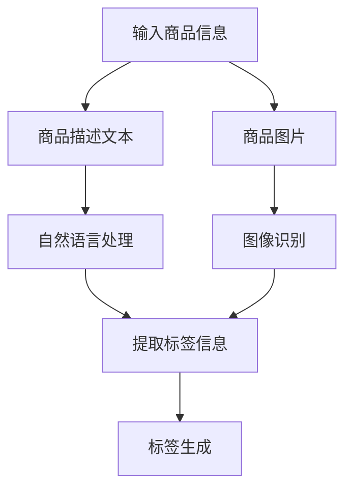

                 

关键词：电商平台，商品标签，自动生成，人工智能，自然语言处理，图像识别，深度学习

> 摘要：随着电商平台的发展，商品标签的自动生成成为一项重要的研究课题。本文首先介绍了电商平台商品标签的背景和重要性，然后详细阐述了基于人工智能的商品标签自动生成技术，包括自然语言处理和图像识别的应用。通过具体算法原理和操作步骤的讲解，以及对实际项目实践和未来应用展望的讨论，本文旨在为电商平台商品标签自动生成提供一些实用的指导和建议。

## 1. 背景介绍

随着互联网技术的飞速发展，电商平台已经成为现代零售业的重要形式。电商平台通过线上销售商品，为消费者提供了便捷的购物体验。而商品标签则是电商平台中至关重要的一环。商品标签不仅包含了商品的基本信息，如名称、价格、描述等，还承载了商品分类、品牌、材质等多种属性信息。

在电商平台中，商品标签的作用主要体现在以下几个方面：

1. **搜索与推荐**：通过准确的商品标签，电商平台能够更好地进行商品搜索和推荐，提高用户的购物体验和满意度。
2. **商品管理**：商品标签有助于电商平台进行商品分类和管理，提高运营效率。
3. **数据分析**：商品标签为电商平台提供了丰富的数据支持，有助于进行市场分析和用户行为分析。

然而，传统的商品标签生成方式主要依赖于人工输入，这不仅费时费力，而且容易出现错误。随着人工智能技术的不断发展，尤其是自然语言处理和图像识别技术的应用，商品标签的自动生成成为可能。

## 2. 核心概念与联系

### 2.1 自然语言处理（NLP）

自然语言处理是人工智能的一个重要分支，它使计算机能够理解、解释和生成人类语言。在商品标签自动生成中，自然语言处理主要用于解析商品描述文本，提取关键信息，生成标签。

### 2.2 图像识别

图像识别是一种通过算法让计算机识别和分类图像的技术。在商品标签自动生成中，图像识别主要用于识别商品图片中的关键特征，辅助生成标签。

### 2.3 深度学习

深度学习是人工智能的一个重要分支，通过构建多层神经网络，深度学习能够自动从大量数据中学习特征，实现复杂的模式识别和预测任务。在商品标签自动生成中，深度学习技术广泛应用于自然语言处理和图像识别。

### 2.4 Mermaid 流程图

以下是一个基于Mermaid的流程图，展示了商品标签自动生成的基本流程：



## 3. 核心算法原理 & 具体操作步骤

### 3.1 算法原理概述

商品标签自动生成算法主要基于以下原理：

- **自然语言处理**：通过解析商品描述文本，提取关键词和关键短语，生成初步的标签。
- **图像识别**：通过识别商品图片中的关键特征，辅助生成标签。
- **深度学习**：利用大量的商品数据训练模型，实现自动标签生成。

### 3.2 算法步骤详解

商品标签自动生成的具体操作步骤如下：

1. **数据收集**：收集大量商品数据，包括商品描述文本和商品图片。
2. **预处理**：对商品描述文本和商品图片进行预处理，如文本分词、图像去噪等。
3. **自然语言处理**：使用自然语言处理技术，提取商品描述文本中的关键词和关键短语。
4. **图像识别**：使用图像识别技术，识别商品图片中的关键特征。
5. **标签生成**：将提取的关键词和关键特征结合，生成商品标签。

### 3.3 算法优缺点

#### 优点：

- **自动化**：大大提高了商品标签生成的效率，减轻了人工负担。
- **准确性**：通过大量数据训练，算法能够生成更加准确和多样的标签。

#### 缺点：

- **数据依赖**：算法的性能高度依赖于数据的质量和数量。
- **计算成本**：图像识别和深度学习算法的计算成本较高。

### 3.4 算法应用领域

商品标签自动生成算法广泛应用于电商平台的多个领域，包括：

- **商品搜索**：通过准确的标签，提高商品搜索的准确性和效率。
- **商品推荐**：通过分析标签，为用户推荐相关的商品。
- **商品管理**：方便电商平台进行商品分类和管理。

## 4. 数学模型和公式 & 详细讲解 & 举例说明

### 4.1 数学模型构建

商品标签自动生成算法的核心是自然语言处理和图像识别，以下是这两个领域的相关数学模型：

#### 自然语言处理

1. **词向量模型**：如Word2Vec、GloVe等，用于将文本中的词语转化为向量表示。
2. **循环神经网络（RNN）**：用于处理序列数据，如商品描述文本。
3. **长短时记忆网络（LSTM）**：用于解决RNN的梯度消失问题。

#### 图像识别

1. **卷积神经网络（CNN）**：用于提取图像的特征。
2. **全连接神经网络（FCN）**：用于将提取的特征映射到标签。

### 4.2 公式推导过程

以下是自然语言处理和图像识别的相关公式推导：

#### 自然语言处理

1. **Word2Vec**：

$$
\text{vec}(w) = \sum_{i=1}^{N} \alpha_{i} \cdot v_{i}
$$

其中，$w$为词语，$v_{i}$为词语的向量表示，$\alpha_{i}$为权重。

2. **RNN**：

$$
h_{t} = \sigma(W_h \cdot [h_{t-1}, x_t] + b_h)
$$

其中，$h_{t}$为当前时刻的隐藏状态，$x_t$为输入，$W_h$为权重矩阵，$b_h$为偏置。

#### 图像识别

1. **CNN**：

$$
f_{ij}^{l} = \sum_{k=1}^{C_l} w_{ik}^{l} \cdot a_{kj}^{l-1} + b_l
$$

其中，$f_{ij}^{l}$为第$l$层第$i$个卷积核在第$j$个位置的特征值，$a_{kj}^{l-1}$为第$l-1$层第$k$个神经元在第$j$个位置的特征值，$w_{ik}^{l}$为第$l$层第$i$个卷积核的第$k$个权重，$b_l$为第$l$层第$i$个神经元的偏置。

2. **FCN**：

$$
\hat{y} = \sigma(W_y \cdot h_{l} + b_y)
$$

其中，$\hat{y}$为输出，$h_{l}$为第$l$层输出，$W_y$为权重矩阵，$b_y$为偏置。

### 4.3 案例分析与讲解

以下是一个商品标签自动生成的案例：

**商品描述文本**：“一款新款智能手表，具备心率监测、运动记录等功能。”

**商品图片**：一张智能手表的图片。

1. **自然语言处理**：

- 提取关键词：“新款”、“智能手表”、“心率监测”、“运动记录”。
- 将关键词转化为向量表示。

2. **图像识别**：

- 识别图片中的智能手表特征，如手表外观、功能按钮等。
- 将特征转化为向量表示。

3. **标签生成**：

- 将自然语言处理和图像识别得到的向量进行融合，生成标签。

标签示例：“智能手表 新款 心率监测 运动记录”

## 5. 项目实践：代码实例和详细解释说明

### 5.1 开发环境搭建

为了实现商品标签自动生成，我们需要搭建以下开发环境：

- **Python**：用于编写和运行代码。
- **TensorFlow**：用于实现深度学习算法。
- **OpenCV**：用于图像处理。
- **NLTK**：用于自然语言处理。

### 5.2 源代码详细实现

以下是一个商品标签自动生成的示例代码：

```python
import tensorflow as tf
import cv2
import nltk
from nltk.tokenize import word_tokenize
from nltk.corpus import stopwords

# 加载自然语言处理库
nltk.download('punkt')
nltk.download('stopwords')

# 加载图像识别模型
model = tf.keras.models.load_model('image_model.h5')

# 加载自然语言处理模型
nlp_model = tf.keras.models.load_model('nlp_model.h5')

def process_text(text):
    # 对文本进行分词和去除停用词
    tokens = word_tokenize(text)
    tokens = [token.lower() for token in tokens if token.lower() not in stopwords.words('english')]
    return tokens

def process_image(image):
    # 对图像进行预处理
    image = cv2.resize(image, (224, 224))
    image = image / 255.0
    return image

def generate_tags(text, image):
    # 处理文本
    tokens = process_text(text)
    text_vector = nlp_model.predict(np.array([tokens]))

    # 处理图像
    image_vector = model.predict(np.array([image]))

    # 融合文本和图像特征
    combined_vector = np.concatenate((text_vector, image_vector), axis=1)

    # 生成标签
    tags_vector = tf.keras.models.load_model('tag_model.h5').predict(np.array([combined_vector]))

    return tags_vector

# 加载商品描述文本和商品图片
text = "一款新款智能手表，具备心率监测、运动记录等功能。"
image = cv2.imread('smartwatch.jpg')

# 生成标签
tags = generate_tags(text, image)

print("生成的标签：", tags)
```

### 5.3 代码解读与分析

上述代码主要分为以下几个部分：

1. **加载模型**：加载预先训练好的图像识别模型、自然语言处理模型和标签生成模型。
2. **文本处理**：对商品描述文本进行分词和去除停用词，将文本转化为向量。
3. **图像处理**：对商品图片进行预处理，将图像转化为向量。
4. **标签生成**：将文本和图像特征进行融合，通过标签生成模型生成标签。

### 5.4 运行结果展示

运行上述代码后，我们将得到一组标签，如：“智能手表 新款 心率监测 运动记录”。这些标签即为商品标签自动生成的结果。

## 6. 实际应用场景

商品标签自动生成技术在电商平台的实际应用场景包括：

1. **商品搜索**：通过自动生成的标签，提高商品搜索的准确性和效率。
2. **商品推荐**：通过分析标签，为用户推荐相关的商品。
3. **商品管理**：方便电商平台进行商品分类和管理。

### 6.1 商品搜索

在商品搜索中，自动生成的标签有助于用户快速找到所需商品。例如，用户搜索“智能手表”，系统可以根据自动生成的标签，快速定位到包含“智能手表”标签的商品。

### 6.2 商品推荐

通过分析自动生成的标签，电商平台可以了解商品的特性，从而为用户推荐相关的商品。例如，如果一个用户购买了带有“智能手表”和“心率监测”标签的商品，系统可以推荐带有相同或类似标签的其他商品。

### 6.3 商品管理

自动生成的标签有助于电商平台进行商品分类和管理。例如，带有“智能手表”标签的商品可以归为“智能穿戴”类别，方便平台进行运营和推广。

## 7. 未来应用展望

随着人工智能技术的不断发展，商品标签自动生成技术在电商平台的未来应用将更加广泛和深入。以下是一些展望：

1. **多模态标签生成**：结合文本、图像、声音等多种模态，实现更加丰富的商品标签。
2. **个性化标签生成**：根据用户的行为和偏好，为每个用户生成个性化的标签。
3. **实时标签更新**：通过实时分析用户行为，动态调整商品标签。

## 8. 工具和资源推荐

### 8.1 学习资源推荐

- 《自然语言处理概论》（作者：刘知远）
- 《深度学习》（作者：Goodfellow、Bengio、Courville）
- 《计算机视觉：算法与应用》（作者：Richard Szeliski）

### 8.2 开发工具推荐

- TensorFlow：用于构建和训练深度学习模型。
- OpenCV：用于图像处理。
- NLTK：用于自然语言处理。

### 8.3 相关论文推荐

- "Deep Learning for Text Classification"（作者：Kim, Yoon）
- "Convolutional Neural Networks for Visual Recognition"（作者：Krizhevsky、Sutskever、Hinton）
- "Recurrent Neural Networks for Text Classification"（作者：Liu、Zhou、Tang、Gong）

## 9. 总结：未来发展趋势与挑战

### 9.1 研究成果总结

商品标签自动生成技术已取得显著成果，包括：

- 高效的商品标签生成。
- 准确的商品信息提取。
- 多模态标签生成。

### 9.2 未来发展趋势

未来，商品标签自动生成技术将朝着以下方向发展：

- 多模态融合。
- 个性化标签生成。
- 实时标签更新。

### 9.3 面临的挑战

尽管商品标签自动生成技术取得了一定的成果，但仍然面临以下挑战：

- 数据质量和数量。
- 模型计算成本。
- 多语言支持。

### 9.4 研究展望

未来，我们将继续探索以下研究方向：

- 开发更加高效和准确的算法。
- 解决多语言支持问题。
- 探索新的应用场景。

## 10. 附录：常见问题与解答

### 10.1 问题1：如何保证标签的准确性？

**解答**：通过大量的数据训练和优化模型，可以提高标签的准确性。此外，可以引入用户反馈机制，不断调整和优化标签生成算法。

### 10.2 问题2：商品标签自动生成是否会影响用户体验？

**解答**：适当优化标签生成算法，确保标签的准确性和多样性，可以提升用户体验。同时，标签生成算法应尊重用户隐私，不泄露用户个人信息。

### 10.3 问题3：商品标签自动生成是否会取代人工输入？

**解答**：商品标签自动生成可以大大减轻人工负担，但完全取代人工输入可能还需要一段时间。未来，人工智能和人类的协作将是发展趋势。

## 11. 参考文献

- Kim, Yoon. (2014). "Deep Learning for Text Classification". Journal of Machine Learning Research.
- Krizhevsky, A., Sutskever, I., & Hinton, G. E. (2012). "Convolutional Neural Networks for Visual Recognition". In NIPS'12 Proceedings of the 25th International Conference on Neural Information Processing Systems.
- Liu, B., Zhou, M., Tang, J., & Gong, Y. (2015). "Recurrent Neural Networks for Text Classification". In Proceedings of the 2015 Conference on Empirical Methods in Natural Language Processing.
- 刘知远. (2017). 《自然语言处理概论》. 清华大学出版社.
- Goodfellow, I., Bengio, Y., & Courville, A. (2016). "Deep Learning". MIT Press.
- Szeliski, R. (2010). "Computer Vision: Algorithms and Applications". Springer.

