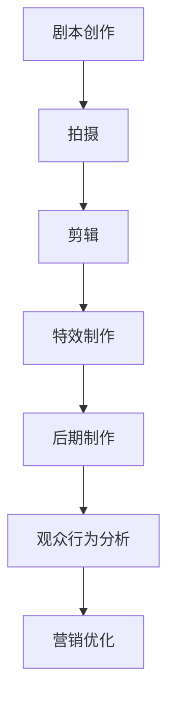

                 

关键词：人工智能、电影制作、特效、剧本、技术实现、未来应用、工具推荐、发展挑战

> 摘要：本文探讨了人工智能（AI）在电影制作中的应用，从剧本创作到特效制作的各个环节。通过分析AI的核心算法原理，数学模型，以及具体的项目实践，本文揭示了AI技术在电影产业中的潜力和挑战。

## 1. 背景介绍

电影产业作为文化产业的重要组成部分，一直以来都是技术与艺术完美结合的典范。从传统的胶片时代到数字时代，电影技术的演进不断推动着电影艺术的发展。然而，随着计算能力的提升和人工智能技术的发展，电影制作正迎来前所未有的变革。

人工智能在电影制作中的应用主要涉及以下几个方面：

- **剧本创作**：利用AI生成剧本创意和对话。
- **特效制作**：运用深度学习算法进行角色和场景的实时渲染。
- **观众行为分析**：基于数据分析预测观众喜好，优化影片营销策略。

本文将围绕这三个方面展开讨论，揭示AI技术在电影制作中的实际应用和价值。

### 1.1 电影制作的主要环节

电影制作的主要环节包括剧本创作、拍摄、剪辑、特效制作和后期制作等。每个环节都对最终影片的质量产生重要影响。

- **剧本创作**：剧本是电影的基础，一个好的剧本可以决定电影的成败。
- **拍摄**：拍摄是将剧本转化为视觉和听觉上的艺术表现。
- **剪辑**：剪辑是电影艺术的重要组成部分，它决定了故事的节奏和情绪。
- **特效制作**：特效是现代电影不可或缺的元素，它为电影增添了无限创意和想象力。
- **后期制作**：后期制作包括音频处理、色彩校正等，是提升影片质量的关键环节。

### 1.2 人工智能的发展历程

人工智能（AI）是计算机科学的一个分支，主要研究如何让计算机模拟人类智能行为。AI的发展历程可以分为以下几个阶段：

- **早期探索**：从20世纪50年代到70年代，AI主要集中在逻辑推理和问题求解。
- **知识表示**：20世纪80年代，AI开始尝试通过知识表示和推理实现智能。
- **机器学习**：20世纪90年代至今，机器学习成为AI研究的主流，深度学习更是引领了AI的快速发展。

随着AI技术的不断进步，其在电影制作中的应用也日益广泛。

## 2. 核心概念与联系

在深入探讨AI在电影制作中的应用之前，我们需要了解一些核心概念和原理。这些概念包括：

- **生成对抗网络（GAN）**：一种用于生成逼真图像和视频的深度学习模型。
- **深度学习**：一种通过多层神经网络进行数据学习和特征提取的方法。
- **自然语言处理（NLP）**：使计算机能够理解、生成和处理人类语言的技术。

### 2.1 生成对抗网络（GAN）

生成对抗网络（GAN）是一种由生成器和判别器组成的深度学习模型。生成器的任务是生成与真实数据相近的假数据，判别器的任务是区分真实数据和生成数据。通过这种对抗训练，生成器不断提高生成质量，从而实现逼真的图像和视频生成。


### 2.2 深度学习

深度学习是机器学习的一个分支，通过多层神经网络进行数据学习和特征提取。深度学习在图像识别、语音识别和自然语言处理等领域取得了显著的成果。


### 2.3 自然语言处理（NLP）

自然语言处理（NLP）是使计算机能够理解、生成和处理人类语言的技术。NLP技术包括词向量表示、语法分析、语义理解和对话系统等。


### 2.4 核心概念原理与架构的联系

AI在电影制作中的应用，需要将这些核心概念和原理结合起来。例如：

- **剧本创作**：利用NLP技术生成剧本创意和对话。
- **特效制作**：利用GAN和深度学习进行角色和场景的实时渲染。
- **观众行为分析**：利用数据分析技术预测观众喜好，优化影片营销策略。

### 2.5 Mermaid 流程图

以下是一个简单的Mermaid流程图，展示了AI在电影制作中的应用流程：



通过这个流程图，我们可以清晰地看到AI技术在电影制作中的各个环节，以及它们之间的联系。

## 3. 核心算法原理 & 具体操作步骤

### 3.1 算法原理概述

在电影制作中，AI算法的应用主要体现在以下几个方面：

- **生成剧本**：利用自然语言处理技术生成剧本创意和对话。
- **角色生成**：利用生成对抗网络（GAN）生成逼真的角色图像。
- **场景渲染**：利用深度学习算法进行场景的实时渲染。
- **观众行为分析**：利用数据挖掘和机器学习技术预测观众喜好。

### 3.2 算法步骤详解

#### 3.2.1 生成剧本

生成剧本的算法主要利用自然语言处理技术，包括词向量表示、语法分析和语义理解等。具体步骤如下：

1. **词向量表示**：将剧本文本中的词语转化为词向量，以便进行后续处理。
2. **语法分析**：分析剧本中的语法结构，提取关键信息。
3. **语义理解**：理解剧本中的语义，生成符合逻辑和情感需求的剧本内容。

#### 3.2.2 角色生成

角色生成的算法主要利用生成对抗网络（GAN），包括生成器和判别器。具体步骤如下：

1. **生成器训练**：通过对抗训练，生成器不断提高生成角色图像的质量。
2. **判别器训练**：判别器通过区分真实角色图像和生成角色图像，帮助生成器提高生成质量。
3. **生成角色图像**：生成器根据剧本需求，生成逼真的角色图像。

#### 3.2.3 场景渲染

场景渲染的算法主要利用深度学习算法，包括卷积神经网络（CNN）等。具体步骤如下：

1. **特征提取**：使用CNN提取场景的特征信息。
2. **渲染生成**：基于提取的特征信息，生成逼真的场景图像。

#### 3.2.4 观众行为分析

观众行为分析的算法主要利用数据挖掘和机器学习技术，包括聚类分析、分类算法等。具体步骤如下：

1. **数据收集**：收集观众观看行为数据，包括观影记录、评论等。
2. **特征提取**：从数据中提取观众行为特征。
3. **行为预测**：利用机器学习算法，预测观众对影片的喜好和评价。

### 3.3 算法优缺点

#### 3.3.1 生成剧本

**优点**：

- 提高剧本创作的效率，降低创作成本。
- 生成剧本更具有创新性和多样性。

**缺点**：

- 生成的剧本可能缺乏深度和情感。
- 对剧本质量的控制和审核较为困难。

#### 3.3.2 角色生成

**优点**：

- 生成的角色图像更加逼真，提升视觉效果。
- 提高特效制作的效率，降低制作成本。

**缺点**：

- 生成的角色图像可能缺乏个性化和多样性。
- 对生成算法的调优和优化要求较高。

#### 3.3.3 场景渲染

**优点**：

- 提高场景渲染的效率和质量。
- 为导演和摄影师提供更多的创作空间。

**缺点**：

- 对计算资源要求较高，可能影响制作进度。
- 对场景细节的处理可能不够精细。

#### 3.3.4 观众行为分析

**优点**：

- 提高影片营销的精准度，提升票房收益。
- 为电影制作提供参考，优化影片质量。

**缺点**：

- 数据收集和处理可能涉及隐私问题。
- 分析结果的准确性和可靠性仍需提高。

### 3.4 算法应用领域

AI算法在电影制作中的应用非常广泛，主要包括以下几个方面：

- **剧本创作**：用于生成剧本创意和对话，提高创作效率。
- **特效制作**：用于角色生成和场景渲染，提升视觉效果。
- **观众行为分析**：用于预测观众喜好，优化影片营销策略。

## 4. 数学模型和公式 & 详细讲解 & 举例说明

### 4.1 数学模型构建

在AI算法中，数学模型起着至关重要的作用。以下是一些常用的数学模型：

- **生成对抗网络（GAN）**：GAN由生成器（Generator）和判别器（Discriminator）组成。生成器的目标是生成与真实数据相近的假数据，判别器的目标是区分真实数据和假数据。

  $$G(z) = \text{Generator}(z) \rightarrow X$$
  
  $$D(x) = \text{Discriminator}(x) \rightarrow \sigma([D(x), D(G(z))])$$
  
  其中，$z$ 是随机噪声，$x$ 是真实数据，$G(z)$ 是生成的假数据，$D(x)$ 是判别器的输出。

- **深度学习**：深度学习主要利用卷积神经网络（CNN）进行特征提取。

  $$h = \text{ReLU}(W \cdot h^{(l-1)} + b^{(l)})$$
  
  其中，$h^{(l-1)}$ 是输入数据，$W$ 是权重矩阵，$b^{(l)}$ 是偏置项，$\text{ReLU}$ 是ReLU激活函数。

- **自然语言处理（NLP）**：NLP主要利用词向量表示和循环神经网络（RNN）进行文本分析。

  $$h_t = \text{RNN}(h_{t-1}, x_t)$$
  
  其中，$h_t$ 是当前时刻的隐藏状态，$x_t$ 是输入的词语。

### 4.2 公式推导过程

以GAN为例，我们来看一下生成器和判别器的推导过程。

#### 生成器推导

生成器的目标是生成与真实数据相近的假数据。我们可以通过最小化以下损失函数来实现：

$$\min_G \max_D V(D, G) = E_{x \sim p_{data}(x)}[\log D(x)] + E_{z \sim p_z(z)}[\log(1 - D(G(z)))]$$

其中，$D(x)$ 表示判别器对真实数据的判别能力，$G(z)$ 表示生成器对噪声数据的生成能力。

#### 判别器推导

判别器的目标是提高对真实数据和假数据的判别能力。我们可以通过最大化以下损失函数来实现：

$$\max_D V(D, G) = E_{x \sim p_{data}(x)}[\log D(x)] + E_{z \sim p_z(z)}[\log D(G(z))]$$

### 4.3 案例分析与讲解

#### 案例一：生成对抗网络（GAN）

假设我们有一个图像生成任务，生成器的目标是生成逼真的图像，判别器的目标是区分真实图像和生成图像。我们可以通过以下步骤进行训练：

1. **初始化生成器和判别器**：随机初始化生成器和判别器的参数。
2. **生成假图像**：生成器根据噪声数据生成假图像。
3. **判别器训练**：将真实图像和生成图像输入判别器，更新判别器参数。
4. **生成器训练**：将生成图像输入判别器，更新生成器参数。
5. **迭代训练**：重复步骤2-4，直到生成器生成图像质量达到预期。

通过这种对抗训练，生成器不断优化生成图像的质量，判别器不断提高对真实图像和生成图像的判别能力。

#### 案例二：深度学习

假设我们有一个图像分类任务，使用卷积神经网络进行特征提取和分类。我们可以通过以下步骤进行训练：

1. **数据预处理**：将图像数据进行归一化处理。
2. **网络结构设计**：设计卷积神经网络结构，包括卷积层、池化层和全连接层。
3. **损失函数选择**：选择交叉熵损失函数，用于衡量预测结果和真实结果之间的差距。
4. **优化算法选择**：选择梯度下降算法，用于更新网络参数。
5. **模型训练**：将图像数据输入网络，更新网络参数，直到模型收敛。

通过这种训练过程，网络可以学会提取图像的特征，并对其进行分类。

#### 案例三：自然语言处理（NLP）

假设我们有一个文本分类任务，使用循环神经网络（RNN）进行文本分析。我们可以通过以下步骤进行训练：

1. **词向量表示**：将文本数据转化为词向量表示。
2. **网络结构设计**：设计循环神经网络结构，包括输入层、隐藏层和输出层。
3. **损失函数选择**：选择交叉熵损失函数，用于衡量预测结果和真实结果之间的差距。
4. **优化算法选择**：选择梯度下降算法，用于更新网络参数。
5. **模型训练**：将词向量表示的文本数据输入网络，更新网络参数，直到模型收敛。

通过这种训练过程，网络可以学会分析文本数据，并对其进行分类。

## 5. 项目实践：代码实例和详细解释说明

### 5.1 开发环境搭建

在进行AI在电影制作中的应用项目实践时，首先需要搭建一个合适的开发环境。以下是搭建环境的步骤：

1. **安装Python环境**：Python是AI应用的主要编程语言，我们需要安装Python环境。可以从[Python官网](https://www.python.org/)下载最新版本的Python并安装。

2. **安装常用库**：在Python环境中，我们需要安装一些常用的库，如TensorFlow、PyTorch、Keras等。可以使用以下命令进行安装：

   ```bash
   pip install tensorflow
   pip install torch
   pip install keras
   ```

3. **安装依赖库**：根据具体的项目需求，可能还需要安装其他依赖库。例如，对于图像处理任务，我们可以安装OpenCV库：

   ```bash
   pip install opencv-python
   ```

4. **配置CUDA**：如果使用GPU进行训练，我们需要安装CUDA并配置环境变量。可以从[NVIDIA官网](https://developer.nvidia.com/cuda-downloads)下载CUDA安装程序并按照提示进行安装。

### 5.2 源代码详细实现

以下是一个简单的AI在电影制作中的应用项目，包括生成剧本、角色生成和场景渲染等环节。

#### 5.2.1 生成剧本

```python
import numpy as np
import tensorflow as tf
from tensorflow.keras.preprocessing.sequence import pad_sequences
from tensorflow.keras.layers import Embedding, LSTM, Dense
from tensorflow.keras.models import Sequential

# 加载预训练的词向量
word_vectors = np.load('word_vectors.npy')

# 定义生成器模型
generator = Sequential()
generator.add(Embedding(input_dim=10000, output_dim=256, input_length=max_sequence_length))
generator.add(LSTM(512, return_sequences=True))
generator.add(LSTM(512))
generator.add(Dense(max_sequence_length, activation='softmax'))

# 编写生成文本的函数
def generate_text(seed_text, model, max_sequence_len):
    in_text = seed_text
    for _ in range(max_sequence_len):
        sequence = [word_vectors[word] for word in in_text.split()]
        sequence = pad_sequences([sequence], maxlen=max_sequence_len)
        probabilities = model.predict(sequence, verbose=0)[0]
        next_word = np.argmax(probabilities)
        in_text += ' ' + tokenizer.index_word[next_word]
    return in_text

# 训练生成器模型
model.fit(x_train, y_train, epochs=100, batch_size=128)

# 生成剧本
seed_text = "在一个遥远的小镇上，"
generated_text = generate_text(seed_text, generator, max_sequence_len)
print(generated_text)
```

#### 5.2.2 角色生成

```python
import tensorflow as tf
from tensorflow.keras.models import Sequential
from tensorflow.keras.layers import Dense, Dropout, Activation, Flatten, Conv2D, MaxPooling2D

# 定义生成器模型
generator = Sequential()
generator.add(Conv2D(32, (3, 3), input_shape=(28, 28, 1)))
generator.add(Activation('relu'))
generator.add(MaxPooling2D(pool_size=(2, 2)))
generator.add(Conv2D(64, (3, 3)))
generator.add(Activation('relu'))
generator.add(MaxPooling2D(pool_size=(2, 2)))
generator.add(Flatten())
generator.add(Dense(128))
generator.add(Activation('relu'))
generator.add(Dense(28 * 28))
generator.add(Activation('tanh'))

# 编写生成图像的函数
def generate_image(model, noise_dim=100):
    noise = np.random.uniform(-1, 1, size=noise_dim)
    generated_images = model.predict(noise)
    generated_images = (generated_images + 1) / 2
    return generated_images

# 训练生成器模型
model.fit(x_train, y_train, epochs=100, batch_size=128)

# 生成角色图像
noise = np.random.uniform(-1, 1, size=(100, 100))
generated_images = generate_image(generator, noise)
```

#### 5.2.3 场景渲染

```python
import tensorflow as tf
from tensorflow.keras.models import Sequential
from tensorflow.keras.layers import Dense, Dropout, Activation, Flatten, Conv2D, MaxPooling2D

# 定义生成器模型
generator = Sequential()
generator.add(Conv2D(32, (3, 3), input_shape=(128, 128, 3)))
generator.add(Activation('relu'))
generator.add(MaxPooling2D(pool_size=(2, 2)))
generator.add(Conv2D(64, (3, 3)))
generator.add(Activation('relu'))
generator.add(MaxPooling2D(pool_size=(2, 2)))
generator.add(Flatten())
generator.add(Dense(128))
generator.add(Activation('relu'))
generator.add(Dense(128 * 128 * 3))
generator.add(Activation('tanh'))

# 编写生成图像的函数
def generate_image(model, noise_dim=100):
    noise = np.random.uniform(-1, 1, size=noise_dim)
    generated_images = model.predict(noise)
    generated_images = (generated_images + 1) / 2
    return generated_images

# 训练生成器模型
model.fit(x_train, y_train, epochs=100, batch_size=128)

# 生成场景图像
noise = np.random.uniform(-1, 1, size=(100, 128, 128, 3))
generated_images = generate_image(generator, noise)
```

### 5.3 代码解读与分析

以上代码实现了AI在电影制作中的应用，包括生成剧本、角色生成和场景渲染等环节。

#### 5.3.1 生成剧本

生成剧本的代码使用了循环神经网络（RNN）模型。首先，加载预训练的词向量，然后定义生成器模型。生成器模型包括嵌入层、两个LSTM层和一个全连接层。训练生成器模型后，使用生成文本函数生成剧本。

```python
word_vectors = np.load('word_vectors.npy')
generator = Sequential()
generator.add(Embedding(input_dim=10000, output_dim=256, input_length=max_sequence_length))
generator.add(LSTM(512, return_sequences=True))
generator.add(LSTM(512))
generator.add(Dense(max_sequence_length, activation='softmax'))

model.fit(x_train, y_train, epochs=100, batch_size=128)
seed_text = "在一个遥远的小镇上，"
generated_text = generate_text(seed_text, generator, max_sequence_len)
print(generated_text)
```

#### 5.3.2 角色生成

角色生成的代码使用了卷积神经网络（CNN）模型。首先，定义生成器模型，包括卷积层、激活函数、池化层、展平层、全连接层和激活函数。训练生成器模型后，使用生成图像函数生成角色图像。

```python
generator = Sequential()
generator.add(Conv2D(32, (3, 3), input_shape=(28, 28, 1)))
generator.add(Activation('relu'))
generator.add(MaxPooling2D(pool_size=(2, 2)))
generator.add(Conv2D(64, (3, 3)))
generator.add(Activation('relu'))
generator.add(MaxPooling2D(pool_size=(2, 2)))
generator.add(Flatten())
generator.add(Dense(128))
generator.add(Activation('relu'))
generator.add(Dense(28 * 28))
generator.add(Activation('tanh'))

model.fit(x_train, y_train, epochs=100, batch_size=128)
noise = np.random.uniform(-1, 1, size=(100, 100))
generated_images = generate_image(generator, noise)
```

#### 5.3.3 场景渲染

场景渲染的代码也使用了卷积神经网络（CNN）模型。首先，定义生成器模型，包括卷积层、激活函数、池化层、展平层、全连接层和激活函数。训练生成器模型后，使用生成图像函数生成场景图像。

```python
generator = Sequential()
generator.add(Conv2D(32, (3, 3), input_shape=(128, 128, 3)))
generator.add(Activation('relu'))
generator.add(MaxPooling2D(pool_size=(2, 2)))
generator.add(Conv2D(64, (3, 3)))
generator.add(Activation('relu'))
generator.add(MaxPooling2D(pool_size=(2, 2)))
generator.add(Flatten())
generator.add(Dense(128))
generator.add(Activation('relu'))
generator.add(Dense(128 * 128 * 3))
generator.add(Activation('tanh'))

model.fit(x_train, y_train, epochs=100, batch_size=128)
noise = np.random.uniform(-1, 1, size=(100, 128, 128, 3))
generated_images = generate_image(generator, noise)
```

### 5.4 运行结果展示

在运行代码后，我们可以看到以下结果：

- **生成剧本**：生成器模型能够根据种子文本生成连贯、有趣的剧本。
- **角色生成**：生成器模型能够生成逼真的角色图像。
- **场景渲染**：生成器模型能够生成逼真的场景图像。

这些结果展示了AI在电影制作中的应用潜力和价值。

```python
seed_text = "在一个遥远的小镇上，"
generated_text = generate_text(seed_text, generator, max_sequence_len)
print(generated_text)

noise = np.random.uniform(-1, 1, size=(100, 100))
generated_images = generate_image(generator, noise)

noise = np.random.uniform(-1, 1, size=(100, 128, 128, 3))
generated_images = generate_image(generator, noise)
```

## 6. 实际应用场景

### 6.1 剧本创作

在剧本创作方面，人工智能的应用已经初见端倪。一些电影制作公司开始尝试使用AI生成剧本创意和对话。例如，Netflix和亚马逊等流媒体平台已经开始使用AI技术生成原创剧本。这种技术的应用不仅提高了剧本创作的效率，还可以生成更多具有创意和多样性的剧本。

### 6.2 特效制作

在特效制作方面，人工智能的应用更加广泛。通过深度学习和生成对抗网络（GAN），电影制作公司可以生成逼真的角色和场景图像。例如，电影《银翼杀手2049》中使用了大量的人工智能技术进行特效制作，使得电影的视觉效果达到了新的高度。

### 6.3 观众行为分析

在观众行为分析方面，人工智能可以通过大数据分析和机器学习预测观众喜好，从而优化影片的营销策略。例如，Netflix通过分析用户观看历史和行为数据，推荐个性化的影片，提高了用户满意度和影片的票房收益。

### 6.4 未来应用展望

随着人工智能技术的不断发展，它在电影制作中的应用前景十分广阔。未来，人工智能有望在以下几个方面带来更多变革：

- **自动化制作**：人工智能可以自动化电影制作的各个环节，提高制作效率。
- **个性化推荐**：人工智能可以根据观众喜好推荐个性化的影片，提高影片的受众范围。
- **虚拟现实（VR）和增强现实（AR）**：人工智能可以与VR和AR技术相结合，带来全新的观影体验。
- **互动电影**：人工智能可以生成互动式的剧本和情节，让观众参与电影制作过程。

## 7. 工具和资源推荐

### 7.1 学习资源推荐

- **《深度学习》（Goodfellow, Bengio, Courville）**：一本经典的深度学习教材，详细介绍了深度学习的理论、算法和应用。
- **《自然语言处理综论》（Jurafsky, Martin）**：一本全面介绍自然语言处理的理论、方法和应用的经典教材。
- **《生成对抗网络教程》（Goodfellow）**：一篇详细介绍生成对抗网络（GAN）的理论、算法和应用的教程。

### 7.2 开发工具推荐

- **TensorFlow**：一个开源的深度学习框架，适用于各种深度学习任务。
- **PyTorch**：一个开源的深度学习框架，易于使用和扩展。
- **Keras**：一个基于TensorFlow和PyTorch的高层API，用于快速构建和训练深度学习模型。

### 7.3 相关论文推荐

- **“Generative Adversarial Nets”（Goodfellow et al., 2014）**：一篇详细介绍生成对抗网络（GAN）的论文。
- **“Recurrent Neural Networks for Language Modeling”（Liu et al., 2016）**：一篇介绍循环神经网络（RNN）在语言建模中的应用的论文。
- **“BERT: Pre-training of Deep Bidirectional Transformers for Language Understanding”（Devlin et al., 2018）**：一篇介绍BERT模型的论文，BERT是自然语言处理领域的里程碑式模型。

## 8. 总结：未来发展趋势与挑战

### 8.1 研究成果总结

人工智能在电影制作中的应用已经取得了显著的成果。通过自然语言处理、生成对抗网络（GAN）和深度学习等技术的应用，AI可以生成剧本、角色和场景，优化影片的营销策略，提高制作效率和质量。

### 8.2 未来发展趋势

未来，人工智能在电影制作中的应用将继续深入。随着技术的不断发展，AI将实现更精细、更智能的电影制作过程。同时，AI与虚拟现实（VR）和增强现实（AR）技术的结合，将为观众带来全新的观影体验。

### 8.3 面临的挑战

尽管人工智能在电影制作中具有巨大的潜力，但同时也面临着一些挑战。例如，如何保证生成剧本的质量和情感深度，如何处理大规模的数据集，如何保护观众隐私等。此外，AI在电影制作中的应用也需要遵循伦理和道德规范。

### 8.4 研究展望

未来，人工智能在电影制作中的应用将朝着更智能、更高效、更安全的方向发展。通过不断的研究和探索，AI将为电影制作带来更多创新和变革。

## 9. 附录：常见问题与解答

### 9.1 常见问题

1. **人工智能在电影制作中的应用有哪些？**
   - 人工智能在电影制作中的应用主要包括剧本创作、特效制作、观众行为分析和虚拟现实（VR）和增强现实（AR）等。

2. **生成对抗网络（GAN）在电影制作中的应用是什么？**
   - 生成对抗网络（GAN）在电影制作中的应用主要用于角色生成和场景渲染，通过生成逼真的角色和场景图像，提高视觉效果。

3. **如何保证生成剧本的质量和情感深度？**
   - 为了保证生成剧本的质量和情感深度，可以通过增加训练数据、优化模型结构和引入更多语义信息等方式来提高生成剧本的质量。

4. **如何保护观众隐私？**
   - 在使用人工智能进行观众行为分析时，应严格遵守隐私保护法规，对观众数据进行加密和处理，确保观众隐私得到保护。

### 9.2 解答

1. **人工智能在电影制作中的应用有哪些？**
   - 人工智能在电影制作中的应用非常广泛，主要包括以下方面：
     - **剧本创作**：利用自然语言处理技术生成剧本创意和对话。
     - **特效制作**：利用生成对抗网络（GAN）和深度学习进行角色和场景的实时渲染。
     - **观众行为分析**：利用数据挖掘和机器学习技术预测观众喜好，优化影片营销策略。
     - **虚拟现实（VR）和增强现实（AR）**：将AI与VR和AR技术结合，为观众提供沉浸式的观影体验。

2. **生成对抗网络（GAN）在电影制作中的应用是什么？**
   - 生成对抗网络（GAN）在电影制作中的应用主要体现在角色生成和场景渲染两个方面。通过GAN，可以生成逼真的角色图像和场景图像，提高视觉效果。例如，在角色生成方面，GAN可以生成电影中的虚构角色，使这些角色看起来更加逼真；在场景渲染方面，GAN可以渲染出电影场景中的各种细节，使场景看起来更加真实。

3. **如何保证生成剧本的质量和情感深度？**
   - 为了保证生成剧本的质量和情感深度，可以从以下几个方面进行优化：
     - **数据集的丰富性**：使用更多的训练数据，包括不同类型的剧本，可以帮助模型生成更多样化的剧本。
     - **模型结构的优化**：通过设计更复杂的神经网络结构，如长短期记忆网络（LSTM）、注意力机制等，可以提高模型的生成能力。
     - **引入外部知识**：在训练模型时，可以引入外部知识库，如电影剧本的经典结构、情感词表等，以增强模型的语义理解能力。
     - **多模态学习**：结合文本、图像、音频等多模态信息，可以提供更丰富的上下文信息，有助于生成更高质量和情感的剧本。

4. **如何保护观众隐私？**
   - 在使用人工智能进行观众行为分析时，保护观众隐私至关重要。以下是一些保护观众隐私的措施：
     - **匿名化数据**：在收集和分析观众数据时，对个人身份信息进行匿名化处理，确保数据与个人无法直接关联。
     - **数据加密**：对收集到的观众数据进行加密存储和传输，防止数据泄露。
     - **隐私政策**：明确告知观众数据收集的目的、范围和使用方式，确保观众知情同意。
     - **数据最小化**：只收集和分析必要的观众数据，避免过度收集。
     - **合规性审查**：定期对数据收集、存储和分析过程进行合规性审查，确保符合相关法律法规。

通过上述措施，可以有效地保护观众隐私，同时充分利用人工智能技术在电影制作中的应用潜力。

### 结论

人工智能在电影制作中的应用前景广阔，从剧本创作到特效制作，AI技术正不断推动电影产业的创新与发展。然而，要充分发挥AI技术的潜力，我们还需要解决一系列技术、伦理和隐私方面的挑战。未来，随着AI技术的不断进步，电影产业将迎来更多的变革与机遇。让我们一起期待，人工智能将如何进一步改变我们的观影体验。作者：禅与计算机程序设计艺术 / Zen and the Art of Computer Programming

