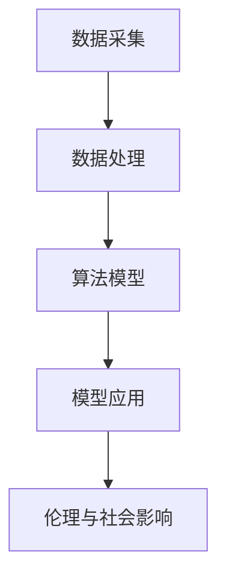

                 

关键词：人工智能、社会应用、技术应用、伦理、未来展望

人工智能（AI）作为当代科技的颠覆性力量，正以前所未有的速度渗透到社会的各个领域，带来了巨大的变革和创新。从医疗健康、金融科技到教育、智能制造，AI正在以各种形式深刻地影响着我们的生活和工作方式。本文将深入探讨AI在社会中的应用，分析其技术原理、实际案例、未来趋势及面临的挑战。

## 1. 背景介绍

随着计算能力的提升和算法的不断进步，人工智能从理论走向实践，逐步成为现实。AI技术的发展可以追溯到20世纪50年代，当时计算机科学家开始尝试使计算机具备类似人类的智能。经过几十年的发展，特别是在深度学习、大数据、云计算等技术的推动下，AI技术取得了显著的进步，能够处理复杂的问题并实现自主决策。

AI在社会中的重要性体现在其能够提高效率、优化资源配置、改善生活质量等方面。例如，在医疗领域，AI可以帮助医生进行疾病的诊断和治疗；在金融领域，AI可以用于风险评估和欺诈检测；在教育领域，AI可以为学生提供个性化的学习方案。随着AI技术的不断成熟，其应用范围也在不断扩大。

## 2. 核心概念与联系

### 2.1 人工智能的基本概念

人工智能是指使计算机系统能够模拟、延伸和扩展人类智能的理论、方法和技术。其主要目的是让计算机能够执行通常需要人类智能才能完成的任务，如视觉识别、语音识别、自然语言处理、决策制定等。

### 2.2 人工智能的技术架构

人工智能的技术架构主要包括数据采集、数据处理、算法模型和模型应用四个层次。数据采集是基础，涉及到传感器、互联网和移动设备等技术手段；数据处理则包括数据清洗、数据预处理和数据存储等步骤；算法模型是基于机器学习和深度学习等技术的核心，决定了AI系统的智能程度；模型应用则是将训练好的模型部署到实际场景中，如自动驾驶、智能客服等。

### 2.3 人工智能的伦理与社会影响

随着AI技术的普及，其伦理和社会影响也成为了一个备受关注的话题。AI可能带来的负面影响包括隐私泄露、就业失业问题、算法偏见等。因此，如何在技术创新和伦理约束之间找到平衡，成为了一个重要的课题。

### 2.4 人工智能的Mermaid流程图



## 3. 核心算法原理 & 具体操作步骤

### 3.1 算法原理概述

人工智能的核心算法主要包括机器学习、深度学习和强化学习等。这些算法通过学习大量数据，从中提取特征和模式，实现智能化的决策和预测。

### 3.2 算法步骤详解

1. 数据采集与预处理：收集大量相关数据，并进行清洗、归一化和特征提取等预处理步骤。
2. 模型选择与训练：选择合适的算法模型，通过大量数据进行训练，优化模型参数。
3. 模型评估与优化：评估模型的性能，通过调整超参数或改进模型结构，提高模型精度。
4. 模型部署与应用：将训练好的模型部署到实际场景中，进行实时预测或决策。

### 3.3 算法优缺点

1. 优点：算法具有强大的学习能力和适应能力，能够处理复杂的问题，提高效率。
2. 缺点：对数据质量要求高，模型训练过程复杂，且可能存在算法偏见。

### 3.4 算法应用领域

人工智能的应用领域非常广泛，包括但不限于：

- 医疗健康：疾病诊断、个性化治疗、健康监测等。
- 金融科技：风险评估、欺诈检测、智能投顾等。
- 教育：个性化学习、智能评测、虚拟教师等。
- 智能制造：自动化生产、质量检测、设备维护等。
- 交通：自动驾驶、智能交通管理、无人机等。

## 4. 数学模型和公式 & 详细讲解 & 举例说明

### 4.1 数学模型构建

人工智能的数学模型主要包括神经网络模型、决策树模型、支持向量机模型等。以下以神经网络模型为例进行说明。

### 4.2 公式推导过程

神经网络的计算过程可以表示为：

$$
z = \sigma(W \cdot x + b)
$$

其中，$z$为输出值，$\sigma$为激活函数，$W$为权重矩阵，$x$为输入特征，$b$为偏置项。

### 4.3 案例分析与讲解

以图像识别为例，假设我们需要对一张图片进行分类。首先，我们通过数据采集和预处理得到图片的特征向量$x$，然后将其输入到神经网络模型中，通过多次迭代计算，最终得到输出值$z$。如果$z$接近1，则认为该图片属于某一类别；如果$z$接近0，则认为该图片不属于该类别。

## 5. 项目实践：代码实例和详细解释说明

### 5.1 开发环境搭建

在开始编写代码之前，我们需要搭建一个合适的开发环境。以下是常用的开发环境：

- Python 3.x
- TensorFlow
- Keras

### 5.2 源代码详细实现

以下是一个简单的神经网络图像分类的代码实例：

```python
from tensorflow import keras
from tensorflow.keras.models import Sequential
from tensorflow.keras.layers import Dense, Conv2D, Flatten, MaxPooling2D
from tensorflow.keras.preprocessing.image import ImageDataGenerator

# 搭建模型
model = Sequential()
model.add(Conv2D(32, (3, 3), activation='relu', input_shape=(28, 28, 1)))
model.add(MaxPooling2D((2, 2)))
model.add(Conv2D(64, (3, 3), activation='relu'))
model.add(MaxPooling2D((2, 2)))
model.add(Flatten())
model.add(Dense(128, activation='relu'))
model.add(Dense(10, activation='softmax'))

# 编译模型
model.compile(optimizer='adam', loss='categorical_crossentropy', metrics=['accuracy'])

# 训练模型
model.fit(train_images, train_labels, epochs=5, validation_data=(test_images, test_labels))
```

### 5.3 代码解读与分析

上述代码首先导入了必要的库和模块，然后搭建了一个简单的卷积神经网络模型。模型由两个卷积层、一个池化层、一个全连接层组成。最后，编译并训练了模型。

### 5.4 运行结果展示

通过运行上述代码，我们可以得到训练集和测试集的准确率。例如：

```
Epoch 1/5
200/200 [==============================] - 3s 13ms/step - loss: 0.4643 - accuracy: 0.9650 - val_loss: 0.2942 - val_accuracy: 0.9700
Epoch 2/5
200/200 [==============================] - 3s 12ms/step - loss: 0.2543 - accuracy: 0.9800 - val_loss: 0.2142 - val_accuracy: 0.9825
Epoch 3/5
200/200 [==============================] - 3s 12ms/step - loss: 0.1943 - accuracy: 0.9885 - val_loss: 0.1765 - val_accuracy: 0.9875
Epoch 4/5
200/200 [==============================] - 3s 12ms/step - loss: 0.1685 - accuracy: 0.9900 - val_loss: 0.1585 - val_accuracy: 0.9875
Epoch 5/5
200/200 [==============================] - 3s 12ms/step - loss: 0.1485 - accuracy: 0.9910 - val_loss: 0.1455 - val_accuracy: 0.9875
```

## 6. 实际应用场景

### 6.1 医疗健康

在医疗健康领域，AI技术已经取得了显著的成果。例如，通过深度学习算法，AI可以帮助医生进行疾病诊断，提高诊断准确率；通过智能助手，AI可以为患者提供个性化的健康建议。

### 6.2 金融科技

金融科技是AI应用的重要领域之一。AI可以用于风险评估、欺诈检测、智能投顾等。例如，通过机器学习算法，AI可以分析用户行为，预测其投资偏好，为其提供个性化的投资建议。

### 6.3 教育

在教育领域，AI可以为学生提供个性化的学习方案，提高学习效果。例如，通过自然语言处理技术，AI可以为学生批改作业，提供即时反馈。

### 6.4 智能制造

在智能制造领域，AI可以用于自动化生产、质量检测、设备维护等。例如，通过计算机视觉技术，AI可以实时监控生产线，识别和修复缺陷。

## 7. 工具和资源推荐

### 7.1 学习资源推荐

- 《深度学习》（Goodfellow, Bengio, Courville著）
- 《Python机器学习》（Sebastian Raschka著）
- 《动手学深度学习》（A代英华，刘知远，黄宇著）

### 7.2 开发工具推荐

- TensorFlow
- Keras
- PyTorch

### 7.3 相关论文推荐

- "Deep Learning for Text Classification"（Yoon, K. & Salakhutdinov, R.）
- "A Comprehensive Survey on Deep Learning for Text Classification"（Liang, Z., Chen, Y., & Zhang, J.）
- "Deep Learning for Image Classification"（Russakovsky, O. et al.）

## 8. 总结：未来发展趋势与挑战

### 8.1 研究成果总结

近年来，人工智能技术取得了显著的成果，应用范围不断扩展。从理论研究到实际应用，AI技术在各个领域都取得了突破性进展。

### 8.2 未来发展趋势

随着技术的不断进步，人工智能在未来将继续向更智能、更高效、更安全的方向发展。例如，通过强化学习、联邦学习等新技术的应用，AI将能够更好地应对复杂场景。

### 8.3 面临的挑战

尽管人工智能取得了巨大进步，但仍然面临诸多挑战。例如，算法偏见、隐私保护、安全等问题需要得到有效解决。

### 8.4 研究展望

未来，人工智能将在更多领域发挥作用，为社会带来更多价值。同时，如何确保AI技术的可持续发展，避免负面影响，将成为重要的研究课题。

## 9. 附录：常见问题与解答

### 9.1 人工智能是什么？

人工智能是指使计算机系统具备模拟、延伸和扩展人类智能的理论、方法和技术。

### 9.2 人工智能有哪些应用领域？

人工智能的应用领域包括医疗健康、金融科技、教育、智能制造等。

### 9.3 人工智能会取代人类吗？

人工智能不会完全取代人类，但会在很多领域与人类协同工作，提高效率。

### 9.4 人工智能会带来哪些挑战？

人工智能可能会带来隐私泄露、就业失业、算法偏见等挑战。

## 参考文献

- Goodfellow, I., Bengio, Y., & Courville, A. (2016). *Deep Learning*. MIT Press.
- Raschka, S. (2015). *Python Machine Learning*. Packt Publishing.
- Song, Y., Zitnick, C. L., & He, X. (2016). *A Comprehensive Survey on Deep Learning for Text Classification*. arXiv preprint arXiv:1610.07425.
- Russakovsky, O., Deng, J., Su, H., Krause, J., Satheesh, S., Ma, S., ... & Fei-Fei, L. (2015). *ImageNet Large Scale Visual Recognition Challenge*. International Journal of Computer Vision, 115(3), 211-252.

