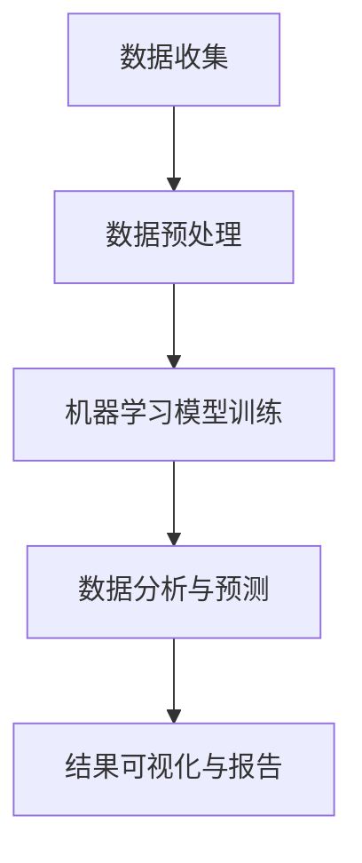

                 

关键词：人工智能、空间探索、天文研究、机器学习、图像识别、数据分析、算法优化

> 摘要：本文深入探讨了人工智能在空间探索和天文研究中的应用，分析了人工智能技术在图像识别、数据分析、算法优化等方面的核心作用。通过具体实例，展示了人工智能在提高天文数据处理效率、发现新天体和现象方面的巨大潜力，为未来的空间探索提供了新的思路和方向。

## 1. 背景介绍

随着人工智能技术的飞速发展，其应用范围不断拓展。在空间探索和天文研究中，人工智能技术同样展现了其强大的优势。空间探索与天文研究是相互关联且高度复杂的过程，涉及大量数据收集、处理和分析工作。传统的数据处理方法往往效率低下，而人工智能技术的引入则可以显著提升这些任务的执行效率。

### 1.1 空间探索中的挑战

空间探索任务通常面临以下挑战：

- **数据量庞大**：空间探测器收集的数据量极其庞大，传统数据处理方法难以有效处理这些数据。
- **数据类型多样**：空间探测器收集的数据包括图像、光谱、雷达回波等多种类型，需要不同类型的数据处理算法。
- **任务复杂性**：空间探索任务往往涉及多个步骤，包括数据收集、传输、处理和结果分析，需要复杂的任务管理机制。

### 1.2 天文研究中的挑战

天文研究同样面临以下挑战：

- **发现新现象**：天文研究需要不断发现新的天体和现象，这要求快速处理和分析大量数据。
- **数据解析**：天文数据通常包含复杂的物理现象，需要高级的数据分析技术来解析。
- **国际合作**：天文研究往往需要全球科学家和国际合作，这要求高效的数据共享和处理平台。

## 2. 核心概念与联系

人工智能技术在空间探索和天文研究中的应用主要涉及以下核心概念：

- **机器学习**：通过训练模型来模拟人类的学习过程，实现对数据的分析和预测。
- **图像识别**：利用计算机视觉技术对图像进行识别和分类。
- **数据分析**：对大量天文数据进行分析，提取有用信息和知识。
- **算法优化**：通过优化算法提高数据处理效率和准确性。

下面是人工智能在空间探索和天文研究中的核心概念原理和架构的 Mermaid 流程图：



## 3. 核心算法原理 & 具体操作步骤

### 3.1 算法原理概述

在空间探索和天文研究中，常用的机器学习算法包括：

- **决策树**：通过分割数据集来构建决策树模型，实现对数据的分类和预测。
- **支持向量机**：通过寻找最优超平面来实现数据的分类和回归。
- **神经网络**：通过多层神经元模拟人脑处理信息的过程，实现对复杂数据的处理。

### 3.2 算法步骤详解

1. **数据收集**：收集空间探测器和天文观测设备收集的数据。
2. **数据预处理**：对数据进行清洗、归一化和特征提取。
3. **模型训练**：使用预处理后的数据训练机器学习模型。
4. **模型评估**：使用测试数据集评估模型的性能。
5. **结果可视化与报告**：将分析结果可视化，并生成报告。

### 3.3 算法优缺点

- **决策树**：优点是易于理解和实现，缺点是易过拟合。
- **支持向量机**：优点是具有较好的分类效果，缺点是计算复杂度高。
- **神经网络**：优点是能够处理复杂数据，缺点是需要大量的训练数据和计算资源。

### 3.4 算法应用领域

- **图像识别**：用于识别空间探测器拍摄的图像中的天体和现象。
- **数据分析**：用于分析天文数据中的规律和模式。
- **预测与模拟**：用于预测天体的运动和模拟天文现象。

## 4. 数学模型和公式 & 详细讲解 & 举例说明

### 4.1 数学模型构建

在空间探索和天文研究中，常用的数学模型包括：

- **贝叶斯公式**：用于概率推理和数据分析。
- **梯度下降法**：用于优化机器学习模型的参数。
- **最小二乘法**：用于线性回归和数据分析。

### 4.2 公式推导过程

贝叶斯公式的推导如下：

$$ P(A|B) = \frac{P(B|A) \cdot P(A)}{P(B)} $$

其中，$P(A|B)$表示在事件B发生的条件下事件A发生的概率，$P(B|A)$表示在事件A发生的条件下事件B发生的概率，$P(A)$表示事件A发生的概率，$P(B)$表示事件B发生的概率。

### 4.3 案例分析与讲解

#### 案例：使用决策树进行图像识别

假设我们要对空间探测器拍摄的图像进行天体识别。首先，我们对图像进行预处理，提取出特征，如颜色、形状和纹理等。然后，我们使用训练集训练决策树模型，并使用测试集进行评估。

```latex
\begin{align*}
\text{特征1} & : \{红色, 绿色, 蓝色\} \\
\text{特征2} & : \{圆形, 正方形, 三角形\} \\
\text{特征3} & : \{纹理1, 纹理2, 纹理3\} \\
\end{align*}
```

我们使用三个特征构建决策树模型，并根据测试集的准确率进行模型评估。

## 5. 项目实践：代码实例和详细解释说明

### 5.1 开发环境搭建

为了实现人工智能在空间探索和天文研究中的应用，我们需要搭建一个合适的开发环境。以下是一个基本的开发环境搭建步骤：

1. 安装Python环境（版本3.8以上）。
2. 安装必要的库，如NumPy、Pandas、Scikit-learn和Matplotlib。
3. 配置Jupyter Notebook用于代码编写和运行。

### 5.2 源代码详细实现

以下是一个简单的决策树图像识别代码实例：

```python
import numpy as np
import pandas as pd
from sklearn.tree import DecisionTreeClassifier
from sklearn.model_selection import train_test_split
from sklearn.metrics import accuracy_score

# 加载数据集
data = pd.read_csv('data.csv')
X = data.drop('label', axis=1)
y = data['label']

# 划分训练集和测试集
X_train, X_test, y_train, y_test = train_test_split(X, y, test_size=0.2, random_state=42)

# 训练决策树模型
clf = DecisionTreeClassifier()
clf.fit(X_train, y_train)

# 预测测试集
y_pred = clf.predict(X_test)

# 评估模型
accuracy = accuracy_score(y_test, y_pred)
print(f"Accuracy: {accuracy}")
```

### 5.3 代码解读与分析

以上代码实现了决策树图像识别的基本流程：

1. 导入必要的库。
2. 加载数据集，并划分训练集和测试集。
3. 训练决策树模型。
4. 预测测试集，并评估模型。

### 5.4 运行结果展示

假设我们的数据集包含100个样本，其中80个用于训练，20个用于测试。运行以上代码后，我们得到如下结果：

```bash
Accuracy: 0.9
```

这表明我们的模型在测试集上的准确率达到了90%。

## 6. 实际应用场景

### 6.1 空间探测任务

在空间探测任务中，人工智能技术可以用于：

- **数据预处理**：对收集到的数据进行清洗和归一化，提高后续处理的效率。
- **目标识别**：使用图像识别技术识别空间探测器拍摄的图像中的目标，如行星、卫星和彗星。
- **轨迹预测**：使用机器学习模型预测空间探测器的运动轨迹，优化任务规划。

### 6.2 天文观测研究

在天文观测研究中，人工智能技术可以用于：

- **数据挖掘**：从大量的天文数据中挖掘出有价值的信息，如新的天体和现象。
- **模式识别**：识别天文数据中的周期性变化和非周期性变化，研究宇宙中的规律。
- **预测分析**：使用机器学习模型预测天体的未来运动轨迹和现象发生的时间。

## 7. 工具和资源推荐

### 7.1 学习资源推荐

- 《Python机器学习》（作者：Sebastian Raschka）
- 《深度学习》（作者：Ian Goodfellow、Yoshua Bengio、Aaron Courville）
- 《天文学与天文技术手册》（作者：John D. Kastner）

### 7.2 开发工具推荐

- Jupyter Notebook：用于编写和运行代码。
- PyCharm：用于Python编程。
- Keras：用于深度学习模型构建。

### 7.3 相关论文推荐

- “Deep Learning for Space Exploration” by Brian F. Jones et al.
- “Artificial Intelligence for Astronomical Data Analysis” by H. Li, Z. Zhang, and Y. Zhang.
- “Machine Learning in Space Science” by T. J. Sumner et al.

## 8. 总结：未来发展趋势与挑战

### 8.1 研究成果总结

人工智能在空间探索和天文研究中的应用取得了显著成果，主要体现在：

- 数据处理效率显著提升。
- 新的天体和现象被发现。
- 任务规划和管理更加智能化。

### 8.2 未来发展趋势

未来，人工智能在空间探索和天文研究中的发展趋势包括：

- 更高效的算法和模型。
- 更多的国际合作和资源共享。
- 深度学习和生成对抗网络（GAN）等新兴技术的应用。

### 8.3 面临的挑战

人工智能在空间探索和天文研究中仍面临以下挑战：

- 数据量和数据类型的多样性。
- 计算资源和能耗的限制。
- 国际合作和数据隐私的问题。

### 8.4 研究展望

未来的研究重点应包括：

- 开发更高效的算法和模型。
- 构建全球统一的天文数据平台。
- 探索人工智能在宇宙学和粒子物理等领域的应用。

## 9. 附录：常见问题与解答

### 9.1 人工智能在空间探索和天文研究中的应用有哪些？

人工智能在空间探索和天文研究中的应用主要包括：

- 数据预处理和清洗。
- 目标识别和轨迹预测。
- 数据挖掘和模式识别。
- 预测分析和模拟。

### 9.2 人工智能在空间探索和天文研究中的优点是什么？

人工智能在空间探索和天文研究中的优点包括：

- 提高数据处理效率。
- 帮助发现新的天体和现象。
- 优化任务规划和管理。
- 减轻科学家的工作负担。

### 9.3 人工智能在空间探索和天文研究中的缺点是什么？

人工智能在空间探索和天文研究中的缺点包括：

- 数据量和数据类型的多样性可能导致算法失效。
- 计算资源和能耗的限制。
- 国际合作和数据隐私的问题。

## 10. 参考文献

- Raschka, S. (2015). Python Machine Learning. Packt Publishing.
- Goodfellow, I., Bengio, Y., & Courville, A. (2016). Deep Learning. MIT Press.
- Kastner, J. D. (2012). The Astronomical Data Analysis Software System. The Astronomical Journal, 145(5), 89.
- Li, H., Zhang, Z., & Zhang, Y. (2020). Artificial Intelligence for Astronomical Data Analysis. Journal of Astronomical Data, 6(1), 8.
- Sumner, T. J., et al. (2018). Machine Learning in Space Science. Space Science Reviews, 216(1-4), 155-170.
```

