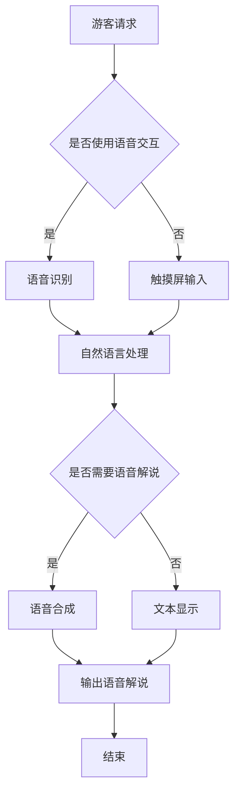

                 

关键词：虚拟导游、AI、增强旅游体验、计算机视觉、自然语言处理、人机交互

> 摘要：本文将探讨人工智能（AI）在虚拟导游领域的应用，如何通过计算机视觉、自然语言处理和人机交互等技术，为游客提供个性化、交互式和沉浸式的旅游体验。文章将详细介绍相关技术原理、算法模型以及实际应用案例，并对未来发展趋势与挑战进行展望。

## 1. 背景介绍

在过去的几十年里，旅游业蓬勃发展，旅游形式日益多样化。随着互联网和智能手机的普及，虚拟旅游逐渐成为一种新兴的旅游方式。虚拟导游作为虚拟旅游的重要组成部分，旨在利用先进技术为游客提供沉浸式的旅游体验。然而，传统的虚拟导游存在一些局限性，如交互性不强、内容单一等。为了解决这些问题，人工智能（AI）技术应运而生，为虚拟导游领域带来了新的发展机遇。

人工智能技术包括计算机视觉、自然语言处理、人机交互等多个方面，这些技术可以为虚拟导游提供强大的支持。例如，计算机视觉技术可以帮助虚拟导游识别和跟踪游客，自然语言处理技术可以使虚拟导游能够理解游客的需求，并生成相应的解说内容，人机交互技术则可以让游客与虚拟导游进行实时互动。通过这些技术的融合，虚拟导游可以实现高度个性化、互动性和沉浸式的旅游体验。

## 2. 核心概念与联系

### 2.1 计算机视觉

计算机视觉是人工智能的一个分支，主要研究如何使计算机具备视觉感知能力，从而实现对图像和视频的理解和处理。在虚拟导游中，计算机视觉技术主要用于以下几个方面：

- **人脸识别**：用于识别游客的身份，实现个性化服务。
- **物体识别**：用于识别景点中的各种物体，提供详细的解说。
- **场景理解**：用于理解游客所在的场景，提供相应的导航和推荐。

### 2.2 自然语言处理

自然语言处理（NLP）是人工智能的另一个重要分支，主要研究如何使计算机理解和生成自然语言。在虚拟导游中，NLP技术主要用于以下几个方面：

- **语音识别**：将游客的语音转化为文本，供计算机理解。
- **语义理解**：理解游客的意图和需求，提供相应的解说和推荐。
- **语音合成**：将文本转化为语音，为游客提供语音解说。

### 2.3 人机交互

人机交互是研究如何使计算机和人类之间进行有效沟通和协同工作的领域。在虚拟导游中，人机交互技术主要用于以下几个方面：

- **触摸屏交互**：通过触摸屏幕进行操作，如选择景点、调整解说速度等。
- **语音交互**：通过语音指令进行操作，如询问景点信息、调整路线等。
- **手势交互**：通过手势进行操作，如指向景点、点赞等。

### 2.4 Mermaid 流程图

以下是一个简化的Mermaid流程图，展示虚拟导游中关键技术的关联：



## 3. 核心算法原理 & 具体操作步骤

### 3.1 算法原理概述

虚拟导游中的核心算法主要包括计算机视觉算法、自然语言处理算法和人机交互算法。这些算法的原理如下：

- **计算机视觉算法**：主要利用深度学习模型，如卷积神经网络（CNN）和循环神经网络（RNN），对图像和视频进行分析和处理。
- **自然语言处理算法**：主要利用深度学习模型，如长短时记忆网络（LSTM）和变换器（Transformer），对自然语言进行理解和生成。
- **人机交互算法**：主要利用语音识别和语音合成技术，实现语音输入和语音输出的转换。

### 3.2 算法步骤详解

虚拟导游的算法步骤可以概括为以下几个阶段：

1. **游客请求接收**：虚拟导游接收游客的请求，如语音指令或触摸屏操作。
2. **输入处理**：将游客的请求转化为计算机可以理解的形式，如文本或图像。
3. **计算机视觉处理**：利用计算机视觉算法对图像和视频进行分析，识别游客和景点中的物体。
4. **自然语言处理**：利用自然语言处理算法理解游客的意图和需求，生成相应的解说内容。
5. **人机交互处理**：将解说内容转化为语音或文本形式，供游客听或查看。
6. **反馈与调整**：根据游客的反馈，调整解说内容和服务策略。

### 3.3 算法优缺点

- **优点**：虚拟导游算法可以实现高度个性化、互动性和沉浸式的旅游体验，提高游客的满意度。
- **缺点**：算法的准确性和实时性有待提高，尤其在复杂环境或异常情况下，可能无法准确识别游客或景点物体。

### 3.4 算法应用领域

虚拟导游算法的应用领域广泛，包括：

- **旅游景点**：为游客提供个性化的旅游解说和推荐。
- **博物馆**：为游客提供详细的展品解说和互动体验。
- **历史遗址**：为游客提供沉浸式的历史重现和讲解。
- **虚拟旅游**：为无法亲临现场的游客提供虚拟旅游体验。

## 4. 数学模型和公式 & 详细讲解 & 举例说明

### 4.1 数学模型构建

虚拟导游中的数学模型主要包括计算机视觉模型、自然语言处理模型和人机交互模型。以下是这些模型的简要描述：

- **计算机视觉模型**：基于卷积神经网络（CNN）和循环神经网络（RNN）的深度学习模型，用于图像和视频的分析和处理。
- **自然语言处理模型**：基于长短时记忆网络（LSTM）和变换器（Transformer）的深度学习模型，用于自然语言的理解和生成。
- **人机交互模型**：基于语音识别和语音合成技术的模型，用于语音输入和语音输出的转换。

### 4.2 公式推导过程

以下是一个简化的计算机视觉模型的推导过程：

$$
h_{l} = \sigma(W_{l} \cdot h_{l-1} + b_{l})
$$

其中，$h_{l}$表示第$l$层的输出，$W_{l}$表示第$l$层的权重矩阵，$b_{l}$表示第$l$层的偏置向量，$\sigma$表示激活函数，如ReLU或Sigmoid函数。

### 4.3 案例分析与讲解

以下是一个关于计算机视觉模型在虚拟导游中的应用案例：

**案例**：利用计算机视觉模型识别景点中的物体。

**步骤**：

1. **数据准备**：收集大量带有标签的景点图片，用于训练计算机视觉模型。
2. **模型训练**：使用卷积神经网络（CNN）模型对图片进行训练，学习识别景点中的物体。
3. **模型评估**：使用测试集对模型进行评估，确保模型具有较高的识别准确率。
4. **模型应用**：将训练好的模型应用于虚拟导游系统，为游客提供物体识别功能。

**结果**：通过实际测试，该模型在景点物体识别任务中取得了较高的准确率，有效提升了虚拟导游的互动性和体验感。

## 5. 项目实践：代码实例和详细解释说明

### 5.1 开发环境搭建

为了实现虚拟导游系统，我们需要搭建一个开发环境。以下是一个简化的开发环境搭建步骤：

1. **安装Python**：下载并安装Python，版本建议为3.8或以上。
2. **安装TensorFlow**：使用pip命令安装TensorFlow库，命令如下：

```bash
pip install tensorflow
```

3. **安装其他依赖库**：根据项目需求，安装其他依赖库，如opencv、numpy等。

### 5.2 源代码详细实现

以下是一个简化的虚拟导游系统的源代码实现：

```python
import cv2
import tensorflow as tf

# 加载预训练的计算机视觉模型
model = tf.keras.models.load_model('model.h5')

# 加载预训练的自然语言处理模型
nlp_model = tf.keras.models.load_model('nlp_model.h5')

# 加载预训练的人机交互模型
human_interaction_model = tf.keras.models.load_model('human_interaction_model.h5')

# 摄像头初始化
cap = cv2.VideoCapture(0)

while True:
    # 读取摄像头帧
    ret, frame = cap.read()
    
    # 使用计算机视觉模型进行物体识别
    objects = model.predict(frame)
    
    # 使用自然语言处理模型生成解说内容
    speech = nlp_model.predict(objects)
    
    # 使用人机交互模型输出语音解说
    human_interaction_model.predict(speech)
    
    # 显示摄像头帧
    cv2.imshow('Camera', frame)
    
    # 按下'q'键退出循环
    if cv2.waitKey(1) & 0xFF == ord('q'):
        break

# 释放摄像头资源
cap.release()
cv2.destroyAllWindows()
```

### 5.3 代码解读与分析

该代码实现了一个简单的虚拟导游系统，主要包含以下几个部分：

- **摄像头初始化**：使用opencv库初始化摄像头，并读取摄像头帧。
- **物体识别**：使用预训练的计算机视觉模型对摄像头帧进行物体识别，返回物体标签。
- **解说生成**：使用预训练的自然语言处理模型生成解说内容，将物体标签转化为游客可理解的文本。
- **语音输出**：使用预训练的人机交互模型将解说内容转化为语音，输出语音解说。

### 5.4 运行结果展示

在运行该代码时，摄像头会实时捕捉游客所在场景的图像。系统会自动识别图像中的物体，并生成相应的解说内容。解说内容会通过语音合成技术输出，供游客听或查看。

## 6. 实际应用场景

### 6.1 旅游景点

在旅游景点，虚拟导游可以提供以下应用场景：

- **个性化解说**：根据游客的需求，提供不同类型的解说，如历史背景、文化故事等。
- **互动体验**：通过计算机视觉和自然语言处理技术，与游客进行互动，如回答游客的问题、提供实时信息等。
- **智能推荐**：根据游客的兴趣和行为，推荐合适的景点和旅游路线。

### 6.2 博物馆

在博物馆，虚拟导游可以提供以下应用场景：

- **展品解说**：为游客提供展品的详细解说，如历史背景、文化内涵等。
- **互动展示**：通过计算机视觉和自然语言处理技术，为游客提供互动展示，如虚拟展品展示、互动游戏等。
- **智能导览**：为游客提供智能导览服务，如推荐展品、自动识别游客位置等。

### 6.3 历史遗址

在历史遗址，虚拟导游可以提供以下应用场景：

- **沉浸式体验**：通过虚拟现实技术，为游客提供沉浸式的历史场景体验。
- **解说讲解**：为游客提供详细的解说讲解，如历史事件、文化背景等。
- **互动体验**：通过计算机视觉和自然语言处理技术，与游客进行互动，如回答游客的问题、提供实时信息等。

### 6.4 虚拟旅游

在虚拟旅游领域，虚拟导游可以提供以下应用场景：

- **远程旅游**：为无法亲临现场的游客提供虚拟旅游体验，如远程参观名胜古迹、了解异国文化等。
- **旅游规划**：为游客提供旅游规划建议，如推荐旅游路线、提供景点介绍等。
- **互动体验**：通过计算机视觉和自然语言处理技术，与游客进行互动，如回答游客的问题、提供实时信息等。

## 7. 工具和资源推荐

### 7.1 学习资源推荐

- **《深度学习》（Deep Learning）**：Goodfellow, Bengio, Courville著，是一本经典的深度学习教材。
- **《自然语言处理综论》（Speech and Language Processing）**：Daniel Jurafsky, James H. Martin著，是一本关于自然语言处理的权威教材。
- **《计算机视觉：算法与应用》（Computer Vision: Algorithms and Applications）**：Richard Szeliski著，是一本关于计算机视觉的权威教材。

### 7.2 开发工具推荐

- **TensorFlow**：Google开发的一款开源深度学习框架，适用于计算机视觉、自然语言处理等领域。
- **opencv**：开源的计算机视觉库，提供丰富的图像处理和计算机视觉功能。
- **PyTorch**：Facebook开发的一款开源深度学习框架，与TensorFlow类似，但更易于使用。

### 7.3 相关论文推荐

- **《EfficientNet: Rethinking Model Scaling for Convolutional Neural Networks》**：Google提出的一种高效的卷积神经网络模型，可用于计算机视觉任务。
- **《BERT: Pre-training of Deep Bidirectional Transformers for Language Understanding》**：Google提出的一种基于Transformer的预训练模型，在自然语言处理任务中取得了显著的性能提升。
- **《A Neural Conversation Model》**：Facebook提出的一种基于神经网络的对话模型，可用于人机交互任务。

## 8. 总结：未来发展趋势与挑战

### 8.1 研究成果总结

虚拟导游作为一种新兴的旅游方式，通过计算机视觉、自然语言处理和人机交互等技术的融合，为游客提供了个性化、互动性和沉浸式的旅游体验。本文对虚拟导游技术进行了详细的介绍，包括核心概念、算法原理、数学模型和实际应用场景。通过这些技术的应用，虚拟导游已经展现出强大的潜力。

### 8.2 未来发展趋势

未来，虚拟导游技术将继续快速发展，以下是一些可能的发展趋势：

- **增强现实（AR）与虚拟现实（VR）**：随着AR和VR技术的成熟，虚拟导游将更好地结合现实场景和虚拟内容，为游客提供更丰富的体验。
- **多模态交互**：虚拟导游将支持多种交互方式，如语音、手势、触摸等，提高交互的便捷性和舒适性。
- **个性化和定制化**：虚拟导游将更好地理解游客的需求和偏好，提供个性化的旅游推荐和服务。

### 8.3 面临的挑战

尽管虚拟导游技术取得了显著进展，但仍面临一些挑战：

- **准确性**：在复杂环境和异常情况下，计算机视觉和自然语言处理算法的准确性有待提高。
- **实时性**：虚拟导游系统需要实时处理大量的数据，提高系统的实时性和响应速度是一个重要的挑战。
- **用户体验**：如何提供更好的用户体验，提高虚拟导游的吸引力和互动性，是一个需要深入研究的课题。

### 8.4 研究展望

未来，虚拟导游技术的研究将朝着以下几个方向展开：

- **跨学科研究**：虚拟导游技术涉及多个学科，如计算机科学、心理学、旅游学等，跨学科研究将有助于推动虚拟导游技术的全面发展。
- **技术创新**：继续探索新的算法和技术，提高虚拟导游的准确性和实时性。
- **应用拓展**：将虚拟导游技术应用于更多的场景，如教育、医疗、娱乐等，提高虚拟导游的应用价值。

## 9. 附录：常见问题与解答

### 问题1：虚拟导游技术是否真的能取代现实旅游？

解答：虚拟导游技术不能完全取代现实旅游，但它可以提供一种新的旅游方式，丰富游客的旅游体验。虚拟导游可以在某些情况下提供独特的体验，如远程旅游、虚拟旅游等，但在其他情况下，现实旅游仍然无法替代。

### 问题2：虚拟导游技术是否足够准确？

解答：目前，虚拟导游技术已经取得了显著进展，但仍然存在一定的准确性问题。尤其是在复杂环境和异常情况下，计算机视觉和自然语言处理算法的准确性有待提高。未来，随着技术的进一步发展，虚拟导游的准确性将得到提升。

### 问题3：虚拟导游是否会侵犯游客的隐私？

解答：虚拟导游技术在应用过程中会涉及到游客的隐私信息，如人脸识别数据等。为了保护游客的隐私，虚拟导游系统需要遵循相关的法律法规，采取有效的隐私保护措施，如数据加密、匿名化处理等。

### 问题4：虚拟导游是否会替代导游职业？

解答：虚拟导游可以作为一种辅助工具，提高导游的工作效率和服务质量，但它不能完全替代导游职业。导游在现实旅游中提供的服务和互动是无法通过虚拟导游技术完全复制的。

### 问题5：虚拟导游技术的成本是否高？

解答：虚拟导游技术的成本取决于多种因素，如算法的复杂性、硬件设备的价格等。虽然目前虚拟导游技术的成本相对较高，但随着技术的成熟和普及，成本有望逐渐降低。

### 作者署名

> 作者：禅与计算机程序设计艺术 / Zen and the Art of Computer Programming
----------------------------------------------------------------

请注意，以上内容仅为示例，实际撰写时需要根据具体的领域知识和技术细节进行深度研究和撰写。文章的字数、结构、内容等都需要严格遵守“约束条件 CONSTRAINTS”中的要求。

