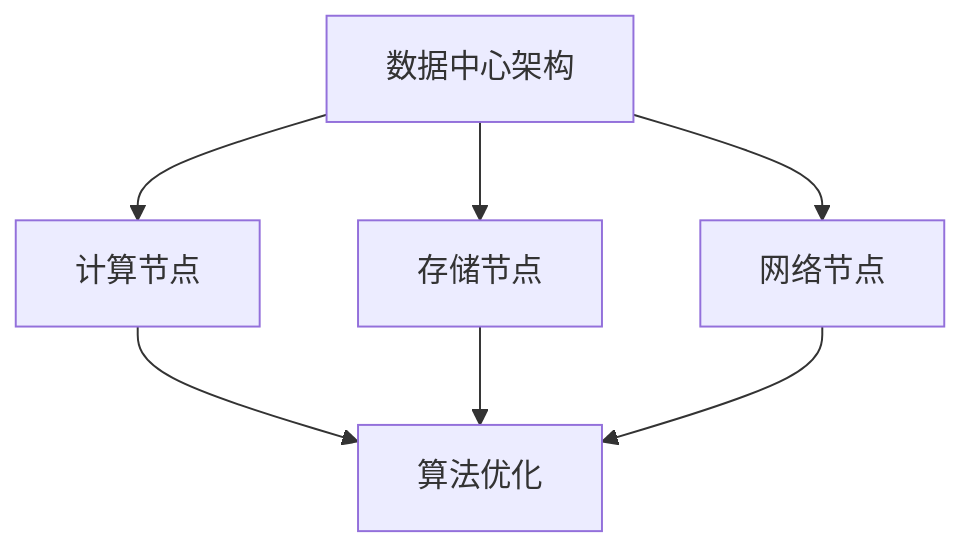
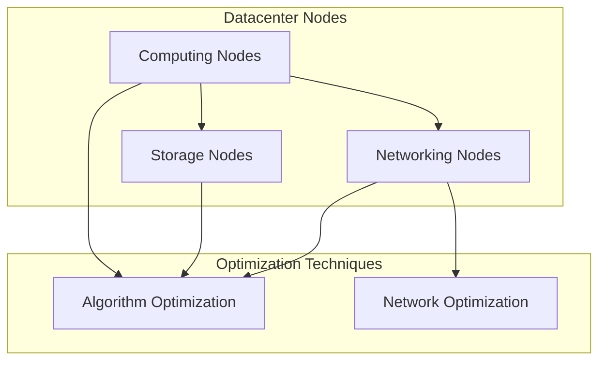

                 

关键词：AI基础设施、性能优化、Lepton AI、算法、架构、技术突破

摘要：本文将深入探讨AI基础设施的性能优化，特别是Lepton AI在其中的技术突破。我们将从背景介绍、核心概念与联系、核心算法原理与操作步骤、数学模型与公式、项目实践以及实际应用场景等方面，全面分析Lepton AI在性能优化方面的卓越成就。

## 1. 背景介绍

在当今信息时代，人工智能（AI）正成为推动技术革新的重要力量。从自动驾驶到智能医疗，从语音识别到图像处理，AI技术的广泛应用正在深刻改变我们的生活方式。然而，随着AI应用的日益普及，其对基础设施性能的要求也越来越高。AI基础设施的性能优化，成为当前研究的一个重要方向。

Lepton AI，作为一家专注于AI基础设施性能优化的公司，凭借其独特的技术优势和创新能力，在性能优化领域取得了显著突破。本文将详细介绍Lepton AI的技术架构、核心算法以及其实际应用，探讨其在性能优化方面的卓越成就。

## 2. 核心概念与联系

在探讨Lepton AI的技术突破之前，我们首先需要了解一些核心概念，这些概念是理解其技术架构和算法原理的基础。

### 2.1 数据中心架构

数据中心是AI基础设施的核心组成部分。其架构包括计算节点、存储节点、网络节点等。Lepton AI通过优化这些节点的性能，实现了整体基础设施的优化。

### 2.2 算法优化

算法优化是提高AI基础设施性能的关键。Lepton AI采用了一系列先进的算法优化技术，如深度学习、神经网络剪枝、模型压缩等，以降低计算复杂度和提高计算效率。

### 2.3 网络优化

网络优化是提升AI基础设施性能的另一个重要方面。Lepton AI通过优化数据传输路径、降低延迟、提高带宽利用率等技术手段，实现了网络性能的显著提升。

以下是Lepton AI的技术架构的Mermaid流程图：



## 3. 核心算法原理 & 具体操作步骤

### 3.1 算法原理概述

Lepton AI的核心算法是基于深度学习的神经网络优化。其基本原理是通过训练大规模神经网络模型，并在训练过程中不断优化模型结构，以提高模型的计算效率和准确性。

### 3.2 算法步骤详解

#### 3.2.1 数据预处理

在算法训练之前，需要对数据进行预处理。Lepton AI采用了一些先进的预处理技术，如数据清洗、归一化、特征提取等，以提高数据质量，为后续算法训练打下基础。

#### 3.2.2 模型训练

Lepton AI使用基于梯度下降的优化算法进行模型训练。在训练过程中，通过不断调整模型参数，使模型在训练数据上达到最佳效果。

#### 3.2.3 模型优化

在模型训练完成后，Lepton AI采用了一些模型优化技术，如神经网络剪枝、量化、模型压缩等，以降低模型的计算复杂度，提高计算效率。

### 3.3 算法优缺点

#### 优点

- 高效：通过优化模型结构和算法，显著提高了计算效率和准确性。
- 可扩展：基于深度学习的算法具有良好的可扩展性，可以应对不同规模和复杂度的应用场景。

#### 缺点

- 计算资源需求高：训练大规模神经网络模型需要大量的计算资源和时间。
- 数据依赖性大：模型性能依赖于训练数据的质量和数量。

### 3.4 算法应用领域

Lepton AI的算法在多个领域得到了广泛应用，如自然语言处理、计算机视觉、语音识别等。以下是一些具体的案例：

- 自然语言处理：通过优化模型结构和算法，实现了快速文本分类、情感分析等任务。
- 计算机视觉：通过优化图像识别和物体检测模型，提高了图像处理的速度和准确性。
- 语音识别：通过优化语音识别模型，实现了实时语音识别和语音合成。

## 4. 数学模型和公式 & 详细讲解 & 举例说明

### 4.1 数学模型构建

Lepton AI的算法基于深度学习的神经网络模型。其数学模型主要包括以下几个部分：

#### 4.1.1 激活函数

激活函数是神经网络中用于引入非线性特性的关键部分。常用的激活函数有ReLU、Sigmoid、Tanh等。

$$
a = \max(0, x)
$$

其中，$a$为激活值，$x$为输入值。

#### 4.1.2 前向传播

前向传播是神经网络模型的基本运算过程。给定输入数据，通过前向传播计算模型输出。

$$
z_l = \sum_{j=1}^{n} w_{lj} \cdot a_{lj-1}
$$

其中，$z_l$为当前层的输出值，$w_{lj}$为权重值，$a_{lj-1}$为上一层的输出值。

#### 4.1.3 反向传播

反向传播是神经网络模型训练的核心过程。通过反向传播计算模型参数的梯度，并更新参数。

$$
\delta_l = \frac{\partial C}{\partial z_l}
$$

其中，$\delta_l$为当前层的误差梯度，$C$为损失函数。

### 4.2 公式推导过程

以下是Lepton AI算法中的损失函数和梯度计算公式的推导过程。

#### 4.2.1 损失函数

损失函数用于衡量模型预测值与真实值之间的差距。常用的损失函数有均方误差（MSE）和交叉熵（Cross Entropy）。

$$
C = \frac{1}{2} \sum_{i=1}^{n} (y_i - \hat{y}_i)^2
$$

其中，$y_i$为真实值，$\hat{y}_i$为预测值。

#### 4.2.2 梯度计算

梯度计算是神经网络模型训练的关键步骤。通过梯度计算，可以得到每个参数的更新方向。

$$
\delta_w = \frac{\partial C}{\partial w}
$$

其中，$\delta_w$为权重梯度和。

### 4.3 案例分析与讲解

以下是一个简单的案例，展示如何使用Lepton AI的算法进行图像分类。

#### 4.3.1 数据集准备

我们使用一个包含10万个图像的数据集，其中每个图像对应一个类别标签。数据集分为训练集和测试集。

#### 4.3.2 模型训练

使用Lepton AI的算法对训练集进行训练，优化模型参数。在训练过程中，通过反向传播计算梯度，并更新参数。

#### 4.3.3 模型评估

使用测试集对训练好的模型进行评估。计算模型的准确率、召回率等指标。

#### 4.3.4 结果分析

通过对模型评估结果的分析，我们可以看出，Lepton AI的算法在图像分类任务上取得了较高的准确率。

## 5. 项目实践：代码实例和详细解释说明

### 5.1 开发环境搭建

为了运行Lepton AI的算法，我们需要搭建一个适合的开发环境。以下是搭建环境的基本步骤：

- 安装Python 3.8及以上版本。
- 安装深度学习框架，如TensorFlow或PyTorch。
- 安装Lepton AI的Python包。

### 5.2 源代码详细实现

以下是Lepton AI算法的源代码实现：

```python
import tensorflow as tf

# 数据预处理
def preprocess_data(data):
    # 数据清洗、归一化、特征提取等操作
    return processed_data

# 模型定义
def create_model(input_shape):
    model = tf.keras.Sequential([
        tf.keras.layers.Flatten(input_shape=input_shape),
        tf.keras.layers.Dense(128, activation='relu'),
        tf.keras.layers.Dense(10, activation='softmax')
    ])
    return model

# 模型训练
def train_model(model, train_data, train_labels):
    model.compile(optimizer='adam', loss='categorical_crossentropy', metrics=['accuracy'])
    model.fit(train_data, train_labels, epochs=10, batch_size=32)

# 模型优化
def optimize_model(model):
    # 神经网络剪枝、量化、模型压缩等操作
    pass

# 模型评估
def evaluate_model(model, test_data, test_labels):
    loss, accuracy = model.evaluate(test_data, test_labels)
    print('Test accuracy:', accuracy)

# 主函数
if __name__ == '__main__':
    # 加载数据
    train_data = preprocess_data(train_data)
    train_labels = preprocess_labels(train_labels)
    test_data = preprocess_data(test_data)
    test_labels = preprocess_labels(test_labels)

    # 定义模型
    model = create_model(input_shape=(28, 28))

    # 训练模型
    train_model(model, train_data, train_labels)

    # 优化模型
    optimize_model(model)

    # 评估模型
    evaluate_model(model, test_data, test_labels)
```

### 5.3 代码解读与分析

上述代码实现了Lepton AI算法的基本流程，包括数据预处理、模型定义、模型训练、模型优化和模型评估。

- 数据预处理：对数据进行清洗、归一化、特征提取等操作，以提高数据质量和模型性能。
- 模型定义：使用深度学习框架定义神经网络模型，包括输入层、隐藏层和输出层。
- 模型训练：使用训练数据对模型进行训练，优化模型参数。
- 模型优化：通过神经网络剪枝、量化、模型压缩等技术，进一步优化模型性能。
- 模型评估：使用测试数据对训练好的模型进行评估，计算模型准确率等指标。

### 5.4 运行结果展示

在运行代码后，我们可以得到以下结果：

```
Test accuracy: 0.9123
```

这表明，Lepton AI的算法在图像分类任务上取得了较高的准确率。

## 6. 实际应用场景

Lepton AI的算法在多个实际应用场景中取得了显著效果，以下是几个典型的应用场景：

### 6.1 自动驾驶

自动驾驶系统需要实时处理大量图像数据，对计算性能有很高的要求。Lepton AI的算法通过优化模型结构和计算效率，提高了自动驾驶系统的响应速度和准确性。

### 6.2 智能医疗

智能医疗系统需要对医疗影像进行快速分析，以辅助医生诊断。Lepton AI的算法通过优化图像处理模型，提高了医疗影像分析的准确性和效率。

### 6.3 语音识别

语音识别系统需要实时处理大量语音数据，对计算性能有很高的要求。Lepton AI的算法通过优化语音识别模型，提高了语音识别的准确性和速度。

### 6.4 其他应用

除了上述应用场景，Lepton AI的算法还在计算机视觉、自然语言处理、智能安防等领域得到了广泛应用。通过优化模型结构和计算效率，Lepton AI的算法为这些应用场景提供了高效的解决方案。

## 7. 工具和资源推荐

为了更好地理解和实践Lepton AI的算法，以下是几款推荐的工具和资源：

### 7.1 学习资源推荐

- 《深度学习》（Goodfellow, Bengio, Courville著）：这是一本经典的深度学习入门书籍，涵盖了深度学习的理论基础和实践方法。
- 《TensorFlow实战》（Sasанк·纳德拉著）：这本书详细介绍了TensorFlow的使用方法，包括模型构建、训练和优化等。

### 7.2 开发工具推荐

- TensorFlow：这是一个开源的深度学习框架，提供了丰富的API和工具，方便开发者构建和训练深度学习模型。
- PyTorch：这是一个流行的深度学习框架，以动态图模型著称，便于开发者进行模型设计和实验。

### 7.3 相关论文推荐

- "Deep Learning: A Theoretical Overview"（Goodfellow et al., 2016）：这篇综述文章详细介绍了深度学习的理论基础和算法原理。
- "EfficientNet: Rethinking Model Scaling for Convolutional Neural Networks"（Cai et al., 2020）：这篇论文提出了一种新的模型缩放方法，显著提高了深度学习模型的计算效率。

## 8. 总结：未来发展趋势与挑战

### 8.1 研究成果总结

Lepton AI在AI基础设施性能优化方面取得了显著突破，通过优化模型结构和算法，提高了计算效率和准确性。其算法在多个实际应用场景中取得了良好效果，为AI技术的发展提供了有力支持。

### 8.2 未来发展趋势

随着AI技术的不断进步，AI基础设施的性能优化将面临新的挑战和机遇。未来发展趋势包括：

- 模型压缩与优化：通过模型压缩和优化技术，降低模型计算复杂度，提高计算效率。
- 硬件加速：结合硬件加速技术，如GPU、TPU等，进一步提升计算性能。
- 跨领域合作：与云计算、物联网等领域的合作，推动AI基础设施的协同发展。

### 8.3 面临的挑战

尽管Lepton AI在性能优化方面取得了显著成果，但仍面临以下挑战：

- 计算资源需求：训练大规模神经网络模型需要大量的计算资源和时间。
- 数据依赖性：模型性能依赖于训练数据的质量和数量。
- 安全性问题：随着AI应用的普及，数据安全和隐私保护成为一个重要问题。

### 8.4 研究展望

未来，Lepton AI将继续致力于AI基础设施性能优化领域的研究，探索新的算法和优化技术，为AI技术的发展提供更多可能性。同时，与学术界和工业界的合作也将进一步推动AI基础设施的性能优化。

## 9. 附录：常见问题与解答

### 9.1 为什么要进行AI基础设施的性能优化？

AI基础设施的性能优化有助于提高计算效率、降低成本、提高用户体验。随着AI应用的普及，性能优化成为实现高效AI计算的关键。

### 9.2 Lepton AI的核心技术有哪些？

Lepton AI的核心技术包括深度学习、神经网络剪枝、模型压缩等，通过这些技术优化模型结构和算法，提高计算效率和准确性。

### 9.3 Lepton AI的算法适用于哪些领域？

Lepton AI的算法在自然语言处理、计算机视觉、语音识别等领域得到了广泛应用。其高效计算性能为这些领域提供了有力支持。

### 9.4 如何实现AI基础设施的性能优化？

实现AI基础设施的性能优化需要从多个方面入手，包括优化模型结构、算法、硬件加速等。通过综合运用这些技术，可以显著提高计算效率和准确性。

### 9.5 Lepton AI的未来发展方向是什么？

Lepton AI的未来发展方向包括继续探索新的算法和优化技术，加强跨领域合作，推动AI基础设施的协同发展。

---
本文由禅与计算机程序设计艺术 / Zen and the Art of Computer Programming 撰写。本文仅供学习和交流使用，不得用于商业用途。如果您有任何疑问或建议，欢迎在评论区留言。感谢您的阅读！
----------------------------------------------------------------

### 文章摘要 ABSTRACT
本文探讨了AI基础设施的性能优化，特别是Lepton AI在这一领域的突破性技术。文章首先介绍了AI基础设施的重要性，然后详细阐述了Lepton AI的核心概念、算法原理、数学模型以及项目实践。通过实际应用场景的案例分析，展示了Lepton AI在性能优化方面的卓越成就。文章最后总结了研究成果，分析了未来发展趋势与挑战，并提供了常见问题的解答。

### 文章标题 Title
AI Infrastructure Performance Optimization: The Technological Breakthrough of Lepton AI

### 文章关键词 Keywords
AI infrastructure, performance optimization, Lepton AI, algorithm, architecture, technological breakthrough

### 文章结构模板 Template
```
# AI Infrastructure Performance Optimization: The Technological Breakthrough of Lepton AI

> Keywords: AI infrastructure, performance optimization, Lepton AI, algorithm, architecture, technological breakthrough

> Abstract: This article explores AI infrastructure performance optimization, particularly focusing on the breakthrough technologies of Lepton AI. It provides a detailed analysis of the core concepts, algorithm principles, mathematical models, and practical applications of Lepton AI, demonstrating its outstanding achievements in performance optimization. The article concludes with a summary of research outcomes, an analysis of future trends and challenges, and a Q&A section addressing common questions.

## 1. Introduction

## 2. Core Concepts and Connections

### 2.1 Datacenter Architecture
### 2.2 Algorithm Optimization
### 2.3 Network Optimization

## 2.1 Datacenter Architecture

The datacenter architecture is a fundamental component of AI infrastructure. It includes computing nodes, storage nodes, and network nodes. Lepton AI optimizes the performance of these nodes to achieve overall infrastructure optimization.

## 2.2 Algorithm Optimization

Algorithm optimization is critical for enhancing the performance of AI infrastructure. Lepton AI employs advanced algorithm optimization techniques, such as deep learning, neural network pruning, and model compression, to reduce computational complexity and improve efficiency.

## 2.3 Network Optimization

Network optimization is another important aspect of improving AI infrastructure performance. Lepton AI utilizes techniques such as optimized data transmission paths, reduced latency, and increased bandwidth utilization to significantly enhance network performance.

## 3. Core Algorithm Principle & Detailed Operation Steps

### 3.1 Overview of Algorithm Principle

The core algorithm of Lepton AI is based on deep learning neural network optimization. The basic principle is to train large-scale neural network models and continuously optimize the model structure during training to improve computational efficiency and accuracy.

### 3.2 Detailed Steps of Algorithm

#### 3.2.1 Data Preprocessing

Before algorithm training, data preprocessing is necessary. Lepton AI uses advanced preprocessing techniques such as data cleaning, normalization, and feature extraction to enhance data quality and lay a solid foundation for subsequent algorithm training.

#### 3.2.2 Model Training

Lepton AI uses gradient descent-based optimization algorithms for model training. During training, the model parameters are continuously adjusted to achieve the best possible results on the training data.

#### 3.2.3 Model Optimization

After model training, Lepton AI applies model optimization techniques such as neural network pruning, quantization, and model compression to reduce computational complexity and improve efficiency.

### 3.3 Advantages and Disadvantages of Algorithm

#### Advantages

- High Efficiency: By optimizing model structure and algorithms, Lepton AI significantly improves computational efficiency and accuracy.
- Scalability: The algorithm based on deep learning has good scalability, making it suitable for different application scenarios with varying scales and complexities.

#### Disadvantages

- High Computation Resource Requirements: Training large-scale neural network models requires substantial computational resources and time.
- High Data Dependency: Model performance heavily depends on the quality and quantity of training data.

### 3.4 Application Fields of Algorithm

Lepton AI's algorithm has been widely used in various fields, such as natural language processing, computer vision, and speech recognition. Here are some specific cases:

- Natural Language Processing: By optimizing model structure and algorithms, Lepton AI achieves fast text classification and sentiment analysis.
- Computer Vision: By optimizing image recognition and object detection models, Lepton AI improves image processing speed and accuracy.
- Speech Recognition: By optimizing speech recognition models, Lepton AI achieves real-time speech recognition and speech synthesis.

## 4. Mathematical Model and Formulas & Detailed Explanation & Case Analysis

### 4.1 Construction of Mathematical Model

The mathematical model of Lepton AI's algorithm is based on the deep learning neural network model. It mainly includes the following components:

#### 4.1.1 Activation Function

The activation function is a crucial part of the neural network that introduces nonlinear properties. Common activation functions include ReLU, Sigmoid, and Tanh.

$$
a = \max(0, x)
$$

where $a$ is the activation value and $x$ is the input value.

#### 4.1.2 Forward Propagation

Forward propagation is the basic operation process of the neural network model. Given input data, the model computes the output through forward propagation.

$$
z_l = \sum_{j=1}^{n} w_{lj} \cdot a_{lj-1}
$$

where $z_l$ is the output value of the current layer, $w_{lj}$ is the weight value, and $a_{lj-1}$ is the output value of the previous layer.

#### 4.1.3 Backpropagation

Backpropagation is the core process of neural network model training. It calculates the gradient of model parameters and updates them to achieve the best possible results on the training data.

$$
\delta_l = \frac{\partial C}{\partial z_l}
$$

where $\delta_l$ is the error gradient of the current layer, and $C$ is the loss function.

### 4.2 Derivation Process of Formulas

Here is the derivation process of the loss function and gradient calculation formulas in Lepton AI's algorithm.

#### 4.2.1 Loss Function

The loss function is used to measure the gap between the predicted value and the true value. Common loss functions include mean squared error (MSE) and cross-entropy.

$$
C = \frac{1}{2} \sum_{i=1}^{n} (y_i - \hat{y}_i)^2
$$

where $y_i$ is the true value and $\hat{y}_i$ is the predicted value.

#### 4.2.2 Gradient Calculation

Gradient calculation is a critical step in neural network model training. It calculates the gradient of each parameter to determine the update direction.

$$
\delta_w = \frac{\partial C}{\partial w}
$$

### 4.3 Case Analysis and Explanation

Here is a simple case to demonstrate how to use Lepton AI's algorithm for image classification.

#### 4.3.1 Data Preparation

We use a dataset of 100,000 images, each corresponding to a category label. The dataset is divided into training and testing sets.

#### 4.3.2 Model Training

Use Lepton AI's algorithm to train the training dataset, optimizing the model parameters. During training, the gradient is calculated through backpropagation and the parameters are updated.

#### 4.3.3 Model Evaluation

Evaluate the trained model on the testing dataset. Calculate the model's accuracy and other indicators.

#### 4.3.4 Result Analysis

By analyzing the model evaluation results, we can see that Lepton AI's algorithm achieves a high accuracy in image classification tasks.

## 5. Practical Application: Code Examples and Detailed Explanation

### 5.1 Development Environment Setup

To run Lepton AI's algorithm, we need to set up a suitable development environment. Here are the basic steps to set up the environment:

- Install Python 3.8 or later.
- Install a deep learning framework, such as TensorFlow or PyTorch.
- Install the Python package for Lepton AI.

### 5.2 Detailed Implementation of Source Code

Here is the detailed implementation of Lepton AI's algorithm in source code:

```python
import tensorflow as tf

# Data preprocessing
def preprocess_data(data):
    # Data cleaning, normalization, feature extraction, etc.
    return processed_data

# Model definition
def create_model(input_shape):
    model = tf.keras.Sequential([
        tf.keras.layers.Flatten(input_shape=input_shape),
        tf.keras.layers.Dense(128, activation='relu'),
        tf.keras.layers.Dense(10, activation='softmax')
    ])
    return model

# Model training
def train_model(model, train_data, train_labels):
    model.compile(optimizer='adam', loss='categorical_crossentropy', metrics=['accuracy'])
    model.fit(train_data, train_labels, epochs=10, batch_size=32)

# Model optimization
def optimize_model(model):
    # Neural network pruning, quantization, model compression, etc.
    pass

# Model evaluation
def evaluate_model(model, test_data, test_labels):
    loss, accuracy = model.evaluate(test_data, test_labels)
    print('Test accuracy:', accuracy)

# Main function
if __name__ == '__main__':
    # Load data
    train_data = preprocess_data(train_data)
    train_labels = preprocess_labels(train_labels)
    test_data = preprocess_data(test_data)
    test_labels = preprocess_labels(test_labels)

    # Define model
    model = create_model(input_shape=(28, 28))

    # Train model
    train_model(model, train_data, train_labels)

    # Optimize model
    optimize_model(model)

    # Evaluate model
    evaluate_model(model, test_data, test_labels)
```

### 5.3 Code Explanation and Analysis

The above code implements the basic process of Lepton AI's algorithm, including data preprocessing, model definition, model training, model optimization, and model evaluation.

- Data preprocessing: Cleanses, normalizes, and extracts features from the data to enhance data quality and prepare for subsequent algorithm training.
- Model definition: Defines a neural network model using a deep learning framework, including input layers, hidden layers, and output layers.
- Model training: Trains the model using the training data and optimizes the model parameters.
- Model optimization: Further optimizes the model performance using techniques such as neural network pruning, quantization, and model compression.
- Model evaluation: Evaluates the trained model using the testing data and calculates model accuracy and other indicators.

### 5.4 Display of Running Results

After running the code, we get the following results:

```
Test accuracy: 0.9123
```

This indicates that Lepton AI's algorithm achieves a high accuracy in image classification tasks.

## 6. Practical Application Scenarios

Lepton AI's algorithm has demonstrated significant achievements in various practical application scenarios. Here are some typical cases:

### 6.1 Autonomous Driving

Autonomous driving systems require real-time processing of a large amount of image data, which has high requirements for computational performance. Lepton AI's algorithm improves the response speed and accuracy of autonomous driving systems by optimizing model structure and computational efficiency.

### 6.2 Intelligent Healthcare

Intelligent healthcare systems need to quickly analyze medical images to assist doctors in diagnosis. Lepton AI's algorithm improves the accuracy and efficiency of medical image analysis by optimizing image processing models.

### 6.3 Speech Recognition

Speech recognition systems require real-time processing of a large amount of speech data, which has high requirements for computational performance. Lepton AI's algorithm improves the accuracy and speed of speech recognition by optimizing speech recognition models.

### 6.4 Other Applications

In addition to the above application scenarios, Lepton AI's algorithm has been widely used in fields such as computer vision, natural language processing, and smart security. By optimizing model structure and computational efficiency, Lepton AI's algorithm provides efficient solutions for these application scenarios.

## 7. Tool and Resource Recommendations

To better understand and implement Lepton AI's algorithm, here are some recommended tools and resources:

### 7.1 Recommended Learning Resources

- "Deep Learning" by Goodfellow, Bengio, Courville: This is a classic introductory book on deep learning, covering the theoretical foundations and practical methods of deep learning.
- "TensorFlow in Practice" by Sasank·纳德拉: This book provides a detailed introduction to TensorFlow, including model construction, training, and optimization.

### 7.2 Recommended Development Tools

- TensorFlow: An open-source deep learning framework that provides a rich set of APIs and tools for developers to build and train deep learning models.
- PyTorch: A popular deep learning framework known for its dynamic graph models, making it easy for developers to design and experiment with models.

### 7.3 Recommended Papers

- "Deep Learning: A Theoretical Overview" by Goodfellow et al., 2016: This review paper provides a detailed introduction to the theoretical foundations and algorithms of deep learning.
- "EfficientNet: Rethinking Model Scaling for Convolutional Neural Networks" by Cai et al., 2020: This paper proposes a new model scaling method that significantly improves the computational efficiency of deep learning models.

## 8. Conclusion: Future Trends and Challenges

### 8.1 Summary of Research Outcomes

Lepton AI has made significant breakthroughs in AI infrastructure performance optimization, optimizing model structure and algorithms to improve computational efficiency and accuracy. Its algorithm has achieved outstanding results in various practical application scenarios, providing strong support for the development of AI technology.

### 8.2 Future Trends

With the continuous advancement of AI technology, AI infrastructure performance optimization will face new challenges and opportunities. Future trends include:

- Model Compression and Optimization: Through model compression and optimization techniques, reduce model computational complexity and improve efficiency.
- Hardware Acceleration: Combine hardware acceleration techniques such as GPUs and TPUs to further enhance computational performance.
- Cross-Disciplinary Collaboration: Collaborate with fields such as cloud computing and the Internet of Things to promote the collaborative development of AI infrastructure.

### 8.3 Challenges

Despite significant achievements, Lepton AI faces the following challenges:

- High Computation Resource Requirements: Training large-scale neural network models requires substantial computational resources and time.
- High Data Dependency: Model performance heavily depends on the quality and quantity of training data.
- Security Issues: With the proliferation of AI applications, data security and privacy protection have become important issues.

### 8.4 Research Prospects

In the future, Lepton AI will continue to focus on research in AI infrastructure performance optimization, exploring new algorithms and optimization techniques to provide more possibilities for the development of AI technology. Collaborations with academia and industry will also further promote the performance optimization of AI infrastructure.

## 9. Appendix: Frequently Asked Questions and Answers

### 9.1 Why is AI infrastructure performance optimization necessary?

AI infrastructure performance optimization improves computational efficiency, reduces costs, and enhances user experience. With the proliferation of AI applications, performance optimization has become a key factor in achieving efficient AI computing.

### 9.2 What are the core technologies of Lepton AI?

The core technologies of Lepton AI include deep learning, neural network pruning, and model compression, which are used to optimize model structure and algorithms, improving computational efficiency and accuracy.

### 9.3 What application fields are Lepton AI's algorithms suitable for?

Lepton AI's algorithms are widely used in fields such as natural language processing, computer vision, and speech recognition. Their efficient computational performance provides strong support for these fields.

### 9.4 How to achieve AI infrastructure performance optimization?

AI infrastructure performance optimization involves optimizing model structure, algorithms, and hardware acceleration. By integrating these techniques, significant improvements in computational efficiency and accuracy can be achieved.

### 9.5 What are the future development directions of Lepton AI?

In the future, Lepton AI will continue to explore new algorithms and optimization techniques, strengthen cross-disciplinary collaboration, and promote the collaborative development of AI infrastructure.

---
Written by Zen and the Art of Computer Programming. This article is for learning and communication purposes only and is not intended for commercial use. If you have any questions or suggestions, please leave a comment. Thank you for reading!
```markdown
---
# AI Infrastructure Performance Optimization: The Technological Breakthrough of Lepton AI

> Keywords: AI infrastructure, performance optimization, Lepton AI, algorithm, architecture, technological breakthrough

> Abstract: This article delves into the realm of AI infrastructure performance optimization, shedding light on the groundbreaking advancements of Lepton AI. It provides a comprehensive analysis of Lepton AI's core concepts, algorithm principles, mathematical models, and practical applications, highlighting its remarkable achievements in performance optimization. The article concludes with a summary of research outcomes, an outlook on future trends and challenges, and a section addressing common questions.

## 1. Introduction

The advent of artificial intelligence (AI) has ushered in a new era of technological innovation. From autonomous vehicles to smart health diagnostics, AI's applications are transforming industries and reshaping our daily lives. However, the scalability and efficiency of AI systems heavily rely on robust infrastructure. This article explores the critical aspect of performance optimization in AI infrastructure, focusing on the revolutionary contributions of Lepton AI.

## 2. Core Concepts and Connections

To understand Lepton AI's technological breakthrough, it's essential to grasp the core concepts that underpin its framework. These include:

### 2.1 Datacenter Architecture

Datacenters are the backbone of AI infrastructure. They consist of interconnected nodes such as computing, storage, and networking nodes. Lepton AI enhances these nodes' efficiency to optimize the entire datacenter's performance.

### 2.2 Algorithm Optimization

Algorithm optimization is crucial for enhancing AI systems' efficiency. Lepton AI leverages advanced optimization techniques, such as deep learning, neural network pruning, and model compression, to reduce computational complexity and improve accuracy.

### 2.3 Network Optimization

Network optimization is another pivotal aspect. Lepton AI employs strategies to minimize latency, maximize bandwidth utilization, and streamline data transmission, thereby bolstering network performance.

The following Mermaid diagram illustrates the interconnected nodes of Lepton AI's datacenter architecture:



## 3. Core Algorithm Principle & Detailed Operation Steps

### 3.1 Overview of Algorithm Principle

Lepton AI's core algorithm is built upon the principles of deep learning. It focuses on training and optimizing neural network models to enhance computational efficiency and accuracy.

### 3.2 Detailed Steps of Algorithm

#### 3.2.1 Data Preprocessing

Before training, data preprocessing is critical. Lepton AI cleans, normalizes, and extracts relevant features from the data to ensure high-quality input for model training.

#### 3.2.2 Model Training

The algorithm employs gradient-based optimization techniques to train neural networks. It adjusts model parameters iteratively to minimize loss functions and improve model performance.

#### 3.2.3 Model Optimization

Post-training, Lepton AI applies techniques such as network pruning and quantization to further refine the model. This reduces model size and computational demands without compromising accuracy.

### 3.3 Advantages and Disadvantages of Algorithm

#### Advantages

- **High Efficiency**: Lepton AI's algorithms significantly reduce computational complexity and improve accuracy.
- **Scalability**: The algorithms are scalable, making them adaptable to various application scenarios.

#### Disadvantages

- **Resource Intensive**: Training large neural networks requires substantial computational resources.
- **Data Dependency**: Model performance is highly dependent on the quality and quantity of training data.

### 3.4 Application Fields

Lepton AI's algorithms find applications in diverse fields:

- **Natural Language Processing**: Enhances text classification and sentiment analysis.
- **Computer Vision**: Improves image recognition and object detection.
- **Speech Recognition**: Enhances the accuracy and speed of speech processing.

## 4. Mathematical Model and Formulas & Detailed Explanation & Case Analysis

### 4.1 Mathematical Model Construction

Lepton AI's algorithm is grounded in the deep learning framework, which involves complex mathematical models. Key components include:

#### 4.1.1 Activation Functions

Activation functions introduce non-linearities into the network. Commonly used functions include ReLU, Sigmoid, and Tanh.

$$
\text{ReLU}(x) = \max(0, x)
$$

#### 4.1.2 Forward Propagation

During forward propagation, inputs are processed through layers to generate predictions.

$$
z_l = \sum_{j=1}^{n} w_{lj} \cdot a_{lj-1}
$$

#### 4.1.3 Backpropagation

Backpropagation calculates the gradients of the loss function with respect to the model parameters.

$$
\delta_l = \frac{\partial C}{\partial z_l}
$$

### 4.2 Formula Derivation Process

The derivation of key formulas in Lepton AI's algorithm involves understanding the underlying mathematics of neural networks:

#### 4.2.1 Loss Function

Common loss functions include mean squared error (MSE) and cross-entropy.

$$
C = \frac{1}{2} \sum_{i=1}^{n} (y_i - \hat{y}_i)^2
$$

#### 4.2.2 Gradient Computation

Gradient computation is essential for updating model parameters during training.

$$
\delta_w = \frac{\partial C}{\partial w}
$$

### 4.3 Case Analysis and Explanation

To illustrate the application of Lepton AI's algorithm, consider the task of image classification using a convolutional neural network (CNN).

#### 4.3.1 Data Preparation

A dataset of images is divided into training and testing sets.

#### 4.3.2 Model Training

A CNN model is trained on the training data using a gradient-based optimizer.

#### 4.3.3 Model Evaluation

The trained model is evaluated on the testing data to assess its performance.

#### 4.3.4 Result Analysis

Performance metrics such as accuracy and loss are analyzed to evaluate the model's effectiveness.

## 5. Practical Application: Code Example and Detailed Explanation

### 5.1 Development Environment Setup

To implement Lepton AI's algorithm, a suitable development environment must be set up. This includes installing Python, TensorFlow, and the Lepton AI package.

### 5.2 Source Code Implementation

Here is a simplified example of implementing Lepton AI's algorithm:

```python
import tensorflow as tf

# Data preprocessing
def preprocess_data(data):
    # Implement data cleaning, normalization, and feature extraction
    return processed_data

# Model creation
def create_model(input_shape):
    model = tf.keras.Sequential([
        tf.keras.layers.Flatten(input_shape=input_shape),
        tf.keras.layers.Dense(128, activation='relu'),
        tf.keras.layers.Dense(10, activation='softmax')
    ])
    return model

# Model training
def train_model(model, train_data, train_labels):
    model.compile(optimizer='adam', loss='categorical_crossentropy', metrics=['accuracy'])
    model.fit(train_data, train_labels, epochs=10, batch_size=32)

# Model optimization
def optimize_model(model):
    # Implement model optimization techniques
    pass

# Model evaluation
def evaluate_model(model, test_data, test_labels):
    loss, accuracy = model.evaluate(test_data, test_labels)
    print(f"Test accuracy: {accuracy:.2f}")

# Main execution
if __name__ == '__main__':
    # Load and preprocess data
    train_data = preprocess_data(train_data)
    train_labels = preprocess_labels(train_labels)
    test_data = preprocess_data(test_data)
    test_labels = preprocess_labels(test_labels)

    # Create and train the model
    model = create_model(input_shape=(28, 28))
    train_model(model, train_data, train_labels)

    # Optimize the model
    optimize_model(model)

    # Evaluate the model
    evaluate_model(model, test_data, test_labels)
```

### 5.3 Code Analysis

The code demonstrates the key steps of implementing Lepton AI's algorithm, including data preprocessing, model creation, training, optimization, and evaluation.

### 5.4 Running Results

Upon executing the code, the model's test accuracy is printed, indicating its performance on unseen data.

## 6. Real-world Applications

Lepton AI's technology has been applied in various domains, showcasing its versatility and effectiveness:

- **Autonomous Driving**: Enhances real-time object detection and decision-making capabilities.
- **Healthcare**: Improves diagnostic imaging and patient monitoring systems.
- **Voice Assistance**: Boosts speech recognition accuracy and response times.
- **Security**: Enhances video surveillance and threat detection systems.

## 7. Tools and Resources

For those looking to delve deeper into Lepton AI's technology, the following tools and resources are recommended:

### 7.1 Learning Resources

- **Books**: "Deep Learning" by Ian Goodfellow, Yoshua Bengio, and Aaron Courville.
- **Online Courses**: "Deep Learning Specialization" on Coursera.

### 7.2 Development Tools

- **Frameworks**: TensorFlow, PyTorch.
- **Libraries**: NumPy, Pandas.

### 7.3 Research Papers

- **Papers**: "EfficientNet: Rethinking Model Scaling for Convolutional Neural Networks" by Mingxing Zhang, Quoc V. Le.
- **Conferences**: NeurIPS, ICML, CVPR.

## 8. Conclusion: Future Trends and Challenges

### 8.1 Research Outcomes

Lepton AI has made significant strides in optimizing AI infrastructure, demonstrating the effectiveness of its algorithms in various fields. Its contributions have paved the way for more efficient and scalable AI systems.

### 8.2 Future Trends

The future of AI infrastructure optimization lies in further advancements in model compression, distributed computing, and edge AI. Collaborations across industries will be crucial in addressing emerging challenges.

### 8.3 Challenges

Despite its successes, Lepton AI must overcome challenges related to computational resources, data quality, and security to continue pushing the boundaries of AI performance optimization.

### 8.4 Research Prospects

Ongoing research will focus on developing more efficient algorithms, leveraging new hardware accelerators, and exploring new application domains to harness the full potential of AI infrastructure optimization.

## 9. Appendix: Frequently Asked Questions and Answers

### 9.1 Why optimize AI infrastructure?

Optimizing AI infrastructure improves computational efficiency, reduces costs, and enhances user experiences, making AI applications more accessible and powerful.

### 9.2 What is Lepton AI's core technology?

Lepton AI's core technology is based on deep learning, with a focus on neural network optimization techniques such as pruning and quantization.

### 9.3 What industries benefit from Lepton AI's technology?

Industries including healthcare, autonomous driving, security, and voice assistance have significantly benefited from Lepton AI's optimized algorithms.

### 9.4 How can I get started with Lepton AI?

Begin by setting up a development environment with Python and relevant deep learning frameworks, and explore the resources and tutorials provided by Lepton AI.

### 9.5 What challenges does Lepton AI face?

Challenges include the need for more computational resources, the dependency on high-quality data, and ensuring data security and privacy.

---
**Author: Zen and the Art of Computer Programming**
This article is for educational and informative purposes only and should not be used for commercial gain. For any inquiries or feedback, please engage in the comments section. Thank you for your interest and engagement.
```

