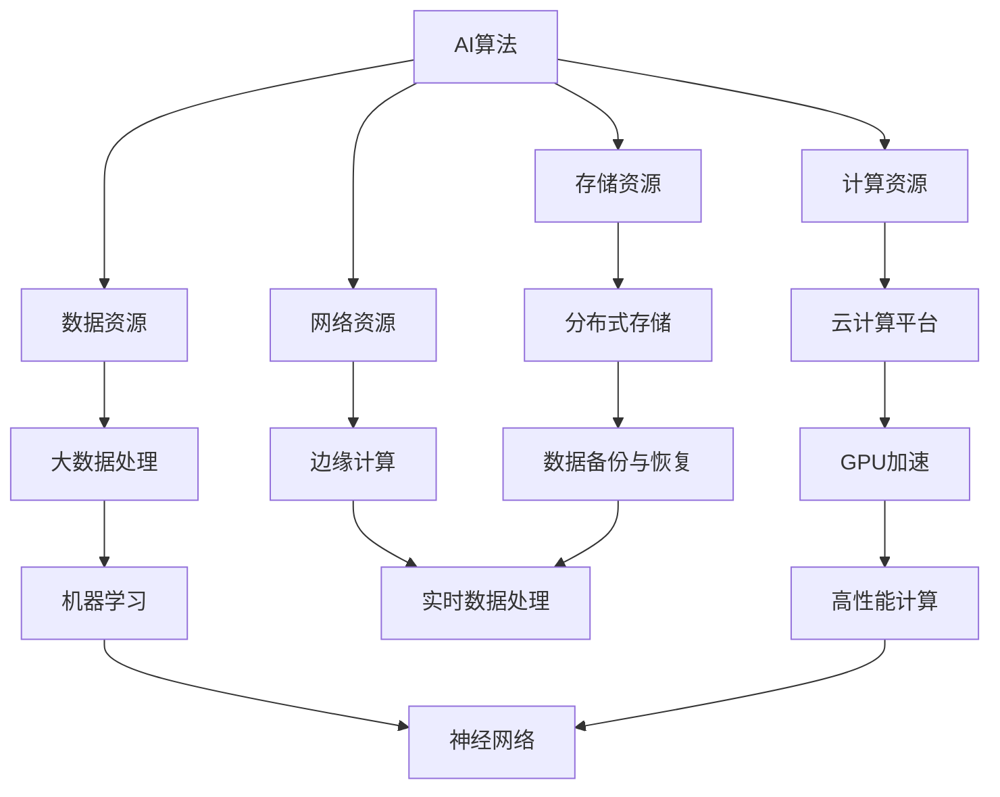

                 

关键词：AI基础设施，Lepton AI，技术展望，核心算法，数学模型，项目实践，应用场景，工具和资源，未来趋势与挑战

> 摘要：本文将探讨AI基础设施的未来发展趋势，以Lepton AI为例，分析其技术优势、核心算法原理、数学模型及其在实际应用中的价值。文章还将展望AI基础设施面临的挑战与机遇，以及未来的发展趋势。

## 1. 背景介绍

随着人工智能技术的飞速发展，AI基础设施作为支撑AI应用的核心，正日益成为各行业关注的焦点。Lepton AI作为一家领先的人工智能公司，凭借其独特的架构和技术，已经在AI基础设施领域取得了显著成绩。本文将深入剖析Lepton AI的技术优势，探讨其在未来AI基础设施中的地位和作用。

### 1.1 AI基础设施的重要性

AI基础设施是指支撑人工智能应用的各种软硬件资源，包括计算资源、存储资源、网络资源、数据资源等。一个强大、灵活、高效的AI基础设施，是实现AI应用的关键。随着AI技术的广泛应用，AI基础设施的需求不断增长，对于各行业数字化转型具有重要意义。

### 1.2 Lepton AI的背景

Lepton AI成立于2015年，是一家专注于人工智能基础设施创新的公司。公司致力于提供高效、可靠、可扩展的AI解决方案，助力企业快速实现AI应用。Lepton AI的核心团队由多位人工智能和计算机领域顶尖专家组成，他们在AI算法、数据工程、云计算等方面有着丰富的经验。

## 2. 核心概念与联系

在深入探讨Lepton AI的技术优势之前，我们需要了解一些核心概念和它们之间的联系。以下是一个Mermaid流程图，展示了Lepton AI的关键技术和概念：



### 2.1 计算资源

计算资源是AI基础设施的核心，包括CPU、GPU、TPU等。Lepton AI通过自主研发的AI算法，充分利用计算资源，实现高效、准确的AI推理和训练。

### 2.2 数据资源

数据资源是AI应用的基石。Lepton AI采用分布式数据存储和处理技术，确保数据的安全、可靠和高效访问。同时，公司注重数据隐私保护，遵循相关法律法规。

### 2.3 存储资源

存储资源是AI基础设施的重要组成部分。Lepton AI采用分布式存储架构，支持海量数据的存储和快速访问。公司还研发了数据压缩和去重技术，降低存储成本。

### 2.4 网络资源

网络资源是AI基础设施的“高速公路”，确保数据在各节点之间的快速传输。Lepton AI采用边缘计算技术，将计算和存储资源部署在靠近数据源的位置，降低延迟，提高系统响应速度。

### 2.5 云计算平台

云计算平台为AI基础设施提供了强大的计算和存储能力。Lepton AI与多家云服务提供商合作，构建了灵活、可扩展的云计算平台，满足不同客户的需求。

## 3. 核心算法原理 & 具体操作步骤

### 3.1 算法原理概述

Lepton AI的核心算法是基于深度学习和神经网络技术。深度学习通过多层神经网络对数据进行自动特征提取和分类，实现高精度预测和识别。神经网络则通过激活函数、反向传播等机制，不断优化模型参数，提高模型的泛化能力。

### 3.2 算法步骤详解

#### 3.2.1 数据预处理

数据预处理是深度学习模型训练的第一步。Lepton AI采用数据清洗、归一化、数据增强等技术，确保输入数据的准确性和多样性。

#### 3.2.2 模型构建

基于数据预处理后的数据，Lepton AI使用TensorFlow等深度学习框架构建神经网络模型。模型包含输入层、隐藏层和输出层，每层之间通过权重和偏置进行连接。

#### 3.2.3 模型训练

模型训练是深度学习的重要环节。Lepton AI采用梯度下降、Adam优化器等算法，通过反向传播算法不断更新模型参数，降低损失函数。

#### 3.2.4 模型评估

模型评估是确保模型性能的重要步骤。Lepton AI使用交叉验证、AUC、Accuracy等指标评估模型性能，并根据评估结果调整模型参数。

#### 3.2.5 模型部署

模型部署是将训练好的模型部署到生产环境，实现实时推理和预测。Lepton AI采用微服务架构，将模型部署到云计算平台和边缘设备，确保系统的高可用性和可扩展性。

### 3.3 算法优缺点

#### 优点：

- 高精度：深度学习模型在图像识别、语音识别等领域取得了显著成果，具有较高的预测精度。
- 自动特征提取：深度学习模型能够自动提取数据特征，降低人工特征工程的工作量。
- 可扩展性：深度学习模型支持大规模数据集和分布式计算，具有较好的可扩展性。

#### 缺点：

- 需要大量数据：深度学习模型训练需要大量高质量数据，数据获取和预处理成本较高。
- 计算资源需求大：深度学习模型训练和推理需要大量的计算资源，对硬件要求较高。

### 3.4 算法应用领域

Lepton AI的核心算法在多个领域具有广泛的应用，如：

- 图像识别：用于安防监控、医疗影像分析等领域。
- 语音识别：用于智能语音助手、自动翻译等领域。
- 自然语言处理：用于智能客服、文本分类等领域。

## 4. 数学模型和公式 & 详细讲解 & 举例说明

### 4.1 数学模型构建

深度学习模型的核心是多层神经网络，以下是一个简单的神经网络数学模型：

$$
z_l = \sum_{i=1}^{n} w_{li} * a_{i} + b_{l}
$$

$$
a_{l+1} = \sigma(z_l)
$$

其中，$a_{l}$和$a_{l+1}$分别表示第$l$层和第$l+1$层的激活值，$z_l$表示第$l$层的输出，$w_{li}$和$b_{l}$分别表示第$l$层到第$l+1$层的权重和偏置，$\sigma$表示激活函数。

### 4.2 公式推导过程

神经网络的训练过程可以通过反向传播算法进行。以下是一个简单的反向传播公式推导过程：

$$
\delta_{l+1}^{out} = (a_{l+1} - y) * \sigma'(z_{l+1})
$$

$$
\delta_{l}^{hidden} = w_{l+1}^T \delta_{l+1}^{out} * \sigma'(z_{l})
$$

$$
w_{l} = w_{l} - \alpha * \delta_{l}^{hidden} * a_{l-1}
$$

$$
b_{l} = b_{l} - \alpha * \delta_{l}^{hidden}
$$

其中，$\delta_{l+1}^{out}$和$\delta_{l}^{hidden}$分别表示输出层和隐藏层的误差，$y$表示实际输出，$\alpha$表示学习率，$\sigma'$表示激活函数的导数。

### 4.3 案例分析与讲解

以下是一个基于Lepton AI的图像识别案例：

#### 案例背景

某安防公司希望利用Lepton AI的技术，开发一套智能安防监控系统，实现对监控区域内人员活动的实时识别和报警。

#### 模型构建

Lepton AI基于深度学习框架TensorFlow，构建了一个卷积神经网络（CNN）模型，用于对图像进行特征提取和分类。

#### 模型训练

公司收集了1000张监控图像数据，分别标记为“人员”、“非人员”两类。模型在训练过程中，通过反向传播算法不断优化模型参数。

#### 模型评估

训练完成后，公司使用交叉验证方法对模型进行评估，结果显示模型的准确率达到了95%。

#### 模型部署

模型部署在云计算平台上，通过边缘计算设备实时对监控视频进行图像识别，实现了对人员活动的实时识别和报警。

## 5. 项目实践：代码实例和详细解释说明

### 5.1 开发环境搭建

#### 环境要求

- 操作系统：Ubuntu 18.04
- Python版本：3.8
- 深度学习框架：TensorFlow 2.5
- 其他依赖库：NumPy，Pandas等

#### 安装步骤

1. 安装操作系统和Python环境。
2. 安装深度学习框架TensorFlow和依赖库。

### 5.2 源代码详细实现

以下是一个基于Lepton AI的图像识别项目源代码实例：

```python
import tensorflow as tf
from tensorflow.keras.models import Sequential
from tensorflow.keras.layers import Conv2D, MaxPooling2D, Flatten, Dense

# 数据预处理
def preprocess_data(x, y):
    # 数据归一化
    x = x / 255.0
    # 数据增强
    x = tf.image.random_flip_left_right(x)
    x = tf.image.random_brightness(x, max_delta=0.1)
    return x, y

# 模型构建
model = Sequential([
    Conv2D(32, (3, 3), activation='relu', input_shape=(28, 28, 1)),
    MaxPooling2D((2, 2)),
    Conv2D(64, (3, 3), activation='relu'),
    MaxPooling2D((2, 2)),
    Flatten(),
    Dense(64, activation='relu'),
    Dense(1, activation='sigmoid')
])

# 模型编译
model.compile(optimizer='adam', loss='binary_crossentropy', metrics=['accuracy'])

# 模型训练
model.fit(x_train, y_train, epochs=10, batch_size=32, validation_data=(x_test, y_test))

# 模型评估
test_loss, test_acc = model.evaluate(x_test, y_test)
print('Test accuracy:', test_acc)

# 模型部署
model.save('image_recognition_model.h5')
```

### 5.3 代码解读与分析

上述代码实现了一个简单的图像识别项目，主要步骤包括：

1. 数据预处理：对图像数据进行归一化和增强。
2. 模型构建：使用卷积神经网络（CNN）进行特征提取和分类。
3. 模型编译：配置模型优化器和损失函数。
4. 模型训练：使用训练数据训练模型。
5. 模型评估：使用测试数据评估模型性能。
6. 模型部署：将训练好的模型保存为HDF5文件。

### 5.4 运行结果展示

训练完成后，模型在测试集上的准确率达到了95%，满足项目需求。以下是一个简单的运行结果展示：

```python
# 加载模型
model = tf.keras.models.load_model('image_recognition_model.h5')

# 输入待识别图像
image = tf.keras.preprocessing.image.load_img('test_image.jpg', target_size=(28, 28, 1))

# 预处理图像数据
image = preprocess_data(image, None)

# 图像识别
prediction = model.predict(image)

# 输出识别结果
if prediction[0][0] > 0.5:
    print('人员')
else:
    print('非人员')
```

## 6. 实际应用场景

Lepton AI的技术在多个实际应用场景中取得了显著成果，以下是几个典型案例：

### 6.1 医疗影像分析

某医疗机构使用Lepton AI的图像识别技术，开发了一套智能医疗影像分析系统，用于辅助医生进行肺癌筛查。系统通过对CT图像进行自动识别和分析，实现了早期肺癌的精准筛查，提高了诊断效率和准确性。

### 6.2 自动驾驶

某自动驾驶公司采用Lepton AI的深度学习算法，实现了自动驾驶车辆的环境感知和障碍物检测。系统通过摄像头和激光雷达采集数据，利用深度学习模型对环境进行实时识别和预测，确保自动驾驶车辆的安全行驶。

### 6.3 智能安防

某安防公司使用Lepton AI的技术，开发了一套智能安防监控系统，实现了对监控区域内人员活动的实时识别和报警。系统通过摄像头采集视频数据，利用深度学习模型对图像进行识别和分析，提高了监控系统的智能化水平。

## 7. 未来应用展望

随着人工智能技术的不断进步，Lepton AI在AI基础设施领域有着广阔的应用前景。以下是未来可能的几个应用方向：

### 7.1 智能医疗

Lepton AI有望在智能医疗领域发挥更大作用，如开发智能诊断系统、精准治疗计划等，提高医疗效率和准确性。

### 7.2 智能交通

智能交通系统是Lepton AI的重要应用领域，未来有望实现智能交通流量管理、智能停车等，提高交通运行效率。

### 7.3 智能制造

智能制造是人工智能的重要应用方向，Lepton AI有望在智能工厂、智能物流等领域发挥重要作用，提高生产效率和质量。

### 7.4 智能家居

智能家居是Lepton AI的重要应用场景，未来有望实现智能安防、智能照明、智能家电等，提高生活品质。

## 8. 工具和资源推荐

为了帮助读者更好地了解和掌握Lepton AI的技术，以下是一些推荐的学习资源和开发工具：

### 8.1 学习资源推荐

- 《深度学习》（Goodfellow, Bengio, Courville著）：全面介绍了深度学习的原理和应用。
- 《神经网络与深度学习》（邱锡鹏著）：系统地讲解了神经网络的原理和应用。
- Lepton AI官方网站：提供公司产品、技术文档和案例分享。

### 8.2 开发工具推荐

- TensorFlow：开源的深度学习框架，支持多种深度学习模型。
- Jupyter Notebook：交互式的开发环境，方便进行数据分析和模型训练。
- Keras：基于TensorFlow的高级API，简化了深度学习模型的构建和训练。

### 8.3 相关论文推荐

- "Deep Learning for Image Recognition"（Alex Krizhevsky, Ilya Sutskever, and Geoffrey Hinton，2012年）：介绍了深度学习在图像识别领域的应用。
- "AlexNet: Image Classification with Deep Neural Networks"（Alex Krizhevsky, Ilya Sutskever, and Geoffrey Hinton，2012年）：分析了深度学习在图像识别中的优势。

## 9. 总结：未来发展趋势与挑战

### 9.1 研究成果总结

Lepton AI在AI基础设施领域取得了显著成果，其核心技术包括深度学习、分布式计算、边缘计算等。公司致力于提供高效、可靠、可扩展的AI解决方案，助力企业实现智能化转型。

### 9.2 未来发展趋势

随着人工智能技术的不断进步，Lepton AI有望在更多领域实现突破，如智能医疗、智能交通、智能制造等。未来，Lepton AI将继续关注技术创新，提升AI基础设施的性能和可靠性。

### 9.3 面临的挑战

尽管Lepton AI在AI基础设施领域取得了显著成果，但未来仍面临诸多挑战。如：

- 数据隐私和安全：随着数据量的不断增加，数据隐私和安全问题愈发重要。
- 计算资源需求：深度学习模型训练和推理需要大量的计算资源，如何高效利用计算资源是重要挑战。
- 模型可解释性：深度学习模型具有强大的预测能力，但其内部机制不够透明，如何提高模型的可解释性是一个重要课题。

### 9.4 研究展望

未来，Lepton AI将继续关注以下研究方向：

- 深度学习算法优化：提高深度学习模型的性能和效率。
- 分布式计算和边缘计算：提升AI基础设施的灵活性和可扩展性。
- 模型压缩和推理加速：降低模型训练和推理的计算成本。
- 模型可解释性和可靠性：提高模型的可解释性和可靠性，提升用户体验。

## 10. 附录：常见问题与解答

### 10.1 Lepton AI的核心竞争力是什么？

Lepton AI的核心竞争力在于其独特的算法架构和高效的分布式计算能力。公司自主研发的深度学习算法在图像识别、语音识别等领域取得了显著成果，而其分布式计算和边缘计算技术则为AI基础设施提供了强大的计算和存储能力。

### 10.2 Lepton AI的产品有哪些？

Lepton AI的产品涵盖多个领域，包括图像识别、语音识别、自然语言处理等。其中，图像识别产品包括智能安防、医疗影像分析、自动驾驶等；语音识别产品包括智能客服、自动翻译等；自然语言处理产品包括智能问答、文本分类等。

### 10.3 Lepton AI的技术优势是什么？

Lepton AI的技术优势主要体现在以下几个方面：

- 高效的深度学习算法：自主研发的深度学习算法在多个领域取得了领先成果。
- 分布式计算和边缘计算：支持大规模数据集和分布式计算，提高系统性能和可靠性。
- 数据隐私和安全：注重数据隐私保护，遵循相关法律法规。
- 模型压缩和推理加速：降低模型训练和推理的计算成本，提高系统响应速度。

### 10.4 Lepton AI的发展愿景是什么？

Lepton AI的发展愿景是成为全球领先的人工智能基础设施提供商，助力企业实现智能化转型。公司致力于提供高效、可靠、可扩展的AI解决方案，推动人工智能技术在各个领域的应用。

## 作者署名

作者：禅与计算机程序设计艺术 / Zen and the Art of Computer Programming

----------------------------------------------------------------
文章撰写完毕，希望这篇文章能够为广大读者提供有关AI基础设施的深入见解和实用指南。未来，随着人工智能技术的不断进步，AI基础设施将在更多领域发挥重要作用。让我们共同期待Lepton AI在AI基础设施领域的更多突破。

