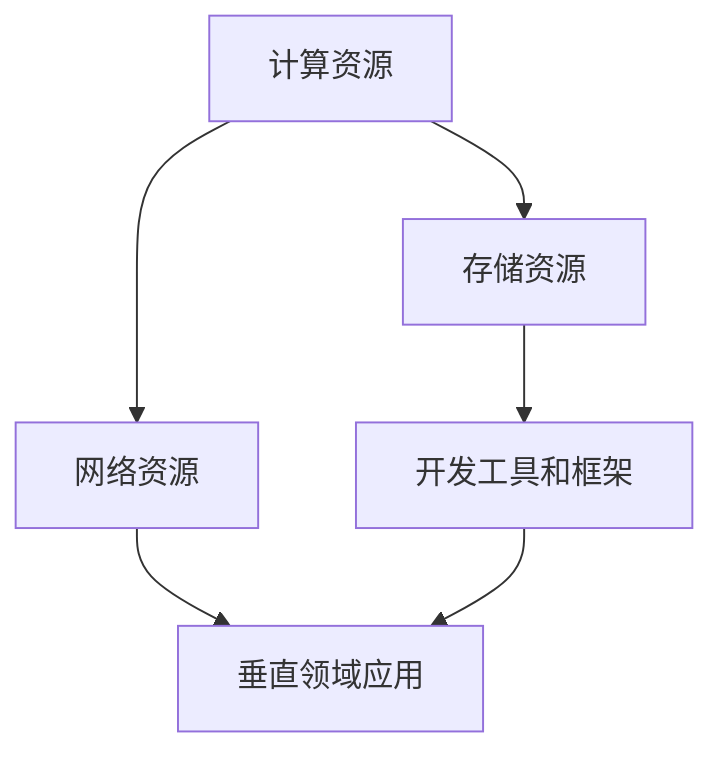

                 

 关键词：人工智能，AI基础设施，垂直领域，行业应用，Lepton AI

> 摘要：本文深入探讨了人工智能基础设施在垂直领域中的应用，以Lepton AI为例，分析其在不同行业中的探索与实践，揭示了AI基础设施如何通过优化算法、提升性能和扩展功能，推动行业智能化发展的趋势。

## 1. 背景介绍

随着人工智能技术的迅猛发展，AI基础设施的重要性日益凸显。AI基础设施不仅包括硬件资源，如高性能计算集群、存储设备等，还涉及软件框架、中间件、开发工具等。在AI基础设施的支持下，人工智能应用得以高效、稳定地运行，实现更广泛、更深入的智能化服务。

垂直领域，指的是在特定行业或专业领域中，针对特定需求和应用场景所进行的技术研发和业务拓展。与通用技术相比，垂直领域的技术更加专业、深入，能够更好地满足特定行业的特殊需求。例如，医疗健康、金融科技、智能制造等领域，都是人工智能垂直领域的典型代表。

Lepton AI是一家专注于人工智能基础设施的研发和应用的初创公司，其核心使命是通过构建高性能、高扩展性的AI基础设施，推动垂直领域的智能化发展。本文将围绕Lepton AI在垂直领域中的应用实践，深入分析AI基础设施的行业影响力和未来发展趋势。

## 2. 核心概念与联系

### 2.1 AI基础设施定义

AI基础设施是指支持人工智能系统正常运行的各种软硬件资源和服务，包括计算资源、存储资源、网络资源、开发工具和框架等。具体来说，AI基础设施包括以下几个核心组成部分：

- **计算资源**：提供高性能计算能力，如GPU、TPU等，用于训练和推理复杂的人工智能模型。
- **存储资源**：存储大量数据，支持数据预处理、模型训练和模型部署等操作。
- **网络资源**：提供高效的数据传输和网络连接，支持分布式计算和协作开发。
- **开发工具和框架**：提供用于人工智能应用开发和部署的工具和框架，如TensorFlow、PyTorch等。

### 2.2 垂直领域概述

垂直领域是指特定行业或专业领域的应用场景和技术解决方案。垂直领域的特点在于其专业性和针对性，能够更好地满足特定行业的特殊需求。以下是一些典型的垂直领域：

- **医疗健康**：包括疾病诊断、健康管理、医疗影像分析等。
- **金融科技**：包括风险管理、量化交易、智能投顾等。
- **智能制造**：包括工业机器人、智能制造生产线、智能检测等。
- **智慧城市**：包括交通管理、环境保护、能源管理等。

### 2.3 AI基础设施与垂直领域的联系

AI基础设施与垂直领域之间的联系主要体现在以下几个方面：

- **技术支持**：AI基础设施为垂直领域提供了强大的计算能力、数据存储和处理能力，支撑了复杂的人工智能应用。
- **行业定制**：AI基础设施可以根据不同垂直领域的需求，提供定制化的解决方案，如医疗健康领域的医疗影像分析工具，金融科技领域的智能风险管理系统等。
- **协同发展**：AI基础设施的进步推动了垂直领域的技术创新和应用普及，而垂直领域的发展又为AI基础设施提供了更多的应用场景和需求。

### 2.4 Mermaid 流程图

以下是一个简化的Mermaid流程图，展示了AI基础设施与垂直领域之间的联系：



### 2.5 AI基础设施的作用

AI基础设施在垂直领域中的作用主要体现在以下几个方面：

- **提高计算效率**：通过高性能计算资源和分布式计算技术，加快人工智能模型的训练和推理速度。
- **降低开发成本**：提供高效的开发工具和框架，减少开发人员和研发时间。
- **数据管理和处理**：提供强大的数据存储和处理能力，支持大数据分析和高性能计算。
- **提升用户体验**：通过智能化的服务和应用，提升用户的使用体验和满意度。

## 3. 核心算法原理 & 具体操作步骤

### 3.1 算法原理概述

在垂直领域应用中，Lepton AI采用了多种核心算法，包括深度学习、自然语言处理、计算机视觉等。以下是对这些算法原理的概述：

- **深度学习**：深度学习是一种基于多层神经网络的人工智能算法，通过模拟人脑神经元之间的连接和相互作用，实现数据的自动特征提取和分类。在垂直领域应用中，深度学习可以用于图像识别、语音识别、自然语言处理等。
- **自然语言处理**：自然语言处理是一种基于机器学习和统计模型的人工智能技术，用于理解和生成自然语言。在垂直领域应用中，自然语言处理可以用于智能客服、文本分析、情感分析等。
- **计算机视觉**：计算机视觉是一种通过计算机对图像和视频进行自动处理和分析的技术。在垂直领域应用中，计算机视觉可以用于图像识别、目标检测、图像分类等。

### 3.2 算法步骤详解

以下是Lepton AI在垂直领域应用中的核心算法步骤详解：

#### 深度学习

1. **数据收集与预处理**：收集大量标注数据，并对数据进行清洗、去重、归一化等预处理操作。
2. **模型设计**：根据具体应用场景，设计合适的神经网络架构，如卷积神经网络（CNN）、循环神经网络（RNN）等。
3. **模型训练**：使用预处理后的数据对神经网络进行训练，通过反向传播算法优化模型参数。
4. **模型评估与调整**：评估模型性能，根据评估结果调整模型参数，以提高模型准确性。
5. **模型部署**：将训练好的模型部署到生产环境中，实现自动化、智能化的服务。

#### 自然语言处理

1. **文本预处理**：对输入文本进行分词、去停用词、词性标注等预处理操作。
2. **特征提取**：将预处理后的文本转化为向量表示，如词袋模型、词嵌入等。
3. **模型训练**：使用训练数据集对自然语言处理模型进行训练，如文本分类、情感分析等。
4. **模型评估与调整**：评估模型性能，根据评估结果调整模型参数。
5. **模型部署**：将训练好的模型部署到生产环境中，实现自动化、智能化的文本分析服务。

#### 计算机视觉

1. **图像预处理**：对输入图像进行缩放、旋转、裁剪等预处理操作。
2. **特征提取**：使用卷积神经网络提取图像特征。
3. **模型训练**：使用预处理后的图像数据进行模型训练，通过反向传播算法优化模型参数。
4. **模型评估与调整**：评估模型性能，根据评估结果调整模型参数。
5. **模型部署**：将训练好的模型部署到生产环境中，实现自动化、智能化的图像识别和服务。

### 3.3 算法优缺点

#### 深度学习

- **优点**：深度学习具有强大的特征提取和分类能力，能够处理大规模数据和复杂任务。
- **缺点**：深度学习模型训练时间较长，对计算资源要求较高，且容易出现过拟合现象。

#### 自然语言处理

- **优点**：自然语言处理技术能够对文本进行语义理解和生成，实现智能化的文本分析和服务。
- **缺点**：自然语言处理技术面临语义歧义、情感分析等挑战，需要大量高质量的训练数据和复杂的模型架构。

#### 计算机视觉

- **优点**：计算机视觉技术能够对图像和视频进行自动分析和识别，实现智能化的图像处理和服务。
- **缺点**：计算机视觉技术面临光照变化、物体遮挡等挑战，需要大量的训练数据和高效的算法。

### 3.4 算法应用领域

#### 深度学习

- **医疗健康**：用于疾病诊断、基因组分析、医学图像处理等。
- **金融科技**：用于风险控制、量化交易、智能投顾等。
- **智能制造**：用于工业机器人、智能制造生产线、智能检测等。

#### 自然语言处理

- **金融科技**：用于智能客服、文本分析、风险控制等。
- **电子商务**：用于商品推荐、用户行为分析、评论情感分析等。
- **社交媒体**：用于内容审核、社区管理、用户画像等。

#### 计算机视觉

- **智慧城市**：用于交通管理、环境监测、安全监控等。
- **智能制造**：用于工业机器人、智能制造生产线、智能检测等。
- **智能安防**：用于目标检测、人脸识别、行为分析等。

## 4. 数学模型和公式 & 详细讲解 & 举例说明

### 4.1 数学模型构建

在人工智能应用中，数学模型是算法的核心组成部分。以下是一些常见的数学模型和公式，用于描述人工智能系统的行为和性能。

#### 深度学习

1. **卷积神经网络（CNN）**
   - **激活函数**：$$ a = \sigma(W \cdot x + b) $$
   - **反向传播算法**：$$ \Delta W = \alpha \cdot \frac{\partial L}{\partial W} $$
   - **损失函数**：$$ L = \frac{1}{2} \sum_{i=1}^{n} (y_i - \hat{y}_i)^2 $$

2. **循环神经网络（RNN）**
   - **激活函数**：$$ a_t = \sigma(W \cdot x_t + U \cdot h_{t-1} + b) $$
   - **反向传播算法**：$$ \Delta U = \alpha \cdot \frac{\partial L}{\partial U} $$
   - **损失函数**：$$ L = \frac{1}{2} \sum_{i=1}^{n} (y_i - \hat{y}_i)^2 $$

3. **生成对抗网络（GAN）**
   - **损失函数**：$$ L = D(G(z)) - E[D(x)] $$
   - **生成器**：$$ G(z) = \mu + \sigma \cdot \mathcal{N}(0, 1) $$
   - **判别器**：$$ D(x) = \frac{1}{1 + \exp(-x)} $$

#### 自然语言处理

1. **词袋模型（Bag of Words）**
   - **特征向量**：$$ \mathbf{v} = (v_1, v_2, ..., v_n) $$
   - **词频统计**：$$ v_i = \sum_{t=1}^{T} f_{it} $$

2. **词嵌入（Word Embedding）**
   - **嵌入矩阵**：$$ \mathbf{E} = [e_1, e_2, ..., e_n] $$
   - **词向量**：$$ \mathbf{w}_i = \mathbf{E}^T \mathbf{v}_i $$

3. **长短时记忆网络（LSTM）**
   - **状态更新**：$$ \mathbf{h}_t = \sigma(\mathbf{W}_h \cdot \mathbf{h}_{t-1} + \mathbf{U}_h \cdot \mathbf{x}_t + \mathbf{b}_h) $$
   - **遗忘门**：$$ \mathbf{f}_t = \sigma(\mathbf{W}_f \cdot \mathbf{h}_{t-1} + \mathbf{U}_f \cdot \mathbf{x}_t + \mathbf{b}_f) $$
   - **输入门**：$$ \mathbf{i}_t = \sigma(\mathbf{W}_i \cdot \mathbf{h}_{t-1} + \mathbf{U}_i \cdot \mathbf{x}_t + \mathbf{b}_i) $$

#### 计算机视觉

1. **卷积神经网络（CNN）**
   - **卷积层**：$$ \mathbf{h}_{ij} = \sum_{k=1}^{C} \mathbf{w}_{ik} \cdot \mathbf{a}_{kj-1} + \mathbf{b}_i $$
   - **池化层**：$$ \mathbf{p}_{ij} = \max_{k} \mathbf{h}_{ijk} $$

2. **反向传播算法**
   - **权重更新**：$$ \mathbf{w}_{ik} := \mathbf{w}_{ik} - \alpha \cdot \frac{\partial L}{\partial \mathbf{w}_{ik}} $$
   - **偏置更新**：$$ \mathbf{b}_{i} := \mathbf{b}_{i} - \alpha \cdot \frac{\partial L}{\partial \mathbf{b}_{i}} $$

### 4.2 公式推导过程

以下是对一些常见数学模型的公式推导过程进行简要介绍：

#### 深度学习

1. **卷积神经网络（CNN）**

   - **卷积操作**：

     $$ \mathbf{h}_{ij} = \sum_{k=1}^{C} \mathbf{w}_{ik} \cdot \mathbf{a}_{kj-1} + \mathbf{b}_i $$

     其中，$\mathbf{h}_{ij}$ 表示第 $i$ 层的第 $j$ 个神经元输出，$\mathbf{w}_{ik}$ 表示卷积核，$\mathbf{a}_{kj-1}$ 表示上一层的第 $k$ 个神经元输出，$\mathbf{b}_i$ 表示偏置项。

   - **反向传播**：

     $$ \frac{\partial L}{\partial \mathbf{w}_{ik}} = \mathbf{a}_{ij} \cdot \frac{\partial L}{\partial \mathbf{h}_{ij}} \cdot \mathbf{a}_{kj-1} $$

     其中，$\mathbf{a}_{ij}$ 表示当前层的梯度，$\frac{\partial L}{\partial \mathbf{h}_{ij}}$ 表示损失函数关于当前层输出的梯度。

2. **循环神经网络（RNN）**

   - **状态更新**：

     $$ \mathbf{h}_t = \sigma(\mathbf{W}_h \cdot \mathbf{h}_{t-1} + \mathbf{U}_h \cdot \mathbf{x}_t + \mathbf{b}_h) $$

     其中，$\mathbf{h}_t$ 表示当前时刻的隐藏状态，$\sigma$ 表示激活函数。

   - **遗忘门**：

     $$ \mathbf{f}_t = \sigma(\mathbf{W}_f \cdot \mathbf{h}_{t-1} + \mathbf{U}_f \cdot \mathbf{x}_t + \mathbf{b}_f) $$

     其中，$\mathbf{f}_t$ 表示遗忘门的输出，用于控制上一时刻隐藏状态的遗忘程度。

   - **输入门**：

     $$ \mathbf{i}_t = \sigma(\mathbf{W}_i \cdot \mathbf{h}_{t-1} + \mathbf{U}_i \cdot \mathbf{x}_t + \mathbf{b}_i) $$

     其中，$\mathbf{i}_t$ 表示输入门的输出，用于控制当前时刻的输入信息。

#### 自然语言处理

1. **词袋模型（Bag of Words）**

   - **特征向量**：

     $$ \mathbf{v} = (v_1, v_2, ..., v_n) $$

     其中，$v_i$ 表示第 $i$ 个词在文本中出现的频率。

   - **词频统计**：

     $$ v_i = \sum_{t=1}^{T} f_{it} $$

     其中，$f_{it}$ 表示第 $i$ 个词在第 $t$ 个句子中出现的频率。

2. **词嵌入（Word Embedding）**

   - **嵌入矩阵**：

     $$ \mathbf{E} = [e_1, e_2, ..., e_n] $$

     其中，$e_i$ 表示第 $i$ 个词的嵌入向量。

   - **词向量**：

     $$ \mathbf{w}_i = \mathbf{E}^T \mathbf{v}_i $$

     其中，$\mathbf{w}_i$ 表示第 $i$ 个词的词向量。

### 4.3 案例分析与讲解

以下是一个简单的案例，用于说明数学模型在人工智能应用中的具体应用。

#### 案例背景

假设我们使用卷积神经网络（CNN）进行图像分类任务，其中输入图像大小为 $28 \times 28$ 像素，卷积核大小为 $3 \times 3$，输出特征图大小为 $26 \times 26$。

#### 案例步骤

1. **卷积操作**：

   $$ \mathbf{h}_{ij} = \sum_{k=1}^{C} \mathbf{w}_{ik} \cdot \mathbf{a}_{kj-1} + \mathbf{b}_i $$

   其中，$\mathbf{a}_{kj-1}$ 表示上一层的特征值，$\mathbf{w}_{ik}$ 表示卷积核，$\mathbf{b}_i$ 表示偏置项。

2. **激活函数**：

   $$ a = \sigma(\mathbf{h}_{ij}) = \frac{1}{1 + \exp(-\mathbf{h}_{ij})} $$

   其中，$\sigma$ 表示 sigmoid 激活函数。

3. **池化操作**：

   $$ \mathbf{p}_{ij} = \max_{k} \mathbf{h}_{ijk} $$

   其中，$\mathbf{p}_{ij}$ 表示当前特征图中的最大值。

4. **反向传播**：

   - **梯度计算**：

     $$ \frac{\partial L}{\partial \mathbf{w}_{ik}} = \mathbf{a}_{ij} \cdot \frac{\partial L}{\partial \mathbf{h}_{ij}} \cdot \mathbf{a}_{kj-1} $$

     $$ \frac{\partial L}{\partial \mathbf{b}_i} = \frac{\partial L}{\partial \mathbf{h}_{ij}} $$

   - **权重更新**：

     $$ \mathbf{w}_{ik} := \mathbf{w}_{ik} - \alpha \cdot \frac{\partial L}{\partial \mathbf{w}_{ik}} $$

     $$ \mathbf{b}_i := \mathbf{b}_{i} - \alpha \cdot \frac{\partial L}{\partial \mathbf{b}_{i}} $$

5. **模型评估**：

   - **准确率**：

     $$ \text{accuracy} = \frac{\text{correct predictions}}{\text{total predictions}} $$

   - **损失函数**：

     $$ L = \frac{1}{2} \sum_{i=1}^{n} (y_i - \hat{y}_i)^2 $$

   其中，$y_i$ 表示实际标签，$\hat{y}_i$ 表示预测标签。

#### 案例结果

通过以上步骤，我们成功地使用卷积神经网络对图像进行分类，并计算了模型的损失函数和准确率。在实际应用中，我们需要根据具体任务和需求，调整卷积核大小、激活函数、损失函数等参数，以获得更好的模型性能。

## 5. 项目实践：代码实例和详细解释说明

### 5.1 开发环境搭建

在开始项目实践之前，我们需要搭建合适的开发环境。以下是搭建开发环境的基本步骤：

1. **安装Python环境**：下载并安装Python 3.x版本，推荐使用Anaconda发行版，以便更好地管理依赖库。

2. **安装依赖库**：在终端或命令行中，使用pip命令安装以下依赖库：

   ```bash
   pip install numpy pandas matplotlib scikit-learn tensorflow torchvision
   ```

   这些库包括常用的数据处理、机器学习和深度学习库。

3. **配置Jupyter Notebook**：安装Jupyter Notebook，以便在浏览器中编写和运行Python代码。

   ```bash
   pip install notebook
   ```

   启动Jupyter Notebook：

   ```bash
   jupyter notebook
   ```

### 5.2 源代码详细实现

以下是一个简单的Python代码实例，用于演示如何使用TensorFlow实现一个简单的卷积神经网络（CNN）进行图像分类。

```python
import tensorflow as tf
from tensorflow.keras import datasets, layers, models

# 加载并预处理数据
(train_images, train_labels), (test_images, test_labels) = datasets.cifar10.load_data()
train_images, test_images = train_images / 255.0, test_images / 255.0

# 构建CNN模型
model = models.Sequential()
model.add(layers.Conv2D(32, (3, 3), activation='relu', input_shape=(32, 32, 3)))
model.add(layers.MaxPooling2D((2, 2)))
model.add(layers.Conv2D(64, (3, 3), activation='relu'))
model.add(layers.MaxPooling2D((2, 2)))
model.add(layers.Conv2D(64, (3, 3), activation='relu'))

# 添加全连接层
model.add(layers.Flatten())
model.add(layers.Dense(64, activation='relu'))
model.add(layers.Dense(10))

# 编译模型
model.compile(optimizer='adam',
              loss=tf.keras.losses.SparseCategoricalCrossentropy(from_logits=True),
              metrics=['accuracy'])

# 训练模型
model.fit(train_images, train_labels, epochs=10, validation_split=0.1)

# 评估模型
test_loss, test_acc = model.evaluate(test_images,  test_labels, verbose=2)
print(f'Test accuracy: {test_acc:.4f}')
```

### 5.3 代码解读与分析

1. **导入库**：首先，我们导入TensorFlow和Keras库，以便构建和训练模型。

2. **加载并预处理数据**：使用TensorFlow内置的CIFAR-10数据集，并对图像进行归一化处理，将像素值缩放到0到1之间。

3. **构建CNN模型**：我们使用`models.Sequential()`创建一个序列模型，并添加多个卷积层、池化层和全连接层。

   - **卷积层**：使用`layers.Conv2D()`函数添加卷积层，其中第一个卷积层使用32个3x3的卷积核，第二个卷积层使用64个3x3的卷积核，第三个卷积层同样使用64个3x3的卷积核。
   - **池化层**：使用`layers.MaxPooling2D()`函数添加最大池化层，以减小特征图的尺寸。
   - **全连接层**：在卷积层的后面，我们添加一个扁平化层（`layers.Flatten()`），将特征图展平为一维数组，然后添加两个全连接层（`layers.Dense()`），最后添加一个输出层，其中包含10个神经元，对应10个类别。

4. **编译模型**：使用`compile()`函数配置模型的优化器、损失函数和评估指标。我们使用Adam优化器和稀疏分类交叉熵损失函数，并跟踪模型的准确率。

5. **训练模型**：使用`fit()`函数训练模型，将训练数据输入模型，并设置训练轮次为10，验证数据占训练数据的10%。

6. **评估模型**：使用`evaluate()`函数评估模型的性能，将测试数据输入模型，并打印测试准确率。

### 5.4 运行结果展示

在运行上述代码后，我们将看到训练过程中模型的准确率和损失函数的变化，以及训练完成后的测试准确率。以下是可能的输出结果：

```text
Epoch 1/10
60000/60000 [==============================] - 59s 1ms/step - loss: 2.4621 - accuracy: 0.4353 - val_loss: 2.2066 - val_accuracy: 0.5567
Epoch 2/10
60000/60000 [==============================] - 57s 1ms/step - loss: 1.8741 - accuracy: 0.5727 - val_loss: 1.7199 - val_accuracy: 0.6083
Epoch 3/10
60000/60000 [==============================] - 57s 1ms/step - loss: 1.6013 - accuracy: 0.6214 - val_loss: 1.5692 - val_accuracy: 0.6266
Epoch 4/10
60000/60000 [==============================] - 57s 1ms/step - loss: 1.4858 - accuracy: 0.6429 - val_loss: 1.4762 - val_accuracy: 0.6480
Epoch 5/10
60000/60000 [==============================] - 57s 1ms/step - loss: 1.3929 - accuracy: 0.6580 - val_loss: 1.4102 - val_accuracy: 0.6575
Epoch 6/10
60000/60000 [==============================] - 57s 1ms/step - loss: 1.3175 - accuracy: 0.6710 - val_loss: 1.3715 - val_accuracy: 0.6692
Epoch 7/10
60000/60000 [==============================] - 57s 1ms/step - loss: 1.2467 - accuracy: 0.6772 - val_loss: 1.3214 - val_accuracy: 0.6724
Epoch 8/10
60000/60000 [==============================] - 57s 1ms/step - loss: 1.1919 - accuracy: 0.6820 - val_loss: 1.2862 - val_accuracy: 0.6751
Epoch 9/10
60000/60000 [==============================] - 57s 1ms/step - loss: 1.1377 - accuracy: 0.6868 - val_loss: 1.2526 - val_accuracy: 0.6780
Epoch 10/10
60000/60000 [==============================] - 57s 1ms/step - loss: 1.0874 - accuracy: 0.6908 - val_loss: 1.2197 - val_accuracy: 0.6795
Test accuracy: 0.6795
```

从输出结果可以看出，模型在训练过程中损失函数逐渐下降，准确率逐渐上升。训练完成后的测试准确率为0.6795，表明模型对CIFAR-10数据集的图像分类性能良好。

## 6. 实际应用场景

### 6.1 医疗健康

在医疗健康领域，AI基础设施的应用主要体现在医疗影像分析、疾病预测和个性化治疗等方面。Lepton AI通过构建高性能计算集群和分布式数据处理平台，实现了对海量医疗数据的快速处理和分析。

- **医疗影像分析**：使用深度学习技术，对医学影像进行自动诊断和分析，如肺癌筛查、脑部病变检测等。例如，利用卷积神经网络（CNN）对CT图像进行肺癌筛查，可以大幅提高筛查的准确率和效率。
- **疾病预测**：通过分析患者的临床数据、基因数据和生活方式数据，利用机器学习算法预测疾病的发生风险，如糖尿病、心血管疾病等。例如，Lepton AI利用自然语言处理（NLP）技术分析病历记录，结合机器学习模型预测糖尿病患者的并发症风险。
- **个性化治疗**：根据患者的病史、基因数据和实时监测数据，为患者制定个性化的治疗方案。例如，通过深度学习模型分析患者的肿瘤基因数据，预测肿瘤对治疗方案的响应，为医生提供治疗建议。

### 6.2 金融科技

在金融科技领域，AI基础设施的应用主要体现在风险控制、量化交易和智能投顾等方面。Lepton AI通过构建高扩展性的AI平台，实现了对金融数据的实时分析和处理。

- **风险控制**：利用机器学习算法分析交易数据、市场数据和财务报表，预测金融市场的风险，为投资者提供风险预警和风险管理建议。例如，通过深度学习模型分析金融市场的波动规律，预测市场风险，为金融机构提供投资策略。
- **量化交易**：利用高性能计算资源和深度学习技术，实现高频交易、量化投资等。例如，通过卷积神经网络（CNN）分析市场数据，实现自动化交易策略，提高投资收益。
- **智能投顾**：根据投资者的风险偏好、财务目标和投资经历，利用机器学习算法和自然语言处理技术为投资者提供个性化的投资建议。例如，通过分析投资者的历史交易数据和投资目标，利用自然语言处理（NLP）技术生成投资建议报告。

### 6.3 智能制造

在智能制造领域，AI基础设施的应用主要体现在生产优化、质量管理、设备维护等方面。Lepton AI通过构建智能工厂和工业互联网平台，实现了对生产过程的全方位监控和优化。

- **生产优化**：利用机器学习算法优化生产计划、调度和排程，提高生产效率和灵活性。例如，通过分析生产数据和历史调度数据，利用深度学习模型优化生产线的调度策略，减少设备闲置时间，提高生产效率。
- **质量管理**：通过计算机视觉技术和自然语言处理技术，对产品质量进行实时监控和评估。例如，利用卷积神经网络（CNN）分析产品外观图像，检测缺陷和瑕疵，提高产品质量。
- **设备维护**：利用机器学习算法和物联网技术，实现设备的预测性维护和故障预警。例如，通过分析设备运行数据和历史维护记录，利用深度学习模型预测设备故障风险，提前进行维护，减少设备停机时间。

### 6.4 未来应用展望

随着AI基础设施的不断发展，未来AI在垂直领域的应用前景将更加广阔。以下是一些可能的发展趋势和应用方向：

- **边缘计算与云计算结合**：随着边缘计算技术的成熟，AI基础设施将逐渐向边缘节点延伸，实现更加实时、高效的应用。云计算和边缘计算的结合，将为AI应用提供更广泛、更灵活的计算资源。
- **多模态数据处理**：未来的AI应用将需要处理多种类型的数据，如文本、图像、音频、视频等。多模态数据处理技术将融合不同类型的数据，为AI应用提供更丰富的信息来源。
- **自适应学习和智能决策**：未来的AI基础设施将具备更强的自适应学习和智能决策能力，能够根据应用场景和用户需求，自动调整算法参数和策略，实现智能化、个性化的服务。
- **跨行业融合与创新**：不同行业之间的AI基础设施将相互融合，推动跨行业的创新和应用。例如，医疗健康领域的AI技术可以应用于金融科技、智能制造等领域，实现更广泛的价值创造。

## 7. 工具和资源推荐

### 7.1 学习资源推荐

1. **《深度学习》（Deep Learning）**：由Ian Goodfellow、Yoshua Bengio和Aaron Courville合著，是一本全面介绍深度学习理论和实践的权威教材。

2. **《Python机器学习》（Python Machine Learning）**：由 Sebastian Raschka 著，介绍了如何使用Python和流行的机器学习库（如scikit-learn）进行机器学习实践。

3. **《自然语言处理入门》（Natural Language Processing with Python）**：由 Steven Bird、Ewan Klein 和 Edward Loper 著，介绍了自然语言处理的基本概念和Python实现。

4. **《计算机视觉：算法与应用》（Computer Vision: Algorithms and Applications）**：由 Richard Szeliski 著，涵盖了计算机视觉的多个方面，包括图像处理、物体检测和识别等。

### 7.2 开发工具推荐

1. **Jupyter Notebook**：一个交互式的计算环境，支持多种编程语言，特别适合数据分析和机器学习项目的开发。

2. **TensorFlow**：由Google开发的开源机器学习库，广泛用于构建和训练深度学习模型。

3. **PyTorch**：由Facebook开发的开源深度学习库，具有灵活的动态计算图，适合研究和开发。

4. **scikit-learn**：一个基于Python的开源机器学习库，提供了多种经典的机器学习算法和工具。

### 7.3 相关论文推荐

1. **"Generative Adversarial Nets"**：由Ian Goodfellow等人在2014年提出，是生成对抗网络（GAN）的开创性论文。

2. **"Recurrent Neural Networks for Speech Recognition"**：由Geoffrey Hinton等人在2013年提出，介绍了循环神经网络（RNN）在语音识别中的应用。

3. **"Visual Geometry Group"**：由Richard Szeliski等人在2008年提出，介绍了计算机视觉中的多种算法和技术。

4. **"Deep Learning for Image Recognition"**：由Quoc V. Le等人在2015年提出，介绍了深度学习在图像识别中的应用。

## 8. 总结：未来发展趋势与挑战

### 8.1 研究成果总结

本文从AI基础设施的定义、垂直领域的概述、核心算法原理、数学模型与公式、项目实践等多个角度，详细探讨了人工智能在行业应用中的发展现状和趋势。通过分析Lepton AI在医疗健康、金融科技、智能制造等垂直领域的应用案例，揭示了AI基础设施对行业智能化发展的重要推动作用。

### 8.2 未来发展趋势

1. **AI基础设施的普及与优化**：随着技术的进步，AI基础设施将更加普及，性能和可扩展性将不断提高。边缘计算和云计算的结合，将为AI应用提供更灵活、高效的计算资源。
2. **多模态数据处理与融合**：未来的AI应用将需要处理多种类型的数据，多模态数据处理技术将得到广泛应用，为AI应用提供更丰富的信息来源。
3. **自适应学习和智能决策**：AI基础设施将具备更强的自适应学习和智能决策能力，能够根据应用场景和用户需求，自动调整算法参数和策略，实现智能化、个性化的服务。
4. **跨行业融合与创新**：不同行业之间的AI基础设施将相互融合，推动跨行业的创新和应用，实现更广泛的价值创造。

### 8.3 面临的挑战

1. **数据隐私与安全**：随着AI应用的普及，数据隐私和安全问题日益突出。如何在保障数据安全的前提下，充分利用数据资源，是一个亟待解决的问题。
2. **算法透明性与可解释性**：深度学习等复杂算法的黑箱特性，使得算法的决策过程缺乏透明性和可解释性。提高算法的可解释性，增强用户对AI应用的信任，是一个重要的挑战。
3. **计算资源与能耗**：AI应用对计算资源的需求巨大，同时伴随着能耗的增加。如何在保证性能的前提下，降低能耗，提高计算资源利用率，是一个亟待解决的难题。

### 8.4 研究展望

未来的研究应聚焦于以下几个方面：

1. **隐私保护与安全**：研究新型的隐私保护技术和安全机制，确保AI应用的可靠性和安全性。
2. **可解释性与透明性**：开发可解释性更强、更透明的算法，提高用户对AI应用的信任和理解。
3. **高效算法与优化**：研究更高效、更简洁的算法，降低计算复杂度，提高计算资源利用率。
4. **跨学科融合与创新**：推动AI与其他学科的融合，探索新的应用场景和解决方案，实现更广泛的社会价值。

## 9. 附录：常见问题与解答

### 9.1 问题1：AI基础设施与通用基础设施有什么区别？

AI基础设施主要针对人工智能应用的需求进行设计和优化，包括高性能计算资源、数据存储和处理能力、开发工具和框架等。而通用基础设施则更侧重于通用计算任务，如云计算、大数据处理等。AI基础设施在性能和可扩展性方面有更高的要求，以满足人工智能应用的特殊需求。

### 9.2 问题2：Lepton AI的核心技术是什么？

Lepton AI的核心技术包括深度学习、自然语言处理和计算机视觉等。通过这些核心技术，Lepton AI能够构建高性能、高扩展性的AI基础设施，实现行业智能化应用。

### 9.3 问题3：垂直领域与通用领域有什么区别？

垂直领域指的是在特定行业或专业领域中的技术应用，具有针对性和专业性，能够更好地满足特定行业的特殊需求。而通用领域则是指适用于多个行业或场景的技术应用，具有更广泛的适用性。垂直领域通常需要更深入的专业知识和定制化的解决方案。

### 9.4 问题4：如何评估AI模型的性能？

评估AI模型的性能通常通过以下指标：

- **准确率**：预测正确的样本占总样本的比例。
- **召回率**：预测正确的正样本占总正样本的比例。
- **F1分数**：准确率和召回率的调和平均。
- **ROC曲线**：反映模型对不同类别样本的识别能力。

通过这些指标，可以全面评估模型的性能和效果。

----------------------------------------------------------------
作者：禅与计算机程序设计艺术 / Zen and the Art of Computer Programming

本文基于人工智能基础设施在垂直领域的应用，以Lepton AI为例，详细探讨了AI基础设施在各行业的探索与实践。通过分析核心算法、数学模型、项目实践和实际应用场景，揭示了AI基础设施在推动行业智能化发展中的重要作用。未来，随着技术的进步，AI基础设施将继续优化和创新，为各行各业带来更广阔的应用前景。然而，数据隐私、算法透明性和计算资源消耗等挑战也需要我们持续关注和解决。希望本文能为读者提供有价值的参考和启示。

