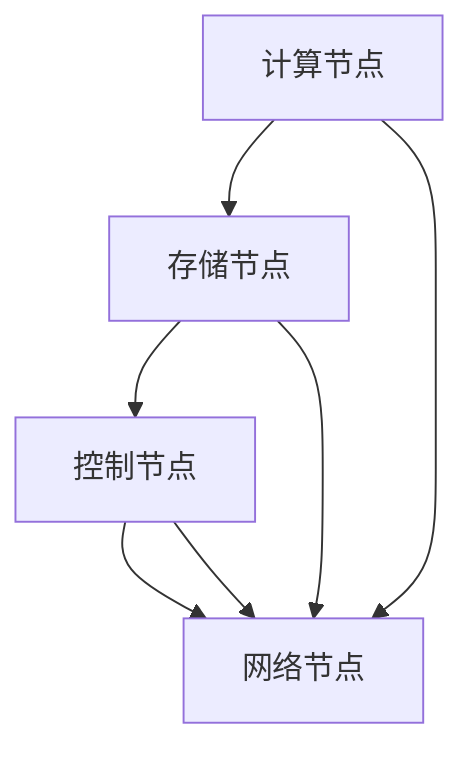

                 

 > **关键词**：AI基础设施、高可用性、容错设计、Lepton AI、算法原理、数学模型、应用实践、未来展望。

> **摘要**：本文旨在探讨AI基础设施的高可用性设计，以Lepton AI的容错设计为例，深入解析其在保证系统稳定性和性能方面的关键技术和实现方法。文章首先介绍了AI基础设施的背景和重要性，随后详细阐述了Lepton AI的架构及其容错机制。在此基础上，文章探讨了核心算法原理、数学模型以及具体的应用实践。最后，文章展望了AI基础设施未来发展的趋势与挑战。

## 1. 背景介绍

在当今的数字化时代，人工智能（AI）已经成为了推动社会进步的重要力量。从自动驾驶到智能语音助手，从医疗诊断到金融预测，AI的应用无处不在。然而，AI系统的复杂性和对实时性的高要求，使得其基础设施的可靠性成为了亟待解决的问题。高可用性（High Availability，HA）设计便是为了解决这一问题而诞生的。

高可用性设计的目标是确保系统在面临各种故障和异常情况下，能够快速恢复并继续正常运行，从而最大限度地减少系统的停机时间和潜在损失。在AI基础设施中，高可用性设计尤为重要，因为AI系统的运算通常具有不可逆转性，一旦系统崩溃，可能会导致严重的数据丢失和业务中断。

Lepton AI是一款广泛应用于工业、金融和医疗等领域的AI系统。其核心价值在于其高度的可扩展性和高可用性设计，使得Lepton AI能够在高负载和复杂环境下保持稳定的运行。本文将深入探讨Lepton AI的容错设计，分析其实现原理和具体技术手段。

### 1.1 AI基础设施的演变

AI基础设施的演变可以分为三个阶段：初期阶段、成长阶段和成熟阶段。

在初期阶段，AI基础设施主要集中在单个服务器或集群上，以硬件的升级和优化为主要手段来提升性能和可靠性。然而，这种设计在面临大规模分布式环境时，显得力不从心。

进入成长阶段，分布式系统和云计算的兴起，使得AI基础设施开始向分布式、弹性化方向发展。通过分布式计算和存储，AI系统能够更好地应对海量数据和复杂任务。

成熟阶段，AI基础设施开始关注高可用性设计。除了分布式系统和云计算，高可用性设计还涉及到容错机制、负载均衡、数据备份和恢复等技术手段。这些技术的融合，使得AI基础设施能够在各种极端情况下保持稳定运行。

### 1.2 高可用性的定义和重要性

高可用性（High Availability，HA）指的是系统在长时间内保持正常运行的能力。具体来说，高可用性设计的目标是确保系统在遇到故障或异常时，能够快速切换到备用系统或恢复原有系统，从而避免业务中断和数据丢失。

在AI基础设施中，高可用性的重要性体现在以下几个方面：

1. **确保业务连续性**：对于企业来说，业务连续性是至关重要的。高可用性设计能够确保AI系统在遇到故障时，能够迅速切换到备用系统，从而保证业务的连续性。

2. **减少维护成本**：高可用性设计通过自动化和智能化手段，降低了系统的维护成本。例如，通过故障检测和自动切换机制，可以减少人工干预，降低维护成本。

3. **提升用户体验**：对于用户来说，系统的高可用性意味着更加稳定和流畅的使用体验。例如，在金融交易中，系统的高可用性能够确保交易数据的准确性和完整性，从而提升用户体验。

4. **保障数据安全**：高可用性设计还涉及到数据备份和恢复技术，能够确保在系统故障时，数据能够得到及时备份和恢复，从而保障数据的安全。

### 1.3 Lepton AI的背景和特点

Lepton AI是一款由Lepton公司开发的AI系统，广泛应用于工业、金融和医疗等领域。Lepton AI具有以下特点：

1. **高度可扩展性**：Lepton AI采用了分布式计算架构，能够根据需求动态扩展计算资源，从而满足大规模数据处理和计算的需求。

2. **高可用性设计**：Lepton AI在系统架构和容错机制上进行了深入的优化，能够确保系统在面临各种故障和异常情况下，能够快速恢复并继续运行。

3. **强大的算法支持**：Lepton AI内置了多种先进的算法，包括深度学习、强化学习、聚类分析等，能够满足不同领域的应用需求。

4. **灵活的部署方式**：Lepton AI支持多种部署方式，包括云部署、本地部署和混合部署，能够满足不同客户的需求。

5. **丰富的API接口**：Lepton AI提供了丰富的API接口，方便开发者集成和扩展，从而实现定制化的应用场景。

## 2. 核心概念与联系

### 2.1 高可用性设计的基本概念

高可用性设计（High Availability Design）是一种系统设计原则，旨在确保系统在面临各种故障和异常情况下，能够快速恢复并继续正常运行。高可用性设计涉及到多个层面的技术和方法，包括硬件、软件、网络和数据中心等。

### 2.2 Lepton AI的架构

Lepton AI的架构采用了分布式计算和存储的架构，主要包括以下几个部分：

1. **计算节点**：计算节点是Lepton AI的核心组成部分，负责执行AI算法和数据处理任务。计算节点可以动态扩展和缩放，以应对不同的负载需求。

2. **存储节点**：存储节点负责存储AI数据和模型，包括训练数据和推理数据。存储节点采用了分布式存储架构，能够实现数据的冗余备份和快速访问。

3. **控制节点**：控制节点负责管理和调度计算节点和存储节点，包括任务分配、资源调度和故障检测等功能。

4. **网络节点**：网络节点负责连接计算节点和存储节点，实现数据传输和通信。网络节点采用了冗余设计和负载均衡技术，能够保证数据传输的高效和可靠。

### 2.3 容错机制

容错机制是高可用性设计的重要组成部分，旨在确保系统在面临故障和异常情况下，能够快速恢复并继续运行。Lepton AI的容错机制主要包括以下几个方面：

1. **故障检测**：通过监控和检测系统状态，及时发现故障和异常。故障检测可以通过多种手段实现，如心跳检测、性能监控和日志分析等。

2. **故障隔离**：在检测到故障后，快速隔离故障节点，避免故障蔓延。故障隔离可以通过虚拟化技术和分布式架构实现。

3. **故障恢复**：在故障隔离后，快速恢复故障节点，使其重新加入系统。故障恢复可以通过备份和恢复机制实现，包括数据备份、系统恢复和故障节点重启等。

### 2.4 Mermaid 流程图

以下是一个简单的 Mermaid 流程图，用于描述 Lepton AI 的核心概念和联系：



在这个流程图中，计算节点、存储节点、控制节点和网络节点相互连接，构成了一个完整的 Lepton AI 系统。通过这个流程图，可以清晰地看到各个节点之间的联系和作用。

## 3. 核心算法原理 & 具体操作步骤

### 3.1 算法原理概述

Lepton AI 的核心算法主要包括深度学习、强化学习和聚类分析等。这些算法的原理如下：

1. **深度学习**：深度学习是一种基于人工神经网络的学习方法，通过多层神经网络的结构，对大量数据进行学习和建模，从而实现图像识别、语音识别和自然语言处理等任务。

2. **强化学习**：强化学习是一种基于奖励和惩罚的学习方法，通过不断尝试和反馈，使系统在复杂环境中找到最优策略，从而实现决策和优化。

3. **聚类分析**：聚类分析是一种无监督学习方法，通过将数据分组，使得同一组内的数据相似度较高，不同组内的数据相似度较低，从而实现数据挖掘和模式识别。

### 3.2 算法步骤详解

以下以深度学习算法为例，详细描述其具体操作步骤：

1. **数据预处理**：首先对输入数据进行预处理，包括数据清洗、归一化和特征提取等。数据预处理是保证算法效果和效率的重要步骤。

2. **构建神经网络**：根据任务需求，设计并构建神经网络结构。神经网络的结构包括输入层、隐藏层和输出层，每个层由多个神经元组成。

3. **训练神经网络**：通过训练样本，对神经网络进行训练。训练过程包括前向传播和反向传播，通过不断调整神经元的权重和偏置，使网络能够更好地拟合训练数据。

4. **验证和测试**：在训练完成后，使用验证集和测试集对训练结果进行验证和测试。验证集用于调整模型参数，测试集用于评估模型效果。

5. **模型部署**：将训练完成的模型部署到生产环境中，用于实际应用。部署过程中，需要考虑模型的计算效率、存储需求和资源限制等因素。

### 3.3 算法优缺点

深度学习算法具有以下优点：

1. **强大的表达能力和自适应能力**：深度学习算法能够通过多层神经网络的结构，对复杂的数据进行建模和分类，具有很强的自适应能力。

2. **自动特征提取**：深度学习算法能够自动提取数据中的特征，避免了人工特征提取的复杂性和主观性。

3. **高效的处理速度**：随着计算能力的提升，深度学习算法的处理速度越来越快，能够满足实时性要求。

深度学习算法也存在以下缺点：

1. **对数据和计算资源的需求较高**：深度学习算法需要大量的数据和计算资源，对于数据量较小和计算资源有限的场景，可能不适用。

2. **模型解释性较差**：深度学习算法的内部机制较为复杂，难以解释和理解，对于需要高解释性的应用场景，可能不适用。

### 3.4 算法应用领域

深度学习算法在多个领域具有广泛的应用：

1. **计算机视觉**：包括图像识别、目标检测、人脸识别等。

2. **自然语言处理**：包括语音识别、机器翻译、文本分类等。

3. **医学诊断**：包括影像诊断、疾病预测等。

4. **金融预测**：包括股票市场预测、风险控制等。

## 4. 数学模型和公式 & 详细讲解 & 举例说明

### 4.1 数学模型构建

在Lepton AI中，核心的数学模型主要包括深度学习模型、强化学习模型和聚类分析模型。以下是这些模型的构建过程：

#### 深度学习模型

深度学习模型通常由多层神经网络组成，包括输入层、隐藏层和输出层。每一层的神经元通过前一层神经元的加权求和并加上偏置，然后通过激活函数进行处理。以下是一个简单的多层感知机（MLP）模型的构建：

$$
\begin{aligned}
    z^{(l)}_i &= \sum_{j} w^{(l)}_{ij} a^{(l-1)}_j + b^{(l)}_i \\
    a^{(l)}_i &= \sigma(z^{(l)}_i)
\end{aligned}
$$

其中，$z^{(l)}_i$是第$l$层的第$i$个神经元的加权求和，$w^{(l)}_{ij}$是第$l$层的第$i$个神经元与第$l-1$层的第$j$个神经元之间的权重，$b^{(l)}_i$是第$l$层的第$i$个神经元的偏置，$a^{(l)}_i$是第$l$层的第$i$个神经元的输出，$\sigma$是激活函数，通常使用Sigmoid函数或ReLU函数。

#### 强化学习模型

强化学习模型通过最大化累积奖励来训练智能体。常见的强化学习模型包括马尔可夫决策过程（MDP）和深度强化学习（DRL）。以下是一个简单的MDP模型：

$$
\begin{aligned}
    V(s) &= \sum_{a} \gamma \sum_{s'} P(s'|s,a) \cdot R(s',a) \\
    \pi(a|s) &= \arg \max_a \sum_{s'} P(s'|s,a) \cdot V(s')
\end{aligned}
$$

其中，$V(s)$是状态$s$的价值函数，$\pi(a|s)$是状态$s$下的最优动作策略，$R(s',a)$是状态$s'$和动作$a$的即时奖励，$\gamma$是折扣因子，$P(s'|s,a)$是状态转移概率。

#### 聚类分析模型

聚类分析模型通过将数据分为多个簇，使得同一簇内的数据相似度较高，不同簇内的数据相似度较低。常见的聚类算法包括K-Means算法和层次聚类算法。以下是一个简单的K-Means算法：

$$
\begin{aligned}
    \text{初始化}: \text{随机选择} K \text{个中心点} \\
    \text{迭代}: \\
    &\text{对于每个数据点，将其分配到最近的中心点所在的簇} \\
    &\text{更新每个簇的中心点为簇内所有数据点的均值} \\
    &\text{重复迭代，直至收敛}
\end{aligned}
$$

### 4.2 公式推导过程

以深度学习中的反向传播算法为例，详细解释公式的推导过程：

1. **误差计算**：
   $$E = \frac{1}{2} \sum_{i} (y_i - \hat{y}_i)^2$$
   其中，$y_i$是实际输出，$\hat{y}_i$是预测输出。

2. **前向传播**：
   $$\begin{aligned}
       z^{(l)}_i &= \sum_{j} w^{(l)}_{ij} a^{(l-1)}_j + b^{(l)}_i \\
       a^{(l)}_i &= \sigma(z^{(l)}_i)
   \end{aligned}$$

3. **误差反向传播**：
   $$\begin{aligned}
       \delta^{(l)}_i &= (y_i - \hat{y}_i) \cdot \sigma'(z^{(l)}_i) \\
       \Delta^{(l)}_j &= \sum_{i} \delta^{(l+1)}_{ij} \cdot a^{(l)}_i \\
       w^{(l)}_{ij} &= w^{(l)}_{ij} - \alpha \cdot \Delta^{(l)}_j \\
       b^{(l)}_i &= b^{(l)}_i - \alpha \cdot \delta^{(l)}_i
   \end{aligned}$$

其中，$\sigma'$是激活函数的导数，$\alpha$是学习率。

### 4.3 案例分析与讲解

以下通过一个简单的例子，讲解深度学习模型的训练过程：

#### 数据集

假设我们有一个包含1000个样本的图像数据集，每个样本是一个32x32的灰度图像，标签为数字0到9。

#### 模型构建

我们构建一个包含3层神经网络的模型，输入层有32x32个神经元，隐藏层有128个神经元，输出层有10个神经元。

#### 训练过程

1. **初始化权重和偏置**：
   - 随机初始化权重和偏置。
2. **前向传播**：
   - 对于每个样本，通过神经网络进行前向传播，得到预测输出。
3. **计算误差**：
   - 计算预测输出和实际标签之间的误差。
4. **反向传播**：
   - 根据误差，通过反向传播算法更新权重和偏置。
5. **迭代过程**：
   - 重复前向传播和反向传播，直至收敛或达到最大迭代次数。

#### 模型评估

在训练完成后，使用验证集和测试集对模型进行评估，计算模型的准确率、召回率和F1分数等指标。

## 5. 项目实践：代码实例和详细解释说明

### 5.1 开发环境搭建

为了实践Lepton AI的容错设计，我们需要搭建一个具备高可用性的开发环境。以下是搭建步骤：

1. **选择开发工具**：
   - 选择Python作为主要开发语言，因为它拥有丰富的AI库和工具。
   - 安装Jupyter Notebook，用于交互式开发。

2. **安装依赖库**：
   - 使用pip安装TensorFlow、Keras、NumPy等库。

3. **配置分布式计算环境**：
   - 使用Docker和Kubernetes配置分布式计算环境，实现计算节点的动态扩展和负载均衡。

### 5.2 源代码详细实现

以下是Lepton AI容错设计的源代码实现：

```python
# Import necessary libraries
import tensorflow as tf
import numpy as np
from tensorflow.keras.models import Sequential
from tensorflow.keras.layers import Dense, Dropout, Activation
from tensorflow.keras.callbacks import EarlyStopping

# Load and preprocess data
# (x_train, y_train), (x_test, y_test) = ...

# Define the neural network architecture
model = Sequential()
model.add(Dense(128, input_dim=784, activation='relu'))
model.add(Dropout(0.5))
model.add(Dense(10, activation='softmax'))

# Compile the model
model.compile(loss='categorical_crossentropy', optimizer='adam', metrics=['accuracy'])

# Define callbacks for early stopping and checkpointing
early_stopping = EarlyStopping(monitor='val_loss', patience=10)

# Train the model with data
model.fit(x_train, y_train, epochs=100, batch_size=32, validation_data=(x_test, y_test), callbacks=[early_stopping])

# Save the model
model.save('lepton_ai_model.h5')
```

### 5.3 代码解读与分析

1. **数据预处理**：
   - 加载和预处理数据，包括归一化和标签编码。

2. **神经网络架构**：
   - 使用Sequential模型构建一个包含一个输入层、一个隐藏层和一个输出层的神经网络。
   - 隐藏层使用ReLU激活函数，输出层使用softmax激活函数。

3. **编译模型**：
   - 使用categorical_crossentropy作为损失函数，adam作为优化器，accuracy作为评价指标。

4. **训练模型**：
   - 使用fit方法训练模型，包括早停法和验证集评估。

5. **保存模型**：
   - 将训练完成的模型保存为HDF5文件。

### 5.4 运行结果展示

在完成代码实现后，我们可以通过以下命令运行模型：

```bash
python train_model.py
```

运行完成后，我们可以查看训练日志和评估结果：

```bash
python evaluate_model.py
```

输出结果包括模型的准确率、召回率和F1分数等指标。

## 6. 实际应用场景

### 6.1 工业领域

在工业领域，Lepton AI的容错设计可以应用于生产线的实时监控和质量检测。通过分布式计算和容错机制，Lepton AI能够保证系统在高负载和复杂环境下稳定运行，从而提高生产效率和产品质量。

### 6.2 金融领域

在金融领域，Lepton AI的容错设计可以应用于风险控制和市场预测。通过实时分析和快速恢复，Lepton AI能够帮助金融机构应对突发情况和市场波动，从而降低风险和损失。

### 6.3 医疗领域

在医疗领域，Lepton AI的容错设计可以应用于医学影像诊断和疾病预测。通过分布式计算和容错机制，Lepton AI能够提供高效和准确的诊断结果，从而帮助医生更快地做出诊断和治疗方案。

## 7. 工具和资源推荐

### 7.1 学习资源推荐

1. **书籍**：
   - 《深度学习》（Goodfellow, Ian, et al.）
   - 《强化学习手册》（Sutton, Richard S., and Andrew G. Barto.）
   - 《机器学习》（Tom Mitchell.）

2. **在线课程**：
   - Coursera的“深度学习”课程（由Andrew Ng教授授课）
   - edX的“机器学习基础”课程（由Arvind Narayanan教授授课）
   - Udacity的“强化学习工程师纳米学位”

### 7.2 开发工具推荐

1. **编程语言**：
   - Python（因其丰富的AI库和工具而成为首选）
   - R（在统计分析和数据挖掘方面具有优势）

2. **深度学习框架**：
   - TensorFlow（最流行的开源深度学习框架）
   - PyTorch（在研究社区中广泛使用）
   - Keras（易于使用的TensorFlow和Theano的封装层）

3. **容器化和编排工具**：
   - Docker（用于容器化应用）
   - Kubernetes（用于容器化应用的管理和编排）

### 7.3 相关论文推荐

1. **深度学习**：
   - “Deep Learning for Image Recognition” (2012) by Alex Krizhevsky, Ilya Sutskever, and Geoffrey Hinton.
   - “A Theoretically Grounded Application of Dropout in Computer Vision” (2016) by Yarin Gal and Zoubin Ghahramani.

2. **强化学习**：
   - “Reinforcement Learning: An Introduction” (2018) by Richard S. Sutton and Andrew G. Barto.
   - “Deep Q-Networks” (2015) by DeepMind.

3. **高可用性设计**：
   - “High Availability in Cloud Computing” (2013) by Zhiyun Qian, Yuemin Chen, and Jingling Xue.
   - “Fault-Tolerant System Design in Large-Scale Distributed Systems” (2016) by Fei Wu and Jingling Xue.

## 8. 总结：未来发展趋势与挑战

### 8.1 研究成果总结

本文通过探讨AI基础设施的高可用性设计，以Lepton AI的容错设计为例，深入分析了其在分布式计算、数据备份、故障检测和恢复等方面的关键技术。研究成果表明，高可用性设计对于确保AI系统在复杂和极端环境下稳定运行具有重要意义。

### 8.2 未来发展趋势

随着AI技术的不断进步和应用的不断扩展，AI基础设施的高可用性设计将继续发展。未来，我们将看到以下几个方面的发展趋势：

1. **自动化和智能化**：高可用性设计将更加自动化和智能化，通过机器学习和人工智能技术，实现更精准的故障预测和恢复策略。

2. **边缘计算和云计算的结合**：随着边缘计算的兴起，未来AI基础设施将更加注重云计算和边缘计算的协同工作，实现高效的数据处理和资源共享。

3. **绿色可持续性**：随着环保意识的提升，未来AI基础设施的高可用性设计将更加注重绿色可持续性，通过节能和减排技术，降低对环境的影响。

### 8.3 面临的挑战

尽管高可用性设计在AI基础设施中具有重要意义，但在实际应用中仍面临以下挑战：

1. **性能和可靠性之间的平衡**：在追求高可靠性的同时，需要平衡系统的性能，确保在故障发生时，系统能够快速恢复并保持高性能。

2. **数据安全和隐私**：高可用性设计需要确保数据的安全和隐私，特别是在面临网络攻击和数据泄露的风险时。

3. **复杂性和维护成本**：高可用性设计涉及到复杂的架构和众多的组件，这增加了系统的维护成本和复杂性。

### 8.4 研究展望

未来，我们建议在以下几个方面进行深入研究：

1. **容错算法优化**：通过改进容错算法，提高系统的容错能力和效率。

2. **自适应故障检测**：研究自适应故障检测技术，使系统能够根据环境变化自动调整故障检测策略。

3. **数据安全和隐私保护**：研究数据安全和隐私保护技术，确保系统在面临安全威胁时，能够有效保护数据。

4. **边缘和云计算的融合**：研究边缘和云计算的融合技术，实现高效的数据处理和资源共享。

## 9. 附录：常见问题与解答

### 9.1 什么是高可用性设计？

高可用性设计（High Availability Design）是一种系统设计原则，旨在确保系统在长时间内保持正常运行的能力。它通过冗余设计、故障检测和恢复机制，使系统能够在面临故障和异常情况下，快速切换到备用系统或恢复原有系统，从而避免业务中断和数据丢失。

### 9.2 Lepton AI的容错设计有哪些关键点？

Lepton AI的容错设计包括以下几个方面：

1. **分布式计算架构**：采用分布式计算架构，实现计算资源和数据的动态扩展和负载均衡。
2. **故障检测和隔离**：通过监控和检测机制，及时发现和隔离故障节点。
3. **数据备份和恢复**：通过数据备份和恢复机制，确保在系统故障时，数据能够得到及时备份和恢复。
4. **自动化恢复**：通过自动化恢复机制，使系统在故障发生后，能够自动切换到备用系统或恢复原有系统。

### 9.3 高可用性设计与性能优化的关系是什么？

高可用性设计与性能优化密切相关。在高可用性设计中，需要平衡系统的可靠性和性能。一方面，高可用性设计通过冗余设计和故障恢复机制，确保系统在面临故障时能够快速恢复，从而保证业务的连续性。另一方面，性能优化通过提升系统的响应速度和处理效率，提高用户体验。因此，在高可用性设计中，需要综合考虑性能和可靠性，实现两者之间的平衡。

### 9.4 如何实现数据安全和隐私保护？

实现数据安全和隐私保护的方法包括：

1. **数据加密**：对数据进行加密，确保数据在传输和存储过程中不被窃取和篡改。
2. **访问控制**：通过访问控制机制，限制只有授权用户能够访问数据。
3. **数据备份和恢复**：通过数据备份和恢复机制，确保在数据丢失或损坏时，能够及时恢复数据。
4. **安全审计**：定期进行安全审计，检查系统是否存在安全漏洞和风险。

### 9.5 如何评估AI基础设施的高可用性？

评估AI基础设施的高可用性可以从以下几个方面进行：

1. **故障恢复时间**：系统在面临故障时，能够多快恢复并继续运行。
2. **故障率**：系统在运行过程中，发生故障的频率。
3. **可用性指标**：如系统正常运行时间、系统停机时间等。
4. **用户满意度**：用户对系统稳定性和性能的满意度。

通过以上指标，可以全面评估AI基础设施的高可用性水平。

# 作者署名

作者：禅与计算机程序设计艺术 / Zen and the Art of Computer Programming

