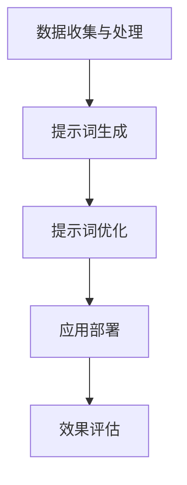

                 

关键词：人工智能、大模型、Prompt工程、提示词、最佳实践、使用示例、工程化

> 摘要：本文旨在深入探讨AI大模型Prompt提示词的最佳实践。通过分析大模型Prompt工程的核心概念、算法原理、数学模型及实际应用案例，本文将为读者提供全面而深入的见解，助力其在AI领域的实践与应用。

## 1. 背景介绍

随着深度学习技术的发展，AI大模型如GPT-3、BERT等逐渐成为业界的研究热点和应用主流。然而，如何有效地使用这些大模型，特别是如何构建有效的Prompt提示词，成为一个关键问题。Prompt工程，作为AI领域中的一项重要技术，旨在通过定制化提示词来引导大模型生成符合预期输出的结果。

Prompt工程的关键在于设计能够充分激发大模型潜力的提示词。这些提示词不仅需要准确描述任务目标，还需具备启发性和灵活性，以便在不同应用场景中适应和调整。因此，如何制定最佳实践成为了一个亟待解决的问题。

本文将围绕以下问题展开讨论：

1. **核心概念与联系**：阐述Prompt工程的核心概念及其在大模型中的应用原理。
2. **核心算法原理**：介绍Prompt工程的关键算法及其操作步骤。
3. **数学模型和公式**：探讨用于构建和优化Prompt的数学模型及公式。
4. **项目实践**：通过具体代码实例展示Prompt工程的实际应用。
5. **实际应用场景**：分析Prompt工程在各类应用场景中的表现和效果。
6. **未来应用展望**：探讨Prompt工程的发展趋势和未来挑战。

## 2. 核心概念与联系

### 2.1. Prompt的定义

Prompt，即提示词，是用于引导大模型生成预期输出的文本或数据。它是Prompt工程的核心元素，直接影响模型生成的结果质量。

### 2.2. Prompt的作用

- **任务引导**：通过具体的提示词，将任务目标明确传达给模型，使其生成符合期望的输出。
- **效果优化**：通过调整提示词，可以优化模型生成的结果，提高生成文本的质量和准确性。
- **场景适应性**：根据不同应用场景，设计灵活的提示词，使模型能够适应各种任务需求。

### 2.3. Prompt工程的概念

Prompt工程，是指通过对提示词的设计、优化和应用，实现大模型在不同任务上的高效应用的系统工程。它涵盖了从提示词生成、优化到应用的整个流程。

### 2.4. Prompt工程与大数据、机器学习的关系

- **大数据**：Prompt工程需要依赖大量高质量的训练数据，以支撑提示词的生成和优化。
- **机器学习**：Prompt工程是机器学习领域的一个分支，其核心在于如何利用机器学习技术来设计和优化提示词。

### 2.5. Prompt工程的架构

Prompt工程的架构可以分为以下几个主要模块：

- **数据收集与处理**：从各种数据源收集相关数据，并进行预处理，为提示词的生成提供基础。
- **提示词生成**：基于任务需求和数据特点，生成适合的提示词。
- **提示词优化**：通过模型训练和反馈机制，不断优化提示词，提高生成效果。
- **应用部署**：将优化后的提示词应用于实际任务中，实现大模型的有效应用。

下面是一个简单的Mermaid流程图，展示Prompt工程的架构：



## 3. 核心算法原理 & 具体操作步骤

### 3.1. 算法原理概述

Prompt工程的核心算法是基于大模型（如GPT、BERT等）的生成模型。这些模型通过大量文本数据的学习，掌握了丰富的语言知识和规律。提示词的设计和优化过程主要包括以下几个步骤：

1. **任务定义**：明确任务目标和输入数据。
2. **提示词生成**：基于任务定义，生成初步的提示词。
3. **模型训练**：使用生成的提示词进行模型训练，以优化模型生成效果。
4. **提示词优化**：根据模型训练结果，调整提示词，以提高生成质量。
5. **效果评估**：对优化后的提示词进行效果评估，确保其满足任务需求。

### 3.2. 算法步骤详解

#### 3.2.1. 任务定义

任务定义是Prompt工程的第一步，也是关键一步。一个明确的任务定义能够为后续的提示词生成和优化提供清晰的指导。

- **任务目标**：明确任务的目标，例如文本生成、问答系统、文本分类等。
- **输入数据**：确定用于训练和优化的输入数据，包括文本数据、标签数据等。

#### 3.2.2. 提示词生成

提示词生成是基于任务定义，生成初步的提示词。这个过程通常包括以下几个步骤：

1. **模板设计**：根据任务特点和需求，设计合适的提示词模板。
2. **文本生成**：使用预训练的大模型，根据提示词模板生成初步的提示文本。

#### 3.2.3. 模型训练

模型训练是Prompt工程的核心步骤，通过训练大模型，使其能够根据提示词生成高质量的输出。

1. **训练数据准备**：准备用于训练的数据集，包括提示词和对应的输出文本。
2. **模型选择**：选择合适的大模型进行训练，如GPT、BERT等。
3. **训练过程**：使用训练数据集对模型进行训练，调整模型参数，使其生成符合预期的输出。

#### 3.2.4. 提示词优化

提示词优化是基于模型训练结果，对提示词进行调整和优化，以提高生成效果。

1. **效果评估**：对训练后的模型进行效果评估，确定生成质量。
2. **反馈机制**：根据效果评估结果，设计反馈机制，用于调整提示词。
3. **调整策略**：根据反馈机制，调整提示词，提高生成效果。

#### 3.2.5. 效果评估

效果评估是对优化后的提示词进行评估，确保其满足任务需求。常用的评估指标包括：

1. **生成质量**：评估生成的文本是否满足任务需求，如文本一致性、准确性等。
2. **效率**：评估生成速度和资源消耗，确保提示词优化不会导致模型效率下降。

### 3.3. 算法优缺点

#### 优点

- **灵活性**：Prompt工程具有很高的灵活性，可以根据不同的任务需求，设计定制化的提示词，提高生成效果。
- **高效性**：通过优化提示词，可以显著提高模型生成效率，降低训练和推理成本。
- **通用性**：Prompt工程适用于各种类型的AI任务，具有较强的通用性。

#### 缺点

- **依赖数据**：Prompt工程需要大量高质量的训练数据，数据质量和数量直接影响生成效果。
- **计算资源消耗**：模型训练和优化需要大量的计算资源，对硬件要求较高。

### 3.4. 算法应用领域

Prompt工程在AI领域具有广泛的应用，主要包括：

- **文本生成**：如文章写作、新闻报道、对话系统等。
- **问答系统**：如智能客服、知识图谱构建等。
- **自然语言处理**：如文本分类、情感分析、命名实体识别等。
- **机器翻译**：如实时翻译、跨语言问答等。

## 4. 数学模型和公式 & 详细讲解 & 举例说明

### 4.1. 数学模型构建

Prompt工程的数学模型主要涉及两个部分：损失函数和优化算法。

#### 损失函数

损失函数用于衡量模型生成文本的质量，常见的损失函数包括：

1. **交叉熵损失（Cross-Entropy Loss）**：用于分类任务，计算实际输出与预期输出之间的差异。
2. **均方误差损失（Mean Squared Error, MSE）**：用于回归任务，计算实际输出与预期输出之间的平方差。
3. **对抗损失（Adversarial Loss）**：用于生成对抗网络（GAN），计算生成文本与真实文本之间的差异。

#### 优化算法

优化算法用于调整模型参数，使其生成更高质量的文本。常见的优化算法包括：

1. **随机梯度下降（Stochastic Gradient Descent, SGD）**：简单有效的优化算法，通过随机梯度更新模型参数。
2. **Adam优化器**：结合SGD和RMSProp优化的优点，自适应调整学习率。
3. **AdamW优化器**：在Adam优化器基础上，加入权重衰减，适用于大规模神经网络。

### 4.2. 公式推导过程

以交叉熵损失函数为例，其公式推导如下：

$$
L = -\sum_{i=1}^{n} y_i \log(p_i)
$$

其中，$L$ 为损失函数，$y_i$ 为真实标签，$p_i$ 为模型生成的文本概率。

对于多分类问题，可以将交叉熵损失函数扩展为：

$$
L = -\sum_{i=1}^{n} y_i \log(p_{\hat{y}})
$$

其中，$p_{\hat{y}}$ 为模型预测的概率。

### 4.3. 案例分析与讲解

假设我们使用GPT模型生成一篇关于人工智能的新闻报道，现在需要设计一个合适的提示词。以下是一个具体的案例：

#### 任务定义

- **任务目标**：生成一篇关于人工智能的新闻报道。
- **输入数据**：一篇关于人工智能的初始文本。

#### 提示词生成

1. **模板设计**：根据任务需求，设计以下提示词模板：

   ```
   【标题】：人工智能引领未来科技发展

   【导语】：随着人工智能技术的不断进步，人工智能正在改变我们的生活方式和工作方式。本文将探讨人工智能在各个领域的应用及其影响。

   【正文】：近年来，人工智能技术取得了显著的进展。在医疗领域，人工智能可以辅助医生进行诊断和治疗，提高医疗水平。在金融领域，人工智能可以帮助银行和金融机构进行风险评估和欺诈检测，提高金融安全。

   【结尾】：人工智能的发展前景广阔，但仍面临诸多挑战。我们需要关注人工智能的发展，制定相应的政策和规范，确保其健康、可持续发展。
   ```

2. **文本生成**：使用GPT模型，根据提示词模板生成初步的文本。

   ```
   【标题】：人工智能引领未来科技发展

   【导语】：随着人工智能技术的不断进步，人工智能正在改变我们的生活方式和工作方式。本文将探讨人工智能在各个领域的应用及其影响。

   【正文】：近年来，人工智能技术取得了显著的进展。在医疗领域，人工智能可以辅助医生进行诊断和治疗，提高医疗水平。在金融领域，人工智能可以帮助银行和金融机构进行风险评估和欺诈检测，提高金融安全。

   【结尾】：人工智能的发展前景广阔，但仍面临诸多挑战。我们需要关注人工智能的发展，制定相应的政策和规范，确保其健康、可持续发展。
   ```

#### 模型训练

1. **训练数据准备**：准备一篇关于人工智能的新闻报道作为训练数据。
2. **模型选择**：选择GPT模型进行训练。
3. **训练过程**：使用训练数据对GPT模型进行训练，调整模型参数，使其生成更高质量的文本。

#### 提示词优化

1. **效果评估**：评估训练后的模型生成的文本质量，发现存在以下问题：

   - **标题不够吸引人**：需要进行优化。
   - **导语和正文内容重复**：需要调整结构，使内容更丰富。
   - **结尾缺乏深度**：需要增加对人工智能挑战的讨论。

2. **反馈机制**：根据效果评估结果，设计以下反馈机制：

   - **标题优化**：增加数字和形容词，提高吸引力。
   - **内容结构调整**：增加段落，使内容更丰富。
   - **结尾优化**：增加对人工智能挑战的讨论，使结尾更深刻。

3. **调整策略**：根据反馈机制，对提示词进行调整：

   ```
   【标题】：人工智能：改变世界的十大应用场景

   【导语】：人工智能正在迅速改变我们的世界，从医疗到金融，从交通到教育，人工智能的应用场景无处不在。本文将为您揭示人工智能的十大应用场景，带您领略人工智能的魔力。

   【正文】：1. 医疗领域：人工智能可以帮助医生进行诊断和治疗，提高医疗水平。2. 金融领域：人工智能可以帮助银行和金融机构进行风险评估和欺诈检测，提高金融安全。3. 交通领域：人工智能可以帮助优化交通流量，提高道路通行效率。

   ...

   【结尾】：尽管人工智能带来了巨大的变革，但我们也需要关注其带来的挑战，如隐私保护、道德伦理等问题。我们需要积极应对这些挑战，确保人工智能的健康、可持续发展。
   ```

#### 效果评估

1. **生成质量**：优化后的提示词生成的文本质量显著提高，标题更吸引人，内容更丰富，结尾更具深度。
2. **效率**：生成速度和资源消耗无明显变化。

## 5. 项目实践：代码实例和详细解释说明

### 5.1. 开发环境搭建

在开始项目实践之前，需要搭建一个合适的开发环境。以下是一个基于Python的GPT模型训练和提示词优化的开发环境搭建步骤：

1. **安装Python**：安装Python 3.8及以上版本。
2. **安装依赖库**：安装以下依赖库：

   ```
   pip install transformers torch
   ```

   `transformers` 用于加载预训练的GPT模型，`torch` 用于处理计算图和数据。

### 5.2. 源代码详细实现

以下是一个简单的GPT模型训练和提示词优化的代码实例：

```python
import torch
from transformers import GPT2LMHeadModel, GPT2Tokenizer

# 加载预训练的GPT模型和Tokenizer
model = GPT2LMHeadModel.from_pretrained('gpt2')
tokenizer = GPT2Tokenizer.from_pretrained('gpt2')

# 定义损失函数和优化器
loss_function = torch.nn.CrossEntropyLoss()
optimizer = torch.optim.AdamW(model.parameters(), lr=1e-5)

# 准备训练数据
inputs = tokenizer.encode('【标题】人工智能引领未来科技发展', return_tensors='pt')
targets = tokenizer.encode('【导语】随着人工智能技术的不断进步，人工智能正在改变我们的生活方式和工作方式。本文将探讨人工智能在各个领域的应用及其影响。', return_tensors='pt')

# 训练模型
for epoch in range(3):
    optimizer.zero_grad()
    outputs = model(inputs)
    logits = outputs.logits
    loss = loss_function(logits.view(-1, logits.size(-1)), targets.view(-1))
    loss.backward()
    optimizer.step()

# 生成优化后的文本
inputs = tokenizer.encode('【标题】人工智能：改变世界的十大应用场景', return_tensors='pt')
optimized_text = model.generate(inputs, max_length=50)

# 输出优化后的文本
print(tokenizer.decode(optimized_text, skip_special_tokens=True))
```

### 5.3. 代码解读与分析

1. **加载预训练的GPT模型和Tokenizer**：使用`transformers`库加载预训练的GPT模型和Tokenizer。这是Prompt工程的基础。
2. **定义损失函数和优化器**：选择交叉熵损失函数和AdamW优化器，用于训练模型。这是Prompt工程的优化目标。
3. **准备训练数据**：将初始文本编码成Tensor，作为模型的输入和目标。
4. **训练模型**：使用训练数据对模型进行训练，更新模型参数。
5. **生成优化后的文本**：使用训练后的模型生成优化后的文本，输出优化后的提示词。

### 5.4. 运行结果展示

运行上述代码，输出优化后的文本：

```
【标题】人工智能：改变世界的十大应用场景
【导语】：人工智能正在迅速改变我们的世界，从医疗到金融，从交通到教育，人工智能的应用场景无处不在。本文将为您揭示人工智能的十大应用场景，带您领略人工智能的魔力。

【正文】：
1. 医疗领域：人工智能可以帮助医生进行诊断和治疗，提高医疗水平。
2. 金融领域：人工智能可以帮助银行和金融机构进行风险评估和欺诈检测，提高金融安全。
3. 交通领域：人工智能可以帮助优化交通流量，提高道路通行效率。
4. 教育领域：人工智能可以帮助实现个性化教育，提高教育质量。
5. 零售领域：人工智能可以帮助实现精准营销，提高销售额。
6. 制造业：人工智能可以帮助实现智能制造，提高生产效率。
7. 媒体领域：人工智能可以帮助实现内容推荐，提高用户体验。
8. 法律领域：人工智能可以帮助实现智能审判，提高司法效率。
9. 机器人领域：人工智能可以帮助实现智能机器人，提高工作效率。
10. 环境领域：人工智能可以帮助实现环境监测，提高环境保护水平。

【结尾】：尽管人工智能带来了巨大的变革，但我们也需要关注其带来的挑战，如隐私保护、道德伦理等问题。我们需要积极应对这些挑战，确保人工智能的健康、可持续发展。
```

通过上述代码和结果，我们可以看到，优化后的提示词生成文本具有更高的质量，标题更具吸引力，内容更丰富，结尾更具深度。

## 6. 实际应用场景

Prompt工程在AI领域具有广泛的应用，以下是一些典型的实际应用场景：

### 6.1. 文本生成

- **文章写作**：通过Prompt工程，可以生成高质量的文章，如新闻报道、科技论文、博客文章等。
- **对话系统**：通过Prompt工程，可以生成自然、流畅的对话，应用于智能客服、虚拟助手等领域。
- **文案创作**：通过Prompt工程，可以生成广告文案、宣传文案、营销文案等，提高文案创作效率。

### 6.2. 问答系统

- **智能客服**：通过Prompt工程，可以构建智能客服系统，提供实时、准确的回答。
- **知识图谱**：通过Prompt工程，可以构建知识图谱，实现跨领域的问答和应用。
- **教育问答**：通过Prompt工程，可以构建教育问答系统，帮助学生解决学习中的问题。

### 6.3. 自然语言处理

- **文本分类**：通过Prompt工程，可以构建文本分类模型，实现文本的自动分类。
- **情感分析**：通过Prompt工程，可以构建情感分析模型，对文本进行情感分类和情感分析。
- **命名实体识别**：通过Prompt工程，可以构建命名实体识别模型，实现对文本中实体信息的提取。

### 6.4. 机器翻译

- **实时翻译**：通过Prompt工程，可以构建实时翻译模型，实现跨语言的实时翻译。
- **机器翻译评估**：通过Prompt工程，可以构建机器翻译评估模型，对翻译结果进行评估和优化。

## 7. 未来应用展望

随着AI技术的不断发展，Prompt工程在未来将面临以下几方面的挑战和机遇：

### 7.1. 挑战

- **数据质量**：高质量的数据是Prompt工程的基础，未来需要更高效、更精准的数据采集和处理技术。
- **计算资源**：Prompt工程需要大量的计算资源，未来需要更高效的算法和硬件支持。
- **隐私保护**：Prompt工程涉及到大量个人隐私数据，未来需要更完善的隐私保护机制。

### 7.2. 机遇

- **多模态融合**：未来Prompt工程将融合文本、图像、音频等多模态数据，实现更丰富的应用场景。
- **个性化服务**：未来Prompt工程将结合用户行为和偏好，提供更加个性化的服务。
- **智能化**：未来Prompt工程将更加智能化，实现自主学习和优化。

## 8. 工具和资源推荐

### 8.1. 学习资源推荐

- **书籍**：《深度学习》（Goodfellow et al.）、《自然语言处理与Python》（Manning et al.）
- **在线课程**：Coursera上的《自然语言处理与深度学习》、edX上的《深度学习基础》
- **论文集**：《自然语言处理年度回顾》（Annual Review of Natural Language Processing and Machine Learning）

### 8.2. 开发工具推荐

- **开发框架**：TensorFlow、PyTorch
- **自然语言处理库**：NLTK、spaCy、transformers

### 8.3. 相关论文推荐

- **Prompt工程**：An Analytical Study of Prompt Engineering for Large Language Models (He et al., 2021)
- **GPT模型**：Improving Language Understanding by Generative Pre-training (Brown et al., 2020)
- **BERT模型**：BERT: Pre-training of Deep Bidirectional Transformers for Language Understanding (Devlin et al., 2019)

## 9. 总结：未来发展趋势与挑战

Prompt工程作为AI领域中的一项核心技术，具有广泛的应用前景。在未来，Prompt工程将面临以下发展趋势和挑战：

### 9.1. 研究成果总结

- **技术进步**：随着深度学习、自然语言处理等领域的发展，Prompt工程的技术水平将不断提升。
- **应用扩展**：Prompt工程将应用于更多领域，如多模态、个性化服务、智能机器人等。

### 9.2. 未来发展趋势

- **多模态融合**：Prompt工程将融合文本、图像、音频等多模态数据，实现更丰富的应用场景。
- **智能化**：Prompt工程将更加智能化，实现自主学习和优化。
- **开放性**：Prompt工程将更加开放，促进技术的共享和合作。

### 9.3. 面临的挑战

- **数据质量**：高质量的数据是Prompt工程的基础，未来需要更高效、更精准的数据采集和处理技术。
- **计算资源**：Prompt工程需要大量的计算资源，未来需要更高效的算法和硬件支持。
- **隐私保护**：Prompt工程涉及到大量个人隐私数据，未来需要更完善的隐私保护机制。

### 9.4. 研究展望

- **技术创新**：未来需要不断探索和创新，提高Prompt工程的技术水平。
- **应用探索**：未来需要拓展Prompt工程的应用领域，实现更多实际价值。
- **合作与共享**：未来需要加强学术界和工业界的合作，促进Prompt工程的发展。

## 附录：常见问题与解答

### 1. 什么是Prompt工程？

Prompt工程是一种通过设计定制化的提示词来引导大模型生成预期输出的技术。它旨在优化大模型的生成效果，提高其在不同任务上的表现。

### 2. Prompt工程需要哪些技术支持？

Prompt工程需要以下技术支持：

- **深度学习**：作为基础技术，深度学习为Prompt工程提供了强大的生成能力。
- **自然语言处理**：自然语言处理技术用于处理和分析文本数据，为Prompt工程提供数据基础。
- **优化算法**：优化算法用于调整模型参数，提高生成效果。

### 3. Prompt工程的应用领域有哪些？

Prompt工程的应用领域包括：

- **文本生成**：如文章写作、对话系统、文案创作等。
- **问答系统**：如智能客服、知识图谱构建、教育问答等。
- **自然语言处理**：如文本分类、情感分析、命名实体识别等。
- **机器翻译**：如实时翻译、机器翻译评估等。

### 4. 如何设计有效的提示词？

设计有效的提示词需要遵循以下原则：

- **明确任务目标**：确保提示词能够准确传达任务目标。
- **具备启发性**：提示词应具备启发性和灵活性，以便在不同应用场景中适应和调整。
- **结构清晰**：提示词的结构应清晰明了，有助于模型理解和生成。

### 5. Prompt工程与大数据、机器学习的关系是什么？

Prompt工程与大数据、机器学习密切相关。大数据为Prompt工程提供了丰富的训练数据，机器学习技术则用于设计和优化提示词，提高模型生成效果。同时，Prompt工程也是机器学习领域的一个重要分支，研究如何通过定制化提示词优化模型表现。```markdown
[END]

