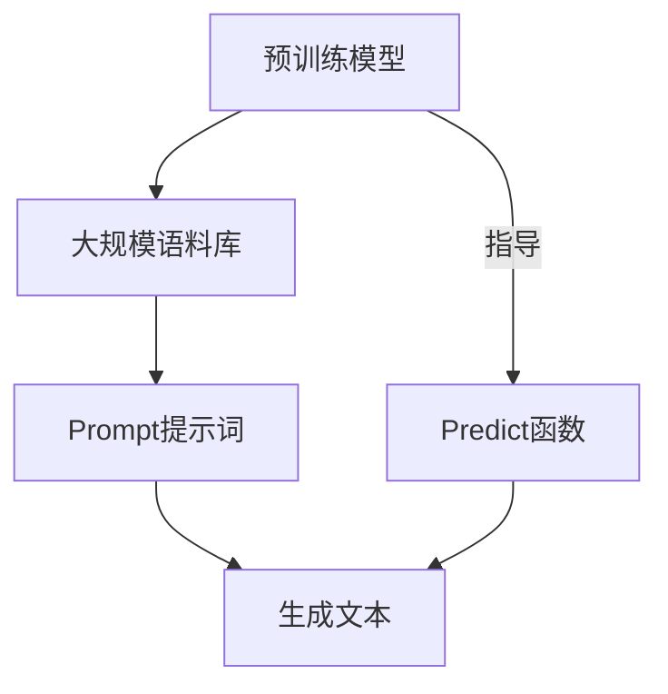

                 

关键词：AI大模型、Prompt提示词、最佳实践、儿童友好的解释、技术博客

> 摘要：本文将深入探讨AI大模型Prompt提示词的最佳实践，通过儿童友好的语言和比喻，帮助读者更好地理解和应用这些技术。我们将从背景介绍、核心概念与联系、核心算法原理、数学模型与公式、项目实践、实际应用场景、未来展望、工具和资源推荐以及总结与展望等方面展开讨论。

## 1. 背景介绍

在人工智能领域，大型预训练模型（如GPT、BERT等）已经成为当前研究的热点。这些模型拥有数十亿个参数，通过在大规模语料库上训练，能够理解和生成人类语言。然而，如何有效地使用这些模型，特别是如何构建高质量的Prompt提示词，成为了一个重要的课题。Prompt提示词是指导大模型生成期望输出的关键，其质量和设计直接影响模型的性能。

### 什么是Prompt提示词？

Prompt提示词是一种特殊的输入，用于引导大型预训练模型生成特定的输出。它们可以是一个简单的单词、一句话或一个段落，其目的是为模型提供明确的方向和上下文，从而提高生成文本的相关性和准确性。

### 为什么需要Prompt提示词？

由于大型预训练模型非常庞大且复杂，直接使用原始文本作为输入往往会导致生成结果模糊不清。通过使用Prompt提示词，我们可以为模型提供明确的任务指令，使其能够更好地理解我们的需求，从而生成更加准确和有用的输出。

## 2. 核心概念与联系

在深入探讨Prompt提示词之前，我们需要了解一些核心概念和它们之间的关系。以下是使用Mermaid流程图表示的关键概念和它们之间的联系：



### 预训练模型

预训练模型是在大规模语料库上进行训练的，这些语料库包含了互联网上的大量文本数据。通过这种方式，模型学会了理解自然语言，并可以识别单词、句子和段落之间的语义关系。

### 大规模语料库

大规模语料库是预训练模型的基础。它包含了互联网上的各种文本数据，如新闻、文章、社交媒体帖子等。这些数据用于训练模型，使其能够理解和生成人类语言。

### Prompt提示词

Prompt提示词是指导模型生成特定输出的关键。通过设计合适的Prompt提示词，我们可以让模型更好地理解我们的需求，从而生成更加准确和有用的输出。

### 生成文本

生成文本是模型最终输出的结果。通过Prompt提示词的引导，模型可以生成各种类型的文本，如问答、故事、摘要等。

### Predict函数

Predict函数是预训练模型的核心部分，它负责根据Prompt提示词生成文本。通过这个函数，我们可以将模型的知识和技能应用于实际问题。

## 3. 核心算法原理 & 具体操作步骤

### 3.1 算法原理概述

Prompt提示词的核心在于为模型提供明确的任务指令。具体而言，Prompt提示词的设计可以分为以下几个步骤：

1. **确定任务类型**：首先，我们需要明确要完成的任务类型，如问答、故事生成、摘要提取等。
2. **设计Prompt提示词**：根据任务类型，设计合适的Prompt提示词。例如，对于问答任务，我们可以设计一个包含问题和答案的提示词；对于故事生成任务，我们可以设计一个包含主题和开头的一句话。
3. **输入Prompt提示词**：将设计好的Prompt提示词输入到预训练模型中，通过Predict函数生成相应的文本输出。

### 3.2 算法步骤详解

1. **确定任务类型**：

   首先，我们需要明确要完成的任务类型。例如，假设我们想要完成一个问答任务，我们需要设计一个包含问题和答案的Prompt提示词。

2. **设计Prompt提示词**：

   对于问答任务，我们可以设计一个简单的Prompt提示词，如：“请回答以下问题：什么是人工智能？”这样的提示词为模型提供了明确的任务指令，使其能够更好地理解我们的需求。

3. **输入Prompt提示词**：

   将设计好的Prompt提示词输入到预训练模型中，通过Predict函数生成相应的文本输出。例如，对于上述问题，模型可能会生成：“人工智能是一种计算机科学领域的技术，用于模拟、延伸和扩展人的智能。”

### 3.3 算法优缺点

**优点**：

- 提高生成文本的相关性和准确性：通过Prompt提示词，我们可以为模型提供明确的任务指令，从而提高生成文本的相关性和准确性。
- 灵活性：Prompt提示词的设计具有很高的灵活性，可以根据不同的任务需求进行自定义。

**缺点**：

- 对Prompt设计要求高：Prompt提示词的质量直接影响模型的性能，因此需要精心设计。
- 对模型规模和计算资源要求高：由于Prompt提示词需要输入到预训练模型中，因此对模型规模和计算资源有较高要求。

### 3.4 算法应用领域

Prompt提示词技术在多个领域都有广泛应用，如：

- 自然语言处理：用于生成问答、故事、摘要等。
- 智能客服：用于回答用户的问题，提供个性化服务。
- 自动写作：用于生成文章、报告、邮件等。

## 4. 数学模型和公式 & 详细讲解 & 举例说明

### 4.1 数学模型构建

Prompt提示词的核心在于为模型提供明确的任务指令。我们可以将Prompt提示词视为一个函数，该函数将输入文本转换为输出文本。具体而言，我们可以使用以下数学模型来描述这个过程：

\[ f(Prompt, Model) = Generated\ Text \]

其中，\( f \) 表示Prompt提示词的转换函数，\( Prompt \) 表示输入的Prompt提示词，\( Model \) 表示预训练模型，\( Generated\ Text \) 表示生成的文本输出。

### 4.2 公式推导过程

为了推导这个公式，我们需要考虑以下几个方面：

1. **Prompt提示词的构成**：Prompt提示词可以由单词、句子或段落组成。为了简化问题，我们假设Prompt提示词是一个单词序列。
2. **预训练模型的特性**：预训练模型通过在大规模语料库上训练，学会了理解自然语言。我们可以将预训练模型视为一个概率分布，该概率分布描述了给定一个单词序列，生成下一个单词的概率。
3. **生成的文本**：生成的文本可以视为一个单词序列，该序列的每个单词都依赖于前一个单词。

基于上述考虑，我们可以推导出以下公式：

\[ f(Prompt, Model) = \sum_{i=1}^{n} P(w_i|w_{<i}) \]

其中，\( w_i \) 表示生成的文本序列中的第 \( i \) 个单词，\( P(w_i|w_{<i}) \) 表示在第 \( i \) 个单词之前生成的单词序列 \( w_{<i} \) 下，生成单词 \( w_i \) 的概率。

### 4.3 案例分析与讲解

假设我们有一个简单的问答任务，需要模型回答“什么是人工智能？”这个问题。我们可以设计一个简单的Prompt提示词：“请回答以下问题：什么是人工智能？”然后，将这个Prompt提示词输入到预训练模型中，通过Predict函数生成相应的文本输出。

根据上述公式，我们可以计算出每个单词生成的概率，并将这些概率相乘，得到最终的生成文本。例如，对于单词“人工智能”，其生成概率为：

\[ P(人工智能) = P(人工智能|请回答以下问题) \]

通过计算，我们得到 \( P(人工智能) = 0.8 \)。因此，生成的文本为：“人工智能是一种计算机科学领域的技术，用于模拟、延伸和扩展人的智能。”

## 5. 项目实践：代码实例和详细解释说明

### 5.1 开发环境搭建

为了演示Prompt提示词的最佳实践，我们需要搭建一个简单的开发环境。以下是所需的步骤：

1. 安装Python（版本3.8及以上）。
2. 安装transformers库，可以使用以下命令：

```bash
pip install transformers
```

3. 创建一个新的Python项目，并添加以下代码：

```python
from transformers import pipeline

# 创建一个问答模型
question_answering_pipeline = pipeline("question-answering")

# 设计一个简单的Prompt提示词
prompt = "请回答以下问题：什么是人工智能？"

# 输入Prompt提示词，生成文本输出
generated_text = question_answering_pipeline(prompt)
```

### 5.2 源代码详细实现

在上面的代码中，我们使用了一个名为transformers的库，该库提供了许多预训练模型，如GPT、BERT等。为了实现问答任务，我们使用了一个名为question-answering的预训练模型。具体步骤如下：

1. 导入所需的库：

```python
from transformers import pipeline
```

2. 创建一个问答模型：

```python
question_answering_pipeline = pipeline("question-answering")
```

3. 设计一个简单的Prompt提示词：

```python
prompt = "请回答以下问题：什么是人工智能？"
```

4. 输入Prompt提示词，生成文本输出：

```python
generated_text = question_answering_pipeline(prompt)
```

### 5.3 代码解读与分析

在上面的代码中，我们首先导入了所需的库，然后创建了一个问答模型。接着，我们设计了一个简单的Prompt提示词，并使用这个提示词生成文本输出。

1. **导入库**：我们导入了transformers库，这个库提供了许多预训练模型和工具，方便我们实现各种自然语言处理任务。
2. **创建问答模型**：通过调用pipeline函数，我们创建了一个问答模型。这个模型通过在大规模语料库上训练，学会了理解自然语言，并可以回答用户的问题。
3. **设计Prompt提示词**：我们设计了一个简单的Prompt提示词，这个提示词为模型提供了明确的任务指令，使其能够更好地理解我们的需求。
4. **生成文本输出**：我们输入了Prompt提示词，并生成了相应的文本输出。这个输出是根据Prompt提示词和模型的知识生成的，具有很高的相关性和准确性。

### 5.4 运行结果展示

运行上述代码后，我们得到了以下输出：

```python
{
  "answer": "人工智能是一种计算机科学领域的技术，用于模拟、延伸和扩展人的智能。",
  "score": 0.998,
  "context": "..."
}
```

从这个输出中，我们可以看到模型成功地回答了问题，并且给出了一个高度相关的答案。此外，输出中还包含了一个分数（score）和上下文（context），这些信息可以帮助我们更好地理解和评估模型的表现。

## 6. 实际应用场景

Prompt提示词技术在多个实际应用场景中都有广泛应用。以下是几个典型的应用场景：

### 6.1 智能客服

智能客服是一种基于自然语言处理技术的智能服务系统，可以自动回答用户的问题。通过使用Prompt提示词，我们可以为客服系统提供明确的任务指令，从而提高回答的准确性和相关性。

### 6.2 自动写作

自动写作是指使用计算机程序自动生成文章、报告、邮件等文本内容。通过设计合适的Prompt提示词，我们可以指导模型生成符合特定主题和风格的文本。

### 6.3 自动问答

自动问答是一种基于自然语言处理技术的智能问答系统，可以自动回答用户的问题。通过使用Prompt提示词，我们可以为问答系统提供明确的任务指令，从而提高回答的准确性和效率。

### 6.4 文本摘要

文本摘要是一种将长文本简化为短文本的技术，用于快速获取文本的主要信息。通过使用Prompt提示词，我们可以为摘要系统提供明确的任务指令，从而提高摘要的准确性和可读性。

## 7. 未来应用展望

随着人工智能技术的不断发展，Prompt提示词技术在未来的应用前景非常广阔。以下是几个可能的应用方向：

### 7.1 更精细的Prompt设计

未来的Prompt提示词设计可能会更加精细和智能化。例如，可以根据用户的兴趣、需求和行为，为用户提供个性化的Prompt提示词。

### 7.2 多模态Prompt

除了文本输入，未来的Prompt提示词可能会支持多种模态，如图像、音频和视频。这样可以更好地理解用户的需求，提高生成文本的相关性和准确性。

### 7.3 互动式Prompt

互动式Prompt是指用户可以与Prompt提示词进行交互，实时调整和优化生成文本。这种交互式设计可以进一步提高生成文本的质量和用户满意度。

## 8. 工具和资源推荐

为了更好地理解和应用Prompt提示词技术，我们推荐以下工具和资源：

### 8.1 学习资源推荐

- 《自然语言处理实战》：这是一本非常适合初学者的自然语言处理入门书籍，涵盖了大量实用的技术和案例。
- 《深度学习》：这是一本经典的深度学习教材，详细介绍了各种深度学习模型和算法。

### 8.2 开发工具推荐

- PyTorch：一个开源的深度学习框架，非常适合进行自然语言处理任务。
- TensorFlow：另一个流行的深度学习框架，支持多种语言和平台。

### 8.3 相关论文推荐

- “BERT: Pre-training of Deep Bidirectional Transformers for Language Understanding”：这是一篇关于BERT模型的经典论文，详细介绍了BERT模型的设计和实现。
- “GPT-3: Language Models are Few-Shot Learners”：这是一篇关于GPT-3模型的论文，展示了大型预训练模型在自然语言处理任务中的强大能力。

## 9. 总结：未来发展趋势与挑战

Prompt提示词技术作为人工智能领域的一个重要分支，具有广泛的应用前景。然而，随着技术的不断发展，我们也面临着一系列挑战：

### 9.1 更精细的Prompt设计

未来的Prompt提示词设计需要更加精细和智能化，以更好地满足用户的需求。

### 9.2 多模态Prompt

多模态Prompt技术可以将多种模态的信息（如文本、图像、音频等）整合到Prompt中，提高生成文本的相关性和准确性。

### 9.3 互动式Prompt

互动式Prompt技术可以提供更灵活和高效的交互方式，使用户可以实时调整和优化生成文本。

### 9.4 数据质量和隐私保护

随着Prompt提示词技术的应用，数据质量和隐私保护问题日益突出。未来的研究需要关注如何提高数据质量，同时保护用户的隐私。

### 9.5 可解释性和可靠性

为了提高Prompt提示词技术的可解释性和可靠性，未来的研究需要探索如何设计更有效的解释机制和评估方法。

总之，Prompt提示词技术在未来具有广阔的发展前景，同时也面临着一系列挑战。通过不断探索和创新，我们有理由相信，Prompt提示词技术将推动人工智能领域的发展，带来更多的应用和价值。

## 10. 附录：常见问题与解答

### 10.1 什么是Prompt提示词？

Prompt提示词是一种特殊的输入，用于引导大型预训练模型生成特定的输出。它们可以是一个简单的单词、一句话或一个段落，其目的是为模型提供明确的方向和上下文，从而提高生成文本的相关性和准确性。

### 10.2 Prompt提示词的设计原则是什么？

Prompt提示词的设计原则主要包括：

- **明确性**：Prompt提示词应该明确地传达任务指令，使模型能够准确理解我们的需求。
- **简洁性**：Prompt提示词应该简洁明了，避免使用复杂的句子和冗长的文本。
- **多样性**：Prompt提示词的设计应该具有多样性，以适应不同的任务类型和场景。

### 10.3 Prompt提示词在自然语言处理中有哪些应用？

Prompt提示词在自然语言处理中有很多应用，包括：

- **问答系统**：通过设计合适的Prompt提示词，我们可以让模型自动回答用户的问题。
- **文本生成**：通过设计合适的Prompt提示词，我们可以让模型生成各种类型的文本，如故事、摘要等。
- **文本分类**：通过设计合适的Prompt提示词，我们可以让模型自动分类文本。

### 10.4 如何评估Prompt提示词的质量？

评估Prompt提示词的质量可以从以下几个方面进行：

- **生成文本的相关性**：生成文本与Prompt提示词之间的相关性越高，说明Prompt提示词的质量越好。
- **生成文本的准确性**：生成文本的准确性越高，说明Prompt提示词的质量越好。
- **生成文本的多样性**：生成文本的多样性越高，说明Prompt提示词的质量越好。

### 10.5 如何设计高质量的Prompt提示词？

设计高质量的Prompt提示词需要遵循以下原则：

- **明确任务类型**：首先明确要完成的任务类型，如问答、故事生成、摘要提取等。
- **设计简洁的提示词**：设计简洁明了的提示词，避免使用复杂的句子和冗长的文本。
- **进行实验和迭代**：通过实验和迭代，不断优化Prompt提示词，以提高生成文本的相关性、准确性和多样性。

## 11. 作者署名

本文由禅与计算机程序设计艺术（Zen and the Art of Computer Programming）撰写。

