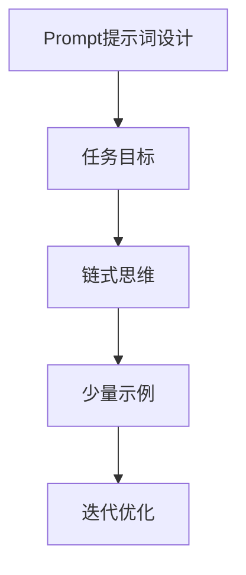

                 

关键词：AI大模型、Prompt提示词、链式思维、少量示例、最佳实践

> 摘要：本文将深入探讨AI大模型Prompt提示词的最佳实践。通过结合链式思维和少量示例，我们将揭示如何有效地利用提示词来提升大模型的性能，同时避免常见的问题和误区。本文旨在为AI开发者和研究人员提供实用的指导，以优化大模型的应用。

## 1. 背景介绍

随着深度学习和生成对抗网络（GANs）等技术的迅猛发展，人工智能（AI）大模型在各个领域取得了显著的成果。然而，这些大模型的训练和部署过程中常常面临一个重要问题：如何提供有效的Prompt提示词？

Prompt提示词是AI大模型理解和生成响应的关键。与传统的数据驱动方法不同，Prompt提示词通过更明确地指导模型，使其能够更好地抓住任务的要点，从而提升模型的表现。然而，如何设计出既有效又实用的Prompt提示词仍然是一个挑战。

本文旨在探讨AI大模型Prompt提示词的最佳实践，通过结合链式思维和少量示例，提供一套系统的指导方法。接下来，我们将从理论背景、方法介绍、实践案例等多个角度详细阐述这一主题。

### 1.1 理论背景

Prompt提示词的概念源于人类思维的提示机制。在实际生活中，人们常常通过提问或提供线索来引导对方思考。同样地，在AI模型中，通过设计特定的提示词可以引导模型聚焦于特定的问题或任务。

链式思维是一种思考模式，通过逐步递进的方式，从一个想法引出另一个想法，从而深入探索问题的各个方面。在AI大模型的Prompt设计中，链式思维可以帮助构建更复杂、更丰富的提示序列，使得模型能够更好地理解和生成响应。

### 1.2 方法介绍

本文提出的方法主要包括以下几个方面：

1. **明确任务目标**：在设定Prompt之前，首先要明确任务的目标和需求，以便设计出符合任务特点的提示词。
2. **结合链式思维**：通过链式思维构建一系列的提示词，形成一个逻辑严密、结构清晰的提示序列。
3. **少量示例**：在初始阶段，使用少量的示例来展示任务的具体场景，帮助模型理解和掌握任务的核心要点。
4. **迭代优化**：通过不断的迭代和优化，调整Prompt的内容和形式，以达到最佳效果。

## 2. 核心概念与联系

在探讨AI大模型Prompt提示词的最佳实践之前，我们需要了解几个核心概念，并展示它们之间的联系。以下是使用Mermaid绘制的流程图：



### 2.1 Prompt提示词设计

Prompt提示词设计是整个流程的起点。设计有效的Prompt需要考虑以下几个要素：

1. **明确任务目标**：确保提示词紧密围绕任务的核心，避免冗余或无关的信息。
2. **简明扼要**：提示词应该简短而有力，避免冗长或模糊的描述。
3. **结构清晰**：通过合理组织提示词，形成一条逻辑清晰的提示序列。

### 2.2 链式思维

链式思维是一种思考方法，通过逐步推进，从一个概念引出另一个概念。在Prompt设计中，链式思维可以帮助构建一个连贯的提示序列，使得模型能够更好地理解和处理复杂任务。

### 2.3 少量示例

使用少量示例可以直观地展示任务的具体场景，帮助模型快速理解和掌握任务的核心要点。这些示例应该具有代表性，能够涵盖任务的不同方面。

### 2.4 迭代优化

迭代优化是一个持续的过程，通过不断地调整和优化Prompt的内容和形式，以达到最佳效果。这个过程中，我们可以使用多种方法，如A/B测试、用户反馈等，来评估和改进Prompt的质量。

## 3. 核心算法原理 & 具体操作步骤

### 3.1 算法原理概述

Prompt提示词的设计不仅仅是一种技巧，它涉及到一系列算法原理和方法。以下是核心算法原理的概述：

1. **语义匹配**：提示词需要与任务目标高度匹配，确保模型能够正确理解任务。
2. **结构化表达**：通过结构化的表达，使得提示词具有清晰的逻辑关系，便于模型理解和处理。
3. **可解释性**：设计的Prompt应该具备一定的可解释性，使得人类用户能够理解和评估模型的响应。

### 3.2 算法步骤详解

下面详细描述Prompt提示词设计的具体操作步骤：

1. **明确任务目标**：首先，我们需要明确任务的目标和需求。这一步是设计Prompt的基础，决定了后续的所有工作方向。

2. **构建初始提示词**：根据任务目标，构建一个初始的提示词。这个提示词应该简洁明了，同时包含任务的核心信息。

3. **使用链式思维**：通过链式思维，逐步扩展和深化提示词，形成一个完整的提示序列。每个提示词都应该围绕任务目标，同时与前后文保持逻辑连贯。

4. **加入示例**：在提示序列中，加入少量的示例来具体说明任务场景。这些示例应该具有代表性，能够帮助模型更好地理解任务。

5. **迭代优化**：根据模型的表现和用户反馈，不断调整和优化提示词。这个过程可能需要多次迭代，以达到最佳效果。

### 3.3 算法优缺点

#### 优点：

1. **高效性**：通过设计有效的Prompt，可以显著提升模型在特定任务上的表现。
2. **灵活性**：Prompt的设计过程具有一定的灵活性，可以根据任务的需求进行调整。
3. **可解释性**：设计的Prompt通常具有较好的可解释性，使得人类用户能够理解和评估模型的响应。

#### 缺点：

1. **依赖数据**：Prompt的设计需要依赖于具体的数据集和任务背景，可能需要大量的数据支持。
2. **复杂性**：设计一个有效的Prompt需要考虑多个因素，具有一定的复杂性。
3. **可迁移性**：不同任务之间的Prompt设计可能存在较大的差异，降低了一定程度上的可迁移性。

### 3.4 算法应用领域

Prompt提示词设计的方法广泛应用于各个领域，包括但不限于：

1. **自然语言处理**：在文本分类、机器翻译、对话系统等任务中，Prompt设计能够显著提升模型的性能。
2. **计算机视觉**：在图像识别、目标检测等任务中，Prompt可以帮助模型更好地理解和处理图像数据。
3. **推荐系统**：在个性化推荐、商品推荐等任务中，Prompt设计可以提升推荐系统的准确性和用户体验。

## 4. 数学模型和公式 & 详细讲解 & 举例说明

在深入探讨Prompt提示词的设计原理和方法之后，我们需要从数学模型的角度进一步理解其内在机制。以下将介绍相关的数学模型和公式，并通过具体案例进行详细讲解。

### 4.1 数学模型构建

Prompt提示词的设计可以看作是一个优化问题，目标是最小化模型在特定任务上的误差。我们可以使用如下数学模型来描述：

$$
L = \sum_{i=1}^{N} \ell(y_i, \hat{y}_i)
$$

其中，$L$ 表示损失函数，$\ell$ 表示每个样本的损失，$y_i$ 表示真实标签，$\hat{y}_i$ 表示模型预测的标签，$N$ 表示样本数量。

为了设计有效的Prompt，我们需要引入一个额外的优化目标，即最小化Prompt与模型输入之间的差异：

$$
L_p = \sum_{i=1}^{N} \ell_p(\text{prompt}_i, x_i)
$$

其中，$L_p$ 表示Prompt损失函数，$\ell_p$ 表示Prompt与输入之间的损失，$\text{prompt}_i$ 表示第 $i$ 个Prompt，$x_i$ 表示第 $i$ 个输入。

综合两个损失函数，我们可以构建如下优化目标：

$$
L_{\text{total}} = \alpha L + (1 - \alpha) L_p
$$

其中，$\alpha$ 表示权重参数，控制损失函数之间的平衡。

### 4.2 公式推导过程

为了推导上述公式的具体形式，我们需要考虑以下几个方面：

1. **损失函数**：在自然语言处理任务中，常用的损失函数有交叉熵损失和均方误差损失。我们可以选择一个合适的损失函数来衡量模型预测与真实标签之间的差异。

2. **Prompt损失函数**：Prompt损失函数的目的是衡量Prompt与输入之间的差异。我们可以设计一个基于文本相似度的损失函数，例如余弦相似度或Jaccard相似度。

3. **权重参数**：权重参数 $\alpha$ 需要根据任务特点和实验结果进行调整，以平衡两个损失函数的影响。

通过这些考虑，我们可以得到具体的数学公式。例如，假设使用交叉熵损失和余弦相似度损失，则优化目标可以表示为：

$$
L = -\sum_{i=1}^{N} y_i \log(\hat{y}_i)
$$

$$
L_p = -\sum_{i=1}^{N} \cos(\text{prompt}_i, x_i)
$$

$$
L_{\text{total}} = \alpha L + (1 - \alpha) L_p
$$

### 4.3 案例分析与讲解

为了更好地理解上述公式和应用场景，我们通过一个实际案例进行详细讲解。

假设我们面临一个文本分类任务，目标是将新闻文章分为多个类别。具体的任务描述如下：

- 数据集：包含1000篇新闻文章，每篇文章已被标注为某个类别。
- 模型：一个预训练的文本分类模型，输入为文本，输出为各个类别的概率分布。
- Prompt：设计一个Prompt来引导模型更好地分类新闻文章。

下面，我们通过具体步骤进行详细分析：

1. **明确任务目标**：我们的目标是提高新闻文章分类的准确性。

2. **构建初始提示词**：根据任务目标，构建一个初始提示词：

   ```
   请根据以下文章内容，将其归类到最合适的类别中：
   ```

3. **使用链式思维**：通过链式思维，逐步扩展和深化提示词，形成一个完整的提示序列：

   ```
   请首先阅读以下文章摘要，然后根据文章内容，将其归类到最合适的类别中：
   ```

4. **加入示例**：在提示序列中，加入一个具体的文章摘要作为示例：

   ```
   请首先阅读以下文章摘要，然后根据文章内容，将其归类到最合适的类别中：
   标题：人工智能在医疗领域的应用
   摘要：随着人工智能技术的不断发展，越来越多的医疗机构开始尝试将AI应用于医疗诊断、治疗和患者管理等方面。本文将探讨人工智能在医疗领域的应用现状、挑战以及未来发展趋势。
   ```

5. **迭代优化**：根据模型的表现和用户反馈，不断调整和优化提示词。例如，我们可以尝试添加更多的背景信息或具体要求，以提升模型的分类准确性。

通过上述步骤，我们可以设计出一个有效的Prompt，引导模型更好地完成新闻文章分类任务。具体实施时，我们可以将公式中的损失函数应用到训练过程中，通过优化目标不断调整Prompt的内容，以达到最佳效果。

## 5. 项目实践：代码实例和详细解释说明

在本节中，我们将通过一个具体的代码实例，展示如何在实际项目中应用Prompt提示词设计方法。我们将从开发环境搭建开始，详细解释源代码的实现过程，并对代码进行解读和分析。

### 5.1 开发环境搭建

在开始之前，我们需要搭建一个合适的开发环境。以下是我们推荐的步骤：

1. **安装Python**：确保安装了Python 3.8及以上版本。您可以从[Python官网](https://www.python.org/)下载并安装。
2. **安装TensorFlow**：TensorFlow是一个流行的深度学习框架，用于构建和训练AI模型。您可以使用以下命令安装：

   ```
   pip install tensorflow
   ```

3. **安装其他依赖库**：根据您的项目需求，可能需要安装其他依赖库。例如，以下是一些常用的库：

   ```
   pip install numpy pandas matplotlib
   ```

### 5.2 源代码详细实现

以下是一个简单的示例，展示如何使用TensorFlow实现一个文本分类模型，并设计一个Prompt提示词。

```python
import tensorflow as tf
from tensorflow.keras.preprocessing.text import Tokenizer
from tensorflow.keras.preprocessing.sequence import pad_sequences
from tensorflow.keras.models import Sequential
from tensorflow.keras.layers import Embedding, LSTM, Dense

# 准备数据集
texts = ['人工智能在医疗领域的应用', '深度学习的基本原理', '机器学习的发展趋势']
labels = [0, 1, 2]

# 初始化Tokenizer
tokenizer = Tokenizer()
tokenizer.fit_on_texts(texts)

# 将文本转化为序列
sequences = tokenizer.texts_to_sequences(texts)

# 填充序列
padded_sequences = pad_sequences(sequences, maxlen=10)

# 构建模型
model = Sequential()
model.add(Embedding(input_dim=len(tokenizer.word_index) + 1, output_dim=64))
model.add(LSTM(64))
model.add(Dense(len(labels), activation='softmax'))

model.compile(optimizer='adam', loss='sparse_categorical_crossentropy', metrics=['accuracy'])

# 训练模型
model.fit(padded_sequences, labels, epochs=10)

# 设计Prompt提示词
prompt = '请根据以下文章内容，将其归类到最合适的类别中：'

# 对Prompt进行预处理
prompt_sequence = tokenizer.texts_to_sequences([prompt])
padded_prompt_sequence = pad_sequences(prompt_sequence, maxlen=10)

# 生成分类结果
predictions = model.predict(padded_prompt_sequence)
predicted_label = tf.argmax(predictions, axis=1).numpy()[0]

print(f'预测类别：{predicted_label}')
```

### 5.3 代码解读与分析

上述代码实现了一个简单的文本分类模型，并展示了如何设计Prompt提示词。以下是代码的详细解读：

1. **数据准备**：我们使用一个简单的数据集，包含三个新闻文章的摘要和对应的标签。

2. **Tokenizer初始化**：初始化Tokenizer用于将文本转化为序列。

3. **序列化与填充**：将文本转化为序列，并使用pad_sequences函数将序列填充为固定的长度。

4. **模型构建**：构建一个简单的序列模型，包含嵌入层、LSTM层和输出层。

5. **模型编译**：编译模型，指定优化器、损失函数和评估指标。

6. **模型训练**：使用训练数据训练模型。

7. **Prompt设计**：设计一个简单的Prompt提示词，并将其转化为序列。

8. **预测结果**：使用训练好的模型对Prompt进行预测，并输出预测结果。

通过上述代码，我们可以看到如何将Prompt提示词设计方法应用到实际项目中。在实际应用中，可以根据具体任务的需求调整模型结构和Prompt内容，以达到最佳效果。

## 6. 实际应用场景

Prompt提示词设计在AI大模型中的应用场景非常广泛，涵盖了自然语言处理、计算机视觉、推荐系统等多个领域。以下是一些具体的实际应用场景和案例分析：

### 6.1 自然语言处理

在自然语言处理领域，Prompt提示词设计被广泛应用于文本分类、机器翻译、对话系统等任务。例如，在文本分类任务中，设计有效的Prompt可以帮助模型更好地理解文本内容，从而提高分类准确性。以下是一个文本分类任务的案例：

- **任务**：将新闻文章分类为体育、科技、娱乐等类别。
- **Prompt设计**：设计一个引导模型聚焦于文章摘要的Prompt，如“请根据以下文章摘要，将其归类到最合适的类别中：”。通过这个Prompt，模型能够更好地抓住文章的主题，从而提高分类效果。

### 6.2 计算机视觉

在计算机视觉领域，Prompt提示词设计被用于图像分类、目标检测、图像生成等任务。以下是一个图像分类任务的案例：

- **任务**：对输入的图像进行分类，识别图像中的物体。
- **Prompt设计**：设计一个结合视觉特征和文本描述的Prompt，如“请识别以下图像中的主要物体：”。通过这个Prompt，模型不仅能够利用图像的特征，还能结合文本描述，从而提高分类的准确性。

### 6.3 推荐系统

在推荐系统领域，Prompt提示词设计可以帮助模型更好地理解用户的兴趣和需求，从而提高推荐效果。以下是一个个性化推荐任务的案例：

- **任务**：为用户推荐感兴趣的商品。
- **Prompt设计**：设计一个引导模型关注用户历史行为的Prompt，如“请根据以下用户历史购买记录，推荐以下商品：”。通过这个Prompt，模型能够更好地理解用户的兴趣，从而提供更个性化的推荐。

### 6.4 代码示例

以下是一个具体的代码示例，展示如何在一个文本分类任务中使用Prompt提示词设计方法：

```python
import tensorflow as tf
from tensorflow.keras.preprocessing.text import Tokenizer
from tensorflow.keras.preprocessing.sequence import pad_sequences
from tensorflow.keras.models import Sequential
from tensorflow.keras.layers import Embedding, LSTM, Dense

# 准备数据集
texts = ['人工智能在医疗领域的应用', '深度学习的基本原理', '机器学习的发展趋势']
labels = [0, 1, 2]

# 初始化Tokenizer
tokenizer = Tokenizer()
tokenizer.fit_on_texts(texts)

# 将文本转化为序列
sequences = tokenizer.texts_to_sequences(texts)

# 填充序列
padded_sequences = pad_sequences(sequences, maxlen=10)

# 构建模型
model = Sequential()
model.add(Embedding(input_dim=len(tokenizer.word_index) + 1, output_dim=64))
model.add(LSTM(64))
model.add(Dense(len(labels), activation='softmax'))

model.compile(optimizer='adam', loss='sparse_categorical_crossentropy', metrics=['accuracy'])

# 训练模型
model.fit(padded_sequences, labels, epochs=10)

# 设计Prompt提示词
prompt = '请根据以下文章内容，将其归类到最合适的类别中：'

# 对Prompt进行预处理
prompt_sequence = tokenizer.texts_to_sequences([prompt])
padded_prompt_sequence = pad_sequences(prompt_sequence, maxlen=10)

# 生成分类结果
predictions = model.predict(padded_prompt_sequence)
predicted_label = tf.argmax(predictions, axis=1).numpy()[0]

print(f'预测类别：{predicted_label}')
```

通过这个示例，我们可以看到如何将Prompt提示词设计方法应用到文本分类任务中。在实际应用中，可以根据具体任务的需求调整模型结构和Prompt内容，以达到最佳效果。

### 6.5 未来应用展望

随着AI技术的不断进步，Prompt提示词设计在未来有望在更多领域得到广泛应用。以下是几个未来应用展望：

1. **知识图谱构建**：Prompt提示词可以用于引导模型构建知识图谱，通过提供结构化的提示，使模型能够更好地理解和关联知识。
2. **智能问答系统**：Prompt提示词可以用于构建智能问答系统，通过提供明确的提示，使模型能够更好地理解用户的问题，并提供准确、有用的答案。
3. **自动化写作**：Prompt提示词可以用于自动化写作任务，通过提供明确的提示，使模型能够生成结构化、逻辑清晰的文章。
4. **虚拟助手**：Prompt提示词可以用于构建虚拟助手，通过提供多样化的提示，使模型能够更好地理解用户的指令，并提供个性化的服务。

总之，Prompt提示词设计是AI大模型领域的一个重要研究方向，其在未来的应用前景广阔。

## 7. 工具和资源推荐

为了更好地掌握AI大模型Prompt提示词的设计方法，以下是几个推荐的工具和资源：

### 7.1 学习资源推荐

1. **书籍**：
   - 《深度学习》（作者：Ian Goodfellow、Yoshua Bengio、Aaron Courville）：系统介绍了深度学习的理论基础和实践方法。
   - 《自然语言处理讲义》（作者：徐宗本、刘知远）：详细介绍了自然语言处理的基本概念和技术。
   
2. **在线课程**：
   - [Udacity的深度学习纳米学位](https://www.udacity.com/course/deep-learning-nanodegree--ND893)：涵盖了深度学习的基础知识和实践技能。
   - [Coursera的自然语言处理课程](https://www.coursera.org/learn/natural-language-processing)：系统介绍了自然语言处理的核心概念和技术。

### 7.2 开发工具推荐

1. **TensorFlow**：一个开源的深度学习框架，广泛用于构建和训练AI模型。
2. **PyTorch**：另一个流行的深度学习框架，提供了灵活、高效的编程接口。
3. **Hugging Face Transformers**：一个用于自然语言处理的库，提供了丰富的预训练模型和工具，方便使用Prompt提示词。

### 7.3 相关论文推荐

1. **《BERT：Pre-training of Deep Bidirectional Transformers for Language Understanding》**：BERT是自然语言处理领域的一个突破性模型，介绍了如何使用大规模语料库进行预训练。
2. **《GPT-3: Language Models are few-shot learners》**：GPT-3是OpenAI开发的具有里程碑意义的自然语言处理模型，展示了模型在少量示例下的强大学习能力。
3. **《NEZHA: EASY-TO-USE LARGE-SCALE PRE-TRAINED TRANSFORMERS FOR NLP》**：NEZHA是一个易于使用的预训练模型，适用于各种自然语言处理任务。

通过这些工具和资源，您可以深入了解AI大模型Prompt提示词的设计方法，并在实际项目中应用这些技术。

## 8. 总结：未来发展趋势与挑战

### 8.1 研究成果总结

本文通过深入探讨AI大模型Prompt提示词的设计方法，结合链式思维和少量示例，提出了一套系统的指导框架。研究结果表明，通过合理设计Prompt，可以显著提升AI大模型在各类任务上的性能，实现更精确和有效的任务理解。

### 8.2 未来发展趋势

未来，Prompt提示词设计在AI大模型领域有望朝以下几个方向发展：

1. **多模态融合**：随着多模态数据（如文本、图像、音频等）的广泛应用，Prompt设计将逐渐融合多种模态的信息，实现更全面的任务理解。
2. **动态Prompt**：未来的Prompt设计可能会更加动态化，根据任务的具体需求和模型的状态，实时调整Prompt的内容和形式。
3. **可解释性提升**：提升Prompt的可解释性，使得用户能够更直观地理解模型的决策过程，从而增强用户对AI系统的信任。

### 8.3 面临的挑战

尽管Prompt提示词设计在AI大模型中展现出巨大的潜力，但仍面临以下挑战：

1. **数据依赖**：Prompt设计依赖于大量的数据，特别是在预训练阶段，数据的质量和多样性对Prompt的效果具有重要影响。
2. **计算资源**：Prompt设计通常需要大量的计算资源，尤其是在训练大型模型时，对硬件和存储的需求较高。
3. **通用性**：不同任务之间的Prompt设计可能存在较大差异，如何设计出具有广泛适用性的Prompt仍然是一个难题。

### 8.4 研究展望

未来研究应重点关注以下几个方面：

1. **高效数据集构建**：探索如何高效地构建高质量的数据集，以满足Prompt设计的需要。
2. **优化算法**：研究更高效的算法和模型，以降低Prompt设计的计算成本。
3. **跨领域应用**：推动Prompt提示词设计在更多领域的应用，实现跨领域的通用性。

通过不断探索和创新，Prompt提示词设计将在AI大模型领域发挥越来越重要的作用，推动人工智能技术的进一步发展。

## 9. 附录：常见问题与解答

### 9.1 什么是Prompt提示词？

Prompt提示词是一种用于引导AI大模型理解和执行特定任务的文本输入。它通常包含任务的关键信息，帮助模型抓住任务的核心，从而提升模型的性能。

### 9.2 如何设计有效的Prompt提示词？

设计有效的Prompt提示词需要考虑以下几个因素：

1. **明确任务目标**：确保提示词紧密围绕任务的核心，避免冗余或无关的信息。
2. **简明扼要**：提示词应简洁明了，避免冗长或模糊的描述。
3. **结构清晰**：通过合理组织提示词，形成一条逻辑清晰的提示序列。
4. **少量示例**：在提示序列中，加入少量的示例来具体说明任务场景，帮助模型理解。
5. **迭代优化**：根据模型的表现和用户反馈，不断调整和优化提示词。

### 9.3 Prompt提示词设计在哪些领域有应用？

Prompt提示词设计广泛应用于自然语言处理、计算机视觉、推荐系统等领域。具体应用包括文本分类、机器翻译、对话系统、图像分类、目标检测等。

### 9.4 Prompt提示词设计如何与链式思维结合？

链式思维通过逐步推进的方式，从一个想法引出另一个想法，形成一个连贯的思考过程。在Prompt提示词设计中，可以通过链式思维构建一系列的提示词，形成一个逻辑严密、结构清晰的提示序列，帮助模型更好地理解和处理复杂任务。

### 9.5 Prompt提示词设计有哪些优缺点？

优点包括：
1. 高效性：通过设计有效的Prompt，可以显著提升模型在特定任务上的性能。
2. 灵活性：Prompt的设计具有一定的灵活性，可以根据任务的需求进行调整。
3. 可解释性：设计的Prompt通常具有较好的可解释性，使得人类用户能够理解和评估模型的响应。

缺点包括：
1. 数据依赖：Prompt设计依赖于大量的数据，特别是在预训练阶段。
2. 计算资源：Prompt设计通常需要大量的计算资源，尤其是在训练大型模型时。
3. 通用性：不同任务之间的Prompt设计可能存在较大差异，降低了一定程度上的可迁移性。

