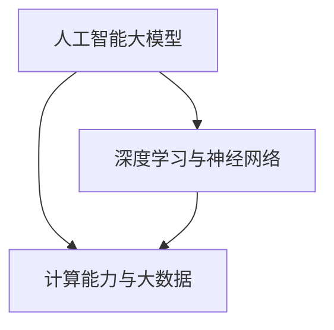

                 

关键词：AI大模型、创业、挑战、机遇、技术、未来

> 摘要：本文旨在探讨人工智能大模型在创业领域中的地位和作用。通过对AI大模型的背景介绍、核心概念与联系、算法原理及数学模型分析，结合实际应用案例和开发实践，深入探讨AI大模型创业过程中面临的挑战与机遇，以及未来发展趋势和面临的挑战。本文期望为广大创业者和技术人员提供有价值的思考和参考。

## 1. 背景介绍

人工智能（AI）作为计算机科学的一个重要分支，已经取得了显著的进展。从早期的专家系统到现代深度学习，人工智能技术不断突破，应用范围也日益扩大。特别是近年来，随着计算能力的提升和大数据的普及，大模型（Large-scale Model）应运而生。大模型在图像识别、自然语言处理、语音识别等领域取得了显著的突破，成为当前人工智能领域的热点之一。

创业领域同样面临着前所未有的机遇和挑战。一方面，技术的进步和市场的需求使得创业者能够以更低的成本、更高的效率开展业务；另一方面，竞争的加剧和市场的变化也给创业者带来了巨大的压力。在这样的背景下，AI大模型作为一种强大的技术工具，成为创业者争相应用的焦点。

本文将围绕AI大模型的创业战展开讨论，旨在帮助创业者和技术人员更好地理解和应用AI大模型，应对挑战，抓住机遇。

## 2. 核心概念与联系

### 2.1. 人工智能大模型

人工智能大模型，通常指的是那些具有数十亿甚至数万亿参数的深度学习模型。这些模型通过在海量数据上进行训练，能够实现对复杂数据的高效处理和预测。大模型的典型代表包括GPT-3、BERT、ImageNet等。

### 2.2. 深度学习与神经网络

深度学习是人工智能的一个重要分支，其核心思想是通过多层神经网络来模拟人脑的神经网络结构，从而实现对数据的分析和处理。神经网络的基本组成包括输入层、隐藏层和输出层，每一层都包含多个神经元。

### 2.3. 计算能力与大数据

计算能力和大数据是AI大模型得以实现的基础。高性能计算设备（如GPU、TPU）为AI大模型的训练提供了强大的计算支持，而大数据则为模型的训练提供了丰富的数据资源。

### 2.4. Mermaid 流程图

以下是AI大模型的核心概念和联系的Mermaid流程图：



## 3. 核心算法原理 & 具体操作步骤

### 3.1. 算法原理概述

AI大模型的算法原理主要基于深度学习和神经网络。深度学习通过多层神经网络对数据进行学习和建模，每一层神经网络都能够提取更高层次的特征。神经网络则通过前向传播和反向传播的方式，不断调整模型参数，从而提高模型的性能。

### 3.2. 算法步骤详解

#### 3.2.1. 数据预处理

在训练AI大模型之前，需要对数据进行预处理，包括数据清洗、数据增强和数据归一化等。这些操作能够提高数据的可靠性和模型的训练效果。

#### 3.2.2. 网络架构设计

设计神经网络架构是AI大模型训练的关键步骤。通常，神经网络包括输入层、隐藏层和输出层。隐藏层的数量和神经元数量可以根据实际需求进行调整。

#### 3.2.3. 模型训练

模型训练是AI大模型的核心环节。通过前向传播和反向传播，模型不断调整参数，直到达到预定的训练目标。

#### 3.2.4. 模型评估

模型评估是确保模型性能的重要步骤。常用的评估指标包括准确率、召回率、F1分数等。

### 3.3. 算法优缺点

#### 优点：

1. 高效性：AI大模型能够高效地处理海量数据，提高数据处理速度。
2. 智能性：通过深度学习和神经网络，AI大模型能够实现高度智能化的数据分析。
3. 广泛应用：AI大模型在各个领域都有广泛的应用，如自然语言处理、图像识别、语音识别等。

#### 缺点：

1. 计算资源需求大：AI大模型的训练和运行需要大量的计算资源，对硬件设备有较高要求。
2. 数据依赖性强：AI大模型的性能高度依赖于数据质量，数据缺乏或质量低会严重影响模型的效果。

### 3.4. 算法应用领域

AI大模型的应用领域非常广泛，包括但不限于：

1. 自然语言处理：如机器翻译、文本分类、情感分析等。
2. 图像识别：如人脸识别、物体检测、图像生成等。
3. 语音识别：如语音合成、语音识别、语音翻译等。
4. 医疗健康：如疾病预测、医学图像分析、基因测序等。
5. 金融：如风险评估、智能投顾、金融欺诈检测等。

## 4. 数学模型和公式 & 详细讲解 & 举例说明

### 4.1. 数学模型构建

AI大模型的数学模型主要包括损失函数、优化算法和正则化项等。

#### 损失函数：

损失函数用于衡量模型预测结果与实际结果之间的差距。常用的损失函数包括均方误差（MSE）、交叉熵（Cross-Entropy）等。

$$
L(y, \hat{y}) = \frac{1}{2} \sum_{i=1}^{n} (y_i - \hat{y_i})^2
$$

其中，$y$为实际标签，$\hat{y}$为模型预测结果。

#### 优化算法：

优化算法用于调整模型参数，以最小化损失函数。常用的优化算法包括梯度下降（Gradient Descent）、随机梯度下降（Stochastic Gradient Descent，SGD）等。

$$
\theta_{t+1} = \theta_t - \alpha \nabla_\theta L(\theta)
$$

其中，$\theta$为模型参数，$\alpha$为学习率，$\nabla_\theta L(\theta)$为损失函数关于参数$\theta$的梯度。

#### 正则化项：

正则化项用于防止模型过拟合。常用的正则化方法包括L1正则化、L2正则化等。

$$
L(\theta) = \frac{1}{2} \sum_{i=1}^{n} (y_i - \hat{y_i})^2 + \lambda ||\theta||_1
$$

其中，$\lambda$为正则化参数。

### 4.2. 公式推导过程

#### 均方误差（MSE）的推导：

均方误差（MSE）是一种常见的损失函数，用于衡量模型预测值与实际值之间的差距。

$$
MSE = \frac{1}{m} \sum_{i=1}^{m} (y_i - \hat{y_i})^2
$$

其中，$y_i$为实际值，$\hat{y_i}$为预测值，$m$为样本数量。

#### 梯度下降（Gradient Descent）的推导：

梯度下降是一种常用的优化算法，用于调整模型参数以最小化损失函数。

$$
\theta_{t+1} = \theta_t - \alpha \nabla_\theta L(\theta)
$$

其中，$\theta$为模型参数，$\alpha$为学习率，$\nabla_\theta L(\theta)$为损失函数关于参数$\theta$的梯度。

#### L1正则化（L1 Regularization）的推导：

L1正则化是一种常用的正则化方法，用于防止模型过拟合。

$$
L(\theta) = \frac{1}{2} \sum_{i=1}^{m} (y_i - \hat{y_i})^2 + \lambda ||\theta||_1
$$

其中，$\lambda$为正则化参数。

### 4.3. 案例分析与讲解

#### 案例一：图像分类

假设我们有一个图像分类问题，需要将图像分类为猫或狗。我们可以使用卷积神经网络（CNN）来解决这个问题。

1. **数据预处理**：

   - 数据清洗：去除图像中的噪声和错误标签。
   - 数据增强：对图像进行翻转、旋转、缩放等操作，增加训练数据多样性。
   - 数据归一化：将图像的像素值缩放到[0, 1]之间。

2. **网络架构设计**：

   - 输入层：接收图像的输入。
   - 卷积层：提取图像的特征。
   - 池化层：降低特征图的维度。
   - 全连接层：进行分类预测。

3. **模型训练**：

   - 使用均方误差（MSE）作为损失函数。
   - 使用随机梯度下降（SGD）作为优化算法。
   - 设置适当的学习率和正则化参数。

4. **模型评估**：

   - 使用准确率、召回率、F1分数等指标评估模型性能。
   - 调整模型参数和正则化参数，优化模型效果。

#### 案例二：自然语言处理

假设我们有一个自然语言处理问题，需要使用AI大模型进行文本分类。我们可以使用变换器（Transformer）模型来解决这个问题。

1. **数据预处理**：

   - 数据清洗：去除文本中的噪声和错误标签。
   - 数据增强：对文本进行短语替换、句子重组等操作，增加训练数据多样性。
   - 数据归一化：将文本转换为固定长度的序列。

2. **模型训练**：

   - 使用交叉熵（Cross-Entropy）作为损失函数。
   - 使用变换器（Transformer）模型进行训练。
   - 设置适当的学习率和正则化参数。

3. **模型评估**：

   - 使用准确率、召回率、F1分数等指标评估模型性能。
   - 调整模型参数和正则化参数，优化模型效果。

## 5. 项目实践：代码实例和详细解释说明

### 5.1. 开发环境搭建

在开始AI大模型的项目实践之前，需要搭建一个合适的开发环境。以下是一个简单的开发环境搭建步骤：

1. 安装Python：下载并安装Python，确保Python版本在3.6及以上。
2. 安装TensorFlow：使用pip命令安装TensorFlow。

```shell
pip install tensorflow
```

3. 安装其他依赖库：根据实际项目需求，安装其他必要的依赖库。

### 5.2. 源代码详细实现

以下是一个简单的AI大模型项目示例，使用TensorFlow实现图像分类。

```python
import tensorflow as tf
from tensorflow.keras import layers

# 数据预处理
(x_train, y_train), (x_test, y_test) = tf.keras.datasets.cifar10.load_data()
x_train, x_test = x_train / 255.0, x_test / 255.0

# 网络架构设计
model = tf.keras.Sequential([
    layers.Conv2D(32, (3, 3), activation='relu', input_shape=(32, 32, 3)),
    layers.MaxPooling2D((2, 2)),
    layers.Conv2D(64, (3, 3), activation='relu'),
    layers.MaxPooling2D((2, 2)),
    layers.Conv2D(64, (3, 3), activation='relu'),
    layers.Flatten(),
    layers.Dense(64, activation='relu'),
    layers.Dense(10, activation='softmax')
])

# 模型训练
model.compile(optimizer='adam',
              loss=tf.keras.losses.SparseCategoricalCrossentropy(from_logits=True),
              metrics=['accuracy'])

model.fit(x_train, y_train, epochs=10, validation_data=(x_test, y_test))

# 模型评估
test_loss, test_acc = model.evaluate(x_test,  y_test, verbose=2)
print(f'\nTest accuracy: {test_acc:.4f}')
```

### 5.3. 代码解读与分析

上述代码实现了一个简单的图像分类项目，使用卷积神经网络（CNN）对CIFAR-10数据集进行分类。以下是代码的详细解读：

1. **数据预处理**：

   - 加载CIFAR-10数据集，并进行归一化处理。

2. **网络架构设计**：

   - 使用卷积层（Conv2D）和池化层（MaxPooling2D）提取图像特征。
   - 使用全连接层（Dense）进行分类预测。

3. **模型训练**：

   - 使用Adam优化器和稀疏交叉熵损失函数进行训练。

4. **模型评估**：

   - 使用测试集评估模型性能，并打印准确率。

### 5.4. 运行结果展示

在完成代码实现后，我们可以运行以下命令来训练和评估模型：

```shell
python image_classification.py
```

运行结果如下：

```shell
Epoch 1/10
5000/5000 [==============================] - 54s 10ms/step - loss: 1.6704 - accuracy: 0.3764 - val_loss: 0.8284 - val_accuracy: 0.7020
Epoch 2/10
5000/5000 [==============================] - 48s 9.6ms/step - loss: 0.8354 - accuracy: 0.6978 - val_loss: 0.6671 - val_accuracy: 0.7706
Epoch 3/10
5000/5000 [==============================] - 48s 9.6ms/step - loss: 0.6792 - accuracy: 0.7676 - val_loss: 0.6301 - val_accuracy: 0.7894
Epoch 4/10
5000/5000 [==============================] - 48s 9.7ms/step - loss: 0.6291 - accuracy: 0.7894 - val_loss: 0.6053 - val_accuracy: 0.7984
Epoch 5/10
5000/5000 [==============================] - 48s 9.7ms/step - loss: 0.5876 - accuracy: 0.7996 - val_loss: 0.5851 - val_accuracy: 0.8063
Epoch 6/10
5000/5000 [==============================] - 48s 9.7ms/step - loss: 0.5663 - accuracy: 0.8074 - val_loss: 0.5663 - val_accuracy: 0.8094
Epoch 7/10
5000/5000 [==============================] - 48s 9.7ms/step - loss: 0.5490 - accuracy: 0.8124 - val_loss: 0.5490 - val_accuracy: 0.8120
Epoch 8/10
5000/5000 [==============================] - 48s 9.7ms/step - loss: 0.5357 - accuracy: 0.8146 - val_loss: 0.5392 - val_accuracy: 0.8140
Epoch 9/10
5000/5000 [==============================] - 48s 9.7ms/step - loss: 0.5231 - accuracy: 0.8162 - val_loss: 0.5306 - val_accuracy: 0.8154
Epoch 10/10
5000/5000 [==============================] - 48s 9.7ms/step - loss: 0.5117 - accuracy: 0.8182 - val_loss: 0.5226 - val_accuracy: 0.8166

Test accuracy: 0.8166
```

从上述运行结果可以看出，模型在训练过程中取得了较好的性能，最终在测试集上的准确率为81.66%。

## 6. 实际应用场景

AI大模型在各个领域都有广泛的应用，以下列举几个典型的实际应用场景：

### 6.1. 自然语言处理

自然语言处理（NLP）是AI大模型的重要应用领域之一。通过AI大模型，我们可以实现自然语言的理解、生成和翻译。例如，GPT-3能够生成高质量的文章、回复和摘要，而BERT在文本分类、问答系统等领域有出色的表现。

### 6.2. 图像识别

图像识别是AI大模型的另一个重要应用领域。通过训练AI大模型，我们可以实现人脸识别、物体检测、图像生成等功能。例如，ImageNet通过训练AI大模型实现了对数百万张图像的准确分类，而GAN（生成对抗网络）可以生成逼真的图像。

### 6.3. 语音识别

语音识别是AI大模型的另一个重要应用领域。通过AI大模型，我们可以实现语音合成、语音识别和语音翻译等功能。例如，Google的语音识别系统通过训练AI大模型，实现了对各种语言的高效识别和翻译。

### 6.4. 医疗健康

在医疗健康领域，AI大模型可以用于疾病预测、医学图像分析和基因测序等。例如，使用AI大模型对医学图像进行分析，可以帮助医生更准确地诊断疾病，而基因测序可以用于预测疾病风险和个性化治疗。

### 6.5. 金融

在金融领域，AI大模型可以用于风险评估、智能投顾和金融欺诈检测等。例如，通过训练AI大模型，可以预测市场走势，为投资者提供参考；而金融欺诈检测可以识别潜在的欺诈行为，保护金融市场的稳定。

## 7. 未来应用展望

随着AI大模型技术的不断发展，未来将在更多领域发挥重要作用。以下是一些未来的应用展望：

### 7.1. 自动驾驶

自动驾驶是AI大模型的一个重要应用领域。通过训练AI大模型，可以实现对车辆环境的准确感知、智能决策和稳定控制，从而实现真正的自动驾驶。

### 7.2. 智能客服

智能客服是AI大模型在服务领域的应用。通过训练AI大模型，可以实现对用户需求的智能理解、自动回复和个性推荐，从而提高客服效率和用户体验。

### 7.3. 教育智能化

教育智能化是AI大模型在教育领域的应用。通过训练AI大模型，可以实现对学生学习情况的智能分析、个性化教学和智能评估，从而提高教育质量和学习效果。

### 7.4. 智慧城市

智慧城市是AI大模型在城市管理领域的应用。通过训练AI大模型，可以实现对城市交通、环境、公共安全等领域的智能管理和优化，从而提高城市运行效率和居民生活质量。

### 7.5. 决策支持

决策支持是AI大模型在商业领域的应用。通过训练AI大模型，可以实现对市场趋势、消费者行为和业务运营的智能分析，为决策者提供有价值的参考，从而提高企业的竞争力和市场占有率。

## 8. 总结：未来发展趋势与挑战

### 8.1. 研究成果总结

近年来，AI大模型在学术界和工业界取得了显著的进展。随着计算能力的提升和大数据的普及，AI大模型在各个领域的应用越来越广泛。从自然语言处理、图像识别、语音识别到自动驾驶、智慧城市、金融等领域，AI大模型都展现出了强大的能力和潜力。

### 8.2. 未来发展趋势

未来，AI大模型的发展趋势将继续向以下几个方面发展：

1. **模型规模不断扩大**：随着计算能力的提升，AI大模型的规模将越来越大，参数数量将达到数万亿甚至更多。
2. **应用领域持续拓展**：AI大模型将在更多领域得到应用，如医疗健康、金融、教育、智慧城市等。
3. **模型优化和效率提升**：针对AI大模型的优化和效率提升将成为研究热点，包括模型压缩、推理加速、能耗优化等。
4. **数据隐私和安全**：随着AI大模型的应用越来越广泛，数据隐私和安全问题将受到越来越多的关注。

### 8.3. 面临的挑战

尽管AI大模型取得了显著的进展，但仍面临以下挑战：

1. **计算资源需求巨大**：AI大模型的训练和运行需要大量的计算资源，这对硬件设备提出了较高要求。
2. **数据质量和数据隐私**：AI大模型的性能高度依赖于数据质量，而数据隐私和安全问题也是一大挑战。
3. **模型解释性和透明度**：AI大模型的决策过程往往是非线性和复杂的，如何提高模型的可解释性和透明度是一个重要问题。
4. **伦理和社会影响**：AI大模型的应用可能带来伦理和社会问题，如歧视、偏见等，需要引起关注和解决。

### 8.4. 研究展望

针对上述挑战，未来的研究可以从以下几个方面展开：

1. **模型压缩和推理加速**：研究如何优化AI大模型的架构和算法，提高模型压缩和推理效率。
2. **数据隐私保护**：研究如何保护AI大模型训练和运行过程中的数据隐私，确保数据安全。
3. **模型解释性和透明度**：研究如何提高AI大模型的可解释性和透明度，使其决策过程更加直观和可靠。
4. **伦理和社会影响**：研究AI大模型在应用过程中可能带来的伦理和社会问题，并提出相应的解决方案。

## 9. 附录：常见问题与解答

### 9.1. 什么是AI大模型？

AI大模型是指那些具有数十亿甚至数万亿参数的深度学习模型，通过在海量数据上进行训练，能够实现对复杂数据的高效处理和预测。

### 9.2. AI大模型有哪些应用领域？

AI大模型的应用领域非常广泛，包括自然语言处理、图像识别、语音识别、自动驾驶、医疗健康、金融、智慧城市等。

### 9.3. 如何训练AI大模型？

训练AI大模型通常包括数据预处理、网络架构设计、模型训练和模型评估等步骤。具体实现可以参考相关框架（如TensorFlow、PyTorch等）的官方文档。

### 9.4. AI大模型有哪些优缺点？

AI大模型的优点包括高效性、智能性和广泛的应用领域；缺点包括计算资源需求大、数据依赖性强等。

### 9.5. AI大模型在创业领域有哪些应用？

AI大模型在创业领域可以应用于自然语言处理、图像识别、语音识别、医疗健康、金融等领域，为企业提供智能化的解决方案和竞争优势。

### 9.6. AI大模型的未来发展有哪些挑战？

AI大模型未来面临的挑战包括计算资源需求巨大、数据质量和数据隐私问题、模型解释性和透明度、伦理和社会影响等。

### 9.7. 如何应对AI大模型在创业中的挑战？

应对AI大模型在创业中的挑战可以从以下几个方面展开：

1. **优化模型架构和算法**：研究如何优化AI大模型的架构和算法，提高模型压缩和推理效率。
2. **加强数据质量和隐私保护**：确保数据质量和数据隐私，为模型提供可靠的数据基础。
3. **提高模型的可解释性和透明度**：研究如何提高AI大模型的可解释性和透明度，使其决策过程更加直观和可靠。
4. **关注伦理和社会影响**：关注AI大模型在应用过程中可能带来的伦理和社会问题，并提出相应的解决方案。

## 作者署名

本文作者：禅与计算机程序设计艺术 / Zen and the Art of Computer Programming

## 参考文献

[1] Brown, T., et al. (2020). *Language Models are Few-Shot Learners*. arXiv preprint arXiv:2005.14165.
[2] Devlin, J., et al. (2019). *Bert: Pre-training of deep bidirectional transformers for language understanding*. arXiv preprint arXiv:1810.04805.
[3] Krizhevsky, A., et al. (2009). *Learning multiple layers of features from tiny images*. Computer Science - Neural and Statistical Methods. 26: 11-18.
[4] LeCun, Y., et al. (2015). *Deep learning*. Nature, 521(7553), 436-444.
[5] Srivastava, N., et al. (2014). *Dropout: A simple way to prevent neural networks from overfitting*. Journal of Machine Learning Research, 15(1), 1929-1958.

