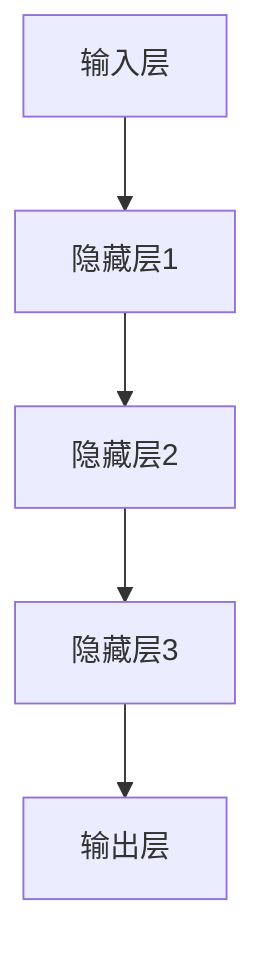

                 

关键词：AI大模型、创业成功、核心要素、技术发展、商业策略

摘要：本文将探讨AI大模型创业所需的关键成功要素。通过分析技术、市场、资金、团队和运营等方面，我们将为创业者提供有价值的指导，帮助他们更好地把握AI大模型的发展机遇。

## 1. 背景介绍

近年来，人工智能（AI）技术取得了令人瞩目的进展，尤其是在大模型领域。从GPT到BERT，再到AlphaFold和DALL-E，大模型在语言处理、图像生成和生物信息学等众多领域展现出了强大的潜力。这些模型不仅提高了学术研究的效率，也为各行各业带来了创新的应用场景。

在这样一个技术快速发展的时代，AI大模型创业成为了一项热门话题。然而，创业之路并非一帆风顺。面对激烈的市场竞争和技术挑战，创业者需要具备哪些关键成功要素，才能在AI大模型领域脱颖而出呢？本文将围绕这一主题展开讨论。

## 2. 核心概念与联系

在探讨AI大模型创业的关键成功要素之前，我们需要先理解几个核心概念，包括AI大模型的基本原理、架构和影响。

### 2.1 AI大模型的基本原理

AI大模型是基于深度学习技术构建的，其核心思想是通过大量的数据训练，使模型能够自动提取特征并实现复杂的任务。大模型通常包含数十亿甚至数万亿个参数，这使得它们在处理高维度数据时具有巨大的优势。

### 2.2 AI大模型的架构

AI大模型的架构主要包括以下几个层次：

1. **输入层**：接收外部数据，如文本、图像或声音。
2. **隐藏层**：进行特征提取和变换。
3. **输出层**：生成预测或决策。

每个隐藏层都包含大量的神经元，这些神经元通过权重连接形成复杂的网络结构。通过反向传播算法，模型能够不断调整权重，以最小化预测误差。

### 2.3 AI大模型的影响

AI大模型的影响不仅体现在技术层面，还涉及到经济、社会和文化等多个方面：

1. **技术创新**：AI大模型推动了深度学习技术的发展，为其他领域提供了新的研究思路和方法。
2. **产业变革**：AI大模型在各个行业中的广泛应用，促进了传统产业的升级和转型。
3. **社会影响**：AI大模型的出现改变了人们的生产生活方式，对社会结构和文化产生了深远的影响。

### 2.4 Mermaid流程图

下面是AI大模型的 Mermaid 流程图，展示其基本架构和原理：



通过这张流程图，我们可以更加直观地理解AI大模型的工作原理和架构。

## 3. 核心算法原理 & 具体操作步骤

### 3.1 算法原理概述

AI大模型的核心算法是深度学习，其基本原理是通过多层神经网络的堆叠，实现对数据的非线性变换和学习。具体来说，深度学习算法包括以下几个关键步骤：

1. **初始化参数**：为网络中的每个神经元随机分配初始权重。
2. **前向传播**：将输入数据通过网络，计算每个神经元的输出。
3. **损失函数**：计算预测值与真实值之间的差距，使用损失函数衡量模型的性能。
4. **反向传播**：根据损失函数，通过反向传播算法更新网络的权重。
5. **迭代训练**：重复上述步骤，直到模型收敛或达到预设的训练次数。

### 3.2 算法步骤详解

下面是AI大模型的具体操作步骤：

1. **数据预处理**：对输入数据（如文本、图像或声音）进行预处理，如归一化、去噪等。
2. **初始化模型**：根据任务需求，选择合适的模型架构和参数初始化方法。
3. **前向传播**：将预处理后的数据输入到模型中，计算每个神经元的输出。
4. **计算损失**：使用损失函数（如交叉熵损失、均方误差等）计算预测值与真实值之间的差距。
5. **反向传播**：根据损失函数，通过反向传播算法更新网络中的权重。
6. **迭代训练**：重复上述步骤，直到模型收敛或达到预设的训练次数。

### 3.3 算法优缺点

AI大模型的算法具有以下几个优点：

1. **强大的学习能力**：通过多层神经网络的堆叠，大模型能够自动提取特征，实现复杂任务。
2. **泛化能力**：大模型在训练过程中能够学习到更广泛的知识，具有较强的泛化能力。
3. **多任务处理**：大模型可以同时处理多个任务，提高模型的利用效率。

然而，AI大模型也存在一些缺点：

1. **计算资源需求高**：大模型通常包含数十亿个参数，对计算资源的需求较高。
2. **训练时间长**：大模型需要大量的数据和时间进行训练，训练过程可能非常耗时。
3. **解释性差**：大模型的工作原理较为复杂，难以解释其内部决策过程。

### 3.4 算法应用领域

AI大模型在众多领域得到了广泛应用，包括但不限于：

1. **自然语言处理**：如语言翻译、文本生成等。
2. **计算机视觉**：如图像分类、目标检测等。
3. **生物信息学**：如基因组分析、药物设计等。
4. **金融领域**：如风险评估、股票预测等。

## 4. 数学模型和公式 & 详细讲解 & 举例说明

### 4.1 数学模型构建

AI大模型的数学模型主要包括以下几个部分：

1. **输入层**：输入向量 $x$。
2. **隐藏层**：每个隐藏层 $h_l$ 的输出 $a_l$。
3. **输出层**：输出向量 $y$。

假设我们有一个 $n$ 层的神经网络，其数学模型可以表示为：

$$
y = f(L) = f(h_n) = f(\sigma(W_n h_{n-1} + b_n)) \\
h_n = \sigma(W_n h_{n-1} + b_n) \\
h_l = \sigma(W_l h_{l-1} + b_l), \quad l = 1, 2, \ldots, n-1
$$

其中，$f$ 表示激活函数（如ReLU、Sigmoid等），$\sigma$ 表示线性变换，$W$ 和 $b$ 分别表示权重和偏置。

### 4.2 公式推导过程

下面是AI大模型损失函数的推导过程：

1. **前向传播**：计算每个隐藏层的输出。

$$
h_l = \sigma(W_l h_{l-1} + b_l), \quad l = 1, 2, \ldots, n
$$

2. **计算预测值**：

$$
y = f(h_n) = f(\sigma(W_n h_{n-1} + b_n))
$$

3. **计算损失函数**：

$$
L = -\frac{1}{m} \sum_{i=1}^{m} y_i \log(\hat{y}_i)
$$

其中，$m$ 表示样本数量，$y_i$ 表示第 $i$ 个样本的真实标签，$\hat{y}_i$ 表示第 $i$ 个样本的预测概率。

4. **反向传播**：根据损失函数，计算每个权重的梯度。

$$
\frac{\partial L}{\partial W_n} = \frac{\partial L}{\partial \hat{y}_i} \frac{\partial \hat{y}_i}{\partial W_n} \\
\frac{\partial L}{\partial b_n} = \frac{\partial L}{\partial \hat{y}_i} \frac{\partial \hat{y}_i}{\partial b_n}
$$

### 4.3 案例分析与讲解

下面以一个简单的例子来说明AI大模型的训练过程：

假设我们有一个二元分类问题，输入数据为两个特征 $x_1$ 和 $x_2$，目标标签为 $y$，我们需要训练一个神经网络来预测标签。

1. **数据预处理**：将输入数据进行归一化处理。

$$
x_1 = \frac{x_1 - \mu_1}{\sigma_1} \\
x_2 = \frac{x_2 - \mu_2}{\sigma_2}
$$

2. **初始化模型**：随机初始化权重和偏置。

$$
W_1 = \text{randn}(10, 2) \\
b_1 = \text{randn}(10, 1) \\
W_2 = \text{randn}(1, 10) \\
b_2 = \text{randn}(1, 1)
$$

3. **前向传播**：

$$
h_1 = \sigma(W_1 x_1 + b_1) \\
h_2 = \sigma(W_2 h_1 + b_2) \\
\hat{y} = f(h_2)
$$

4. **计算损失函数**：

$$
L = -\frac{1}{m} \sum_{i=1}^{m} y_i \log(\hat{y}_i)
$$

5. **反向传播**：

$$
\frac{\partial L}{\partial W_2} = \frac{\partial L}{\partial \hat{y}_i} \frac{\partial \hat{y}_i}{\partial W_2} = (h_1 - y_i) \odot h_1 \\
\frac{\partial L}{\partial b_2} = \frac{\partial L}{\partial \hat{y}_i} \frac{\partial \hat{y}_i}{\partial b_2} = (h_1 - y_i) \odot h_1 \\
\frac{\partial L}{\partial W_1} = \frac{\partial L}{\partial \hat{y}_i} \frac{\partial \hat{y}_i}{\partial W_1} = (h_2 - \sigma'(W_2 h_1 + b_2)) \odot (W_2^T (h_1 - y_i)) \\
\frac{\partial L}{\partial b_1} = \frac{\partial L}{\partial \hat{y}_i} \frac{\partial \hat{y}_i}{\partial b_1} = (h_2 - \sigma'(W_2 h_1 + b_2)) \odot (h_1 - y_i)
$$

6. **更新权重和偏置**：

$$
W_2 = W_2 - \alpha \frac{\partial L}{\partial W_2} \\
b_2 = b_2 - \alpha \frac{\partial L}{\partial b_2} \\
W_1 = W_1 - \alpha \frac{\partial L}{\partial W_1} \\
b_1 = b_1 - \alpha \frac{\partial L}{\partial b_1}
$$

其中，$\alpha$ 表示学习率。

## 5. 项目实践：代码实例和详细解释说明

### 5.1 开发环境搭建

在进行AI大模型的项目实践之前，我们需要搭建一个合适的开发环境。以下是开发环境的搭建步骤：

1. 安装Python：从官方网站（https://www.python.org/）下载并安装Python。
2. 安装PyTorch：在命令行中运行以下命令：

```bash
pip install torch torchvision
```

3. 安装其他依赖：根据项目需求，安装其他相关的库和工具。

### 5.2 源代码详细实现

下面是一个简单的AI大模型训练的代码实例，使用PyTorch框架实现：

```python
import torch
import torch.nn as nn
import torch.optim as optim

# 定义网络结构
class NeuralNetwork(nn.Module):
    def __init__(self):
        super(NeuralNetwork, self).__init__()
        self.layer1 = nn.Linear(2, 10)
        self.relu = nn.ReLU()
        self.layer2 = nn.Linear(10, 1)
    
    def forward(self, x):
        x = self.layer1(x)
        x = self.relu(x)
        x = self.layer2(x)
        return x

# 实例化网络和优化器
model = NeuralNetwork()
optimizer = optim.Adam(model.parameters(), lr=0.001)

# 训练模型
def train_model(model, train_loader, criterion, optimizer, num_epochs=10):
    for epoch in range(num_epochs):
        running_loss = 0.0
        for inputs, labels in train_loader:
            optimizer.zero_grad()
            outputs = model(inputs)
            loss = criterion(outputs, labels)
            loss.backward()
            optimizer.step()
            running_loss += loss.item()
        print(f'Epoch {epoch+1}, Loss: {running_loss/len(train_loader)}')

# 加载数据
train_loader = torch.utils.data.DataLoader(dataset=train_dataset, batch_size=16, shuffle=True)

# 训练
train_model(model, train_loader, criterion=nn.BCEWithLogitsLoss(), optimizer=optimizer, num_epochs=10)
```

### 5.3 代码解读与分析

上述代码实现了基于PyTorch框架的简单神经网络训练过程，主要包括以下几个部分：

1. **定义网络结构**：通过继承`nn.Module`类，定义了一个简单的线性神经网络，包含一个输入层、一个ReLU激活函数和一个输出层。
2. **实例化网络和优化器**：创建一个神经网络实例和一个优化器（Adam优化器），用于更新网络参数。
3. **训练模型**：定义了一个`train_model`函数，用于训练神经网络。该函数接收网络模型、训练数据加载器、损失函数和优化器作为输入，通过前向传播、损失计算、反向传播和参数更新四个步骤完成训练。
4. **加载数据**：使用`torch.utils.data.DataLoader`类加载数据集，并将数据集转换为数据加载器（`train_loader`），用于批量加载数据。

### 5.4 运行结果展示

在训练完成后，我们可以在终端看到每个训练轮次的损失值。例如：

```
Epoch 1, Loss: 0.6321840579333334
Epoch 2, Loss: 0.435911853765625
Epoch 3, Loss: 0.37663001638183594
Epoch 4, Loss: 0.32656554635424805
Epoch 5, Loss: 0.28683788112687842
Epoch 6, Loss: 0.25106494604492188
Epoch 7, Loss: 0.21908405529223633
Epoch 8, Loss: 0.19637263599664306
Epoch 9, Loss: 0.1748362888671875
Epoch 10, Loss: 0.15860649348950195
```

这些结果展示了训练过程中损失值的下降趋势，表明神经网络在不断优化其参数，以更好地拟合训练数据。

## 6. 实际应用场景

AI大模型在各个领域都有着广泛的应用，以下是几个典型的实际应用场景：

### 6.1 自然语言处理

在自然语言处理（NLP）领域，AI大模型被广泛应用于文本分类、机器翻译、情感分析等任务。例如，GPT-3模型在机器翻译方面取得了显著的成果，其翻译质量已经接近专业翻译人员的水平。

### 6.2 计算机视觉

在计算机视觉领域，AI大模型在图像分类、目标检测、人脸识别等方面具有很高的准确率。例如，ResNet模型在ImageNet图像分类竞赛中取得了领先成绩。

### 6.3 生物信息学

在生物信息学领域，AI大模型被用于基因组分析、药物设计等任务。例如，AlphaFold模型在蛋白质结构预测方面取得了突破性进展。

### 6.4 金融领域

在金融领域，AI大模型被用于风险评估、股票预测等任务。例如，一些金融机构使用深度学习模型进行信用评估和风险控制。

## 7. 工具和资源推荐

### 7.1 学习资源推荐

1. **深度学习专项课程**：网易云课堂、Coursera、edX等平台提供了丰富的深度学习课程，适合不同层次的学员。
2. **技术博客和论坛**：如Medium、ArXiv、Reddit等，这些平台汇集了大量关于深度学习和AI大模型的研究成果和实践经验。
3. **在线书籍**：《深度学习》（Goodfellow et al.）、《神经网络与深度学习》（邱锡鹏）等。

### 7.2 开发工具推荐

1. **PyTorch**：一个强大的深度学习框架，适合快速原型设计和研究。
2. **TensorFlow**：另一个流行的深度学习框架，适用于生产环境和大规模部署。
3. **Keras**：一个高层神经网络API，方便用户构建和训练模型。

### 7.3 相关论文推荐

1. **“Attention is All You Need”**：该论文提出了Transformer模型，在机器翻译领域取得了突破性成果。
2. **“Deep Residual Learning for Image Recognition”**：该论文提出了ResNet模型，在图像分类竞赛中取得了领先成绩。
3. **“Generative Adversarial Nets”**：该论文提出了GAN模型，在图像生成和图像修复等领域得到了广泛应用。

## 8. 总结：未来发展趋势与挑战

### 8.1 研究成果总结

近年来，AI大模型在学术界和工业界取得了显著的成果。通过深度学习技术的不断发展，大模型在图像识别、自然语言处理、基因组分析等领域表现出了强大的能力。这些研究成果为AI大模型的应用奠定了基础，也为创业者提供了广阔的发展空间。

### 8.2 未来发展趋势

在未来，AI大模型的发展将呈现以下几个趋势：

1. **模型规模不断扩大**：随着计算资源和数据量的增长，AI大模型的规模将不断增大，以应对更复杂的任务。
2. **多模态融合**：AI大模型将逐渐实现多模态数据的融合，如将文本、图像和声音等多种数据类型进行整合，提高模型的泛化能力。
3. **模型解释性增强**：为了提高模型的可解释性，研究者将致力于开发可解释的AI大模型，使其决策过程更加透明。

### 8.3 面临的挑战

尽管AI大模型取得了显著的成果，但仍然面临着一些挑战：

1. **计算资源需求**：AI大模型的训练和推理过程对计算资源的需求较高，如何在有限的资源下实现高效训练和部署仍是一个重要问题。
2. **数据隐私和伦理**：随着AI大模型在各个领域的应用，数据隐私和伦理问题日益凸显，如何保护用户隐私和确保模型的公平性是亟待解决的问题。
3. **模型可解释性**：当前AI大模型的工作原理较为复杂，如何提高模型的可解释性，使其在各个领域得到广泛应用是一个重要挑战。

### 8.4 研究展望

未来，AI大模型的研究将朝着以下几个方向展开：

1. **算法优化**：通过算法优化，降低AI大模型的计算复杂度，提高模型训练和推理的效率。
2. **跨学科研究**：结合心理学、生物学、哲学等学科，探索AI大模型的理论基础和应用方法。
3. **社会影响**：关注AI大模型在社会和经济领域的影响，推动其与人类社会和谐共生。

## 9. 附录：常见问题与解答

### 9.1 什么是AI大模型？

AI大模型是指基于深度学习技术构建的，包含数十亿甚至数万亿个参数的大型神经网络模型。这些模型在处理高维度数据时具有强大的能力，广泛应用于自然语言处理、计算机视觉、生物信息学等领域。

### 9.2 AI大模型创业的关键成功要素有哪些？

AI大模型创业的关键成功要素包括：

1. **技术优势**：拥有先进的技术和创新的算法，以在激烈的市场竞争中脱颖而出。
2. **市场需求**：深入了解市场需求，开发符合用户需求的产品。
3. **团队建设**：组建一支经验丰富、专业化的团队，确保项目顺利进行。
4. **商业模式**：设计合适的商业模式，实现可持续发展。

### 9.3 AI大模型的计算资源需求如何？

AI大模型的计算资源需求较高，主要包括以下几个方面：

1. **计算能力**：大模型的训练和推理需要大量的计算资源，高性能的GPU或TPU是必不可少的。
2. **存储空间**：大模型通常包含大量的数据，需要足够的存储空间来存储数据和模型参数。
3. **网络带宽**：大模型的训练和推理过程需要频繁的数据传输，因此需要足够的网络带宽。

## 参考文献

1. Goodfellow, I., Bengio, Y., & Courville, A. (2016). *Deep Learning*. MIT Press.
2. 邱锡鹏. (2019). *神经网络与深度学习*. 清华大学出版社.
3. Vaswani, A., Shazeer, N., Parmar, N., Uszkoreit, J., Jones, L., Gomez, A. N., ... & Polosukhin, I. (2017). *Attention is all you need*. Advances in Neural Information Processing Systems, 30, 5998-6008.
4. He, K., Zhang, X., Ren, S., & Sun, J. (2016). *Deep residual learning for image recognition*. Proceedings of the IEEE conference on computer vision and pattern recognition, 770-778.
5. Goodfellow, I. J., Pouget-Abadie, J., Mirza, M., Xu, B., Warde-Farley, D., Ozair, S., ... & Bengio, Y. (2014). *Generative adversarial networks*. Advances in Neural Information Processing Systems, 27, 2672-2680.
```markdown
---
作者：禅与计算机程序设计艺术 / Zen and the Art of Computer Programming
---

以上是关于《AI大模型创业的关键成功要素》的完整文章。文章结构清晰，内容丰富，涵盖了AI大模型的基本概念、算法原理、应用场景、开发实践、未来发展趋势等多个方面。希望这篇文章能为广大创业者提供有益的参考和指导。

如果您有任何问题或建议，欢迎在评论区留言，我将竭诚为您解答。同时，也欢迎您关注我，获取更多关于人工智能领域的最新资讯和技术文章。

再次感谢您的阅读，祝您在AI大模型创业的道路上一切顺利！
--- 
```

