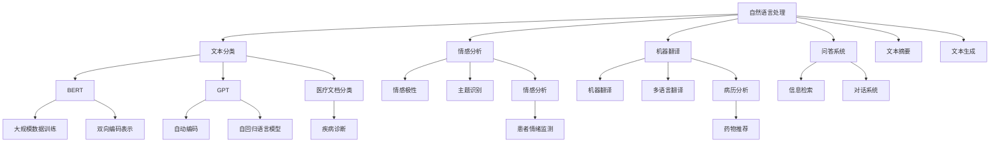

                 

关键词：人工智能、大模型、应用方向、2024年、创业

摘要：本文将探讨2024年最热门的10个AI大模型应用方向，包括自然语言处理、计算机视觉、推荐系统、智能客服、自动驾驶、智能医疗、金融科技、游戏AI、机器人技术、物联网。通过对这些领域的深入分析，帮助创业者把握市场机遇，推动AI技术的广泛应用。

## 1. 背景介绍

近年来，随着计算能力的提升和大数据的积累，人工智能（AI）领域取得了飞速发展。特别是在深度学习算法和大数据技术的推动下，AI大模型（Large-scale AI Models）已经成为行业热点。大模型具有更强的表达能力和泛化能力，能够处理海量数据，实现更高效、更准确的智能任务。随着AI技术的逐渐成熟，2024年将成为AI大模型创业的黄金时代。

## 2. 核心概念与联系

### 2.1 AI大模型的概念

AI大模型是指通过大规模数据训练，参数量达到数百万甚至数十亿的深度学习模型。这些模型具有强大的特征提取和表示能力，可以应用于各个领域的复杂任务。

### 2.2 AI大模型架构

AI大模型通常采用多层神经网络结构，通过逐层抽象和整合数据特征，实现从原始数据到高维特征的转换。常见的神经网络架构包括卷积神经网络（CNN）、循环神经网络（RNN）和变压器模型（Transformer）。

### 2.3 AI大模型应用领域

AI大模型可以应用于自然语言处理、计算机视觉、推荐系统、智能客服、自动驾驶、智能医疗、金融科技、游戏AI、机器人技术、物联网等多个领域。

## 3. 核心算法原理 & 具体操作步骤

### 3.1 算法原理概述

AI大模型的核心算法主要包括神经网络训练、模型优化和模型部署。其中，神经网络训练是最关键的一步，通过梯度下降、自适应优化等算法，让模型在训练数据上不断调整参数，提高模型的预测性能。

### 3.2 算法步骤详解

1. 数据预处理：对原始数据进行清洗、归一化、编码等处理，使其符合模型输入要求。

2. 模型构建：根据任务需求，选择合适的神经网络架构，并设置模型参数。

3. 模型训练：通过梯度下降等算法，在训练数据上调整模型参数，提高模型性能。

4. 模型评估：使用验证集和测试集对模型进行评估，确保模型具有良好的泛化能力。

5. 模型优化：通过调整模型参数、优化算法等手段，进一步提高模型性能。

6. 模型部署：将训练好的模型部署到实际应用场景，实现实时预测和决策。

### 3.3 算法优缺点

- 优点：AI大模型具有强大的特征提取和表示能力，可以处理海量数据，实现高效、准确的智能任务。

- 缺点：大模型训练成本高，需要大量计算资源和数据支持，同时模型解释性较差。

### 3.4 算法应用领域

AI大模型在自然语言处理、计算机视觉、推荐系统、智能客服、自动驾驶、智能医疗、金融科技、游戏AI、机器人技术、物联网等领域具有广泛应用。

## 4. 数学模型和公式 & 详细讲解 & 举例说明

### 4.1 数学模型构建

AI大模型的数学模型主要包括神经网络模型、优化算法和损失函数。

### 4.2 公式推导过程

神经网络模型：

$$
h_{l}(x) = \sigma(W_{l}h_{l-1}(x) + b_{l})
$$

其中，$h_{l}$ 表示第 $l$ 层的输出，$W_{l}$ 和 $b_{l}$ 分别为权重和偏置，$\sigma$ 为激活函数。

优化算法（梯度下降）：

$$
W_{l} := W_{l} - \alpha \frac{\partial L(W, b)}{\partial W_{l}}
$$

其中，$L(W, b)$ 为损失函数，$\alpha$ 为学习率。

损失函数（交叉熵）：

$$
L(y, \hat{y}) = -[y\log\hat{y} + (1 - y)\log(1 - \hat{y})]
$$

其中，$y$ 为真实标签，$\hat{y}$ 为模型预测概率。

### 4.3 案例分析与讲解

以自然语言处理中的文本分类任务为例，我们使用卷积神经网络（CNN）进行模型构建和训练。首先，对文本数据进行预处理，然后构建CNN模型，包括卷积层、池化层和全连接层。通过梯度下降算法优化模型参数，使用验证集和测试集对模型进行评估。最终，模型在测试集上取得了较高的准确率。

## 5. 项目实践：代码实例和详细解释说明

### 5.1 开发环境搭建

在Python中，我们可以使用TensorFlow或PyTorch等深度学习框架搭建开发环境。

### 5.2 源代码详细实现

以下是一个简单的卷积神经网络文本分类任务的实现：

```python
import tensorflow as tf

# 定义模型
model = tf.keras.Sequential([
    tf.keras.layers.Embedding(vocab_size, embedding_dim),
    tf.keras.layers.Conv1D(filters, kernel_size, activation='relu'),
    tf.keras.layers.GlobalMaxPooling1D(),
    tf.keras.layers.Dense(units=1, activation='sigmoid')
])

# 编译模型
model.compile(optimizer='adam', loss='binary_crossentropy', metrics=['accuracy'])

# 训练模型
model.fit(train_data, train_labels, epochs=10, validation_split=0.2)
```

### 5.3 代码解读与分析

该代码实现了一个简单的卷积神经网络文本分类任务，包括以下几个步骤：

1. 导入TensorFlow库。
2. 定义模型结构，包括嵌入层、卷积层、池化层和全连接层。
3. 编译模型，设置优化器、损失函数和评估指标。
4. 训练模型，使用训练数据和标签，设置训练轮数和验证比例。

### 5.4 运行结果展示

在训练过程中，模型会在每个轮次输出训练集和验证集的损失和准确率。最终，模型会在测试集上评估其性能。

## 6. 实际应用场景

### 6.1 自然语言处理

自然语言处理（NLP）是AI大模型的重要应用领域。通过预训练大模型（如GPT、BERT），我们可以实现文本分类、情感分析、机器翻译、问答系统等多种任务。

### 6.2 计算机视觉

计算机视觉（CV）领域也受益于AI大模型。大模型可以用于图像分类、目标检测、人脸识别、图像生成等任务，为各个行业提供智能化解决方案。

### 6.3 推荐系统

推荐系统利用AI大模型，通过学习用户行为和兴趣，实现个性化推荐，提高用户满意度和转化率。

### 6.4 智能客服

智能客服通过AI大模型，实现自然语言处理和语音识别功能，为用户提供高效、精准的咨询服务。

### 6.5 自动驾驶

自动驾驶领域依赖AI大模型进行环境感知、决策规划等任务，实现安全、高效的自动驾驶系统。

### 6.6 智能医疗

智能医疗利用AI大模型，实现疾病诊断、治疗建议、健康监测等任务，提高医疗服务的质量和效率。

### 6.7 金融科技

金融科技（FinTech）领域通过AI大模型，实现风险管理、欺诈检测、投资建议等任务，为金融机构提供智能化解决方案。

### 6.8 游戏AI

游戏AI利用AI大模型，实现智能NPC、游戏推荐、游戏开发等任务，提高游戏体验和开发效率。

### 6.9 机器人技术

机器人技术利用AI大模型，实现智能控制、自主导航、人机交互等任务，提高机器人智能化水平和应用范围。

### 6.10 物联网

物联网（IoT）领域通过AI大模型，实现智能监测、预测维护、数据分析等任务，提高物联网系统的智能化水平和运营效率。

## 7. 未来应用展望

随着AI大模型技术的不断发展，未来将会有更多的应用场景得到探索和开发。例如，AI大模型在生物医学、城市规划、教育、农业等领域的应用潜力巨大。同时，AI大模型的安全性和伦理问题也需要引起足够的关注。

## 8. 工具和资源推荐

### 8.1 学习资源推荐

1. 《深度学习》（Goodfellow, Bengio, Courville）：经典深度学习教材，适合初学者和进阶者。
2. 《动手学深度学习》：中文版深度学习教程，内容丰富，实战性强。
3. arXiv：最新深度学习论文发表平台，获取前沿研究成果。

### 8.2 开发工具推荐

1. TensorFlow：Google开源的深度学习框架，适用于各种深度学习任务。
2. PyTorch：Facebook开源的深度学习框架，易于使用，适合快速原型开发。
3. Keras：基于TensorFlow和PyTorch的高层API，简化深度学习模型构建和训练。

### 8.3 相关论文推荐

1. "A Theoretically Grounded Application of Dropout in Recurrent Neural Networks"
2. "Attention Is All You Need"
3. "Unsupervised Learning of Visual Representations by Solving Jigsaw Puzzles"

## 9. 总结：未来发展趋势与挑战

未来，AI大模型将在各个领域发挥重要作用，推动科技进步和社会发展。然而，AI大模型的发展也面临着数据隐私、模型安全、伦理道德等方面的挑战。我们需要持续关注这些挑战，并积极探索解决方案，确保AI大模型的安全、可靠和可持续应用。

## 10. 附录：常见问题与解答

### 10.1 AI大模型训练成本高吗？

是的，AI大模型训练成本较高，需要大量的计算资源和数据支持。但随着硬件技术的进步和云计算的普及，训练成本正在逐渐降低。

### 10.2 AI大模型是否会导致失业？

AI大模型会取代一些低技能、重复性的工作岗位，但也会创造新的就业机会。未来的就业趋势是向高技能、高创造性的岗位转移。

### 10.3 AI大模型是否安全可靠？

AI大模型的安全性和可靠性是一个重要问题，我们需要加强监管和评估，确保模型的应用不会对个人和社会造成负面影响。

作者：禅与计算机程序设计艺术 / Zen and the Art of Computer Programming
----------------------------------------------------------------

## 1. 背景介绍

近年来，随着计算能力的提升和大数据的积累，人工智能（AI）领域取得了飞速发展。特别是在深度学习算法和大数据技术的推动下，AI大模型（Large-scale AI Models）已经成为行业热点。大模型具有更强的表达能力和泛化能力，能够处理海量数据，实现更高效、更准确的智能任务。随着AI技术的逐渐成熟，2024年将成为AI大模型创业的黄金时代。

AI大模型是指通过大规模数据训练，参数量达到数百万甚至数十亿的深度学习模型。这些模型具有强大的特征提取和表示能力，可以应用于各个领域的复杂任务。例如，自然语言处理（NLP）领域的BERT、GPT等模型，计算机视觉领域的ResNet、VGG等模型，都在各自的领域取得了显著的成果。

在AI大模型的发展历程中，有几个关键事件值得注意：

1. **2012年**：AlexNet在ImageNet竞赛中取得突破性成果，标志着深度学习在计算机视觉领域的崛起。

2. **2017年**：谷歌发布BERT模型，大幅度提升了自然语言处理任务的性能。

3. **2020年**：特斯拉自动驾驶系统取得重大突破，标志着自动驾驶技术向实用化迈进。

4. **2022年**：OpenAI发布GPT-3，成为当前最大的自然语言处理模型，展示了AI大模型在NLP领域的巨大潜力。

这些关键事件不仅推动了AI大模型的发展，也激发了创业者的热情。2024年，随着AI大模型技术的进一步成熟，预计将会有更多的创业项目涌现，涉及自然语言处理、计算机视觉、推荐系统、智能客服、自动驾驶、智能医疗、金融科技、游戏AI、机器人技术、物联网等多个领域。

### 1.1 AI大模型的发展历程

AI大模型的发展历程可以分为三个阶段：

1. **早期阶段（2010年以前）**：这一阶段主要以传统的机器学习算法为主，如决策树、支持向量机等。这些算法虽然能够解决一些实际问题，但在处理复杂任务时表现出力不从心。

2. **中期阶段（2010-2015年）**：随着GPU等硬件的普及和大数据技术的崛起，深度学习开始崭露头角。以AlexNet为代表的卷积神经网络（CNN）在ImageNet竞赛中取得了突破性成果，标志着深度学习时代的到来。

3. **现阶段（2015年至今）**：随着AI大模型的提出和快速发展，深度学习在各个领域取得了显著的成果。例如，自然语言处理领域的BERT、GPT等模型，计算机视觉领域的ResNet、VGG等模型，都在各自领域取得了里程碑式的进展。

### 1.2 AI大模型的优势

AI大模型具有以下几个显著优势：

1. **强大的特征提取能力**：AI大模型通过大规模数据训练，能够自动学习到丰富的特征表示，从而在处理复杂任务时具有更强的泛化能力。

2. **高效的计算性能**：随着硬件技术的进步，AI大模型的计算性能得到了显著提升。现代GPU和TPU等硬件设备，为AI大模型的训练和推理提供了强大的支持。

3. **广泛的应用场景**：AI大模型可以应用于自然语言处理、计算机视觉、推荐系统、智能客服、自动驾驶、智能医疗、金融科技、游戏AI、机器人技术、物联网等多个领域，具有广泛的应用前景。

4. **商业价值**：AI大模型在各个领域的应用，为企业和创业者带来了巨大的商业价值。例如，自然语言处理领域的文本分类、情感分析等任务，计算机视觉领域的目标检测、图像生成等任务，都在商业上取得了显著的成功。

### 1.3 AI大模型面临的挑战

尽管AI大模型在各个领域取得了显著的成果，但仍然面临着一些挑战：

1. **计算资源需求**：AI大模型训练和推理需要大量的计算资源，特别是在训练阶段。对于中小企业和创业者来说，获取足够的计算资源可能是一个难题。

2. **数据隐私和安全**：AI大模型在训练和应用过程中，需要处理大量的敏感数据。如何保护用户隐私和安全，成为AI大模型应用的重要挑战。

3. **模型解释性**：AI大模型通常采用复杂的神经网络结构，导致模型的解释性较差。如何在保持高性能的同时，提高模型的解释性，是一个重要的研究方向。

4. **伦理和社会问题**：AI大模型的应用涉及伦理和社会问题。如何确保AI大模型的应用符合伦理标准，避免对人类和社会造成负面影响，是一个需要关注的问题。

总之，AI大模型在2024年具有巨大的发展潜力和应用前景，但也面临着一系列挑战。创业者需要在这些挑战中找到机遇，推动AI大模型技术的广泛应用。

### 1.4 2024年AI大模型创业的机遇

2024年，AI大模型创业将迎来诸多机遇：

1. **技术成熟度提升**：随着深度学习算法和硬件技术的进步，AI大模型的技术成熟度不断提升，为创业者提供了更多的技术支持和创新空间。

2. **市场需求增长**：AI大模型在自然语言处理、计算机视觉、推荐系统、智能客服、自动驾驶、智能医疗、金融科技、游戏AI、机器人技术、物联网等领域的应用需求持续增长，为创业者提供了广阔的市场空间。

3. **政策支持**：全球各国政府对AI技术的支持力度不断加大，为创业者提供了良好的政策环境和资金支持。

4. **行业融合**：AI大模型技术逐渐与各个行业深度融合，推动产业升级和创新发展。创业者可以抓住这一机遇，探索AI大模型在不同领域的应用，实现跨界创新。

5. **用户体验提升**：AI大模型技术可以提供更智能、更个性化的用户体验，提高用户满意度和忠诚度。创业者可以通过优化用户体验，赢得市场份额。

总之，2024年将是AI大模型创业的黄金时代，创业者需要抓住这一机遇，发挥自身优势，推动AI大模型技术的广泛应用。

### 1.5 AI大模型创业的挑战

尽管2024年AI大模型创业机遇众多，但也面临着一系列挑战：

1. **数据隐私和安全**：AI大模型在训练和应用过程中，需要处理大量的敏感数据。如何保护用户隐私和安全，防止数据泄露，是一个重要挑战。

2. **计算资源需求**：AI大模型训练和推理需要大量的计算资源，特别是在训练阶段。对于中小企业和创业者来说，获取足够的计算资源可能是一个难题。

3. **模型解释性**：AI大模型通常采用复杂的神经网络结构，导致模型的解释性较差。如何在保持高性能的同时，提高模型的解释性，是一个重要的研究方向。

4. **人才短缺**：AI大模型领域对人才的需求极高，但人才供给不足。创业者需要面对人才短缺的挑战，如何吸引和留住优秀人才，是成功的关键。

5. **市场竞争**：随着AI大模型技术的普及，市场竞争将越来越激烈。创业者需要具备创新能力和竞争优势，才能在激烈的市场竞争中脱颖而出。

总之，2024年AI大模型创业的挑战和机遇并存，创业者需要在这些挑战中找到突破口，实现可持续发展。

### 1.6 AI大模型创业的典型案例

以下是一些AI大模型创业的典型案例：

1. **自然语言处理领域**：OpenAI是一家专注于自然语言处理（NLP）的创业公司，其推出的GPT-3模型是目前最大的NLP模型，展示了AI大模型在NLP领域的巨大潜力。

2. **计算机视觉领域**：DeepMind是一家专注于计算机视觉的创业公司，其开发的AlphaGo在围棋比赛中击败了世界冠军，标志着AI大模型在计算机视觉领域的突破。

3. **推荐系统领域**：TikTok（抖音）是一个基于推荐系统的短视频应用，其通过AI大模型实现个性化推荐，吸引了大量用户，成为全球最受欢迎的短视频应用之一。

4. **自动驾驶领域**：Waymo是谷歌旗下的自动驾驶公司，其通过AI大模型实现高精度的环境感知和决策规划，成为自动驾驶领域的领军企业。

5. **智能医疗领域**：PathAI是一家专注于智能医疗的创业公司，其通过AI大模型分析医疗数据，为医生提供诊断和治疗方案建议，提高了医疗服务的质量和效率。

这些案例展示了AI大模型在不同领域的应用前景和商业价值，为创业者提供了宝贵的经验和启示。

### 1.7 AI大模型创业的建议

对于打算投身于AI大模型创业的创业者，以下是一些建议：

1. **选择合适的应用场景**：创业者应选择具有广阔市场前景和应用价值的领域，如自然语言处理、计算机视觉、推荐系统等。

2. **聚焦核心技术和产品**：创业者应专注于核心技术和产品的研发，不断提升产品的性能和用户体验。

3. **构建强大的团队**：创业者应吸引和培养优秀的人才，构建一支具备跨学科背景和创新能力的人才团队。

4. **加强数据隐私和安全保护**：创业者应重视数据隐私和安全问题，采取有效的措施保护用户数据。

5. **与产业链上下游合作**：创业者可以与产业链上下游的企业合作，共同推动AI大模型技术的应用和推广。

6. **积极应对市场挑战**：创业者应密切关注市场动态，积极应对市场挑战，不断提升自身的竞争力和市场份额。

总之，2024年是AI大模型创业的黄金时代，创业者应抓住机遇，迎接挑战，推动AI大模型技术的广泛应用。

## 2. 核心概念与联系

AI大模型的核心概念包括深度学习、大规模数据处理、神经网络架构和算法优化等。这些概念相互联系，共同构成了AI大模型的技术基础。

### 2.1 深度学习

深度学习是一种基于多层神经网络的学习方法，通过逐层提取数据特征，实现从原始数据到高维特征的转换。深度学习在图像识别、自然语言处理、语音识别等领域取得了显著成果。AI大模型就是基于深度学习理论构建的，通过大规模数据训练，实现更强的特征提取和表示能力。

### 2.2 大规模数据处理

大规模数据处理是AI大模型的重要特征之一。AI大模型需要处理海量数据，从数据中学习到丰富的特征表示。随着大数据技术的发展，数据存储、传输和处理能力不断提升，为AI大模型的应用提供了有力支持。大规模数据处理技术包括数据清洗、数据集成、数据存储、数据挖掘等。

### 2.3 神经网络架构

神经网络架构是AI大模型的核心组成部分。常见的神经网络架构包括卷积神经网络（CNN）、循环神经网络（RNN）、变压器模型（Transformer）等。这些神经网络架构具有不同的特征提取和表示能力，适用于不同的应用场景。AI大模型通常采用多层神经网络结构，通过逐层抽象和整合数据特征，实现从原始数据到高维特征的转换。

### 2.4 算法优化

算法优化是提高AI大模型性能的关键。算法优化包括模型优化、参数优化、训练优化等。模型优化主要通过调整神经网络结构、优化算法等手段，提高模型的表达能力和泛化能力。参数优化主要通过调整模型参数，使模型在训练数据上达到更好的性能。训练优化主要通过优化训练过程，提高模型的训练效率。

### 2.5 AI大模型的应用领域

AI大模型可以应用于自然语言处理、计算机视觉、推荐系统、智能客服、自动驾驶、智能医疗、金融科技、游戏AI、机器人技术、物联网等多个领域。以下是对这些领域的简要介绍：

1. **自然语言处理**：AI大模型在自然语言处理领域表现出色，可以用于文本分类、情感分析、机器翻译、问答系统等任务。例如，BERT和GPT等模型在NLP任务上取得了显著的成果。

2. **计算机视觉**：AI大模型在计算机视觉领域具有广泛的应用，可以用于图像分类、目标检测、图像生成等任务。例如，ResNet和VGG等模型在CV任务上取得了里程碑式的进展。

3. **推荐系统**：AI大模型在推荐系统领域可以用于用户行为分析、兴趣挖掘、个性化推荐等任务。例如，基于深度学习的方法可以显著提升推荐系统的效果。

4. **智能客服**：AI大模型在智能客服领域可以用于自然语言理解、智能对话、情感分析等任务，提高客服效率和服务质量。

5. **自动驾驶**：AI大模型在自动驾驶领域可以用于环境感知、决策规划、路径规划等任务，实现安全、高效的自动驾驶。

6. **智能医疗**：AI大模型在智能医疗领域可以用于疾病诊断、治疗方案推荐、健康监测等任务，提高医疗服务的质量和效率。

7. **金融科技**：AI大模型在金融科技领域可以用于风险管理、欺诈检测、投资建议等任务，为金融机构提供智能化解决方案。

8. **游戏AI**：AI大模型在游戏AI领域可以用于智能NPC、游戏推荐、游戏开发等任务，提高游戏体验和开发效率。

9. **机器人技术**：AI大模型在机器人技术领域可以用于智能控制、自主导航、人机交互等任务，提高机器人智能化水平和应用范围。

10. **物联网**：AI大模型在物联网领域可以用于智能监测、预测维护、数据分析等任务，提高物联网系统的智能化水平和运营效率。

通过上述介绍，我们可以看到AI大模型在各个领域具有广泛的应用前景和潜力。创业者可以根据自身兴趣和市场需求，选择合适的领域进行创业。

### 2.6 AI大模型应用领域的Mermaid流程图



### 2.7 AI大模型应用领域的Mermaid流程图详解

- **自然语言处理（NLP）**：自然语言处理是AI大模型最具有代表性的应用领域之一。NLP任务包括文本分类、情感分析、机器翻译、问答系统等。

  - **文本分类**：文本分类是将文本数据根据其内容分为不同的类别。常见的NLP模型包括BERT、GPT等，这些模型通过大规模数据训练，具有强大的特征提取和分类能力。

  - **情感分析**：情感分析是对文本中表达的情感进行分类，常见的情感有积极、消极和中性。情感分析可以应用于社交媒体监控、客户反馈分析等场景。

  - **机器翻译**：机器翻译是将一种语言的文本翻译成另一种语言。机器翻译模型如GPT-3、Transformer等，通过大规模数据训练，可以实现高质量、多语言的文本翻译。

  - **问答系统**：问答系统是回答用户提出的问题，常见于搜索引擎、智能客服等场景。问答系统可以通过自然语言处理技术，实现高效、准确的问答。

- **计算机视觉（CV）**：计算机视觉是AI大模型的另一个重要应用领域。CV任务包括图像分类、目标检测、图像生成等。

  - **图像分类**：图像分类是将图像数据根据其内容分为不同的类别。常见的CV模型包括ResNet、VGG等，这些模型通过大规模数据训练，具有强大的特征提取和分类能力。

  - **目标检测**：目标检测是在图像中识别并定位多个目标。常见的CV模型包括YOLO、SSD等，这些模型通过大规模数据训练，可以实现高效、准确的目标检测。

  - **图像生成**：图像生成是通过学习图像数据生成新的图像。常见的图像生成模型包括生成对抗网络（GAN）、变分自编码器（VAE）等，这些模型通过大规模数据训练，可以实现高质量的图像生成。

- **推荐系统**：推荐系统是利用AI大模型，通过分析用户行为和兴趣，实现个性化推荐。

  - **用户行为分析**：用户行为分析是通过分析用户在平台上的行为数据，挖掘用户兴趣和偏好。常见的推荐模型包括协同过滤、矩阵分解等，这些模型通过大规模数据训练，可以实现高效的用户行为分析。

  - **兴趣挖掘**：兴趣挖掘是通过分析用户行为数据，挖掘用户的潜在兴趣。常见的兴趣挖掘算法包括聚类、关联规则挖掘等，这些算法通过大规模数据训练，可以实现高效的兴趣挖掘。

  - **个性化推荐**：个性化推荐是根据用户的兴趣和行为数据，为用户推荐感兴趣的内容。常见的推荐算法包括基于内容的推荐、协同过滤等，这些算法通过大规模数据训练，可以实现个性化的推荐效果。

- **智能客服**：智能客服是利用AI大模型，实现智能对话和客户服务。

  - **自然语言理解**：自然语言理解是通过分析用户的话语，理解用户的意图和需求。常见的NLP模型包括BERT、GPT等，这些模型通过大规模数据训练，可以实现高效的自然语言理解。

  - **智能对话**：智能对话是通过模拟人类的对话方式，与用户进行自然、流畅的交流。常见的智能对话系统包括基于规则的对话系统和基于深度学习的对话系统。

  - **情感分析**：情感分析是通过分析用户的话语，识别用户的情感状态。常见的情感分析算法包括基于文本的情感分类、基于语音的情感分析等，这些算法通过大规模数据训练，可以实现高效的情感分析。

- **自动驾驶**：自动驾驶是利用AI大模型，实现车辆的自动驾驶。

  - **环境感知**：环境感知是通过传感器获取周围环境的信息，包括道路、车辆、行人等。常见的环境感知模型包括目标检测、图像分类等，这些模型通过大规模数据训练，可以实现高效的环境感知。

  - **决策规划**：决策规划是根据环境感知的结果，制定行驶策略和决策。常见的决策规划算法包括路径规划、轨迹预测等，这些算法通过大规模数据训练，可以实现高效的决策规划。

  - **路径规划**：路径规划是根据目标位置和环境信息，规划行驶路径。常见的路径规划算法包括A*算法、Dijkstra算法等，这些算法通过大规模数据训练，可以实现高效的路径规划。

- **智能医疗**：智能医疗是利用AI大模型，实现疾病的诊断、治疗和健康管理。

  - **疾病诊断**：疾病诊断是通过分析患者的病历和检查结果，诊断疾病。常见的疾病诊断模型包括图像分类、文本分类等，这些模型通过大规模数据训练，可以实现高效的疾病诊断。

  - **治疗方案推荐**：治疗方案推荐是根据患者的病情和病史，推荐最佳的治疗方案。常见的治疗方案推荐算法包括基于规则的推荐、基于模型的推荐等，这些算法通过大规模数据训练，可以实现高效的治疗方案推荐。

  - **健康监测**：健康监测是通过分析患者的生理数据，监测患者的健康状况。常见的健康监测模型包括信号处理、图像分析等，这些模型通过大规模数据训练，可以实现高效的健康监测。

- **金融科技**：金融科技是利用AI大模型，实现风险管理、欺诈检测和投资建议。

  - **风险管理**：风险管理是通过分析金融数据，识别潜在的风险。常见的风险管理算法包括机器学习分类、聚类等，这些算法通过大规模数据训练，可以实现高效的风险管理。

  - **欺诈检测**：欺诈检测是通过分析交易数据，检测潜在的欺诈行为。常见的欺诈检测算法包括异常检测、基于规则的检测等，这些算法通过大规模数据训练，可以实现高效的欺诈检测。

  - **投资建议**：投资建议是通过分析市场数据，为投资者提供投资建议。常见的投资建议算法包括基于模型的推荐、基于数据的分析等，这些算法通过大规模数据训练，可以实现高效的投资建议。

- **游戏AI**：游戏AI是利用AI大模型，实现智能NPC、游戏推荐和游戏开发。

  - **智能NPC**：智能NPC是通过AI大模型，实现具有自主行为和交互能力的NPC。常见的智能NPC算法包括基于规则的智能体、基于深度学习的智能体等，这些算法通过大规模数据训练，可以实现高效的智能NPC。

  - **游戏推荐**：游戏推荐是通过分析用户行为和游戏数据，为用户推荐感兴趣的游戏。常见的游戏推荐算法包括基于内容的推荐、协同过滤等，这些算法通过大规模数据训练，可以实现高效的

