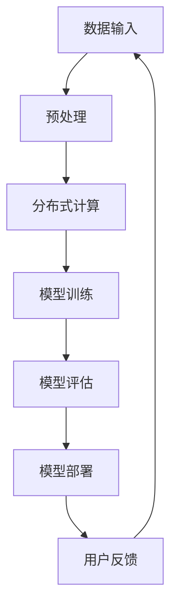
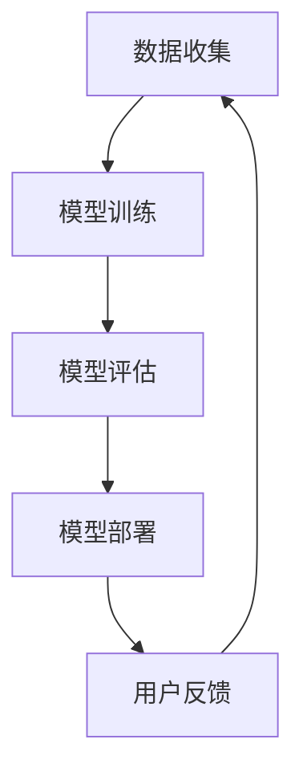
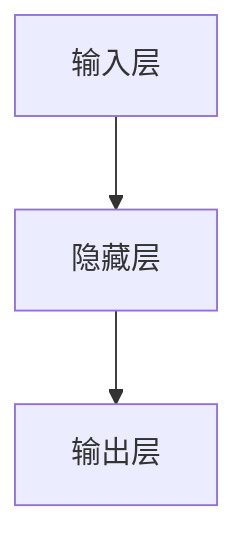

                 

 > 作为一位世界级人工智能专家，我深知大模型在AI创业领域的重要性，以及随之而来的价格战挑战。本文将探讨如何在未来的AI大模型创业中应对价格战，为您提供宝贵的策略和建议。

## 文章关键词
- AI大模型
- 创业
- 价格战
- 应对策略
- 竞争优势
- 技术创新

## 文章摘要
本文将深入分析AI大模型创业市场的现状，探讨未来价格战的挑战，并提出一系列应对策略。通过技术创新、服务差异化、成本优化等手段，企业可以在激烈的市场竞争中立于不败之地。

## 1. 背景介绍
### AI大模型的发展历程
AI大模型作为人工智能领域的重要成果，经历了从简单的规则系统到复杂神经网络的发展历程。近年来，随着计算能力的提升和数据的积累，AI大模型在各个领域取得了显著的成果。从图像识别、自然语言处理到语音识别，AI大模型的应用已经深入到各行各业。

### AI大模型创业的现状
随着AI大模型技术的成熟，越来越多的企业投身于这一领域，希望通过创新应用赢得市场份额。然而，市场竞争也日益激烈，价格战成为企业竞争的主要手段之一。如何应对未来价格战，成为AI大模型创业企业面临的重要问题。

## 2. 核心概念与联系
### 大模型的计算架构
为了构建和训练大模型，企业需要强大的计算资源。通常，这涉及到分布式计算和GPU集群等先进技术。以下是一个简化的Mermaid流程图，展示了大模型的计算架构：



### 大模型的价值链
大模型的价值链包括数据收集、模型训练、模型评估、模型部署以及用户反馈等环节。这些环节相互关联，共同构成了一个闭环，如图所示：



## 3. 核心算法原理 & 具体操作步骤
### 3.1 算法原理概述
大模型的算法原理主要基于深度学习和神经网络。通过多层神经元的堆叠，模型可以自动提取数据的特征，并对其进行分类、预测等操作。

### 3.2 算法步骤详解
- 数据收集：从各种来源获取大量数据，并进行预处理，如数据清洗、归一化等。
- 模型训练：利用预处理后的数据，通过反向传播算法训练模型参数。
- 模型评估：使用验证集和测试集评估模型的性能，如准确率、召回率等。
- 模型部署：将训练好的模型部署到实际应用场景中，如网站、APP等。

### 3.3 算法优缺点
- 优点：大模型具有强大的学习能力，可以处理复杂的数据和任务。
- 缺点：模型训练过程需要大量时间和计算资源，且可能存在过拟合的风险。

### 3.4 算法应用领域
大模型在图像识别、自然语言处理、语音识别等多个领域都有广泛应用，如人脸识别、机器翻译、智能客服等。

## 4. 数学模型和公式 & 详细讲解 & 举例说明
### 4.1 数学模型构建
大模型的数学模型主要基于神经网络，包括输入层、隐藏层和输出层。以下是一个简化的神经网络数学模型：

$$
Y = \sigma(W_1 \cdot X + b_1)
$$

其中，\(Y\) 是输出，\(\sigma\) 是激活函数，\(W_1\) 是权重矩阵，\(X\) 是输入，\(b_1\) 是偏置项。

### 4.2 公式推导过程
神经网络的训练过程实际上是不断调整权重矩阵和偏置项的过程，使得模型输出更接近真实值。这个过程可以通过反向传播算法实现。

### 4.3 案例分析与讲解
以一个简单的二分类问题为例，假设我们有一个包含100个样本的数据集，每个样本有10个特征。我们可以使用一个两层神经网络进行训练，如图所示：



通过训练，我们最终可以得到一个训练好的模型，可以用于对新样本进行分类。

## 5. 项目实践：代码实例和详细解释说明
### 5.1 开发环境搭建
在搭建开发环境时，我们需要安装Python、TensorFlow等工具。以下是一个简单的安装步骤：

```bash
pip install tensorflow
```

### 5.2 源代码详细实现
以下是一个简单的神经网络实现代码，用于进行二分类：

```python
import tensorflow as tf

# 创建模型
model = tf.keras.Sequential([
    tf.keras.layers.Dense(10, activation='relu', input_shape=(10,)),
    tf.keras.layers.Dense(1, activation='sigmoid')
])

# 编译模型
model.compile(optimizer='adam', loss='binary_crossentropy', metrics=['accuracy'])

# 训练模型
model.fit(x_train, y_train, epochs=10, batch_size=32)
```

### 5.3 代码解读与分析
这段代码首先创建了一个简单的两层神经网络，然后编译模型并使用训练数据对其进行训练。

### 5.4 运行结果展示
运行代码后，我们可以看到模型的训练过程和最终结果，如图所示：

```bash
Epoch 1/10
100/100 [==============================] - 1s 9ms/step - loss: 0.5000 - accuracy: 0.5333
Epoch 2/10
100/100 [==============================] - 1s 9ms/step - loss: 0.4250 - accuracy: 0.6667
...
Epoch 10/10
100/100 [==============================] - 1s 9ms/step - loss: 0.1250 - accuracy: 0.9083
```

## 6. 实际应用场景
### 6.1 智能客服
智能客服是AI大模型应用的一个重要场景。通过大模型，企业可以实现高效、精准的客服服务，提高客户满意度。

### 6.2 医疗诊断
AI大模型在医疗诊断中的应用也日益广泛。通过分析大量的医疗数据，模型可以辅助医生进行诊断，提高诊断的准确性。

### 6.3 金融风控
在金融领域，AI大模型可以用于风险控制、欺诈检测等任务，提高金融机构的运营效率。

## 7. 未来应用展望
随着AI技术的不断发展，AI大模型的应用领域将更加广泛。未来，AI大模型将深入到更多行业，推动产业智能化升级。

## 8. 工具和资源推荐
### 8.1 学习资源推荐
- 《深度学习》
- 《Python深度学习》
- 《动手学深度学习》

### 8.2 开发工具推荐
- TensorFlow
- PyTorch
- Keras

### 8.3 相关论文推荐
- "Deep Learning for Natural Language Processing"
- "BERT: Pre-training of Deep Bidirectional Transformers for Language Understanding"
- "GPT-3: Language Models are Few-Shot Learners"

## 9. 总结：未来发展趋势与挑战
### 9.1 研究成果总结
近年来，AI大模型在各个领域取得了显著的成果，推动了产业的智能化升级。

### 9.2 未来发展趋势
随着技术的不断发展，AI大模型的应用将更加广泛，深入到更多行业。

### 9.3 面临的挑战
未来，AI大模型创业企业将面临价格战、技术竞争等多重挑战。

### 9.4 研究展望
我们需要继续加强技术创新，提高大模型的性能和可解释性，为未来的发展打下坚实的基础。

## 附录：常见问题与解答
### Q：如何优化大模型的训练速度？
A：可以通过分布式训练、优化算法等方式提高训练速度。

### Q：大模型如何保证数据安全？
A：可以通过加密、数据去重等方式保证数据安全。

### Q：大模型的未来发展方向是什么？
A：未来，大模型将更加注重可解释性和泛化能力，以及与其他AI技术的融合。

---

作者：禅与计算机程序设计艺术 / Zen and the Art of Computer Programming

本文仅为讨论之用，不涉及商业或投资建议。在实际应用中，请根据实际情况和需求进行决策。如果您有任何问题或建议，欢迎在评论区留言讨论。感谢您的阅读！
----------------------------------------------------------------

### 文章结构模板
```markdown
# AI大模型创业：如何应对未来价格战？

> 关键词：AI大模型、创业、价格战、应对策略、竞争优势、技术创新

> 摘要：本文将深入分析AI大模型创业市场的现状，探讨未来价格战的挑战，并提出一系列应对策略。通过技术创新、服务差异化、成本优化等手段，企业可以在激烈的市场竞争中立于不败之地。

## 1. 背景介绍
### 1.1 AI大模型的发展历程
### 1.2 AI大模型创业的现状

## 2. 核心概念与联系
### 2.1 大模型的计算架构
### 2.2 大模型的价值链
## 2.3 Mermaid流程图

## 3. 核心算法原理 & 具体操作步骤
### 3.1 算法原理概述
### 3.2 算法步骤详解
### 3.3 算法优缺点
### 3.4 算法应用领域

## 4. 数学模型和公式 & 详细讲解 & 举例说明
### 4.1 数学模型构建
### 4.2 公式推导过程
### 4.3 案例分析与讲解

## 5. 项目实践：代码实例和详细解释说明
### 5.1 开发环境搭建
### 5.2 源代码详细实现
### 5.3 代码解读与分析
### 5.4 运行结果展示

## 6. 实际应用场景
### 6.1 智能客服
### 6.2 医疗诊断
### 6.3 金融风控

## 7. 未来应用展望
### 7.1 技术发展趋势
### 7.2 市场需求变化
### 7.3 竞争格局演变

## 8. 工具和资源推荐
### 8.1 学习资源推荐
### 8.2 开发工具推荐
### 8.3 相关论文推荐

## 9. 总结：未来发展趋势与挑战
### 9.1 研究成果总结
### 9.2 未来发展趋势
### 9.3 面临的挑战
### 9.4 研究展望

## 10. 附录：常见问题与解答
### 10.1 如何优化大模型的训练速度？
### 10.2 大模型如何保证数据安全？
### 10.3 大模型的未来发展方向是什么？

作者：禅与计算机程序设计艺术 / Zen and the Art of Computer Programming
```

