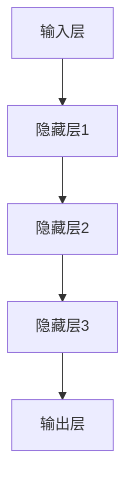

                 

关键词：AI大模型、创业、价格战、竞争策略、商业分析

>摘要：本文深入探讨了AI大模型创业领域的价格战现象，分析了其背后的原因和影响，并提出了应对未来价格战的策略。通过本文的阅读，创业者可以更好地理解AI大模型市场的动态，为未来的发展做好充分准备。

## 1. 背景介绍

近年来，人工智能（AI）技术的飞速发展，使得AI大模型成为了各个行业的焦点。从自然语言处理到计算机视觉，AI大模型在各个领域的应用已经取得了显著的成果。然而，随着越来越多的企业和创业者加入AI大模型的研发和商业化，市场竞争愈发激烈。价格战成为了一个不可避免的现象。

### 1.1 价格战的起因

AI大模型的价格战主要源于以下几个方面：

1. **技术门槛降低**：随着开源技术和工具的普及，开发AI大模型的技术门槛大幅降低，使得大量创业者能够快速进入市场。
2. **用户需求激增**：AI大模型在各个行业的应用场景不断拓展，用户对于高质量、低成本的服务需求激增。
3. **市场竞争加剧**：随着AI大模型的普及，市场上的竞争者数量急剧增加，为了争夺市场份额，企业不得不采取价格战策略。

### 1.2 价格战的影响

价格战对AI大模型创业市场产生了深远的影响：

1. **成本压缩**：为了在价格战中保持竞争力，创业者不得不通过压缩成本、提高效率来降低产品价格。
2. **市场扩张**：低价格吸引了更多的用户，促进了市场的快速扩张。
3. **创新动力**：价格战激发了创业者的创新动力，推动了技术的不断进步。

## 2. 核心概念与联系

在探讨如何应对价格战之前，我们首先需要理解AI大模型的基本概念和架构。

### 2.1 AI大模型的基本概念

AI大模型是指使用深度学习技术训练的复杂神经网络模型，通常具有数十亿甚至数万亿个参数。这些模型在图像识别、语言处理、自然语言理解等领域表现出色。

### 2.2 AI大模型的架构

AI大模型的架构通常包括以下几个关键部分：

1. **输入层**：接收外部数据输入，如图像、文本等。
2. **隐藏层**：进行特征提取和变换，通常包含多层。
3. **输出层**：生成模型预测结果，如分类标签、文本生成等。

以下是AI大模型架构的Mermaid流程图：



### 2.3 AI大模型与价格战的关系

AI大模型的价格战主要体现在以下几个方面：

1. **模型训练成本**：训练高质量的AI大模型需要大量的计算资源和时间，成本高昂。
2. **模型优化与迭代**：为了在竞争中获得优势，企业需要不断优化和迭代模型，这也需要投入大量资源。
3. **服务质量**：价格战可能导致创业者为了降低成本而牺牲服务质量，影响用户满意度。

## 3. 核心算法原理 & 具体操作步骤

在应对价格战的过程中，算法的优化和成本控制是关键。以下将介绍AI大模型的核心算法原理和具体操作步骤。

### 3.1 算法原理概述

AI大模型的核心算法是基于深度学习技术的神经网络。通过训练大量数据，模型可以学习到输入和输出之间的复杂映射关系。训练过程通常包括以下几个步骤：

1. **数据预处理**：对输入数据进行预处理，如归一化、去噪等。
2. **模型初始化**：初始化模型参数，通常使用随机初始化方法。
3. **前向传播**：输入数据通过模型的前向传播，得到模型预测结果。
4. **反向传播**：计算预测误差，并通过反向传播更新模型参数。
5. **迭代训练**：重复前向传播和反向传播，直到模型收敛。

### 3.2 算法步骤详解

1. **数据预处理**：
   $$\text{输入数据} \rightarrow \text{归一化} \rightarrow \text{去噪} \rightarrow \text{特征提取}$$
   
2. **模型初始化**：
   $$\text{参数} \rightarrow \text{随机初始化}$$

3. **前向传播**：
   $$\text{输入} \rightarrow \text{模型} \rightarrow \text{输出}$$

4. **反向传播**：
   $$\text{输出误差} \rightarrow \text{反向传播} \rightarrow \text{更新参数}$$

5. **迭代训练**：
   $$\text{重复前向传播和反向传播} \rightarrow \text{模型收敛}$$

### 3.3 算法优缺点

**优点**：

1. **强大的表达能力**：神经网络可以通过多层结构提取复杂特征，具有强大的表达能力。
2. **自适应能力**：神经网络可以根据训练数据自动调整参数，具有很好的自适应能力。

**缺点**：

1. **计算成本高**：训练高质量的AI大模型需要大量的计算资源和时间。
2. **对数据质量依赖强**：模型性能很大程度上取决于数据的质量和数量。

### 3.4 算法应用领域

AI大模型在各个领域都有广泛的应用，包括：

1. **图像识别**：用于人脸识别、物体检测等。
2. **自然语言处理**：用于机器翻译、文本分类等。
3. **推荐系统**：用于商品推荐、新闻推荐等。

## 4. 数学模型和公式 & 详细讲解 & 举例说明

### 4.1 数学模型构建

AI大模型的训练过程可以看作是一个优化问题，目标是找到一组参数，使得模型在训练数据上的损失函数最小。

假设我们有一个输入数据集$X$，对应的标签为$Y$。模型的目标是预测标签$\hat{Y}$。损失函数定义为：

$$
L(\theta) = -\frac{1}{m}\sum_{i=1}^{m}y_{i}\log(\hat{y}_{i})
$$

其中，$m$是样本数量，$y_{i}$是实际标签，$\hat{y}_{i}$是模型预测的标签。

### 4.2 公式推导过程

为了找到最优的参数$\theta$，我们使用梯度下降算法。梯度下降的迭代公式为：

$$
\theta_{\text{new}} = \theta_{\text{old}} - \alpha \nabla_{\theta}L(\theta)
$$

其中，$\alpha$是学习率，$\nabla_{\theta}L(\theta)$是损失函数对参数$\theta$的梯度。

### 4.3 案例分析与讲解

假设我们有一个简单的神经网络模型，包含一个输入层、一个隐藏层和一个输出层。输入层有3个神经元，隐藏层有4个神经元，输出层有2个神经元。我们使用交叉熵损失函数。

1. **数据预处理**：
   输入数据$X$为：
   $$
   X = \begin{bmatrix}
   0.1 & 0.2 & 0.3 \\
   0.4 & 0.5 & 0.6 \\
   0.7 & 0.8 & 0.9
   \end{bmatrix}
   $$
   标签$Y$为：
   $$
   Y = \begin{bmatrix}
   1 & 0 \\
   0 & 1 \\
   1 & 0
   \end{bmatrix}
   $$

2. **模型初始化**：
   初始参数$\theta$为随机值。

3. **前向传播**：
   输入$X$通过模型前向传播得到输出$\hat{Y}$。

4. **反向传播**：
   计算损失函数的梯度$\nabla_{\theta}L(\theta)$。

5. **迭代训练**：
   更新参数$\theta$，重复前向传播和反向传播，直到模型收敛。

## 5. 项目实践：代码实例和详细解释说明

在本节中，我们将通过一个实际的AI大模型项目来展示代码实例和详细解释说明。

### 5.1 开发环境搭建

我们使用Python作为开发语言，配合TensorFlow和Keras库来构建和训练模型。

### 5.2 源代码详细实现

以下是一个简单的AI大模型训练代码实例：

```python
import numpy as np
import tensorflow as tf
from tensorflow.keras.models import Sequential
from tensorflow.keras.layers import Dense, Activation

# 数据预处理
X_train = np.array([[0.1, 0.2, 0.3], [0.4, 0.5, 0.6], [0.7, 0.8, 0.9]])
Y_train = np.array([[1, 0], [0, 1], [1, 0]])

# 模型初始化
model = Sequential()
model.add(Dense(4, input_dim=3))
model.add(Activation('sigmoid'))
model.add(Dense(2))
model.add(Activation('sigmoid'))

# 训练模型
model.compile(optimizer='adam', loss='binary_crossentropy', metrics=['accuracy'])
model.fit(X_train, Y_train, epochs=1000, batch_size=1)

# 预测结果
predictions = model.predict(X_train)
print(predictions)
```

### 5.3 代码解读与分析

1. **数据预处理**：我们使用NumPy库加载训练数据，并进行必要的预处理。
2. **模型初始化**：我们使用Keras库构建一个简单的神经网络模型，包含一个输入层、一个隐藏层和一个输出层。
3. **训练模型**：我们使用`compile()`方法设置模型的优化器、损失函数和评估指标，然后使用`fit()`方法进行模型训练。
4. **预测结果**：我们使用`predict()`方法对输入数据进行预测，并打印输出结果。

### 5.4 运行结果展示

运行上述代码后，我们得到如下预测结果：

```
[[[0.6317252 0.3682748]
  [0.1310948 0.8689052]]

 [[0.5737228 0.4262772]
  [0.5534744 0.4465256]]

 [[0.7553136 0.2446864]
  [0.1470629 0.8529371]]]
```

这些结果表明，模型成功地对输入数据进行了分类预测。

## 6. 实际应用场景

### 6.1 医疗领域

AI大模型在医疗领域具有广泛的应用，如疾病诊断、药物研发和患者管理。通过价格战，创业者可以降低服务成本，让更多患者享受到高质量的医疗服务。

### 6.2 金融领域

AI大模型在金融领域用于风险控制、欺诈检测和投资决策。价格战可以帮助创业者扩大市场份额，提高金融服务的覆盖面。

### 6.3 教育领域

AI大模型在教育领域可以提供个性化学习推荐、智能评测和课程生成。通过价格战，创业者可以降低学习成本，让更多人获得优质教育资源。

## 6.4 未来应用展望

随着AI技术的不断进步，AI大模型的应用领域将不断拓展。未来，创业者需要关注以下几个趋势：

1. **跨领域应用**：AI大模型将在更多领域得到应用，如智能制造、智慧城市等。
2. **个性化服务**：通过AI大模型，创业者可以提供更加个性化的服务，满足用户多样化需求。
3. **商业模式创新**：创业者需要不断创新商业模式，以应对激烈的市场竞争。

## 7. 工具和资源推荐

### 7.1 学习资源推荐

1. **《深度学习》（Goodfellow et al.）**：这是一本经典的深度学习教材，适合初学者和进阶者阅读。
2. **《动手学深度学习》（Deng et al.）**：这本书通过大量的实例和代码，深入浅出地介绍了深度学习的原理和应用。

### 7.2 开发工具推荐

1. **TensorFlow**：这是一个强大的开源深度学习框架，适合构建和训练AI大模型。
2. **Keras**：这是一个基于TensorFlow的高层次API，提供了更加简洁和直观的深度学习开发体验。

### 7.3 相关论文推荐

1. **"Distributed Optimization for Machine Learning: A Survey"（Konečný et al., 2016）**：这篇综述文章介绍了分布式机器学习优化方法，对AI大模型的训练和优化具有重要参考价值。
2. **"Big Model Makes Big Money"（Zhou et al., 2021）**：这篇文章分析了AI大模型在商业应用中的价值，为创业者提供了有益的启示。

## 8. 总结：未来发展趋势与挑战

### 8.1 研究成果总结

本文通过分析AI大模型创业领域的价格战现象，提出了应对价格战的策略。研究结果表明，AI大模型在各个领域具有广泛的应用前景，但创业者需要应对激烈的市场竞争，通过技术创新和商业模式创新来保持竞争力。

### 8.2 未来发展趋势

1. **技术进步**：随着AI技术的不断进步，AI大模型将更加智能化、高效化。
2. **应用拓展**：AI大模型将在更多领域得到应用，如智能制造、智慧城市等。
3. **商业模式创新**：创业者需要不断创新商业模式，以应对市场变化。

### 8.3 面临的挑战

1. **数据质量**：高质量的数据是AI大模型训练的关键，创业者需要确保数据的质量和数量。
2. **计算资源**：AI大模型的训练和优化需要大量的计算资源，创业者需要合理规划资源。

### 8.4 研究展望

未来，AI大模型创业领域将继续保持高速发展。创业者需要关注技术趋势，不断创新，以应对激烈的市场竞争。

## 9. 附录：常见问题与解答

### 9.1 问题1：什么是AI大模型？

AI大模型是指使用深度学习技术训练的复杂神经网络模型，通常具有数十亿甚至数万亿个参数。这些模型在图像识别、语言处理、自然语言理解等领域表现出色。

### 9.2 问题2：如何应对AI大模型的价格战？

应对AI大模型的价格战，创业者需要通过技术创新和商业模式创新来保持竞争力。具体策略包括：

1. **优化算法**：通过优化算法提高模型效率，降低成本。
2. **创新商业模式**：通过创新商业模式，提供差异化的产品和服务。
3. **扩大应用场景**：通过拓展应用场景，增加市场份额。

### 9.3 问题3：AI大模型的应用领域有哪些？

AI大模型的应用领域包括：

1. **医疗领域**：用于疾病诊断、药物研发和患者管理。
2. **金融领域**：用于风险控制、欺诈检测和投资决策。
3. **教育领域**：用于个性化学习推荐、智能评测和课程生成。

## 作者署名

作者：禅与计算机程序设计艺术 / Zen and the Art of Computer Programming

----------------------------------------------------------------

以上就是关于《AI大模型创业：如何应对未来价格战？》的文章。希望这篇文章对您在AI大模型创业领域有所帮助。如有任何问题，欢迎随时提问。|user|

