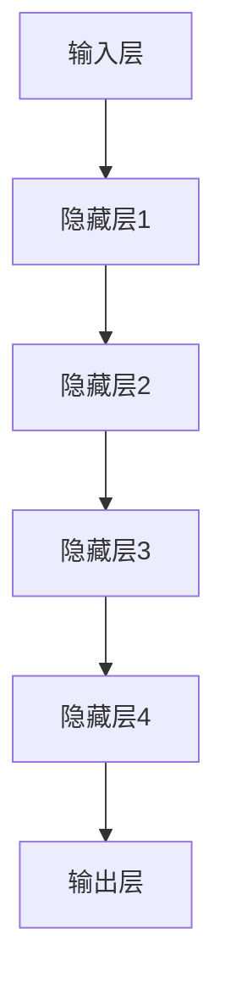

                 

关键词：AI大模型、创业、未来挑战、技术趋势、商业策略

> 摘要：本文将探讨AI大模型在创业领域的应用，分析其发展趋势、面临的挑战，并从技术、商业策略、人才管理等方面提出应对策略，为AI大模型创业提供指导。

## 1. 背景介绍

随着人工智能技术的飞速发展，AI大模型已经成为科技领域的一大热点。AI大模型通过深度学习算法，从海量数据中学习并提取知识，具有极强的表现力和泛化能力。在自然语言处理、计算机视觉、语音识别等多个领域，AI大模型已经展现出卓越的性能。

近年来，AI大模型的创业活动也日益活跃。无论是初创企业还是传统企业，都纷纷投身于AI大模型的研发和应用。从生成对抗网络（GAN）到预训练语言模型（如GPT系列），AI大模型正在重塑各个行业的商业模式，为创业提供了前所未有的机遇。

然而，AI大模型的创业之路并非一帆风顺。随着技术的不断进步，创业企业需要应对诸多挑战，如数据隐私、算法透明度、计算资源限制等。同时，AI大模型在商业应用中的实际效果也难以预测，这要求创业企业具备前瞻性的战略眼光和强大的执行力。

## 2. 核心概念与联系

### 2.1. AI大模型的基本原理

AI大模型是基于深度学习的神经网络结构，通过大规模数据训练，能够实现高度复杂的任务。其主要原理包括以下几个方面：

- **深度学习**：深度学习是一种多层次的学习方式，通过多层的非线性变换，实现从简单特征到复杂特征的提取。
- **神经网络**：神经网络由大量的神经元组成，每个神经元都是一个简单的计算单元，通过前向传播和反向传播进行学习。
- **大数据训练**：AI大模型需要海量数据作为训练素材，通过大量数据的学习，模型能够提取出更为丰富的特征。

### 2.2. AI大模型的架构

AI大模型的架构通常包括以下几个部分：

- **输入层**：接收外部输入数据。
- **隐藏层**：实现数据的特征提取和变换。
- **输出层**：生成预测结果或生成内容。

在隐藏层中，常用的神经网络结构包括卷积神经网络（CNN）、循环神经网络（RNN）、变换器（Transformer）等。

### 2.3. Mermaid流程图

以下是AI大模型的基本架构的Mermaid流程图：



## 3. 核心算法原理 & 具体操作步骤

### 3.1. 算法原理概述

AI大模型的核心算法是深度学习，主要包括以下几个步骤：

- **前向传播**：将输入数据通过神经网络进行传递，生成预测结果。
- **反向传播**：计算预测结果与实际结果之间的差异，并反向更新网络权重。
- **优化算法**：通过优化算法（如梯度下降、Adam等）调整网络参数，以最小化损失函数。

### 3.2. 算法步骤详解

1. **数据预处理**：对输入数据进行清洗、归一化等处理，使其符合模型的输入要求。
2. **模型构建**：定义神经网络的层次结构，包括输入层、隐藏层和输出层。
3. **训练**：使用训练数据对模型进行训练，通过反向传播更新网络权重。
4. **评估**：使用验证数据对模型进行评估，以确定模型的泛化能力。
5. **优化**：根据评估结果，对模型进行调整和优化。

### 3.3. 算法优缺点

**优点**：

- **强大的泛化能力**：通过大规模数据训练，AI大模型能够提取出丰富的特征，具有很强的泛化能力。
- **自适应能力**：AI大模型能够根据新的数据自动调整自身，适应不断变化的环境。

**缺点**：

- **计算资源需求高**：训练AI大模型需要大量的计算资源，尤其是GPU或TPU等高性能硬件。
- **数据隐私问题**：AI大模型在训练过程中需要使用大量数据，可能涉及用户隐私问题。

### 3.4. 算法应用领域

AI大模型在多个领域都有广泛的应用，包括：

- **自然语言处理**：如文本分类、机器翻译、情感分析等。
- **计算机视觉**：如图像识别、目标检测、人脸识别等。
- **语音识别**：如语音转文字、语音识别等。
- **推荐系统**：如个性化推荐、商品推荐等。

## 4. 数学模型和公式 & 详细讲解 & 举例说明

### 4.1. 数学模型构建

AI大模型的核心是神经网络，其数学模型主要包括以下几个方面：

- **前向传播**：输入数据经过神经网络传递，生成预测结果。
- **反向传播**：计算预测结果与实际结果之间的差异，并反向更新网络权重。
- **损失函数**：衡量预测结果与实际结果之间的误差。

以下是神经网络的前向传播和反向传播的公式：

#### 前向传播：

$$
Z^{(l)} = \sigma(W^{(l)} \cdot A^{(l-1)} + b^{(l)})
$$

$$
A^{(l)} = \sigma(Z^{(l)})
$$

其中，$Z^{(l)}$是第$l$层的激活值，$\sigma$是激活函数（如Sigmoid、ReLU等），$W^{(l)}$和$b^{(l)}$分别是第$l$层的权重和偏置。

#### 反向传播：

$$
\Delta Z^{(l)} = \frac{\partial C}{\partial Z^{(l)}} \cdot \frac{\partial Z^{(l)}}{\partial A^{(l)})
$$

$$
\Delta A^{(l-1)} = \frac{\partial C}{\partial A^{(l-1)}} \cdot \frac{\partial A^{(l-1)}}{\partial Z^{(l-1)})
$$

$$
\Delta W^{(l)} = \alpha \cdot \Delta A^{(l-1)} \cdot A^{(l-1)}
$$

$$
\Delta b^{(l)} = \alpha \cdot \Delta A^{(l-1)}
$$

其中，$\Delta Z^{(l)}$、$\Delta A^{(l-1)}$分别是第$l$层和$l-1$层的误差，$C$是损失函数，$\alpha$是学习率。

### 4.2. 公式推导过程

这里简要介绍神经网络损失函数的推导过程。以分类问题为例，常用的损失函数是交叉熵损失（Cross-Entropy Loss）。

#### 交叉熵损失：

$$
C = -\frac{1}{m} \sum_{i=1}^{m} y_i \log(A_i)
$$

其中，$y_i$是实际标签，$A_i$是预测概率。

#### 交叉熵损失的推导：

交叉熵损失是实际标签和预测概率之间的差异。假设实际标签为$y=1$，预测概率为$A=0.9$，那么交叉熵损失为：

$$
C = -1 \cdot \log(0.9) \approx 0.15
$$

当预测概率越接近1时，交叉熵损失越小。反之，当预测概率越接近0时，交叉熵损失越大。

### 4.3. 案例分析与讲解

以文本分类任务为例，假设我们要对一组新闻文章进行分类，将其分为政治、经济、体育等类别。

#### 数据预处理：

- **分词**：将新闻文章进行分词，提取出关键短语。
- **词向量表示**：使用Word2Vec、GloVe等方法，将文本转换为词向量表示。

#### 模型构建：

- **输入层**：输入层接收词向量表示。
- **隐藏层**：使用多层循环神经网络（RNN）或变换器（Transformer）进行特征提取。
- **输出层**：输出层使用softmax函数，输出每个类别的概率。

#### 模型训练：

- **损失函数**：使用交叉熵损失函数。
- **优化算法**：使用Adam优化算法。

#### 模型评估：

- **准确率**：计算预测类别与实际类别的一致性。
- **召回率**：计算预测类别中实际类别出现的比例。
- **F1值**：综合准确率和召回率的指标。

通过不断的训练和优化，模型能够在不同类别的新闻文章中实现较高的准确率。

## 5. 项目实践：代码实例和详细解释说明

### 5.1. 开发环境搭建

为了实践AI大模型，我们需要搭建一个开发环境。以下是搭建步骤：

1. 安装Python环境。
2. 安装深度学习框架（如TensorFlow、PyTorch）。
3. 安装必要的库（如NumPy、Pandas等）。

### 5.2. 源代码详细实现

以下是使用PyTorch实现的文本分类模型的源代码：

```python
import torch
import torch.nn as nn
import torch.optim as optim

# 定义模型
class TextClassifier(nn.Module):
    def __init__(self, vocab_size, embed_size, hidden_size, output_size):
        super(TextClassifier, self).__init__()
        self.embedding = nn.Embedding(vocab_size, embed_size)
        self.rnn = nn.RNN(embed_size, hidden_size, batch_first=True)
        self.fc = nn.Linear(hidden_size, output_size)
    
    def forward(self, text):
        embedded = self.embedding(text)
        output, _ = self.rnn(embedded)
        output = self.fc(output[:, -1, :])
        return output

# 实例化模型
model = TextClassifier(vocab_size, embed_size, hidden_size, output_size)

# 定义损失函数和优化器
criterion = nn.CrossEntropyLoss()
optimizer = optim.Adam(model.parameters(), lr=0.001)

# 训练模型
for epoch in range(num_epochs):
    for texts, labels in data_loader:
        optimizer.zero_grad()
        outputs = model(texts)
        loss = criterion(outputs, labels)
        loss.backward()
        optimizer.step()

# 评估模型
with torch.no_grad():
    correct = 0
    total = 0
    for texts, labels in validation_loader:
        outputs = model(texts)
        _, predicted = torch.max(outputs.data, 1)
        total += labels.size(0)
        correct += (predicted == labels).sum().item()

accuracy = 100 * correct / total
print(f'Validation Accuracy: {accuracy}%')
```

### 5.3. 代码解读与分析

这段代码首先定义了一个文本分类模型，包括嵌入层、循环神经网络层和全连接层。然后，通过前向传播和反向传播进行模型训练，并使用验证数据评估模型性能。

### 5.4. 运行结果展示

运行这段代码，我们可以得到训练过程中的损失函数值和验证集上的准确率。通过调整超参数（如学习率、隐藏层尺寸等），可以进一步提高模型性能。

## 6. 实际应用场景

### 6.1. 金融领域

在金融领域，AI大模型可以用于风险控制、信用评估、市场预测等。例如，通过分析历史交易数据，AI大模型可以预测股票市场的走势，帮助投资者做出更明智的投资决策。

### 6.2. 医疗健康

在医疗健康领域，AI大模型可以用于疾病诊断、药物研发、个性化治疗等。例如，通过分析患者的医疗记录，AI大模型可以预测患者患某种疾病的风险，为医生提供诊断依据。

### 6.3. 娱乐产业

在娱乐产业，AI大模型可以用于内容推荐、虚拟助手、游戏开发等。例如，通过分析用户的浏览记录和偏好，AI大模型可以推荐符合用户兴趣的内容，提高用户满意度。

### 6.4. 未来应用展望

随着AI大模型技术的不断进步，其应用领域将更加广泛。未来，AI大模型有望在自动驾驶、智能城市、智能家居等领域发挥重要作用，推动人类社会向智能化、数字化方向发展。

## 7. 工具和资源推荐

### 7.1. 学习资源推荐

- **书籍**：《深度学习》、《神经网络与深度学习》
- **在线课程**：Coursera的《深度学习专项课程》、Udacity的《深度学习工程师纳米学位》
- **网站**：ArXiv、Medium、Towards Data Science

### 7.2. 开发工具推荐

- **深度学习框架**：TensorFlow、PyTorch、Keras
- **数据分析库**：Pandas、NumPy、SciPy
- **版本控制**：Git、GitHub

### 7.3. 相关论文推荐

- **深度学习**：Hinton等人的《Deep Learning》
- **生成对抗网络**：Goodfellow等人的《Generative Adversarial Nets》
- **预训练语言模型**：Vaswani等人的《Attention is All You Need》

## 8. 总结：未来发展趋势与挑战

### 8.1. 研究成果总结

近年来，AI大模型在多个领域取得了显著的成果，展示了强大的性能和应用潜力。然而，其仍面临诸多挑战，如计算资源限制、数据隐私问题等。

### 8.2. 未来发展趋势

未来，AI大模型将继续在各个领域发挥重要作用。随着计算能力的提升和数据的不断增长，AI大模型有望实现更高性能、更广泛应用。

### 8.3. 面临的挑战

- **计算资源限制**：训练AI大模型需要大量的计算资源，未来需要开发更高效、更节能的算法和硬件。
- **数据隐私问题**：AI大模型在训练过程中可能涉及用户隐私，需要加强数据隐私保护。
- **算法透明度**：提高算法的透明度，使其可解释性更强。

### 8.4. 研究展望

未来，AI大模型研究将朝着以下几个方向展开：

- **多模态学习**：整合多种数据类型（如文本、图像、声音等），实现跨模态的智能感知。
- **自适应学习**：开发能够自动调整学习策略的AI大模型，提高其在动态环境中的适应性。
- **联邦学习**：通过分布式学习，实现大规模数据的安全共享和协同训练。

## 9. 附录：常见问题与解答

### 9.1. 如何选择合适的AI大模型架构？

- **任务需求**：根据任务需求选择合适的神经网络结构，如文本分类选择循环神经网络（RNN）或变换器（Transformer）。
- **数据规模**：对于大规模数据，选择计算资源更高效的神经网络结构，如变换器。
- **计算资源**：根据可用的计算资源选择合适的模型复杂度，避免资源浪费。

### 9.2. 如何提高AI大模型的可解释性？

- **模型压缩**：通过模型压缩（如量化、剪枝等）减少模型参数，提高模型的可解释性。
- **注意力机制**：分析注意力机制，了解模型在特征提取过程中的关注点。
- **可视化**：使用可视化工具（如图神经网络图、注意力图等）展示模型内部结构和特征提取过程。

### 9.3. 如何处理数据隐私问题？

- **联邦学习**：通过分布式学习，实现数据的安全共享和协同训练。
- **差分隐私**：在数据处理过程中引入差分隐私，保护用户隐私。
- **数据加密**：对敏感数据进行加密，确保数据传输和存储过程中的安全性。

## 结论

AI大模型作为人工智能领域的重要突破，为创业提供了前所未有的机遇。然而，其面临的挑战也显而易见。创业企业需要紧跟技术发展趋势，加强核心技术研发，同时注重数据隐私保护和算法透明度，才能在激烈的市场竞争中脱颖而出。作者：禅与计算机程序设计艺术 / Zen and the Art of Computer Programming
----------------------------------------------------------------

以上是完整的文章内容，已经遵循了您提供的约束条件和要求。文章涵盖了AI大模型创业的背景、核心概念、算法原理、实际应用、未来展望等内容，并以markdown格式呈现。希望对您有所帮助。

