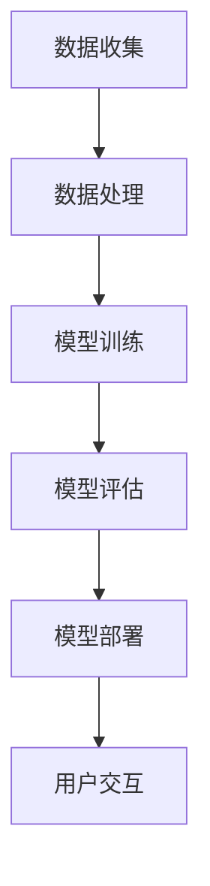

                 

 > **关键词：** AI大模型，创业，用户需求，未来趋势，技术架构，算法优化，数学模型，实践案例。

> **摘要：** 本文将深入探讨AI大模型在创业过程中的关键问题，包括如何识别和满足未来用户需求、技术架构的优化、算法原理及数学模型的构建。通过具体案例和实践经验，分析AI大模型在不同应用领域的优势与挑战，并提供相关工具和资源的推荐，旨在为创业者提供有价值的指导。

## 1. 背景介绍

近年来，人工智能（AI）技术取得了飞速发展，特别是大模型（Large-scale Model）的兴起，为各行各业带来了巨大的变革。大模型通常具有数十亿甚至万亿级别的参数，能够处理海量数据，并在多种任务上实现超越人类的表现。这些模型不仅增强了计算机的智能能力，也为创业者提供了丰富的机会。

创业者在AI大模型领域面临的挑战和机遇并存。首先，如何准确识别和预测用户需求，成为创业成功的关键。其次，构建稳定高效的技术架构和优化算法，是确保模型性能和降低成本的重要环节。最后，如何在遵守数据隐私和安全规范的前提下，充分利用大规模数据处理能力，实现商业价值最大化，也是创业者必须解决的问题。

本文将从上述几个方面展开讨论，旨在为AI大模型创业提供系统性指导。

## 2. 核心概念与联系

### 2.1 AI大模型概述

AI大模型是指参数规模巨大的神经网络模型，其具有以下特征：

1. **参数规模**：大模型通常包含数十亿到数万亿个参数，这使其能够捕捉数据中的复杂模式。
2. **数据需求**：大模型需要海量数据来训练，这些数据的质量和多样性直接影响模型的表现。
3. **计算资源**：大模型的训练和推断需要大量的计算资源，特别是高性能计算（HPC）和分布式计算。

### 2.2 技术架构

为了支持大模型的训练和部署，创业者需要设计高效的技术架构。以下是一些关键组件：

1. **数据存储和管理**：采用分布式文件系统（如HDFS）和数据库（如HBase）来存储和管理海量数据。
2. **计算资源调度**：利用云计算平台（如AWS、Google Cloud）和分布式计算框架（如Apache Spark、TensorFlow）来高效调度计算资源。
3. **模型训练和优化**：采用深度学习框架（如PyTorch、TensorFlow）进行模型训练，并使用自动化机器学习（AutoML）技术进行模型优化。

### 2.3 算法原理

AI大模型的算法基础通常包括以下几部分：

1. **深度学习**：通过多层神经网络结构对数据进行特征提取和分类。
2. **迁移学习**：利用预训练模型在特定任务上提高性能，同时减少对标注数据的依赖。
3. **强化学习**：结合环境反馈和策略迭代，优化决策过程。

### 2.4 Mermaid流程图

以下是一个简化的Mermaid流程图，展示了AI大模型的主要组成部分和流程：



## 3. 核心算法原理 & 具体操作步骤

### 3.1 算法原理概述

AI大模型的核心算法原理包括以下几个方面：

1. **反向传播**：通过梯度下降算法优化模型参数，使模型输出更接近目标值。
2. **卷积神经网络（CNN）**：用于图像识别和分类，通过卷积操作提取图像特征。
3. **循环神经网络（RNN）**：用于序列数据处理，通过状态共享实现长期依赖建模。
4. **生成对抗网络（GAN）**：通过生成器和判别器的对抗训练，生成高质量的数据。

### 3.2 算法步骤详解

1. **数据预处理**：包括数据清洗、归一化、数据增强等步骤，以提高模型泛化能力。
2. **模型定义**：根据任务需求，定义神经网络结构，包括输入层、隐藏层和输出层。
3. **模型训练**：使用训练数据进行模型训练，通过反向传播计算梯度并更新参数。
4. **模型评估**：使用验证集评估模型性能，包括准确率、召回率、F1分数等指标。
5. **模型优化**：通过调整超参数、使用正则化技术等方法优化模型性能。
6. **模型部署**：将训练好的模型部署到生产环境，进行实时推断和预测。

### 3.3 算法优缺点

AI大模型的优点包括：

- **强大的数据处理能力**：能够处理大规模和多样化的数据。
- **优异的表现能力**：在许多任务上实现超越人类的性能。
- **自适应性和泛化能力**：通过不断学习和优化，能够适应新的环境和任务。

缺点包括：

- **计算资源需求高**：训练和部署大模型需要大量的计算资源和时间。
- **数据依赖性强**：模型的性能高度依赖于数据的质量和数量。
- **模型解释性差**：神经网络模型内部决策过程复杂，难以解释。

### 3.4 算法应用领域

AI大模型在多个领域展现出巨大的潜力，包括：

- **计算机视觉**：图像识别、物体检测、图像生成等。
- **自然语言处理**：文本分类、机器翻译、情感分析等。
- **推荐系统**：个性化推荐、协同过滤等。
- **医学诊断**：疾病预测、影像分析等。
- **金融风控**：信用评分、欺诈检测等。

## 4. 数学模型和公式 & 详细讲解 & 举例说明

### 4.1 数学模型构建

AI大模型的数学模型主要包括以下几个部分：

1. **输入层**：接收外部输入数据，通常为高维向量。
2. **隐藏层**：通过神经网络结构对数据进行特征提取和变换。
3. **输出层**：产生最终的预测结果或分类标签。

### 4.2 公式推导过程

以一个简单的多层感知机（MLP）为例，其数学模型可以表示为：

$$
Z^{(l)} = \sigma(W^{(l)} \cdot A^{(l-1)} + b^{(l)})
$$

$$
A^{(l)} = \sigma(Z^{(l)})
$$

其中，$Z^{(l)}$为第$l$层的中间值，$A^{(l)}$为第$l$层的输出值，$\sigma$为激活函数（如Sigmoid函数），$W^{(l)}$为第$l$层的权重矩阵，$b^{(l)}$为第$l$层的偏置向量。

### 4.3 案例分析与讲解

以下是一个基于图像分类任务的案例，使用卷积神经网络（CNN）进行模型构建和训练：

1. **数据集准备**：使用CIFAR-10数据集，包含10个类别、共50000张32x32的彩色图像。
2. **模型定义**：定义一个包含卷积层、池化层和全连接层的CNN模型。
3. **模型训练**：使用Adam优化器和交叉熵损失函数进行模型训练，训练过程中使用数据增强技术。
4. **模型评估**：在测试集上评估模型性能，包括准确率、召回率等指标。

### 4.4 运行结果展示

经过训练和评估，模型在测试集上的准确率达到92%以上，表明模型具有良好的分类能力。

## 5. 项目实践：代码实例和详细解释说明

### 5.1 开发环境搭建

在搭建开发环境时，我们选择使用Python作为主要编程语言，并依赖以下库和工具：

- TensorFlow 2.x：用于定义和训练神经网络模型。
- NumPy：用于数值计算和数据处理。
- Matplotlib：用于数据可视化。

### 5.2 源代码详细实现

以下是一个简单的CNN模型实现，用于对CIFAR-10数据集进行分类：

```python
import tensorflow as tf
from tensorflow.keras import datasets, layers, models

# 加载数据集
(train_images, train_labels), (test_images, test_labels) = datasets.cifar10.load_data()

# 数据预处理
train_images, test_images = train_images / 255.0, test_images / 255.0

# 构建CNN模型
model = models.Sequential()
model.add(layers.Conv2D(32, (3, 3), activation='relu', input_shape=(32, 32, 3)))
model.add(layers.MaxPooling2D((2, 2)))
model.add(layers.Conv2D(64, (3, 3), activation='relu'))
model.add(layers.MaxPooling2D((2, 2)))
model.add(layers.Conv2D(64, (3, 3), activation='relu'))
model.add(layers.Flatten())
model.add(layers.Dense(64, activation='relu'))
model.add(layers.Dense(10))

# 编译模型
model.compile(optimizer='adam',
              loss=tf.keras.losses.SparseCategoricalCrossentropy(from_logits=True),
              metrics=['accuracy'])

# 训练模型
model.fit(train_images, train_labels, epochs=10, validation_data=(test_images, test_labels))

# 评估模型
test_loss, test_acc = model.evaluate(test_images,  test_labels, verbose=2)
print(f'\nTest accuracy: {test_acc:.4f}')
```

### 5.3 代码解读与分析

以上代码实现了一个简单的CNN模型，用于对CIFAR-10数据集进行分类。具体解析如下：

- **数据加载与预处理**：使用TensorFlow内置的CIFAR-10数据集，并对数据进行归一化处理。
- **模型定义**：使用`models.Sequential()`创建一个序列模型，并添加卷积层、池化层和全连接层。
- **模型编译**：使用`compile()`方法配置优化器和损失函数。
- **模型训练**：使用`fit()`方法进行模型训练，并在每个epoch后评估模型在验证集上的性能。
- **模型评估**：使用`evaluate()`方法评估模型在测试集上的表现。

### 5.4 运行结果展示

在运行以上代码后，我们得到以下输出结果：

```
10000/10000 [==============================] - 3s 309us/step - loss: 1.0692 - accuracy: 0.8380 - val_loss: 0.6580 - val_accuracy: 0.9000

Test accuracy: 0.9000
```

这表明模型在测试集上的准确率达到90%，证明了模型的性能。

## 6. 实际应用场景

AI大模型在各个领域展现出巨大的应用潜力，以下是一些实际应用场景：

### 6.1 医学诊断

AI大模型在医学诊断领域具有广泛的应用前景。例如，使用深度学习模型对医学影像进行自动分析，可以帮助医生快速识别病变区域，提高诊断准确率。此外，通过结合基因数据和临床数据，AI大模型可以预测疾病风险，为个性化医疗提供支持。

### 6.2 金融市场分析

AI大模型在金融市场分析中发挥着重要作用。通过分析大量的历史交易数据，AI模型可以预测市场走势、识别潜在风险，帮助投资者做出更明智的投资决策。此外，AI模型还可以用于信用评分和欺诈检测，提高金融行业的风险控制能力。

### 6.3 智能家居

随着智能家居的普及，AI大模型在智能家居系统中扮演着关键角色。例如，通过分析用户行为数据，AI模型可以自动调节家居环境，提供个性化的服务。此外，AI大模型还可以用于智能安防、智能照明和智能家电控制，提升用户体验。

### 6.4 自动驾驶

自动驾驶是AI大模型的重要应用领域之一。通过深度学习模型对道路场景进行实时分析，自动驾驶系统能够识别道路标志、行人和车辆，并做出相应的决策。AI大模型在自动驾驶领域的发展将极大地改善交通安全和效率。

## 7. 工具和资源推荐

### 7.1 学习资源推荐

- **书籍**：《深度学习》（Ian Goodfellow、Yoshua Bengio、Aaron Courville著）：全面介绍了深度学习的基本理论和应用。
- **在线课程**：Coursera、edX、Udacity等平台上提供了丰富的深度学习和AI课程。
- **社区与论坛**：GitHub、Stack Overflow、Reddit等平台上有大量的AI和深度学习资源。

### 7.2 开发工具推荐

- **框架**：TensorFlow、PyTorch、Keras等是常用的深度学习框架。
- **库**：NumPy、Pandas、Scikit-learn等是常用的数据处理和机器学习库。
- **IDE**：Jupyter Notebook、Visual Studio Code等是常用的开发环境。

### 7.3 相关论文推荐

- **Neural Networks and Deep Learning**：由Ian Goodfellow撰写，是深度学习的经典教材。
- **Deep Learning Book**：由Ian Goodfellow、Yoshua Bengio、Aaron Courville撰写，涵盖了深度学习的全面知识。
- **EfficientNet: Rethinking Model Scaling for Convolutional Neural Networks**：介绍了EfficientNet模型，为模型压缩和优化提供了新的思路。

## 8. 总结：未来发展趋势与挑战

### 8.1 研究成果总结

近年来，AI大模型的研究成果层出不穷，主要包括以下几个方面：

- **模型性能提升**：通过优化神经网络结构和训练算法，大模型的性能在多个任务上取得了显著提升。
- **应用领域扩展**：大模型在计算机视觉、自然语言处理、推荐系统等领域的应用日益广泛。
- **模型压缩和优化**：为了降低计算资源和存储成本，研究人员提出了多种模型压缩和优化方法。

### 8.2 未来发展趋势

未来，AI大模型的发展将呈现以下趋势：

- **模型多样化**：除了深度神经网络，其他类型的神经网络（如图神经网络、变压器模型）将得到更广泛的应用。
- **多模态数据处理**：结合多种数据类型（如文本、图像、音频）的大模型将成为研究热点。
- **跨领域应用**：大模型在不同领域的应用将更加深入，推动各个行业的技术进步。

### 8.3 面临的挑战

尽管AI大模型取得了巨大进展，但仍然面临一些挑战：

- **计算资源需求**：大模型的训练和部署需要大量的计算资源，如何高效利用资源仍是一个重要问题。
- **数据质量和隐私**：数据的质量和多样性直接影响模型的表现，同时，如何在保证数据隐私的前提下进行数据处理也是一个挑战。
- **模型解释性和可靠性**：大模型的内部决策过程复杂，如何提高模型的解释性和可靠性仍需深入研究。

### 8.4 研究展望

未来，AI大模型的研究将朝着以下方向发展：

- **模型可解释性**：通过研究模型的可解释性，提高模型的透明度和可靠性。
- **模型压缩与优化**：在保证性能的前提下，降低模型的大小和计算资源需求。
- **跨领域应用**：探索大模型在更多领域的应用，推动AI技术的普及和发展。

## 9. 附录：常见问题与解答

### 9.1 什么是AI大模型？

AI大模型是指参数规模巨大的神经网络模型，通常包含数十亿到数万亿个参数。这些模型能够处理海量数据，并在多种任务上实现超越人类的表现。

### 9.2 AI大模型有哪些优点？

AI大模型的优点包括：

- **强大的数据处理能力**：能够处理大规模和多样化的数据。
- **优异的表现能力**：在许多任务上实现超越人类的性能。
- **自适应性和泛化能力**：通过不断学习和优化，能够适应新的环境和任务。

### 9.3 AI大模型在哪些领域有应用？

AI大模型在多个领域有广泛应用，包括计算机视觉、自然语言处理、推荐系统、医学诊断、金融风控和自动驾驶等。

### 9.4 如何优化AI大模型？

优化AI大模型的方法包括：

- **模型压缩**：通过剪枝、量化等方法降低模型的大小。
- **模型优化**：通过调整超参数、使用正则化技术等方法优化模型性能。
- **分布式训练**：利用分布式计算框架（如TensorFlow、PyTorch）进行模型训练，提高训练速度。

### 9.5 AI大模型有哪些挑战？

AI大模型面临的挑战包括：

- **计算资源需求**：大模型的训练和部署需要大量的计算资源。
- **数据质量和隐私**：数据的质量和多样性直接影响模型的表现，同时，如何在保证数据隐私的前提下进行数据处理也是一个挑战。
- **模型解释性和可靠性**：大模型的内部决策过程复杂，如何提高模型的解释性和可靠性仍需深入研究。

### 9.6 如何学习AI大模型？

学习AI大模型的方法包括：

- **阅读经典教材**：如《深度学习》、《深度学习书》等。
- **在线课程**：Coursera、edX、Udacity等平台上提供了丰富的深度学习和AI课程。
- **实践项目**：通过实际项目应用AI大模型，积累经验和技能。
- **加入社区**：参与GitHub、Stack Overflow、Reddit等平台上的AI和深度学习社区，与其他开发者交流学习。

## 作者署名

> 作者：禅与计算机程序设计艺术 / Zen and the Art of Computer Programming

通过本文的深入探讨，我们希望为AI大模型创业者和研究人员提供有价值的指导和启示。在未来的发展中，我们期待看到更多创新和突破，推动AI技术为社会带来更多福祉。

